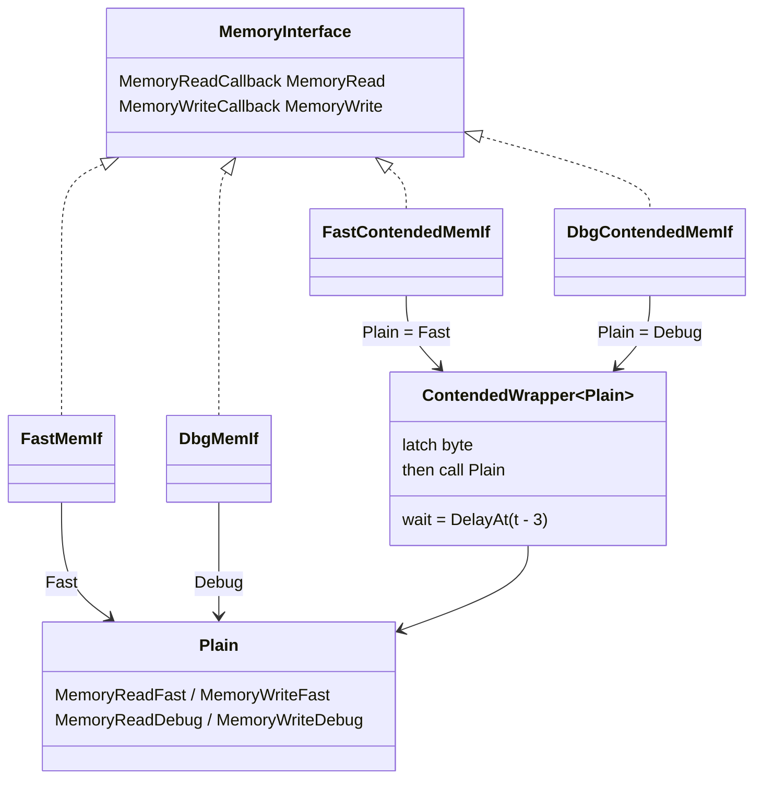
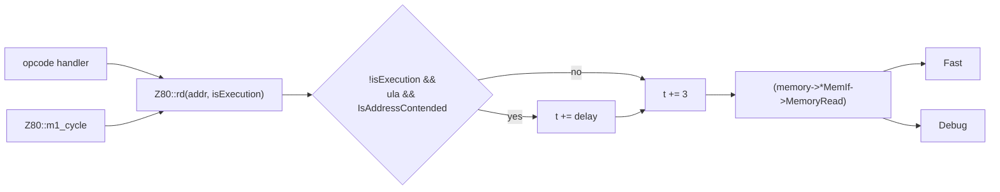
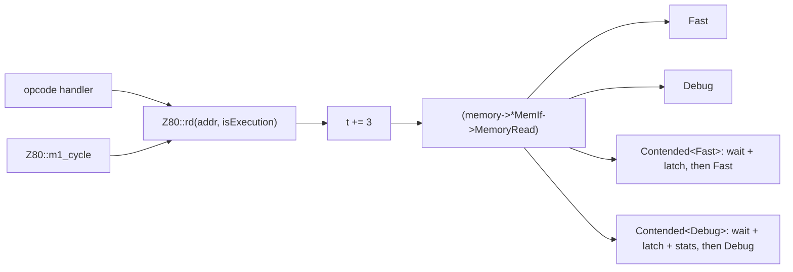
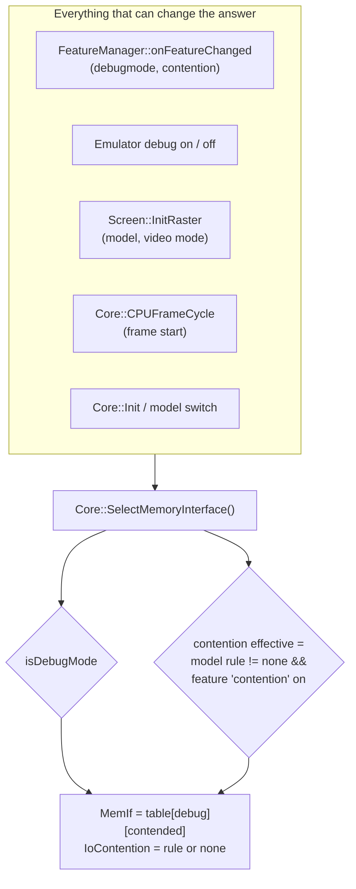

# Contended opcode fetches without a cost for machines that have no contention

**Date:** 2026-09-28 · **Status:** phases 1b and 1c implemented (revision 2: reuse analysis, shared wrappers,
control and diagnostics, test suites) · **Tracks:** PLAN #59; open item 2 of the contention notes ("M1 opcode fetches
from contended RAM not contended"). Test programs and emulated-side test design:
[test-programs.md](test-programs.md).

## 1. Terms

| Term | Meaning |
|:--|:--|
| Contention | The video logic (Ferranti ULA on the 48K / 128K / +2, Amstrad gate array on the +2A / +3) owns the memory bus while it reads the screen; a CPU access to the same memory in that time waits a few T-states. |
| Contended memory | The RAM pages behind the video logic: page 5 at #4000 and odd pages at #C000 on the 128K, pages 4-7 in any slot on the +2A / +3. |
| M1 | The opcode fetch cycle: the first memory access of every instruction (4 T: 3 T bus read + 1 T decode / refresh). |
| MREQ cycle | A memory access: M1 fetches, data reads, data writes. Only these are contended on the +2A / +3. |
| No-MREQ cycle | An internal CPU cycle that puts an address on the bus without accessing memory (e.g. the extra cycles of `INC (HL)`). The 48K / 128K ULA contends these too; the gate array does not. |
| Hot path | The code run on every memory access: `Z80::rd`, `Z80::wd`, the M1 fetch. |
| Bus interface | `MemoryInterface` (`core/src/emulator/memory/memory.h`): the pair of member-function pointers every CPU memory access goes through (`FastMemIf` / `DbgMemIf` today). |
| Plain / contended interface | A bus interface without / with the contention wait in front of the access. |

## 2. The problem

On a real 48K, 128K, +2, +2A or +3 the CPU waits on **every** access to contended memory while the
screen is drawn, the opcode fetch included. In unreal-ng only data reads and writes wait:
`Z80::rd` skips the check for fetches (`!isExecution`, `core/src/emulator/cpu/z80.cpp`). `isExecution` is
set for every byte read at PC - the opcode, prefixes, immediate operands, displacements and jump
addresses - so the whole instruction stream is exempt, not only the M1 cycle. So code that runs from
contended memory runs faster than on the real machine:

- The BASIC area, the system variables and the region right after the screen (#5B00-#7FFF) are
  contended. Loaders, raster effects and small routines often live there.
- Raster effects (multicolor, border stripes, floating-bus sync) are counted in T-states with the fetch
  waits included; without them they drift or tear.
- Custom tape loaders running from contended RAM measure pulse lengths with those waits built into their
  constants; a tight turbo loader can misread a tape.
- Timing test suites (FUSE, z80test timings) disagree on such code.
- The +2A / +3 floating bus shows the last contended byte: fetches are part of it and are missing today
  (`LatchContendedByte` is only called from data accesses).

Adding the check to the fetch the obvious way (one more `ula && IsAddressContended(addr)` in the M1 path)
costs every machine something on its most frequent access, including the Pentagon, Scorpion, ATM, Profi
and TS-Config families that have no contention at all. The data path already pays this today: every
`rd` / `wd` on a Pentagon loads `pUlaContention`, loads `_contentionEnabled` and branches, only to find
contention off; every `in` / `out` calls the out-of-line `GetIOContentionDelay`.

## 3. Requirements

| # | Requirement |
|:--|:--|
| R1 | Machines without contention pay nothing for it: no contention test on the memory, fetch or port path. Measured, not assumed (§9). |
| R2 | On contended machines the M1 fetch waits like any other MREQ access: the ULA pattern on the 48K / 128K / +2, the gate array pattern and slot rule on the +2A / +3. |
| R3 | Data accesses keep their exact T-state placement: every existing contention, raster and TTD test passes unchanged, except the one assertion that encodes the bug (§8.1). |
| R4 | The choice follows the machine at run time: model change, a video mode that turns contention on or off, debugger on / off, the contention switch (R8), and single-step paths (tests, the debugger's step) that bypass the frame loop. |
| R5 | The debug path (breakpoints, access tracker, TTD journal) works with and without contention: four combinations. |
| R6 | Deterministic: the waits are a function of the T-state and the mapping only; nothing new goes into snapshots or TTD blobs; the switch cannot change while a TTD recording is running. |
| R7 | Separate test suites for the contended path, for contended vs uncontended comparison, for negative cases and for per-model regressions (§8); emulated-side test programs covering every platform ([test-programs.md](test-programs.md)); a benchmark gate for R1 (§9). |
| R8 | Control and diagnostics from every surface (CLI, WebAPI, Lua, Python, MCP, Qt), from one source, gated: a switch that only applies where the machine has contention, and statistics that cost nothing unless the debugger is on. |
| R9 | The two new interfaces hold only the difference from the plain ones: one wrapper per direction, no copy of the fast or debug access code. |

Non-goals here (later phases, §10): no-MREQ contention of internal cycles, multi-point I/O contention,
ULA snow.

## 4. What we already have, and what happens to each piece

Three things in the tree already deal with contention. None of them is a mechanism for choosing the bus:
one is the rules model, one is a different CPU's hook, and the selection glue is spread over four places.

| Piece | Where | What it does | Verdict |
|:--|:--|:--|:--|
| **`UlaContention`** | `core/src/emulator/video/ulacontention.h/.cpp`, owned by `Core`, `context->pUlaContention` | The rules: ULA and gate array patterns, onset (`kContentionLeadT`), per-slot contended flags (filled by `Memory::UpdateSlotContention` on paging), I/O rules (48K / 128K C:1 / C:3), floating bus (Ferranti, discrete, Scorpion attribute, gate array latch), raster snapshot pushed by `Screen::InitRaster` | **Keep and extend.** The rules are right and tested (76 tests in `contention_test.cpp`, `memory_contention_test.cpp`, `io_contention_test.cpp`). What is wrong is *where they are asked*: from `Z80::rd` / `wd` on every machine. Extensions: `DelayAt(t)` (the wait for an access that started at `t`), a slot-only inline test for the wrappers, the diagnostic status (§7) and debug-only counters. |
| **unreal-z80 wait-state hook** | `core/src/3rdparty/unreal-z80` (`Z80CpuSetContendFn`), used only by the General Sound coprocessor | One hook per bus cycle, `(addr, kind)` with kinds `M1`, `Operand`, `Read`, `Write`, `PortIn`, `PortInPost`, `PortOut`, `PortOutPost`; a null hook means no contention | **Do not adopt the mechanism, adopt the vocabulary.** The hook is a `contend != nullptr` test on every bus cycle: the same branch this design removes, and it belongs to a different CPU. Its access kinds are the right names for the statistics (§7.2) and for phase 2 / 3 (no-MREQ = an `Idle` kind, the I/O pre / post checkpoints). |
| **Selection glue** | `Core::UseFastMemoryInterface` / `UseDebugMemoryInterface`, `Core::CPUFrameCycle`, `FeatureManager::onFeatureChanged`, `Emulator` debug on / off (`emulator.cpp`) | Picks `FastMemIf` or `DbgMemIf` from `isDebugMode`, in four places with their own if / else | **Replace** with one selector, `Core::SelectMemoryInterface()`, that every one of those places calls. |
| **Diagnostics today** | `DeviceState` screen report (`contention: active / none` from `Screen`'s raster state); the memory-map views of the CLI, WebAPI, Lua and Python | The screen report is right. The memory maps **hard-code** "bank 1 contended, others not" | **Replace** the hard-coded flags with the per-slot flags from `UlaContention` (the maps are wrong today for odd pages at #C000 on the 128K, every +2A / +3 all-RAM layout, and the Pentagon, which they report as contended). |

So nothing is thrown away: `UlaContention` stays the single owner of the rules and grows a little; the
new part is *where* the rules run (the bus interface) and *who* picks the bus (one selector).

Side note, not in scope: `Z80::rd` / `wd` / `in` / `out` also test `busTraceHook` on every access; it is
a test hook that could move to the debug interface the same way.

## 5. Options

| Option | Idea | Cost for non-contended machines | Change size | Verdict |
|:--|:--|:--|:--|:--|
| A. One more branch in the fetch | `rd(pc, true)` also tests `IsAddressContended` | one more load + branch on every fetch, on every machine | tiny | Rejected: violates R1, and the data path's existing branch stays |
| B. Template the CPU on a timing policy | `Z80Step<ContendedBus>` / `Z80Step<FreeBus>`, picked per frame | zero | every opcode table (`op_noprefix.cpp`, `op_cb.cpp`, `op_ed.cpp`, `op_ddcb.cpp`, ...) becomes a template: two copies of the whole instruction set | Rejected: doubles the largest code in the core for one decision |
| C. A second frame loop for contended machines | `Z80FrameCycle` vs `Z80FrameCycleContended` | zero in the loop itself | the waits happen inside the opcode handlers' `rd` / `wd`, not in the loop; a second loop alone removes nothing, and making it work needs B | Reduces to B or E |
| D. Adopt the unreal-z80 hook shape | `contend` function pointer tested on every bus cycle | one load + branch per access, as today | medium | Rejected: keeps the cost R1 removes |
| **E. Contention as a bus interface** | the contention check moves out of `Z80::rd` / `wd` into two more `MemoryInterface`s; one selector picks one of four | **less than today**: the branch in `rd` / `wd` goes away, the indirect call stays as it is | small: 2 wrapper templates, 1 selector, `rd` / `wd` lose code | **Proposed** |

Option E is the "other fetch / main loop" the request asks for, placed where it can act: the selector
picks the bus the CPU runs on, and the bus decides whether an access waits.

## 6. Proposal: four bus interfaces, one selector

### 6.1 The interfaces are the plain ones plus one wrapper

| Interface | Read | Write | Picked when |
|:--|:--|:--|:--|
| `FastMemIf` | `MemoryReadFast` | `MemoryWriteFast` | no debugger, no effective contention (Pentagon and all clones; switch off) |
| `DbgMemIf` | `MemoryReadDebug` | `MemoryWriteDebug` | debugger, no effective contention |
| `FastContendedMemIf` | `MemoryReadContended<&Memory::MemoryReadFast>` | `MemoryWriteContended<&Memory::MemoryWriteFast>` | no debugger, contention effective |
| `DbgContendedMemIf` | `MemoryReadContended<&Memory::MemoryReadDebug>` | `MemoryWriteContended<&Memory::MemoryWriteDebug>` | debugger and contention effective |

The two new interfaces contain no access code of their own (R9). One template per direction holds the
whole difference, and it is instantiated over the plain function it wraps:

```cpp
// memorycontended.cpp - the only contention code on the access path
template <MemoryReadCallback Plain>
uint8_t Memory::MemoryReadContended(uint16_t addr, bool isExecution)
{
    if (!_contentionUla->IsSlotContended(static_cast<uint8_t>(addr >> 14)))
        return (this->*Plain)(addr, isExecution);

    _contentionCpu->InsertWaitStates(_contentionUla->DelayAt(_contentionCpu->AccessStartT()));
    const uint8_t value = (this->*Plain)(addr, isExecution);
    _contentionUla->LatchContendedByte(value);  // +2A/+3 floating bus: the last contended byte
    return value;
}

template <MemoryWriteCallback Plain>
void Memory::MemoryWriteContended(uint16_t addr, uint8_t value)
{
    if (_contentionUla->IsSlotContended(static_cast<uint8_t>(addr >> 14)))
    {
        _contentionCpu->InsertWaitStates(_contentionUla->DelayAt(_contentionCpu->AccessStartT()));
        _contentionUla->LatchContendedByte(value);
    }
    (this->*Plain)(addr, value);
}
```



Notes:

- `&Memory::MemoryReadFast` is a pointer to a virtual function, so `ScorpionMemory`'s override is still
  honored, exactly as through `FastMemIf` today.
- The wrapper tests the slot flag only: the interface is chosen only when contention is effective, so
  `_contentionEnabled` needs no second look. `_contentionUla` and `_contentionCpu` are cached in `Memory`
  by `Core::Init` (`Memory::SetContentionDependencies`). `Z80::AccessStartT()` is `(tt - 3 * rate) >> 8`:
  the start of the access in progress, exact for any CPU rate; `Z80::InsertWaitStates` is the CPU's own
  cycle step.
- The debug statistics of §7.2 live in the `Plain = Debug` instantiation only (`if constexpr` on the
  template argument), so `FastContendedMemIf` carries no counter either.
- `isExecution` no longer excludes anything: the M1 fetch goes through the same function and waits like
  a data read (R2). The +2A / +3 rules need nothing new: the slot flags and `DelayAt` already follow the
  gate array.

### 6.2 What happens to `Z80::rd` / `Z80::wd`

Today:



Proposed:



`rd` and `wd` lose their contention block: a Pentagon access becomes `t += 3` plus the indirect call it
already makes. For a contended machine the order of events is the same: today `rd` adds the wait, then
3 T, then reads; the new path adds 3 T, then the wrapper adds the wait computed for the access's start
(`t - 3`), then reads. The byte is read or written at `start + wait + 3` in both cases, so the screen
renderer, the breakpoints and the TTD journal see the same T-state (R3).

### 6.3 One selector



- `Core::SelectMemoryInterface()` replaces `UseFastMemoryInterface()` / `UseDebugMemoryInterface()`;
  the four existing call sites call it instead of choosing themselves.
- `Screen::InitRaster` calls it after pushing the contention flags, so a test that creates a machine and
  calls `Z80Step` directly already runs on the right bus (R4).
- Turbo mode does not change contention; the Pentagon-style machines have the rule `none` and always get
  a plain interface.

### 6.4 Ports

`Z80::in` / `Z80::out` call `GetIOContentionDelay` on every machine today. The selector also sets the
port rule pointer, `IoContention` (`nullptr` for none and for the gate array, a 48K or 128K rule
otherwise). Pentagon ports then cost one predictable pointer test instead of an out-of-line call. Port
accesses are two to three orders of magnitude rarer than memory accesses; the point is one place for the
rule, not speed.

## 7. Control and diagnostics (implemented in phase 1c)

### 7.1 The switch

A feature in `FeatureManager`, so every surface that lists and sets features gets it with no new code:
CLI `feature`, WebAPI `/features`, Lua, Python, MCP (`invoke_api`); the Qt menu has
**Machine > Memory Contention**.

| Field | Value |
|:--|:--|
| id / alias | `contention` / `cont` |
| default | on |
| meaning | on = the machine's hardware rule; off = run a contended machine uncontended (A/B comparison, diagnosis) |
| effective | `on && the machine has a rule` (`Core::IsContentionEffective`) - on the Pentagon and the other clones the switch changes nothing and the report says `applicable: false` |
| gating | any change is refused while the machine is bound to a TTD timeline (recording, replay, positioned in history): it changes timing, so a timeline replays only with the setting it was recorded with. The Qt action is disabled in that state |
| on change | `onFeatureChanged` → `Core::SetContentionSwitch` → `SelectMemoryInterface()` |

### 7.2 The report and the statistics

`DeviceState::Contention` builds one report; every surface serves it unchanged:

| Field | Source | Example (128K, page 7 at #C000, debugger on) |
|:--|:--|:--|
| `rule`, `applicable` | `UlaContention::GetRule` | `ula128`, `true` (`none`, `ula48`, `ula128`, `gatearray`) |
| `switch`, `effective` | feature, `Core::IsContentionEffective` | `on`, `true` |
| `memory_interface` | `Core::GetMemoryInterfaceName` | `debug_contended` |
| `io_rule` | `Z80::ioContention` | `ula128` |
| `slots[4]` | `range`, `mapping`, `contended` = `Core::IsSlotContended` | slot 1 and 3 contended |
| `floating_bus_latch` | +2A / +3 only | - |
| `statistics` (debugger only) | counters in the Debug instantiation of the wrapper and in `in` / `out` | `current_frame`, `last_frame`, `total`, each per kind `fetch` / `read` / `write` / `io` (`accesses`, `wait_t`) and summed |

Surfaces: CLI `state contention`, WebAPI `GET /api/v1/emulator/{id}/state/contention` (and the
active-emulator form), Lua / Python `contention_state()`, MCP `inspect_state` aspect `contention` (with a
one-line summary). The screen report's `contention` flag is the effective one. Every memory map (CLI
`state memory`, `paging`, WebAPI memory state and paging, Lua / Python `paging_state`) reads its
`contended` flags from `Core::IsSlotContended` instead of hard-coding "slot 1".

Gating: the fast interfaces carry no counter (the wrapper's statistics are an `if constexpr` of the Debug
instantiation); without the debugger the report's `statistics` is a string saying so. The fetch kind
covers every byte read at PC (opcode, prefixes, operands): the memory interface cannot tell M1 from an
operand read, and phase 2's no-MREQ cycles will add their own kind.

## 8. Tests

The tests are split into separate suites, each with one question. An **independent oracle** is used
throughout: a test helper computes the expected wait from `ContentionRaster` and the published pattern
tables (FUSE / faqwiki for the ULA, the consensus table in `ulacontention.h` for the gate array), not by
calling `UlaContention`, so a bug in the rules cannot confirm itself. The programs that run on the
emulated Z80 (the "probe" suite that also runs on real hardware) are designed in
[test-programs.md](test-programs.md).

| Suite (file) | Question | Cases |
|:--|:--|:--|
| **A. `ContendedFetch_Test`** (`contention_test.cpp`) | Does M1 wait where the hardware waits? | Parameterized over {48K, 128K, +2, +2A, +3} × cell offset 0-7: `NOP` at #4000 = 4 + oracle. First and last cell of a line; first and last paper line. #4000 and #7FFF edges. 128K pages 1/3/5/7 at #C000 wait, 0/2/4/6 do not. +2A / +3 pages 4-7 at #0000, #4000, #8000, #C000 in the all-RAM layouts. Prefixes: `CB`, `ED`, `DD`, `FD` = two contended M1s; `DD CB d op` = two M1s + operand reads (the 4th byte is not M1). Instruction and data both in contended RAM (`LD A,(HL)` at #4000, HL in #4000-#7FFF): both wait. +2A / +3 floating bus after a contended fetch shows the opcode, bit 0 set. |
| **B. `ContentionAB_Test`** (`contentionab_test.cpp`) | Does contention change time and nothing else? | The same program run twice on the same model, switch on and off: (1) code and data in uncontended RAM → identical T, registers, memory; (2) code in contended RAM → registers and memory identical, T differs by exactly the oracle's sum of waits; (3) FUSE vectors (`testdata/z80/fuse`) replayed on the 48K with the vector's code at #4000: every MREQ `MC` event gets the oracle wait, the whole bus trace (`busTraceHook`) must match the shifted reference. |
| **C. `ContentionNegative_Test`** (`contentionnegative_test.cpp`) | Where must nothing happen? | Pentagon, Scorpion, Profi, ATM710, ATM3: plain interface selected, `NOP` at #4000 in the paper = 4 T, the switch changes nothing and the status says `not applicable`. Contended model, switch off: plain interface, no waits, latch unchanged. Border, blanking, 1 T before onset, after the last cell: no M1 wait. ROM never waits (48K ROM at #0000, +3 ROM layouts). +2A / +3: no I/O contention, no wait for internal cycles. Switch change during TTD recording refused, interface unchanged. |
| **D. `MemoryInterfaceSelection_Test`** (`core_test.cpp`) | Is the right bus selected after every change? | The 4 × 4 transition table (debug on / off × contention on / off) through each caller: feature change, `Emulator` debug on / off, model switch contended ↔ Pentagon ↔ contended, video mode change, `CPUFrameCycle`. After a model switch no stale `_ula` / `_cpu` pointer is used (ASan build in CI). |
| **E. `ContendedDebugPath_Test`** (`memorycontended_test.cpp`) | Does the debug path see contended accesses once and at the right T? | Read / write / execute breakpoint in contended RAM fires once, at `start + wait + 3`. The access tracker counts one access per M1 (no double count from the wrapper). Statistics: `M1` / `Read` / `Write` counts and wait T for a known program equal the oracle; no statistics without the debugger. TTD record and replay on the 48K with code in contended RAM: bit-exact. |
| **F. `ContentionRegression_Test`** (`contentionregression_test.cpp`) | Did any model change where it must not? | Parameterized over every creatable model (`GET /api/v1/emulator/models`): frame length in T unchanged; a fixed timing program run from #8000 and from #4000 for N instructions, total T compared to a **golden fingerprint recorded before the change** (committed with the tests): the uncontended machines and every #8000 run must match exactly; only the contended machines' #4000 run may differ, and by the oracle only. Data-access golden traces (code in uncontended RAM, data in contended RAM) on 48K / 128K / +3, recorded before the change: identical after it (R3). |
| **G. `ContentionStatus_Test`** (`devicestate_test.cpp`) | Is the diagnostic truthful on every surface? | Status per model and layout (128K page 7 at #C000 → slot 3 contended; Pentagon → none; +3 all-RAM layout 1 → all four slots). The memory maps' `contended` flags equal `slots`. CLI, WebAPI, Lua and Python return the same object (the existing parity pattern of the automation tests). |
| **H. `ContentionProbe_Test`** (`contentionprobe_test.cpp`) | Do the emulated-side probe programs report the reference results on every platform? | The probe suite of [test-programs.md](test-programs.md) run on every creatable model; results read from its result table in RAM and compared with the committed per-model expectations. |

### 8.1 Existing tests

- Every test in `contention_test.cpp`, `memory_contention_test.cpp`, `io_contention_test.cpp`,
  `int_timing_test.cpp`, `scorpionraster_test.cpp`, the FUSE phase tests and the TTD suites must pass
  unchanged.
- One test encodes the bug and changes on purpose: `MemoryContention_Test.ZX48k_rdNoContentionForExecutionFetch`
  becomes `ZX48k_rdContendsExecutionFetch` with the inverted expectation.
- TTD fixtures: the Pentagon-family fixtures must replay bit-exact without re-recording (a regression
  check in itself); fixtures recorded on a contended model with code in contended RAM are re-recorded,
  and the list is written down in the commit.
- The tape-sweep results for the 48K / 128K are re-run and the differences listed.

All suites run without frames or ROM boot except the TTD, probe and golden-fingerprint cases, which say
so in a comment (the project's 50 ms rule).

## 9. Performance gate (R1)

Measured before and after with the existing benchmarks, Release build, same machine; the numbers go into
this folder before the code lands.

| Benchmark | Machine | Expected |
|:--|:--|:--|
| `BM_FrameCostNormal` (`core/benchmarks/emulator/turbo_frame_benchmark.cpp`) | Pentagon | equal or faster: the branch in `rd` / `wd` is gone |
| `BM_FrameCostNormal` | 48K | reported: the wrapper call on contended machines |
| `BM_ContentionInstructionMix` (`core/benchmarks/emulator/contention_benchmark.cpp`) | Pentagon, 48K, +3 × code at #8000 / #6000 | Pentagon equal or faster; baseline in [baseline.md](baseline.md) |
| `BM_TTD_MemIf_*` (`core/benchmarks/debugger/ttd/memory_interface_microbenchmark.cpp`) | - | extended to the four interfaces; `FastMemIf` unchanged |

The merge criterion is the Pentagon frame cost within noise of today or better.

## 10. Phases

1. **Bus interfaces and M1 contention** (this proposal): §6-§9.
2. **No-MREQ contention (48K / 128K / +2 only):** internal cycles that put a contended address on the
   bus (`INC (HL)`, `LDIR` repeat, `JR` offset, `EX (SP),HL`, ...) wait per the ULA's per-cycle table.
   A third bus function, `Idle(addr, n)`, whose plain version is `t += n`; same selection, same zero cost
   for the clones; suite B's FUSE replay extends to the contend-only `MC` events.
3. **Multi-point I/O contention** (the C:1 / C:3 checkpoints, the unreal-z80 `PortIn` / `PortInPost`
   pair) in the 48K / 128K port rules.

## 11. Risks

| Risk | Handling |
|:--|:--|
| A path that changes the machine or the debugger mode and does not call the selector | all such paths go through `SelectMemoryInterface()`; suite D covers every caller |
| Stale `_ula` / `_cpu` in `Memory` after a model change | set with the other dependencies on init and model change; suite D under ASan |
| The debug wrapper double-counts or shifts the tracker's timestamps | the wrapper adds the wait and calls the plain function, which keeps its own counting; suite E |
| Real software on the Sinclair models changes timing | that is the fix; suites F and H and the tape sweep record exactly what changed |
