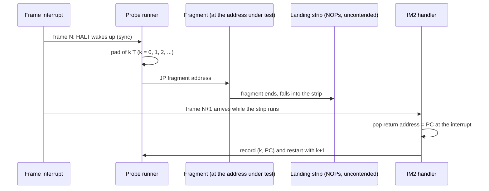
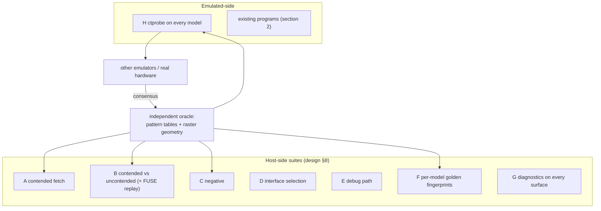

# Contention test programs: what exists, and a probe suite that runs on the emulated Z80

**Date:** 2026-09-28 · **Status:** research + proposal · **Belongs to:** [design.md](design.md) §8
(suite H) · PLAN #61.

The host-side suites of the design (A-G) check the emulator from the outside: they read `t` and the bus
trace. This document covers the other side: Z80 programs that measure contention *from inside the
machine*. Such a program checks the same thing on unreal-ng, on other emulators and on real hardware, so
its expected results can be taken from a consensus of references rather than from our own code.

## 1. Terms

| Term | Meaning |
|:--|:--|
| Probe | A Z80 program that measures how long a code fragment takes, in T-states, using only what the machine offers (the interrupt, the stack). |
| PC sampling | The measuring trick: the frame interrupt arrives at a fixed T-state; the interrupt handler reads the return address the CPU pushed, which says which instruction was running when the interrupt came. |
| Pad | A delay of an exact, adjustable number of T-states run before the fragment, used to move the fragment relative to the interrupt one T-state at a time. |
| Landing strip | A run of `NOP`s in uncontended memory after the fragment: 4 T each, so the sampled PC inside it converts to elapsed time. |
| Cell offset | The position of a T-state inside the 8 T screen cell; the ULA wait depends on it (6,5,4,3,2,1,0,0). |

## 2. Test programs and data that exist

Survey of 2026-09-28. The single index of the community test programs is the ZX Spectrum tests wiki
(<https://github.com/redcode/ZXSpectrum/wiki/Tests>); the whole collection is also one archive on the
zxe.io depot (`ZX Spectrum - Tests (2025-07-19).7z`). Every program keeps its own license. Entries marked
*unverified* were named by sources but not opened.

### 2.1 Already in the repository

| File | What it is | Use for contention | Used today |
|:--|:--|:--|:--|
| `testdata/z80/fuse/tests.in`, `tests.expected` (FUSE, GPL-2.0+) | 1356 opcode cases with full bus traces: 7844 `MC` (memory contention checkpoint) and 79 `PC` (port checkpoint) events | **Where** every instruction is checked for contention, with address and T-state: M1, data and the internal (no-MREQ) cycles (`INC (HL)`: two extra `MC` on `HL`). FUSE runs them with zero delay, so they give the checkpoints, not the waits; one `PC` per port access, so no C:1 / C:3 shape. | `fuse_phase_test.cpp` checks the data events; the `MC`-only cycles are dropped (`contendOnlyCycles`), so the internal-cycle checkpoints are **not asserted** yet. |
| `testdata/loaders/sna/Timing_Tests-48k_v1.0.sna` (Richard and Tim Butler) | 48K timing suite: 35 instruction groups in contended and uncontended memory, early / late ULA detection, floating bus (tests 36-37, and the port reads of 35) | M1 + data contention on the 48K, with a machine-readable failure text ("Test N R= loop= sp=") | Only a load smoke test (`loader_sna_test.cpp`): **never run to completion** |
| `core/tests/z80/z80test/*`, `z80full.sna`, `z80flags.sna` (Rak z80test, MIT) | Flag / CRC tests | none (no timing in any variant) | `Z80TestVerification.*` |
| ZEXALL (`data/testsoft/ZEXALL`, Profi copy), Block Flags Test | Instruction exercisers | none | - |
| `data/testsoft/AccuracyCoinZX/*`, `IntTest+.sna/.tap`, `test4.30.sna`, `hardware test 2005-01-16.tap`, `zx-diagnostics.rom` | Origin *unverified* | unknown / low | TTD corpus, tape sweep |

### 2.2 Downloadable, machine-checkable

| Program | Where | License | Machines | What it measures | Automation |
|:--|:--|:--|:--|:--|:--|
| **Timing Test v0.3**, Patrik Rak (after Bobrowski's zxtests) | zxe.io depot, `Timing Test v0.3 (2013-12-09)(Rak, Patrik)`; originally zxds.raxoft.cz | GPL, source included | 48K, 128K / +2, +2A / +3 (published expected screens each); Pentagon gives flat numbers | frame length; **contended `NOP` at `#7FFF` (M1)**; the snow `NOP` (`LD I,A`); `IN` on `#00FE`, `#00FF`, `#7FFE`, `#7FFF`, `#FFFE`, `#FFFF` (**all I/O patterns**); `RET` in a banked page at `#C000` | Grid of durations per start T; call its timing routine from the host and compare with the published tables. **Best single fit.** |
| **fusetest**, Philip Kendall | FUSE SVN mirror (`github.com/vamposdecampos/fuse-emulator-svn`, `fusetest/`); spectrumcomputing entry 32100 | GPL | 48K / 128K / +3 / Pentagon, per-test mask | **memory contention**, **high-port contention** (two parts), contended `IN`, **`LDIR` at the contention edge**, floating bus, `#7FFD` / `#BFFD` / `#3FFD` reads, some flags | "passed / failed (code) / skipped" text; each routine returns Z = pass. Source only (pasmo Makefile). |
| **Timing Tests 128K v1.0**, R. and T. Butler (2015) | zxe.io depot (`.szx`) | none stated | 128K / +2 (written on a late-timing +2; real early machines fail tests 4, 17, 18, 26, 33) | contended timing groups | Same failure text as the 48K one. Needs an SZX loader or a `.z80` copy. |
| **Floating Spy v0.33**, Ramsoft | zxe.io depot | none stated | 48K, 128K | floating bus at exact T across 8 lines | self-test prints an error count |
| **HALT2INT v3**, Mark Woodmass | `github.com/redcode/Z80/wiki/HALT2INT` | GPL-2 | 48K, 128K | `R` at interrupt acceptance after `HALT`: interrupt timing + **HALT fetch contention** + floating bus | on-screen values; screen compare |
| EIHALT, Super HALT Invaders, Woodmass | `github.com/oldbit-com/Spectron/tree/main/tests/Files` (reference screens in `Results/`) | not stated | 48K / 128K | `EI` / `HALT` / interrupt acceptance | reference-screen compare |
| minfo, Jan Bobrowski (2025) | `torinak.com/~jb/zx/minfo.tap` | not stated | 48K (128K *unverified*) | frame / INT timing, contention | numeric screen; format *unverified* |

A ready harness pattern for the Butler tests exists (MrKWatkins' EmulatorTestSuites: reads `R`, the loop
count and `SP` against embedded expectations).

### 2.3 Visual references (screen / photo compare)

| Program | Machines | Covers |
|:--|:--|:--|
| **IR Contention** / **IR Contention 128**, Woodmass (2023) | 48K / 128K, +2 | contention of the refresh (`IR`) cycle: M1 + snow territory; closest to phase 1-2 |
| **48K NEC Contention Test Suite**, Woodmass (2008) | 48K | `R`, `IR`, `LDIR` / `LDDR`, `CPIR`, `INIR`, `OTIR`: the block-repeat internal cycles of phase 2 |
| **IO Contend**, Woodmass (2021) | 48K / 128K | multi-point I/O contention (phase 3), reference GIF |
| Contention, Woodmass (2005) | 128K (48K by editing BASIC) | contended / uncontended flag per T |
| ULA 48 Simple / ULA 128 Timing / **ULA 128E +3**, azesmbog (2012) | 48K / 128K / **+2A, +3** | contention pattern, NMOS / CMOS reference GIFs and real-machine photos; use the 2012-10-07 build of the +3 test |
| Float48K / Float128K / **Float+3** / FloatFFD, Woodmass; **+2A/+3 Floating Bus Test** v1.2, Hikaru | 48K / 128K / +2A, +3 | floating bus, incl. the +2A / +3 latch rule |
| +2A/+3 Paging Tests, Woodmass (2026) | +2A / +3 | paging |
| btime / stime / ulatest3 (zxtests-3), Bobrowski | 48K / 128K | border / screen timing, floating bus |

Not found: dedicated suites from SpecEmu, Spectaculator, ZEsarUX, Retro Virtual Machine or MAME; a
"48K ULA test" by Chris Smith. SingleStepTests (Harte) has per-cycle bus states but no contention.
Games commonly cited as floating-bus dependent (Arkanoid, Cobra, Short Circuit, Terra Cresta, A Yankee in
Iraq on the +2A) are *unverified* except Sidewize.

### 2.4 What to take

| Step | Action | Covers |
|:--|:--|:--|
| 1 | The contended replay of design suite B - done in phase 1d for the gate array (`memorycontended_test.cpp`). Asserting FUSE's `MC`-only checkpoints needs the core to report internal cycles, which is phase 2's `Idle` bus function; it lands there, with the ULA replay | where M1 / data / internal cycles are checked, every opcode |
| 2 | Run the Butler 48K snapshot already in the tree to completion and read its failure text | 48K M1 + data |
| 3 | Vendor **Rak Timing Test v0.3** and **fusetest** (both GPL, sources available) under `testdata/contention/`, run them in suite H | 48K, 128K / +2, +2A / +3, Pentagon; M1, `IN` patterns, banked pages, floating bus |
| 4 | Keep the Woodmass / azesmbog programs as screen-compare references for phase 2 / 3 and the +2A / +3 floating bus | visual cross-check |

The probe suite of section 3 fills what these do not: every placement and layout (128K pages at `#C000`,
+2A / +3 all-RAM layouts), the prefix and `DDCB` cases, the negative cases on the Scorpion, Profi and
ATM, and one machine-readable result table for all of them.

### 2.5 What phase 1e runs today

`core/tests/emulator/video/contentionprobe_test.cpp`; the long runs are opt-in with `UNREAL_TIMING_SUITES=1`,
like the tape sweep.

**Butler, Timing Tests 48K v1.0** (in the tree). Needed a loader fix first: a 48K `.sna` on the 48K model
selected ROM page 3 - empty on a one-ROM machine - so the program ran into `RST 38` and never started
(`LoaderSNA::applySnapshotFromStaging` now maps the model's 48K BASIC ROM; `LoaderSNA48KRom_Test`). The program
reports "TYPE1 (Early) timings detected". Results with phase 1:

| | Contention on | Contention off |
|:--|:--|:--|
| Uncontended tests (1-35) | 34 pass (35 fails: see below) | 30 pass (the port tests 22, 32-34 fail: the switch removes I/O contention too) |
| Contended tests (1-35) | all fail, but move towards the hardware: test 1 loop 1036 vs 1014 (1201 uncontended), test 2 583 vs 571 (657) | all fail at the uncontended counts |

Every contended group also has internal cycles the 48K ULA contends (phase 2) or port cycles with the
multi-point pattern (phase 3). **After phase 2** (internal cycles): 68 of 70 pass with contention on - every
test but 35; test 1 contended reads R=74 loop=1014 SP=23296, the hardware values. **Now 72 of 72** (the
suite has 37 tests: 36 and 37 are contended-only floating-bus runs): test 35's port reads become the next
port's high byte, and they read a Kempston mouse (fitted on the standard 48K; the runner now runs a bare
48K), the Beta 128 FDC outside TR-DOS (now gated) and a floating bus that was switched off (`FloatBus=0`) and
2 T late - all fixed (TODO.md, "Floating bus"). Default run: test 1 only (`ButlerTest1MovesTowardsTheHardware`, ~130 ms),
pinning the hardware value 1014 since phase 2; opt-in: all 37 tests in both switch settings (~14 s).

**Rak, Timing Test v0.3** (vendored, `testdata/contention/rak-timing-test/`). Each test prints 160 durations,
one per start T-state; the reference grids are transcribed from the published result screens.

| Model | Matches the reference |
|:--|:--|
| 48K early | 0 contended NOP, 2 `IN #00FE`, 3 `#00FF`, 4 `#7FFE`, 5 `#7FFF`, 6 `#FFFE`, 7 `#FFFF` |
| 128K early | 0 contended NOP, 2 `#00FE`, 4 `#7FFE`, 5 `#7FFF`, 8 page RET |
| +3 | 0 contended NOP, 4 `#7FFE` (no I/O contention), 8 page RET |

Before phase 3 the 48K `#7FFE` / `#7FFF` and 128K `#00FE` / `#7FFE` differed (single-point I/O contention,
and an extra T on every 128K even port); the matrix pinned them as known differences until they flipped.

**Found with it: the +2A/+3 gate array window is 129 T, not 128.** The +3 contended NOP differed in its last
row only: offset 128 after the first contended T still waits 1 T (NOP = 5). The references disagree:

| Source | Window | Offset 128 |
|:--|:--|:--|
| Fuse, MAME, BizHawk (ZXHawk), ZXMAK2, ZEsarUX, Xpeccy | 128 T (the Ferranti ULA's, reused) | 0 |
| Rak Timing Test v0.3 on a real +3 (photo, 2023) and a real +2A (photo, 2025), redcode wiki "Timing-Test", "Results on real hardware" | 129 T | 1 |
| The published expected screen (zxe.io) | 129 T | 1 |

None of the emulators cites +3-specific evidence for the end of the window; two independent machines agree
with each other and with the expected screen, so the model follows the hardware: the gate array's pattern opens
with a 1 T hold before the first fetch cell and closes with one after the last (`UlaContention::
ComputeContentionDelay`; `ContentionPlus3_Test.WindowEndsOneTAfterTheLastCell`; the FUSE replay's oracle uses
129 T). The 128K Ferranti ULA reference ends at 128 T, as modelled.

Default run: the 48K contended NOP (`ContendedNop48KMatchesTheHardware`, ~1 s: ROM boot + tape) - the
end-to-end check of M1 contention against a hardware reference. Opt-in: the 14-case matrix; a case listed as
differing must still differ, so the phase that fixes it fails the test and moves it to the matching list.

Not done: fusetest (source only, needs pasmo or a prebuilt tape), the Butler 128K suite (`.szx`).

## 3. The probe suite (`ctprobe`)

**Status (2026-09-28): v2.** `testdata/contention/ctprobe/`, host suite `ctprobe_test.cpp`.
- 40 cases match the oracle to the T-state on the 48K, 128K, +3, Pentagon and Scorpion.
- The reference files `ctprobe.tap` and `ctprobe.trd` run standalone and print a report. Loaded the way a user
  does, they report every value as expected on all five machines.
- 3.7 covers the design and what is still open.

### 3.1 How a probe measures one fragment

> **Superseded by the engine in 3.7.** The scheme below has a flaw: `HALT` wakes on a 4 T boundary of its
> own NOP stream, so the wake-up phase is only known to 4 T and carries over from the previous run. That
> phase depends on the length of the fragment just measured, so the calibration run does not cancel it.

1. **Sync.** `EI; HALT` wakes at the frame interrupt. Every supported frame length is a multiple of 4 T
   (48K 69888, 128K / +2 / +2A / +3 70908, Pentagon 71680, Scorpion 69888), so the wake-up phase
   against the 4 T `HALT` quantum repeats from frame to frame and the sync is deterministic.
2. **Pad.** A pad of exactly `k` T-states: a table of instruction sequences from uncontended memory
   (4 T `NOP`, 5 T `RET NC` not taken, 6 T `INC HL`, 7 T `LD A,n`, ...), so any `k` ≥ 4 has an exact
   sequence, and runs of them stay 1 T apart.
3. **Fragment.** The runner copies the fragment to the address under test (`#4000`, `#7FFE`, `#C000`
   with page 7 mapped, `#0000` in a +3 all-RAM layout, ...), ending in a `JP` to the landing strip.
4. **Sample.** The next frame interrupt enters an IM2 handler (vector table in uncontended memory);
   the handler pops the return address and stores it with `k`.
5. **Sweep.** Repeat with `k + 1`, `k + 2`, ... The sampled PC moves one `NOP` further every 4 T of
   delay; the `k` at which it steps tells the fragment's length to one T-state.
6. **Calibrate.** Run the same sweep with an empty fragment (only the `JP`) at an uncontended address;
   the fragment's cost is the difference, so the runner, the sync and the handler cancel out.

The measurement does not depend on how long the handler or the runner take, only on where the interrupt
lands, so it works unchanged when the runner itself sits in contended memory (the +2A / +3 layout where
all four slots are contended).

Resolution and cost: 1 T; about 8-16 pad steps per fragment and 2 frames per step, so a fragment costs
16-32 frames (0.3-0.6 s of emulated time; a few milliseconds in turbo mode on the host).

### 3.2 What the program reports

| Where | Content | Read by |
|:--|:--|:--|
| Result table in RAM at a fixed address (`#BE00`) | magic `CTPR`, format version, detected machine, number of cases, and per case: id, measured T, expected T, pass flag | the host test (suite H) with no screen parsing |
| Screen | one line per case group: name, `ok` / `FAIL`, measured vs expected on failure | a person running it on real hardware or another emulator |
| Border | green all passed, red any failed | a glance / a photo from a real machine |
| `DONE` flag in the table | set when the run ends | the host test's stop condition (no fixed frame count) |

### 3.3 Machine detection and expectations

The probe detects the machine itself, which is also a test of the detection-relevant timing:

| Measurement | 48K | 128K / +2 | +2A / +3 | Pentagon | Scorpion | Profi / ATM |
|:--|:--|:--|:--|:--|:--|:--|
| Frame length (sampling over a whole frame) | 69888 | 70908 | 70908 | 71680 | 69888 | model value |
| `NOP` at `#4000`, cell offset 0 | 4 + 6 | 4 + 6 | 4 + 1 | 4 | 4 | 4 |
| Paging present (`#7FFD` write readable back as the page at `#C000`) | no | yes | yes | yes | yes | yes |
| `#1FFD` special paging | no | no | yes | no | yes (other meaning) | - |

The pair (frame length, rule) selects the expectation table: `ula48`, `ula128`, `gatearray` or `none`.
The host can also force a table by writing its id to a config byte before starting, for machines the
detection cannot tell apart.

Expectations are computed by the probe from the rule's pattern table and the measured frame geometry
(the same independent oracle as the host suites), so one table per rule covers all its models.

### 3.4 Cases, by phase

The case list follows the design's phases. Each case says where the fragment runs and at which cell
offsets it is measured; "all" means offsets 0-7 of one cell plus one cell of another line.

**Phase 1: M1 and data accesses**

| Id | Fragment and placement | Machines | Checks |
|:--|:--|:--|:--|
| M1-01 | `NOP` at `#4000`, all offsets | all | fetch waits the pattern; none on clones |
| M1-02 | `NOP` at `#4000` in the border and in the blanking | all | no wait outside the paper |
| M1-03 | `NOP` at `#4000` 1 T before the first contended T, and after the last cell of a line | ULA, GA | onset and line end |
| M1-04 | `LD A,n` with the opcode at `#7FFF`, operand at `#8000` | all | M1 contended, operand not |
| M1-05 | `CB 00`, `ED 44`, `DD 23`, `FD 23` at `#4000` | all | both M1 cycles of a prefixed opcode wait |
| M1-06 | `DD CB 00 06` at `#4000` | all | two M1s wait; the displacement and 4th byte are reads, not M1 |
| M1-07 | `DD DD DD 00` at `#4000` | all | each prefix is an M1 |
| M1-08 | `NOP` at `#C000` with pages 0-7 mapped in turn | 128K, +2, +2A, +3, clones | odd pages wait on the ULA; pages 4-7 wait on the gate array; nothing on clones |
| M1-09 | `NOP` at `#0000`, `#4000`, `#8000`, `#C000` in all-RAM layouts 0-3 | +2A, +3 | pages 4-7 wait in any slot, pages 0-3 never |
| M1-10 | `HALT` at `#4000`, released by the interrupt | all | the 4 T halt fetches wait (reference: FUSE, ZXMAK2) |
| M1-11 | `IN A,(C)` with `BC` = `#0FFD` between screen fetches, the `IN` itself fetched from contended RAM | +2A, +3 | `#0FFD` shows the fetched opcode, bit 0 set |
| D-01 | `LD A,(HL)` / `LD (HL),A` from `#8000`, `HL` = `#4000`, all offsets | all | data waits unchanged (regression) |
| D-02 | `LD A,(HL)` at `#4000`, `HL` = `#4000` | all | fetch and read both wait |
| D-03 | `PUSH BC` / `POP BC` / `CALL` / `RET` with `SP` in `#4000`-`#7FFF` | all | stack accesses wait |
| D-04 | `LDI` / `LDIR` source and destination in contended RAM | all | per-access waits (the repeat's internal cycles are phase 2) |
| D-05 | IM1 and IM2 acknowledge with `SP` in contended RAM | all | the two pushes wait |

**Phase 2: internal (no-MREQ) cycles** — same cases on `ula48` / `ula128`, expected zero on the gate array

| Id | Fragment | Checks |
|:--|:--|:--|
| N-01 | `INC (HL)` / `DEC (HL)` / `SET 0,(HL)` with `HL` in contended RAM | the 1 T internal cycle on `HL` waits |
| N-02 | `JR` / `DJNZ` at `#4000` | the 5 internal cycles on the offset address wait |
| N-03 | `EX (SP),HL` with `SP` in contended RAM | the internal cycles on `SP` wait |
| N-04 | `ADD HL,BC`, `INC BC`, `LD SP,HL` with `I` = `#40` | the cycles that put `IR` on the bus wait (the reason `I` must not point at `#40`-`#7F` on the 48K) |
| N-05 | `LDIR` / `CPIR` repeat cycles in contended RAM | the 5 repeat cycles on `DE` / `HL` wait |
| N-06 | `(IX+d)` instructions with `IX + d` contended and `PC` contended | the 5 internal cycles on `PC` wait |

**Phase 3: ports**

| Id | Fragment | Checks |
|:--|:--|:--|
| P-01 | `IN A,(C)` / `OUT (C),A` with `BC` = `#00FE`, `#40FE`, `#00FF`, `#40FF`, `#80FF` | the four C:1 / C:3 patterns (high byte contended or not × even or odd port) on `ula48` / `ula128`; none on the gate array and clones |
| P-02 | `IN A,(#FF)` sampled across a line | floating bus: pixel, attribute and idle bytes at the right T (Ferranti), `#FF` on the gate array, the attribute on Scorpion |
| P-03 | `IN A,(#0FFD)` paging unlocked / locked | the +2A / +3 floating bus only while unlocked |

**Negative cases, run on every machine**

| Id | Checks |
|:--|:--|
| X-01 | On `none` machines every case above reports zero waits |
| X-02 | ROM fetches never wait (a probe fragment in ROM: `RET` at a known ROM address, called from the runner) |
| X-03 | Uncontended pages in contended-looking slots never wait (128K page 2 at `#C000`, +3 page 3 at `#0000`) |
| X-04 | Register and memory results of every case equal those of the calibration run: contention changes time only |

### 3.5 Where it runs, and how it is packaged

| Package | For | How |
|:--|:--|:--|
| Source (`testdata/contention/ctprobe/*.asm`) | everything | assembled by the in-tree `Z80TextAssembler` (ORG, EQU, DB / DW / DS) at test time: no external assembler, no committed binaries to drift from the source |
| Host test (suite H) | unreal-ng, every creatable model | the test assembles the probe, writes it into RAM, sets `PC`, runs in turbo mode until the `DONE` flag, reads the result table, compares with the rule's expectations |
| `.tap` with a BASIC loader | 48K, 128K, +2, +2A, +3, clones with a tape port | written by a tool script from the assembled bytes, for real hardware and other emulators |
| `.trd` | Pentagon, Scorpion, ATM, Profi | the same bytes as a TR-DOS `CODE` file with a BASIC loader |
| `.dsk` | +3 | optional; the `.tap` loads on the +3 too |

The probe avoids ROM calls on the measuring path, so a machine's ROM does not change the result; the
screen output uses its own small print routine for the same reason.

### 3.6 Cross-checking with other emulators

The same `.tap` / `.trd` run in FUSE, ZXMAK2, Xpeccy, ZEsarUX and SpecEmu gives, per case, a table of
measured T-states. Following the project's rule for hardware facts, the expected values used by suite H
are the consensus of those runs and the published tables, and any case where the references disagree is
listed with each reference's value rather than silently picking one.

### 3.7 As built

**Engine.** Instead of the HALT-plus-pad sync, the probe uses the measuring engine of Rak's Timing Test
(Bobrowski's zxtests): `CODETIME` calls a fragment at an exact frame T-state and returns its duration with
1 T resolution. It is ported to the in-tree assembler and assembles byte for byte identical to the original
tape's code, so its real-hardware calibration carries over. Its T is one more than the INT-relative count
used here and in FUSE (Rak's 48K grid shows the first wait at 14336, the 48K's first contended T being
14335); the driver adds that 1.

**Driver.** A table of 19-byte records gives, for each case:
- id and flags (needs paging / the +3 layouts; store a value instead of a duration; time the RET found in
  ROM; fill the first screen cells with a pattern);
- the page at `#C000`, a mirror page, where the fragment goes, and the fragment;
- the first T as an offset from the contention onset, how many consecutive T-states to time, the results,
  and a 5-character name.

The engine subtracts the RET placed after the fragment's 10 T, but not its wait, so the oracle models that
RET's fetch as well. The +3 layout cases switch `#1FFD` inside the fragment. The code after the switch runs
from page 6, which the driver fills with a copy first; the engine itself cannot run in a contended slot.

**Standalone.** The probe detects everything a host can also preset:
- **3.5 MHz:** `IN #1FFD`, because a Scorpion's ROM leaves 7 MHz on and then the INT pulse outlasts the
  engine's handler.
- **Onset:** 14335 on a 69888 T frame, else 14361.
- **Class:** from the frame and a NOP at `#4000` timed on the onset. There are five classes: ULA 48K,
  ULA 128K, gate array, no contention, and no contention with the Scorpion's attribute bus.
- **Paging:** a byte written with page 1 mapped must not show with page 0.
- **Default mapping:** from `BANK_M` / `BANK678`, with the 48 BASIC ROM bits set when that ROM's font is at
  `#3D00`. The 128K and +3 editor ROMs start with the same bytes as the 48 BASIC ROM, so the start alone
  cannot tell them apart.

It then compares each value with the class's table and prints the report with the ROM font. A red or green
border gives the verdict, and `USR` returns the number of wrong values. Every `#7FFD` write also goes into
`BANK_M`: the +3 ROM's interrupt handler (the disk motor timer) pages from it, which undid the page cases
when the probe ran from +3 BASIC.

**Oracle** (`ctprobe_test.cpp`). The oracle is independent of the emulator: the pattern tables (ULA
6,5,4,3,2,1,0,0 over 128 T; gate array 1,0,7,6,5,4,3,2 plus the 129th T), the raster, and each fragment's
bus cycles from FUSE's per-instruction tables. Those cycles are: M1, reads and writes, internal T-states on
the address they show (contended on the Ferranti ULA only), and FUSE's four I/O patterns.

The floating-bus values follow the consensus of 1.5 on the Ferranti ULA, `#FF` on the gate array and the
Pentagon, and the fetched attribute on the Scorpion. The Scorpion's 4 T grid is this project's model.

**Cases:**

| Group | Cases |
|:--|:--|
| M1 | M1-01..07 |
| Pages | M1-P0..P7 (the page at `#C000`) |
| +3 layouts | M1-L0..L3 (code in the `#8000` slot, reads of `#0000` and `#C000`) |
| Data | D-01A/B, D-02, D-03, D-04 (LDI) |
| Internal cycles | N-01, N-02, N-03 (EX (SP),HL), N-04 (IR), N-05A/B (LDIR / CPIR repeats), N-06 ((IX+d) with contended PC) |
| Ports | P-01A..E |
| Floating bus | P-02 (the values) |
| ROM | X-02 (RET in ROM) |

**Files.** The host test is the generator: it assembles the probe, fills the expected tables and writes
`ctprobe.tap` (BASIC loader + CODE) and `ctprobe.trd` (TR-DOS `boot` + CODE) when asked. A default-run test
fails when the committed files drift from the source.

**Runs:**
- **Default:** the 48K contended NOP (~150 ms with the ROM boot) and the drift check.
- **Opt-in** (`UNREAL_TIMING_SUITES=1`), about 2 s per machine:
  - the host-driven matrix, every value against the oracle and the probe's own verdict;
  - the files loaded as a user loads them: `LOAD ""` from 48 / 128 / +3 BASIC, `RUN` from TR-DOS on the
    Pentagon and the Scorpion.

**Found on the way:**
- `Z80TextAssembler` rejected `SBC HL,rr`; fixed.
- `BasicEncoder::tokenize` writes neither the hidden 5-byte numbers nor keywords after a statement's first
  one. The loaders are spelled out in tokens instead.

**Not measurable with this engine:**
- M1-10 (`HALT`) and D-05 (the IM1 / IM2 acknowledge): an interrupt inside the fragment breaks the engine's
  chain of stages. The host unit tests cover them.
- P-03 (`#0FFD` on the gate array): between fetches it reads the last contended byte, which the probe
  cannot pin.

**Open:**
- X-04 (register results equal with contention on and off).
- The cross-emulator runs of 3.6.

## 4. How the pieces fit

