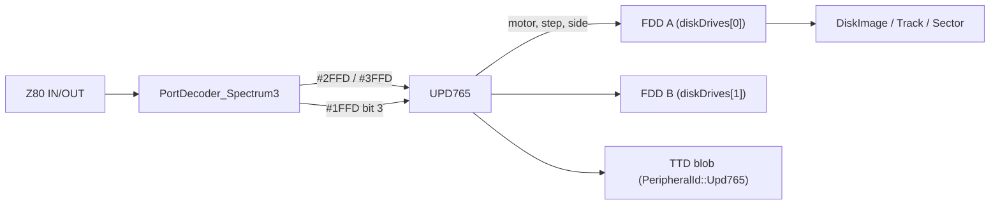
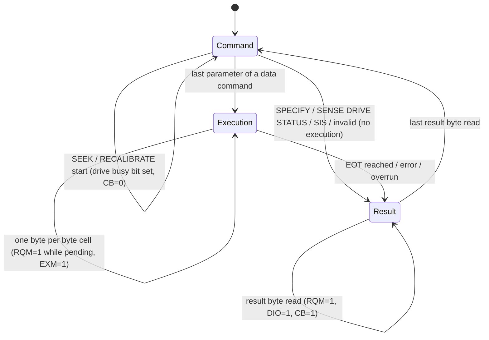

# ZX Spectrum +3 floppy controller (NEC uPD765A): technical design

**Date:** 2026-09-28 · **Status:** phases 1-3 implemented, phase 4 open · **Tracks:** the +3 paging fix
(`eabce7d0`) left the +3 without its disk controller: the menu reads "128 +2A" and no disk works.

## 1. Goal

The +3 boots as a +3 (its ROM detects the controller and the drive), and +3DOS reads, writes
and formats `.dsk` / Extended DSK images: `CAT`, `LOAD`, `SAVE`, `FORMAT`, and the
copy-protected disks the EDSK format describes. The controller is ported from the behaviour
the reference emulators agree on, written in unreal-ng's style (the WD1793 is the model), and
runs on our disk image model (`DiskImage` / `Track` / `Sector`).

## 2. Terms

| Term | Meaning |
|:--|:--|
| FDC | Floppy disk controller: here the NEC uPD765A (the Intel 8272 is the same chip). |
| MSR | Main status register (port `#2FFD`): whether the FDC wants a byte, which way, and whether it is busy. |
| Phase | The FDC runs every command in up to three phases: **command** (the CPU writes the command and its parameters), **execution** (data moves, or the head seeks), **result** (the CPU reads status bytes). |
| ST0-ST3 | Status bytes the result phase returns. |
| C, H, R, N | A sector ID: cylinder, head, record (sector number), size code (128 << N bytes). |
| EOT | The last sector number of a multi-sector command. |
| TC | Terminal count: a pin that ends a data transfer. On the +3 it is tied low, so every read runs to EOT and ends with "end of cylinder". |
| DAM / DDAM | Data address mark / deleted data address mark. |
| EDSK | Extended DSK, the CPC/+3 disk image format that stores per-sector sizes, ST1/ST2 error bytes and several copies of weak sectors. |
| Weak sector | A sector whose bytes read differently on each pass (a copy protection). |

## 3. What the reference emulators do

Eight implementations were read (full comparison: the investigation notes in this folder's
history, agents' reports of 2026-09-28):

| Emulator | Model | Timing | End of cylinder (no TC) | EDSK errors / weak |
|:--|:--|:--|:--|:--|
| MAME `upd765.cpp` | bit-level MFM live state machine | real (32 µs/byte, SRT/HLT from SPECIFY) | IC=01 + EN | CRC/DDAM applied, copies not split |
| zxsp `Fdc765.cpp` | raw 6250-byte tracks, coroutine | real, strict 32 µs overrun deadline | IC=00 + EN (claims +3DOS needs it) | flags lost (bug), weak TODO |
| BizHawk `NECUPD765.*.cs` | sector level | mostly instant, overrun after 64 MSR polls | IC=01 + EN | copies rotated per read, per-title patches |
| Spectral (Caprice32 core) | sector level | overrun after 512 ticks | IC=01 + EN, EN masked by other errors | copies cycled; Speedlock heuristic |
| xpeccy-plus `upd765.c` | micro-op plans over raw tracks | 32 µs/byte | no EN/AT | ignores ST1/ST2 and weak copies |
| unreal-speccy `upd765.cpp` | Unreal WD93 track model | instant, overrun after 10 polls | IC=01 + EN (cites +3DOS `#204A`) | CRC flags; random bytes on data CRC error |
| ZX-M8XXX `fdc.js` | buffered | none | IC=01 + EN | weak map from copies |
| Zero | wraps a binary DLL | - | - | - |

## 4. Decisions (consensus first)

| Topic | Decision | Why |
|:--|:--|:--|
| Ports | `#2FFD` (A15-A12 = 0010, A1 = 0) reads the MSR; `#3FFD` (0011, A1 = 0) reads/writes data; `#1FFD` bit 3 is the motor of both drives | all references, MAME `specpls3.cpp` |
| Wiring | TC tied low, INT and DMA not connected, US1 not connected (units 2/3 alias 0/1) | zxsp pinout notes; MAME `data & 1`; unreal-speccy: Batman the Movie, Chase H.Q. rely on the alias |
| Read/write end | always IC=01 + EN at EOT; EN dropped when another error bit is set; CM clears IC (Caprice rules) | 5 of 6; +3DOS `#204A` treats EN as success |
| Result C/H/R/N after EOT | the last sector's C, H, R, N (MAME) | +3DOS ignores it; MAME is the silicon reference |
| Invalid command | one result byte ST0 = `#80` | all |
| SENSE INTERRUPT STATUS with nothing pending | ST0 = `#80` | all; +3DOS drains SIS until it gets `#80` |
| Not ready | motor off or no disk ⇒ NR + IC=01, no execution phase | BizHawk, Caprice, zxsp |
| Ready change | on motor on/off, queue an SIS result IC=11 per drive | zxsp, Caprice |
| Sector not found | after 2 index pulses: IC=01 + ND (+ WC/BC when C mismatches) | datasheet, all |
| Timing | real: byte cell from the track length (6250 bytes per 200 ms ⇒ 112 T), seek step from SPECIFY SRT, head load from HLT | MAME, zxsp, xpeccy |
| Overrun | a byte not taken within one byte cell ⇒ OR + IC=01, end of command (zxsp deadline) | real silicon; titles in Spectral's list break without it |
| Weak sectors | the weak bitmap the DSK loader already builds from EDSK copies, mutated per revolution by `FlakySectorEmulator` (same as WD1793) | deterministic for TTD; reuses our model |
| Sector sizes | N 0-3 from the model (`128 << (N & 3)`); N ≥ 4 (Speedlock N=6) is phase 2 | model limit (§6) |
| No per-title patches | protections must work from the image, not from signatures | BizHawk's approach rejected |

## 5. Architecture

- **Class:** `UPD765` in `core/src/emulator/io/fdc/upd765.{h,cpp}`, a `ttd::TTDSerializable`. Created
  by `Core` only for `MM_PLUS3` (`EmulatorContext::pUPD765`); the port decoder forwards the three
  ports to it.
- **Drives:** the FDD objects the machine already has (`coreState.diskDrives[0..1]`), so
  `Emulator::LoadDisk`, the WebAPI and the UI insert disks exactly as for the Beta 128. Their
  state is serialized once (by the WD1793 blob, which exists on every model); the uPD765 blob
  holds the controller only.
- **Clock:** absolute T-states, like the WD1793: `_time = t_states + z80.t`. Every wait is a deadline
  (`_eventTime`); on each port access `process()` replays the deadlines that have passed, in time
  order. There is no per-instruction hook in the main loop: nothing the CPU can see changes between
  two port accesses, and what happens depends only on the deadlines, never on how often the CPU
  polls. Rates come from the machine's base clock (`emulatorState.base_z80_frequency`, the rate
  `t_states` counts in), not from a constant.
- **Head position:** the byte under the head is `(_time % rotation) × rawSize / rotation`, the
  WD1793's formula, so rotational latency and index pulses come from the same clock.

## 6. The controller

### 6.1 Phases and the MSR

MSR bits: D0B-D1B (drive seeking, cleared by SIS), CB (command busy), EXM (execution in non-DMA
mode), DIO (1 = FDC to CPU), RQM (data register ready).

### 6.2 Commands

| Code | Command | Params | Execution | Result |
|:--|:--|:--|:--|:--|
| 03 | SPECIFY | SRT/HUT, HLT/ND | - | none |
| 04 | SENSE DRIVE STATUS | HD/US | - | ST3 |
| 07 | RECALIBRATE | US | step out to track 0 (≤ 77 steps, else EC) | via SIS |
| 0F | SEEK | HD/US, NCN | step to NCN | via SIS |
| 08 | SENSE INTERRUPT STATUS | - | - | ST0, PCN (or `#80`) |
| 0A | READ ID | MF, HD/US | next ID field under the head | ST0-2, C H R N |
| 06 / 0C | READ (DELETED) DATA | MT MF SK, HD/US, C H R N EOT GPL DTL | sectors R..EOT | ST0-2, C H R N |
| 05 / 09 | WRITE (DELETED) DATA | same | sectors R..EOT | same |
| 0D | FORMAT TRACK | MF, HD/US, N SC GPL D, then C H R N per sector | whole track | same |
| 02 | READ TRACK | as READ DATA | sectors from the index | same (phase 4; until then IC=01 + MA) |
| 11/19/1D | SCAN | as READ DATA | compare | same (phase 4; until then IC=01 + MA) |
| other | invalid | - | - | ST0 = `#80` |

### 6.3 Status rules

- Sector search: from the head position, `Track::findSector(C, H, R)` then N must match; two
  index pulses without a match ⇒ ND (+ WC / BC if an ID with that R but another C exists).
- ID CRC bad ⇒ DE (ST1). Data CRC bad ⇒ DE + DD, data still transferred, command ends after it.
- ID-only sector (no data field) ⇒ MA (ST1) + MD (ST2).
- READ DATA meets a DDAM (or READ DELETED meets a DAM) ⇒ CM; SK=0: ends after that sector; SK=1:
  skipped.
- Write to a protected disk ⇒ NW + IC=01, nothing written.
- End: IC=01 + EN after EOT (§4).

### 6.4 Timing

| Quantity | Value (3.5 MHz T-states) |
|:--|:--|
| Rotation | 200 ms at the base clock (700000 T at 3.5 MHz) |
| Byte cell | rotation / track raw size ≈ 112 T for a 6250-byte MFM track |
| Step | (16 - SRT) × 2 ms at the +3's 4 MHz FDC clock |
| Head load | HLT × 4 ms before every data command (MAME; the head-unload timer is not modelled) |
| Overrun | a pending byte not taken by the next byte cell |

## 7. Disk image mapping

- Sectors come from `Track::sectors()` / `findSector()` / `nextSector()` / `bytesUntil()`.
- The DSK loader already turns EDSK ST1/ST2 into the model: ST1.DE alone → bad ID CRC,
  ST2.DD → bad data CRC, ST2.CM → DDAM, ND/MA/MD → ID-only sector, several copies → weak bitmap.
  The controller derives ST1/ST2 back from those, so a protected image reads as it was dumped.
- Writes go through `Track::writeSectorData()` (CRC recomputed, image marked dirty); FORMAT
  builds a `TrackFormatSpec` from the FORMAT parameters and calls `Track::formatTrack()`.
- `Track`'s dirty-marking helpers are `friend class WD1793`; the uPD765 gets the same friendship.
- Limit: data length is `128 << (N & 3)`; N ≥ 4 sectors (Speedlock +3) need model work (phase 2).

## 8. TTD

`PeripheralId::Upd765 = 14`, a fixed 384-byte blob (phase, command bytes, result bytes, current
C/H/R/N/EOT, per-unit PCN and seek state, SPECIFY values, deadlines, pending interrupts, FORMAT
IDs), registered from `PortDecoder_Spectrum3::GetTTDModelStateIds()` next to `Plus3Paging`. The
controller belongs to `Core`; the decoder hands the registry an owned forwarder (`TTDPlus3Fdc`).
Pointers into the disk image are not stored: the sector in transfer is its index on the track
under the head, looked up again after a restore.

## 9. Tests

Fast and deterministic: the controller is driven directly (a `UPD765CUT` with the time set by
the test, like `WD1793CUT`), on disk images built in memory from `TrackFormatSpec::plus3()`.

| Test | Proves |
|:--|:--|
| MSR per phase | RQM/DIO/CB/EXM in command, execution, result |
| SPECIFY, invalid command, SIS with nothing pending | no result / `#80` / `#80` |
| SEEK + SIS, RECALIBRATE + SIS, step timing | busy bit, SE, PCN, deadline from SRT |
| SENSE DRIVE STATUS | RDY, WP, T0, unit alias 2→0 |
| Not ready (no disk, motor off) | NR + IC=01, no execution |
| READ ID | sequential IDs as the disk turns |
| READ DATA single and multi-sector | bytes, IC=01 + EN at EOT, C/H/R/N |
| Not found, ID CRC, data CRC, ID-only, DDAM with SK=0/1 | ND, DE, DE+DD, MA+MD, CM |
| Overrun | OR when a byte is not taken in time |
| WRITE DATA, write protect | bytes on the image, CRC valid, NW |
| FORMAT TRACK | sector IDs and filler as given |
| Weak sector | two reads differ in the weak bytes only |
| TTD round trip | a restored controller continues the same transfer |
| ROM | the +3 menu reads "+3", not "+2A"; CAT of a blank disk; SAVE then LOAD round trip through the verified command typer |

The ROM tests boot the real +3 ROM in turbo mode (OCR reads video RAM, so decimated rendering
does not matter) and let +3DOS turn the disk at its real speed: 35 / 120 / 310 ms for the menu,
CAT and SAVE-LOAD-RUN. They are the only ones over the 50 ms budget and say so; the 34 controller
tests take about 60 ms together.

### 9.1 Found on the way

The first SAVE / LOAD round trip was also the first test that typed a second command after a
report on the 128K-family and +3 editors. Both wait for that key in a loop of their own (`#25E3`
on the 128K, `#0693` on the +3) that leaves FLAGS bit 5 set: the key clears the report, the editor
redraws an empty line, then takes the same key as an ordinary one. The command typer knew only the
main idle loop and gave up ("the editor is not waiting for a key"). The loops are now the
`reportShown` control point, and `CommandTyper_Test.CommandAfterAReport` covers every editor
(input-verification.md §4.2, §4.3, §8).

## 10. Phases

1. **Core controller** (done): ports, phases, MSR, SPECIFY, SDS, RECALIBRATE, SEEK, SIS, READ ID,
   READ / WRITE (DELETED) DATA, FORMAT, invalid; timing and overrun; drives A/B; TTD; unit tests.
2. **ROM integration** (done): the +3 menu, CAT, SAVE/LOAD through the command typer.
3. **Automation** (done): `state/fdc` and MCP `inspect_state` report the uPD765 on the +3; blank
   disks (`plus3` format) from `Emulator::CreateBlankDisk` on every interface; `.dsk` loads end to end.
4. **Protections:** READ TRACK, SCAN, N ≥ 4 sectors, the Spectral title lists as a sweep.
