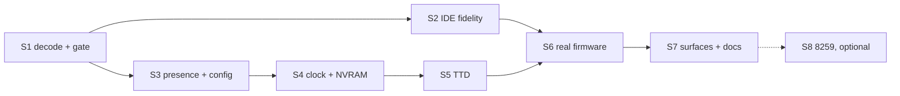

# SMUC integration plan

| | |
|---|---|
| **Date** | 2026-09-28 |
| **Starts from** | branch `ide-atapi` (IDE rollout 1) merged to `master` |
| **Inputs** | [hardware-reference.md](hardware-reference.md) (consensus), [current-state-and-gaps.md](current-state-and-gaps.md) (G1-G13), [software-and-boot.md](software-and-boot.md) (levels L0-L5, images T0-T3) |
| **Related plans** | PLAN #13a (IDE), #58 (media manager), #60(c) (one shared CMOS chip `Ds12887` with an NVRAM file, TTD and a frozen clock for tests) |

## 1. Verdict

**Moderate, and mostly done.** The hard part of a hard-disk card is the ATA drive model, the
16-bit transfer engine, the image formats, the slots and TTD of a disk in the middle of a
transfer. All of that landed with IDE rollout 1 and already runs under the real ProfROM
(IDENTIFY, then READ SECTORS). What is left for SMUC itself is small and local: five bus-level
corrections (gating, mask, reset polarity, INTRQ, `#7FBA`), one presence rule, a persistent and
deterministic clock / NVRAM, a TTD blob, and the reports. The real cost is **acceptance**: driving
the ProfROM hard-disk utility to build a formatted disk and mounting a TR-DOS image from it.

| Path | Phases | Effort |
|---|---|---|
| "ProfROM sees and uses the disk, settings survive" (L1-L3) | S1-S7 | about one **M** program: S, S, S, M, M, L (mostly fixtures), M |
| Plus the 8259 and card interrupts (L5) | S8 | **L**, optional, low value |
| Virtual FDD hardware trap | research (Q5) | unknown |

## 2. Phases

Each phase ends green: full build with zero warnings, `core-tests` passing. Tests are named after
the file under test (`<file>_test.cpp`); boot-bound tests use `EnableTurboMode()` and a frozen
clock.

### S1 Bus-accurate decode (G1, G2) - S

| | |
|---|---|
| Change | `PortDecoder_Scorpion256::IsPort_SMUC`: mask `#18E3` / match `#18A2` for the family (sub-device select stays `(port & #A044)`), together `#B8E7`. New `SmucGate()`: the same predicate as the Beta 128 arm of this decoder (`CF_TRDOS`, the DD50.1 trigger, `#1FFD` D1), so the two port families can never disagree. Both arms (`DecodePortIn`, `DecodePortOut`) test the gate; gate off → the port falls through to the other arms, exactly as without the card |
| Files | `core/src/emulator/ports/models/portdecoder_scorpion256.{h,cpp}` |
| Tests | `scorpionsmuc_test` (or a new `portdecoder_scorpion256_test` truth table): 8 sub-devices × gate on / off × fitted / absent; keyboard rows with the gate **on** (the 2026-09-10 regression); A4 / A3 don't-care (`#FFA2` reaches `#FFBA`); the 65 536-port collision sweep in `idecontroller_test` for SCORPION and PROFSCORP with SMUC; R4 (`ProfRomIdentifiesTheDiskThroughTheDiskCore`) and `ProfRomBootDrivesSmucProbes` stay green |
| Before switching the gate on | record a port trace of the ProfROM boot with the card fitted and assert that **every** SMUC access happens with the TR-DOS ports on (the firmware code sits in TR-DOS pages 3 and 7, and UnrealSpeccy gates and boots it, so this is expected to hold) |
| TTD | none (decode only) |

### S2 IDE fidelity (G3, G4, G5) - S

| | |
|---|---|
| Change | `WriteSMUCPort`, `#FFBA`: reset the units when the written D0 is **0** (a pulse per write, MAME; no held level). `ReadSMUCPort`, `#FFBA`: D7 = INTRQ of the selected unit (generalize `IdeAdapter::AtmIntrqBit()` to `IntrqActive()`, used by ATM on D6 and by SMUC on D7), D6 = SDA, D5-D0 = 1; behind a named constant so Q2 can flip it to "constant 1" in one place. `#7FBA` read: `latch | #37`. Remove the `_smucIdeRegs` fake drive |
| Files | `portdecoder_scorpion256.cpp`, `core/src/emulator/io/ide/ideadapter.{h,cpp}` |
| Tests | `ideadapter_test` (SMUC section): a write with D0 = 1 leaves a selected slave and a half-done transfer intact, a write with D0 = 0 resets; INTRQ visible on D7 after a command, cleared by a status read, forced 1 with nIEN; `#7FBA` readback of D7 / D6 / D3. A ProfROM trace test: reading the clock after selecting the slave keeps the slave selected |
| TTD | the INTRQ bit is derived from the channel state (already in blob 17) |

### S3 One presence rule and the config (G6) - S

| | |
|---|---|
| Change | Parse `[MISC] SMUC` into `CONFIG::smuc` (`config.cpp`). Fitted = `smuc` **or** `Scheme=SMUC`: `SMUC=1` alone gives the clock, NVRAM, system and virtual FDD registers (UnrealSpeccy meaning), `Scheme=SMUC` adds the IDE window. `SetSmucEnabled()` becomes a test override of the same rule. Both models (SCORPION, PROFSCORP) decode the family only when fitted; absent → the family falls through, as on a real bus. Keep the constant `#FF` for an absent card only where today's tests rely on it (profrom doc §8.2: the attribute-latch floating value would ACK presence polls at random) |
| Files | `core/src/emulator/config.cpp`, `platform.h`, `portdecoder_scorpion256.{h,cpp}` |
| Tests | `config_test` (`SMUC=0/1`, `Scheme=SMUC` on SCORPION / PROFSCORP, invalid on other models - existing validation); `scorpionsmuc_test` fixtures switch from `SetSmucEnabled(true)` to the config |
| Defaults | **unchanged: not fitted** in `data/configs/scorpion` and `profscorp` (§3) |

### S4 A persistent, deterministic clock and NVRAM (G7, G8) - M

| | |
|---|---|
| Change | Build on PLAN #60(c): the DS1685 becomes the shared `Ds12887` chip (MC146818 core, registers A-D, update-in-progress, periodic-interrupt flag, NVRAM file, frozen time for tests); the 24C16 EEPROM becomes its own small device (the Xpeccy LC16 state machine from `SMUCNvram`, 2 KB). Both are battery-backed: loaded at machine creation and saved on shutdown and model switch, one file per machine configuration (UnrealSpeccy uses two files, `CMOS` and `NVRAM`). **Time comes from emulated time**: a base wall-clock value captured at power-on (or at TTD recording start) plus emulated T-states, so a replay reads the same time |
| Files | `core/src/emulator/io/rtc/` (`SMUCNvram` split into the shared RTC and a `SerialEeprom24c16`-style class, name per the naming rules), `portdecoder_scorpion256.*` |
| Tests | the file round trip (write settings, restart, the second ProfROM boot skips the `#0D6F` format and is ~200 frames shorter); the clock advances with emulated time, not host time; tests keep in-memory stores (no file) and unique scratch paths when they do use one |
| If #60(c) is not ready | do the persistence and the emulated-time base inside `SMUCNvram` and move it onto `Ds12887` later with #60(c) |

### S5 TTD (G9) - M

| | |
|---|---|
| Change | A new `PeripheralId::SmucBoard` (next free id; 16 is reserved for TSConf, 17 is `AtaChannel`) with a POD blob: `pFFBA`, `p7FBA`, the EEPROM protocol state (mode, bit counters, shift register, address, 16-byte page buffer, line levels) **and its 2 KB contents**, the CMOS address, its 256 bytes, the RTC time base. Registered by the Scorpion decoder when the card is fitted (`GetTTDModelStateIds`, `CreateTTDSerializers`). EEPROM writes need no barrier: the contents are in the blob (they are device state, not media) |
| Files | `core/src/debugger/ttd/scorpion/ttdsmucboard.{h,cpp}`, `ttdserializable.h` (id), the Kaitai description `ttd.ksy` |
| Tests | `ttdsmucboard_test`: a blob round trip in the middle of an I²C transaction; a TTD recording through a ProfROM boot with the card replays with identical hashes; `ttdmodelstatecontract_test` and `ttdstatecompleteness_test` cover the new id |
| Fixtures | none to re-record while the shipped default stays "not fitted" |

### S6 Real-firmware acceptance (G10) - L

| | |
|---|---|
| Tests | `scorpionsmuc_test` (or `profrom_smuc_test`), all on the real ProfROM 4.01, frozen clock, turbo: **A1** first boot formats the NVRAM, second boot (store kept) does not; **A2** the menu clock shows the frozen time; **A3** a blank disk (T0) is identified and the hard-disk utility lists "no partitions"; **A4** the partition manager, driven by scripted keys, creates an SMFS partition on T0; after a reset it is listed (this produces fixture **T1**); **A5** a TR-DOS image copied into the collection and mounted on drive A: `#7FBA` D7 = 0, TR-DOS `RUN` loads a known program from the hard disk; **A6** a host folder mounted as the unit (FAT volume) is identified (the FAT path of the LW ROM comes with Q6) |
| Fixtures | T1 kept compressed under `testdata/` (or regenerated by A4 in a slow test and shared through a scratch path), with its provenance written next to it |
| Tools | a small probe that prints the MBR and the SMFS directory of an image, for failure messages (under `tools/`, optional) |
| Why L | the work is in finding the key sequences and screen checkpoints of the ProfROM utilities, not in emulator code; timelines are long (seconds of emulated time per step) |

### S7 Surfaces and docs (G11) - M

| | |
|---|---|
| Automation | the device report gets a `smuc` section next to `ide` (fitted, gate state, `#FFBA`, `#7FBA` decoded to "drive A / B virtual", version, NVRAM checksum OK / not, RTC time and mode) on every surface: CLI, WebAPI + OpenAPI, MCP, Lua, Python, one source (`DeviceState`) as for the IDE and GS reports. Fitting the card is a machine configuration change (the config keys), so it reuses the existing config / model-switch verbs; no new verbs |
| Qt | a "SMUC card" option for SCORPION / PROFSCORP in the machine settings (fitted, IDE on / off); the media panel already lists `ide0.master` / `ide0.slave`; the HDD LED already blinks. Optional: an NVRAM / CMOS view in the debugger memory viewer (UnrealSpeccy has an NVRAM editor) |
| Docs | [media.md](../../features/media.md) (Scorpion row), a `.recipe` for "boot a Scorpion from a SMUC disk", the Scorpion clone README pointer, the IDE design Q3 answered, PLAN row |
| Optional | a named configuration "PROFSCORP with SMUC" if the named-configuration mechanism from the ZX-Poly work is on `master` by then |

### S8 The 8259 and card interrupts (G12) - L, optional

An 8259 model (ICW1-ICW4, mask, IRR / ISR, EOI, the vector on the bus in IM 2), the DS1685 periodic
interrupt into IR0, `#FFBA` D3 as the interrupt enable, and a machine-level interrupt source
(PLAN #60(a) `IInterruptSource`). Passes the ProfROM test at page 7 `#16CD-#1737`. Every reference
emulator treats the 8259 as absent and no known software needs it beyond that self-test, so this
phase is only for completeness. A variant switch ("SMUC 2.x without 8259" default, "with 8259")
keeps today's behavior as the default.

## 3. Config defaults decision

**Keep the card not fitted in the shipped `scorpion` and `profscorp` configs.** Reasons: the base
ZS-256 has no SMUC (it is an add-on), MAME and UnrealSpeccy ship it absent, and the ProfROM boot
tests are pinned without it. Fitting it is one line (`SMUC=1`, plus `Scheme=SMUC` for the disk)
or one Qt option. Revisit after S4: with a persisted NVRAM the boot-time argument (~4 s) is gone
from the second boot on, and a separate named configuration is the better place for "ProfROM with
a hard disk" than changing the base model.

## 4. Order

S1-S3 can land as one small change set. S4 waits for, or seeds, PLAN #60(c).

## 5. Risks

| Risk | Effect | Mitigation |
|---|---|---|
| The TR-DOS gate hides a SMUC access the ProfROM makes outside TR-DOS | a probe fails, "not found" lines return | the S1 trace check before the gate goes live; UnrealSpeccy gates and runs the same ROM |
| The reset-polarity change exposes code that relied on the old reset | an IDE test changes behavior | the firmware evidence is direct (page 7 `#15C7`, `#1E74`); R4 and the new S2 tests pin it |
| Changing the default would move every ProfROM timeline | golden / TTD / turbo tests fail | default stays "not fitted" (§3) |
| Host clock in replays | TTD divergence, flaky boot timelines | emulated-time base (S4); tests freeze the clock (already the rule) |
| Persisted NVRAM leaks between tests | order-dependent results | tests use in-memory stores; any file under a per-process scratch path |
| The SMFS format is undocumented | T1 cannot be generated by a tool | let the ProfROM make it (A4); keep the image as a fixture |
| LW ROMs may need paging our PROFSCORP model does not have (1 MB / `#1FFD` variants in MAME's ROM list) | L4 blocked | Q6; not needed for L1-L3 |
| The keyboard regression of 2026-09-10 returns with a wider mask | dead keyboard in the ProfROM monitor | A6 is in the new mask; the regression test runs with the gate on |

## 6. Open questions

One at a time, each with a recommendation.

| # | Question | Recommendation |
|---|---|---|
| Q1 | IDE reset polarity (IDE design Q3) | **answered**: D0 = 0 resets, a pulse per write (hardware-reference §5.6) |
| Q2 | `#FFBA` D7 on read: INTRQ or constant 1? | INTRQ (ZXMAK2, and the Xpeccy TODO); no software in the reference trees reads it, so either is safe; one constant to flip |
| Q3 | Should `[MISC] SMUC=1` without `Scheme=SMUC` be allowed (clock and NVRAM, no disk)? | yes, UnrealSpeccy meaning |
| Q4 | Where do the NVRAM / CMOS files live and are they per configuration or per machine instance? | per machine configuration folder, same place as the future #60(c) CMOS files |
| Q5 | Does the real card trap floppy-controller accesses for a virtual drive? | research only; the documented ProfROM behavior needs just the latch |
| Q6 | Are the LW ProfROM builds in scope (FAT32, boot from HDD, master / slave menu)? | later: after L3 with 4.01, check that an LW `v4s` image boots on the PROFSCORP model |
