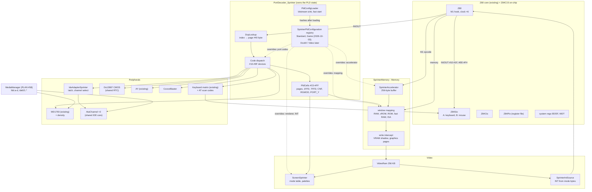
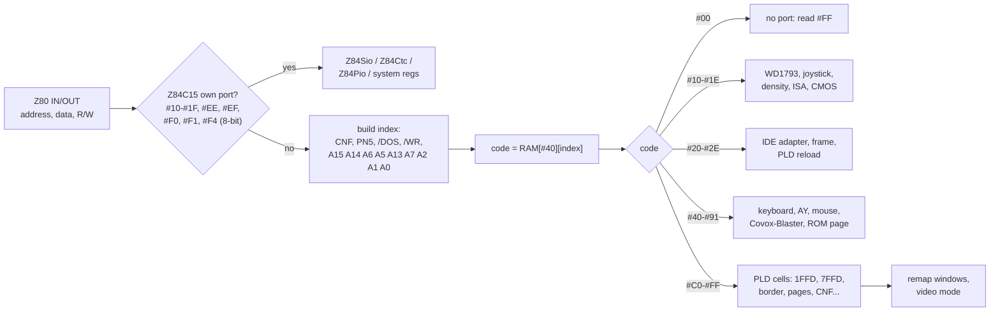
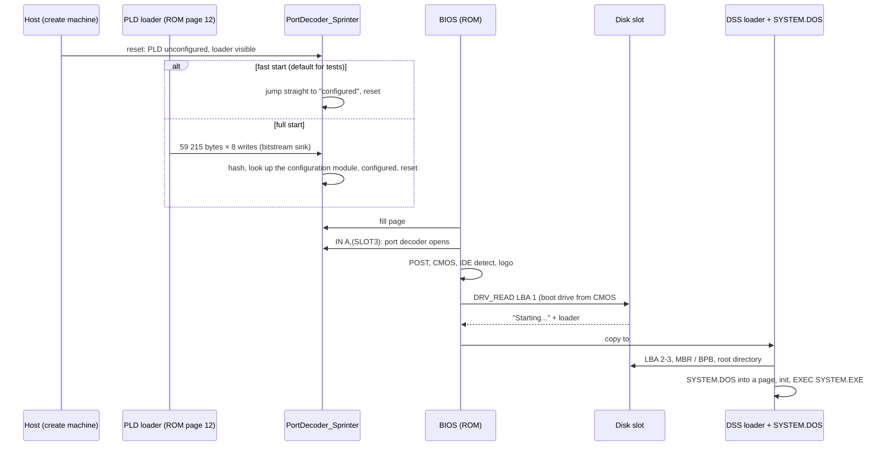
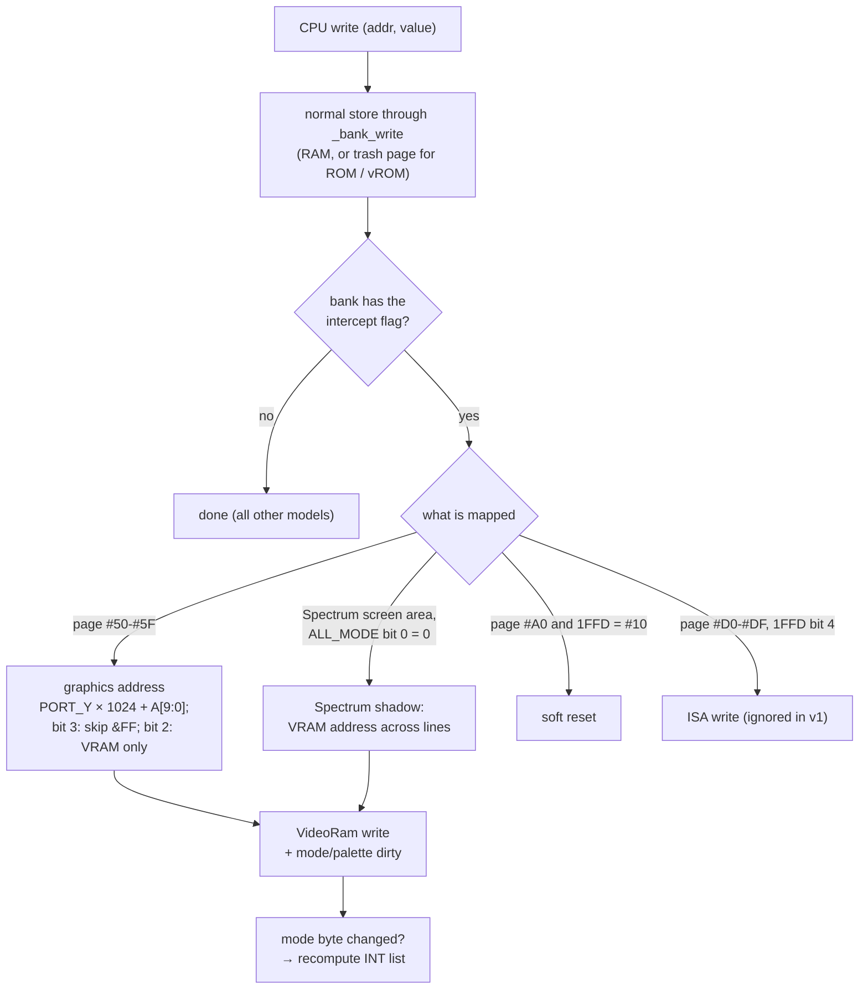
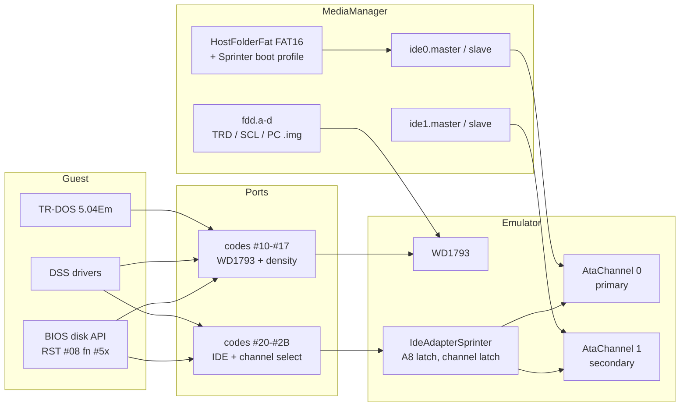

# Sprinter Sp2000 — high-level design

| | |
|---|---|
| **Date** | 2026-09-28 |
| **Status** | Review round 1 done (2026-09-28); decisions D1-D11 below |
| **Details** | [technical-design.md](technical-design.md) (index of the per-area designs), [unreal-ng-mapping.md](unreal-ng-mapping.md) |

## 1. The idea in five sentences

The Sprinter is emulated as **one decoder class that owns the PLD state**: the internal
registers ("cells" `#C0-#FF`), the port-table lookup into RAM page `#40`, and the dispatch of
each internal code to a device. Memory mapping, the video shadow writes and the accelerator are
a `SprinterMemory` subclass plus three generic hooks that TSConf also needs (write intercept, M1
hook, interrupt source). Video is a new renderer that reads the mode table and palettes from
video RAM each line. Storage reuses the shared pieces: WD1793, the IDE core (AtaChannel ×2 with a
Sprinter adapter) and the media manager with a Sprinter boot profile for folder volumes. The
Z84C15's own devices (SIO, CTC, PIO) become a small reusable `io/z84c15` package.

## 2. Components

| Component | New / reused | Where it lives |
|---|---|---|
| `PortDecoder_Sprinter` | new | `core/src/emulator/ports/models/portdecoder_sprinter.{h,cpp}` |
| `SprinterPldConfiguration` (interface + registry), `SprinterPldStandard` (the first module) | new | `core/src/emulator/ports/models/sprinter/` |
| `SprinterMemory` | new, `Memory` subclass (the `ScorpionMemory` precedent) | `core/src/emulator/memory/sprinter/` |
| `SprinterAccelerator` | new | `core/src/emulator/memory/sprinter/` |
| `ScreenSprinter`, `SprinterIntSource` | new | `core/src/emulator/video/sprinter/` |
| `Z84Sio`, `Z84Ctc`, `Z84Pio`, `Z84SystemRegs` | new, reusable | `core/src/emulator/io/z84c15/` |
| `IdeAdapterSprinter` | new, on the shared IDE core | `core/src/emulator/io/hdd/adapters/` (IDE design §5) |
| `Ds12887` | the shared MC146818 core, extracted from the ATM3 `CMOS` before the Sprinter (PLAN #60) | `core/src/emulator/io/rtc/` |
| `CovoxBlaster` | new | `core/src/emulator/sound/sprinter/` |
| WD1793, AY, beeper, keyboard matrix, media manager | reused | existing locations |
| Generic hooks: write intercept, interrupt source (TSConf, PLAN #41); clock ratio, wait-state hook, per-model `Screen` (PLAN #60) | new shared infrastructure, landed before the Sprinter | `memory/`, `cpu/`, `video/` |

## 3. Port access: one lookup, then a device

The lookup is one byte read from a host array plus a switch: cheaper than the predicate chains of
the other decoders. The port-trace and breakpoint surfaces tag each access with the **code** as
well as the address, so a trace line reads `OUT #21BC ← #21 [code #2B IDE select primary]`.

## 4. Boot

## 5. Memory write path

The graphics pages also change the **read** path (reads come from main RAM at the video
address); `SprinterMemory` overrides the virtual read pair for those banks only.

## 6. Storage

## 7. Key decisions

| # | Decision | Alternatives rejected |
|---|---|---|
| D1 | Port decode **from page `#40`** (as hardware and MAME) | hard-coded standard map (ZXMAK2): breaks programs that edit the table and the four maps |
| D2 | PLD configuration: run the ROM loader into a **bitstream sink** that counts the real bitstream (59 215 bytes × 8 writes, watchdog timeout) and identifies it by two hashes (the first 4 096 writes, MAME-compatible, and the full stream); the hash selects a **configuration module** (D11). v1 models only the standard Sp2000 configuration. Full start is the user default; **fast start** (`FastStart=1`) is the test default | emulating the PLD (closed format); always skipping the loader (hides the reload path the BIOS uses for setup and games); MAME's 4 096-write end of load (ends in the middle of the stream) |
| D3 | Clock: generalize the Z80 frequency multiplier from a power-of-two shift to a small integer ratio (1, 2, 4, 6) | a Sprinter-only CPU loop |
| D4 | Turbo waits: MAME's "align to 6" model behind one function, replaceable when measured | cycle-exact PLD timing (no measurements) |
| D5 | Video: per-line renderer reading the mode table from VRAM (no caching of decoded tiles in v1) | MAME's tilemap caches: faster but complex invalidation; can come later as an optimization with a benchmark |
| D6 | INT from the mode table, recomputed when a mode byte with the blank/INT pattern changes, served through the shared `IInterruptSource` (TSConf §3.4) | fixed `intstart` from the ini: the BIOS moves INT at run time |
| D7 | Keyboard: one host key event feeds both the ZX matrix and AT set-2 scan codes (shared with ZX-Evo PS/2, PLAN #55 E2b) | two separate input paths that can disagree during TTD replay |
| D8 | Folder volumes boot DSS through a **Sprinter boot profile** in the folder builder: MBR entry 0 type `#06`, 3 reserved sectors at LBA 1-3 filled with the DSS loader taken from `BOOT.EXE` (from the folder, or a configured file) | patching the BIOS; requiring the user to run `BOOT.EXE` on a session volume every time |
| D9 | Snapshots: a native Sprinter state file only; no Spectrum formats | squeezing Sprinter state into `.sna`/`.z80` |
| D10 | Internal codes appear in port traces, breakpoints and the debugger | address-only traces (useless when the map changes) |
| D11 | PLD configurations are **modules** behind one extension point, `SprinterPldConfiguration`. A module is identified by a descriptor {name, full-stream hash, first-4 096-writes hash} and overrides only what its firmware changes: (1) port decoding (own codes, own cells), (2) memory mapping, (3) video renderer + INT source, (4) accelerator; everything else falls through to Standard. Standard is itself the first module. Unknown bitstream → Standard + a warning with the hash. Module id and state are TTD/snapshot state. v1 ships Standard only | one hard-coded configuration with a `configId` switch (every new firmware edits the decoder core); a whole separate machine per configuration (duplicates the board hardware they all share) |
