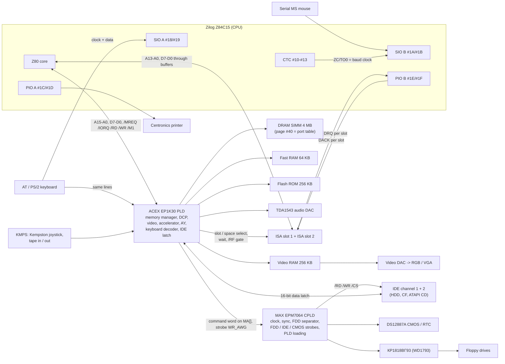
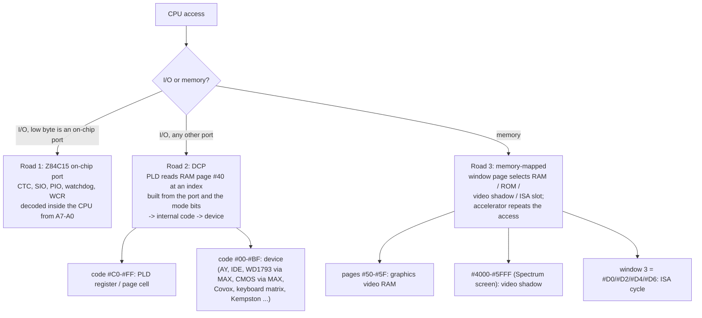
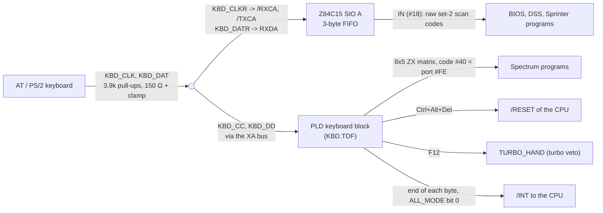
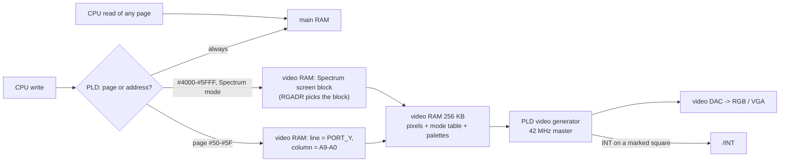
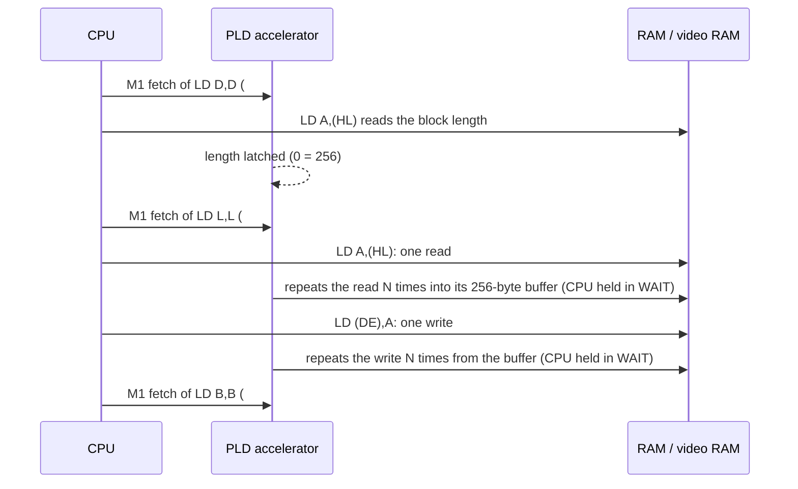
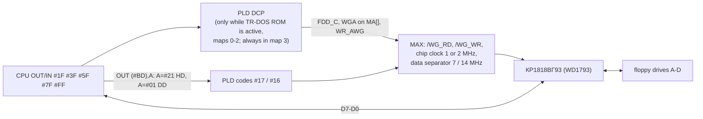
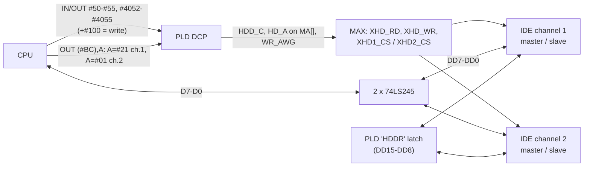
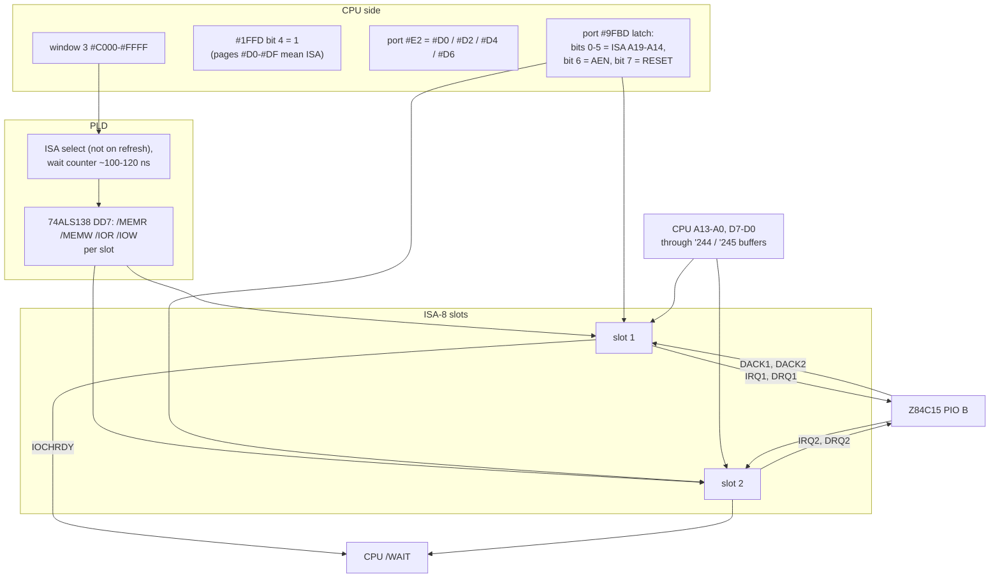
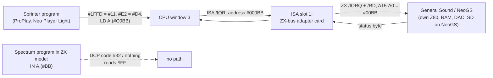

# Sprinter Sp2000: how every peripheral is wired and driven

| | |
|---|---|
| **Date** | 2026-10-06 |
| **Status** | Reference, collected from the existing research and re-checked against the PLD / CPLD sources. No code changed |
| **Answers** | "What is connected to what, through which chip, and how does software drive it": keyboard, mouse, video, accelerator, floppy, hard disk, SD, ISA slots, General Sound / NeoGS |
| **Related** | [hardware-reference.md](hardware-reference.md) (ports and registers in detail), [research-cpu-z84c15.md](research-cpu-z84c15.md) (the CPU), [research-zx-mode.md](research-zx-mode.md) §4.1 (the CPU clock), [peripherals-survey.md](peripherals-survey.md) (what exists and what is emulated), the ISA research [2026-10-02-sprinter-isa/research.md](../2026-10-02-sprinter-isa/research.md) |

## Contents

1. [In short](#1-in-short)
2. [Glossary](#2-glossary)
3. [The board in one picture](#3-the-board-in-one-picture)
4. [Three roads from the CPU to a device](#4-three-roads-from-the-cpu-to-a-device)
5. [Keyboard](#5-keyboard)
6. [Mouse, joystick, tape, printer](#6-mouse-joystick-tape-printer)
7. [Video adapter](#7-video-adapter)
8. [Copy accelerator](#8-copy-accelerator)
9. [Built-in sound](#9-built-in-sound)
10. [Floppy (FDD)](#10-floppy-fdd)
11. [Hard disk (IDE)](#11-hard-disk-ide)
12. [CMOS clock](#12-cmos-clock)
13. [SD cards](#13-sd-cards)
14. [ISA slots](#14-isa-slots)
15. [General Sound and NeoGS without a ZX-bus](#15-general-sound-and-neogs-without-a-zx-bus)
16. [Summary table](#16-summary-table)
17. [What is not verified](#17-what-is-not-verified)
18. [Sources](#18-sources)

## 1. In short

- The Sprinter has **no ULA and no ZX-bus**. Almost all logic sits in one Altera **ACEX EP1K30** ("the PLD",
  loaded from ROM at power-on). A small Altera **MAX EPM7064** CPLD ("the MAX") does the slow and analog-near
  work: the clock buffer, the floppy data separator, the strobes for the floppy controller, the IDE drives and
  the CMOS clock, the sync pulses and the loading of the PLD itself.
- The CPU is a **Zilog Z84C15**: a Z80 plus on-chip **CTC** (timers), **SIO** (two serial ports), **PIO** (two
  parallel ports) and a watchdog. Those on-chip parts are used as real peripherals:
  - **SIO A** receives the raw scan codes of the **AT keyboard**;
  - **SIO B** is the **serial mouse**, clocked by **CTC 0**;
  - **PIO A** is the **printer** data port (and BIOS POST codes);
  - **PIO B** collects the **ISA interrupt and DMA request lines** and two printer lines.
- Every other port goes through the PLD's **programmable port decoder (DCP)**: for each `IN` / `OUT` the PLD
  reads one byte from RAM page `#40` that says which device answers. So ports can move without reloading the PLD.
- **Video** is not a port device: video RAM is a **write-only shadow** of main RAM. The CPU writes main RAM, the
  PLD copies the write into video RAM when the page or address says so, and the picture is built from a per-square
  mode table inside video RAM.
- The **copy accelerator** lives in the PLD and watches the CPU's opcode fetches: `LD B,B`, `LD C,C`, `LD L,L` and
  their kin switch it; the next memory access is then repeated up to 256 times while the CPU waits.
- **Floppy**: a WD1793 clone (КР1818ВГ93) behaving as a Beta Disk. **Hard disk**: two IDE channels, 16-bit data
  through a latch in the PLD, no interrupt (the BIOS polls). **CMOS**: DS12887A.
- **SD**: there is **no SD socket on any Sprinter board**. SD exists only on ISA cards (NeoGS, ISA Wild Sound),
  where the card's own processor reads it.
- **ISA**: two 8-bit slots with **no I/O-port path**. A program maps a slot into CPU window 3 (`#C000-#FFFF`) and
  every memory access there becomes one ISA I/O or memory cycle.
- **General Sound / NeoGS** reach the Sprinter only through an **ISA card, the "ZX-bus adapter"**, which turns ISA
  I/O cycles into Spectrum port cycles. GS port `#BB` becomes CPU address `#C0BB` with slot 1 I/O mapped into
  window 3. Spectrum programs that do `IN A,(#BB)` therefore never see the GS.

## 2. Glossary

| Term | Meaning |
|---|---|
| **PLD** | the Altera ACEX EP1K30 FPGA that is the Sprinter's "chipset": memory manager, port decoder, video, accelerator, AY, keyboard decoder |
| **MAX** | the Altera MAX EPM7064 CPLD (`SP2_7064.TDF`, titled "SINC_controller"): clock buffer, sync, floppy separator, slow-device strobes, PLD configuration |
| **DCP** | "decoder of ports": the PLD's lookup of a port number in a RAM table (page `#40`) giving an **internal code** |
| **Internal code** | the byte the DCP finds: `#00-#BF` = a device, `#C0-#FF` = a PLD register or page cell |
| **Window 0-3** | the four 16 KB CPU address ranges `#0000`, `#4000`, `#8000`, `#C000`; each shows a RAM / ROM / video / ISA page |
| **Page cell** | a PLD register holding the page number a window shows (window 3 = port `#E2`) |
| **CNF / SYS** | the configuration register: port map number, Spectrum-port cleaning, turbo |
| **ALL_MODE** | PLD register `#C3`: accelerator enable, keyboard mode, original waits |
| **On-chip port** | a Z84C15 register, decoded inside the CPU from A7-A0 (`#10-#13`, `#18-#1F`, `#EE`, `#EF`, `#F0`, `#F1`, `#F4`) |
| **ZX-bus** | the Spectrum's edge connector (Z80 bus signals); GS and NeoGS cards are built for it |
| **ISA-8** | the 8-bit PC expansion bus |
| **Beta Disk** | the Spectrum floppy interface (WD1793 + TR-DOS ROM) whose ports appear only while the TR-DOS ROM runs |

## 3. The board in one picture



The CPU's data bus reaches the WD1793, the IDE transceivers, the CMOS chip and the ISA buffers directly; the PLD and the
MAX produce the **strobes** (who drives the bus, when). Sources: [hardware-reference.md](hardware-reference.md) §1, §13;
PLD `SP2_1K30.TDF:119-135` (signals sent to the MAX on `MA[]` with the `WR_AWG` strobe); MAX `SP2_7064.TDF` pin list and
`:427-455` (the strobes it builds); the ISA research §5 (the slot buffers).

## 4. Three roads from the CPU to a device

Every device on the board is reached by one of three roads. Knowing which road a device uses explains most of its
behaviour (why a port moves, why a read returns `#FF`, why the Spectrum mode cannot see a card).



### 4.1 Road 1: on-chip ports

The Z84C15's registers are "fully decoded from A7-A0 and have no image" (Zilog PS0182 p. 310): `#xx18` always reaches
SIO A, whatever the high byte. The PLD sees the same cycle; for `OUT (#1F),A` it rewrites the port number, which is why
the BIOS sources say "PIO port B command: only through register BC, otherwise the Altera intercepts it"
([research-cpu-z84c15.md](research-cpu-z84c15.md) §4.5).

| Ports | Block | Used on the Sprinter for |
|---|---|---|
| `#10-#13` | CTC channels 0-3 | channel 0 = SIO B baud clock (mouse); 2 and 3 = free timers (demos use them for a frame-rate interrupt) |
| `#18` / `#19` | SIO A data / control | keyboard scan codes in |
| `#1A` / `#1B` | SIO B data / control | serial mouse in |
| `#1C` / `#1D` | PIO A data / control | printer data, BIOS POST codes |
| `#1E` / `#1F` | PIO B data / control | ISA IRQ1 / IRQ2 / DRQ1 / DRQ2 in, DACK1 / DACK2 out, two printer lines |
| `#EE` / `#EF` | system control (WCR, MWBR, CSBR, MCR) | wait states and chip selects while the PLD is loaded |
| `#F0` / `#F1`, `#F4` | watchdog, interrupt priority | not wired to anything on the board |

The CTC's trigger inputs TRG0-TRG2 get 42 MHz / 48 = **875 kHz** from the board; ZC/TO0 clocks SIO B; ZC/TO2 feeds TRG3
(research-cpu §4.6).

### 4.2 Road 2: the port decoder (DCP)

For every external `IN` or `OUT` the PLD first reads one byte from RAM page `#40`. The byte's address inside the page is
built from bus signals:

```
table index (14 bits) = CNF map (2) | PN5 (1) | /DOS (1) | /WR (1) | A15 A14 A6 A5 A13 A7 A2 A1 A0 (9)
```

`A3`, `A4` and `A8-A12` never take part, so `#50` and `#58` are the same port, and A8 is free for devices (the IDE uses it
to choose between the low and high data byte). The byte found is the **internal code**. The BIOS writes the table at boot;
a program (or the Spectrum launcher) can patch it. Worked examples: [hardware-reference.md](hardware-reference.md) §4.1.

Consequence: a "port" on the Sprinter is a table entry, not a wire. The Spectrum mode, TR-DOS and DSS see different
devices at the same port number because they use different maps (CNF bits 4-3), different `/DOS` states or a set PN5.

### 4.3 Road 3: memory-mapped devices

Four page cells (window 0-3) choose what each 16 KB window shows. Some page numbers are not RAM:

| Page in a window | What an access does |
|---|---|
| `#50-#5F` | graphics video RAM: a write goes to main RAM and to video RAM at line `PORT_Y`, column `A9-A0` |
| any page, address `#4000-#5FFF`, ALL_MODE bit 0 = 0 | the Spectrum screen: a write is mirrored into video RAM |
| `#D0`, `#D2`, `#D4`, `#D6` in window 3 with `#1FFD` bit 4 = 1 | one ISA cycle (memory or I/O, slot 1 or 2) |
| `#40` | the port table itself |

## 5. Keyboard



**Chewed version.** One keyboard cable feeds two listeners in parallel:

1. **SIO A of the CPU** gets the keyboard's own clock on its receive-clock pin and the data on its receive pin. The SIO
   assembles bytes like a UART and keeps up to three in a FIFO. The BIOS, DSS and all Sprinter-native programs read
   **raw PC scan codes** (set 2) from port `#18` and translate them themselves.
2. **The PLD's keyboard block** listens to the same wires and turns the scan codes into an **8 × 5 Spectrum key matrix**,
   read through port `#FE` (internal code `#40`) like on a real Spectrum. PC keys map to ZX combinations (cursor keys = Caps
   Shift + 5..8). It also watches for three things the hardware handles alone:
   - **Ctrl + Alt + Del** pulls the CPU's `/RESET` (the PLD stays configured, RAM keeps its contents);
   - **F12** toggles `TURBO_HAND`, the turbo veto ([research-zx-mode.md](research-zx-mode.md) §4.1);
   - with ALL_MODE bit 0 set, the end of every keyboard byte raises an **interrupt**.

Nothing ever talks back to the keyboard: the PLD's LED-command sender is commented out, so the clock line is never held
and the keyboard keeps its power-on defaults (typematic 500 ms / 10.9 per second). A byte takes about 0.9 ms on the wire;
older BIOS / DSS versions read one key per frame and could lose bytes on a full FIFO, BIOS 3.06+ and DSS 1.71 drain it.
Details and sources: [hardware-reference.md](hardware-reference.md) §13.

## 6. Mouse, joystick, tape, printer

| Device | Path | How software drives it |
|---|---|---|
| **Serial MS mouse** (`MOUSE` connector) | SIO B receive; baud clock from CTC 0 (counter mode on TRG0 = 875 kHz) | BIOS / DSS program CTC 0 = `#55` with time constant 45 and SIO B ×16: 875 000 / 45 / 16 = 1 215 baud for the 1 200-baud mouse; the driver reads 3-byte packets from `#1A` |
| **Kempston mouse view** | the PLD presents the serial mouse as Kempston ports `#FADF` (buttons), `#FBDF` (X), `#FFDF` (Y) | Spectrum-mode programs |
| **Kempston joystick** (`KMPS` connector) | PLD, internal code `#15`: `#1F` with DOS off, `#FF` with DOS on | `IN A,(#1F)` |
| **Tape in / out** (`KMPS`) | PLD: `#FE` bit 6 in, bit 3 out (tape out goes to the MAX on `XA2`) | the Spectrum ROM loader, at 3.5 MHz only |
| **Centronics printer** | data on PIO A (STROBE = PIO A RDY); INIT = PIO B RDY; AUTOLF / SELECT IN = PIO B bits 6 / 7; BUSY, ACK, SELECT, PAPER END, ERROR on SIO A / SIO B status pins and PIO strobes | DSS function `#5F PRINT` |

Sources: [hardware-reference.md](hardware-reference.md) §13; [peripherals-survey.md](peripherals-survey.md) §5.1-5.2;
research-cpu §4.6.

## 7. Video adapter



**Chewed version.**

- The video adapter is part of the PLD. It has its own **256 KB video RAM**, which the CPU **cannot read**: reads always
  come from main RAM. The CPU writes main RAM as usual and the PLD copies the write into video RAM when:
  - the window shows a **graphics page** `#50-#5F` (the video address is line `PORT_Y` (port `#89`) × 1024 + address bits
    9-0; page bit 3 = skip `#FF` bytes for sprites, bit 2 = write video RAM only), or
  - in Spectrum compatibility, the address is `#4000-#5FFF` (or the Spectrum screen page in window 3).
- The **picture is described per 8 × 8 square**: a **mode table** inside video RAM gives each square its mode (320 × 256
  with 256 colours, 640 × 256 with 16 colours, text, Spectrum screen, border / blank) and its palette. There are four
  graphics and four text palettes of 256 × 24-bit colours, also inside video RAM. Three PLD registers steer it:
  PORT_Y / RGADR (port `#89`, code `#C4`: the graphics line, and the Spectrum screen block), RGMOD (port `#C9`, code
  `#C5`: which mode-table page is shown) and HOLD (code `#CB`: a picture shift).
- **Timing**: 42 MHz master clock, 14 / 7 MHz pixel clocks, 56 squares per line, 64 µs lines, 312 or 320 lines per frame
  (selected by `#41BD` / `#61BD`). The MAX generates the sync pulses.
- **The frame interrupt is not at a fixed place**: it fires on the eighth line of any square whose mode byte says
  "blank + interrupt". The BIOS moves it to the Pentagon, Scorpion or Spectrum position by rewriting those bytes
  (`FN_SYNC`).

Details: [hardware-reference.md](hardware-reference.md) §6, [tdd-video.md](tdd-video.md).

## 8. Copy accelerator



**Chewed version.** The accelerator is a **256-byte buffer inside the PLD** plus logic that **watches the opcodes the
CPU fetches**. Normally useless instructions (`LD B,B`, `LD C,C` ...) become commands. After a command, the next
memory access of the CPU is repeated up to 256 times by the PLD while the CPU sits in WAIT:

| Opcode | Command |
|---|---|
| `LD B,B` (`#40`) | off |
| `LD D,D` (`#52`) | the next read sets the block length |
| `LD C,C` (`#49`) | fill: the next write stores its byte *length* times |
| `LD E,E` (`#5B`) | vertical fill in graphics pages (`PORT_Y` steps instead of the address) |
| `LD L,L` (`#6D`) | copy: next read fills the buffer, next write empties it |
| `LD A,A` (`#7F`) | vertical copy |
| `AND / OR / XOR (HL)` | combine the read bytes with the buffer |

It is enabled by ALL_MODE bit 0, works on RAM and video RAM (about 7 MB/s), and **never reaches the ISA windows**.
Interrupts should be off while it runs (newer firmware suspends it on INT and resumes after RETI). Details:
[hardware-reference.md](hardware-reference.md) §7, [s5-accelerator-outcome.md](s5-accelerator-outcome.md).

## 9. Built-in sound

All built in, no slot needed: an **AY-3-8910 clone inside the PLD** (`#FFFD` / `#BFFD`, 1.75 MHz), the **beeper**
(`#FE` bit 4), **Covox** (`#FB`), and the **Covox-Blaster** (a 256-entry ring buffer in the PLD with its own sample rate
and a "half empty" interrupt; control port `#4E`). Everything is mixed into a **TDA1543 16-bit stereo DAC**. Details:
[hardware-reference.md](hardware-reference.md) §8, [s6-sound-outcome.md](s6-sound-outcome.md).

## 10. Floppy (FDD)



**Chewed version.**

- The controller is a **КР1818ВГ93**, the Soviet WD1793 clone (MB8877A on the 2022d board), wired as a **Beta Disk**:
  the same ports as on a Spectrum (`#1F`, `#3F`, `#5F`, `#7F` registers, `#FF` system latch with drive select, side, head
  load, reset; `#FF` read = INTRQ / DRQ).
- The ports exist **only while TR-DOS ROM code runs** (the `/DOS` bit of the DCP index), exactly as on a Spectrum; DSS and
  the BIOS reach the drive through ROM routines or through map 3, which shows the ports always.
- The **MAX** turns the PLD's command into the chip's read / write strobes, feeds the chip its clock and does the **data
  separation** (recovering the bit clock from the drive's signal).
- **Density**: `OUT (#BD),A` with A = `#21` → 1.44 MB (500 kbit/s: chip at 2 MHz, separator from 14 MHz); A = `#01` →
  720 KB (250 kbit/s). The high byte of the port address selects, not the data. The BIOS detects the density by trying a
  READ ADDRESS at one rate and flipping on failure.

Details: [hardware-reference.md](hardware-reference.md) §10, [tdd-storage.md](tdd-storage.md).

## 11. Hard disk (IDE)



**Chewed version.**

- **Two IDE channels**, each with master and slave: four units (hard disks, CF cards on adapters, an ATAPI CD).
- The CPU is 8-bit, IDE data is 16-bit. The PLD keeps **one 8-bit latch** (`HDDR`) for the other half:
  - **read**: `IN (#0050)` returns the low byte and latches the high byte; `IN (#0150)` returns the latch;
  - **write**: `OUT (#0050)` stores the low byte in the latch; `OUT (#0150)` sends latch + high byte as one word.
- The task-file registers 1-7 are `#51-#55` and `#4052-#4055`; **A8 = 0 reads, A8 = 1 writes** (that is why A8 is kept out
  of the DCP index).
- The channel is chosen by `OUT (#BC),A`: the high address byte (`#21` or `#01`) makes A13 differ, so the DCP finds two
  different codes (`#2B` / `#2A`).
- The **drive interrupt is not connected**: the BIOS polls BSY / DRQ.

Details and the BIOS disk API: [hardware-reference.md](hardware-reference.md) §9.

## 12. CMOS clock

A **Dallas DS12887A** (MC146818-compatible clock + 114 bytes of CMOS). Address write `#DFBD`, data write `#BFBD`, data
read `#FFBD`; the MAX makes the chip's AS / DS / R/W strobes from the PLD's command (`SP2_7064.TDF:430-432`). The BIOS keeps
its settings in `#0E-#3F` (boot drives, floppy types, IDE modes, screen / INT position, turbo default at `#1B`) with a
checksum in `#3F` ([hardware-reference.md](hardware-reference.md) §12).

## 13. SD cards

**No Sprinter board has an SD socket** (Sp2000, sp2016s, 2022d). SD appears only on two ISA cards:

| Card | Who reads the SD | How a Sprinter program uses it |
|---|---|---|
| **NeoGS** (on the ZX-bus adapter, §15) | the NeoGS's own Z80 through its SPI port | the host sends GS commands or uploads code to the NeoGS; it never addresses the SD itself |
| **ISA Wild Sound** (STM32F405, four AY, AYX-32 compatible) | the card's STM32 | its own player programs; not emulated |

What looks like "SD on the Sprinter" in practice is a **CF card on an IDE adapter** (§11), the usual disk today.
Sources: [peripherals-survey.md](peripherals-survey.md) §5.3-5.4.

## 14. ISA slots



**Chewed version.** The Sprinter's ISA slots have **no port path**. To talk to a card a program "opens" a slot as a 16 KB
memory window and then uses ordinary memory instructions:

| Step | Instruction | Why |
|---|---|---|
| 1 | `IN A,(#E2)` | save the page now in window 3 |
| 2 | `#1FFD` ← `#11` | bit 4 makes pages `#D0-#DF` mean ISA |
| 3 | `OUT (#E2),#D4` | slot 1, I/O space (`#D0` slot 1 memory, `#D2` slot 2 memory, `#D6` slot 2 I/O) |
| 4 | `#9FBD` ← upper address bits | ISA A19-A14, plus AEN and RESET |
| 5 | read / write `#C000 + port` | one ISA cycle per access |
| 6 | `#1FFD` ← `#01`, restore `#E2` | back to RAM |

Page byte: **bit 2 = I/O (1) or memory (0), bit 1 = slot** (the schematic's decoder DD7 settles the dispute between the
manual and the include file). ISA address = `#9FBD` bits 5-0 << 14 | CPU A13-A0, so ISA I/O port `#3E8` of slot 2 is
CPU address `#C3E8`.

What the slot gets and what it does not:

| Signal | On the Sprinter |
|---|---|
| A13-A0, D7-D0 | CPU lines through buffers |
| A19-A14, AEN, RESET DRV | the `#9FBD` latch (software-driven; RESET = 1 holds the cards in reset) |
| CLK (B20) | **the CPU clock**: 3.5 MHz or **21 MHz in turbo** (the ISA standard is 8.33 MHz) |
| IOCHRDY | to the CPU `/WAIT`: a slow card can stretch the cycle |
| IRQ2-IRQ7 | all tied together: **one interrupt line per slot**, to PIO B bit 0 (slot 1) / bit 1 (slot 2) |
| DRQ / DACK | one pair per slot, on PIO B bits 2-5; **no DMA controller** |
| OSC 14.318 MHz, TC, /0WS | absent |

An interrupting card works through the Z84C15's daisy chain: the program puts PIO B into bit mode, sets the IRQ bit as an
input with interrupt on, and takes an IM 2 interrupt. Without IOCHRDY a card must cope with a ~100-120 ns cycle in turbo.
Details and the cards found: [ISA research](../2026-10-02-sprinter-isa/research.md) §4-7;
[hardware-reference.md](hardware-reference.md) §11.

## 15. General Sound and NeoGS without a ZX-bus

The GS and the NeoGS are **ZX-bus cards**: they expect the Spectrum's Z80 bus and answer Spectrum ports `#BB`
(command / status), `#B3` (data) and, on the NeoGS, `#33` (control). The Sprinter has no ZX-bus, so the answer is an
**ISA card that is a ZX-bus**: the "ISA → Spectrum-BUS adapter" (Peters Plus option 9).



**Chewed version.**

1. The adapter is **transparent**: an ISA I/O read becomes a ZX `IN`, an ISA I/O write a ZX `OUT`, with the same 16-bit
   address. MAME models it exactly so (`ISA8_ZXBUS`: the whole ISA I/O space is ZX-bus I/O).
2. So the GS **status register** `#BB` is read as: slot 1 I/O in window 3, then `LD A,(#C0BB)`. The data register `#B3` is
   `#C0B3`. A card that decodes only the low byte also answers at `#C1BB`, `#C2BB` ... (mirrors).
3. **ProPlay** finds the card by reading ISA I/O `#00BB` in slot 1, then slot 2 (its disassembly:
   [docs/disasm/software/sprinter/proplay/](../../disasm/software/sprinter/proplay/README.md)). **Neo Player Light** does the
   same for the NeoGS.
4. **Timing is not a problem**: the GS mailbox is a latch, the host's write is stored at once and the card's own Z80 picks
   it up; the host polls the status bits (bit 0 = command busy, bit 7 = data busy). A short turbo ISA cycle is enough.
5. **ISA RESET** (`#9FBD` bit 7) reaches the GS through the adapter (owner decision 2026-10-02; MAME ignores the bit).
   A program that pulses ISA RESET for another card (the Wi-Fi card's driver does) restarts the GS too.
6. **Spectrum programs cannot reach the GS.** In the Spectrum mode a game does `IN A,(#BB)`, which goes through the DCP.
   BIOS 3.04 maps that port to internal code `#32` (the Sp97's "GS port redirected to ISA"), but on the Sp2000 nothing
   connects code `#32` to a slot: the read returns `#FF` and the game finds no GS. Only Sprinter-native programs that use
   window 3 hear the card.
7. **Unknown without the adapter's schematic**: whether the GS `/INT` or `/WAIT` reach the ISA IRQ / IOCHRDY, and whether
   ISA memory cycles are passed as ZX memory cycles (the NeoGS "ZX-DMA" needs host memory cycles; the emulator assumes they
   are not passed).

unreal-ng: slot 1 = ZX-bus adapter with a NeoGS by default (`[SOUND] GSType=NGS`), slot 2 empty; built in ISA phase I2
([i2-outcome.md](../2026-10-02-sprinter-isa/i2-outcome.md)), ProPlay output compared with MAME. Sources: the ISA research
§4.4, §6; [open-questions.md](../2026-10-02-sprinter-isa/open-questions.md) Q2-Q4.

## 16. Summary table

| Device | Chip | Road (§4) | Ports / pages | Interrupt | Driven by |
|---|---|---|---|---|---|
| Keyboard, scan codes | Z84C15 SIO A | 1 | `#18` / `#19` | SIO (IM 2) or polled; PLD INT per byte with ALL_MODE bit 0 | BIOS, DSS, Sprinter programs |
| Keyboard, ZX matrix | PLD `KBD.TDF` | 2 | `#FE` (code `#40`) | — | Spectrum programs |
| Reset, turbo keys | PLD `KBD.TDF` | hardware | Ctrl+Alt+Del, F12 | — | the user |
| Mouse | Z84C15 SIO B + CTC 0 | 1 | `#1A` / `#1B`, `#10` | SIO or polled | DSS mouse driver |
| Kempston mouse / joystick | PLD | 2 | `#FADF`, `#FBDF`, `#FFDF`; `#1F` | — | Spectrum programs |
| Printer | Z84C15 PIO A, PIO B, SIO status pins | 1 | `#1C-#1F` | PIO | DSS `#5F` |
| Video | PLD + 256 KB video RAM + DAC | 3 (+ PLD registers via 2) | pages `#50-#5F`, `#4000-#5FFF`; `#89` PORT_Y / RGADR, `#C9` RGMOD, HOLD | frame INT from the mode table | everything |
| Accelerator | PLD | opcode fetch + 3 | `LD r,r` opcodes; ALL_MODE bit 0 | — (CPU in WAIT) | graphics programs, DSS |
| AY, beeper, Covox, Covox-Blaster | PLD + TDA1543 | 2 | `#FFFD`, `#BFFD`, `#FE`, `#FB`, `#4E` | CBL half-buffer INT | players, games |
| Floppy | КР1818ВГ93 + MAX | 2 | `#1F`, `#3F`, `#5F`, `#7F`, `#FF` (DOS only); `#BD` density | INTRQ / DRQ polled via `#FF` | TR-DOS, BIOS |
| IDE ×2 channels | 74LS245 ×2 + PLD latch + MAX | 2 | `#50-#55`, `#4052-#4055` (+`#100` write), `#BC` channel | none (polled) | BIOS, DSS |
| CMOS / RTC | DS12887A + MAX | 2 | `#DFBD`, `#BFBD`, `#FFBD` | not used | BIOS |
| SD | none on board | — | only inside ISA cards | — | the card's own CPU |
| ISA slots | PLD + DD6 latch + DD7 decoder + buffers | 3 | window 3 pages `#D0/#D2/#D4/#D6`, `#1FFD` bit 4, `#9FBD` | one IRQ per slot on PIO B | ProPlay, ESPT, BC-Term, ESSMIXER ... |
| General Sound / NeoGS | ZX-bus adapter on ISA | 3 | `#C0BB`, `#C0B3`, `#C033` with `#D4` in window 3 | unknown (probably not wired) | ProPlay, Neo Player Light |

## 17. What is not verified

| Statement | Why it is uncertain | What would settle it |
|---|---|---|
| The ACEX passes slow-device commands to the MAX on the DRAM address bus `MA[]` with `WR_AWG` | read from AHDL comments (`SP2_1K30.TDF:119-128`) and the MAX inputs (`SP2_7064.TDF`), not traced on the schematic | the Sp2000 schematic sheet with DD (MAX) |
| An `IN A,(#BB)` in the Spectrum mode reads `#FF` | schematic and PLD reading (ISA research §4.4) | a board with the adapter and a GS |
| The ZX-bus adapter's handling of GS `/INT`, `/WAIT`, ISA memory cycles | no schematic of the adapter found | the adapter board or its schematic |
| ISA wait of ~100-120 ns in turbo | AHDL reading (ISA research §5) | a logic analyser on a board |

## 18. Sources

Every statement above carries its source in the linked section of an earlier document. The new readings in this document:

| What | Where |
|---|---|
| The MAX pin list and the strobes it builds (FDD, IDE, CMOS) | PLD sources, `Altera_1K30/Last/SP2_7064.TDF` (pin list `:18-91`, strobes `:427-455`) ([materials.md](materials.md) "PLD") |
| What the ACEX sends to the MAX | `Altera_1K30/Last/SP2_1K30.TDF:119-135` |
| The rest | [hardware-reference.md](hardware-reference.md), [research-cpu-z84c15.md](research-cpu-z84c15.md), [peripherals-survey.md](peripherals-survey.md), [research-zx-mode.md](research-zx-mode.md), the ISA [research.md](../2026-10-02-sprinter-isa/research.md) and [open-questions.md](../2026-10-02-sprinter-isa/open-questions.md) |
