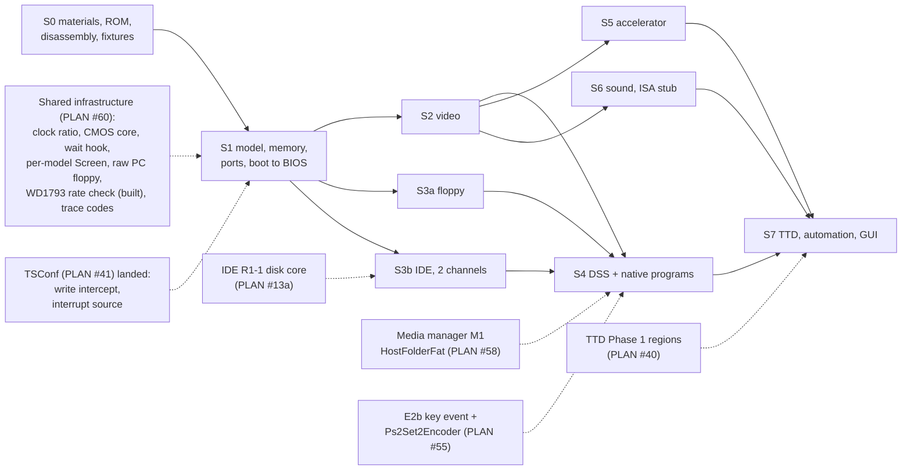

# Sprinter Sp2000 — roadmap and implementation plan

| | |
|---|---|
| **Date** | 2026-09-28 |
| **Status** | Review round 1 done (2026-09-28, decisions in §5). S0 done (2026-10-01, branch `sprinter-s0`; the MAME captures on branch `sprinter-mame`); **S1 done** (2026-10-01, branch `sprinter-s1`); S2-S7 not started. The owner started the program on 2026-10-01 (TSConf exists; the trigger is no longer "after #41"). PLAN row **#59** (T4); its shared prerequisites are row **#60** (done) |
| **Rule** | Test first. Each phase ends with a green `core-tests` run, zero warnings, its tests passing; nothing is committed without an explicit request |
| **Inputs** | [goals-and-requirements.md](goals-and-requirements.md) (ACC-*), [technical-design.md](technical-design.md), [test-plan.md](test-plan.md) |

## 1. Phases



Dashed arrows are work owned by other PLAN rows. The Sprinter is the **last** machine program
(§4): every dashed prerequisite is expected to have landed before S1 starts, so the Sprinter
consumes those pieces and builds none of them. Only S0 is Sprinter-specific work that can run
earlier.

| Phase | Content | Acceptance / tests | Size | Blocked by |
|---|---|---|---|---|
| **S0** | Provisioning: BIOS 3.04 (+3.06) in `data/rom/sprinter/` + README entry (3.04 source: HW-2000 `fw/bios/sp2k-3.04.253.bin`, [materials.md](materials.md) §5); **disassembly of ROM pages 8 and 0 of 3.04**, cross-checked against BIOS-TT `0271ac3`, into `docs/disasm/rom/sprinter/`, symbols into `data/symbols/sprinter/`; the loader traced once to capture the exact bitstream write count (Q4); the PLD (AHDL) sources checked for the accelerator INT-suspend (Q3); DSS 1.62 floppy and DSS 1.60R files in `testdata/machines/sprinter/` + `testdata/NOTICE.md`; add BIOS-TT, Shared_Includes, DSS and the PLD sources to the local emulator corpus; reference captures from MAME (page `#40` after POST, the BIOS logo frame, INT T-states for the three FN_SINC modes, the first 10 000 port accesses of BIOS 3.04 with codes); a small script that decodes a port-table page into the table of HW §4.4 | reference files checked in; decoded table equals HW §4.4; disassembly and symbol files in place. **Status 2026-10-01: done** (branch `sprinter-s0`; MAME captures on branch `sprinter-mame`): BIOS 3.04 in `data/rom/sprinter/` (3.06 not found publicly, recorded in `data/rom/README-ROMS.md`); listings of pages 8, 0, SETUP and the loader in [docs/disasm/rom/sprinter/](../../disasm/rom/sprinter/README.md), symbols in `data/symbols/sprinter/`; port-table decoder `tools/sprinter/dcp-table.py`, 3.04 table checked (HW §4.4: three differences to the BIOS-TT table); Q4 = 473 720 writes (static, tdd-ports-memory §6); Q3 = the PLD has the INT-suspend (tdd-accel-sound-input §1.3); DSS fixtures in `testdata/machines/sprinter/` + real-floppy WD1793 tests. **MAME captures** (MAME 0.289 subset build `zxsp` with the `sprinter` driver, `tools/verification/coemu/mame/README.md`; scripts `tools/verification/sprinter/`; files in `testdata/machines/sprinter/reference/`): page `#40` after POST equals the static table (CRC `b7f09600`, HW §4.4), the logo frame (frame 60, 1.229 s) and the no-media boot screen (frame 507, 10.383 s), INT positions for the FN_SYNC modes (MAME lines 271 / 287 / 295 for Scorpion / Pentagon / Spectrum, HW §6.1), the first 10 000 port accesses with codes, and the loader's write count at run time (473 720, Q4 confirmed). The end of configuration (CONF_DONE, PLD start-up clocks, CPU reset) is not visible in MAME (no PLD model) | S-M | — (can start now) |
| **S1** | Uses the landed shared hooks (clock ratio, write intercept, interrupt source, wait hook, CMOS core); `MM_SPRINTER` registration + config; `PortDecoder_Sprinter` (lookup, dispatch, cells, start-up gate, config loader + fast start); the `SprinterPldConfiguration` registry with the Standard module and a stub test module (tdd-ports-memory §6); `SprinterMemory` (bank formula, graphics pages, intercepts, reset page); `SprinterVideoRam` storage (no renderer yet) + INT list; Z84C15 package (SIO status and receive, CTC, PIO, system registers); CMOS on the shared `Ds12887` core + CMOS file; key matrix; the Sprinter wait rule `SprinterWaits` (technical design §4) | T-DCP-*, T-MEM-*, T-CFG-*, T-PLDM-*, T-Z84-*, T-RTC-*; **ACC-1a**: BIOS 3.04 reaches the boot menu (checked by the BIOS text in the text-mode VRAM area and the port-trace milestone "DCP opened"). **Status 2026-10-01: done** (branch `sprinter-s1`, see [§6](#6-s1-outcome-2026-10-01)) | L | S0; PLAN #60 |
| **S2** | `ScreenSprinter` (modes, palettes, border, flash, HOLD, 312/320), `R_736_288`, screenshots, `SprinterVideoMapper`; palette byte order settled | T-VID-*; **ACC-1** (logo golden image), **ACC-2** (setup + CMOS save) | L | S1 |
| **S3a** | Floppy: WD1793 via codes, DOS M1 hook, `#1F` operand rewrite, density: the `#BD` latch (codes `#16`/`#17`) wired to the WD1793 `Latched` clock policy via `WD1793::SetLatchedClock` (built 2026-09-29, commits `64756638`, `f304dde1`), `LoaderRawPcFloppy` from PLAN #60(f); TR-DOS in Spectrum mode | T-FDD-*; **ACC-3** (DSS from the 1.44 MB floppy, to the prompt), **ACC-6** (Spectrum mode, TR-DOS `LOAD` from a TRD) | M | S1 |
| **S3b** | IDE: `IdeAdapterSprinter`, two `AtaChannel`s, latch pattern (e); the built FAT16 HDD image fixture | T-IDE-*; **ACC-4** (DSS from an HDD image) | S-M | S1; IDE R1-1 (PLAN #13a) |
| **S4** | DSS interaction: E2b key event, `Ps2Set2Encoder` → SIO A, keyboard INT, serial mouse → SIO B; the DSS boot profile for folder volumes; native programs | **ACC-5** (DSS from a folder), **ACC-7** (256-color demo), **ACC-8** (Flex Navigator), `DIR` on ACC-3 | M | S2, S3a (S3b for ACC-5); media manager M1 (PLAN #58); E2b (PLAN #55) |
| **S5** | Accelerator (all modes, timing charge); INT-suspend / RETI-resume as a config option, **default on** because the PLD has it (Q3, decided 2026-10-01) | T-ACC-*; part of **ACC-9** | M | S2 |
| **S6** | Covox-Blaster, AY clock check, Covox; ISA register stub | T-CBL-*; **ACC-9** | S-M | S2 |
| **S7** | TTD serializers (ids 15-19), VRAM as a TTD region (or interim blob), native snapshot via the TTD key frame; automation (`state/sprinter`, port table endpoints, surfaces, recipe); Qt docks; ATAPI CD (IDE R1-7) and the "empty CD unit on `ide0.slave`" config option (Q5); docs moved to `docs/hardware/`, `DONE.md` | T-TTD-*; **ACC-10**, **ACC-11** | M-L | S4, S5, S6; TTD Phase 1 (PLAN #40) |

Sizes use the repo's scale (S < 1 week, M 1-2 weeks, L 2-4 weeks of focused work).

## 2. What can start now (no dependency)

Only S0 is Sprinter-specific work that can start now. The shared items this design introduced
(clock ratio, CMOS core and its migrations, wait-state hook, per-model `Screen` selection, raw PC
floppy loader, WD1793 rate check, port-trace internal codes) moved to PLAN row **#60** and are
done there, before TSConf. The WD1793 rate check is already built (2026-09-29) as the general WD1793
clock / data-rate model; the Sprinter only wires its latch in S3a.

| Item | Why now |
|---|---|
| S0 provisioning and MAME reference captures | cheap; every later phase needs the fixtures |
| S0 disassembly of BIOS 3.04 pages 8 and 0 (`docs/disasm/rom/sprinter/`, `data/symbols/sprinter/`) | no public 3.04 source exists ([materials.md](materials.md) §5); every BIOS trace in S1 needs the labels |
| Port-table decode script + reference table | settles HW §4.4 against BIOS 3.04 (the BIOS-TT table is from the 2026 beta) |
| Loader trace (exact bitstream write count) and the PLD check for the accelerator INT-suspend | inputs for Q4 and Q3 (§5) |

## 3. Dependencies on other PLAN rows

All rows below land **before** the Sprinter starts (§4), so no fallback is planned; the column
says what the Sprinter would need if one of them slipped.

| Row | What the Sprinter needs from it | Phase | If it slipped |
|---|---|---|---|
| #60 shared infrastructure (new) | clock ratio (`hw_turbo_ratio`; postponed from #60 to the start of this program - only the Sprinter needs it), `Ds12887` CMOS core + migrations, wait-state hook, per-model `Screen` selection, `LoaderRawPcFloppy`, port-trace internal codes (the WD1793 clock / data-rate model is built: `Latched` policy + `SetLatchedClock`) | S1-S3a | the Sprinter waits: these are prerequisites, not Sprinter work |
| #41 TSConf | write intercept, interrupt source (with `OnReti()`); also the trigger for #59 | S1 | the Sprinter waits |
| #13a IDE (rollout 1) | R1-1 disk core (S3b), R1-7 ATAPI (S7) | S3b, S7 | ACC-3 and ACC-6 do not need IDE |
| #58 media manager | M1 `HostFolderFat` (+ the `BootProfile` hook), M2 floppy slots, M6 IDE slots | S4 | image files through the existing `disk` path and the IDE config keys |
| #55 ZX-Evo E2b | key event with ZX + PC key, `Ps2Set2Encoder` | S4 | the Sprinter waits |
| #40 TTD v2 | device memory regions (VRAM) | S7 | whole-array blob with CRC |
| #42 video debug translation | `IVideoMapper` | S2 (mapper) | mapper later |

## 4. Priority

Owner decision (review round 1): **the Sprinter is the last machine program.** The order is:

1. Finish the shared infrastructure: TTD v2 (#40), video mappers (#42), media manager (#58), the
   IDE core (#13a), and the generic hooks, including the new row **#60** (clock ratio, CMOS core,
   wait-state hook, per-model `Screen` selection, raw PC floppy loader, WD1793 rate check (built),
   port-trace internal codes) plus the write intercept and the interrupt source.
2. Migrate BaseConf (ATM3) and the other existing machines onto that infrastructure.
3. TSConf (#41).
4. The Sprinter: PLAN row **#59** (T4), trigger "TSConf #41 landed".

S0 (provisioning, disassembly, reference captures) is the only Sprinter-specific work that may run
earlier. Inside #59 the phases stay ordered so that the floppy DSS boot (ACC-3) and the Spectrum
mode (ACC-6) come before anything that needs the IDE core or the media manager.

## 5. Review round 1 decisions

Round 1 (2026-09-28) answered the six open questions and added one requirement. Each decision is
applied in the file named in the last column.

| # | Question | Decision | Applied in |
|---|---|---|---|
| Q1 | Default ROM | **3.04** (CRC `1729cb5c`) by default, 3.06 selectable, tests on both. The exact 3.04 image was found in the board repository; the ZXMAK2 `SP_304.BIN` is the same build with 5 different bytes (a board-id variant). No public 3.04 source exists, so S0 disassembles ROM pages 8 and 0 | [materials.md](materials.md) §5 |
| Q2 | Fast start or full start | **Full start** (the ROM loader streams the bitstream) is the user default; `FastStart=1` is the default for tests; an equivalence test keeps both paths identical | [tdd-ports-memory.md](tdd-ports-memory.md) §6, [tdd-integration.md](tdd-integration.md) §1.1 |
| Q3 | Accelerator stops on INT and resumes on RETI | implemented in S5 as a **config option, default on** (decided 2026-10-01 after the S0 check; off = MAME's behavior, kept for comparisons). S0 checks the PLD (AHDL) sources for whether the standard configuration has it, so the documented default is the right one. **S0 result (2026-10-01): it has it** (`ACCELER.TDF` `ACC_BLK`: INT acknowledge blocks new accelerator operations, the first M1 after `RETI` unblocks, the mode register is kept, `RETN` does not unblock); default **on** (owner decision 2026-10-01) | [tdd-accel-sound-input.md](tdd-accel-sound-input.md) §1.3 |
| Q4 | End of the bitstream | count the **real bitstream**: 59 215 bytes × 8 writes (the loader shifts out one bit per write; S0 traces the loader for the exact count). **S0 result (2026-10-01, static): exactly 473 720 writes** (no preamble writes, the loop never ends by itself); **confirmed at run time on MAME** (2026-10-01: 0 writes before the stream, 473 720 while the loader reads `#0100-#E84E`); a watchdog timeout stays. The configuration is identified by a hash of the first 4 096 writes (MAME-compatible) and a hash of the full stream | [tdd-ports-memory.md](tdd-ports-memory.md) §6 |
| Q5 | `ide0.slave` default | **empty**. An empty CD unit there becomes a config option once ATAPI exists (S7). A test checks the BIOS device probe in both setups | [tdd-storage.md](tdd-storage.md) §1 |
| Q6 | Game / DooM / Video configurations | **modular**: an extension point `SprinterPldConfiguration` (a registry of configuration modules). v1 ships the Standard module only; Game, DooM and Video become later modules after their bitstreams are analyzed against MAME (a follow-up task after v1) | [high-level-design.md](high-level-design.md) D2, D11; [tdd-ports-memory.md](tdd-ports-memory.md) §6 |

Shared-infrastructure decisions from the same round:

| Topic | Decision | Applied in |
|---|---|---|
| Clock | **built (PLAN #60(b), 2026-09-29):** `hw_turbo_shift` / `hw_turbo_shift_applied` became `hw_turbo_ratio` / `hw_turbo_ratio_applied` (1-8) everywhere. No backward compatibility and no converter (there were no public releases); the TTD checkpoint fields change and the TTD fixture corpus is re-recorded | [technical-design.md](technical-design.md) §3 |
| Wait states | the per-bank byte is only a "this bank has waits" flag; the cost comes from `SprinterWaits::ExtraClocks(kind, t)` because MAME's rule depends on the clock phase | [technical-design.md](technical-design.md) §4 |
| CMOS | `Ds12887` becomes the shared MC146818 core, extracted from the ATM3 `CMOS`; ATM3, Profi, SMUC and the ZX-Evo AVR clock migrate onto it in a separate task before the Sprinter | [tdd-storage.md](tdd-storage.md) §4 |
| Other hooks | accepted as designed: write intercept, interrupt source + `OnReti()`, cache pages 2 → 4, per-model `Screen`, WD1793 rate check (built 2026-09-29 as the `Latched` clock policy), raw PC floppy loader, `BootProfile` in `HostFolderFat`, port trace with internal code | [technical-design.md](technical-design.md) §2 |
| Sequencing | the Sprinter is the last machine program; PLAN row #59 (T4, trigger TSConf #41 landed); shared pieces in row #60 before TSConf | §4 |

## 6. S1 outcome (2026-10-01)

Branch `sprinter-s1`. `SPRINTER` is creatable (model table, `data/configs/sprinter/unreal.ini`,
`[ROM] SPRINTER=rom/sprinter/sp2k-3.04.rom` loaded as 16 pages, 4 MB RAM, fast RAM = the 4 cache
pages). BIOS 3.04 cold start, both with the fast start and with the full start through the ROM's
PLD loader, reaches its boot prompt:

```text
Model name: Sprinter                    Sprinter BIOS: ver 3.04.253
Memory    : 4096K                       All Rights Reserved
CMOS      : Found, 19:44:19             Press <ALT> for Alt. System Disk
WARNING! CMOS CHECKSUM ERROR, INSTALL DEFAULT VALUES!
 Detecting IDE Primary Master   ... None
 Detecting IDE Primary Slave    ... None
Start from Hard disk...fail
Alternative Start from Diskette...fail
PRESS <ENTER> TO REBOOT, <ESC> TO CANCEL . . .
```

(read back from the video RAM mode table: a text square's Mode1 byte is the character code;
`SprinterBoot_Test.Bios304_ReachesTheBootMenu`, ~0.3 s with the turbo mode).

| Item | Where | Tests |
|---|---|---|
| `PortDecoder_Sprinter`: page `#40` lookup, code dispatch through the configuration module, cells `#C0-#FF` with the CNF clean rules, start-up gate, the "nailed" `#3C/#7C`, `#5C`, `#FB/#7B` decodes, the TR-DOS signal by M1 fetch (`#3Dxx` / `≥ #4000`), port waits | `core/src/emulator/ports/models/portdecoder_sprinter.*` | `portdecoder_sprinter_test.cpp` (T-DCP-1..8, T-MEM-1/2, T-RTC-1..3) |
| `SprinterPldConfiguration` registry, `SprinterPldStandard`, bitstream sink (473 720 writes, MAME head hash + FNV-1a full hash, 300-frame watchdog), fast start, reload `#2E` | `core/src/emulator/ports/models/sprinter/` | `sprinterpldconfig_test.cpp` (T-CFG-1..6 incl. the full-start / fast-start equivalence on the real ROM), `sprinterpldconfiguration_test.cpp` (T-PLDM-1, 2, 4, 5 with a stub module) |
| `SprinterMemory`: MAME's bank formula, graphics pages, the Spectrum screen shadow, reset page `#A0`, ISA view, fast RAM, the loader layout (ROM `#C-#F`, fast RAM above the Z84C15 CS0 boundary) | `core/src/emulator/memory/sprinter/` | `sprintermemory_test.cpp` (T-MEM-3..9; window 0 over all 256 combinations against a transcription of MAME's formula) |
| `SprinterWaits` (MAME's phase rule, memory 3 / port 4) on `MemoryWaitOverlay`, installed only at 21 MHz | `memory/sprinter/sprinterwaits.h` | `sprinterwaits_test.cpp` (T-MEM-10) |
| `SprinterVideoRam` (256 KB, the INT-byte notification) and `SprinterIntSource` (MAME's `update_int`, 32 T pulse) | `core/src/emulator/video/sprinter/` | `sprintervideoram_test.cpp`, `sprinterintsource_test.cpp` |
| Z84C15 package: SIO (async, RR0/RR1/RR2, 3-byte FIFO), CTC (timer readback), PIO register file, system registers + chip selects, WDT registers | `core/src/emulator/io/z84c15/` | `z84sio_test.cpp`, `z84ctc_test.cpp`, `z84pio_test.cpp` (T-Z84) |
| `Ds12887` at codes `#1C/#1D/#1E`, 128 cells, century `#32`, `[SPRINTER] CmosFile` | decoder | T-RTC-1..3 |
| Isolation | `sprinterisolation_test.cpp` | the TSConf precedent |

Findings and deviations from the design (applied in the documents named):

- **"DCP opened" is the IN at page 8 `#0CD8`**, the last instruction of `DcpInit`, not `#0258`
  (exp README step 3 said "then `IN A,(#E2)`"; both are right, the first IN is DcpInit's own).
- **Page `#40` at the boot prompt equals the static 3.04 table** (CRC `b7f09600`) byte for byte:
  the run-time edits seen on the way (FnF8 `SET_PORTS` maps port `#0000` to cell `#EE` through
  indexes `#000/#200`, SETUP's `ApplyScreenPosition` puts code `#CB` at `#0400`) are undone before
  the prompt.
- **The TR-DOS signal is S1 work, not S3a**: the BIOS reaches its functions through `#3D13`
  (`ToBios3D13`), and FnF8 relies on the "DOS on" half of the table there. Without the M1 rule the
  BIOS restarts itself in an endless POST loop. The decoder is the machine's M1 hook.
- **IDE without a drive**: until the IDE adapter (S3b) the IDE codes read `#FF` (BSY set), as an
  empty bus does on the shared IDE core; SETUP then waits ~31 s per unit ("Detecting IDE ...
  [Press F4 to skip]"). The boot test presses F4 through the SIO (scan code `#0C`), which also
  proves the keyboard path SETUP polls. **Settled (2026-10-01): `#FF` is the board's answer** - no
  pull-down on DD7, LS-TTL transceivers read an undriven bus high (hardware-reference §9.1). MAME
  differs because its default slots hold drives (see §6.1 (b)).
- **TTD**: `PeripheralId::SprinterPld = 25` is declared without a serializer, so TTD refuses to
  record the Sprinter until S7 instead of recording a state it cannot restore; the CMOS uses the
  shared id 18. The ids of tdd-integration §2.1 are therefore 25 (PLD) and up.
- **INT acknowledge**: one INT per pulse (the acknowledge ends it); MAME keeps the line for the
  full 32 T. **Settled (2026-10-01): the PLD ends it at the acknowledge** (`SP2_1K30.TDF:744`,
  hardware-reference §6.1); MAME is the simplification.
- **Z84C15 system registers survive the PLD's CPU reset** (MAME sets them at device start only);
  they matter only while the PLD loads (the chip selects).
- **Frame length**: codes `#2C/#2D` are stored and feed the INT list; the frame itself stays
  71 680 T until the renderer (S2).
- **Not in S1** (as planned): renderer, WD1793 density latch, `#1F` operand rewrite, IDE, keyboard
  scan-code encoder and keyboard INT, accelerator, Covox-Blaster, CTC/SIO interrupts.
- `[SPRINTER] CmosFile` ships commented out (as `[PROFI] NvramFile`), so a fresh machine shows
  "CMOS CHECKSUM ERROR, INSTALL DEFAULT VALUES" like a real board with a flat battery.

### 6.1 S1 against the MAME references (2026-10-01)

References: [testdata/machines/sprinter/reference/](../../../testdata/machines/sprinter/reference/README.md)
(new: `palette.csv`, mode `palette` of `tools/verification/sprinter/mame-capture.lua`; the boot mode
takes `SPC_CODES` / `SPC_PORTS_FILE` to trace one code range over the whole boot). Tests:
`core/tests/emulator/machines/sprinter/sprinterreference_test.cpp`. Time base: MAME starts the BIOS
58 225 T after power-on (after its 4 096-write shortcut), the fast start at T 0; times below are
from the BIOS start, frames are MAME's.

| Check | MAME | unreal-ng | Result |
|---|---|---|---|
| (d) first 10 000 port accesses (direction, port, value, PC, code) | `ports.csv` | 9 989 BIOS accesses (the loader's 11 are FastStart's) | **identical**, in order |
| (d) timing at 3.5 MHz (to the turbo switch, access 798) | | | **identical to the T-state** |
| (c) "DCP opened" (IN at page 8 `#0CD8`) | 0.677 332 s from power-on = 2 312 334 T after the BIOS's first access | the same | **equal** |
| (d) timing at 21 MHz (access 799 to 9 989, 61.4 ms) | | S1: +1 245 µs; **fixed: +5.7 µs** | port wait clock fixed (technical-design §4) |
| (c) logo palette in video RAM | full at frame 58 (302 720), fade one step per frame to frame 186; `logo.png` = frame 60 (302 548) | the same sums, frame by frame, 58-186 | **equal**; build-up 55-57 moves by up to a frame with the start offset (also between MAME runs) |
| (c) loader | 473 720 writes, last at 6 691 665 T (1.912 s) | 473 720, last at 6 691 671 T (+6 T: the shared Z80 reset charges 3 T before the first fetch, and the probe read the clock after the 3-T write cycle where MAME stamps its start), 113 T per byte | **equal** (the CPU reset after it is not in MAME) |
| (a) INT positions, FN_SYNC A = 1/2/3/0 | 60 896 / 64 480 / 66 272 / 66 272 T | the same | **equal** |
| (a) INT acknowledge | routine's first fetch 6.5-10.5 T after the edge | 7-8 T | **equal**; the acknowledge ends the pulse (PLD) |
| (b) IDE detection | drives in MAME's default slots: master `#52`/IDENTIFY abort `#51`, slave CD `#10`/`#11` polled 280 frames; boot screen frame 507 (10.38 s) | no drive: `#FF`, 1 550 frames per unit; prompt at frame 3 291 (67.4 s) without F4 | **expected difference** (MAME emulates drives; `#FF` is the board) |
| (e) page `#40` | CRC `b7f09600` | equal (`SprinterBoot_Test`) | **equal** |

Fix: the turbo port wait was taken 2 clocks early (`AccessStartClock()` is the start of a 3-T memory
cycle; the decoder runs 1 T into the 4-T I/O cycle). `SprinterWaits::IoCycleStart` gives the cycle
start, Sprinter-local; no shared Z80 code changed.

Open (recorded, not changed in S1):
- **CPU emulation approach: pending the CPU research (`research-cpu-z84c15.md`)**. The Sprinter
  CPU is a Z84C15 (CMOS Z84C00 core + SIO/CTC/PIO/WDT/chip selects); the CPU variant settings
  (`OUT (C),0` value, CMOS undocumented flags, the NMOS LD A,I / LD A,R parity quirk the shared core
  always applies) are left as they are until that research decides; a CPU-specific part, if any,
  goes into a separate vendored CPU library later. Sprinter timing code stays in Sprinter classes.
- **Origin of the wait rule** (MAME's "align to 6, then 6 − taken" vs the PLD's `/IO` wait
  counter with per-code lengths and its memory-cycle wait, and the Z84C15's own wait generator):
  pending the same research; numbers in technical-design §4.
- **PLD wait on Z84C15 port writes**: unreal-ng adds it (the PLD sees every IORQ write), MAME adds
  none (16 writes in the first 10 000 accesses, 6 clocks each). Pending the CPU research (whether
  the Z84C15 shows its internal I/O cycles on the external bus).
- **SIO A status (RR0)** read by the frame INT: MAME `#7C` (DCD, CTS, sync/hunt, Tx underrun
  reflect its RS-232 / keyboard slot lines), unreal-ng `#04` (Tx empty only). The BIOS tests only
  bit 0, so the flow is the same; the line states belong to S4 (keyboard / mouse).
- **INT pulse without acknowledge**: the PLD's 32-64 T (two `CTH2` edges) vs MAME's 32 T, which
  unreal-ng keeps (hardware-reference §6.1).
- MAME's timestamps are not usable around a turbo switch (they jump back 4.77 ms at the
  `set_clock_scale` call), so 21-MHz comparisons use durations from the access after the switch.

