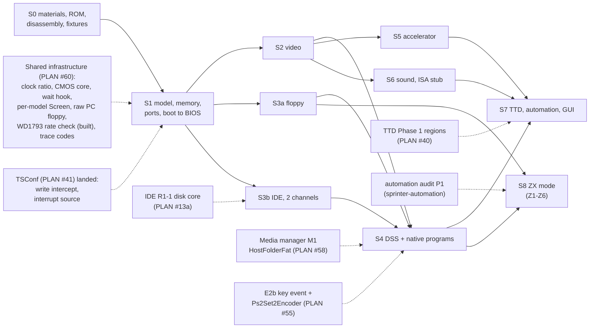

# Sprinter Sp2000 — roadmap and implementation plan

| | |
|---|---|
| **Date** | 2026-09-28 |
| **Status** | Review round 1 done (2026-09-28, decisions in §5). S0 done (2026-10-01, branch `sprinter-s0`; the MAME captures on branch `sprinter-mame`); **S1 done** (2026-10-01, branch `sprinter-s1`); CPU on its own Z84C15 library (2026-10-01, branch `sprinter-cpu`, [2026-10-01-z84c15-cpu-library](../2026-10-01-z84c15-cpu-library/README.md)); **S2 done** (2026-10-01, branch `sprinter-s2`, §7); **S3a done** (2026-10-01, branch `sprinter-s3a`, §8); **S3b done** (2026-10-02, branch `sprinter-s3b`, §9); S4-S7 not started. The owner started the program on 2026-10-01 (TSConf exists; the trigger is no longer "after #41"). PLAN row **#59** (T4); its shared prerequisites are row **#60** (done) |
| **Rule** | Test first. Each phase ends with a green `core-tests` run, zero warnings, its tests passing; nothing is committed without an explicit request |
| **Inputs** | [goals-and-requirements.md](goals-and-requirements.md) (ACC-*), [technical-design.md](technical-design.md), [test-plan.md](test-plan.md) |

## 1. Phases



Dashed arrows are work owned by other PLAN rows. The Sprinter is the **last** machine program
(§4): every dashed prerequisite is expected to have landed before S1 starts, so the Sprinter
consumes those pieces and builds none of them. Only S0 is Sprinter-specific work that can run
earlier.

| Phase | Content | Acceptance / tests | Size | Blocked by |
|---|---|---|---|---|
| **S0** | Provisioning: BIOS 3.04 (+3.06) in `data/rom/sprinter/` + README entry (3.04 source: HW-2000 `fw/bios/sp2k-3.04.253.bin`, [materials.md](materials.md) §5); **disassembly of ROM pages 8 and 0 of 3.04**, cross-checked against BIOS-TT `0271ac3`, into `docs/disasm/rom/sprinter/`, symbols into `data/symbols/sprinter/`; the loader traced once to capture the exact bitstream write count (Q4); the PLD (AHDL) sources checked for the accelerator INT-suspend (Q3); DSS 1.62 floppy and DSS 1.60R files in `testdata/machines/sprinter/` + `testdata/NOTICE.md`; add BIOS-TT, Shared_Includes, DSS and the PLD sources to the local emulator corpus; reference captures from MAME (page `#40` after POST, the BIOS logo frame, INT T-states for the three FN_SINC modes, the first 10 000 port accesses of BIOS 3.04 with codes); a small script that decodes a port-table page into the table of HW §4.4 | reference files checked in; decoded table equals HW §4.4; disassembly and symbol files in place. **Status 2026-10-01: done** (branch `sprinter-s0`; MAME captures on branch `sprinter-mame`): BIOS 3.04 in `data/rom/sprinter/` (3.06 not found publicly, recorded in `data/rom/README-ROMS.md`); listings of pages 8, 0, SETUP and the loader in [docs/disasm/rom/sprinter/](../../disasm/rom/sprinter/README.md), symbols in `data/symbols/sprinter/`; port-table decoder `tools/machines/sprinter/dcp-table/dcp-table.py`, 3.04 table checked (HW §4.4: three differences to the BIOS-TT table); Q4 = 473 720 writes (static, tdd-ports-memory §6); Q3 = the PLD has the INT-suspend (tdd-accel-sound-input §1.3); DSS fixtures in `testdata/machines/sprinter/` + real-floppy WD1793 tests. **MAME captures** (MAME 0.289 subset build `zxsp` with the `sprinter` driver, `tools/verification/coemu/mame/README.md`; scripts `tools/machines/sprinter/mame-capture/`; files in `testdata/machines/sprinter/reference/`): page `#40` after POST equals the static table (CRC `b7f09600`, HW §4.4), the logo frame (frame 60, 1.229 s) and the no-media boot screen (frame 507, 10.383 s), INT positions for the FN_SYNC modes (MAME lines 271 / 287 / 295 for Scorpion / Pentagon / Spectrum, HW §6.1), the first 10 000 port accesses with codes, and the loader's write count at run time (473 720, Q4 confirmed). The end of configuration (CONF_DONE, PLD start-up clocks, CPU reset) is not visible in MAME (no PLD model) | S-M | — (can start now) |
| **S1** | Uses the landed shared hooks (clock ratio, write intercept, interrupt source, wait hook, CMOS core); `MM_SPRINTER` registration + config; `PortDecoder_Sprinter` (lookup, dispatch, cells, start-up gate, config loader + fast start); the `SprinterPldConfiguration` registry with the Standard module and a stub test module (tdd-ports-memory §6); `SprinterMemory` (bank formula, graphics pages, intercepts, reset page); `SprinterVideoRam` storage (no renderer yet) + INT list; Z84C15 package (SIO status and receive, CTC, PIO, system registers); CMOS on the shared `Ds12887` core + CMOS file; key matrix; the Sprinter wait rule `SprinterWaits` (technical design §4) | T-DCP-*, T-MEM-*, T-CFG-*, T-PLDM-*, T-Z84-*, T-RTC-*; **ACC-1a**: BIOS 3.04 reaches the boot menu (checked by the BIOS text in the text-mode VRAM area and the port-trace milestone "DCP opened"). **Status 2026-10-01: done** (branch `sprinter-s1`, see [§6](#6-s1-outcome-2026-10-01)) | L | S0; PLAN #60 |
| **S2** | `ScreenSprinter` (modes, palettes, border, flash, HOLD, 312/320), `R_736_288`, screenshots, `SprinterVideoMapper`; palette byte order settled | T-VID-*; **ACC-1** (logo golden image), **ACC-2** (setup + CMOS save). **Status 2026-10-01: done** (branch `sprinter-s2`, see [§7](#7-s2-outcome-2026-10-01)) | L | S1 |
| **S3a** | Floppy: WD1793 via codes, DOS M1 hook, `#1F` operand rewrite, density: the `#BD` latch (codes `#16`/`#17`) wired to the WD1793 `Latched` clock policy via `WD1793::SetLatchedClock` (built 2026-09-29, commits `64756638`, `f304dde1`), `LoaderRawPcFloppy` from PLAN #60(f); TR-DOS in Spectrum mode | T-FDD-*; **ACC-3** (DSS from the 1.44 MB floppy, to the prompt), **ACC-6** (Spectrum mode, TR-DOS `LOAD` from a TRD). **Status 2026-10-01: done** (branch `sprinter-s3a`, see [§8](#8-s3a-outcome-2026-10-01)): DSS 1.62.92 boots from the floppy to `B:\>`; Spectrum mode (through DSS `SPECTRUM.EXE`: BIOS 3.04 holds no Spectrum ROMs) lists and loads a TRD | M | S1 |
| **S3b** | IDE: `IdeAdapterSprinter`, two `AtaChannel`s, latch pattern (e); the built FAT16 HDD image fixture | T-IDE-*; **ACC-4** (DSS from an HDD image). **Status 2026-10-02: done** (branch `sprinter-s3b`, see [§9](#9-s3b-outcome-2026-10-02)): DSS 1.62.92 boots from a built image on `ide0.master` (BIOS 3.04, `C:\>` at frame 495, MKDIR lands in the image), both channels through BIOS 3.06, the owner's real disks boot (DSS 1.71.57 on 3.06, DSS 1.62.93 on 3.04) | S-M | S1; IDE R1-1 (PLAN #13a) |
| **S4** | DSS interaction: E2b key event, `Ps2Set2Encoder` → SIO A, keyboard INT, serial mouse → SIO B; the DSS boot profile for folder volumes; native programs | **ACC-5** (DSS from a folder), **ACC-7** (256-color demo), **ACC-8** (Flex Navigator), `DIR` on ACC-3 | M | S2, S3a (S3b for ACC-5); media manager M1 (PLAN #58); E2b (PLAN #55) |
| **S5** | Accelerator (all modes, timing charge); INT-suspend / RETI-resume as a config option, **default on** because the PLD has it (Q3, decided 2026-10-01) | T-ACC-*; part of **ACC-9** | M | S2 |
| **S6** | Covox-Blaster, AY clock check, Covox; ISA register stub. **Status 2026-10-02: done** (branch `sprinter-s6`, [s6-sound-outcome.md](s6-sound-outcome.md)): `CovoxBlaster` in the COVOX mixer slot, one AY at 1.75 MHz, TTD id 32, PT3PLAY / WAVPLAY against MAME; the accelerator INT suspend default is off since (WAVPLAY) | T-CBL-*; **ACC-9** | S-M | S2 |
| **S6b** | ISA slots: bus core, ZX-bus adapter + GS / NeoGS (ProPlay), ISA RAM, PIO interrupt lines - design [2026-10-02-sprinter-isa](../2026-10-02-sprinter-isa/tdd.md) phases I0-I8 (owner decisions Q1-Q3 taken 2026-10-02). **Status 2026-10-02: designed, not built** | T-ISA-*; ProPlay plays a MOD | M + M (I1 + I2) | S6 merged |
| **S6c** | Network cards in the ISA slots: NE2000-class Ethernet first (owner decision 2026-10-02), SprinterESP Wi-Fi, 3C509B, ISA modem, SprinterSerial; shared chips and the Ethernet gateway on the virtual network, one thin Sprinter wrapper - design [2026-10-02-sprinter-network](../2026-10-02-sprinter-network/tdd.md) phases SN0-SN6. **Status 2026-10-02: designed, not built** | T-NET-*; the RTL8019AS kit's `IFUP` + `WGET` reach a host server; the Wi-Fi kit the same over ESP | M-L for Ethernet (SN0-SN2), M for Wi-Fi (SN3) | S6b I1 (SN1, SN3), I4 (SN4) |
| **S7** | TTD serializers (ids 15-19), VRAM as a TTD region (or interim blob), native snapshot via the TTD key frame; automation (`state/sprinter`, port table endpoints, surfaces, recipe); Qt docks; ATAPI CD (IDE R1-7) and the "empty CD unit on `ide0.slave`" config option (Q5); docs moved to `docs/hardware/`, `DONE.md` | T-TTD-*; **ACC-10**, **ACC-11** | M-L | S4, S5, S6; TTD Phase 1 (PLAN #40) |
| **S8** | ZX (Spectrum-compatible) mode end to end ([research-zx-mode.md](research-zx-mode.md), [tdd-zx-mode.md](tdd-zx-mode.md) §9): **Z1** faithful path checked against the MAME captures (DSS launcher v2.03 + TRD / SCL into the BIOS RAM disk, TR-DOS 7.03, Ctrl+Alt+Del back to DSS, the Peters Plus launcher with a TRD) (S); **Z2** tape: I5 test and the base-clock tape time base under turbo (S-M); **Z3** "original waits" (ALL_MODE bit 2, PLD `WAIT_ORIG`) with A/B (M); **Z4** `SprinterZxMode` state on the five surfaces (S-M); **Z5** snapshots into the ZX mode through the cell table + the refusal outside it (M); **Z6** `zx run` macro, recipe, TTD replay (M) | T-ZX-1..14; ACC-6 extended (RAM disk, SCL, tape) | M-L | S3a, S3b, S4 (done); Z4 after the automation audit P1 branch; Z6 after Z1 and Z4; **not** on S6b (General Sound from Spectrum programs is S6b's matter) |

Sizes use the repo's scale (S < 1 week, M 1-2 weeks, L 2-4 weeks of focused work).

## 2. What can start now (no dependency)

Only S0 is Sprinter-specific work that can start now. The shared items this design introduced
(clock ratio, CMOS core and its migrations, wait-state hook, per-model `Screen` selection, raw PC
floppy loader, WD1793 rate check, port-trace internal codes) moved to PLAN row **#60** and are
done there, before TSConf. The WD1793 rate check is already built (2026-09-29) as the general WD1793
clock / data-rate model; the Sprinter only wires its latch in S3a.

| Item | Why now |
|---|---|
| S0 provisioning and MAME reference captures | cheap; every later phase needs the fixtures |
| S0 disassembly of BIOS 3.04 pages 8 and 0 (`docs/disasm/rom/sprinter/`, `data/symbols/sprinter/`) | no public 3.04 source exists ([materials.md](materials.md) §5); every BIOS trace in S1 needs the labels |
| Port-table decode script + reference table | settles HW §4.4 against BIOS 3.04 (the BIOS-TT table is from the 2026 beta) |
| Loader trace (exact bitstream write count) and the PLD check for the accelerator INT-suspend | inputs for Q4 and Q3 (§5) |

## 3. Dependencies on other PLAN rows

All rows below land **before** the Sprinter starts (§4), so no fallback is planned; the column
says what the Sprinter would need if one of them slipped.

| Row | What the Sprinter needs from it | Phase | If it slipped |
|---|---|---|---|
| #60 shared infrastructure (new) | clock ratio (`hw_turbo_ratio`; postponed from #60 to the start of this program - only the Sprinter needs it), `Ds12887` CMOS core + migrations, wait-state hook, per-model `Screen` selection, `LoaderRawPcFloppy`, port-trace internal codes (the WD1793 clock / data-rate model is built: `Latched` policy + `SetLatchedClock`) | S1-S3a | the Sprinter waits: these are prerequisites, not Sprinter work |
| #41 TSConf | write intercept, interrupt source (with `OnReti()`); also the trigger for #59 | S1 | the Sprinter waits |
| #13a IDE (rollout 1) | R1-1 disk core (S3b), R1-7 ATAPI (S7) | S3b, S7 | ACC-3 and ACC-6 do not need IDE |
| #58 media manager | M1 `HostFolderFat` (+ the `BootProfile` hook), M2 floppy slots, M6 IDE slots | S4 | image files through the existing `disk` path and the IDE config keys |
| #55 ZX-Evo E2b | key event with ZX + PC key, `Ps2Set2Encoder` | S4 | the Sprinter waits |
| #40 TTD v2 | device memory regions (VRAM) | S7 | whole-array blob with CRC |
| #42 video debug translation | `IVideoMapper` | S2 (mapper) | mapper later |

## 4. Priority

Owner decision (review round 1): **the Sprinter is the last machine program.** The order is:

1. Finish the shared infrastructure: TTD v2 (#40), video mappers (#42), media manager (#58), the
   IDE core (#13a), and the generic hooks, including the new row **#60** (clock ratio, CMOS core,
   wait-state hook, per-model `Screen` selection, raw PC floppy loader, WD1793 rate check (built),
   port-trace internal codes) plus the write intercept and the interrupt source.
2. Migrate BaseConf (ATM3) and the other existing machines onto that infrastructure.
3. TSConf (#41).
4. The Sprinter: PLAN row **#59** (T4), trigger "TSConf #41 landed".

S0 (provisioning, disassembly, reference captures) is the only Sprinter-specific work that may run
earlier. Inside #59 the phases stay ordered so that the floppy DSS boot (ACC-3) and the Spectrum
mode (ACC-6) come before anything that needs the IDE core or the media manager.

## 5. Review round 1 decisions

Round 1 (2026-09-28) answered the six open questions and added one requirement. Each decision is
applied in the file named in the last column.

| # | Question | Decision | Applied in |
|---|---|---|---|
| Q1 | Default ROM | **3.04** (CRC `1729cb5c`) by default, 3.06 selectable, tests on both. The exact 3.04 image was found in the board repository; the ZXMAK2 `SP_304.BIN` is the same build with 5 different bytes (a board-id variant). No public 3.04 source exists, so S0 disassembles ROM pages 8 and 0 | [materials.md](materials.md) §5 |
| Q2 | Fast start or full start | **Full start** (the ROM loader streams the bitstream) is the user default; `FastStart=1` is the default for tests; an equivalence test keeps both paths identical | [tdd-ports-memory.md](tdd-ports-memory.md) §6, [tdd-integration.md](tdd-integration.md) §1.1 |
| Q3 | Accelerator stops on INT and resumes on RETI | implemented in S5 as a **config option, default on** (decided 2026-10-01 after the S0 check; off = MAME's behavior, kept for comparisons). S0 checks the PLD (AHDL) sources for whether the standard configuration has it, so the documented default is the right one. **S0 result (2026-10-01): it has it** (`ACCELER.TDF` `ACC_BLK`: INT acknowledge blocks new accelerator operations, the first M1 after `RETI` unblocks, the mode register is kept, `RETN` does not unblock); default **on** (owner decision 2026-10-01) | [tdd-accel-sound-input.md](tdd-accel-sound-input.md) §1.3 |
| Q4 | End of the bitstream | count the **real bitstream**: 59 215 bytes × 8 writes (the loader shifts out one bit per write; S0 traces the loader for the exact count). **S0 result (2026-10-01, static): exactly 473 720 writes** (no preamble writes, the loop never ends by itself); **confirmed at run time on MAME** (2026-10-01: 0 writes before the stream, 473 720 while the loader reads `#0100-#E84E`); a watchdog timeout stays. The configuration is identified by a hash of the first 4 096 writes (MAME-compatible) and a hash of the full stream | [tdd-ports-memory.md](tdd-ports-memory.md) §6 |
| Q5 | `ide0.slave` default | **empty**. An empty CD unit there becomes a config option once ATAPI exists (S7). A test checks the BIOS device probe in both setups | [tdd-storage.md](tdd-storage.md) §1 |
| Q6 | Game / DooM / Video configurations | **modular**: an extension point `SprinterPldConfiguration` (a registry of configuration modules). v1 ships the Standard module only; Game, DooM and Video become later modules after their bitstreams are analyzed against MAME (a follow-up task after v1) | [high-level-design.md](high-level-design.md) D2, D11; [tdd-ports-memory.md](tdd-ports-memory.md) §6 |

Shared-infrastructure decisions from the same round:

| Topic | Decision | Applied in |
|---|---|---|
| Clock | **built (PLAN #60(b), 2026-09-29):** `hw_turbo_shift` / `hw_turbo_shift_applied` became `hw_turbo_ratio` / `hw_turbo_ratio_applied` (1-8) everywhere. No backward compatibility and no converter (there were no public releases); the TTD checkpoint fields change and the TTD fixture corpus is re-recorded | [technical-design.md](technical-design.md) §3 |
| Wait states | the per-bank byte is only a "this bank has waits" flag; the cost comes from `SprinterWaits::ExtraClocks(kind, t)` because MAME's rule depends on the clock phase | [technical-design.md](technical-design.md) §4 |
| CMOS | `Ds12887` becomes the shared MC146818 core, extracted from the ATM3 `CMOS`; ATM3, Profi, SMUC and the ZX-Evo AVR clock migrate onto it in a separate task before the Sprinter | [tdd-storage.md](tdd-storage.md) §4 |
| Other hooks | accepted as designed: write intercept, interrupt source + `OnReti()`, cache pages 2 → 4, per-model `Screen`, WD1793 rate check (built 2026-09-29 as the `Latched` clock policy), raw PC floppy loader, `BootProfile` in `HostFolderFat`, port trace with internal code | [technical-design.md](technical-design.md) §2 |
| Sequencing | the Sprinter is the last machine program; PLAN row #59 (T4, trigger TSConf #41 landed); shared pieces in row #60 before TSConf | §4 |

## 6. S1 outcome (2026-10-01)

Branch `sprinter-s1`. `SPRINTER` is creatable (model table, `data/configs/sprinter/unreal.ini`,
`[ROM] SPRINTER=rom/sprinter/sp2k-3.04.rom` loaded as 16 pages, 4 MB RAM, fast RAM = the 4 cache
pages). BIOS 3.04 cold start, both with the fast start and with the full start through the ROM's
PLD loader, reaches its boot prompt:

```text
Model name: Sprinter                    Sprinter BIOS: ver 3.04.253
Memory    : 4096K                       All Rights Reserved
CMOS      : Found, 19:44:19             Press <ALT> for Alt. System Disk
WARNING! CMOS CHECKSUM ERROR, INSTALL DEFAULT VALUES!
 Detecting IDE Primary Master   ... None
 Detecting IDE Primary Slave    ... None
Start from Hard disk...fail
Alternative Start from Diskette...fail
PRESS <ENTER> TO REBOOT, <ESC> TO CANCEL . . .
```

(read back from the video RAM mode table: a text square's Mode1 byte is the character code;
`SprinterBoot_Test.Bios304_ReachesTheBootMenu`, ~0.3 s with the turbo mode).

| Item | Where | Tests |
|---|---|---|
| `PortDecoder_Sprinter`: page `#40` lookup, code dispatch through the configuration module, cells `#C0-#FF` with the CNF clean rules, start-up gate, the "nailed" `#3C/#7C`, `#5C`, `#FB/#7B` decodes, the TR-DOS signal by M1 fetch (`#3Dxx` / `≥ #4000`), port waits | `core/src/emulator/ports/models/portdecoder_sprinter.*` | `portdecoder_sprinter_test.cpp` (T-DCP-1..8, T-MEM-1/2, T-RTC-1..3) |
| `SprinterPldConfiguration` registry, `SprinterPldStandard`, bitstream sink (473 720 writes, MAME head hash + FNV-1a full hash, 300-frame watchdog), fast start, reload `#2E` | `core/src/emulator/ports/models/sprinter/` | `sprinterpldconfig_test.cpp` (T-CFG-1..6 incl. the full-start / fast-start equivalence on the real ROM), `sprinterpldconfiguration_test.cpp` (T-PLDM-1, 2, 4, 5 with a stub module) |
| `SprinterMemory`: MAME's bank formula, graphics pages, the Spectrum screen shadow, reset page `#A0`, ISA view, fast RAM, the loader layout (ROM `#C-#F`, fast RAM above the Z84C15 CS0 boundary) | `core/src/emulator/memory/sprinter/` | `sprintermemory_test.cpp` (T-MEM-3..9; window 0 over all 256 combinations against a transcription of MAME's formula) |
| `SprinterWaits` (MAME's phase rule, memory 3 / port 4) on `MemoryWaitOverlay`, installed only at 21 MHz | `memory/sprinter/sprinterwaits.h` | `sprinterwaits_test.cpp` (T-MEM-10) |
| `SprinterVideoRam` (256 KB, the INT-byte notification) and `SprinterIntSource` (MAME's `update_int`, 32 T pulse) | `core/src/emulator/video/sprinter/` | `sprintervideoram_test.cpp`, `sprinterintsource_test.cpp` |
| Z84C15 package: SIO (async, RR0/RR1/RR2, 3-byte FIFO), CTC (timer readback), PIO register file, system registers + chip selects, WDT registers | `core/src/emulator/io/z84c15/` | `z84sio_test.cpp`, `z84ctc_test.cpp`, `z84pio_test.cpp` (T-Z84) |
| `Ds12887` at codes `#1C/#1D/#1E`, 128 cells, century `#32`, `[SPRINTER] CmosFile` | decoder | T-RTC-1..3 |
| Isolation | `sprinterisolation_test.cpp` | the TSConf precedent |

Findings and deviations from the design (applied in the documents named):

- **"DCP opened" is the IN at page 8 `#0CD8`**, the last instruction of `DcpInit`, not `#0258`
  (exp README step 3 said "then `IN A,(#E2)`"; both are right, the first IN is DcpInit's own).
- **Page `#40` at the boot prompt equals the static 3.04 table** (CRC `b7f09600`) byte for byte:
  the run-time edits seen on the way (FnF8 `SET_PORTS` maps port `#0000` to cell `#EE` through
  indexes `#000/#200`, SETUP's `ApplyScreenPosition` puts code `#CB` at `#0400`) are undone before
  the prompt.
- **The TR-DOS signal is S1 work, not S3a**: the BIOS reaches its functions through `#3D13`
  (`ToBios3D13`), and FnF8 relies on the "DOS on" half of the table there. Without the M1 rule the
  BIOS restarts itself in an endless POST loop. The decoder is the machine's M1 hook.
- **IDE without a drive**: until the IDE adapter (S3b) the IDE codes read `#FF` (BSY set), as an
  empty bus does on the shared IDE core; SETUP then waits ~31 s per unit ("Detecting IDE ...
  [Press F4 to skip]"). The boot test presses F4 through the SIO (scan code `#0C`), which also
  proves the keyboard path SETUP polls. ~~Settled (2026-10-01): `#FF` is the board's answer~~
  **Revised 2026-10-02 (owner):** an empty channel reads `#7F`, the ATA host pull-down on DD7, so every
  BIOS reports "None" at once (tdd-storage §3.4, hardware-reference §9.1).
- **TTD**: `PeripheralId::SprinterPld = 25` is declared without a serializer, so TTD refuses to
  record the Sprinter until S7 instead of recording a state it cannot restore; the CMOS uses the
  shared id 18. The ids of tdd-integration §2.1 are therefore 25 (PLD) and up.
- **INT acknowledge**: one INT per pulse (the acknowledge ends it); MAME keeps the line for the
  full 32 T. **Settled (2026-10-01): the PLD ends it at the acknowledge** (`SP2_1K30.TDF:744`,
  hardware-reference §6.1); MAME is the simplification.
- **Z84C15 system registers survive the PLD's CPU reset** (MAME sets them at device start only);
  they matter only while the PLD loads (the chip selects).
- **Frame length**: codes `#2C/#2D` are stored and feed the INT list; the frame itself stays
  71 680 T until the renderer (S2).
- **Not in S1** (as planned): renderer, WD1793 density latch, `#1F` operand rewrite, IDE, keyboard
  scan-code encoder and keyboard INT, accelerator, Covox-Blaster, CTC/SIO interrupts.
- `[SPRINTER] CmosFile` ships commented out (as `[PROFI] NvramFile`), so a fresh machine shows
  "CMOS CHECKSUM ERROR, INSTALL DEFAULT VALUES" like a real board with a flat battery.

### 6.1 S1 against the MAME references (2026-10-01)

References: [testdata/machines/sprinter/reference/](../../../testdata/machines/sprinter/reference/README.md)
(new: `palette.csv`, mode `palette` of `tools/machines/sprinter/mame-capture/mame-capture.lua`; the boot mode
takes `SPC_CODES` / `SPC_PORTS_FILE` to trace one code range over the whole boot). Tests:
`core/tests/emulator/machines/sprinter/sprinterreference_test.cpp`. Time base: MAME starts the BIOS
58 225 T after power-on (after its 4 096-write shortcut), the fast start at T 0; times below are
from the BIOS start, frames are MAME's.

| Check | MAME | unreal-ng | Result |
|---|---|---|---|
| (d) first 10 000 port accesses (direction, port, value, PC, code) | `ports.csv` | 9 989 BIOS accesses (the loader's 11 are FastStart's) | **identical**, in order |
| (d) timing at 3.5 MHz (to the turbo switch, access 798) | | | **identical to the T-state** |
| (c) "DCP opened" (IN at page 8 `#0CD8`) | 0.677 332 s from power-on = 2 312 334 T after the BIOS's first access | the same | **equal** |
| (d) timing at 21 MHz (access 799 to 9 989, 61.4 ms) | | S1: +1 245 µs; **fixed: +5.7 µs** | port wait clock fixed (technical-design §4) |
| (c) logo palette in video RAM | full at frame 58 (302 720), fade one step per frame to frame 186; `logo.png` = frame 60 (302 548) | the same sums, frame by frame, 58-186 | **equal**; build-up 55-57 moves by up to a frame with the start offset (also between MAME runs) |
| (c) loader | 473 720 writes, last at 6 691 665 T (1.912 s) | 473 720, last at 6 691 671 T (+6 T: the shared Z80 reset charges 3 T before the first fetch, and the probe read the clock after the 3-T write cycle where MAME stamps its start), 113 T per byte | **equal** (the CPU reset after it is not in MAME) |
| (a) INT positions, FN_SYNC A = 1/2/3/0 | 60 896 / 64 480 / 66 272 / 66 272 T | the same | **equal** |
| (a) INT acknowledge | routine's first fetch 6.5-10.5 T after the edge | 7-8 T | **equal**; the acknowledge ends the pulse (PLD) |
| (b) IDE detection | drives in MAME's default slots: master `#52`/IDENTIFY abort `#51`, slave CD `#10`/`#11` polled 280 frames; boot screen frame 507 (10.38 s) | no drive: `#FF`, 1 550 frames per unit; prompt at frame 3 291 (67.4 s) without F4 | **expected difference** (MAME emulates drives; `#FF` was S0-S3b's empty bus, `#7F` since 2026-10-02, §9) |
| (e) page `#40` | CRC `b7f09600` | equal (`SprinterBoot_Test`) | **equal** |

Fix: the turbo port wait was taken 2 clocks early (`AccessStartClock()` is the start of a 3-T memory
cycle; the decoder runs 1 T into the 4-T I/O cycle). `SprinterWaits::IoCycleStart` gives the cycle
start, Sprinter-local; no shared Z80 code changed.

Open (recorded, not changed in S1):
- **CPU emulation approach: decided (owner, 2026-10-01): its own CPU library**,
  `core/src/3rdparty/z84c15/` (CMOS core + the on-chip block), the Sprinter only; design and status in
  [2026-10-01-z84c15-cpu-library](../2026-10-01-z84c15-cpu-library/README.md). Earlier note: the Sprinter
  CPU is a Z84C15 (CMOS Z84C00 core + SIO/CTC/PIO/WDT/chip selects); the CPU variant settings
  (`OUT (C),0` value, CMOS undocumented flags, the NMOS LD A,I / LD A,R parity quirk the shared core
  always applies) are left as they are until that research decides; a CPU-specific part, if any,
  goes into a separate vendored CPU library later. Sprinter timing code stays in Sprinter classes.
- **Origin of the wait rule** (MAME's "align to 6, then 6 − taken" vs the PLD's `/IO` wait
  counter with per-code lengths and its memory-cycle wait, and the Z84C15's own wait generator):
  pending the same research; numbers in technical-design §4.
- **PLD wait on Z84C15 port writes**: unreal-ng adds it (the PLD sees every IORQ write), MAME adds
  none (16 writes in the first 10 000 accesses, 6 clocks each). Pending the CPU research (whether
  the Z84C15 shows its internal I/O cycles on the external bus).
- **SIO A status (RR0)** read by the frame INT: MAME `#7C` (DCD, CTS, sync/hunt, Tx underrun
  reflect its RS-232 / keyboard slot lines), unreal-ng `#04` (Tx empty only). The BIOS tests only
  bit 0, so the flow is the same; the line states belong to S4 (keyboard / mouse).
- **INT pulse without acknowledge**: the PLD's 32-64 T (two `CTH2` edges) vs MAME's 32 T, which
  unreal-ng keeps (hardware-reference §6.1).
- MAME's timestamps are not usable around a turbo switch (they jump back 4.77 ms at the
  `set_clock_scale` call), so 21-MHz comparisons use durations from the access after the switch.

## 7. S2 outcome (2026-10-01)

Branch `sprinter-s2`. The Sprinter draws its picture: every mode of the mode table (graphics 320 x 256
colors and 640 x 16 colors with the low-res 2x2 variant, text 40 and 80 columns with the Line2 right
half, the Spectrum screens through the `#7FFD` bit 3 block, border and blank squares), the 8 palettes,
flash, HOLD, the mode page (RGMOD bit 0) and the 320 / 312-line frame.

| Item | Where | Tests |
|---|---|---|
| `M_SPRINTER` (`RasterDescriptor` 736 x 288, picture 640 x 256 at (48, 16)), raster row `R_736_288`, `VideoFamily::Sprinter`; `Screen::DescribeBeam` became virtual (the Sprinter raster is visible-first) | `core/src/emulator/video/screen.*`, `videofamily.h` | the mode-name and mode-count tests extended |
| `ScreenSprinter : Screen` (chosen by `VideoController::CreateScreen`): beam catch-up from the frame T-state / clock ratio, the frame height applied at the frame start (`config.frame`, the raster, the CPU frame), `DescribeScreenState` (frame height, mode page, square counts) | `core/src/emulator/video/sprinter/screensprinter.*` | `screensprinter_test.cpp` |
| `SprinterVideoRenderer` (the Standard picture, MAME `draw_tile` / `draw_symbol` + the PLD where checked); configuration-module hook 3 `SprinterPldConfiguration::VideoRenderer()` | `sprintervideorenderer.*`, `sprinterpldconfiguration.h`, `sprinterpldstandard.*` | T-VID-1..7, T-VID-9, T-PLDM-2 (video part) |
| `SprinterVideoRam`: the 2 048-pen RGBA cache, the "before a change" notification (catch-up) | `sprintervideoram.h` | T-VID-5, the mid-frame tests |
| `SprinterVideoMapper` (PLAN #42): one 736 x 288 layer, sources = video RAM addresses (mode bytes, pixel / font / attribute byte, the pen), RAM pages `#50-#5F` as the CPU copy | `sprintervideomapper.*` | `VideoMapper_SourcesOfAGraphicsPixel` |
| Screenshots ("screen only" = the 640 x 256 picture), recordings with doubled lines (`StoresHalfHeightLines`) | shared tables | `Geometry_736x288_320Lines` |
| Benchmarks `BM_SprinterRender_Logo`, `BM_SprinterFrame_Logo` | `core/benchmarks/emulator/video/screensprinterbenchmark.cpp` | |

Acceptance:

- **ACC-1** (`SprinterVideoBoot_Test.Bios304_LogoFrameMatchesMame`): BIOS 3.04 frame 60 (the logo at
  full brightness, palette sum 302 548) against MAME's `logo.png`, all 211 968 pixels. Drawn with
  the state at the frame end - what MAME's frame means (see below) - **0 pixels differ**. As the
  beam drew it, 13 239 pixels (the logo's) differ by at most 2 levels per channel: one step of the
  BIOS fade. MAME turns its pen bitmap into colours when the frame is shown, so the fade the BIOS
  does in frame 60's INT (line 271, after the logo) colours MAME's whole frame; the beam - and
  `ScreenSprinter` - colours each pixel with the palette of its moment. The test asserts both: the
  beam frame within one fade step (max delta 2, fewer than 736 x 72 pixels), the frame-end render exact.
- **ACC-2** (`SprinterBoot_Test.Bios304_SetupSavesSettingToCmos`), **adapted**: SETUP 1.58 of BIOS
  3.04 has no date / time page (its 22 items are the START FEATURES: language, memory test, boot
  disks, IDE, screen position, TR-DOS drives), so the test changes "Memory Test": DEL (`E0 71`) during
  the logo enters SETUP, Down (`E0 72`) and PgDn (`E0 7A`) change the item, F10 (`#09`) saves; CMOS
  `#0E` changes, `#3F` holds SETUP's checksum (`CHEKSUM`, `#9B32`), SETUP restarts without the
  checksum warning, and the CMOS file written when the machine goes away holds the value and a valid
  checksum. The keys go in as AT set 2 scan codes through SIO A (a make and its break in separate
  frames: the SIO FIFO holds 3 bytes). The SETUP screen is compared against a golden image
  (`testdata/machines/sprinter/golden/setup-menu.png`, ScreenSprinter's render reviewed by eye; MAME's
  Sprinter has no keyboard in our captures).

Findings and deviations from the design (applied in the documents named):

- **Palette byte order: R, G, B in video RAM** (MAME is right), not B, G, R (hardware-reference §4.5
  with the evidence: the PLD's bank wiring, BIOS 3.04 function `#A4` at page 8 `#0E10`, the logo).
  B, G, R is the order the BIOS function takes (BMP / CGA-table order), which the manual describes.
  T-VID-5 now checks VRAM `#00,#00,#A8` = blue (the CGA "blue" after `#A4`).
- **640 graphics: the high nibble is the left pixel** (MAME; the PLD's `BRVA` mux), not "low nibble
  first" (tdd-video §3, hardware-reference §6.3; T-VID-2 checks the high nibble).
- **Blank square = pen `#400`** (text paper colour 0, the PLD's `DCOL` clear; MAME the same), not a
  forced black (tdd-video §3).
- **HOLD after power-on = `#77`** (no shift): the S1 decoder had 0, which is a 14-pixel / 7-line offset;
  MAME starts with no offset and the BIOS sets HOLD from CMOS `#1F`.
- **Hook 3 is the renderer only**: `SprinterPldConfiguration::VideoRenderer()`; the INT source stays
  Standard's until a module needs another rule (tdd-video §1).
- **Frame origin**: line 0 / T 0 is the first visible pixel (MAME's), unlike the ZX rasters (blanking
  first); `ScreenSprinter::DescribeBeam` describes its own zones.
- **Beam catch-up** before every change to the picture (a changed VRAM byte, RGMOD, HOLD, the border),
  as MAME's `update_now`; MAME converts pens at frame end (above).
- Performance (naive v1, performance guidelines rule 5): `BM_SprinterRender_Logo` 512 µs per whole
  frame (TS-Conf setup screen 46 µs), `BM_SprinterFrame_Logo` 3.5 ms per frame with the CPU at 21 MHz,
  on a loaded machine (load ~100). The square cache (MAME's tilemap) is in the TODO.

Open (recorded, not changed in S2):
- A configuration module's own INT source (hook 3, second half) - with the first module that needs it.
- The square cache for the renderer (TODO).
- `SaveZXSpectrumNativeScreen` has no caller; left as it is.
- The boot screen at frame 507 is not compared with MAME: MAME emulates IDE drives (S1 §6.1 (b)) and
  prints the host clock, so the screens differ by design.

## 8. S3a outcome (2026-10-01)

Branch `sprinter-s3a`. Tests: `SprinterBoot_Test.Dss162_*` (ACC-3, ACC-6), `SprinterBoot_Test.FloppySlots_*`,
`PortDecoderSprinter_Test.Fdc_*` / `Dos_*` (T-FDD-4..7), `WD1793Clock_Test.Latched_RateChange*`,
`TimeBase_*`, `DriveSelect_*`.

**ACC-3, DSS from the floppy.** With `dss_1_62_92.img` in drive B, BIOS 3.04 (blank CMOS: SETUP's defaults put
`#12` in CMOS `#10`, system device IDE master, alternative device **floppy B**) fails the empty hard disk, runs
the density probe on floppy B, reads the DSS loader from LBA 1 and DSS takes over. Read back from the
text-mode area of the video RAM (as the S1 test), at frame 357 (7.3 s, F4 pressed at both IDE units):

```text
Start from Hard disk...fail
Alternative Start from Diskette...Ok
Starting DOS...
Estex DSS Version 1.62.92
B:\>fn
```

`SYSTEM.BAT` runs `ver`, then `fn` (Flex Navigator, ACC-8). The latch ends at 1.44 MB (2 MHz, 500 kbit/s),
drive B selected. Since the merge with S2 the test also compares the prompt screen, as `ScreenSprinter`
draws it, with `testdata/machines/sprinter/golden/dss-prompt.png` (every pixel; the screen does not change
from the prompt until Flex Navigator prints its banner about 60 frames later).

**On the Z84C15 CPU library and the S2 renderer** (merge of master into `sprinter-s3a`, 2026-10-02): the
S3a code needed no change for the CPU engine. The `#1F` rewrite reads `Z80::m1_pc`, which
`Z80::EngineStep` records before every engine step; the WD1793 reads `Z80::t`, which the engine publishes
at every bus callback; the base-clock time base is set next to the engine install. The prompt is still at
**frame 357**: the boot tests use the fast start (`FastStart=1`, the PLD starts configured), so the
loader's 142 T per bitstream byte does not apply, and the 5-frame polling of the prompt hides any
difference of a few frames from the chip's wait generator.

**Flex Navigator (ACC-8, open for S4).** `fn` loads from drive B, prints "The Flex Navigator, ver 1.10,
Copyright (C) 1999 by Enin Anton", draws its splash logo (graphics mode, frame ~688), then the machine
stops (`DI : HALT` at ROM page 0 `#0000`, frame ~735). Traced: Flex Navigator calls the BIOS `RESETD`
(page 0 `#0609`) with the head on track 71. `RESETD` runs the density probe, then RESTORE (`#08`, 3 ms
steps at 2 MHz) and waits for INTRQ in `WREST` (`#092E`): 65 536 polls, here 184 ms. 71 steps take
213 ms, so the wait ends first; `RESETD` then writes 0 to the track register, and the running RESTORE
stops at track 9 (track register = data register). The next READ SECTOR (track 0, sector 1) finds no ID,
the BIOS read loop times out (4 x 65 536 polls) and its error path (`ERR_XRD`) pops the return address
as the retry counter. The same happens on the pre-merge CPU, so it is not a CPU library regression. To
pass, the `WREST` loop must take at least 68 T per poll at 21 MHz (ours: ~59 T with the wait states):
it points at the board's wait states, the open question "origin of the wait rule" (TODO).

**The density probe** (ROM page 0 `FddProbeDensity`): latch at 720 KB, SEEK, READ ADDRESS; the BIOS polls
`#FF` for `#F000` loops, which at 21 MHz is **175.55 ms**, shorter than the chip's 5-revolution Record Not
Found (1 s). The loop times out, `OUT (#21BD),#21` flips the latch, the new READ ADDRESS is ignored (the chip
is busy) but the **running** search now sees the address marks: the ID comes within one revolution and
the probe returns HD. This needs two WD1793 changes (below); before them the probe answered "DD" (the FDC
ran 6x fast at 21 MHz, so its Record Not Found came before the BIOS time-out and the BIOS takes any INTRQ as
an answer) or never found the ID.

**ACC-6, Spectrum mode with TR-DOS.** BIOS 3.04 holds no Spectrum ROMs: ESC at SETUP prints "Spectrum ROM
not installed. Use spectrum.exe". DSS's `A:\ZX\SPECTRUM.EXE PENT128.ZX` loads them from `A:\ZX\ROMS\` and
starts the 128 menu (TR-DOS, Hardware, 128 BASIC, ...) with the latch at 720 KB and the CPU at 21 MHz. The
test boots the DSS floppy (its `SYSTEM.BAT` changed to that command line) from drive B with a copy in A,
then puts `testdata/loaders/trd/zx-format8.trd` into drive A, enters TR-DOS (Sprinter TR-DOS 7.01), `LIST`
shows "Title: AMD4ever", 20 files, and `LOAD "smReadMe" CODE` puts the file's 3 342 bytes at 34 928, byte for
byte. Keys go through the ZX matrix (code `#40`).

**Built:**

| Item | Where |
|---|---|
| `DefaultFdcClockPolicy() = Latched`; codes `#16` / `#17` call `SetLatchedClock` (DD 1 MHz + 250 kbit/s, HD 2 MHz + 500 kbit/s); every PLD reset = 720 KB; data bit 1 of a density write switches the FDC codes `#10-#15` off (MAME, unverified) | `PortDecoder_Sprinter` (`fdcHd`, `fdcOff` in `SprinterPldState`, from the reserved bytes) |
| Code `#15`: WD1793 INTRQ / DRQ (bits 7-6) or'ed with the Kempston bits (MAME `state_r() & joy_ctrl_r(1)`); `HasKempstonJoystick() = true` | decoder |
| The `#1F` operand rewrite: `IN A,(#1F)` / `OUT (#1F),A`, unprefixed, operand in a RAM window: the port reaches the bus as `#xx0F` (table, not the Z84C15 PIO) | decoder, at the I/O cycle (deviation below) |
| WD1793 time base in 3.5 MHz T-states under the 21 MHz turbo (research question 7) | `WD1793::SetBaseClockTimeBase(true)`, set by the Sprinter decoder |
| Floppy slots `fdd.a`-`fdd.d` | generic `FloppyDriveSlots` (4 WD1793 drives); `FloppySlots_FourWd1793Drives` |
| `mame-capture.sh` `SPC_FLOP1` / `SPC_FLOP2` (drive A / B, 3.5" HD) | `tools/machines/sprinter/mame-capture/` |

**Shared WD1793 changes** (generic, tested; other machines' TTD corpus and CI gate unchanged):

1. **Drive select.** The Beta 128 register's drive bits were stored but ignored (`TODO: Select different drive`):
   every machine read drive A whatever it selected. Now the chip talks to the selected drive; a spinning
   motor carries over (one motor line); the register's reset bit leaves the selection; a chip reset goes
   back to A. A machine that selects only A (every TR-DOS boot in the suite) is unchanged.
2. **Separator rate changed during an ID search.** A READ ADDRESS or Type I verify that found nothing at
   the current rate re-runs its search when `SetLatchedClock` changes the rate, keeping the first deadline
   (the separator is outside the chip). Only `Latched` machines change the rate mid-command.
3. **Time base under a hardware turbo**: opt-in (`SetBaseClockTimeBase`). Generic for every turbo machine,
   it changed the ATM3 (2x turbo) CI-gate device-blob figures, so other machines keep the old time base;
   switching them is a TODO item with its own re-recording.

**Against MAME** (`testdata/machines/sprinter/reference/fdc-probe.csv`): MAME 0.289 does not boot the
floppy. Its probe sequence equals unreal-ng's up to the flip, to the microsecond spacing (the four tries
175.55 ms apart, MAME frames 471-505), but all four tries time out and SETUP prints "Alternative Start from
Diskette...fail": MAME clocks its PLL at the command start (`pll_reset`) and defers a command written while a
search runs (`do_cmd_w`, `delay_cmd`), so `set_clock_scale` never reaches the running READ ADDRESS. So there
is no MAME time-to-prompt reference; unreal-ng's prompt at 7.3 s is consistent with the 4.1 s of BIOS plus
3.2 s of DSS loading at 500 kbit/s.

**Deviations from the design:**

- ACC-6 runs through DSS's `SPECTRUM.EXE` (goals ACC-6 said "ESC at the boot menu"): BIOS 3.04 has no
  Spectrum ROMs in its flash.
- The `#1F` rewrite is applied at the I/O cycle from the instruction's bytes (`m1_pc`), not at the operand
  read (tdd-accel-sound-input §5.3): the CPU core stays generic, and the only CPU-visible trace of the
  operand, MEMPTR's high byte (= A), is the same for `#1F` and `#0F`. A debugger's memory view still shows
  `#1F` in the instruction (it does on the board too).
- `#1F` and `#0F` share one table entry (A4 is not decoded): the rewrite only keeps the access away from the
  Z84C15 PIO.
- Not built: a Type II READ / WRITE SECTOR does not re-run on a rate change (the BIOS sets the density
  before it reads); the retry state is not in the WD1793 TTD blob (only a `Latched` machine changes the rate
  mid-command, and the Sprinter cannot record TTD before S7); the DD-mode turbo VG (as planned).

## 9. S3b outcome (2026-10-02)

Branch `sprinter-s3b`. Design as built: [tdd-storage.md](tdd-storage.md) §3.4. Tests: `IdeAdapter_Test.Sprinter*`
(T-IDE-1..4, 7, and the fuzz), `PortDecoderSprinterIde_Test` (the 3.04 table's IDE codes, the CPU's B on A15-A8
for `INI` / `OUTI`, the BIOS sector loops T-IDE-5 / T-IDE-6, the channel select), `IdeController_Test.Sprinter*`,
`TTDAtaChannelSprinter_Test`, `DeviceStateIde_Test.SprinterReportsBothChannels`, `MediaConfig_Test.LegacyKeysForTheSecondChannel`,
`McpTools_Test.InspectState_IdeAspect_*`, and the boots in `SprinterBoot_Test` below.

**ACC-4, DSS from a hard disk image.** The 1 GB real disks cannot go into the repository, so the test builds a
16 MiB image (`BuildDssHdd` in `sprinter_boot_test.cpp`): an MBR whose entry 0 is an active FAT16 partition
(type `#06`) at LBA 63, the DSS 1.62.92 floppy's loader (its LBA 1-3, the same bytes as on the ZXMAK2 hard disk)
at LBA 1-3, and a FAT16 volume (4 sectors per cluster, 2 FATs, 512 root entries) with the floppy's `SYSTEM.DOS`
and `SYSTEM.EXE` and a `SYSTEM.BAT` of `ver` and `mkdir c:\s3b`. BIOS 3.04, blank CMOS (boot device: the IDE
master), read back from the text-mode video RAM at frame 495 (10.1 s):

```text
 Detecting IDE Primary Master   ... UNREAL-NG HDD
 Detecting IDE Primary Slave    ... None
Start from Hard disk...Ok
Starting DOS...
C:\>ver
Estex DSS Version 1.62.92
C:\>mkdir c:\s3b
C:\>
```

The prompt screen equals `testdata/machines/sprinter/golden/dss-hdd-prompt.png` pixel for pixel, and the image
file holds the directory `S3B` afterwards (WriteThrough access).

**BIOS detection.** The 31 s-per-unit wait of S1-S3a was the floating bus of an empty channel. S3b kept it
(`#FF`, checked against BIOS 3.04 only); **revised 2026-10-02:** the owner rejected that outcome, and an empty
channel now reads `#7F` (the ATA DD7 pull-down): every BIOS reports its units "None" in 1 frame instead of
1 550-1 650 frames each (tdd-storage §3.4, `SprinterBoot_Test.EmptyChannels_*`). With a disk on the master the BIOS finds it at once;
the empty slave then takes 280 frames (5.7 s): the master answers the task file for an absent slave (status `#00`,
the sector count echoes), so SETUP sends a NOP and waits `#118` HALTs for DRDY. MAME shows the same 280-frame
slave probe with BIOS 3.04 (frames 192-472 in [reference/hdd-boot-304.txt](../../../testdata/machines/sprinter/reference/hdd-boot-304.txt)).
An empty CD unit on the slave (`CD1=1`, MAME's default wiring) is identified at once as "UNREAL-NG CD-ROM" (T-IDE-8).
BIOS 3.04 probes two units; BIOS 3.06 probes four, and since the revision an empty secondary channel costs it no
wait either.

**Both channels.** `Bios306_DssUsesBothChannels`: BIOS 3.06 Hotfix 2 with built disks on `ide0.master` and
`ide1.master` detects "UNREAL-NG HDD" on the primary and the secondary master and "None" on both slaves without a
key; DSS 1.62.92 boots from the primary, mounts the secondary as `D:` and `mkdir d:\ide1` writes the second image.

**The owner's real disks** (not in the repo; optional tests, skipped without the environment variables):

| Disk | BIOS | Result | unreal-ng | MAME 0.289 |
|---|---|---|---|---|
| MAME pack `sp_hdd_sys.img` (raw 1 GiB from `sp_hdd_sys.chd`; DSS 1.71.57), `UNREAL_SPRINTER_HDD` | 3.06 Hotfix 2 | "Estex DSS version 1.71.57. Shell version 1.2.522.", then `SYSTEM.BAT` starts Flex Navigator (graphics mode, both panels) | banner at frame 187 (then: F4 at the two empty secondary units; since the DD7 revision none needed) | banner at frame 385 (7.885 s; its CD unit on the primary slave takes 200 frames of packet commands) |
| same | 3.04 | the loader reads SYSTEM.DOS, then "Fatal error! Press RESET to restart." | on screen by frame 500 | frame 475 |
| ZXMAK2 `sp_disk1.vhd` (fixed VHD, 2 GiB; DSS 1.62.93), `UNREAL_SPRINTER_HDD_VHD` | 3.04 | `C:\>fn` (Flex Navigator next) | frame 482 | - |

The read sequence of the 1.71 boot is the same in both emulators, LBA for LBA (1, 2 x 3, 0, 63, 176 x 16, 432,
448 x 32, 480 x 3, ...). One difference: MAME's device register reads back with the obsolete bits 7 and 5 clear
(`#40` for LBA master), unreal-ng's with them set (`#E0`); the BIOS only ORs the head bits into what it reads, so
both work. DSS 1.71's refusal of BIOS 3.04 is a version requirement (bios-versions.md §5.1).

**GUI: F4 and the other F-keys.** The menu bound bare F1-F11 (speed, run control, debugger), so F4 never reached
the BIOS IDE wait in the GUI. Now, while the emulator view has focus and the host keyboard reaches the machine's
PS/2 keyboard (route `ps2` / `both`, Auto on ZX-Evo, TS-Conf, ATM Turbo 2+ and the Sprinter), bare F1-F12 (Shift
allowed) go to the machine; matrix-only machines keep the shortcuts ([keyboard.md](../../features/keyboard.md)).
Built and reviewed, not exercised by an automated GUI test (the Qt widgets have none).

**Found on the way:** a heap-use-after-free on every Sprinter teardown (the decoder detached itself from the
already freed `SprinterMemory`; `InstancesCanBeRemovedAndCreatedAgain`, AddressSanitizer). The same class of bug
exists in the ATM710 (`~PortDecoder_ATM710` touches the freed keyboard) and TSConf (`~PortDecoder_TSConf` touches
the freed memory) decoders: not fixed here (TODO).

**Deviations from the design:**

- One shared `IdeAdapter` with a Sprinter region instead of an `IdeAdapterSprinter` class; files in `io/ide/`;
  the latch and the channel select live in `IdeAdapterState` (tdd-storage §3.4).
- The empty CD unit on `ide0.slave` is a config option already (the shared ATAPI core serves it); CD boot and
  CD audio stay in S7.
- Code `#29` (drive address) reads `#FF`.
- ACC-4's "a file written by the guest is in the image after Save": the guest's MKDIR goes to the image with the
  default WriteThrough access; Session + commit is the media manager's (tested there).
