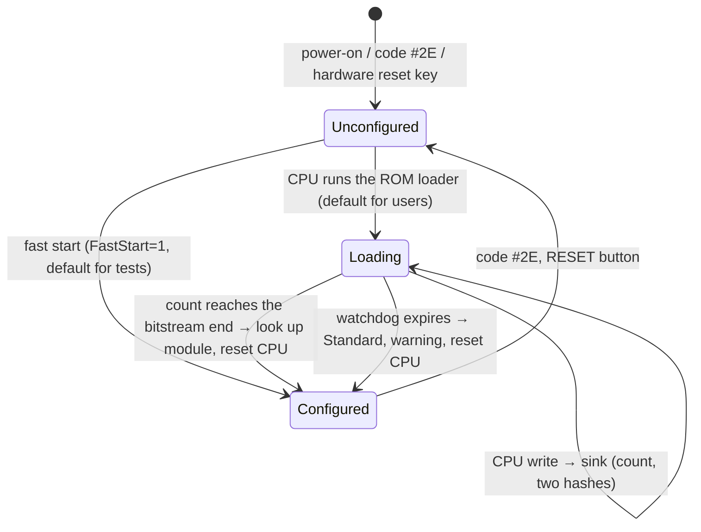

# TDD — port decoder, PLD state, memory, configuration loading

| | |
|---|---|
| **Date** | 2026-09-28 |
| **Status** | Review round 1 done (2026-09-28): end of load (Q4), start mode (Q2) and configuration modules (Q6) decided, §6. S0 (2026-10-01): the end of load is 473 720 writes, statically from BIOS 3.04 and confirmed by a runtime count on MAME (§6); when CONF_DONE rises and the reset delay remain open (no PLD model in MAME) |
| **Hardware** | [hardware-reference.md](hardware-reference.md) §2-§5, §11, §14 |
| **Index** | [technical-design.md](technical-design.md) |

## 1. Classes

| Class | File | Job |
|---|---|---|
| `PortDecoder_Sprinter : PortDecoder` | `core/src/emulator/ports/models/portdecoder_sprinter.{h,cpp}` | owns `SprinterPldState`; port lookup; code dispatch; start-up gate; configuration loader; owns the IDE adapter, CMOS, Covox-Blaster, Z84C15 package; installs the M1 hook |
| `SprinterPldState` (POD) | `core/src/emulator/ports/models/sprinter/sprinterpldstate.h` | every PLD register; one TTD blob |
| `SprinterMemory : Memory` | `core/src/emulator/memory/sprinter/sprintermemory.{h,cpp}` | `UpdateModelBanks()`, graphics-page reads; owns the write-intercept overlay (`SprinterWriteIntercept : HostBusOverlay`, write-only) |
| `SprinterPldConfig` | `core/src/emulator/ports/models/sprinter/sprinterpldconfig.{h,cpp}` | bitstream sink (count, two hashes, watchdog), module lookup, fast start |
| `SprinterPldConfiguration` (interface) + `SprinterPldConfigurationRegistry` | `core/src/emulator/ports/models/sprinter/sprinterpldconfiguration.{h,cpp}` | the extension point for PLD configurations: descriptor, override hooks, registry lookup by hash (§6.1) |
| `SprinterPldStandard : SprinterPldConfiguration` | `core/src/emulator/ports/models/sprinter/sprinterpldstandard.{h,cpp}` | the standard Sp2000 configuration, the first and (in v1) only module |
| `SprinterWaits` | `core/src/emulator/memory/sprinter/sprinterwaits.h` | turbo wait rule (technical design §4) |

## 2. PLD state

```cpp
struct SprinterPldState            // POD, static_assert on size (TTD blob)
{
    uint8_t cells[64];             // internal codes #C0-#FF (index = code - #C0)
    uint8_t cnf;                   // last CNF write with bit 2 = 1 (map, clean bits)
    uint8_t romRg;                 // ROM / fast RAM page register (#5C, code #8F)
    uint8_t allMode;               // ALL_MODE (code #C3)
    uint8_t portY;                 // PORT_Y / RGADR (code #C4)
    uint8_t rgMod;                 // RGMOD (code #C5)
    uint8_t hold;                  // HOLD (code #CB)
    uint8_t isaAddrExt;            // #9FBD bits 5-0
    uint8_t flags;                 // romOff (1 after #3C, 0 after #7C), ramSys (1 after #24, 0 after #74),
                                   // sysPg, arom16, turbo, turboHard, cacheOn, dos (1 = off)
    uint8_t starting;              // 1 after reset until the first port read
    uint8_t configState;           // Unconfigured, Loading, Configured
    uint8_t configModule;          // registry index of the active module (0 = Standard); saved by name in TTD
    uint8_t frameLines;            // 0 = 320, 1 = 312
    uint8_t pg3;                   // cached cell index for window 3 (derived, kept for speed)
    uint8_t ideChannel;            // 0 primary, 1 secondary (adapter state, mirrored for the debugger)
    uint32_t bitstreamCount;       // writes seen by the sink
    uint32_t bitstreamHashHead;    // hash of the first 4 096 writes (MAME-compatible)
    uint32_t bitstreamHashFull;    // hash of the whole stream
    uint32_t loadWatchdog;         // frames left before an unfinished load is abandoned
};
```

`#1FFD` and `#7FFD` values are cells `#C0`/`#C1` (copies at `#C8`/`#C9` share the storage, MAME
`sprinter.cpp:829-842`). The port table itself is **ordinary RAM page `#40`**: no copy, no
separate state, TTD sees it through the normal page journal.

## 3. Port access

### 3.1 Lookup (hot path)

```cpp
uint8_t PortDecoder_Sprinter::LookupCode(uint16_t port, bool isRead) const
{
    const uint16_t index =
          ((_pld.cnf >> 3) & 0x03) << 12          // map 0-3
        | ((Cell(0xC1) >> 5) & 0x01) << 11        // PN5 (#7FFD bit 5)
        | (_pld.DosOff() ? 1 : 0)   << 10         // /DOS
        | (isRead ? 1 : 0)          << 9          // /WR
        | ((port >> 14) & 0x03)     << 7          // A15, A14
        | ((port >> 13) & 0x01)     << 4          // A13
        | ((port >> 7)  & 0x01)     << 3          // A7
        | (port & 0x67);                          // A6, A5, A2, A1, A0
    return _ramPage40[index];                     // host pointer to physical page #40
}
```

Identical to MAME `sprinter.cpp:584`/`:706`. `_ramPage40` is `Memory::RAMPageAddress(0x40)`,
refreshed on reset (the page never moves).

### 3.2 `DecodePortIn` / `DecodePortOut`

```text
DecodePortIn(port):
    if Z84C15 owns port & 0xFF (#10-#13, #18-#1F, #EE, #EF, #F0, #F1, #F4):
        value = z84.Read(port & 0xFF)           // never reaches the PLD
    else:
        if _pld.starting: _pld.starting = 0     // first IN opens the decoder (HW §4.2)
        if (port & 0x7F) == 0x7B: cacheOn = bit 7 of port; UpdateBanks()   // #FB / #7B
        AddPortWait()
        code = LookupCode(port, read)
        value = ReadCode(code, port)            // switch, §4
    OnPortInComplete(port, value, pc, code)     // trace tag includes the code
DecodePortOut(port, value):
    if Z84C15 port: z84.Write(...); also (MAME :1445-1458) run the PLD write for these addresses
    else if _pld.starting: return               // writes ignored until the first IN
    if (port & 0xBF) == 0x3C: SYS port side effects (romOff = !A6; sysPg rule); UpdateBanks()
    if !romOff and (port & 0xFF) == 0x5C: romRg = value; UpdateBanks()
    AddPortWait()
    code = LookupCode(port, write)
    if #C0 <= code < #F0: cells[code - #C0] = value     // every cell is storage first
    WriteCode(code, port, value)                         // side effects, §4
    OnPortOutComplete(...)
```

The two "nailed" decodes (`#3C/#7C` SYS, `#5C` ROM page, `#7B/#FB` cache) happen **before** the
table, exactly as MAME (`sprinter.cpp:576-580`, `:691-703`); the table can add more meaning to
the same addresses (code `#C6` for `#3C`).

Open point (**unverified**): MAME forwards writes to the Z84C15's own addresses to the PLD as
well (`sprinter.cpp:1445-1458`, a write tap). Whether the real PLD also sees them depends on the
board (the CPU drives the bus either way). Keep MAME's behavior; a test pins it.

### 3.3 Why a table lookup and not predicates

The BIOS writes different tables for the four maps, programs change entries at run time (MAN
§13.1 example), and TR-DOS / Spectrum programs depend on the DOS and PN5 bits of the index.
Predicates would have to re-derive the BIOS table and would still miss run-time edits (D1).

## 4. Code dispatch

`ReadCode`/`WriteCode` are one `switch` each, ordered as HW §4.3. Rules that are easy to get
wrong:

| Code | Rule | Source |
|---|---|---|
| `#C0`/`#C8` write | store; if CNF bit 6 ("SC clean") the value reads back 0; `UpdateBanks()` | MAME `:829-834` |
| `#C1`/`#C9` write | store, then mask: CNF bit 7 = 0 → clear bits 7-6; CNF bit 7 = 0 and bit 5 = 1 → clear bit 5; CNF bit 5 = 1 → keep only bits 7-5; `UpdateBanks()` | MAME `:835-842` |
| `#C6`/`#CE` write | `ramSys = !A6` (1 for `#24`, 0 for `#74`); bit 1 = 1 → turbo = bit 0, `ApplyTurbo()`; bit 1 = 0 → `arom16 = bit 0`; bit 2 = 1 → `cnf = value` and the clean rules on `#1FFD`/`#7FFD`; `UpdateBanks()` | MAME `:864-885` |
| `#E8-#EF` write | storage + `UpdateBanks()` | MAME `:895-900` |
| `#F0-#FF` write | the value goes to `cells[pg3]` (`pg3` already points into `#D0-#FF`, §5.1: the current Spectrum page), not to the addressed cell; `UpdateBanks()` | MAME `:901-905`; HW §3.2 |
| `#F0-#FF` read | `cells[pg3]` | MAME `:673-676` |
| `#C0-#EF` read | `cells[code - #C0]` | MAME `:665-671` |
| `#2C`/`#2D` | frame 320 / 312 lines: `SprinterScreen::SetFrameLines()` at the next frame start | MAME `:775-778` |
| `#2E` | PLD reload: `configState = Loading`, schedule a reset | MAME `:779-783` |
| `#16`/`#17` | floppy density DD / HD; value bit 1 = 1 disables the FDC ports (MAME) | MAME `:727-734`; [tdd-storage.md](tdd-storage.md) §2 |
| unknown code | read `#FF` / ignore; log once per code (debug channel), never assert | MAME `:678-680` |

## 5. Memory

### 5.1 Bank computation (`SprinterMemory::UpdateModelBanks`)

Port of MAME `update_memory` (`sprinter.cpp:320-382`), expressed with unreal-ng bank calls:

```text
// romOff: 1 after a write to #3C, 0 after #7C (MAME m_rom_sys = !A6)
if not romOff and not cacheOn:                       // system ROM
    SetROMPageToBank(0, (romRg & 0x0F) XOR (sysPg ? 0 : 8))          write → trash
elif cacheOn:                                        // fast RAM (MAME: pre_rom && !pre_cash)
    SetCachePageToBank(0, romRg & 0x03)                                writable
else:                                                // Spectrum mode: vROM / RAM
    sc0   = #1FFD bit 0;  scLc = !(sc0 and ramSys)
    spr   = (#1FFD bit 1) ? 0 : ((dos << 1) | (#7FFD bit 4 or !dos))
    cell  = #E0 | (sc0 or !ramSys) << 3 | (arom16 and !(sc0 and ramSys)) << 2
               | ((spr bit 1 and scLc) or !ramSys) << 1 | ((spr bit 0 and scLc) or !ramSys)
    page  = cells[cell - #C0]
    SetRAMPageToBank0(page); writable only if (sc0 and ramSys)          else write → trash
SetRAMPageToBank1(cells[#E9]); SetRAMPageToBank2(cells[#EA])
pg3   = (!(#7FFD bit 7)) << 5 | #10 | ((#1FFD bit 4 and !cnf7) or (cnf7 and #7FFD bit 6)) << 3 | (#7FFD & 7)
page3 = starting ? #40 : cells[pg3]                  // pg3 indexes the #D0-#FF cells
if #1FFD bit 4 and (page3 & #F9) == #D0: bank 3 = ISA view
else: SetRAMPageToBank3(page3)
intercept flags: see §5.3
```

(`cnf7` = CNF bit 7, the Pentagon-512 enable.) The formula is taken over verbatim from MAME and
pinned by table-driven tests (test plan §2.2); it is the part most likely to hide surprises, so
the first S1 task is to trace BIOS 3.04 through it in both emulators.

Cache pages: `MAX_CACHE_PAGES` is 2 today (`platform.h:251`); the Sprinter needs 4 (64 KB).
Raise it to 4 (memory layout offsets follow, `platform.h:272-281`).

### 5.2 Graphics pages `#50-#5F` (read side)

Reads in a bank that holds a graphics page return main RAM at the **video address**:
`RAM[#50 base + PORT_Y × 1024 + (A & #3FF)]` (MAME `sprinter.cpp:1175-1177`). `SprinterMemory`
overrides the virtual read pair (`memory.h:293-296`) and checks a per-bank "graphics" flag first;
other banks take the base path. The graphics area of main RAM is the 16 pages `#50-#5F` seen as one
256 KB block (line *y* at `#50 × 16 KB + y × 1024`).

### 5.3 Write intercept

> **2026-09-29, PLAN #60(a) built:** the intercept is a write-only
> `HostBusOverlay` (`observesReads = false`), installed with
> `Core::AddBusOverlay` while any bank needs it; its `onWrite` runs after the
> normal store and picks the action from a per-bank table that
> `UpdateModelBanks` fills (the "flags" below). Other machines pay nothing
> (TSConf technical-design §3.5 item 2).

Flags set per bank in `UpdateModelBanks`:

| Bank condition | Intercept action | Source |
|---|---|---|
| graphics page | cancel the normal store (the base store already happened: the intercept writes the video address and restores the byte the plain store overwrote, **or** the bank's `_bank_write` points to the trash page so the plain store is harmless — chosen: trash page), then: skip if page bit 3 and value = `#FF`; main RAM at the video address unless page bit 2; `VideoRam::Write(PORT_Y × 1024 + (A & #3FF))` | MAME `:1193-1205` |
| ALL_MODE bit 0 = 0 and the bank is 1, or bank 3 with pg3 = Spectrum page 5/7 (`(pg3 & #3D) == #35`) | Spectrum shadow: if `A13 = 0 or PORT_Y bit 7` and `PORT_Y bit 6 = 0`: `VideoRam::Write(ZxShadowAddress(A))` | MAME `:1208-1219` |
| bank 3, `#1FFD = #10`, page `#A0` | request a soft reset (after the store) | MAME `:1190-1191` |
| ISA view | write goes to the ISA stub (ignored, logged) | MAME `:1263-1276` |
| accelerator armed | accelerator write side ([tdd-accel-sound-input.md](tdd-accel-sound-input.md) §1) | MAME `:1437-1443` |

`ZxShadowAddress(A)` = `(A & #FF) << 10 | ((PORT_Y >> 1) & #0F) << 6 | ((PORT_Y ^ zxA15 ^ A13) & 1) << 5 | (A >> 8) & #1F`,
with `zxA15` = `pg3` bit 1 when A15 = 1 (MAME `:1214-1216`).

### 5.4 Reads of ROM, vROM and the loader

| State | Window 0 read |
|---|---|
| `configState = Unconfigured/Loading` | ROM page 12 (the loader); **all other windows** read the ROM too and writes go to the bitstream sink (§6) (MAME `bootstrap_r/w`, `sprinter.cpp:1139-1166`, `:1592`) |
| configured | per §5.1 |

## 6. PLD configuration loader



- **Sink.** While loading, every CPU memory write is a bitstream write: nothing reaches RAM.
- **End of load (review round 1, Q4).** v1 counts the **real bitstream**:

  ```cpp
  // 59 215 bitstream bytes x 8 single-bit writes; S0 static analysis of BIOS 3.04
  constexpr uint32_t kPldConfigurationWrites = 473720;
  ```

  Derivation (S0, statically from the BIOS 3.04 loader, ROM page `#C` `#0000-#009B`, listing
  [docs/disasm/rom/sprinter/loader/](../../disasm/rom/sprinter/loader/README.md)):

  | Part | Writes | Why |
  |---|---|---|
  | preamble | 0 | the set-up before the loop is only `OUT` (Z84C15 registers, SIO, PIO) and `LD`; no `CALL`, no `PUSH`, so no stack writes |
  | stream | 59 215 × 8 = **473 720** | the loop at `#0088` writes each byte 8 times with `LD (DE),A`, `RRCA` between the writes (bit 0 first); the bytes are ROM `#0100-#E84E`, identical to BIOS-PP `ALTERA/SP2K_304.BIN` (59 215 bytes) |
  | postamble | none counted | the loop has no exit: it keeps streaming the `#FF` filler after `#E84E` until the configured PLD resets the CPU |

  Worked example: the first bitstream byte `#FF` gives writes 1-8 with D0 = 1; byte `#A5`
  (`1010 0101`) gives D0 = 1, 0, 1, 0, 0, 1, 0, 1. Write 473 720 carries bit 7 of the byte at
  `#E84E`. The writes go to `#FE00-#FEFF` (only E is incremented; `#FD00-#FDFF` when fast RAM `#FEE0`
  holds "IM"). In the CPLD each write in the configuration state is one DCLK with D0
  (BIOS-TT `0271ac3` `src/altera/max/SP2_MAX.TDF`).

  So the emulator ends the load at write 473 720 and does **not** wait for the loop to stop (it never
  does). Everything after the count is ignored until the reset. **Runtime check on MAME (2026-10-01,
  `loader.txt` in [testdata/machines/sprinter/reference/](../../../testdata/machines/sprinter/reference/README.md)):** with MAME's 4 096-write shortcut held off,
  the BIOS 3.04 loader makes 0 writes before the stream and exactly **473 720** writes while HL is in
  `#0100-#E84E`, all to `#FE00-#FEFF`; the D0 of the writes rebuild the ROM bytes (checked to `#3FFF`,
  the part MAME maps). The last bitstream write is at 1.912 s at 3.5 MHz (113 T per byte), not
  ~0.1 s. **Still open** (MAME has no PLD model; needs the PLD sources or real hardware): that
  CONF_DONE rises at write 473 720 (whether the device also counts the leading `#FF` bytes as
  configuration data), how many extra clocks the ACEX takes before it starts
  (FLEX/ACEX need about 10 DCLKs after CONF_DONE: 2 more bytes would be 16 writes), and how the CPU
  reset follows. The reload path (fast RAM holds `"ACEX_30K_LOADING"` at `#FEF0`: the stream comes
  from RAM `#1000`) uses the same loop and the same count.

  A **watchdog** (a frame budget well above the normal load time) ends a load that never reaches the
  count: the machine takes the Standard module and logs a warning, so a broken or unexpected ROM
  cannot hang the machine silently. v1 no longer uses MAME's "4 096 writes" as the end of the load
  (MAME stops there, `sprinter.cpp:1156-1162`, in the middle of the stream).
- **Identify.** Two hashes are kept while the stream runs: one over the **first 4 096 writes**
  (the same bytes MAME hashes, so MAME's constants can be reused) and one over the **full stream**
  (exact identification of a firmware). After the end, the registry looks up the module (§6.1).
- **The bitstream in fast RAM.** The BIOS reloads configurations by writing the bitstream and the
  flag `ACEX_30K_LOADING` into fast RAM, then resetting; the loader reads it from there (MAN §1.4;
  BIOS-TT `loader.asm` `.LOOP_S1`). Nothing special is needed: fast RAM survives the reset.
- **Start mode (review round 1, Q2).** The **full start** (the ROM loader streams the bitstream,
  about 1.9 s of emulated time at 3.5 MHz, 0.32 s at 21 MHz; MAME runs the loader at 3.5 MHz) is the
  user default. `[SPRINTER] FastStart=1` is the **test default**: it
  sets `Configured` with the Standard module at power-on and starts the CPU at the address the
  loader would reach after the reset (the BIOS entry, ROM page 0, `#0000`), with the fast-RAM state
  the loader would leave. An equivalence test keeps the two paths identical (test plan §2.3,
  T-CFG-3).
- After configuration: `starting = 1`, window 3 = page `#40` (HW §4.2).

### 6.1 Configuration modules (`SprinterPldConfiguration`)

Review round 1 (Q6) made PLD configurations **modular**. The hardware can load a different
bitstream at any time (the BIOS does it for some games), and each bitstream is, in effect, a
different machine built on the same board. The emulator keeps one decoder and lets a
**configuration module** replace only the parts that a given bitstream changes.

**Descriptor.** Each module registers `{ name, fullStreamHash, headHash }` (`headHash` = the hash of
the first 4 096 writes). The registry is filled at start-up; v1 registers `Standard` only (plus the
stub module in tests).

**Lookup after a load.**

```text
OnBitstreamEnd(fullHash, headHash):
    module = registry.FindByFullHash(fullHash)
          ?? registry.FindByHeadHash(headHash)       // MAME-compatible fallback
    if module is null:
        module = Standard
        log warning "unknown PLD bitstream, full hash X, head hash Y, using Standard"
    Activate(module)                                 // module.OnActivate(pld), then CPU reset
```

The warning with the hash is deliberate: it is the signal that a new firmware exists and needs
analysis.

**Extension points.** Standard is the base; a module overrides only what its firmware changes, and
every hook it does not override falls through to Standard:

| # | Hook | What a module can change | Default (Standard) |
|---|---|---|---|
| 1 | Port decoding | handle its own internal codes in the dispatcher (`ReadCode`/`WriteCode` ask the module first), own extra cells | §3, §4 |
| 2 | Memory mapping | its own `UpdateModelBanks` rule and intercept flags | §5 |
| 3 | Video | its own renderer and INT source ([tdd-video.md](tdd-video.md) §1, §5) | `ScreenSprinter`, `SprinterIntSource` |
| 4 | Accelerator | its own accelerator behavior ([tdd-accel-sound-input.md](tdd-accel-sound-input.md) §1) | `SprinterAccelerator` |

Everything else (Z84C15 devices, IDE, floppy, CMOS, AY, keyboard) is board hardware and is not a
module concern.

**Lifecycle and state.**

- Modules react to **reset** (`OnReset(kind)`, §7) and to a **bitstream reload** (code `#2E`: the old
  module is deactivated, the machine returns to `Unconfigured`, the new module is chosen at the end
  of the next load).
- The **module id** (saved by name, not by registry index) and the **module state** (an opaque blob
  the module serializes) are part of the TTD checkpoint and the snapshot, so a replay across a
  reload restores the right module.

**Why Standard is a module too.** Implementing Standard through the same interface means the
interface is exercised by real code from day one, not only by a future Game module. A **stub test
module** (tests only) proves the registry lookup, a renderer override and the TTD round-trip.

Worked example: a game reloads the PLD with the "Thunder in the Deep" bitstream. The loader writes
the stream; the head hash matches MAME's Game constant, but in v1 no Game module is registered, so
the lookup falls back to Standard and the log says `unknown PLD bitstream, full hash …, head hash
…`. When a Game module is added later, the same load finds it and the game gets its renderer; the
decoder core does not change.

v1 ships **Standard only**. Game, DooM and Video become later modules after their bitstreams are
analyzed against MAME (a follow-up task after v1).

## 7. Reset kinds

| Trigger | Effect |
|---|---|
| power-on | `configState = Unconfigured` (or fast start), RAM random/zero per config, cells per MAME defaults (`:1533-1546`); the active module gets `OnReset(PowerOn)` |
| RESET button / Ctrl+Alt+Del | same as power-on except RAM and fast RAM kept (the loader re-reads the flag) |
| code `#2E` | same as RESET button; the active module is deactivated and the module is chosen again after the load (§6.1) |
| write to page `#A0` | CPU reset only; PLD stays configured; BIOS sees its "RESTART" id in page `#FE` and takes the soft path (INC `SP2000.inc:915`) |

## 8. Clock and turbo

`ApplyTurbo()` sets `hw_turbo_ratio = (turbo and turboHard) ? 6 : 1` through the new clock ratio
(technical design §3). `turboHard` is a front-panel/keyboard override (MAME F12,
`sprinter.cpp:1941-1942`), exposed as a machine control (`POST /control/turbo` style) rather than a
key. Waits: technical design §4.

## 9. Z84C15 fixed ports

The decoder forwards `#10-#13`, `#18-#1F`, `#EE/#EF`, `#F0/#F1`, `#F4` (low byte, any high byte)
to the `io/z84c15` package ([tdd-accel-sound-input.md](tdd-accel-sound-input.md) §5). The
`#EE/#EF` chip-select registers matter only during configuration loading (they route the loader's
writes, BIOS-TT `loader.asm` `.START`); v1 stores them and does not remap memory with them.

## 10. Tests (details in [test-plan.md](test-plan.md))

- Lookup index: MAN's worked example `#7785` → `#09D`; every table-address bit toggled alone.
- Start-up gate: writes before the first IN are ignored; the first IN opens.
- Code semantics: one test per row of §4 (cells, clean rules, `#F0-#FF` redirection).
- Banks: table-driven `UpdateModelBanks` truth table over `romSys × cacheOn × ramSys × #1FFD bits ×
  #7FFD bits × dos × arom16`, expected values generated once from MAME's formula.
- Graphics pages: transparency, video-only, reads at the video address.
- Reset page, loader sink count and watchdog, both hashes, fast-start equivalence.
- Configuration modules: registry lookup (full hash, head hash, unknown → Standard + warning), a stub
  module's renderer override, module id and state through a TTD round-trip.
