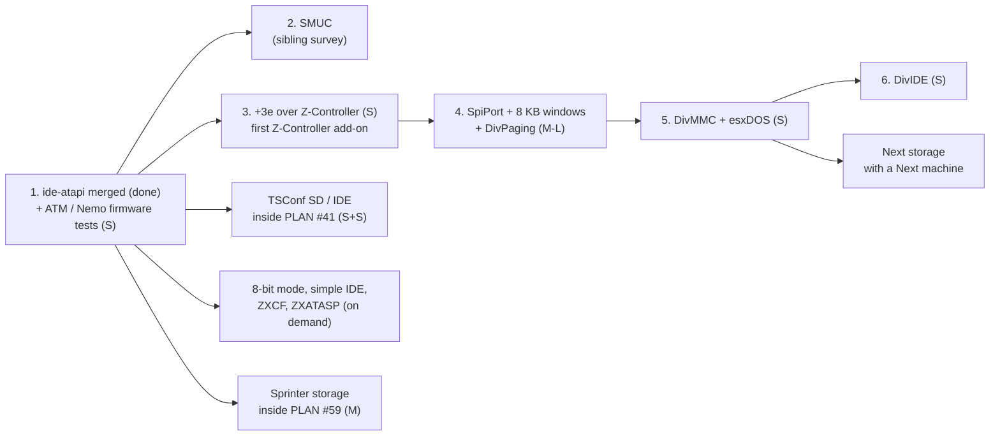

# Storage controllers survey: every ZX IDE, SD/MMC and CF interface vs unreal-ng

| | |
|---|---|
| **Date** | 2026-09-28 |
| **Status** | survey (research only, no code); see [TODO.md](TODO.md) |
| **Question** | Which mass-storage controllers do ZX machines and add-ons use, what does unreal-ng have for each, what is missing, and what does each gap cost? |
| **Measured against** | master (media manager M1-M5, `SdCardSpi`, `ZControllerSpi`, `HostFolderFat`, NeoGS SD) and IDE rollout 1 (branch `ide-atapi`, uncommitted at survey time, on master since 2026-09-29, `f5fc5f05`: the ATA disk core, ATAPI CD, one `IdeAdapter` for NEMO / NEMO-A8 / NEMO-DIVIDE / ATM / SMUC / PROFI / DIVIDE, `IdeController`, `IdeUnitSlot`, image formats; plan `docs/inprogress/2026-09-28-ide-atapi/implementation-plan.md`) |
| **Related** | [IDE design](../2026-09-21-profi/2026-09-25-ide-hdd-design.md), [storage manager](../2026-09-28-storage-manager/reuse-and-readiness.md), [ZX-Evo storage](../2026-09-15-atm-baseconf-highres-ports/tdd-storage-sd-ide-cd.md), [TSConf](../2026-09-27-tsconf/technical-design.md) §3.11, [Sprinter storage](../2026-09-28-sprinter/tdd-storage.md); SMUC in depth: sibling survey `2026-09-28-scorpion-smuc/` (written in parallel) |

## 1. The short answer

- **Built** (master): every Russian-clone IDE board (Profi, ATM Turbo 2+, Nemo,
  Nemo-A8, ZX-Evo NemoIDE, SMUC), ATAPI CD-ROM, the ZX-Evo Z-Controller SD card, the NeoGS SD card.
  What is left there is a few real-firmware tests (`ide-atapi` is on master, `f5fc5f05`).
- **Cheap next wins** (days): TSConf SD and IDE (inside the TSConf program), the **+3e over a
  Z-Controller SD card** (every part exists; only the +3 decoder's add-on arm is new).
- **The one big gap**: **DivIDE / DivMMC and esxDOS**, the most widespread Spectrum storage today.
  The storage part is small; the cost is the board's **memory paging and automap trap**, which needs
  8 KB windows in `#0000-#3FFF` - a core change the ZX Next needs too.
- **Later, with their machines**: Sprinter (a second IDE channel), ZX Next (two SD sockets on the
  DivMMC framework).
- **On demand only**: ZXCF, ZXATASP, the simple 8-bit IDE (no local reference implements them; Fuse
  does and is not in the local tree).

## 2. Matrix

Effort: **S** = up to ~3 days, **M** = 1-2 weeks, **L** = 3+ weeks, **XL** = a machine program.
"Status" is what exists today.

| Controller | Machines | Kind | Status | Effort left | Depends on | File |
|---|---|---|---|---|---|---|
| Profi IDE | `PROFI` | IDE, mirror latches, EXT gate | **master**; SYS ROM boot test | **S** | - | [profi-atm-nemo.md](profi-atm-nemo.md) |
| ATM Turbo 2+ IDE | `ATM710` | IDE, INTRQ in the `#7FFD`-class read | **master** | **S** (real-firmware test) | - | [profi-atm-nemo.md](profi-atm-nemo.md) |
| Nemo / Nemo-A8 | `PENTAGON` (128, 512), any non-Profi | IDE | **master** | **S** (real-firmware test) | - | [profi-atm-nemo.md](profi-atm-nemo.md) |
| SMUC | `SCORPION`, `PROFSCORP` | IDE | adapter on master; add-on, off by default | see sibling | - | sibling `2026-09-28-scorpion-smuc/` |
| ZX-Evo NemoIDE + ATAPI | `ATM3` | IDE + CD | **master**, ERS HDD / CD boot on the real ROM | done | - | [zxevo-baseconf-tsconf.md](zxevo-baseconf-tsconf.md) |
| ZX-Evo Z-Controller SD | `ATM3` | SD over SPI | **master** | done | - | [zxevo-baseconf-tsconf.md](zxevo-baseconf-tsconf.md) |
| TSConf SD + DMA | `TSL` (not creatable) | SD, DMA `#2`/`#A` | parts on master | **S** | PLAN #41 | [zxevo-baseconf-tsconf.md](zxevo-baseconf-tsconf.md) |
| TSConf NemoIDE + DMA | `TSL` | IDE, DMA `#3`/`#B` | scheme `NEMO-DIVIDE` set in the `ts-conf` config, DMA word API (`IdeAdapter::DmaReadWord` / `DmaWriteWord`) ready | **S** (decoder + DMA hook-ups) | #41 phase 6 | [zxevo-baseconf-tsconf.md](zxevo-baseconf-tsconf.md) |
| NeoGS SD | NeoGS card, any host | SD (card side) | **master** | done | - | [neogs-sd.md](neogs-sd.md) |
| Paging + automap framework | cross-cutting | memory | none | **M-L** | M1 hook (master) | [divide-divmmc-esxdos.md](divide-divmmc-esxdos.md) §5 |
| DivMMC | 48K, 128K, +2, +2A/+3, Pentagon | SD + paging | none | **S** after the framework | framework, `SpiPort` | [divide-divmmc-esxdos.md](divide-divmmc-esxdos.md) |
| DivIDE | same | IDE + paging | IDE ports only (`IDE_DIVIDE`) | **S** after the framework | framework | [divide-divmmc-esxdos.md](divide-divmmc-esxdos.md) |
| esxDOS | DivIDE / DivMMC hosts | firmware | none | **S** (fixtures, tests) | DivMMC | [divide-divmmc-esxdos.md](divide-divmmc-esxdos.md) §3 |
| ZX Next SD x2 | Next (no model) | SD + DivMMC variant | slot names reserved | **S-M** (machine: **XL**) | Next machine, DivMMC | [zx-next.md](zx-next.md) |
| +3e over Z-Controller SD | `PLUS3`, `PLUS2A` | SD | all parts exist | **S** | Z-Controller add-on arm | [plus3e-cf.md](plus3e-cf.md) |
| Simple 8-bit IDE (+3e) | `PLUS3` | IDE, low byte only | none | **S** | 8-bit mode; verify ports | [plus3e-cf.md](plus3e-cf.md) |
| ZXCF | `PLUS3` | CF (8-bit mode) + 1 MB paging | none | **M** | 8-bit mode | [plus3e-cf.md](plus3e-cf.md) |
| ZXATASP | `PLUS3` | IDE through an 8255 + RAM | none | **M** | 8255 model | [plus3e-cf.md](plus3e-cf.md) |
| Sprinter IDE x2 + ATAPI | Sprinter (PLAN #59) | 2 IDE channels | core reusable | **M** | #59, second channel | [sprinter.md](sprinter.md) |
| Karabas-Pro personality | Profi clone | Profi/Nemo IDE, Z-Controller, DivMMC | none | **M** | DivMMC | [other-machines.md](other-machines.md) §2 |
| Kay, Quorum, Phoenix, GMX, LSY256 | not creatable | none of their own | the global scheme covers them | none | their decoders | [other-machines.md](other-machines.md) §1 |

## 3. Recommended order

Why this order:

1. **`ide-atapi` first** (done: on master, `f5fc5f05`): six boards and the CD are written; everything IDE below reuses them.
2. **+3e over Z-Controller before DivMMC**: it proves "a Z-Controller as an add-on on a machine
   other than the ZX-Evo" (storage-manager G3) with no new device code, and gives the +3 hard-disk
   support in days.
3. **DivMMC before DivIDE**: DivMMC is what people own today, and the ZX Next reuses it. Both need
   the same framework; DivIDE then costs only the paging glue on the existing `IDE_DIVIDE` adapter.
4. TSConf, Sprinter and Next storage ride their machine programs; they are cheap once the machine
   exists, and pointless before.

## 4. Cross-cutting pieces

| Piece | What | Used by | State |
|---|---|---|---|
| ATA disk core | `AtaDevice`, `AtaDisk`, `AtapiCdrom`, `AtaChannel` (16-bit data interface; adapters split words) | every IDE board | master |
| **8-bit transfer mode** | SET FEATURES `#01` / `#81` in the data engine | ZXCF, simple 8-bit IDE | **new (S)** |
| **Multi-channel IDE** | `IdeController` with up to two `AtaChannel`s, slots `ide1.*` | Sprinter | **new (S)** |
| SD card | `SdCardSpi` over `IBlockDevice`, SDSC / SDHC | Z-Controller, NeoGS, TSConf, DivMMC, Next, +3e | master |
| **Shared SPI port** | generalize `ZControllerSpi` into `SpiPort`: data port with the "read returns the previous byte and starts an exchange" rule, a configurable chip-select decode (Z-Controller D1, DivMMC D0/D1, Next's 8-bit select) | Z-Controller, DivMMC, Next, Karabas | **new (S)**; NeoGS keeps its timed `NeoGSSpi` |
| **8 KB windows in `#0000-#3FFF`** | `Memory` maps window 0 as two 8 KB halves from any page (EEPROM, board RAM) | DivIDE, DivMMC, Next (MMU) | **new (M)**, hot path: benchmark before / after |
| **Board paging + automap** | `DivPaging`: `#E3`, MAPRAM, write protection, the automap state on `Z80::machineM1Hook` (instant and after-the-fetch points), profiles (DivIDE, DivMMC, Next) | DivIDE, DivMMC, Next, Karabas | **new (M)**; the M1 hook exists (master) but holds **one** observer: needs chaining with the ZX-Evo hook and the TR-DOS `#3Dxx` rule |
| 16 KB paging boards | a bank register mapping board RAM into window 0 | ZXCF, ZXATASP | fits today's `Memory` |
| Media manager | slots, formats, folders, verbs on every surface, add-on slots that come and go (G3) | all | master |
| Host folders | `HostFolderFat` (FAT16 default, FAT32 with ≥ 65 526 clusters) | SD and IDE slots | master; a superfloppy layout (no MBR) is **new (S)** for DivMMC-style cards |
| Persistent blobs | EEPROM / flash contents with session / persist access (G11) | DivIDE / DivMMC EEPROM, Next flash | **new (S)** |
| TTD | protocol state in POD blobs, guest writes as replay barriers (`NoteWrite`); board RAM (32 KB-1 MB) as TTD v2 memory regions | all | rule on master; regions wait for PLAN #40 Phase 1 |
| esxDOS | real firmware + real card only; **no** host-side emulation of the esxDOS API (CSpect / ZEsarUX style) | DivIDE, DivMMC, Next | policy |

**Worked example: what "reusable" means for DivMMC on a 48K.**

| Layer | Piece | New? |
|---|---|---|
| port decode | `#E3`, `#E7`, `#EB` arms in the 48K decoder (add-on) | new, a few lines |
| port adapter | `SpiPort` with select on D0 | generalized from `ZControllerSpi` |
| memory | `DivPaging` + 8 KB windows | **new** (the real cost) |
| device | `SdCardSpi` | reused unchanged |
| medium | image, or a folder through `HostFolderFat` | reused unchanged |
| slot | `sd.divmmc`, registered while the add-on is fitted | a descriptor |
| automation, Qt panel, TTD barrier | media verbs, media panel, `NoteWrite` | reused unchanged |

## 5. Biggest risks

1. **The 8 KB window change touches the memory hot path** and TTD dirty tracking (`_bank_ram_page_cache`,
   page-to-bank lookups). Mitigation: its own small project, benchmarks before and after, the TTD
   corpus re-run.
2. **One M1 hook per machine.** DivMMC on a ZX-Evo-like host, or on a Pentagon with the TR-DOS
   `#3Dxx` trap, needs a hook chain with a defined order (hardware: the DivIDE maps instantly on
   `#3Dxx`, so TR-DOS becomes unreachable while automap is on).
3. **Unverified port maps** for ZXCF, ZXATASP and the simple 8-bit IDE: no local reference
   implements them. Check Fuse before writing code.
4. **Test firmware is not in `testdata/`**: esxDOS (zxsp and pico-spec carry 0.8.5 / 0.8.9), the +3e
   (`plus3en40mmc.rom` in the Karabas tree only), the Sprinter BIOS (`SP_304.BIN` in ZXMAK2), NextZXOS
   (download only). No `.hdf` / `.mmc` image exists anywhere locally; folders through
   `HostFolderFat` stand in.
5. ~~The `IDE_DIVIDE` decode on `ide-atapi` is too wide~~ - fixed on 2026-09-28 (on master, `f5fc5f05`): it is now
   `(low & #E3) = #A3`, so `#E3`, `#E7` and `#EB` stay free for the DivIDE / DivMMC paging
   ([divide-divmmc-esxdos.md](divide-divmmc-esxdos.md) §2.1).
6. ~~**`ide-atapi` is uncommitted**: every IDE row depends on it landing.~~ - landed: on master since 2026-09-29 (`f5fc5f05`).
7. **Board RAM under TTD before #40 Phase 1** means whole-RAM blobs per snapshot (the NeoGS precedent);
   acceptable for 32-128 KB, costly for 512 KB-1 MB boards.

## 6. Files

| File | Scope |
|---|---|
| [profi-atm-nemo.md](profi-atm-nemo.md) | Profi, ATM Turbo 2+, Nemo / Nemo-A8 / Nemo-DivIDE; SMUC in one row |
| [zxevo-baseconf-tsconf.md](zxevo-baseconf-tsconf.md) | ZX-Evo BaseConf (NemoIDE, ATAPI, Z-Controller SD), TSConf (SD + DMA, IDE + DMA) |
| [divide-divmmc-esxdos.md](divide-divmmc-esxdos.md) | DivIDE, DivMMC, esxDOS, the paging framework |
| [zx-next.md](zx-next.md) | ZX Next DivMMC and two SD sockets |
| [plus3e-cf.md](plus3e-cf.md) | +3e with 8-bit IDE, ZXATASP, ZXCF, DivIDE, Z-Controller SD |
| [sprinter.md](sprinter.md) | Sprinter's two IDE channels |
| [neogs-sd.md](neogs-sd.md) | NeoGS SD (done) |
| [other-machines.md](other-machines.md) | Kay, Quorum, Phoenix, GMX, LSY256, Karabas-Pro, interfaces not found |

## Glossary

| Term | Meaning |
|---|---|
| IDE / ATA | the PC hard-disk interface: eight 8-bit "task file" registers and a 16-bit data register |
| task file | the ATA registers: error / features, sector count, sector / cylinder / head (or LBA), status / command |
| CS0 / CS1 | the two register blocks of an ATA drive: CS0 = task file, CS1 = alternate status / device control |
| latch pattern | how an 8-bit Z80 board splits the 16-bit data word into two port accesses |
| ATAPI | the packet protocol CD-ROM drives speak over the IDE bus |
| INTRQ | the drive's interrupt line; most Spectrum boards do not connect it and poll status instead |
| SRST | software reset of the drives through the device control register |
| SPI | a serial bus: the host clocks one byte out and one byte in at the same time; SD cards speak it |
| chip select (/CS) | the SPI line that tells one device "this exchange is for you"; active low |
| automap | a board's trap that pages its firmware into `#0000-#3FFF` when the CPU fetches from set addresses |
| M1 | the Z80 bus cycle that fetches an opcode |
| superfloppy | a FAT volume without a partition table |
| HDF | RS-IDE hard disk image: a header with an IDENTIFY copy, then sectors (possibly "halved" for 8-bit interfaces) |
| TTD | time-travel debugging; storage writes are "replay barriers" it cannot step back across |
