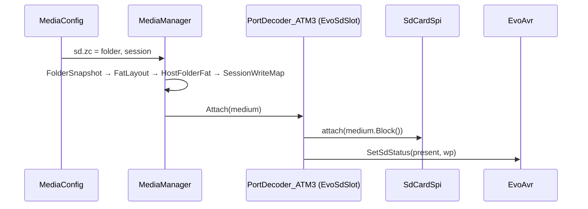

# Integration: ZX-Evo Z-Controller SD card (`sd.zc`) — phase M1 = ZX-Evo E5b

| | |
|---|---|
| **Date** | 2026-09-28 |
| **Status** | **Implemented** (M1, 2026-09-28); as built: [TODO.md](TODO.md) "M1 as built" |
| **Layers** | port decoder → port adapter → device → medium, with the slot and the manager beside them: [technical-design.md §1.1](technical-design.md#11-layers-from-the-guests-port-to-the-medium) |
| **Today** | E5 ([e5-sd-card.md](../2026-09-15-atm-baseconf-highres-ports/e5-sd-card.md)): `PortDecoder_ATM3` owns `SdCardSpi` + `ZControllerSpi`; `InsertSdCard(path | medium)`; `[ZC]` read at power-on; image files only |
| **Target** | the first slot of the [MediaManager](technical-design.md); a PC folder as the card |

## 1. What the user gets

```ini
[MEDIA]
sd.zc = ~/zx/evo-sd/       ; a folder: SD_BOOT.$C, games/*.trd, NedoOS bin/ ini/ ...
```

Then, on the unmodified ZX-Evo firmware:
- ERS "5. SDcard boot" runs `SD_BOOT.$C` (ACC-1).
- "F. File browse → Mount B:" mounts `games/elite.trd`, and TR-DOS reads it and saves to it (ACC-2).
- NedoOS `sd_boot.$C` (the ZX-Evo build) boots to its shell (ACC-3). `osatm3sd.$C` needs NemoIDE (E6).
- `IMAGE.MNT` automounts (ACC-4).

The folder on the PC never changes. "Export" writes the card as the guest now sees it to an `.img`.

## 2. The slot

| Field | Value |
|---|---|
| id | `sd.zc` |
| kind | `Block` |
| removable | yes: swap delay 500 ms (the ERS polls the card and prints "SD card lost") |
| signals | card detect and write-protect switch, both pushed to AVR register C (bits 3 and 2) |
| accepts folder | yes; FAT16 by default, FAT32 by parameter (`sd.zc.fs = fat32`) |
| default access | `Session` |
| registered by | `PortDecoder_ATM3` constructor; unregistered in its destructor |

## 3. Code changes

| Where | Change |
|---|---|
| `SdCardSpi` | add a **non-owning** `attach(IBlockDevice& medium, Type)` / `detach()` next to the owning `insert()` / `open()`. The manager owns the medium (it must survive a model switch); tests and NeoGS standalone keep `open()` |
| `PortDecoder_ATM3` | implement `IMediaSlot` through a small member `EvoSdSlot` (keeps the decoder's interface list short): `Attach` → `_sdCard.attach(medium.Block())`, `UpdateSdStatus()`; `Detach` → `_sdCard.detach()`, status. `IsBusy` = a multi-block read or a write in flight (`SdCardSpi` mode ≠ Command) |
| `PortDecoder_ATM3::InsertSdCard / EjectSdCard` | become thin wrappers over `MediaManager::Insert/Eject("sd.zc", ...)`. The E5 tests keep working |
| power-on `[ZC]` handling | removed from the decoder: `MediaConfig` maps `[ZC] SDCardImage/SDWrite/SDWriteProtect` to `sd.zc` and the manager inserts at creation |
| write-protect switch | becomes the slot property `sd.zc.wp` (reported in AVR register C bit 2, as in E5); still not enforced by the card |



## 4. TTD

E5 ends the recording on the first SD command. The NeoGS branch already does better:
- The card's protocol state (`SdCardSpi::saveState`, 2 688 bytes) goes into its TTD blob.
- A card write is a replay barrier: `RecordExternalEvent`, at most one per frame.
- Insert and eject are refused while recording.

ZX-Evo adopts the NeoGS rule ([integration-ttd-snapshots.md](integration-ttd-snapshots.md) §2). `ZControllerSpi::State` (2 bytes) and the card state join the ATM3 model state.
Reads then replay exactly between barriers, because the medium only changes at a write. The ERS
and NedoOS mostly read, so recordings stay usable across whole SD boots.

## 5. Tests

| Test | Proves |
|---|---|
| E5 tests unchanged, through the wrappers | nothing regressed |
| `ZXEvoErs_Test.SdCardBootFromAHostFolder` | ACC-1: `SD_BOOT.$C` in a scratch folder |
| `ZXEvoErs_Test.SdCardFolderTrdMountedReadWrittenAndExported` | ACC-2: the E5 mount test with a folder; the host TRD is unchanged afterwards; the exported image contains the save |
| `ZXEvoErs_Test.NedoOsBootsFromAHostFolder` | ACC-3: `sd_boot.$C`, `term.com`, `cmd.com` and a marker `autoexec.bat` (`testdata/machines/zxevo/nedoos/sdcard/`) reach the shell: the prompt `M:/bin>` and the marker in RAM |
| `ZXEvoErs_Test.ImageMntAutomountFromAHostFolder` | ACC-4 |
| `ZXEvoSdSlot_Test.SwapDelaySeenInCardDetect` | a swap on a running machine: AVR register C reads "no card" for the swap delay, then the new card (busy retry: `MediaManager_Test.BusySlotWaitsForTheNextFrame`) |
| `ZXEvoSdSlot_Test.LargeSparseImage` | a sparse 4 GB image: SDHC, reads at the last sector, no whole-file load (review round 2, G10) |
| `ZXEvoSdSlot_Test.SameImageInSdAndHddRefused` | the shipped `wc.img` case: the second slot gets `in-use` (G5). **Moved to M6** (no IDE slot on ZX-Evo yet); the rule itself: `MediaManager_Test.OneSourceInOneSlotUnlessBothReadOnly` |
