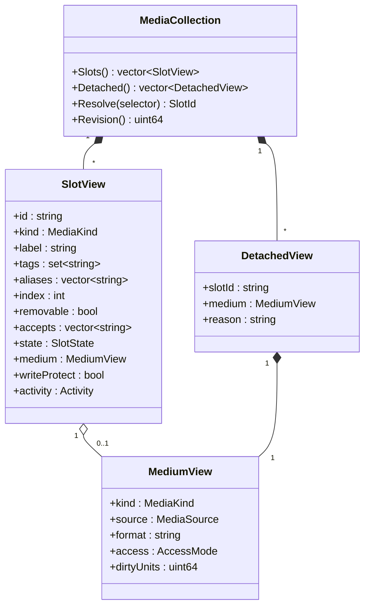
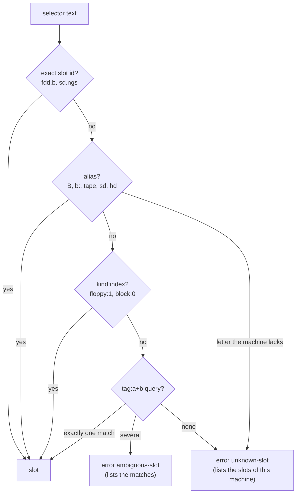
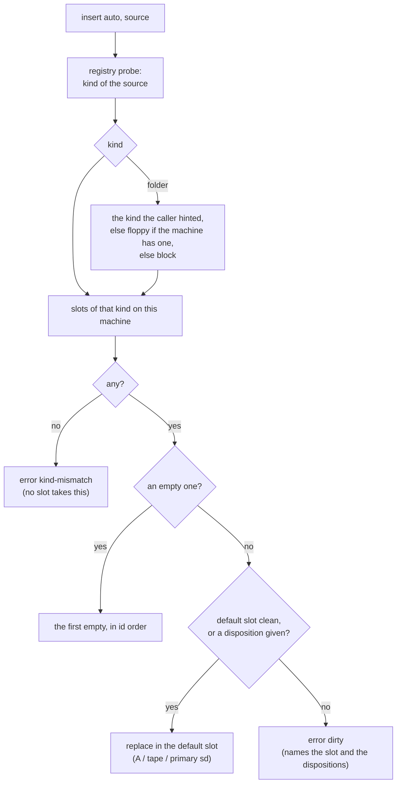
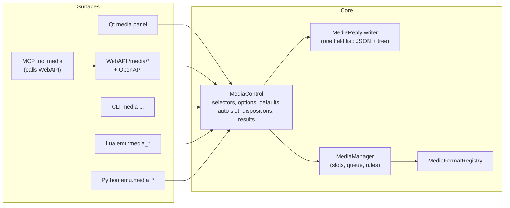

# Media control: one drive collection for the GUI and every automation surface

| | |
|---|---|
| **Date** | 2026-09-28 |
| **Status** | Draft for review (round 1 folded in: no shelf; eject and swap state what happens to unsaved writes). Replaces the surface half of phase M4 ([integration-automation-gui.md](integration-automation-gui.md)) |
| **Builds on** | M1 (block slots, `sd.zc`) and M2 (floppy slots `fdd.a-d`) as built ([TODO.md](TODO.md)) |
| **Scope** | How a person or a program sees the machine's drives, picks one, and puts media in and out: the model, the addressing, the operations, and the same behavior on the Qt GUI, WebAPI (+ OpenAPI), CLI, MCP, Lua and Python |

Glossary (used throughout):

| Term | Meaning |
|---|---|
| **Slot** | A place a medium goes on this machine: floppy drive A, the tape deck, the Z-Controller SD socket, IDE master. Owned by a peripheral, registered with the media manager |
| **Medium** | What goes into a slot: a disk image, a tape, an SD card image, a host folder presented as one of those |
| **Kind** | The shape of a medium and of the slots that take it: `floppy`, `tape`, `block` (SD / hard disk, 512-byte sectors), `optical` (CD) |
| **Tag** | A short word describing a slot (`sd`, `boot`, `neogs`, `trdos`); a slot has several |
| **Alias** | A short name for a slot that people type: `A`, `B`, `tape`, `sd`, `hd` |
| **Selector** | Any way of naming a slot on a surface: its id, an alias, a kind with an index, or a tag query |
| **Dirty** | A medium with guest writes that are not saved anywhere yet |
| **Disposition** | What an eject or a swap does with a dirty medium's writes: `save` (into its own file), `export` (into a new file), or `discard` |
| **Detached medium** | A medium whose slot went away (an add-on card removed; later, a model switch without that slot). It keeps its writes and goes back in when the slot returns |
| **Surface** | A way to control the emulator: Qt GUI, WebAPI, CLI, MCP, Lua, Python |

---

## 1. Goals

1. **One collection.** Every storage place of the running machine is listed in one place, in one
   shape, whatever its kind: floppies, tape, SD cards, hard disks, CD. Nothing is special-cased per
   device on a surface.
2. **Easy addressing.** A person types `B`, `tape` or `sd`; a program uses a stable id (`fdd.b`,
   `sd.zc`) or asks by meaning ("the SD card of the NeoGS"). The same words work on every surface.
3. **Choose what goes in and what comes out.** Insert a file or a folder into a chosen slot, or let
   the emulator pick the right slot; eject, swap, save, export — per slot, with the rules
   (unsaved writes, write-protect, TTD recording) applied the same way everywhere.
4. **Nothing is lost silently.** A dirty medium leaves its slot only when the caller says what
   happens to its writes — in the same call, so a disk swap stays one step.
5. **Parity by construction.** The GUI, WebAPI, CLI, MCP, Lua and Python are thin adapters over
   one core layer. They cannot drift apart in names, options, results or error codes, because
   none of them implements the rules itself.
6. **Documented once, linked everywhere.** One reference page describes the model and the verbs;
   the OpenAPI spec, the CLI help, the MCP tool description, the Lua / Python docs and the
   recipes follow it and are checked against the code by tests.

Non-goals: media history and versions (H1-H5, [media-history-design.md](media-history-design.md));
carrying media over a model switch (M5, reuses the detached state defined here); new media kinds
(M3 tape, M6 IDE / CD) — they appear in the collection automatically when their slots register.

---

## 2. Requirements

### 2.1 Functional

| # | Requirement |
|---|---|
| MC-1 | `list` returns every slot of the machine with: id, kind, label, tags, aliases, removable, the medium (source, format, access), state (empty / present / pending swap), dirty units, write-protect, activity; and the detached media, if any |
| MC-2 | A slot is named on every surface by a **selector**: id (`fdd.b`), alias (`B`, `b:`, `tape`, `sd`, `hd`, `cd`), kind and index (`floppy:1`), or tag query (`tag:sd+neogs`). A selector that matches no slot or several slots is an error that lists the candidates |
| MC-3 | `insert` takes a selector or `auto`, a source (file, folder, upload) and options (`access`, `fs`, `codepage`, `free`, `format`, `wp`, `end_recording`, `wait`), plus a disposition for a dirty medium already in the slot. `auto` picks the slot from the source's kind (§3.5) |
| MC-4 | `eject` takes a selector and, for a dirty medium, a disposition: `save`, `export <path>` or `discard`. A clean medium just leaves. A dirty one without a disposition is refused with `dirty`, and the message names the three choices. It never touches another slot |
| MC-5 | `swap` is eject + insert in one call (multi-disk software): `swap A disk2.trd --save` |
| MC-6 | `save`, `export`, `discard`, `rescan`, `create` (blank), `protect` (the write-protect switch) per slot, with the rules of the technical design (§5) |
| MC-7 | Detached media appear in `list` under their former slot id with `detached: true`; `save`, `export` and `discard` accept that id; the medium goes back in when a slot with that id registers again |
| MC-8 | `formats` returns, per kind, the extensions and format names the registry accepts (GUI filters, MCP descriptions, errors) |
| MC-9 | Events: inserted, ejected, pending, dirty, saved, exported, detached, activity. The GUI, the WebAPI WebSocket and the Lua / Python callbacks receive the same events |
| MC-10 | Every operation returns one **result** shape: `ok`, `error` (stable code), `message`, `report` (skipped folder entries, retargets), `slot` (the resolved id), `pending` (applied at the next frame boundary, with the delay) |
| MC-11 | The legacy calls (`/disk/{drive}/…`, `/tape/…`, CLI `disk` / `tape`, Lua / Python `disk_*` / `tape_*`, `Emulator::LoadDisk` / `EjectDisk` …) keep their names and responses and become wrappers over the same layer |
| MC-12 | The Qt GUI shows the collection as a panel (one row per slot, detached media below), inserts by dialog or drag-and-drop onto a row or the screen, and asks for the disposition when a dirty medium would leave |

### 2.2 Non-functional

| # | Requirement |
|---|---|
| MC-N1 | **One implementation of the rules.** Selector resolution, option parsing, defaults, result building and error codes live in core (`MediaControl`, §3.8). A surface only converts its input to a `MediaRequest` and the `MediaReply` to its output format |
| MC-N2 | **Stable names.** Slot ids, aliases, tags, option names and error codes are part of the public API; changing one is a breaking change |
| MC-N3 | **Thread safety.** Surfaces call from their own threads; the media manager's queue applies changes at the frame boundary (technical design §3). `wait: true` blocks the caller until applied, with a timeout |
| MC-N4 | **Checked parity.** A conformance test drives the same scripted scenario through the core layer, the WebAPI, the CLI, Lua and Python, and compares the replies field by field. An OpenAPI coverage test fails when a `media` route is not in the spec |
| MC-N5 | **No surprises for people.** Letters mean what users expect on the machine at hand (TR-DOS drives A-D, +3 drives A-B); a letter that the machine does not have is an error, never a silent fallback to A |

---

## 3. Design

### 3.1 The model



- `SlotState` is empty, present, pending (a swap waits for the frame boundary) or ejecting;
  `Activity` is read, write or idle in the last frame.
- **Slots** are what M1 / M2 already have (`IMediaSlot` + `SlotDescriptor`), extended with tags,
  aliases and an index (§3.2).
- **Detached media** are the manager's existing parked media (`_parked`, M1) made visible: the
  medium of an unregistered slot, kept with its writes, keyed by the slot id it left.
- A **revision** counter increases on every change, so a polling client (MCP, CLI scripts) knows
  when to reload the list.

### 3.2 Slot identity: id, kind, index, tags, aliases

Every slot has one **id** (stable across machines, tied to the controller, already defined in the
technical design §2) and is described further by:

- **kind** and **index**: the n-th slot of that kind on this machine, in id order (`floppy:0` is
  `fdd.a`).
- **tags**: words that say what the slot is, where it sits and what it is for. Tags come from the
  slot's descriptor (the peripheral knows them) plus a few the manager adds (`removable`, `folder`
  when folders are accepted, `boot` when the firmware boots from it).
- **aliases**: short names for people. The rules are fixed so that they never collide.

Alias rules:

| Alias | Slot | Rule |
|---|---|---|
| `A` … `D` (also `a:` … `d:`) | `fdd.a` … `fdd.d` | only letters that exist on this machine: a +3 has `A`, `B`; `C` there is `unknown-slot` |
| `tape` | `tape` | |
| `sd` | the machine's **primary** SD slot | the first registered SD slot tagged `primary` (`sd.zc` on ZX-Evo / TSConf, `sd.next0` on the Next); others by id or tag |
| `sd2` | the second SD slot, if any | `sd.zc2` (TSConf), `sd.next1` |
| `hd`, `hd2` | the first / second hard disk | `ide0.master`, `ide0.slave` |
| `cd` | the first CD unit | an IDE unit configured `cdrom` |

The letters are the **emulator's** names for the floppy drives. They match what the guest calls
them on TR-DOS (A-D), +3DOS (A, B) and Profi CP/M (A-D). Where a guest OS uses letters for other
things (Sprinter DSS: `C:` is the hard disk; NedoOS / ERS: `E:` is an SD partition), those guest
letters are **not** aliases: the slot shows them as an informative `guestName` in `list`, so a
person can relate the two, but addressing uses the emulator's names only. One letter never means
two things on one machine.

Slot catalog with tags (machines as built or designed):

| Machine | Slot | Tags | Aliases |
|---|---|---|---|
| Pentagon, Scorpion, 128K + Beta | `fdd.a` … `fdd.d` | `floppy`, `wd1793`, `trdos`, `removable`, `folder`, `boot` (A) | `A` … `D` |
| +3 | `fdd.a`, `fdd.b` | `floppy`, `upd765`, `plus3dos`, `removable`, `folder`, `boot` (A) | `A`, `B` |
| every model | `tape` | `tape`, `removable` | `tape` |
| ZX-Evo | `sd.zc` | `block`, `sd`, `zcontroller`, `primary`, `removable`, `folder`, `boot` | `sd` |
| ZX-Evo (M6) | `ide0.master`, `ide0.slave` | `block`, `hdd`, `ide`, `nemoide`, `boot` | `hd`, `hd2` |
| NeoGS add-on | `sd.ngs` | `block`, `sd`, `neogs`, `addon`, `removable`, `folder` | — (by id or `tag:neogs`) |
| TSConf | `sd.zc`, `sd.zc2` | `block`, `sd`, `zcontroller`, `primary` (first) … | `sd`, `sd2` |
| Next (later) | `sd.next0`, `sd.next1` | `block`, `sd`, `primary` (0), `required` (0), `boot` | `sd`, `sd2` |

### 3.3 Selectors



- Matching is case-insensitive; `b`, `B`, `b:` and `fdd.b` are the same slot.
- `auto` is a selector only for `insert` (§3.5).
- The resolved id is always echoed in the result (`slot: "fdd.b"`), so a script that used `B`
  learns the canonical name.

### 3.4 Operations

| Verb | Arguments | What happens |
|---|---|---|
| `list` | — | the collection (MC-1) |
| `info` | selector | one slot, plus format details (geometry, FAT layout, the skipped-entry report of a folder) |
| `formats` | kind? | extensions and format names per kind |
| `insert` | selector or `auto`; `path` or `upload`; options; disposition | opens the source (file I/O on the caller's thread) and queues the swap. A dirty medium in the slot needs a disposition, as for `eject` |
| `eject` | selector; disposition | clean → out; dirty → the disposition is applied first (`save` / `export` fail → nothing changes), then out; no disposition → `dirty` |
| `swap` | selector; `path` or `upload`; disposition | `eject` + `insert` in one request; the guest sees the slot empty for the swap delay |
| `save` | selector; `path`? | writes to the medium's own file, or to `path` (the medium then stands for it) |
| `export` | selector; `path` | a copy; the medium keeps its source and unsaved writes |
| `discard` | selector | drops unsaved writes (block media); floppies: re-open the source |
| `rescan` | selector | folder media: rebuild from the folder, refused while dirty |
| `create` | selector; blank spec | a blank floppy (format, cylinders, sides) or card (size) |
| `protect` | selector; `on` / `off` | the slot's write-protect switch |

`save`, `export` and `discard` also accept a detached medium's slot id (MC-7).

Options (one name everywhere; the surface only changes the syntax — JSON key, `--flag`, Lua table
field, Python keyword):

| Option | Values | Default |
|---|---|---|
| `access` | `readonly`, `session`, `writethrough` | the slot's (`session`) |
| `format` | a format name from `formats` | probe by content |
| `fs` | `fat16`, `fat32` | `fat16` (folders into block slots) |
| `codepage` | `cp866`, `cp1251` | the folder's manifest, else `cp866` |
| `free` | bytes of room on a folder volume | 256 MiB |
| `wp` | bool | false |
| `save` | bool — disposition: write into the medium's own file | — |
| `export` | path — disposition: write into a new file | — |
| `discard` | bool — disposition: drop the writes | — |
| `end_recording` | bool | false: refused while TTD records |
| `wait` | bool | false: returns when queued; true: returns when applied (timeout 5 s) |
| `immediate` | bool | false: the slot's swap delay applies while running |

At most one of `save`, `export`, `discard`; each is ignored for a clean medium. `save` on a medium
without a file of its own (a folder, a blank disk, a Hobeta file) fails with `not-supported` and
names `export` as the way out.

### 3.5 Choosing the slot automatically



This is what drag-and-drop on the screen, `load_software` in MCP and a CLI `media insert auto
game.trd` do. The result always names the slot chosen.

### 3.6 Unsaved writes and detached media

```mermaid
stateDiagram-v2
    [*] --> InSlot: insert (registry opens the source)
    InSlot --> InSlot: guest writes (dirty)
    InSlot --> [*]: eject / swap, clean
    InSlot --> Applying: eject / swap, dirty,<br/>disposition given
    Applying --> [*]: save or export written, or discard
    Applying --> InSlot: save / export failed<br/>(nothing changes, error)
    InSlot --> InSlot: eject / swap, dirty,<br/>no disposition → error dirty
    InSlot --> Detached: slot unregistered<br/>(add-on removed; M5 model switch)
    Detached --> InSlot: a slot with that id registers
    Detached --> [*]: save / export / discard
```



- **The disposition travels with the request.** A multi-disk game is one call per swap:
  `swap A disk2.trd --save` writes disk 1's save game into its file and puts disk 2 in. When the
  source file must stay untouched, `--export disk1-saved.trd` keeps the writes elsewhere.
- **No hidden copies.** A medium is either in a slot or detached; nothing else holds media in
  memory. Clean media are closed as soon as they leave.
- **Detached media** exist only in two situations: an add-on whose card goes away while the
  machine runs (NeoGS, a Z-Controller add-on, divMMC), and — in M5 — a model switch to a machine
  without that slot. They are listed so a person or a script can save or export them; on emulator
  close the GUI prompts for dirty detached media, and automation sees them in `list`.

### 3.7 Events

| Event | Payload | Surfaces |
|---|---|---|
| `media.inserted` / `media.ejected` | slot, source, access | GUI panel, WebSocket, Lua / Python callbacks |
| `media.pending` | slot, frames until applied | same |
| `media.dirty` | slot, units (first write only) | same |
| `media.saved` / `media.exported` | slot, path | same |
| `media.detached` / `media.reattached` | slot, source | same |
| `media.activity` | per frame: slots read / written | GUI LEDs, WebSocket (throttled to 10 Hz) |

The core already posts `NC_MEDIA_*`; the WebSocket and the script callbacks forward them with the
names above. MCP has no push channel: its `media` tool returns the `revision` so an agent knows
when to reload.

### 3.8 One core layer for every surface



- **`MediaControl`** (`core/src/emulator/media/mediacontrol.{h,cpp}`): the only place with the
  verbs of §3.4. Input: `MediaRequest {verb, selector, source, options (string map)}`; output:
  `MediaReply {result, slot, slots / detached / formats, revision}`. It parses and validates the
  options by name (so `--access sesion` fails the same way everywhere), resolves the selector,
  applies the defaults, the auto rule and the disposition, and calls `MediaManager`.
- **`MediaManager` change**: `EjectOptions` loses `force` and gains the disposition
  (`save` / `exportPath` / `discard`), applied under the manager's lock before the medium leaves,
  so no other request can slip in between the save and the eject.
- **`MediaReply` writer**: one list of field names, emitted two ways: as JSON text (WebAPI, MCP,
  CLI `--json`) and through a small visitor that the Lua (sol2 table) and Python (dict) adapters
  implement. Adding a field in one place adds it on every surface.
- **Error → status**: `MediaErrorHttpStatus(code)` in core (the table of
  [integration-automation-gui.md](integration-automation-gui.md) §1, plus `ambiguous-slot` 400).
  The CLI prints `Error [code]: message`; Lua / Python return `nil, code, message` /
  raise `MediaError(code, message)`.
- The existing per-surface disk / tape code keeps its routes and names and calls `MediaControl`
  (MC-11).

```mermaid
sequenceDiagram
    participant C as Client (curl / MCP)
    participant W as WebAPI thread
    participant MC as MediaControl
    participant M as MediaManager
    participant E as Emulation thread
    C->>W: POST /media/B/swap {path: "disk2.trd", save: true, wait: true}
    W->>MC: MediaRequest{swap, "B", path, {save, wait}}
    MC->>MC: resolve "B" → fdd.b; parse options
    MC->>M: Eject("fdd.b", {save}) + Insert("fdd.b", source)
    M->>M: disk 1 dirty → saved into disk1.trd
    M-->>MC: queued
    E->>M: ApplyPending (frame boundary, after the 2 s swap delay)
    M-->>MC: applied (NC_MEDIA_INSERTED)
    MC-->>W: MediaReply{ok, slot: fdd.b, report: ["fdd.b: saved disk1.trd"]}
    W-->>C: 200 {"ok":true,"slot":"fdd.b","format":"trd",...}
```

### 3.9 Surface forms

| Surface | Form |
|---|---|
| WebAPI | `GET /api/v1/emulator/{id}/media` (list), `GET /media/formats`, `GET /media/{sel}`, `POST /media/{sel}/insert` (JSON or multipart upload), `/eject`, `/swap`, `/save`, `/export`, `/discard`, `/rescan`, `/create`, `/protect`; `{sel}` is any selector (URL-encoded; `auto` for insert). OpenAPI: a new `openapi_media.inc` with the schemas `MediaSlot`, `MediaMedium`, `MediaDetached`, `MediaResult`, `MediaFormats` |
| CLI | `media list`, `media info B`, `media insert B elite.trd --access readonly`, `media insert auto ~/zx/sd/`, `media eject B [--save \| --export path \| --discard]`, `media swap A disk2.trd --save`, `media save B [path]`, `media export sd out.img`, `media formats`; `--json` prints the WebAPI body |
| MCP | one tool `media` with `action` (`list`, `info`, `insert`, `eject`, `swap`, `save`, `export`, `discard`, `rescan`, `create`, `protect`, `formats`) and the same argument names; `load_software` uses `insert auto`; the tool description lists the formats from `formats`, never a copied table |
| Lua | `emu:media_list()`, `emu:media_info(sel)`, `emu:media_insert(sel, path, {access=…})`, `emu:media_eject(sel, {save=true})`, `emu:media_swap(sel, path, {discard=true})`, … ; `emu:on_media(function(event) … end)` |
| Python | `emu.media_list()`, `emu.media_insert(sel, path, access="readonly")`, `emu.media_swap("A", "disk2.trd", save=True)`, … ; `emu.on_media(callback)`; errors raise `MediaError` |
| Qt | the media panel (below); File menu entries "Insert…", "Eject", "Save / Export medium…" act on the selected row |

Qt media panel:

```
┌ Media ──────────────────────────────────────────────────────────────────────────┐
│ LED Slot    Aliases  Tags               Medium                 Access   Dirty    │
│  ●  fdd.a   A        floppy trdos boot  elite-1.trd            session  3 tracks │
│  ○  fdd.b   B        floppy trdos       (empty)                                  │
│  ●  tape    tape     tape               demo.tzx 12:34         readonly          │
│  ●  sd.zc   sd       block sd primary   ~/zx/sd/ (folder)      session  48 sect. │
├ Detached ────────────────────────────────────────────────────────────────────────┤
│     sd.ngs  (NeoGS removed)             cards/ngs.img          session  12 sect. │
└──────────────────────────────────────────────────────────────────────────────────┘
 [Insert file…] [Insert folder…] [Eject] [Swap…] [Save] [Export…] [Protect] [Create…]
```

Eject or swap of a dirty row opens a small dialog: **Save** / **Export…** / **Discard** / Cancel.
Drag a file onto a row → that slot (the same dialog if the row is dirty); onto the screen →
`insert auto`. Shift keeps today's meaning (insert without autostart).

---

## 4. Examples

### 4.1 A two-disk game (swap without losing the save)

```bash
# CLI
media insert A "Elite (disk 1).trd"
# ... the game asks for disk 2; it has written a save to disk 1 ...
media swap A "Elite (disk 2).trd"
# Error [dirty]: fdd.a has 1 unsaved track: add --save, --export <path> or --discard
media swap A "Elite (disk 2).trd" --save       # disk 1's save goes into its file, disk 2 goes in
# ... later, back to disk 1 with the save in it ...
media swap A "Elite (disk 1).trd" --discard    # disk 2 wrote nothing worth keeping
```

### 4.2 An SD card from a host folder on ZX-Evo, from a script

```python
emu.media_insert("sd", "~/zx/sdcard/", fs="fat16", access="session", wait=True)
info = emu.media_info("sd")
print(info["slot"], info["medium"]["format"], info["report"])
# sd.zc folder-fat16 ['.DS_Store: skipped, service (macos)']
# ... run the program under test; it writes to the card ...
emu.media_export("sd", "scratch/after-run.img")    # the guest's view; the folder is untouched
emu.media_discard("sd")                             # back to the folder's contents
```

### 4.3 WebAPI and MCP pick the slot themselves

```bash
curl -s -X POST "$API/emulator/$ID/media/auto/insert" \
     -H 'Content-Type: application/json' -d '{"path": "demos/across.scl"}'
# 200 {"ok":true,"slot":"fdd.a","format":"scl","pending":false,"report":[]}

curl -s -X POST "$API/emulator/$ID/media/C/insert" -d '{"path":"x.trd"}'   # on a +3
# 404 {"ok":false,"error":"unknown-slot","message":"no slot 'C' on this machine (slots: fdd.a (A), fdd.b (B), tape)"}
```

```json
{"tool": "media", "arguments": {"action": "insert", "slot": "auto", "path": "games/dizzy.tzx"}}
→ {"ok": true, "slot": "tape", "format": "tzx", "revision": 12}
```

### 4.4 Two SD slots: say which one by meaning

```lua
-- ZX-Evo with the NeoGS add-on: sd.zc (primary) and sd.ngs
emu:media_insert("sd", "cards/wc.img")                       -- sd.zc
emu:media_insert("tag:neogs", "cards/neogs-fat16.img")       -- sd.ngs
emu:media_insert("tag:sd", "x.img")
-- nil, "ambiguous-slot", "tag:sd matches sd.zc, sd.ngs: name one"
```

### 4.5 An add-on card removed while its SD card has writes

```bash
media list
#  sd.zc   sd   ~/zx/sd/ (folder)   session
#  detached: sd.ngs  cards/ngs.img  session  12 sectors dirty  (NeoGS removed)
media export sd.ngs scratch/ngs-after.img     # keep the writes
media discard sd.ngs                          # or drop them; the detached entry goes away
```

### 4.6 While TTD records

```bash
media eject A
# Error [recording]: the media set is fixed while a TTD recording runs; end the recording first
media eject A --end-recording
# ok: fdd.a (the recording was stopped)
```

---

## 5. Analysis

### 5.1 Alternatives considered

| Option | For | Against | Decision |
|---|---|---|---|
| **DOS-style global letters** for every slot (A: B: floppies, C: HDD, S: SD, T: tape) | familiar, short | the guest OSes use letters differently (Sprinter `C:` HDD, NedoOS `E:` SD partition, TR-DOS only A-D); a letter would mean two things; letters run out with two SD slots and two IDE channels | letters only for floppies, where emulator and guest agree; other slots get word aliases; guest letters shown, not used for addressing |
| **Index only** (`floppy 1`) | simple | breaks when a machine has a different set (the +3's two drives vs four) and when an add-on registers late | kept as `kind:index`, but not the main form |
| **Tags only** | expressive | ambiguous for everyday use; people do not type `tag:floppy+wd1793` | tags for programs and for machines with several of a kind |
| **A shelf** of open media (ejected dirty disks, other disks of a set) | a dirty eject needs no decision | a new concept and a new list for one case; hidden in-memory copies; unchanged media are of no interest | rejected (review round 1): the disposition in the same call covers the multi-disk swap in one step |
| **Refuse a dirty eject, decide in a second call** (M2 manager) | simple | two calls per swap; legacy surfaces bypassed it with `force` and lost data | kept as the default refusal, but the decision can come with the request |
| **Per-surface implementation** (today) | no new layer | five copies drifted (eject B took A; five different extension tables; eject without notification) | `MediaControl` in core; surfaces are adapters |
| **Generate OpenAPI from code** | no manual spec | no generator in the build; the spec is modular `.inc` by hand (OPENAPI_MAINTENANCE.md) | hand-written `openapi_media.inc` plus the coverage test failing on a missing route |

### 5.2 Risks

| Risk | Mitigation |
|---|---|
| A larger public API to keep stable | names fixed in §3.2-§3.4; a golden-reply test per verb |
| A save that fails half-way through a swap | the disposition runs before anything leaves the slot; a failed save or export returns the error and leaves the slot as it was |
| `wait: true` blocking a WebAPI worker while the emulator is paused | when not running, the manager applies at once (no wait); with running emulation the wait is bounded (5 s) and returns `pending` on timeout |
| Legacy wrappers changing responses | wrapper tests assert the old JSON bodies byte for byte (MC-11) |
| Surfaces forgetting a new verb | the conformance test enumerates `MediaControl`'s verbs and fails on a surface without them |

### 5.3 What changes for existing behavior

| Today (M2) | After |
|---|---|
| Legacy ejects drop unsaved writes (`force = true`) | unchanged: they are wrappers with `discard`, their documented behavior; the new `media` verbs refuse without a disposition |
| Manager `Eject(force)` | `Eject(disposition)`: `save`, `export`, `discard` |
| Qt saves the WD1793's selected drive (wrong on the +3) | Qt acts on the selected row of the panel |
| Every surface has its own extension list | all read `formats` |
| SD cards and folders only from the ini | from every surface |
| Parked media of a removed add-on are invisible | listed as detached, with save / export / discard |

---

## 6. Conclusions

1. The collection is the media manager's slot list made visible, plus **tags and aliases** on
   slots, **selectors**, and the parked media shown as **detached**. The core pieces from M1 / M2
   stay; no new store of media is added.
2. People address slots by short aliases (`A`, `tape`, `sd`); programs by ids or tag queries; the
   emulator picks the slot when asked (`auto`). Letters stay floppy letters, so they mean one thing.
3. Nothing is lost: a dirty medium leaves only with a disposition (`save`, `export`, `discard`),
   given in the same call; a swap stays one step.
4. Parity comes from structure, not discipline: one `MediaControl` layer with one result writer,
   thin adapters on six surfaces, and tests that compare the surfaces with each other and with
   the OpenAPI spec.
5. Documentation: one reference page (`docs/features/media.md`: model, selectors, verbs, options,
   errors, events), linked from the WebAPI OpenAPI (`openapi_media.inc`), the CLI help and
   `core/automation/cli/README.md`, the MCP tool description and `core/automation/mcp/README.md`,
   the Lua / Python API docs, `docs/features/automation.md`, and the recipes
   (`.recipe/media/insert-disk.md`, `insert-tape.md`, a new `use-sd-folder.md` and
   `multi-disk-swap.md`).

### 6.1 Work order (replaces the surface part of M4; M3 tape joins the same verbs)

| Step | Content | Proof |
|---|---|---|
| S1 | Core: slot tags / aliases / index in `SlotDescriptor`; `Eject` dispositions; detached media in the list; `MediaControl` + `MediaReply` writer + error → status; `revision` | unit tests per verb, selector table test |
| S2 | WebAPI `/media/*`, multipart upload, WebSocket events, `openapi_media.inc`, legacy disk routes over `MediaControl` | WebAPI round trips, OpenAPI coverage, legacy bodies unchanged |
| S3 | CLI `media …` (+ `--json`), legacy `disk` over it | CLI round trips |
| S4 | MCP `media` tool; `load_software` → `insert auto` | MCP tool tests |
| S5 | Lua / Python `media_*`, events, errors | script tests |
| S6 | Qt media panel, the disposition dialog, drag-and-drop, File menu, close prompt for dirty detached media | model test of the panel |
| S7 | Docs and recipes (§6 item 5), conformance test across surfaces | docs link check, conformance test |
| then M3 | tape slot + `FolderTapeBuilder`: appears on every surface through S1-S7 without surface work | ACC-8 via CLI and WebAPI |

### 6.2 Open point for review

`wait`: default `false` (proposed; scripts opt in) or `true` for the CLI, where a person expects
the drive to be ready when the prompt returns?
