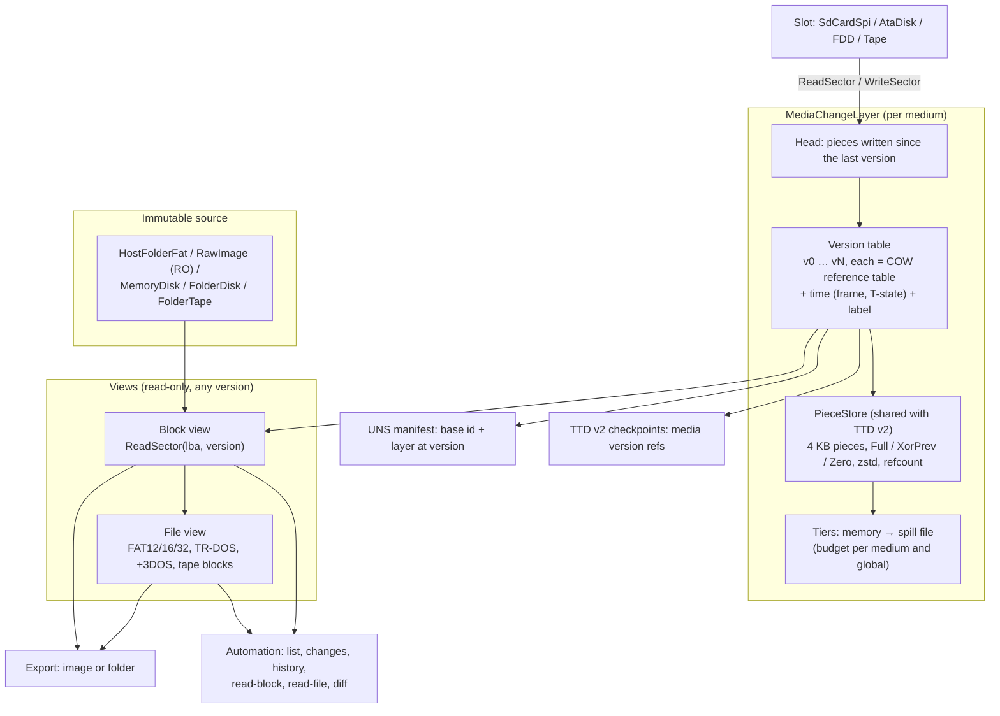

# Media history: an immutable source, a versioned change layer, file and block views

| | |
|---|---|
| **Date** | 2026-09-28 |
| **Status** | Design (2026-09-28); phases H1-H5 |
| **Part of** | [technical-design.md](technical-design.md) (the block stack, §5); phases H1-H5 in §12 there |
| **Shares storage with** | TTD v2 page store and storage tiers ([target-architecture.md](../2026-09-25-ttd-v2-migration/target-architecture.md) §3, §6) |
| **Feeds** | TTD v2 media requirements ST-1…ST-6 and the universal snapshot UNS-3 / UNS-6 ([roadmap §6, §7](../2026-09-21-roadmap/01-roadmap-and-machine-state.md)) |

## 0. Summary

The source of a medium is never modified, whether it is a host folder, an image file or a blank
disk. Everything the guest writes goes into a **change layer** on top of it. The layer keeps a
**history of versions**, stored the way TTD v2 stores memory: 4 KB pieces, delta encoding, zstd,
reference counting, in memory first and spilled to disk when large. With the history in place, a
few things become simple:
- **Export** is a merge of source and layer at a chosen version. The result can be a block image
  or a file tree.
- **Automation** can see every medium, what changed, and the contents of any block or file at any
  version.
- **Snapshots and TTD** restore the whole disk subsystem at any point in time by pointing at a
  version.

## 1. Worked example

A folder `~/zx/sd` is the ZX-Evo SD card. NedoOS boots, and the user saves `game.sav` twice, at
frame 12 000 and at frame 30 000:

| Version | When | Written blocks | File view |
|---|---|---|---|
| v0 | insert | — | the folder as it is |
| v1 | frame 12 000 | 3 FAT sectors, 1 directory sector, 2 data sectors | `game.sav` created, 1 024 bytes |
| v2 | frame 30 000 | 1 FAT sector, 1 directory sector, 2 data sectors | `game.sav` changed, 1 536 bytes |

- `media history sd.zc /game.sav` lists v1 (created) and v2 (changed, +512 bytes).
- `media read-file sd.zc /game.sav --at v1` returns the first save.
- `media export sd.zc --at v1 --as folder out/` writes the folder as it was after the first save.
- `media export sd.zc --as image card.img` writes the current card as a raw image.
- A snapshot taken at frame 20 000 stores "`sd.zc` = base `~/zx/sd` (content id …) + layer at v1".
  Loading it later restores the card exactly as it was then, `game.sav` with 1 024 bytes, even
  though the layer now also holds v2.
- A TTD v2 seek to frame 20 000 does the same: the card switches to v1, and a replay that reads
  `game.sav` reads the first save.

The folder `~/zx/sd` is untouched throughout.

## 2. Architecture

## 3. The change layer

### 3.1 Granularity: blocks are the record, files are a view

The guest writes blocks: sectors of 512 bytes, floppy tracks. Only the block record is lossless.
In the middle of a DOS operation the file system is legitimately inconsistent (FAT updated,
directory not yet), and a file-level record could not represent that moment. So:

| Level | Role | How |
|---|---|---|
| **Block layer** | the authoritative record of every write | pieces of 4 KB: 8 sectors of a block device, one TR-DOS track (16 × 256 B = 4 KB exactly), a UDI / DSK track rounded up to whole pieces |
| **File layer** | derived: which files a set of block changes touched, and their contents at a version | a file-system decoder over the block view at a version (§5); results cached per version |

The file layer can be **persisted** too, as a readable folder overlay: changed and new files, plus
a list of deleted paths, for a version. That is the "file-level" form of the change layer. It is
produced from the block layer and never read back as the source of truth.

### 3.2 Versions

- The **head** collects the pieces written since the last version, the same way the TTD dirty
  tracker collects RAM pages.
- A **version** seals the head. Versions are cut:
  - at the frame boundary after a frame that wrote to the medium (coalesced: at most one version
    per medium per frame);
  - at every TTD v2 checkpoint that follows a write;
  - on request (`media bookmark`, a labeled version);
  - on save and export.
- A version is a copy-on-write **reference table** (piece index → stored piece), in blocks of
  16 entries as in TTD v2 §3. Consecutive versions share every block they did not change.
- Each version carries its time: frame, T-state, the TTD position when recording, and an optional
  label.
- A **write equal to the source** frees the piece, so the head and the version show "unchanged".
  This is the `SessionWriteMap` rule, kept.
- **Branching.** After a TTD seek back and a new write, the default is to truncate the future,
  exactly as TTD does with its own timeline. A labeled version is never dropped by truncation, so
  a user can keep an alternative.

### 3.3 Storage and tiers

- The **`PieceStore`** is the TTD v2 page store, extracted into a generic, shared component: 4 KB
  pieces, `Full` / `XorPrev` / `Zero`, zstd level 1, CRC32C, reference counting, per-piece chain
  cap. One implementation serves RAM regions and media.
- **Memory first, then spill.** Each medium has a budget (default to be measured; e.g. 64 MB), and
  there is a global budget. Past it, sealed versions go to a **spill file** (chunks appended by a
  background writer, as in TTD v2 disk mode), in the emulator's state folder:
  `<state>/media/<slot>-<content id>.mlog`. Reads of spilled versions fetch through the chunk
  index. Nothing is ever dropped silently: when disk space runs out too, the oldest unlabeled
  versions are released and the earliest reachable version is reported.
- **Crash safety.** A spill file is append-only with a footer, like the TTD v2 container. After a
  crash it is recovered up to the last sealed chunk.

### 3.4 The source never changes

- `ReadOnly` media refuse writes (`ReadOnlyGuard`). `Session` media write into the layer; this is
  the default everywhere.
- `WriteThrough` exists only for image files where the user asks for it. It writes the merged head
  to the file on save, still through the layer, so history works for it too.
- **Source drift.** A layer records the `ContentId` of its source (for folders: a hash of the
  snapshot's names, sizes and mtimes). Re-attaching a layer to a source whose id differs is
  refused and reported, because the layer would describe a different disk.
- **Sharing.** Two emulator instances can mount the same source. Each gets its own layer; the
  source is read-only for both.

## 4. Export and save

| Operation | Result |
|---|---|
| `export --as image` | the block view at a version, written as a raw image; floppies and tapes use the registry's writers (TRD, UDI, DSK, TZX) |
| `export --as folder` | the file view at a version, written to a **new** folder. Paths are sanitized: no `..`, no absolute paths, host-illegal characters mapped. The source folder is never a valid target |
| `save` | for an image-file source with `WriteThrough` requested: the merged view written back to that file. For a folder source, `save` is not offered; export is |
| `discard` | drops the head, or everything after a version (`discard --to v1`) |
| `revert --to v1` | makes v1 the new head; later versions stay in history until truncated |

## 5. File views

A `IMediaFileView` decoder reads a block view at a version:

| Decoder | Media | Source of truth for the code |
|---|---|---|
| FAT12 / 16 / 32 | SD, IDE, PC floppies | ChaN FatFs R0.15b, read-only build, over the block view (the same library as the test oracle, `core/src/3rdparty/fatfs`) |
| TR-DOS | TRD / SCL / floppies in TR-DOS format | the existing TR-DOS catalog code in the disk loaders |
| +3DOS / CP/M | +3, Profi | later |
| Tape blocks | tapes | the tape image's block list (header names, lengths) |

- **What changed between two versions.** The decoder maps the changed pieces to files. A piece
  inside a file's clusters means the file changed; a directory or FAT piece means the listing
  changed, so the two listings are compared. The result is a list of created, changed, deleted and
  renamed files, with byte counts.
- **History of one file**: the versions whose change set includes that file.
- Decoding a view is done off the emulation thread, on an immutable version, so automation never
  blocks the machine and never sees a half-written state.

## 6. Tracking and automation

Everything is addressable by slot, version and time. Versions are immutable, so reads are
consistent by construction.

| Verb | Returns |
|---|---|
| `media list` | every slot: source, format, access, size, dirty, current version, versions count, memory / spill use |
| `media versions <slot>` | versions with time, label, pieces written, bytes |
| `media changes <slot> [--from v] [--to v]` | changed block ranges, and (when a file view exists) created / changed / deleted files |
| `media read-block <slot> <lba> [--at v|--at-frame f]` | 512 bytes (or a track for floppies) |
| `media read-file <slot> <path> [--at …]` | a whole file |
| `media history <slot> <path|lba>` | the versions that touched it |
| `media diff <slot> v1 v2 [--files|--blocks]` | the difference |
| `media bookmark <slot> <label>` | a labeled version |
| `media export`, `media revert`, `media discard` | §4 |

Notifications: `NC_MEDIA_VERSION` (slot, version, pieces) at most once per frame, which drives the
GUI's activity and dirty display.

## 7. Snapshots and TTD

| Consumer | What it stores | Restore |
|---|---|---|
| **Universal snapshot (UNS)** | per slot: source reference (path, `ContentId`), format, access, and the layer **at the snapshot's version**: either embedded (the pieces of that version, compressed; small for typical sessions) or a reference to a spill file plus version id | re-attach the source (drift is refused and reported), rebuild the layer at that version, and continue writing from there |
| **TTD v2** | each checkpoint holds, per medium, the id of the version current at that moment (a few bytes: versions are cut at checkpoints after writes) | a seek sets each medium's head to the checkpoint's version. It is cheap, because it only switches the reference table. A replay then reads exactly what the machine read the first time |
| **TTD v1** | nothing: v1 records at port level, works with the media present, loads and stores none | — |

This is the "restore the disk subsystem at any moment" feature. It covers floppy, SD and IDE alike,
because they all write into the same layer. It does not need a separate journal per device.

## 8. Things added by this design (beyond the review list)

| Item | Why |
|---|---|
| Source drift detection (`ContentId` of the source) | a layer must never be applied to a different disk |
| Labeled versions survive truncation | a user can keep an alternative after a TTD seek and a new write |
| Consistent reads from immutable versions | automation reads while the machine writes, without locks on the hot path |
| Sanitized folder export | a file name from the guest must not escape the export folder |
| Budgets, spill, crash recovery, and a report of the earliest reachable version | nothing is silently lost |
| One `PieceStore` for RAM and media | TTD v2 and media history share one tested implementation |

## 9. Tests

| Test | Proves |
|---|---|
| Layer unit tests | head / version / truncation / labeled keep; write-equal-to-source frees; COW table sharing; the same writes give the same bytes |
| Spill | budget crossed → versions spill → reads identical; a killed process recovers to the last sealed chunk |
| File views | FAT: create / change / delete / rename detected between versions (FatFs-made reference volumes); TR-DOS catalog changes; tape block list |
| Export | image at v1 and at head = FatFs-readable, byte-exact against a reference; folder export equals the file view; `..` in a guest name cannot escape |
| Drift | changed source → re-attach refused |
| Real ROM | the §1 example with NedoOS or the ERS: two saves, read the file at v1, export at v1, snapshot at frame 20 000 restores v1 |
| TTD v2 (when it lands) | the storage-overlay conformance test of the roadmap §8: write, seek back before it, reread → pre-write contents |
