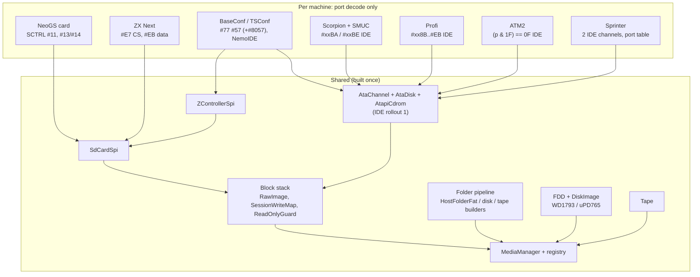

# Unified media manager — review round 2: reuse across machines, readiness

| | |
|---|---|
| **Date** | 2026-09-28 |
| **Question** | Is everything ready to implement? How is one manager reused by BaseConf, TSConf, NeoGS, Scorpion, Profi, ATM2, and later ZX Next and Sprinter? |
| **Evidence** | a survey of each machine's storage in the local sources (unreal-speccy, Xpeccy, ZXMAK2, MAME, jnext, ZXSpectrumNextTests, zx-evo-tsconf, karabas-pro). Key claims re-checked by hand: Next `#E7` chip selects (`ZXSpectrumNextTests/ports.txt:261-273`), jnext's phantom second card (`jnext/src/core/emulator.cpp:6102-6113`), the FAT32 cluster-count pitfall (`jnext/src/core/fat32_image.h:8-17`), `wc.img` used by two slots in our ATM3 config (`data/configs/atm3/unreal.ini:170, 203`) |

## 1. Verdict

**M1 can start.** The twelve design changes in §3 are folded into the documents, and the code
hook points are pinned (§4). The model itself holds for all eight machines, and nothing machine-specific leaks into
the manager:
- Slot ≠ medium.
- One block interface.
- Folder builders.
- Requests applied on the emulation thread.

What was missing is catalog and policy: slot naming, slots that come and go with add-on cards,
card-detect and write-protect signals, one image in two slots, media that the firmware boots from,
and the FAT32 cluster minimum. The open items that remain (§5) do not block M1.

## 2. How each machine reuses it

| Machine | Slots | Machine-specific code | Manager features it needs | Phase |
|---|---|---|---|---|
| **ZX-Evo BaseConf** | `fdd.a-d`, `tape`, `sd.zc`, `ide0.master/slave` (NemoIDE, ATAPI on a unit) | port decode (done in E5 for SD); AVR register C for card-present / WP | card-detect + WP signals, boot media (ERS SD / HDD / CD boot), one image in two slots (`wc.img`) | M1 (SD), M6 (IDE) |
| **ZX-Evo TSConf** | as BaseConf, `sd.zc2` reserved (FPGA option `SD_CARD2`, off in shipped builds) | DMA calls `ZControllerSpi` / `SdCardSpi` directly | same `sd.zc` id as BaseConf, so a model switch keeps the card | TSConf phase 6 |
| **NeoGS** (a card, any host) | `sd.ngs` | its SPI master (branch) | a slot that exists **only when the card is fitted**; real card-detect / WP lines (SSTAT bits 1, 2); boot media (`NEOGS.ROM`) | at `neogs` merge |
| **Scorpion ZS-256** | `fdd.a-d`, `tape`; with SMUC: `ide0.master/slave`; with a Z-Controller add-on: `sd.zc` | SMUC port decode (IDE rollout R1-4) | add-on slots registered at runtime | M6 |
| **ZX Profi** | `fdd.a-d` (Beta and CP/M port sets), `tape`, `ide0.master/slave`; Karabas-Pro adds `sd.zc` and a divMMC SD | Profi IDE decode (IDE R1-2) | floppy media with 512-byte sectors (CP/M 720 KB) | M2 (floppy), M6 |
| **ATM Turbo 2+** | `fdd.a-d`, `tape`, `ide0.master/slave` (ATM scheme, INTRQ in `#7FFD`) | ATM IDE decode (R1-4) | nothing new | M6 |
| **ZX Spectrum Next** (later) | `sd.next0`, `sd.next1`, `tape`; no FDC (NextZXOS emulates +3 DSK from the SD) | `#E7` / `#EB` decode, NR `#0A` bit 5 swaps the two sockets | a **required** slot (the SD card is the whole system: `TBBLUE.FW`, ROMs, OS); FAT32 with ≥ 65 525 clusters; one image in two slots refused (jnext's phantom-card bug); multi-GB images | Next project |
| **Sprinter** (later) | `fdd.a-d` (PC 720 KB / 1.44 MB and TRD), `tape`?, `ide0.*`, `ide1.*` (two channels, a CD on one unit) | port-table decode (firmware-loaded, MAME `sprinter.cpp:584-633`) | a second IDE channel; PC floppy formats | Sprinter project |

**Answer in one sentence.** A machine contributes only its port decode and registers the slots its
hardware has. Everything behind the slot is shared: controllers (`ZControllerSpi`, `AtaChannel`,
`FDD`), devices (`SdCardSpi`, `AtaDisk`, `AtapiCdrom`), block stack, folder builders, formats,
config, surfaces, TTD rules. So Next and Sprinter cost a decode and a slot list each, not a storage
stack.

## 3. Design changes from this round

| # | Gap | Change | Where |
|---|---|---|---|
| G1 | Slot ids were a flat list | **Naming rule** `<kind>.<controller>[<n>][.<unit>]`, tied to the controller, not the machine: `sd.zc`, `sd.zc2`, `sd.ngs`, `sd.next0`, `sd.next1`, `sd.divmmc`, `ide0.master`, `ide1.slave`, `fdd.a`, `tape`. The same controller on two machines gets the same id, so media follow a model switch | technical design §2 |
| G2 | CD as a separate `cd0` slot vs a unit | **The unit is the slot.** Its configured device type (`<slot>.device = disk | cdrom`, legacy `[HDD] CD0/CD1`) sets its kind: `disk` → `Block`, not removable; `cdrom` → `Optical`, removable (the drive stays on the bus while discs change, as WinUAE and MAME do) | [integration-ide-cd.md](integration-ide-cd.md) §2 |
| G3 | Slots that come and go | add-on cards (NeoGS, SMUC, Z-Controller add-on, divMMC, Sprinter ISA) register when fitted and unregister when removed. The manager **parks** the medium of an unregistered slot (session writes kept) and offers it back when the slot returns, the same mechanism as a model switch | technical design §8 |
| G4 | Card-detect and write-protect | `SlotDescriptor` gains `hasCardDetect`, `hasWriteProtectSwitch`. The switch is a slot property `<slot>.wp`, separate from `AccessMode`; the slot pushes both to its peripheral (Evo AVR register C, NeoGS SSTAT). A slot without the lines (Next, bare Z-Controller) still shows "no card" by protocol | technical design §2 |
| G5 | One image in two slots | the manager compares canonical paths and refuses a second insert with `in-use` (naming the other slot), unless **both** are `ReadOnly`. Evo's shipped config (`wc.img` for SD and HDD) then reports instead of corrupting; Next's two sockets cannot show a phantom card | technical design §3, requirements FR-7 |
| G6 | Media the firmware boots from | configured media attach **at creation, before the first reset**, with no swap delay. A slot can be `required` (Next `sd.next0`): starting without it fails with a clear error instead of a black screen | technical design §3 |
| G7 | FAT32 cluster minimum | a FAT32 volume always has ≥ 65 526 clusters and a FAT16 volume ≥ 4 086. ChaN FatFs decides the type by cluster count (65 525 or fewer = FAT16, 4 085 or fewer = FAT12; the Next's `tbblue.fw`, gitlab.com/thesmog358/tbblue `ff.c:3144-3146`), so an under-clustered FAT32 volume is rejected (`jnext/src/core/fat32_image.h:8-17`). The layout grows the volume or shrinks the cluster; the oracle test checks every generated size | technical design §6.3 |
| G8 | Per-slot FAT default | FAT16 stays the default for every slot. A slot may declare another if its firmware requires it; none does. The Next firmware and NextZXOS read FAT16 and FAT32 ([integration-next.md](integration-next.md)), Sprinter's DSS reads FAT12 / FAT16 only | technical design §6.3 |
| G9 | Floppy geometry | the floppy kind carries 256-, 512- and 1024-byte sectors (TRD, Profi CP/M 720 KB, Sprinter / PC 1.44 MB, +3). The registry adds raw PC floppy images by size (737 280, 1 474 560 bytes); `.img` ambiguity is settled by the slot kind, as before | [integration-floppy.md](integration-floppy.md) §2 |
| G10 | Large media | multi-GB images are normal (Next ≥ 1 GB, SDHC up to 32 GB). `RawImage` already uses 64-bit offsets and never loads the file; `SessionWriteMap` is sparse; `SdCardSpi` reports SDHC above 2 GB. A test inserts a sparse 4 GB image | [integration-zxevo-sd.md](integration-zxevo-sd.md) §5 |
| G11 | Persistent blobs (NVRAM, flash, CMOS, SMUC EEPROM, Next RTC) | **not slots.** They share the access semantics (session / persist / off) but are byte blobs, not removable media. Kept outside the manager for now; a small `PersistentStore` with the same `AccessMode` is a later option | technical design §2 (note) |
| G12 | More formats | CHD (MAME software lists for Next and Sprinter), 2MG, BIN/CUE for CD audio: registry entries in later phases, none needed for M1 | technical design §4 |

## 4. Readiness for M1

| Needed to start | State |
|---|---|
| Requirements and the review decisions | folded into the documents |
| Slot catalog, add-on registration, signals, collisions, boot media, FAT limits | this round (G1-G12) |
| Existing seam | `IBlockDevice`, `RawImage`, `MemoryDisk`, `SessionWriteMap`, `SdCardSpi`, `ZControllerSpi` on master (E5) |
| FAT oracle | **As built:** our own `FatVolumeReader` (`core/src/emulator/io/storage/fat/`), written from the FAT specification, no third-party code (the test oracle in M1, the FAT file view in H3). It decides the FAT type by cluster count exactly as ChaN FatFs does |
| YAML / JSON for the manifest | `core/src/3rdparty/rapidyaml` (bundled, single header, unused so far); reads JSON too |
| Guest oracles | ERS (on master), NedoOS `sd_boot.$C` + `term.com` / `cmd.com` (`testdata/machines/zxevo/nedoos/`), jnext / NeoGS images later |
| Code hook points | pinned: **frame boundary** = `MainLoop::CompleteFrame` (`core/src/emulator/mainloop.cpp:419`; the TTD call is at `:457`), reached by both the main loop and `RunFrame`, so `MediaManager::ApplyPending()` goes just before the TTD call. **Creation** in `Emulator::Init`: `Core` created and `Init()`-ed at `emulator.cpp:173-174` (peripherals register their slots there), the TTD manager at `:272`, the first `_core->Reset()` at `:362`. So the manager is created before `:173`, and configured media are inserted between `:272` and `:362`. **Relative paths** resolve against the folder of `Config::_configFilePath` (`config.h:72`) |

M1 work order:
1. `media/` types.
2. `MediaManager` with a block slot.
3. `ReadOnlyGuard`.
4. The folder pipeline: `ServiceFileFilter`, `FolderSnapshot`, `FolderManifest`.
5. `FatNameMapper`, `HostFolderFat`, with the `FatVolumeReader` oracle.
6. `MediaConfig`.
7. `sd.zc` migration.
8. The TTD common rule for `sd.zc`.
9. ACC-1 … ACC-4.

## 5. Remaining unknowns (not blocking M1)

| Item | Where it is handled |
|---|---|
| Does NeoGS's loader take FAT16 folder volumes as well as FAT16 images? | a test in M1 / at the `neogs` merge |
| ZX Next details (both SD sockets in NextZXOS, the FPGA flash) | [integration-next.md](integration-next.md), Next project |
| Sprinter details (IDE channel-select ports, the accelerator) | [2026-09-28-sprinter](../2026-09-28-sprinter/) |
| A hardware Z-Controller variant for Scorpion (emulators offer it as a generic add-on) | M6 |
| `data/configs/atm710/unreal.ini` uses `NEMO-DIVIDE` and `[ZC]`, which are not ATM2 hardware (a copied config) | fix with the ATM IDE scheme in M6 |
