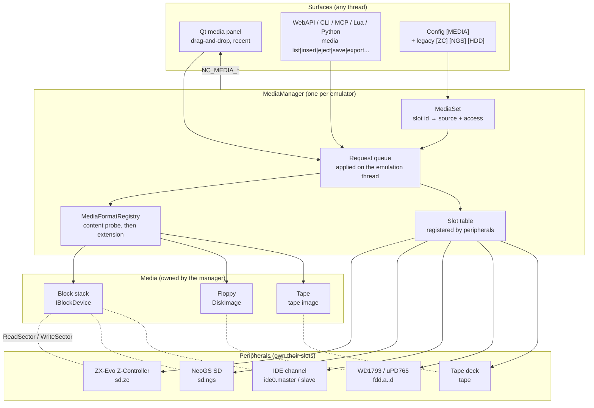
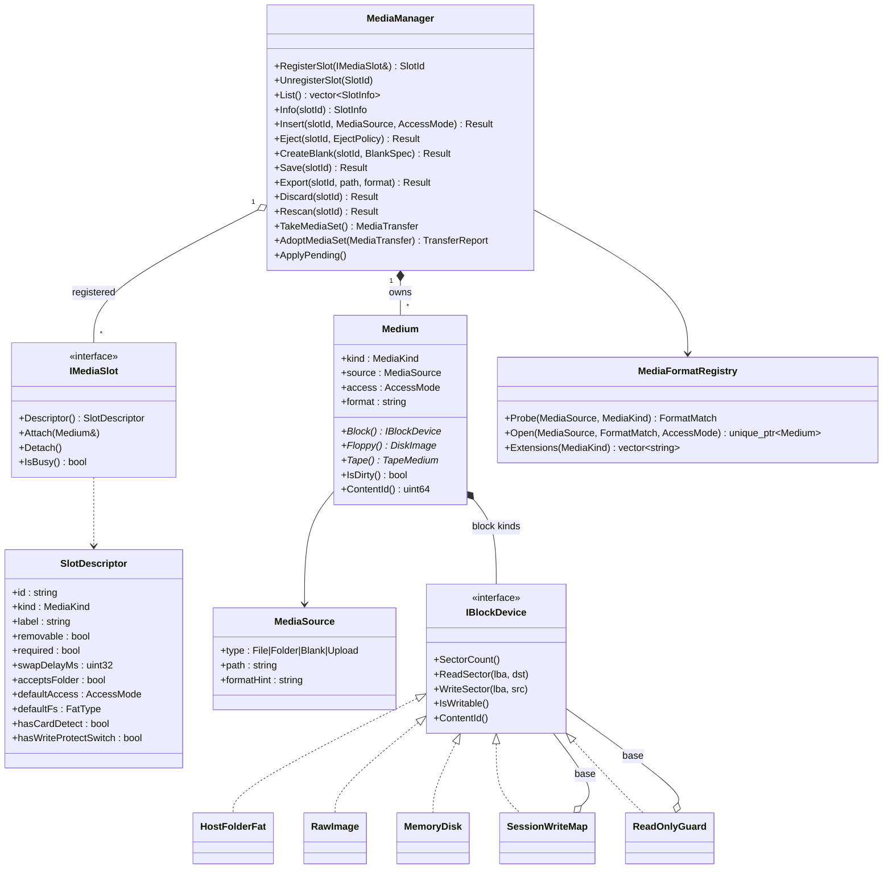
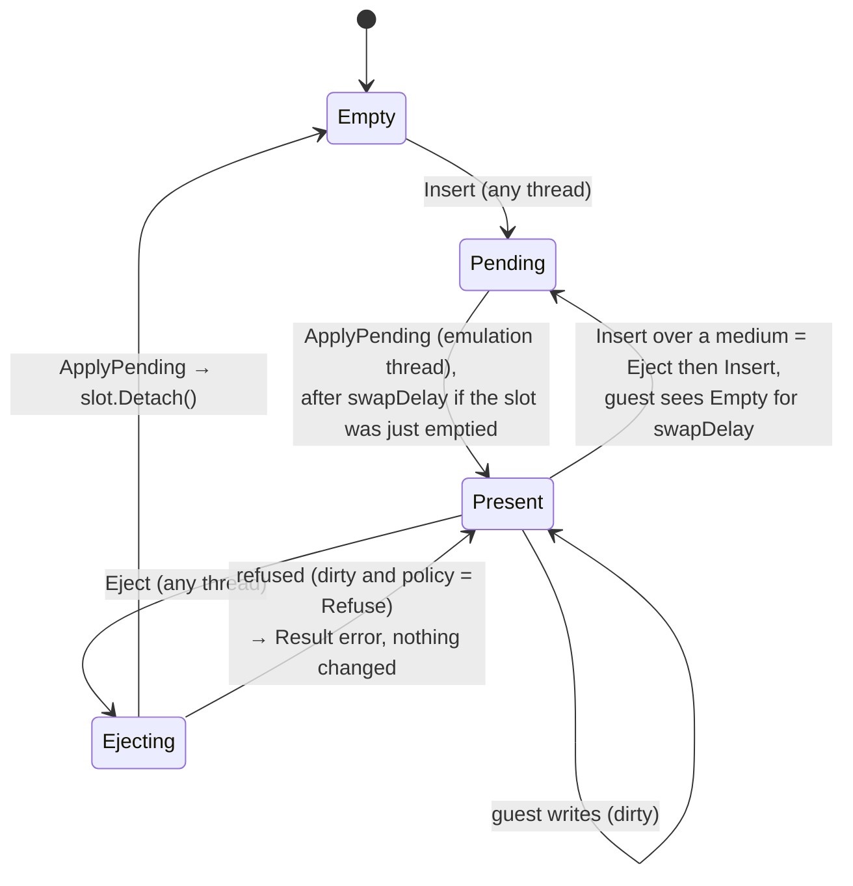
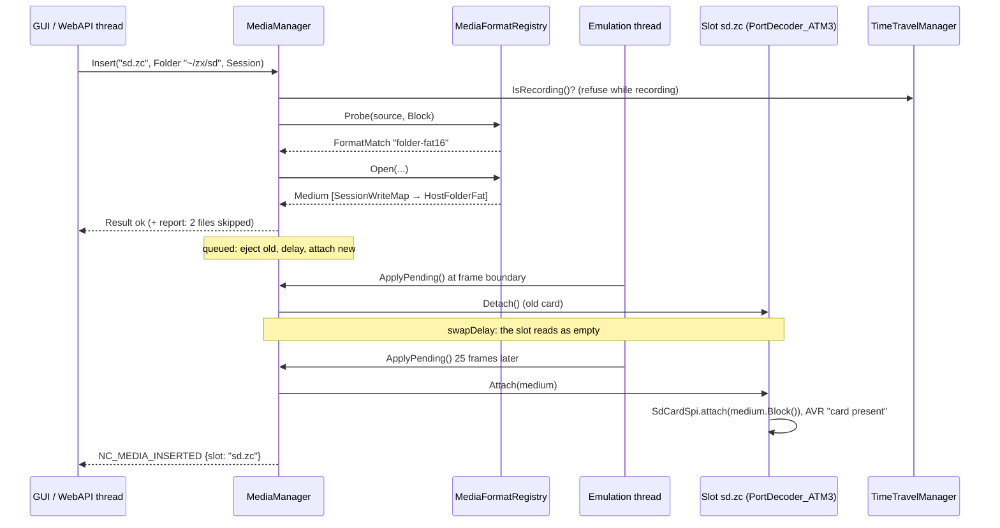
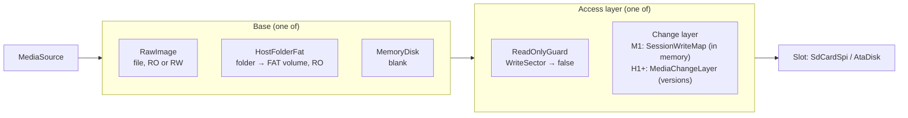
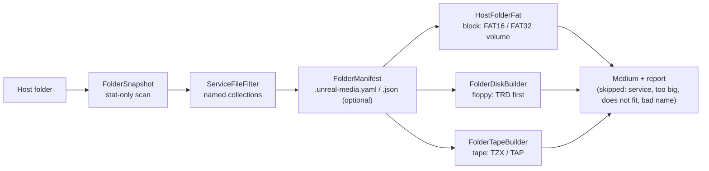
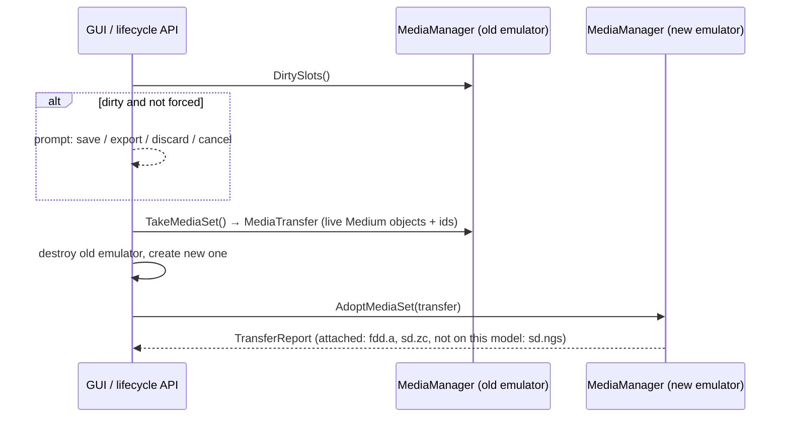
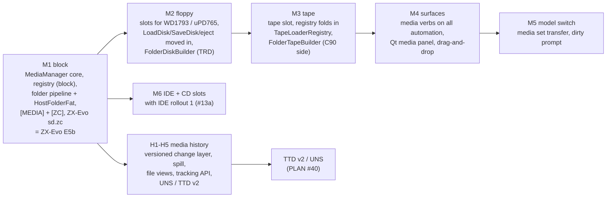

# Unified media manager — technical design

| | |
|---|---|
| **Date** | 2026-09-28 |
| **Status** | Reviewed (two rounds, 2026-09-28), ready for M1. Nothing implemented beyond the E5 storage seam (`io/storage`) |
| **Requirements** | [requirements.md](requirements.md) (FR-*, NFR-*, ACC-*) |
| **Research** | [research.md](research.md) |
| **Media history** | [media-history-design.md](media-history-design.md): immutable source + versioned change layer, file and block views, export, tracking, snapshots and TTD |
| **Integrations** | [ZX-Evo SD](integration-zxevo-sd.md) · [NeoGS SD](integration-neogs-sd.md) · [TSConf SD](integration-tsconf-sd.md) · [IDE / CD](integration-ide-cd.md) · [Floppy](integration-floppy.md) · [Tape](integration-tape.md) · [Automation and GUI](integration-automation-gui.md) · [TTD and snapshots](integration-ttd-snapshots.md) · [ZX Next](integration-next.md) · [Sprinter](../2026-09-28-sprinter/) |

## 0. Summary

Every emulator instance gets one `MediaManager` that owns every medium. Every storage peripheral
registers its **slots** with it: floppy drives, the tape deck, SD slots, IDE units, the CD drive. A
medium is built from a **source** (image file, host folder, blank, upload) and an **access mode**
(read-only, session, write-through) by one **format registry**, and handed to the slot through one
interface per kind, so peripherals never parse files or paths. Insert and eject are requests
applied on the emulation thread, with the guest-visible "empty" delay WinUAE uses, and every
surface (GUI, WebAPI, CLI, MCP, Lua, Python) calls the same operations by slot id. A host folder
becomes a sector-exact FAT volume (`HostFolderFat`), and a folder can also become a floppy image or
a tape. The source of a medium is never modified: guest writes go into a versioned change layer
([media-history-design.md](media-history-design.md)), from which export, tracking, snapshots and TTD
work. E5b ("a PC folder as the ZX-Evo SD card") is the manager's first consumer.

## 1. Architecture



Rules taken from WinUAE (research §1.1) and the problems found here (research §3):

| # | Rule |
|---|---|
| R1 | The **slot** (drive) is not the **medium** (what is in it). Ejecting never resets the peripheral; the peripheral keeps its own state |
| R2 | Peripherals never see formats or paths: a block slot gets an `IBlockDevice`, a floppy slot a `DiskImage`, the tape deck a tape image |
| R3 | One format table, content first: it replaces the five tables that disagree today |
| R4 | One code path per operation. Eject lives in the manager, not copied into each surface |
| R5 | Changes are requests, applied on the emulation thread |
| R6 | Nothing pretends: a refused write is an error the guest sees, and a skipped file is a report the user sees |

## 2. Concepts and types



| Type | Values / meaning |
|---|---|
| `MediaKind` | `Floppy`, `Tape`, `Block` (512-byte sectors: SD, IDE disk), `Optical` (2048-byte blocks: CD) |
| `AccessMode` | `ReadOnly` (writes refused), `Session` (writes in memory, the source never changes, exportable), `WriteThrough` (writes go to the source file). A folder source allows `ReadOnly` and `Session` only |
| `MediaSource::type` | `File` (image), `Folder` (host directory), `Blank` (created in memory, e.g. a formatted TRD or an empty 64 MB card), `Upload` (a staged WebAPI upload: a `File` that the manager deletes on eject) |
| Slot id | `<kind>.<controller>[<n>][.<unit>]`, lowercase, **tied to the controller, not the machine**: the same controller on two machines gets the same id, so media follow a model switch. Catalog: `fdd.a`…`fdd.d`, `tape`, `sd.zc` (Z-Controller: ZX-Evo, TSConf, add-on), `sd.zc2` (TSConf option), `sd.ngs` (NeoGS card), `sd.next0` / `sd.next1` (ZX Next), `sd.divmmc` (divMMC add-on), `ide0.master` … `ide1.slave` (a CD is a unit configured as `cdrom`, see [integration-ide-cd.md](integration-ide-cd.md) §2) |
| Signals | `hasCardDetect` / `hasWriteProtectSwitch`: the slot pushes "present" and the switch `<slot>.wp` to its peripheral (ZX-Evo AVR register C, NeoGS SSTAT). The switch is separate from `AccessMode`: on real hardware the switch is only reported, and whether software honors it is the software's business |
| Required | a slot the machine cannot start without (ZX Next `sd.next0`: the card holds the firmware and the OS). Creation without it fails with a clear error |
| Not slots | NVRAM, flash, CMOS, the SMUC EEPROM, the Next RTC RAM: byte blobs with the same access semantics but not removable media. They stay outside the manager; a small `PersistentStore` with the same `AccessMode` is a later option |

## 3. Slot lifecycle and threading



- **Queue.** Surfaces call manager methods from any thread. The manager validates the request
  (slot exists, kind accepted, source openable) and **opens the medium on the calling thread**
  (file I/O, folder scan). It then queues `{slot, medium}`. The emulation thread drains the queue
  in `ApplyPending()`, called at the frame boundary. When the emulator is paused, the drain happens
  inside the call. Peripherals therefore only ever see `Attach`/`Detach` on their own thread
  (NFR-5).
- **Swap delay.** A removable slot that was full stays empty for a while before the new medium
  attaches, so the guest sees the change. The delay is configurable per slot (`<slot>.swapdelay`, in
  milliseconds, converted to frames by the machine's frame rate). Defaults come from WinUAE:

  | Slot kind | Default | Why |
  |---|---|---|
  | floppy | 2000 ms | disk-change line / TR-DOS re-reads the catalog (WinUAE floppy 2 s) |
  | SD | 500 ms | the ERS / NedoOS poll the card and re-initialize it |
  | CD / ATAPI | 3000 ms | the drive reports "no medium" then "medium changed" (WinUAE CD 3 s) |
  | IDE hard disk | 0 | not removable: insert / eject only while paused |
  | tape | 0 | no guest detection |

  A slot can refuse while busy (`IsBusy`: a sector transfer in flight); the request waits for the
  next frame.
- **Boot media.** Media configured for a machine attach **at creation, before the first reset**,
  with no swap delay, because the firmware may boot from them: the ERS (SD / HDD / CD boot), NeoGS
  (`NEOGS.ROM`), TS-BIOS, the Next (everything). A `required` slot left empty fails the start.
- **One source, one slot.** A second insert of the same source (canonical path; the same folder
  counts) is refused with `in-use`, naming the slot that has it, unless every slot using it is
  `ReadOnly`. This covers the ATM3 config that points SD and HDD at one `wc.img`, and the Next's
  two sockets, where one card answering both makes NextZXOS mount a phantom card
  (`jnext/src/core/emulator.cpp:6102-6113`).
- **Result.** Every call returns `Result {ok, error code, message, report}`. The report lists
  skipped folder entries, a format that was guessed from the extension, and media that could not
  follow a model switch. The surfaces render it; they never invent their own messages.



## 4. Formats

`MediaFormatRegistry` is the only place that knows formats (R3). Entry:
`{id, kind, extensions, probe(first 64 KB + size) → confidence 0-100, open(source, access) → Medium, writer?}`.

| Kind | Formats (existing code reused) |
|---|---|
| Floppy | TRD, SCL, FDI, UDI, TD0, DSK/EDSK, MGT/IMG (by size 819 200), HFE, SCP (loaders exist, unreachable today); raw PC images by size, 737 280 (720 KB) and 1 474 560 (1.44 MB), for Profi CP/M and Sprinter; sectors of 256, 512 and 1024+ bytes |
| Tape | the `TapeLoaderRegistry` entries (TAP, TZX, SPC, STA, LTP, ZXT, CSW, WAV), folded in unchanged |
| Block | raw `.img/.ima/.hdd/.hd/.bin/.mmc/.sd` (any size, multi-GB normal), later HDF / HDI / VHD (IDE R1-5), 2MG, CHD (MAME software lists for Next and Sprinter); **folder** (FAT volume) |
| Optical | ISO 9660 (IDE R1-7); later BIN/CUE for CD audio (Sprinter) |

- **Content first.** A `.img` of 819 200 bytes with an MGT directory is a floppy; any other `.img`
  is a block image. The current rule, "`.img` is always MGT", collides with SD and HDD images
  (research §3).
- **Slot kind decides the ambiguity.** Inserting into a block slot never picks a floppy format.
- **Drag-and-drop with no slot**: the probe picks the kind, then the machine's default slot for
  that kind (the first floppy drive, the first block slot, the tape).
- `Extensions(kind)` feeds the GUI file filters, the MCP tool description and the error texts, so
  they cannot drift apart again.

## 5. The block stack



| Access | File | Folder | Blank |
|---|---|---|---|
| `ReadOnly` | `ReadOnlyGuard(RawImage RO)` | `ReadOnlyGuard(HostFolderFat)` | `ReadOnlyGuard(MemoryDisk)` |
| `Session` (default) | layer over `RawImage RO` | layer over `HostFolderFat` | layer over `MemoryDisk` |
| `WriteThrough` | layer over `RawImage RW`; save writes the merged view back to the file | refused: a folder is never written | same as Session |

- `ReadOnlyGuard` is new. It makes the refusal explicit and the same for every peripheral:
  `SdCardSpi` answers `#0D`, `AtaDisk` answers ABRT (R6, FR-23).
- **The source never changes.** Guest writes go into the change layer. M1 uses today's
  `SessionWriteMap`, which holds the writes in memory. Phase H1 turns it into the versioned
  `MediaChangeLayer`: history, spill to disk, file views
  ([media-history-design.md](media-history-design.md)).
- **Export** merges source and layer into a block image or a file tree in a new folder, at the
  current or any earlier version. **Save** is offered only for an image-file source with
  `WriteThrough`. **Discard** drops the layer's changes.
- `SdCardSpi::WriteMode` becomes an implementation detail of `open(path, mode)`, kept for NeoGS
  compatibility. Slots use `insert(IBlockDevice)` with the stack already built by the manager.

## 6. Folder sources and `HostFolderFat`

### 6.0 One folder pipeline, three builders

A folder can become a medium of any kind, in phases: block (M1), floppy image (M2), tape (M3). The first half of the path is
shared; only the builder differs:



| Part | Shared by | Job |
|---|---|---|
| `FolderSnapshot` | all | scan once: names, sizes, mtimes, subfolders (recursive for FAT, top level only for disk and tape), skipped entries with a reason |
| `ServiceFileFilter` | all | drops host service files automatically on every OS. The rules are **data in the class**, grouped in named collections, never ad-hoc checks in the builders (they may move into the manifest later) |
| `FolderManifest` | all | the optional metafile: order, names, types, addresses, excludes, disk geometry, tape pauses (§6.6) |
| `HostFolderFat` | block slots | §6.1-§6.5 |
| `FolderDiskBuilder` | floppy slots | [integration-floppy.md](integration-floppy.md) §4 |
| `FolderTapeBuilder` | tape | [integration-tape.md](integration-tape.md) §5 |

`ServiceFileFilter` collections (each a list of exact names, prefixes and patterns; matching is
case-insensitive; every collection applies on every host, because a folder copied from a Mac to
Windows still carries `.DS_Store`):

| Collection | Entries |
|---|---|
| `macos` | `.DS_Store`, `._*` (AppleDouble), `.Spotlight-V100`, `.Trashes`, `.fseventsd`, `.TemporaryItems`, `.DocumentRevisions-V100`, `.VolumeIcon.icns`, `Icon\r` |
| `windows` | `Thumbs.db`, `ehthumbs.db`, `desktop.ini`, `$RECYCLE.BIN`, `System Volume Information`, `*.lnk` |
| `linux` | `.directory`, `.Trash-*`, `lost+found`, `*~` (editor backups) |
| `vcs` | `.git`, `.gitignore`, `.gitattributes`, `.svn`, `.hg` |
| `unreal` | `.unreal-media.yaml`, `.unreal-media.json` (the manifest itself) |

Other dot-files are ordinary files: a FAT volume gives them the hidden attribute, and the disk and
tape builders map their names like any other name.

### 6.1 Parts of `HostFolderFat`

| Part | Job | Pure? |
|---|---|---|
| `FolderSnapshot` | scan the folder once: tree, names, sizes, mtimes, skipped entries with reasons | I/O (stat only, no contents) |
| `FatNameMapper` | long name → 8.3 name (CP866, Windows `~n`), LFN entries, checksum | pure |
| `FatLayout` | choose FAT type, cluster size, volume size, assign one contiguous cluster run per directory and file, build the LBA region table | pure |
| `HostFolderFat : IBlockDevice` | serve sectors: generated (MBR, boot, FSInfo, FAT, directories) or read from host files | reads host files |

### 6.2 Worked example

Folder `~/zx/sd` holds `SD_BOOT.$C` (1 297 bytes), `games/EYEACHE.TRD` (655 360 bytes) and
`Длинное имя.txt` (10 bytes). The card is created with `fs=fat32` (FAT16 is the default; the FAT32
layout shows more of the structure), with 4 KiB clusters (8 sectors):

| LBA | Contents | Generated from |
|---|---|---|
| 0 | MBR: one partition, type `#0C`, start 2048 | layout |
| 2048 | boot sector (BPB: 512 B/sector, 8 sectors/cluster, 32 reserved, 2 FATs, root cluster 2, label `UNREAL NG  `, serial fixed) | layout |
| 2049 | FSInfo (free count, next free) | layout |
| 2054 / 2055 | backup boot sector / FSInfo | layout |
| 2080 … | FAT 1, then FAT 2: entry *k* = *k*+1 inside a run, end-of-chain at its end, 0 for free clusters | **computed per sector** from the run table |
| cluster 2 | root directory: volume label, `SD_BOOT.$C`, `GAMES`, LFN entries + `~1` alias for the Cyrillic name | generated at mount, kept in memory |
| cluster 3 | `GAMES` directory: `.`, `..`, `EYEACHE.TRD` | same |
| cluster 4 | `SD_BOOT.$C` data (1 cluster) | host file, read on demand |
| cluster 5 | `ДЛИННО~1.TXT` data | host file |
| clusters 6-165 | `GAMES/EYEACHE.TRD` data (160 clusters) | host file |
| 166 … end | free space for the guest to write into (goes to the session map) | zeros |

A sector read is a binary search in the region table (O(log n)), then a copy. For file data, an
LRU of 8 open host handles serves the read, and bytes past the snapshotted size read as zeros.

### 6.3 Layout rules

| Decision | Choice | Why |
|---|---|---|
| Partitioning | MBR, one partition at LBA 2048; `Superfloppy` option (no MBR) | xpeccy-plus, SD cards as shipped; ChaN FatFs and the ERS handle MBRs best |
| FAT type | **FAT16 by default for every slot**; FAT32 by parameter when the medium is created (`fs=fat32`: config `<slot>.fs`, `media insert --fs`). If the folder does not fit FAT16 (2 GiB with 32 KiB clusters) the insert fails with an error that names `fs=fat32`; it never switches silently | FAT16 is read by every target driver (ERS, NedoOS, NeoGS, Next, Sprinter DSS); FAT32 when asked |
| Cluster size | FAT16: the count stays well inside 4 085 … 65 524. FAT32: 4 KiB, and **always ≥ 65 526 clusters**: the layout shrinks the cluster or grows the volume. ChaN FatFs decides the type by cluster count, and `tbblue.fw` (ZX Next) uses it: 65 525 or fewer is FAT16, 4 085 or fewer FAT12 (gitlab.com/thesmog358/tbblue `src/firmware/app/src/ff/ff.c:3144-3146`), so a FAT32-shaped volume below the minimum is rejected (`jnext/src/core/fat32_image.h:8-17`). Likewise a FAT16 volume has ≥ 4 086 clusters | formatter tables; the FatFs oracle test checks every generated size |
| Per-slot default | FAT16 for every slot; a slot may declare another default if its firmware requires one. None does: the ZX Next firmware and NextZXOS read FAT16 and FAT32 ([integration-next.md](integration-next.md)), Sprinter's DSS reads FAT12 / FAT16 only | the parameter always overrides |
| Volume size | files + `FolderFree=` (default 256 MiB), rounded to 1 MiB, then raised to the FAT type's minimum; data is never stored, so size costs nothing | room for guest writes; card capacity reported through CSD / IDENTIFY |
| Order | within a directory: subdirectories first, then files, each byte-wise UTF-8 sorted. Clusters: every directory (breadth-first), then every file (directories in the same order) | deterministic on every host (NFR-1); directories stay together at the start |
| 8.3 names | uppercase; Cyrillic → CP866; illegal → `_`; a lossy name always gets `~1` (Windows), the tail is rebuilt from the base, never stacked | fixes both xpeccy-plus quirks (research §2) |
| LFN | when the 8.3 name is lossy or the case differs | what software expects; keeps directories small |
| Timestamps | host mtime converted in **UTC**; `FolderTime=fixed` for tests | xpeccy-plus uses `localtime` (host-dependent) |
| Serial / label | fixed serial `#554E4721` ("UNG!"), label `UNREAL NG` (option) | deterministic |
| Attributes | archive; hidden for dot-files | files stay writable in the session |

### 6.4 Limits and reports (FR-15)

| Case | Behavior |
|---|---|
| File ≥ 4 GiB | skipped, reported |
| Symlink | skipped by default (`FollowLinks=1` follows, with cycle detection), reported |
| Host service files (`ServiceFileFilter`, §6.0) | always skipped, reported as "service" |
| Depth > 32, more than 65 000 entries, or a directory > 65 535 entries | the rest is skipped, reported |
| Name collision after mapping | `~2`, `~3` … (Windows rule) |
| Host file changed after mount | reads clamp to the snapshot size, zeros past a shrunk file, one warning per file |
| Host file deleted after mount | reads as zeros, one warning |

### 6.5 Rescan; nothing is written back

- **Rescan** (FR-14) rebuilds the snapshot and the layout. Clusters move, so the layer of the old
  layout no longer applies. Rescan is therefore allowed only while the layer has no changes, or
  after an export. The slot sees eject → delay → insert, so the guest re-reads its FAT.
- **Nothing is written back into the folder**, neither live (QEMU vvfat style, research §2) nor
  as a "commit". The guest's results come out through export: as an image, or as a file tree
  written to a **new** folder, at any version ([media-history-design.md](media-history-design.md) §4).

### 6.6 The folder manifest

An optional file in the folder, `.unreal-media.yaml` or `.unreal-media.json`, read with the bundled
**rapidyaml** (`core/src/3rdparty/rapidyaml`, single header; JSON is read by the same parser). If
both exist, YAML wins and the report says so. Every key is optional; unknown keys are reported,
never fatal.

```yaml
label: MY GAMES              # disk label / tape name / FAT volume label
order:                       # these files first, in this order; the rest follow sorted
  - boot.$B
  - game.$C
exclude: [notes.txt, "*.psd"]
files:                       # per-file overrides (disk and tape builders)
  loader.bin: {name: loader, type: C, start: 24576}
  intro.scr:  {start: 16384}
disk:  {format: trd, tracks: 80, sides: 2}
tape:  {format: tzx, pause: 1000}          # ms between files
```

The FAT builder uses `label` and `exclude` only; directory order stays byte-wise sorted, because FAT
software sorts for itself.

## 7. Configuration

One section, one key per slot; values are paths (a folder when the path is a directory). Legacy
keys are read when `[MEDIA]` does not set the slot.

```ini
[MEDIA]
fdd.a        = games/elite.trd
tape         = demos/demo.tzx
sd.zc        = ~/zx/sdcard/            ; a folder → FAT volume
sd.zc.access = session                 ; readonly | session | writethrough
sd.zc.fs     = fat16                   ; folder volumes: fat16 (default) | fat32
sd.zc.swapdelay = 500                  ; ms the slot stays empty on a swap
ide0.master  = hdd/nedoos.img
ide0.master.access = writethrough
```

| Legacy key | Slot |
|---|---|
| `[ZC] SDCardImage` / `SDCARD`, `SDWrite`, `SDWriteProtect` | `sd.zc`, `.access`, `.wp` |
| `[NGS] SDCardImage` / `SDCARD` | `sd.ngs` |
| `[HDD] Image0` / `Image1`, `HD0RO` / `HD1RO`, `CD0` / `CD1` | `ide0.master` / `ide0.slave`, `.access`, `.device = cdrom` |

Relative paths resolve against the config file's folder (FR-24). The legacy keys keep working, so
no shipped ini has to change; new keys are written only by "save media set".

## 8. Model switch (FR-21)



The live medium objects move between the two managers, session writes included, so nothing is
re-read from disk and nothing is lost. The same **parking** handles add-on cards (NeoGS, SMUC, a
Z-Controller add-on, divMMC): a card that is removed unregisters its slot, the manager parks the
medium, and it is offered back when the slot returns. A medium whose slot id does not exist on the new model is
kept in the transfer until the user decides: it is re-offered on the next switch, or dropped when
the GUI closes, after a prompt if it is dirty.

## 9. Notifications, activity, TTD

| Topic | Payload |
|---|---|
| `NC_MEDIA_INSERTED` / `NC_MEDIA_EJECTED` | slot id, kind, source description, access |
| `NC_MEDIA_DIRTY` | slot id, changed units (sectors / tracks), first dirty only (not per write) |
| `NC_MEDIA_SAVED` / `NC_MEDIA_EXPORTED` | slot id, path |
| `NC_MEDIA_ACTIVITY` | per frame, the slots that read / wrote in it (activity LEDs, WinUAE `gui_flicker_led`) |

The `NC_FDD_*` topics keep firing from the floppy path until the GUI and automation have moved
over; `NC_FDD_DISK_WRITTEN` gets its real drive number on the way.

TTD and snapshot rules (details in [integration-ttd-snapshots.md](integration-ttd-snapshots.md)):
- The media set is fixed while a recording runs. Insert, eject, rescan and discard are refused
  with `recording`, unless the caller asks to end the recording first (the NeoGS branch rule).
- A guest write is a replay barrier, at most one per slot per frame. This applies to every kind,
  replacing E5's "the first SD command ends the recording".
- The peripherals' protocol state is in their TTD blobs.
- **TTD v1 does not handle media**: it works with the media present and loads and stores none; its
  sessions record at port level.
- **TTD v2 and the universal snapshot** restore media through the change layer's versions: a
  checkpoint or a snapshot names a version, and restoring it restores the whole disk subsystem at
  that moment ([media-history-design.md](media-history-design.md) §7; roadmap ST-6, UNS-6).

## 10. Code placement

```
core/src/emulator/media/
  mediamanager.{h,cpp}          slot table, request queue, operations, media set transfer
  mediaslot.h                   IMediaSlot, SlotDescriptor, MediaKind, AccessMode
  medium.{h,cpp}                Medium, MediaSource, Result
  mediaformatregistry.{h,cpp}   probe / open / extensions for every kind
  mediaconfig.{h,cpp}           [MEDIA] + legacy key mapping, path resolution
core/src/emulator/io/storage/
  readonlyguard.h               new
  hostfolder/foldersnapshot.{h,cpp}
  hostfolder/fatnamemapper.{h,cpp}
  hostfolder/fatlayout.{h,cpp}
  hostfolder/hostfolderfat.{h,cpp}
core/tests/emulator/media/…     mediamanager_test.cpp, mediaformatregistry_test.cpp, mediaconfig_test.cpp
core/tests/emulator/io/storage/hostfolder/…  one *_test.cpp per source file
core/tests/3rdparty/fatfs/      ChaN FatFs (read-only build) as the independent oracle
```

`EmulatorContext::pMediaManager` is created before the peripherals and destroyed after them, so a
peripheral can register in its constructor and unregister in its destructor.

## 11. Tests

| Layer | What proves it |
|---|---|
| Name mapper | table-driven: ASCII, lossy, case-only, Cyrillic → CP866, collisions `~1…~9`, `~10`, tail never stacked, LFN checksum |
| Layout | FAT type thresholds and cluster counts; region table covers every LBA exactly once; the same snapshot gives the same bytes; empty folder; a 0-byte file; > 512 entries in one directory; depth |
| Folder volume | an **independent FAT reader** (ChaN FatFs, read-only build) mounts the volume: same tree, names, sizes, contents, timestamps, for FAT16 and FAT32 |
| Session over folder | writes read back; the folder unchanged (tree hash); export → FatFs reads the new file; rescan refused while dirty |
| Manager | register / unregister; insert kinds and access rules; queue applied on `ApplyPending`; swap delay; `IsBusy` retry; errors; media set transfer keeps session writes; notifications fire once |
| Registry | content before extension (`.img` floppy vs block); one extension list per kind; unknown format → error naming the kinds tried |
| Config | `[MEDIA]` keys, legacy mapping, relative paths |
| Real ROM | ACC-1…ACC-4 (ZX-Evo SD from a folder, NedoOS), later IDE and floppy acceptance in their integration docs |

## 12. Phases



| Phase | Content | Acceptance | Size |
|---|---|---|---|
| **M1** | `MediaManager` core (slots, queue, results, notifications), `ReadOnlyGuard`, registry (block), the folder pipeline (`FolderSnapshot`, `ServiceFileFilter`, `FolderManifest`) and `HostFolderFat` (FAT16 default, FAT32 by parameter), FatFs oracle, `[MEDIA]` + `[ZC]`, ZX-Evo `sd.zc`; the TTD common rule for `sd.zc` | ACC-1…ACC-4 | L |
| **M2** | floppy slots (WD1793 A-D, uPD765 A-B); `LoadDisk` / `SaveDisk` / eject / create move into the manager and the registry; the listed bugs fixed; `FolderDiskBuilder` (TRD: one folder, only files that fit, compatible names, manifest order) | ACC-7 | M |
| **M3** | tape slot; `TapeLoaderRegistry` folded into the registry; eject / notifications; `FolderTapeBuilder` (TZX from a folder, capacity one side of a C90 cassette) | ACC-8 | M |
| **M4** | `media` verbs on WebAPI / CLI / MCP / Lua / Python; Qt media panel; drag-and-drop by the registry; recent media | ACC-6 | M |
| **M5** | media set transfer across model switch; dirty prompt | ACC-5 | S–M |
| **M6** | IDE master / slave and CD slots (with IDE rollout 1) | IDE acceptance | S (manager side) |
| **H1** | `MediaChangeLayer`: versions, COW reference tables, truncation, labels, on the shared `PieceStore` (extracted from the TTD page store) | [media-history-design.md](media-history-design.md) §9 | M |
| **H2** | spill to disk, budgets, crash recovery | §9 | M |
| **H3** | file views (FAT via FatFs, TR-DOS, tape blocks), change sets between versions, folder export at a version | §9 | M |
| **H4** | tracking verbs (`versions`, `changes`, `read-block`, `read-file`, `history`, `diff`, `bookmark`, `revert`) on every surface | §6 | S–M |
| **H5** | UNS media section and TTD v2 version references (with PLAN #40) | §7 | S (media side) |
