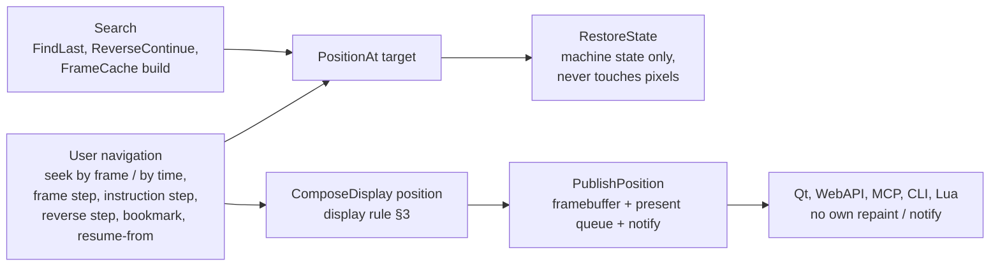

# TTD Positioning and Display — One Path per Responsibility

**Created:** 2026-09-28
**Status:** implemented in TTD v1 (2026-09-28), full-suite verification pending
**Trigger:** extracting frames of *Across the Edge* via WebAPI `ttd/step-forward`
produced static memory decodes (no border stripes, no multicolor) while
`ttd/seek` produced correct frames.
**Related:** `3cbfbd39` (RenderFrameAccurate), `2026-09-25-ttd-v2-migration/`,
[ZX DLSS rollout](../2026-09-27-zxdlss-gigascreen/rollout.md) (step 1 blocked on this)

---

## 1. The bug that exposed the problem

`StepForwardFrame()` / `StepBackFrame()` call `SeekTo({frame ± 1, current.tInFrame})`.
`current.tInFrame` is the previous checkpoint's instruction overshoot (a few
T-states). When it is larger than the next checkpoint's overshoot,
`SeekToInternal` takes the intra-frame branch (`ReplayWithinFrame`) instead of
the frame-aligned branch, so `RenderFrameAccurate()` never runs and the frame
shows the static decode. The overshoot then grows with every step:

```
frame 4520 t=9 → 4521 t=19 → 4522 t=23 → 4523 t=33 → 4524.. t=34
seek: border colors 8     step: border colors 1
```

Qt uses the same `StepForwardFrame()` (`ttdwidget.cpp:620`), so it is a core
issue, not a WebAPI one.

---

## 2. Current call graph (as of 2026-09-28)

### 2.1 Positioning entry points

| Entry point | Path | Framebuffer afterwards |
|---|---|---|
| `SeekTo` frame-aligned (Qt timeline, WebAPI seek, bookmarks) | `SeekToInternal` → restore → `RenderFrameAccurate` | accurate — unless nested in a replay or input is due in the frame |
| `StepForwardFrame` / `StepBackFrame` | `SeekTo(frame±1, current tInFrame)` | usually the intra-frame branch → static decode + partial beam |
| `SeekTo` intra-frame, marker halt | restore → `ReplayWithinFrame` | static decode with a partial beam render on top |
| `StepForward/BackInstruction`, `ReverseStepInstructions/TStates` | own restore + `ReplayWithinFrame` / `RunTStates(1)`, not via `SeekTo` | same mix; not published to the present queue |
| `ResumeRecordingFrom` | `SeekToInternal` | by branch |
| `BuildFrameCache`, FindLast, ReverseContinue (search) | `SeekToInternal` / restore in loops | static decode, repeatedly |
| `GetFrameCache` (debugger views) | `RestoreLiveState` → `ResyncScreenCaches` | **overwrites an accurate frame with a static decode** |

### 2.2 Five ways pixels get written

1. `ResyncScreenCaches` — static decode + border fill, inside every restore.
2. `RenderFrameAccurate` — replay the frame, memcpy the result back.
3. `ReplayWithinFrame` — partial beam render on top of (1).
4. `BuildFrameCache` — full-frame run, then restore → (1) again.
5. Live `MainLoop::OnFrameEnd`.

### 2.3 Publication differs

- `SeekTo` → `PublishSeekedFrame` (flush present queue + `NC_VIDEO_FRAME_REFRESH`).
- WebAPI instruction/reverse steps → `NotifyFrameRefresh` only (no flush).
- Qt reads the present queue; WebAPI capture reads the live framebuffer — the
  two can disagree after the same operation.

**Root cause:** state restore and display rendering are coupled; each caller
repairs the picture left by the previous step, so correctness depends on
branch order.

---

## 3. Display rule (decided 2026-09-28)

| Position | Displayed picture |
|---|---|
| **By frame number** | the frame's **final** state — the complete picture the beam drew for that frame (border, multicolor, mid-frame bank flips included) |
| **By time mark / T-state not at frame end** | what the beam rendered **from the start of that frame up to that moment**; the not-yet-drawn part keeps the previous frame's pixels, exactly as on a live machine paused there |

---

## 4. Target design



| Layer | Responsibility | Replaces |
|---|---|---|
| `RestoreState(cp)` | CPU, RAM, ports, peripherals, raster *geometry* and latches (active screen, border latch). **No pixel writes.** | pixel part of `ResyncScreenCaches` |
| `PositionAt(target)` | the only way to reach a point: nearest checkpoint ≤ target, silent replay to target. Frame steps are frame targets (`frame ± 1`), never carried T-state overshoot. Search operations use it with no display work. | the branchy `SeekToInternal`, per-operation restore/replay pairs |
| `ComposeDisplay(position)` | one sandboxed render (save live state → work → restore): **frame target f** → replay frame f from its checkpoint to its end → final picture. **Time target (f, T)** → render frame f−1 to its end (base), continue frame f to T → exactly the live framebuffer at T. Sandbox saves/restores the input-journal cursor and keyboard/mouse state, so frames with input are rendered accurately too. | `RenderFrameAccurate`, `ReplayWithinFrame` pixels, the "input due → static decode" fallback |
| `PublishPosition()` | write the composed picture to the framebuffer, flush the present queue, post `NC_VIDEO_FRAME_REFRESH` — once, at the end of each user navigation | `PublishSeekedFrame`, WebAPI `NotifyFrameRefresh`, Qt-side repaint logic |
| `GetFrameCache` | saves/restores framebuffer pixels with the live state | `RestoreLiveState` → static decode |

Cost: at most two frames of replay (≈ 1 ms) per user navigation; search
operations pay nothing extra.

---

## 5. Invariant tests

| Test | Checks |
|---|---|
| Live ≡ TTD | for random positions in a recorded session (frame targets and time targets; frames with border stripes, multicolor, bank flips, input events): the framebuffer after `PositionAt` + `ComposeDisplay` equals a live run paused at the same point, pixel for pixel |
| Frame target | seek by frame f shows the final picture of frame f; equals the live framebuffer at the end of frame f |
| Path independence | any sequence of navigation operations ends with the same picture as a direct positioning to the final point |
| Step ≡ seek | frame step from any position equals seek to that frame |
| Search is invisible | FindLast / ReverseContinue / FrameCache builds change neither the framebuffer nor the present queue |
| Frontend parity | after every operation, Qt's presented frame and WebAPI `capture/screen` are identical |
| Existing contracts | `ttdseek_test.cpp` step tests updated to the frame-target rule (see §6) |

---

## 6. Implementation (TTD v1, 2026-09-28)

| Item | Where |
|---|---|
| Restores never paint: `ResyncScreenCaches` → `ResyncScreenState` (mode, active screen, border latch, draw cursor reset, `InitFrame`) | `timetravelmanager.cpp` |
| `ComposeDisplay(frameTarget)` sandbox: static base, then beam replay (frame target: its checkpoint to frame end; time target: previous frame to its end, then to T) | `timetravelmanager.cpp` |
| `PresentPosition` = compose + `PublishSeekedFrame`; called by public `SeekTo` (incl. marker halts) and `StepForwardInstruction`; FindLast / ReverseStep / ReverseContinue reach it through `SeekTo` | `timetravelmanager.cpp` |
| `SeekToInternal` does no display work (nested builds no longer render) | `timetravelmanager.cpp` |
| Frame steps target `{frame ± 1, 0}` | `StepForwardFrame` / `StepBackFrame` |
| Live snapshot also carries framebuffer pixels, keyboard matrix/counters and the renderer draw cursor | `LiveStateSnapshot`, `Keyboard::Capture/RestoreInputState`, `Screen::Get/SetPrevTstate` |
| Throwaway replays leave no auto-pause | `OnFrameBoundary` skips auto-pause in replay mode |
| Tests | `timetravelmanager_display_test.cpp` (7 invariants), `ttdseek_test.cpp` frame-step tests rewritten |

### 6.1 Found on the way

- **#C000 page not restored (pre-existing, fixed).** `Memory::UpdateZ80Banks()`
  re-derived only the ROM slot for 48K/128K/Pentagon models; the RAM page at
  `#C000` was set only by the `#7FFD` port write. A checkpoint restore
  therefore kept whatever page the previous position had mapped, so replays
  after a seek could run with the wrong memory (exposed by
  `IntraFrame_TStateSeek_IsDeterministic` once the display sandbox changed
  the pre-seek state). Fix: every model's decoder completes the bank rebuild
  (`UpdateModelMemoryBanks`); Pentagon 128/512/1024 and Spectrum 128 derive
  the page from `#7FFD` (+`#EFF7`). Regression test
  `Seek_MapsC000PageFromRestoredLatch`.
- **Draw cursor.** The old static repaint hid a stale `Screen::_prevTstate`
  after restores; restores now reset it (checkpoints sit at frame start).

### 6.2 Known gaps (not addressed here)

- `#7FFD` paging lock (`_7FFD_Locked`) is not part of the checkpoint, and
  `p7FFD` caches writes the locked port ignored; a restore across a lock
  change keeps the live lock state. Needs the lock (and the effective latch)
  in the checkpoint — a format addition.
- The keyboard matrix is not a checkpointed peripheral; sandbox and seek
  replays start from the live matrix.

## 7. Open questions

- Machine state for a frame target stays at the frame's start (checkpoint);
  only the picture is the frame's final one. Revisit if the debugger should
  show registers at the frame's end instead.
- "Same T-state in the next frame" (the old frame-step behavior) is no longer
  available; add it as an explicit debugger operation if needed.
