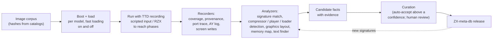

# ZX-meta-db: a knowledge base about ZX Spectrum software

- **Date:** 2026-09-28
- **Status:** concept for review. **A separate project** (user decision,
  2026-09-28): its own repository, data and release cycle. unreal-ng
  consumes its releases; it is not part of the emulator source tree.
- **Related:** the [debugger family](../2026-09-28-debugger-family/TODO.md) (the main consumer); memory intelligence in [use-cases §4.5](../2026-09-28-debugger-family/use-cases.md#45-memory-intelligence);
  the Metadata Manager's packs and identification
  ([2026-09-27-metadata-manager](../2026-09-27-metadata-manager/TODO.md),
  PLAN #56); the ROM signature catalog in the core.

> **In one line.** Merge every public source about Spectrum software, run every
> title through unreal-ng headless to learn what it does, and publish one
> versioned database of titles, routines, engines, players, loaders,
> compressors and memory layouts that any debugger, emulator or tool can use.

## Contents

- [1. Why a separate knowledge base](#1-why-a-separate-knowledge-base)
- [2. What it knows](#2-what-it-knows)
- [3. Sources to merge](#3-sources-to-merge)
- [4. Automatic analysis pipeline](#4-automatic-analysis-pipeline)
- [5. Recognition, search and graphs](#5-recognition-search-and-graphs)
- [6. Curation](#6-curation)
- [7. Data model](#7-data-model)
- [8. How unreal-ng uses it](#8-how-unreal-ng-uses-it)
- [9. Releases and access](#9-releases-and-access)
- [10. Phases](#10-phases)
- [11. Open questions](#11-open-questions)

---

## 1. Why a separate knowledge base

- Every reverse engineer re-discovers the same players, loaders, compressors
  and engines. Nothing is recorded in a machine-readable way.
- Title catalogs (what exists, who made it) and technical knowledge (how it
  works inside) live in different places and never meet.
- The knowledge outlives any one emulator: other emulators, disassemblers,
  preservation projects and AI agents can use it.
- Its release cycle (data updates, community submissions) is not the
  emulator's.

## 2. What it knows

| Entity | Examples of facts |
|---|---|
| **Title and release** | name, authors, year, publisher, machine requirements, file hashes of every known image (TAP, TZX, TRD, SCL, DSK, SNA, Z80, SZX) |
| **Machine requirement** | 48K / 128K only, TR-DOS, +3, clones, peripherals (AY, GS, Kempston, TSFM) — evidence-based (e.g. "asks for flag #13 on 48K") |
| **Loader and protection** | Speedlock version, Alkatraz, custom tape schemes, disk protections, weak sectors |
| **Compressor** | hrust, laser compact, zx7, lzsa, exomizer, …: the unpacker routine, its entry, its data |
| **Music player and format** | PT2 / PT3 / STC / ASC / SQT, GS MOD players, beeper engines: player routine, init / play entries, data address |
| **Engine** | Filmation, Freescape, 3D Construction Kit, AGD, the Quill / PAW, demo-system kernels: routines, data structures |
| **Routine** | a byte signature (with wildcards) and / or a behavior signature (reads screen, writes AY, uses these ports), a name, parameters, effects |
| **Memory layout** | per title (or per engine): where code, screen buffers, sprite tables, fonts, levels, music, stack live, per game phase |
| **Graphics** | sprite sets with derived layout (width, height, mask interleave, frames), fonts, tile sets |
| **Text** | strings, encodings, fonts used for text (for translators) |
| **Entry points and phases** | loader → decompressor → menu → game loop; addresses and triggers of each phase |
| **Knowledge provenance** | where each fact came from: source database, automatic analysis (run id, emulator version), human curator; confidence |

## 3. Sources to merge

| Kind | Examples | Gives |
|---|---|---|
| Title catalogs | ZXDB (Spectrum Computing), World of Spectrum archive data, ZXArt, Pouet / Demozoo (demos), TR-DOS archives | titles, releases, authors, file hashes |
| Disassemblies | SkoolKit projects, published commented disassemblies, our own `docs/disasm/` | routines, labels, layouts |
| Cheats | POKE databases (e.g. the ones used by ZXSpin and Spectaculator), `.pok` files | addresses of lives, energy, levels |
| Formats and specs | tracker format specs, compressor specs, TZX block types, protection write-ups | parsers, signatures |
| Recordings | RZX archives (thousands of completions), TTD sessions | input to reach every game phase for analysis: an RZX is played in unreal-ng while TTD records it, then the offline analyzers run on the recording ([TTD and RZX](../2026-09-28-debugger-family/ttd-offline-analysis.md#6b-ttd-and-rzx)) |
| Emulator knowledge | ROM signature catalog (unreal-ng), known-loader tables of other emulators | ROM routines, loaders |
| Automatic analysis | [§4](#4-automatic-analysis-pipeline) | everything above, derived from running the software |

Every record keeps its source; conflicting facts are kept side by side with
their sources until curated.

## 4. Automatic analysis pipeline

Runs unreal-ng headless (WebAPI / Python) over the whole corpus.

- **Learning loop:** confirmed routines become signatures; the next pass finds
  them in more titles.
- **Machine requirement probing:** run on each model; record where it fails
  and why (e.g. "waits for block flag #13 on 48K").
- **Phase discovery:** screen changes, input waits and code-path set diffs
  split a run into phases (loader, menu, game), each with its memory layout.
- **Graphics:** the drawing routine's read strides give sprite layouts (the
  automatic layout of [use-cases §4.5](../2026-09-28-debugger-family/use-cases.md#45-memory-intelligence)).

## 5. Recognition, search and graphs

Cataloging by signature is the base; people also look things up by ear, by
eye and by vague memory.

| Capability | How | Uses |
|---|---|---|
| **Signature cataloging of everything** | content hashes of files and blocks; byte and behavior signatures of routines; perceptual hashes of graphics; fingerprints of music | identification of any image, block, routine, picture or tune |
| **Melody recognition** ("Shazam" for Spectrum music) | fingerprints of register streams (note sequences and rhythm, independent of chip clock and stereo layout) and of rendered audio; matched against every tune in the database | name a tune heard in a game or a recording; find reuse and covers |
| **Screenshot recognition** | perceptual hashes of loading screens and characteristic in-game frames, tolerant to palette, border and scaling differences | identify a title from a picture, a photo of a screen or a video frame |
| **Fuzzy search by description** | text search plus semantic search over titles, descriptions, tags, screenshot captions and inlay texts ("platform game, penguin on ice, green loading screen, 1987") | find a half-remembered game |
| **Similarity graph** | shared routines, engines, music, graphics, text | "games like this", research on code reuse |
| **Lineage graph** | conversions, clones, sequels, hacks, translations, adaptations, remakes, demos reusing engines or music | the history of a title and its family |
| **Recommendation** | graph neighbors weighted by similarity and by curated relations | discovery inside unreal-ng and in other tools |
| **Links to modern gaming** | exports of titles, lineage and media to modern catalogs and stores; remakes and re-releases linked to the originals | bring the archive to today's players |

Each result carries its evidence (which fingerprints or relations matched)
and a confidence, like every other fact.

## 6. Curation

- Facts carry a confidence and evidence (run id, frames, addresses,
  screenshots).
- High-confidence automatic facts are accepted; the rest go to a review
  queue.
- Community contributions come as pull requests to the data repository, with
  the same evidence rules.
- Every release is reproducible: data + the analysis version that produced it.

## 7. Data model

- **Text data files** in a git repository (one file per entity, stable ids),
  so diffs and reviews work.
- **Build output**: a compact database file (for example SQLite) plus a
  signature index for fast matching, published per release.
- **Ids:** titles and releases reuse catalog ids where they exist (ZXDB ids);
  images are identified by hash; routines by a content hash of their bytes
  (with the wildcard mask).
- **Schema versioned**; readers accept older minor versions.

## 8. How unreal-ng uses it

| Where | Use |
|---|---|
| **Identification** | on load, hash the image, find the title and release; show requirements and known issues |
| **Analyzer workspace** | signature matches become labels and comments with confidence; memory layout overlay; known graphics sets preloaded with their layout |
| **Code view** | named routines (players, compressors, ROM routines) in the disassembly |
| **Trainer / pokes** | known cheats offered for the running title |
| **Beam Lab / Studio** | known music player → AY track names, pattern track on the timeline |
| **Metadata Manager (#56)** | packs for ZX DLSS and other consumers are generated from the same data |
| **Agents (MCP)** | "what is this routine" answered from the database |
| **Test corpus** | titles with known behavior become emulator regression tests |

unreal-ng reads a local copy of a release (downloaded or bundled); it never
needs the network to run.

## 9. Releases and access

- Versioned releases of the database file and the signature index.
- A read API (static files or a small service) for tools other than
  unreal-ng.
- A submission path for corrections and new facts.

## 10. Phases

| Phase | Content |
|---|---|
| D0 | repository, schema v1, importers for one title catalog and one disassembly source; the ROM signature catalog moved in |
| D1 | headless analysis runner over a small corpus; compressor and music-player detection; graphics layout v1 |
| D2 | signature learning loop; memory layouts per phase; POKE merge; melody and screenshot fingerprints |
| D3 | unreal-ng integration: identification, Analyzer labels, trainer offers |
| D4 | full corpus; community submissions; public read API; fuzzy search; similarity, lineage and recommendation graphs; exports to modern catalogs |

## 11. Open questions

1. Hosting: a separate repository under the project, or under a community
   organization?
2. Which title catalog is the primary id space (ZXDB is the natural
   candidate)?
3. Terms of each source: record them per source and respect them in what is
   redistributed (facts vs files).
4. Corpus storage: the analysis needs images; they stay outside the
   database (hashes only in the data).
