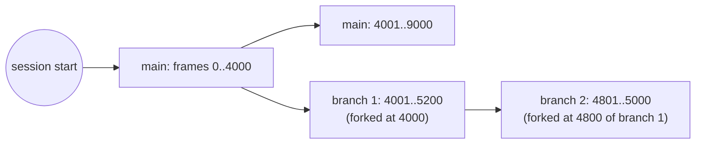
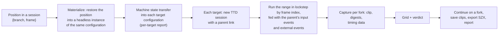

# Model what-if and branched history — design

**Status:** design, 2026-09-29. Tracking: [TODO.md](TODO.md).
**Builds on:** machine state transfer (landed: `6f5759f3`, `570ca3ce`, `7ddbef11`),
TTD v2 ([2026-09-25-ttd-v2-migration](../2026-09-25-ttd-v2-migration/)),
the model what-if scene in
[ttd-offline-analysis.md §6c](../2026-09-28-debugger-family/ttd-offline-analysis.md#6c-model-what-if-open-this-moment-on-other-machines)
(requirements OR-30 … OR-37) and a branched-history UI seen in another
emulator ([reference-branched-ttd-ui.md](reference-branched-ttd-ui.md)).

---

## 0. In one page

Two features share one idea: **recorded history is never rewritten; doing
something different creates a new line of history next to the old one.**

1. **Branches** (same machine). Seek into the past and press play: the recorded
   history replays, nothing changes. Press a key, poke memory, change a disk:
   a **branch** starts there, and the old future stays as another branch. Every
   branch can be revisited, compared and deleted. Nothing is ever truncated:
   discarding history is an explicit branch delete.
2. **Model what-if forks** (other machines). "Open this moment on 48K, 128K,
   +2A, Pentagon, Scorpion": each target gets the machine state of that moment
   through the machine state transfer, starts its **own** TTD session on its own
   model, and runs the recorded **input events** from the same frame numbers.
   The result is a grid of short clips side by side, with timing data and a
   verdict; the user can continue on any of them.

A branch lives **inside** one session (one configuration, one fingerprint). A
fork is a **new session** linked to its parent. That line is what keeps the
design inside TTD v2's rules: one session = one configuration; restore is exact
or it says it is not; replay never writes outside the session.

**Worked example.** A demo's border split tears on a 128K. The user pauses at
frame 4200, rewinds to frame 4100 (the part start), and asks for
*48K, 128K, +2A, Pentagon, Scorpion*. The report says: 48K refused (the part
pages bank 7 in); the other four fork. After 3 seconds of emulated time a grid
shows the four clips; Pentagon's is stable, the others tear; the timing overlay
shows the split code finishing 224 T-states later than the 128K line allows.
Verdict: "made for Pentagon timing". The user clicks *Continue on Pentagon*;
the live machine becomes the Pentagon fork, and its history lane hangs off
frame 4100 of the original session.

## 1. Terms

| Term | Meaning |
|---|---|
| **Session** | One TTD recording of one configuration (model, RAM, ROM set, devices, timing settings); identified by a UUID; has one configuration fingerprint (TTD v2 §5) |
| **Branch** | One line of history inside a session: a start (the fork point on its parent branch, or the session start for the trunk), and its own checkpoints, input events and external events after that point |
| **Trunk** | The first branch of a session (`main`) |
| **Fork point** | Where a branch leaves its parent: a frame boundary of the parent (§4.3) |
| **Position** | Branch + frame + T-state inside the frame. Frame numbers are shared along a lineage: frame 4100 on a branch forked at 4000 is 100 frames after the fork |
| **Lineage** | A branch and all its ancestors up to the trunk: the history that leads to it |
| **Divergence** | Anything that makes the future differ from the recorded one: an input event, a state edit from a tool (memory, registers, ports), a media or device change, a snapshot load, a configuration change |
| **Fork (model what-if)** | A new session on another configuration, started from a position of a parent session by the machine state transfer |
| **Family** | A session and the sessions forked from it (with their forks, recursively) |
| **Machine state transfer** | `MachineStateTransfer` (`core/src/loaders/snapshot/machinestatetransfer.h`): moves a running state into another instance in memory, with a per-item report |

## 2. Goals and non-goals

Goals:

- G-1 Never lose recorded history because the user acted in the past (branches).
- G-2 Open any recorded moment on other machine configurations and compare the
  results (forks), interactively and in batch.
- G-3 Stay within TTD v2: no requirement of v2 is weakened, every v2 structure
  used as designed, and v2 readers that know nothing of branches still read
  the trunk.
- G-4 Cost follows change: a branch costs only what differs from its parent.

Non-goals:

- **Merging branches.** Two machine states cannot be merged meaningfully;
  branches are compared (run diff, first divergence), not merged.
- **Exact replay across configurations.** A fork is a new recording, not a
  replay of the parent on another machine (TTD v2 FR-14: a session on a
  different configuration is for inspection only).
- **Moving SD / HDD / CD** into a fork: the transfer does not move them (by
  design, for now); a fork keeps its own.

## 3. Principles

| # | Principle | Consequence |
|---|---|---|
| P-1 | **History is immutable.** A recorded checkpoint, input event or external event is never changed or removed by acting in the past | branches instead of truncation; explicit delete only |
| P-2 | **One session, one configuration.** Every branch of a session has the session's fingerprint | a fork to another model is a new session with a parent link, never a branch |
| P-3 | **Exact or it says so** (TTD v2 principle 1) | seeking inside any branch is exact (FR-6); a fork's first frame is a transplant and carries the transfer report, never a claim of exactness |
| P-4 | **Forks run live; replays stay sealed.** A replay feeds recorded `IN` values (port-read journal) and writes nothing outside the session (FR-20). A fork runs its own machine, fed with the parent's **input events** (keys, joystick, mouse), not with its `IN` values | recorded port values would force every machine onto the original machine's path and hide the differences a what-if looks for |
| P-5 | **Cost follows change** (TTD v2 principle 2) | a branch shares its parent's pieces (reference counts); only its own changed pieces and blobs are stored |
| P-6 | **Media follow the history** | a branch's media state is part of its history; a fork gets its own copies (the transfer's in-memory copies) |

## 4. Branches

### 4.1 Model

The timeline becomes a tree:



```cpp
struct TTDBranchInfo {
    uint32_t    id;            // 0 = trunk; never reused inside a session
    uint32_t    parent;        // parent branch id (trunk: itself)
    uint64_t    forkFrame;     // last frame shared with the parent (checkpoint at its end boundary)
    uint64_t    firstFrame;    // forkFrame + 1
    uint64_t    endFrame;      // last recorded frame of this branch
    std::string name;          // "main" or an automatic name (§4.1.1); renamable; 1..32 characters
    std::string createdBy;     // what diverged: "input", "poke", "media: fdd.a", "snapshot load", "fork request"
    bool        pinned;        // excluded from budget eviction (§4.6)
};
```

- A branch stores **only its own** checkpoints, input events, external events,
  write journal and coverage blocks, for frames after its fork point. Frames up
  to the fork point belong to the ancestors.
- Pieces and device blobs are **shared through the existing reference counts**
  of the page store (TTD v2 §3, §4): the first checkpoint of a branch references
  the same pieces as the parent's fork checkpoint; XOR chains continue from them.
#### 4.1.1 Branch names

- **Automatic and pleasant to read**: every new branch gets a two-word name,
  an adjective and a noun from built-in lists, joined by a space, e.g.
  *amber falcon*, *quiet harbor*, *copper comet*. The lists avoid words that
  read badly together and keep every generated name at **20 characters or
  less**, so it fits a lane label. A name is never reused inside a session; when
  a pair is taken, the next one is drawn; after 1000 draws (the lists hold tens
  of thousands of pairs) a number is appended (*amber falcon 2*).
- The trunk is called **main**.
- **Renamable** at any time from every surface.
- **Limits of a user name**: **1 to 32 characters** (Unicode code points, stored
  as UTF-8), trimmed; no control characters or line breaks; unique inside the
  session, case-insensitive. A longer name is refused with the limit in the
  message, not cut silently. 32 keeps lane labels, status lines and file
  headers readable and fixed-bounded.
- The first-divergence toast shows the new name and what created it:
  *"branch amber falcon started at frame 910 (key press)"*; `createdBy` keeps
  the reason, so the name itself stays short.

- A **position** is `{branch, frame, T}`. Every existing API that takes a frame
  keeps working and means "on the active branch".

### 4.2 When a branch is created: on divergence

Taken from the reference UI (R-1), with one refinement:

| The user, positioned in the past (not at the end of the active branch)… | Result |
|---|---|
| seeks, scrubs, steps, plays forward or backward | **replay**: nothing is recorded, nothing changes; at the branch end, play continues live and recording appends to that branch |
| sends an **input event** (key, joystick, mouse) | a branch starts at the current frame boundary (§4.3); the event is its first input event |
| edits state from a tool: memory, registers, port write, breakpoint action that writes | same: branch, `createdBy` names the edit |
| changes media or devices: insert, eject, write-protect, GS personality, … | same |
| loads a snapshot, or asks for "fork here" explicitly | same |
| only focuses the screen or opens a view | **nothing** (the reference UI forks on focus; unreal-ng waits for the first real event, so looking around never creates empty branches) |

A divergence **at the end** of the active branch is ordinary live recording: no
branch.

**No truncation.** v1's `ResumeRecordingFrom(from)` deletes everything after
`from` because its timeline is a single line: there is nowhere to keep the old
future. With branches that reason is gone, and so is truncation:

- `ResumeRecordingFrom(from)` keeps its name and every route (WebAPI
  `POST /ttd/resume`, CLI, Lua, Python, MCP, the Qt widget, the ZX-Poly group,
  bookmarks) and now **starts a branch at `from`**; the response names it. What
  callers observe stays the same — the recording continues from `from`,
  positions and "end of recording" refer to the active branch — except that the
  old future is still there on another lane.
- Memory is not a reason to cut history: the budget handles it (§4.6), by
  spilling or releasing whole blocks.
- Throwing history away is explicit: **delete a branch** (with its
  descendants).
- **When recording stops, the machine free-runs.** Stopping TTD, or leaving the
  recorded range with recording off, never stops the emulator: it keeps
  running without history. Nothing in TTD is a hard stop for the machine.

### 4.3 Fork point: a frame boundary

TTD keeps one checkpoint per frame, at the frame boundary (v2 §9; Phase 0, Step 4 not
needed). A divergence in the middle of frame N therefore forks at the boundary
**before** it (the end of frame N−1, the checkpoint that starts frame N):

- the new branch's first frame is N, replayed up to the divergence point from
  the parent's recording (inputs before the divergence in that frame are
  copied into the branch), then the new event is applied;
- the parent keeps its own frame N and everything after it.

This keeps "a branch starts at a checkpoint" true, so a branch never needs a
checkpoint inside a frame and every seek stays the ordinary checkpoint +
in-frame replay.

### 4.4 Switching, playing, deleting

- **Switch** = seek to `{branch, frame}`: the ordinary restore (exact, v2
  FR-6), with the branch's lineage deciding which checkpoints apply.
- **Play forward** on a branch replays it to its end, then continues live on it
  (recording appends to that branch).
- **Play backward** (R-5): repeated frame seeks at the requested speed
  (`−1×`, `−2×`, `−4×`); audio muted or reversed per frame, video shown per
  frame. Needs no new engine: Phase 0, Step 2 measured seek p99 ≤ 3.5 ms, well inside a
  20 ms frame.
- **Rename, pin, delete.** Deleting a branch deletes its descendants (asked
  first) and releases their pieces. The trunk can be deleted only by
  **promoting** another branch: the promoted branch's lineage becomes the
  trunk.
- **Compare** two branches: run diff with the first divergence (roadmap 3.4,
  use-cases RE-7). Branches of one session share the configuration, so the
  comparison is exact frame by frame.

### 4.5 History across snapshot, tape and disk loads (R-6)

Today every snapshot, tape or disk load, ROM reload and media change calls
`InvalidateSession` and the history is gone. With branches and external events
(TTD v2 Phase 3: external-event markers are persisted) they become **events on the
timeline**:

- the load happens at a frame boundary (the emulator is paused; the load ends
  the current frame, whose checkpoint is taken first);
- an external-event marker records it; in-frame replay never crosses a marker
  (the rule already used for media events);
- the next checkpoint captures the new state like any other: pieces that
  changed are stored, the rest are shared;
- in the past, a load is a divergence (§4.2) and creates a branch.

Exceptions that still end the session, because they change the configuration
(P-2): a model switch, a RAM size change, a speed-multiplier or timing setting
change, a device-set change the registry cannot record (until FR-4 covers it).
A **model switch with state** becomes a fork (§5) instead: a new session linked
to the old one, so the lane continues visually on the other model.

### 4.6 Memory budget

**Owned by TTD v2** (Phases 4 / 5): the limit, the spill trigger and the spill
mechanism are decided there, not here. The direction below is the user's
(2026-09-29) and is recorded there too
([target-architecture.md §6.1](../2026-09-25-ttd-v2-migration/target-architecture.md#61-memory-as-linked-blocks-direction-2026-09-29)).

- **Everything is measured in memory, not in time.** History lives in a chain
  of **linked memory blocks**: the session starts with one block of **64 MB**
  and adds blocks as it grows, up to the configured limit. Budgets, eviction
  and status all count blocks and bytes; "the last N seconds" is not a unit
  anywhere (seconds per MB differ by an order of magnitude between an idle
  48K and a ZX-Evo with GS and MoonSound).
- **Branches live in the same blocks.** A branch's own pieces, blobs and
  checkpoints go into the current block like any other; nothing is reserved
  per branch.
- **At the limit**, blocks leave memory as whole units:
  - with **spill** (disk mode, or blocks backed by a memory-mapped file), the
    oldest block not needed by the active lineage's recent history goes to disk
    and comes back on demand — nothing is lost;
  - without spill, history is released: unpinned inactive branches first
    (least recently visited, whole branches, shared ancestors stay), then the
    oldest trunk frames (the session start moves forward, as v2 specifies);
    pinned branches and the active lineage's newest block are never released.
- The status line reports blocks in use / limit, and what was spilled or
  released ("2 branches released to stay within 512 MB").

### 4.7 Media per branch

Floppies and the tape change as the guest writes them. A branch must see the
media as its own history left them, not as another branch did:

- **TTD v1 / until the storage manager's journaled session layer (M7):** media
  writes are external events; switching to a branch whose lineage differs from
  the live media state in a written medium is reported **degraded** (FR-7)
  naming the medium, and the user may continue (the medium keeps the live
  state) or cancel. Branches without media writes are exact.
- **With M7** (TTD v2 TODO "Media"): the media session layer is journaled per
  frame; a branch's media state is part of its checkpoints; switching restores
  it exactly. No separate branch mechanism for media.

## 5. Model what-if forks

### 5.1 Flow



1. **Pick the position and the range**: the playhead or a marked range; the
   fork point is rounded to the frame boundary before it (as §4.3), so every
   target starts its own frame with its own timing.
2. **Pick the targets**: presets ("128K family", "Pentagons", "all creatable")
   or a list; each target is a model + RAM + options (timing variant, sound
   cards, Beta 128). The transfer's `FitSourceDevices` gives every target the
   source's sound cards unless the preset says otherwise.
3. **Materialize** the position without touching the live machine: a new
   headless instance of the **source** configuration receives the checkpoint
   (`TimeTravelManager::RestoreInto(position, EmulatorContext&)`, the
   ordinary exact restore aimed at another context). If the position is the
   live present, the live machine is the source directly (paused briefly, as
   `MachineStateTransfer::Transfer` already does).
4. **Transfer** into each target: `MachineStateTransfer::TransferToNewInstance`
   with `keepFramePositionWhenTimingMatches = false` (frame-boundary start). A
   target the state cannot move to is **refused** with the report's reason
   (OR-30); the others go on.
5. **Recording follows the parent.** If the parent is recording (a TTD
   session is running), each fork **starts its own recording**: a new session
   with a **parent link** (§5.3) and the transfer report attached, capturing from
   its first frame. If the parent is not recording, the forks are **free runs
   without TTD**: no session, no history, only the capture of step 7 (clips,
   digests, timing data) and the transfer report.
6. **Run** the range on every fork, **headless and in lockstep by frame
   index** (frame K of every fork runs before frame K+1 of any), fed with:
   - the parent lineage's **input events** from the fork point, by frame number
     (TTD v2 Phase 3 input journal; in memory today, in the file after O-1);
   - the parent's **external events** that are commands (tape play/stop, disk
     insert of the same copy, reset), at the same frame numbers.
   Frames differ in length between models, so frame index is the common clock;
   wall time per fork is reported next to it.
   **Beyond the range** (or the parent's recorded end) the forks do not stop:
   the recorded input ends and each fork runs on live — recording if it has a
   session (step 5), free-running otherwise. The grid closes the capture at the
   range end; a fork brought to the foreground (§5.4) takes live input from
   there.
7. **Capture** per fork (OR-32): a clip (video + audio), per-frame digests, and
   timing data — the frame budget of R-8 (interrupt acceptance, handler T, code
   T, HALT T, T until the interrupt), border and port-write events per line,
   late screen writes, frame overruns.
8. **Present and decide** (§6).

### 5.1.1 Where a fork starts: options

The user picks a moment; the question is at which instant each target machine
begins. The options, weighed for the what-if grid (comparing machines) and for a
single "continue on another model now":

| | A. **Frame boundary** before the moment | B. **Exact moment** when the frame geometry matches, else the frame boundary | C. **Next interrupt acknowledge** after the moment | D. **User-marked safe point** (a part start, a bookmark) |
|---|---|---|---|---|
| What each target gets | the state at the start of the frame that contains the moment; every target starts its own frame with its own INT position and contention | the instruction the user picked on targets whose frame length and INT window equal the source's; the frame start on the others | the state when the source takes its next interrupt; every target starts inside its handler's first instruction | the state at a position the user or a script marked |
| Fair comparison across the grid | **yes**: every fork begins at the same frame index and at its own frame start | **no**: some forks start mid-frame, others at the start; frame K means different things | yes, for interrupt-driven code | yes, if the mark is before the effect |
| Materialization cost | a checkpoint restore, **exact, no replay** (TTD keeps one checkpoint per frame) | checkpoint + in-frame replay to the T-state (exact, costlier; ≤ 1 frame) | checkpoint + replay to the acknowledge; unbounded if interrupts are off | a checkpoint restore |
| Timing honesty | **full**: no target runs a partial frame with the source's timing | a mid-frame start runs the rest of that frame on the target's contention and INT window from a state the source's timing produced; 128K → +2A share the geometry but not the contention, so the first frame mixes two machines — misleading exactly where a timing what-if looks | full from the handler on | full |
| Distance from the chosen moment | up to one frame earlier (≤ 20 ms); at 50 frames per second the user rarely sees the difference | none on matching targets | up to one frame later; **never**, if the program runs with interrupts off (loaders, border effects in DI) | whatever the mark says |
| Works on every program | yes | yes | **no** (DI code) | only where a mark exists |
| Fits TTD v2 | the checkpoint grid itself; no Phase 0, Step 4 | needs replay inside the frame (already how seeks work) | needs a search forward | a bookmark is a position (FR-6) |

**Decided 2026-09-29 (user): A for forks, for now** — to be revisited once forks
run and the grid shows how much the frame-boundary start matters. **A for forks** (the grid, batch mode, OR-30 … OR-36): the only
option that is fair, exact without replay, and valid for every program. **B
for a single live transfer** where the user wants the very instruction —
`switch_model` with state and `POST /snapshot/transfer`, whose default
(`keepFramePositionWhenTimingMatches = true`) already does this. C gives no
advantage over A for interrupt-driven code and fails on DI code; D is offered
as a convenience on top of A (fork from a bookmark), not as a mode.

### 5.2 What moves into a fork

Exactly what the machine state transfer moves, with its report per item:

| State | Rule (implemented) |
|---|---|
| CPU | copied; interrupt state, MEMPTR, Q |
| RAM and paging | pages the target can map; `#7FFD` / `#1FFD` / `#EFF7` replayed through the target's decoder; refused when the target cannot express them (pages it lacks, +3 all-RAM on a 128K, extended Pentagon / Scorpion paging on another family, ATM / Profi / TSConf elsewhere, ZX-Poly) |
| Time axis | the target takes the source's `t_states` / frame counter, so controllers with absolute time stamps stay in phase |
| Sound cards | TurboSound / TSFM, Covox, GS / NeoGS (RAM + flash), MoonSound (wave SRAM) |
| Floppies, tape | the target's own in-memory copies, clean, standing for a postfixed file (`game.pentagon-1a2b3c4d.trd`); their controllers (WD1793, uPD765, tape deck) follow |
| SD / HDD / CD | **not moved** (by design, for now): the fork keeps its own; the report says so |
| Model-specific paging state | same model only (clone) |

### 5.3 Session family: the parent link

Only forks that record (§5.1 step 5) have a session and therefore a parent
link; a free-running fork carries its origin (parent session, position,
transfer report) in the instance's status only.

A fork's session header records where it came from:

```
parent_session_uuid   UUID of the parent session
parent_branch         branch id in the parent
parent_frame          fork frame (boundary)
parent_fingerprint    the parent's configuration fingerprint
transfer_report       the machine state transfer report (items, statuses)
fork_request          targets, range, input source, presets
```

In the TTD v2 container this is a new **skippable stream** (§8): a v2 reader
that does not know it opens the fork as an ordinary session starting at its
first frame. The UI uses the link to draw the fork as a lane hanging off the
parent's fork point, with the model as a badge (§7).

### 5.4 Continue on a fork (OR-35)

"Continue on Pentagon" makes the fork the live machine:

- its instance becomes the foreground instance (the Qt window re-binds, as
  `switch_model` already does);
- its session is the active session; the parent session stays open read-only
  in the family (or is closed and kept on disk, by the budget);
- the history panel shows the family: the parent's lanes, the fork's lanes
  starting at the fork point, colored by model.

This is also what a **model switch with state** becomes (§4.5): `switch_model`
gains `keep_state: true`, implemented as fork + continue with one target.

### 5.5 Batch mode (OR-36)

The same flow without UI: entries × targets → per entry a directory with the
clips, the timing data, the reports and a verdict JSON. It runs on the
headless test client or in CI; the compo check (X10-26) is a preset on top.

## 6. Grid and verdict (outline)

Full design comes with the workbench (O-35); what this design fixes now:

- **One playhead, frame index.** All clips play in lockstep by frame index;
  wipe, side-by-side and difference views against the original.
- **Overlays per clip:** beam position, border split lines, late screen writes,
  the frame budget bar (R-8), events per line.
- **Scores** (each explained, none hidden): picture stability in the changing
  areas (frame-to-frame difference where the original is stable), late screen
  writes, frame overruns, interrupt handler length vs frame, music tempo (AY
  register write rate), and target-machine metadata from ZX-meta-db when known.
- **Verdict:** the best-matching targets with the reasons; ties are reported as
  ties.

## 7. User interface

History panel, extended from today's `TtdWidget` with R-1 … R-5:

```
⏮ ⏪ ◀| ▶ |▶ ⏭   Speed [ -1× ▾ ]   Fork to models…  Branches ▾
 0s        5s        10s       15s       20s
 main      ━━━━━━━━━━━━━━━━━━━━━┳━━━━━━━━━━━━━━━━━━━━━━━  (inactive: dim)
 branch 1                       ┗━━━━━━━━━┳━━━━  (active: bright)   ▼ playhead
 branch 2                                 ┗━━
 ⎇ PENTAGON (fork)              ┗━━━━━━━  [badge: model]
 position 18.2 s · frame 910 · −3.1 s to branch end · 1299 frames · 9.9 MB
```

- One lane per branch; the active lane bright, others dim; a tick where a
  branch leaves its parent; the name at the lane's end; click a lane to switch.
- Forks of the family as lanes with a model badge, under their fork point.
- Status: position (seconds **and** frame), distance to the branch end (tells
  whether *play* replays or records), frames stored, memory used and budget.
- A small "recording" / "replaying" indicator; the first input in the past
  shows a one-line toast: *"branch 3 started at frame 910 (key press)"*.
- Speed box with negative speeds for reverse playback.
- Branch menu: rename, pin, delete (with descendants), promote to trunk,
  compare with…, export (SZX of the current position, clip of a range).
- Registers panel: changed values highlighted after each step or seek (R-7).

## 8. Relation to TTD v2

| TTD v2 element | What branches and forks need | Fits? |
|---|---|---|
| One checkpoint per frame at the boundary (§9) | fork points at frame boundaries (§4.3) | yes, unchanged |
| Page store, 4 KB pieces, reference counts (§3) | branches share pieces by reference | yes, as designed |
| Per-piece chain cap (Phase 1) | a branch's pieces continue the parent's chains; the cap is per piece | yes |
| Copy-on-write reference blocks (Phase 1) | a branch's first checkpoint shares the parent's blocks | yes, that is what COW is for |
| Device blobs shared when unchanged (Phase 2) | a branch starts by sharing the fork checkpoint's blobs | yes |
| Restore report / degraded (FR-7) | media not branch-aware before M7 (§4.7); fork = transfer report | yes, used as designed |
| Configuration fingerprint (Phase 3, FR-14) | one per session; forks are new sessions (P-2) | yes; nothing replays across configurations |
| Input journal and external events persisted (Phase 3, O-1) | per branch; forks read the parent's | yes; O-1 becomes a prerequisite of forks from saved sessions |
| Replay isolation (FR-20, FR-21) | switching branches is a seek = replay; forks run live on their own copies (P-4) | yes |
| Memory budget (Phase 4, FR-15) | branch-aware eviction (§4.6) | memory counted in linked blocks (64 MB, up to the limit), spill or release by whole blocks; v2 ring behavior kept for the trunk |
| Container v2 (Phase 5): chunks with stream ids, readers skip unknown streams | branch table and non-trunk branch data as **new skippable streams**; the parent link as a skippable header stream | yes: a reader without branch support reads the trunk only |
| `ResumeRecordingFrom` (FR-8, QR-8, FR-24) | same routes; starts a branch instead of truncating; nothing recorded is lost | yes: every route kept, the only change is that history is no longer deleted |

Nothing in Phases 1–4 changes (TTD v2 requirements FR-22 … FR-24 record what must
stay possible). Phase 5 reserves the stream ids below; branches can ship
**in memory** before Phase 5 (a save before Phase 5 writes the active lineage as a linear
session and says so).

Proposed stream ids (from the reserved 9+ range, allocated in the one id table):

| Stream | Content |
|---|---|
| 10 | branch table (`TTDBranchInfo` per branch) |
| 11 | checkpoints of non-trunk branches (chunk payload starts with the branch id) |
| 12 | input and external events of non-trunk branches |
| 13 | session family: the parent link of §5.3 |

Pieces stay in stream 0 for every branch (they are shared).

## 9. Automation surfaces

Parity rule: every action on CLI, WebAPI + OpenAPI, MCP, Lua, Python and Qt.

| Action | WebAPI (under `/api/v1/emulator/{id}/ttd`) | MCP `time_travel` action |
|---|---|---|
| List branches | `GET /branches` | `branches` |
| Switch branch | `POST /seek` with `branch` | `seek` + `branch` |
| Fork explicitly | `POST /branches` `{from, name}` | `branch_create` |
| Rename / pin / delete / promote | `PATCH` / `DELETE /branches/{bid}` | `branch_update`, `branch_delete` |
| Resume from a position | `POST /resume` (starts a branch; the response names it) | `resume` |
| Compare two branches | `GET /diff?a=&b=` (first divergence) | `diff` |
| Fork to models | `POST /whatif` `{position, targets[], range, capture}` | `whatif` |
| Fork status, report, clips | `GET /whatif/{jobId}` | `whatif_status` |
| Continue on a fork | `POST /whatif/{jobId}/continue` `{target}` | `whatif_continue` |
| Model switch with state | `POST /api/v1/emulator/{id}/model` `{keep_state: true}` | `emulator_manage` `switch_model` + `keep_state` |

Existing: `POST /api/v1/emulator/{id}/snapshot/transfer` and MCP
`transfer_state` (the transfer on its own, between live instances).

## 10. Requirements

MUST unless marked. Traced to OR-30 … OR-37 where they already exist.

| Id | Requirement |
|---|---|
| WI-1 | Acting in the past never deletes recorded history; only an explicit branch delete does. There is no truncating mode |
| WI-2 | A branch starts at the frame boundary before the first divergence; replay alone never creates a branch |
| WI-3 | Seeking to any position of any branch is exact (TTD v2 FR-6), or reported degraded with the reason (media before M7) |
| WI-4 | A branch stores only what differs from its parent (shared pieces and blobs); a branch that changes nothing costs ≤ 64 B per frame (v2 PR-10) |
| WI-5 | Branch operations: list, switch, rename, pin, delete with descendants, promote to trunk, compare |
| WI-6 | Snapshot, tape and disk loads and media changes during recording are timeline events, not the end of the session; configuration changes still end it (or fork, §4.5) |
| WI-7 | Branch-aware memory budget (§4.6), reported on every surface |
| WI-8 | Forks: position + targets → per-target transfer report; refused targets named with the reason (OR-30) |
| WI-9 | Forks run headless, in lockstep by frame index, fed with the parent's input and command events (OR-31); never with recorded `IN` values |
| WI-10 | Every fork is its own session with a parent link (§5.3) |
| WI-11 | Forks never write the parent's media or files: floppies and tape are copies with postfixed paths; SD / HDD / CD are not moved (OR-37) |
| WI-12 | Capture per fork: clip, digests, timing data (OR-32) |
| WI-13 (SHOULD) | Grid, scores and verdict (OR-33, OR-34); batch mode (OR-36) |
| WI-14 (SHOULD) | Continue on a fork; model switch with state = fork + continue (OR-35) |
| WI-15 | A reader without branch support opens a branched session file and reads the trunk (skippable streams) |
| WI-16 (SHOULD) | Reverse playback at −1×, −2×, −4× |
| WI-17 | All actions on every automation surface (§9) |

## 11. Phases

| Phase | Content | Depends on | Size |
|---|---|---|---|
| **W0** | Machine state transfer; WebAPI + MCP; floppies and tape; invariant tests over every model | — | **done** (`6f5759f3`, `570ca3ce`, `7ddbef11`) |
| W0b | Transfer on CLI, Lua, Python, Qt (parity) | W0 | S |
| **W1** | In-memory branches: timeline tree, divergence rule, switch / rename / delete / pin / promote, `resume` starts a branch, history lanes, distance-to-end, reverse playback; save writes the active lineage | TTD Phase 1 (the timeline code is rewritten there anyway) | M |
| W2 | History across loads (§4.5) | TTD Phase 3 external events | S-M |
| **W3** | Forks: `RestoreInto`, fork runner (headless, lockstep by frame), input and command events from the parent, parent link, per-target report; `switch_model` with state | W1, O-1 (saved sessions) | M |
| W4 | Capture, grid, scores, verdict; batch mode | W3, workbench time / Beam Lab panels | L |
| W5 | Branches and family in the v2 container (streams 10-13) | TTD Phase 5 | S |
| W6 | Media per branch exact | storage manager M7 | S (on top of M7) |

W1 and W3 are the user-visible core; W0b can go any time.

## 12. Decisions

Settled 2026-09-29 (user):

- **Branch names** (§4.1.1): automatic two-word names, renamable, 1-32
  characters.
- **No truncation** (§4.2): `resume` starts a branch on every route; history is
  discarded only by deleting a branch; stopping TTD leaves the machine
  free-running.
- **Recording and input beyond the range** (§5.1 steps 5-6): a fork records
  only when the parent records (new session with a parent link), otherwise it
  is a free run without TTD; beyond the range every fork runs on live.
- **Fork start** (§5.1.1): the frame boundary for forks, for now; revisit later.
  A single live transfer keeps its exact-moment default.

No open decisions remain in this design. The memory limit and spill (§4.6)
belong to TTD v2 ([migration-trajectory.md §6](../2026-09-25-ttd-v2-migration/migration-trajectory.md#6-open-decisions-for-the-user),
item 3).
