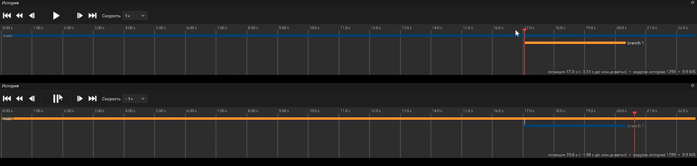
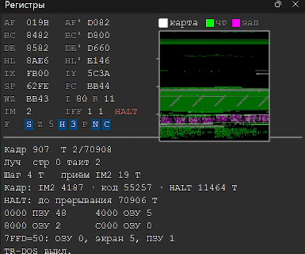
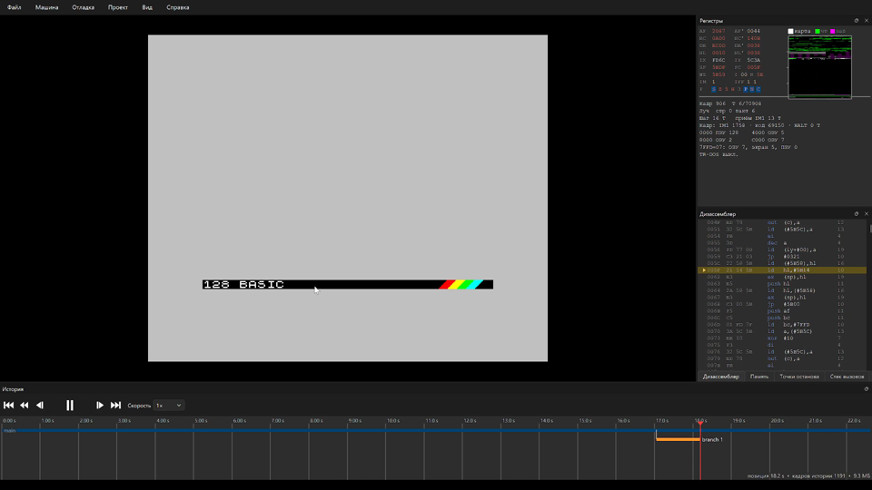

# Reference: a branched time-travel UI seen in another emulator

A 37-second screen recording (1920x1080, 2026-09-29) of an unnamed ZX Spectrum
emulator with a Russian UI that already implements **branched history**: going
back in time and doing something different keeps the old future as a second
branch instead of deleting it. This document records what the recording shows,
frame by frame, and what unreal-ng takes from it. The design that adopts it is
[design.md](design.md).

The recording itself is not in the repository; three frames are in
[reference/](reference/).

---

## 1. What the recording shows

| Time | What happens |
|---|---|
| 0-4 s | 128K menu. The *History* panel at the bottom shows one orange lane, `main`, growing as the machine runs. Status line: `позиция 14.2 s · кадров истории 709 · 3.4 МБ` (position, frames of history, memory used) |
| 4-5 s | A snapshot (`diesirae.sna`) is opened; a toast says so. **The history does not restart**: the `main` lane keeps growing through the load (907 frames, 4.6 MB) |
| 9-10 s | Seek back on the timeline to 18.9 s. The status line adds `−3.75 s до конца ветки` ("3.75 s before the end of the branch"). Registers that differ from the previous view are drawn in red |
| 11 s | Seek further back to 17.0 s, before the snapshot load: the 128K menu is on screen again |
| 12 s | The user clicks the screen (`щёлкните для ввода`, "click for input"). **A branch is created at once**, still paused: `main` turns blue (inactive), a new lane `branch 1` starts at 17.0 s with zero length. No frames were added yet (1133 before and after) |
| 13-16 s | Play. The user picks *128 BASIC* and types `fgfhfh`. `branch 1` grows in orange; history reaches 1299 frames, 9.9 MB |
| 17-20 s | Scrubbing inside `branch 1`, back to its fork point and forward again |
| 21-23 s | A click on the `main` lane: `main` is active (orange) again, `branch 1` is kept (blue). The screen shows the demo from the old future. Both histories are intact |
| 24-31 s | Speed `−1×`: **playback in reverse** at normal speed with a play/pause toggle, on `main`, across the demo |
| 32-37 s | Pause, step, play forward at `1×` again; switching lanes and positions keeps working |



The other panels, visible throughout:

- **Registers** with changed values in red, and a flags row as boxes.
- **Memory activity map** next to the registers: a 64 KB strip with three
  overlays toggled by checkboxes — `карта` (map), `чт` (read, green),
  `зап` (write, magenta).
- **Frame and beam line** under the registers:

  

  ```
  Кадр 907  T 2/70908                     frame 907, T-state 2 of 70908
  Луч  стр 0 такт 2                       beam: line 0, T-state in line 2
  Шаг 4 T   приём IM2 19 T                last step 4 T; IM2 acceptance 19 T
  Кадр: IM2 4187 · код 55257 · HALT 11464 T   frame budget: handler / code / HALT
  HALT: до прерывания 70906 T             HALT: 70906 T until the interrupt
  0000 ПЗУ 48   4000 ОЗУ 5                memory map per 16 KB window
  8000 ОЗУ 2    C000 ОЗУ 0
  7FFD=50: ОЗУ 0, экран 5, ПЗУ 1          #7FFD decoded
  TR-DOS выкл.                            TR-DOS off
  ```

- **Disassembler** with a T-state column (`12/7` for taken / not taken) and the
  RAM bank of the target address (`ОЗУ 2`).
- **Transport**: to start, fast back, step back, play/pause, step forward, to
  end, and a speed box that goes negative.



## 2. How it seems to work

What can be deduced from the behavior (the source is not available):

1. **History is read-only until you touch it.** Seeking into the past and
   pressing play *replays* the recorded history (the frame count does not
   grow). A branch is created only when the user **diverges**: here, by taking
   input focus in the past. Presumably any input, state edit or media change
   does the same.
2. **A branch is created lazily and empty.** It appears at the fork point with
   zero length and grows only when frames run on it.
3. **Every branch is kept.** Switching is a click on its lane; nothing is
   truncated and nothing is merged.
4. **A snapshot load is part of history**, not the end of it: the timeline runs
   straight through the load, and seeking before it shows the machine as it
   was.
5. **Status speaks in time, not frames**: position in seconds, and how far the
   playhead is from the end of the current branch; plus the total number of
   stored frames and the memory they take (about 7.5 KB per frame here).

## 3. What unreal-ng takes from it

| # | Idea | Where it goes | Why |
|---|---|---|---|
| R-1 | **Fork on divergence, not on resume**: replaying the past is free and changes nothing; the first input, state edit or media change in the past creates a branch | [design.md](design.md) §4.2 | removes the destructive "resume from here truncates the future" (use-cases L5) without adding a mode the user must choose |
| R-2 | **Branches as lanes**: one lane per branch under the time ruler, active lane highlighted, fork tick at the parent, label at the lane end, click to switch | design §7; [workbench-framework.md](../2026-09-28-debugger-family/workbench-framework.md) `time` panel | the whole tree is visible at a glance |
| R-3 | **Distance to the branch end** in the status line, next to the position | design §7 | tells the user whether "play" will replay or record |
| R-4 | **History and memory totals** in the status line (frames stored, MB) | design §7; TTD v2 FR-16 already requires accurate memory reporting | the cost of keeping branches is visible |
| R-5 | **Reverse playback at speed** (`−1×`, and faster), not only reverse step | design §7; [roadmap.md](../2026-09-28-debugger-family/roadmap.md) 3.4 | watching an effect run backwards finds where it breaks; seeks are fast enough (V0b: seek p99 ≤ 3.5 ms) |
| R-6 | **History survives snapshot, tape and disk loads**: the load is an event on the timeline, not the end of the session | design §4.5 | today every such load calls `InvalidateSession`; the recording shows the better behavior |
| R-7 | **Changed registers in a contrasting color** after a step or seek | [use-cases.md](../2026-09-28-debugger-family/use-cases.md) debugger core | cheap, and the eye goes to what changed |
| R-8 | **Frame budget line**: interrupt acceptance time, handler T, code T, HALT T, T until the interrupt | use-cases (frame budget, [2026-09-15-frame-budget-triage](../2026-09-15-frame-budget-triage/)) | exactly the numbers the model what-if verdict needs (design §6) |
| R-9 | **Memory activity map** with map / read / write overlays for the current frame | use-cases (memory views) | shows where the program works without opening a memory view |
| R-10 | **Disassembler T-state column with taken / not-taken and the bank of the target** | use-cases (Code workspace; proposition already lists a T-state column) | confirms the direction; the bank tag is new |

Not taken:

- **Branch creation on input focus alone.** A click to focus the screen is not
  yet a divergence; unreal-ng creates the branch at the first *input event*
  (design §4.2), so looking around in the past never creates empty branches.
- **Time in seconds only.** unreal-ng keeps frames and T-states next to
  seconds: frame lengths differ between models, and the model what-if compares
  machines by frame index.
