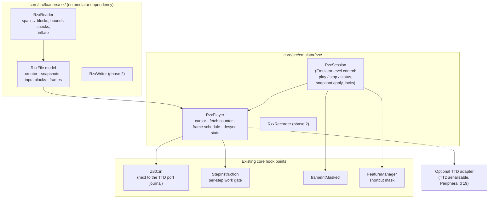
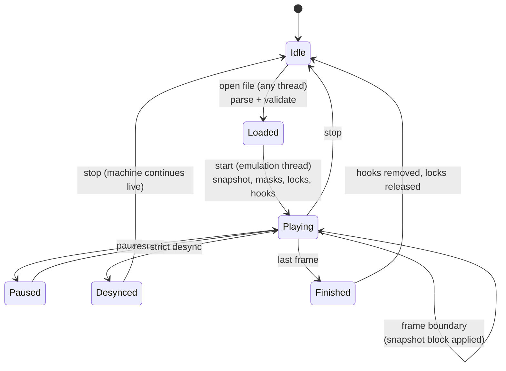

# RZX replay integration: design

- **Date:** 2026-09-29
- **Status:** R0-R3 (playback) implemented 2026-09-29; what differs from the plan below is in [As built](#18-as-built-r0-r2). R4 (recording) is being done separately; R5 (TTD interop) is a possible later, low-priority phase. Requirements: [requirements.md](requirements.md).
- **Code base:** master at `15e711a6` (with the TTD port journals). Line
  numbers below were checked on that commit.
- **Related:** [ttd-port-read-journal.md](../../emulator/design/debugger/time-travel-debug/ttd-port-read-journal.md)
  (the `IN` override TTD already has), [SZX design](../2026-09-29-szx-snapshots/design.md)
  (start snapshots beyond 48K / 128K), the research article
  `docs/inprogress/2026-09-28-debugger-family/rzx-ttd.md` (not yet in master).

> **In one line.** An autonomous RZX module (format + player) plugged into
> three existing hook points — the `IN` path next to the TTD port journal, the
> per-step work gate TTD's input journal already uses, and the existing
> frame-interrupt mask — so that with no RZX active nothing new runs, and with
> one active only a few integer operations per instruction are added.

## Contents

- [1. Answers to the three questions](#1-answers-to-the-three-questions)
- [2. How the core runs today (the relevant parts)](#2-how-the-core-runs-today-the-relevant-parts)
- [3. Module layout](#3-module-layout)
- [4. Hook 1: `IN` substitution](#4-hook-1-in-substitution)
- [5. Hook 2: fetch counting and the interrupt schedule](#5-hook-2-fetch-counting-and-the-interrupt-schedule)
- [6. Frames: RZX frames are interrupt intervals, video frames stay fixed](#6-frames-rzx-frames-are-interrupt-intervals-video-frames-stay-fixed)
- [7. Snapshots, model and machine support](#7-snapshots-model-and-machine-support)
- [8. Shortcuts and live input](#8-shortcuts-and-live-input)
- [9. Desync detection and conventions](#9-desync-detection-and-conventions)
- [10. Lifecycle and threading](#10-lifecycle-and-threading)
- [11. TTD: what is reused, what stays separate](#11-ttd-what-is-reused-what-stays-separate)
- [12. Recording (phase 2)](#12-recording-phase-2)
- [13. Surfaces](#13-surfaces)
- [14. Cost analysis](#14-cost-analysis)
- [15. Tests](#15-tests)
- [16. Phases](#16-phases)
- [17. Decisions](#17-decisions)
- [18. As built (R0-R2)](#18-as-built-r0-r2)

---

## 1. Answers to the three questions

| Question | Answer |
|---|---|
| **Only a loader, or run-time mechanisms?** | Run-time mechanisms are required: `IN` substitution, fetch counting, a forced interrupt schedule and desync detection (requirements §1). The loader part is the file parser plus the start-snapshot load. |
| **Zero cost when not used; small when used?** | Yes. `IN` substitution sits next to the TTD port-journal test that already exists (one predictable pointer test per `IN`, the same kind TTD pays, and only if it cannot share that test — §4). The per-instruction work runs only behind the **existing** per-step work gate that TTD's input journal uses (one relaxed load per step, already paid today), so it adds nothing when off (§5). The frame interrupt is suppressed with the **existing** `frameIntMasked` flag. Nothing touches `m1_cycle`, the memory-interface tables, frame length, sound or video. |
| **Reuse TTD or stay autonomous?** | **Autonomous module, shared hooks.** The RZX format and player do not depend on the TTD manager. They reuse the core's hook *points* that TTD introduced (the `IN` interception point, the per-step work gate, the acceleration lock pattern, the device-state serialization interface) and the machine's frame-interrupt mask. TTD interop is an optional adapter: TTD can record while an RZX plays, and its port journal then stores the RZX-fed values (§11). |

## 2. How the core runs today (the relevant parts)

| Part | Where (master `15e711a6`) | Relevance |
|---|---|---|
| Every `IN` form calls `Z80::in` | `IN A,(n)` `op_noprefix.cpp:1322-1334`; `IN r,(C)` / `IN (C)` / `INI` / `IND` / `INIR` / `INDR` in `op_ed.cpp` | a single interception point |
| `Z80::in` → `inFromBus` → TTD port journal `OnRead(port, value, …)` | `z80.cpp:841-858`; `inFromBus` `:862-946` | the TTD journal already replaces `IN` values in Play mode while the device still reads |
| R increments | `m1_cycle` `z80.cpp:732` (all prefixes, `HALT` re-fetch, block repeats); interrupt acknowledge `:1300`; NMI acknowledge `:1145`; `LD R,A` `op_ed.cpp:271-276` | fetch count derivable from R |
| Per-step loop | `Z80::StepInstruction` `z80.cpp:585-622`: `ttdInputWork` gate → `ServiceInput`, then `ProcessInterrupts`, then `Z80Step`; used by the frame loop `Z80FrameCycle` (`:660-684`) **and** by `Emulator::ExecuteStep` (debug stepping, every `Run*`, TTD seeks) | the place where both drivers meet |
| Frame interrupt | `ProcessInterrupts` `z80.cpp:1094-1256`; ULA pulse gated by `!frameIntMasked` (`:1220`, and `BeginFrame` `:581`) | suppression exists (used by ZX-Poly) |
| Frame length | fixed `config.frame`; `AdjustFrameCounters` rebases only at the full frame (`core.cpp:971-1001`); screen, sound (`blip_end_frame`), tape and FDC clocks, TTD time all assume it | frames must stay fixed-length |
| Existing single-owner hooks | `portInterceptor` (ZX-Poly), `interruptSource` (TSConf, Sprinter) | not to be reused |

## 3. Module layout



| Component | Responsibility |
|---|---|
| `RzxReader` / `RzxFile` | parse and hold the file; pure, unit-testable; no emulator headers |
| `RzxPlayer` | the playback state machine used on the emulation thread: current block and frame, `IN` cursor, fetch counter, frame target, statistics; exposes `OnIn()` and `OnStep()` |
| `RzxSession` | owned by `Emulator`: validates the file against the machine, loads snapshots, installs and removes the hooks, applies the locks, queues commands from other threads, publishes notifications |
| TTD adapter | makes the player's state part of TTD checkpoints (phase 3) |

## 4. Hook 1: `IN` substitution

Placement in `Z80::in`, **between** the bus read and the TTD port journal:

```text
value = inFromBus(port)                     // devices see the read, as today
if (ctx->rzxPlayer) [[unlikely]]            // new: RZX substitution
    value = ctx->rzxPlayer->OnIn(port, value)
if (ctx->ttdPortReads) [[unlikely]]         // existing: TTD records / replays
    value = ctx->ttdPortReads->OnRead(port, value, …)
return value
```

- **Devices still read**, as in the TTD journal: several reads have side
  effects the machine depends on (Scorpion turbo strobe, ZX-Evo TR-DOS
  emulation trap, tape auto-start, WD1793 / uPD765 / IDE / RTC / SD / GS
  state). Only the value the CPU gets is replaced.
- **Order:** RZX below TTD, so a TTD recording during playback stores the
  RZX-fed values, and a TTD replay reproduces them.
- `OnIn` returns the next value of the frame (repeat frames share the previous
  list); past the end of the list it returns the last value (or `0xFF`) and
  records a desync.
- **Cost when off:** one predictable pointer test per `IN`, the same kind as
  the TTD journal's (`IN` is a small fraction of instructions). If the A/B
  benchmark shows any difference, fold both tests into one "port hooks"
  pointer that is non-null only when either is active ([§17](#17-open-decisions)).

## 5. Hook 2: fetch counting and the interrupt schedule

**Where:** `StepInstruction` already begins with a relaxed load of the
per-step work gate (`ttdInputWork`) that TTD's input journal uses. The gate
becomes a small bit set (TTD input work, RZX active); with no RZX, the loaded
value and the branch are exactly as today. With RZX active, the step runs
through `RzxPlayer::OnStep` around the normal step:

```text
if (stepWork) [[unlikely]] {
    if (stepWork & TTD_INPUT) ServiceInput()           // unchanged
    if (stepWork & RZX) {
        if (player.FrameDue())                         // fetches ≥ frame target
            if (player.StartNextFrame())               // desync check, advance, snapshot blocks
                if (iff1 && policyAllowsInt())
                    { HandleINT(0xFF); return step; }  // the interrupt is this step
        r0 = R
        …normal step…
        player.CountFetches(R − r0, stepResult)        // mod 128; −1 if INT/NMI accepted; LD R,A → +2
        return step
    }
}
…normal step, unchanged…
```

- **Fetch counter derived from R** (the Fuse / SkoolKit approach): R already
  increments on every opcode and prefix fetch, block repeat and `HALT` cycle
  (`m1_cycle`); the per-step delta (mod 128) is the fetch count of the step.
  Corrections: minus 1 when the step accepted an interrupt or NMI (the
  acknowledge increments R but is excluded by the specification); `LD R,A`
  overwrites R, so that step counts its 2 fetches directly. **`m1_cycle` is
  not touched.**
- **Frame interrupt:** during playback `frameIntMasked = true` (the existing
  flag ZX-Poly uses), so the machine's ULA interrupt never fires; the only
  maskable interrupt is the one the player forces at the recorded count.
- **Both drivers covered:** the frame loop and `Emulator::ExecuteStep` (debug
  stepping, `Run*`, TTD seeks) both go through `StepInstruction`.
- **Machines with their own interrupt source** (`interruptSource`: TSConf,
  Sprinter) are refused in v1.

## 6. Frames: RZX frames are interrupt intervals, video frames stay fixed

- Screen, sound, tape and FDC clocks and TTD time all assume a fixed
  `config.frame`; `AdjustFrameCounters` does not rebase a short frame.
  Variable-length frames would touch all of them.
- **Decision:** the emulated (video) frame keeps its fixed length. An RZX
  frame is the interval between forced interrupts, measured in fetches,
  independent of the video frame.
- When our timing matches the recording emulator's, the forced interrupt lands
  in the normal interrupt window. When it does not (another emulator's
  contention or frame length), the interrupt drifts against the raster: the
  CPU path stays exact; only the picture timing differs. A video frame may
  then contain 0 or 2 interrupts. The player reports the drift (T-states
  between the forced interrupt and the machine's natural interrupt position)
  as a statistic.
- Later, optionally: a "re-anchor" mode that moves the video frame to the RZX
  frame, once per-frame lengths are supported by sound, screen and TTD.

## 7. Snapshots, model and machine support

- **First snapshot:** through the existing loaders. They are file-bound today:
  v1 writes an embedded snapshot to a temporary file in the session's scratch
  area and loads it; the proper fix is span-based loaders (the tape loader's
  `Load(span, name)` pattern; the SZX design's reader is span-based from the
  start). SZX start snapshots need #64.
- **Snapshot blocks mid-stream** (multiload, rollback points): applied at the
  RZX frame boundary on the emulation thread through an **internal apply
  path** that does not invalidate a TTD session, does not pause, and does not
  reset the playback; then `RestartFrame()`.
- **Model:** snapshot loading never switches the model; `ModelSwitch` builds a
  new `Emulator` instance. `RzxSession` checks the snapshot's machine against
  the running model; on a mismatch it asks the caller (default: switch, then
  start playback on the new instance). Mid-stream snapshots of another model
  stop playback with a message.
- **Machines:** v1 supports the models whose snapshots we load and whose
  interrupt is the ULA frame interrupt: 48K, 128K, +2, +2A, +3, Pentagon 128 /
  512 / 1024, Scorpion. Others are refused with the reason.

## 8. Shortcuts and live input

While playing (and recording):

| Item | Action | Where |
|---|---|---|
| Fast tape trap (`LD-BYTES`) | off | `FeatureManager` shortcut mask: extend the TTD "timeline bound" predicate with "RZX active" (`fasttape`, `turbotape`, `fastdisk` forced off) |
| Fast disk trap (`#3FEC`) | off | same |
| Turbo tape | off | same |
| Disk autostart RUN rewrite (`z80.cpp:355`) | disarmed explicitly | not feature-gated today |
| Command typer, keyboard and mouse injection | refused | like TTD's `OwnsInput()` |
| Live input (`SubmitLiveInput`) | refused with a reason | same pattern |
| Turbo mode, host speed | allowed | frames are fetch-driven; pacing does not change the CPU path |
| Breakpoints, stepping, analyzers | allowed | they observe; stepping goes through the same `StepInstruction` path |
| TR-DOS ROM paging | kept | real hardware behavior |

## 9. Desync detection and conventions

| Check | When | Strict | Tolerant |
|---|---|---|---|
| More `IN`s than recorded in the frame | at the extra `IN` | stop, report | return the last value, count |
| Fewer `IN`s than recorded | at the frame end | stop, report | count, continue |
| Fetch overrun beyond a small tolerance (the `EI` short-frame case) | at the frame end | stop, report | count |

Each report carries: block, frame, expected and actual counts, PC, and the
T-state. The first desync is kept for diagnostics (as the TTD journal keeps
its first mismatch).

**Conventions (options):**

| Option | Default | Reason |
|---|---|---|
| Interrupt at every frame start, even right after `EI`; or honor a short frame after `EI` as "interrupt blocked" | accept (SkoolKit default), with the short-frame rule selectable | files disagree; SkoolKit documents both |
| NMOS `LD A,I` / `LD A,R` parity quirk on interrupt | on (as today); off for files that need it | `HandleINT` applies it unconditionally today (`z80.cpp:1295`): becomes a flag read only in the RZX interrupt path |
| Ignore later snapshot blocks | off | some Fuse files need it |

## 10. Lifecycle and threading



- Parsing and validation may run on any thread; installing hooks, applying
  snapshots and removing hooks happen on the emulation thread (commands are
  queued, like live input).
- On stop, finish or desync: hooks removed, `frameIntMasked` restored, locks
  released, the machine continues live from the reached state.

## 11. TTD: what is reused, what stays separate

| Reused from the core (introduced by TTD) | How |
|---|---|
| The `IN` interception point in `Z80::in` | RZX substitution placed next to the TTD port journal (§4) |
| The per-step work gate in `StepInstruction` | one more bit for RZX (§5) |
| The acceleration lock pattern and the `FeatureManager` shortcut mask | extended with "RZX active" (§8) |
| The input ownership pattern (`OwnsInput`) | the same refusal while playing |
| `TTDSerializable` + `PeripheralId` | the player's state becomes a TTD device blob (phase 3) |

| Kept separate | Why |
|---|---|
| RZX format and player | no dependency on `TimeTravelManager`; RZX works with TTD disabled; each is testable alone |
| TTD port journal vs RZX `IN` list | different framing (TTD: time-stamped records; RZX: per interrupt frame by fetch count); a common base would couple two formats with different purposes |

**Interop (phase 3):**

- **TTD while playing:** TTD records the RZX-fed `IN` values in its port
  journal; the player's position (block, frame, `IN` cursor, fetch counter) is
  a TTD device blob, so a TTD seek restores it and the forced-interrupt
  schedule continues correctly; mid-stream snapshot blocks become TTD
  checkpoints (or journaled external events) instead of invalidating the
  session. This gives an RZX playback random access through TTD.
- **RZX import:** play with TTD recording on; the session is tagged with the
  RZX identity.
- **TTD → RZX export:** the TTD port journal already holds every `IN` value;
  the fetch counts per interrupt interval come from a replay with the RZX
  counter (or from a per-frame counter added to TTD later).

## 12. Recording (phase 2)

| Tap | Where |
|---|---|
| `IN` values | the same point as §4 (the value after `inFromBus`) |
| Fetch counting | the same R-delta counter as §5 |
| Frame close | at every frame-interrupt point, accepted or not (interrupt window end when `iff1` = 0), and at each retriggered accepted interrupt |
| Start snapshot | SZX when #64 is available, else Z80 |
| Output | compressed input blocks with repeat frames; RZX 0.12 |
| Insert snapshot / roll back | snapshot blocks on request; roll back truncates after the chosen snapshot |

The recorder shares the gate bit and the `IN` hook with the player (one of the
two is active at a time).

## 13. Surfaces

| Surface | Change |
|---|---|
| Core | `Emulator::PlayRzx(path or buffer, options)`, `StopRzx()`, `RzxStatus()`; notifications for start, snapshot applied, desync, finish |
| Extension tables | `.rzx` in `SupportedSnapshotExtensions`, Qt `FileManager` and file dialogs, WebAPI upload helper and OpenAPI, MCP `load_software`, GDB, CLI help |
| WebAPI + OpenAPI | `POST …/rzx/play` (path or upload), `POST …/rzx/stop`, `GET …/rzx/status`; MCP through the router |
| CLI, Lua, Python | `rzx play`, `rzx stop`, `rzx status` and the options |
| Qt | open and drag-and-drop route `.rzx` to playback; status bar progress; desync message with the frame |
| Docs | every surface's reference docs; a `.recipe/` recipe "play an RZX" |

## 14. Cost analysis

| Path | Off (no RZX) | On (playing) |
|---|---|---|
| Per memory access | nothing | nothing |
| Per M1 / `m1_cycle` | nothing | nothing |
| Per instruction | nothing new (the existing gate load and branch) | save R, subtract, mask, add, compare (a handful of integer operations) |
| Per `IN` | one predictable pointer test (as the TTD journal); zero if folded into a shared pointer | one array read, an index increment and a bound check |
| Per frame | nothing | nothing (frames stay fixed) |
| Per RZX frame | — | a desync check and a cursor advance |

**Gate:** interleaved A/B runs of `BM_Frame_PureCPU`, `BM_FrameCostNormal`,
`BM_HostFrame_*_Fast` and `BM_ContentionInstructionMix`, with the `action.sna`
fixture present (a missing fixture silently benchmarks the idle ROM). Off:
within noise. On: measured and documented; target ≤ 5% on `BM_Frame_PureCPU`.

## 15. Tests

| Test | Content |
|---|---|
| Parser | every block type; compressed / uncompressed; repeat frames; external snapshot descriptor; truncated and oversize blocks; fuzzing |
| Fetch counter | per instruction class: plain, CB, ED, DD / FD, DDCB, redundant prefix chains, block repeats, `HALT`, `LD R,A`, interrupt and NMI acceptance |
| Interrupt schedule | forced interrupt at the count with `iff1` = 1; frame advance without interrupt with `iff1` = 0; `EI` conventions |
| `IN` substitution | every `IN` form gets the recorded value; the device still sees the read (a WD1793 data read advances) |
| Snapshot blocks | a multiload file continues across a snapshot block without desync |
| End to end | RZX Archive files for 48K, 128K, +3, Pentagon play to the end in strict mode; the same files checked with SkoolKit `rzxplay.py` |
| Locks | fast tape / disk traps do not fire during playback; live input refused; state restored after stop |
| Benchmarks | §14 gate |
| Phase 2 | record → play round trip; our files play in Fuse |
| Phase 3 | TTD seek inside a playback continues without desync |

## 16. Phases

| Phase | Content | Depends on |
|---|---|---|
| R0 | vendored compression library (shared with SZX); `RzxReader` / `RzxFile`; parser tests and fuzzing | SZX decision on miniz |
| R1 | `RzxPlayer` hooks (`IN`, step gate, interrupt mask), fetch counter, desync detection, locks; SNA / Z80 start snapshots via a temporary file; `Emulator::PlayRzx` / `StopRzx` / `RzxStatus`; benchmark gate | R0 |
| R2 | surfaces (WebAPI + OpenAPI, CLI, MCP, Lua, Python, Qt), notifications, docs, recipe | R1 |
| R3 | span-based snapshot loaders (SNA, Z80 from memory); SZX start snapshots; mid-stream snapshot blocks through the internal apply path - **done 2026-09-29** | #64 |
| R4 | recording (phase 2) - in progress separately | R1, R3 |
| R5 | TTD interop (phase 3): player state as a TTD blob, TTD while playing, import, export - possibly later, low priority (RZX and TTD stay independent for now) | R1, TTD v2 as needed |

## 17. Decisions

Taken 2026-09-29 (the recommended options):

1. **`IN` hook:** a separate `rzxPlayer` pointer beside the TTD journal pointer.
2. **Default desync mode:** strict.
3. **Default `EI` convention:** the interrupt at every frame end (SkoolKit default); the short-frame rule is an option.
4. **Model mismatch:** switch the model automatically (`RzxLauncher`, below); refuse by option.
5. **Module location:** `core/src/loaders/rzx/` for the format, `core/src/emulator/rzx/` for the runtime.
6. **Compression:** miniz, shared with SZX (vendored by #64); an own inflate may replace it later.

## 18. As built (R0-R2)

| Topic | As built | Differs from the plan |
|---|---|---|
| Files | `loaders/rzx/`: `rzxformat` (model, bounded inflate / deflate on miniz), `rzxreader`, `rzxsnapshot` (the start snapshot's machine from its header). `emulator/rzx/`: `rzxplayer`, `rzxsession` (owned by `Emulator`), `rzxlauncher` (the surfaces' entry point, model switch, text forms) | `RzxLauncher` is new |
| Per-step gate | master's `stepWork` (one gate for TTD input, interrupt source, machine step): bit `kStepWorkRzx = 1u << 3`; the RZX block runs inside `Z80::StepInstructionWithWork` after the TTD input, one exit through the machine engine and `OnCPUStep`; `Z80::RzxFrameEnd` takes the forced interrupt ([step-work-gate.md](step-work-gate.md)) | the gate became master's general one |
| Fetch count | R delta per step (7 bits); minus 1 for an accepted INT / NMI; `LD R,A` adds the R it replaced to `Z80::rLoadAdjust` (one subtraction in `ope_4F`), so the delta still counts its 2 fetches | the adjust accumulator instead of a special case in the step |
| Frame end | at the start of the first step whose boundary has the count reached; deferred past a redundant `DD` / `FD` prefix; up to 2 fetches of overrun tolerated (zxsp) | - |
| Frames | 0-fetch frames are skipped with their `IN` values and no interrupt (SkoolKit `next_frame`); a repeat frame copies the previous *stored* frame (a skipped one too); the last frame ends with its interrupt too | the skip rule is new |
| `LD A,I` / `LD A,R` quirk | **off by default** (SkoolKit flag 1 is off: "some RZX files fail when this flag is set") | §9 said on |
| Start snapshot | the last snapshot before the first input block (the first with `ignoreLaterSnapshots`), embedded or external (next to the RZX, then as stored), loaded from memory through `Emulator::LoadSnapshotData` (the SNA and Z80 loaders take a buffer since R3; SZX was span-based already) and reported as the RZX file; SZX start snapshots work (#64 landed) | R1 used a temporary file |
| Model | the core refuses a mismatch (`PlayError::ModelMismatch`, required model and RAM); `RzxLauncher` switches with `ModelSwitch` (stranded media kept), starts the new machine if the old one ran, plays there | - |
| Mid-recording snapshots (R3) | `NextBlock` notes the last snapshot block before the next input block; the frame that ends the previous block ends with `FrameEnd::Snapshot` instead of an interrupt (the snapshot replaces that state anyway, as in SkoolKit); on the emulation thread `RzxSession::ApplyRecordedSnapshot` checks the machine, refuses while TTD records (a stopped TTD history is dropped), loads the image with `Emulator::ApplySnapshotData` (no pause, no notification), keeps the frame INT masked, sets the frame position from the block's T-states and restarts the frame; `snapshotsApplied` counts them, `NC_RZX_PLAYBACK` "snapshot". Another machine or a failed load stops the playback with the reason; `ignoreLaterSnapshots` plays past them. A seek back restores a keyframe before the block and applies the snapshot again on the way | as planned |
| T-state field | the input block's T-states since the recording's INT set the frame position (`LoaderSZX::FramePositionFromIntCount`) before the first frame | - |
| Surfaces | WebAPI `/rzx/play|stop|status` + OpenAPI; MCP `rzx_playback` and `load_software` (`.rzx` → `rzx/play`); CLI `rzx`; Lua `rzx_play/stop/status` (no model switch in a bound interpreter); Python module `rzx_play/stop/status` by id + `Emulator.rzx_stop/status`; `.rzx` in `LoadSnapshot` (plays on the machine as it is) and so in `snapshot load`, `open`, GDB `monitor load`; Qt: open / drag and drop with the model switch, File > Stop RZX Playback, status bar `RZX nn%` with a tooltip and the end / desync message | notifications: `NC_RZX_PLAYBACK` (started, finished, desync, stopped, failed) |
| Seek (added 2026-09-29) | `RzxKeyframeStore`, owned by the player: the machine as an SZX image (`LoaderSZX::Capture` + `SzxWriter`) and the cursor (frame, fetches, `IN` position) at a frame boundary, before the frame ends; frame 0 at the start, then every 250 frames; over the 32 MB budget every second keyframe goes (frame 0 stays) and the interval doubles; freed on stop, a new recording, the machine's end. `Emulator::SeekRzx(frame)`: back restores the latest keyframe before the target (`LoaderSZX::Commit`) and plays on, forward plays on (`RunUntilCondition`, machine paused); after the end or a desync the playback resumes. Surfaces: `rzx/seek`, `rzx seek`, MCP `seek`, `rzx_seek`; Qt: the status bar label's popover (slider, jumps, stop; seeks on a worker thread). A 48K keyframe is about 9 KB | not planned (user request) |
| Threading | `Play` / `Stop` pause the machine around the change (as a snapshot load); the end runs on the emulation thread (`RzxPlayer::onEnded` → the session unhooks); status is published under a mutex once per RZX frame | no command queue |

**Verification.** 16 RZX Archive recordings (48K, 128K, +2, Pentagon 128; Spectaculator and SPIN; up to 346003 frames) play to the end without a desync in strict mode; the 15 on machines SkoolKit emulates end byte-exact (registers, all RAM, `#7FFD`) with SkoolKit `rzxplay.py`. Finding on the way: SkoolKit's fast simulator leaves MEMPTR stale after jumps, so `BIT n,(HL)` flags 3 / 5 differ (Dargon's Crypt frame 3963); the expected states use its contention simulator, which tracks MEMPTR ([tools/verification/rzx](../../../tools/verification/rzx/README.md)). Fixtures and their sources: [testdata/loaders/rzx](../../../testdata/loaders/rzx/README.md).

**Drift** (the recorded interrupt against the machine's own): 20-33 T-states for Spectaculator recordings, tens of thousands for SPIN ones (another interrupt reference).
