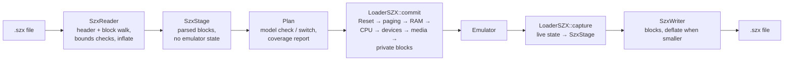

# SZX (ZX-State) snapshots: reader and writer design

- **Date:** 2026-09-29
- **Status:** design, review round 1 applied (2026-09-29, [§20](#20-review-round-1)). S0-S2 and B128
  implemented on branch `szx` ([TODO.md](TODO.md)). PLAN row **#64** (T2);
  prerequisite of **#27** (RZX ↔ TTD) beyond 48K / 128K.
- **References:** byte-level format in
  [szx-format-reference.md](szx-format-reference.md) (every spec page,
  libspectrum and other emulators cited there); why SZX matters for RZX in
  `2026-09-28-debugger-family/rzx-ttd.md` §8.
- **Research base:** code of unreal-ng master on 2026-09-29; libspectrum
  `szx.c`; the SZX code of ZXMAK2, Zero, zxsp, ZX-M8XXX, SkoolKit, BizHawk
  (paths in the format reference).

> **Scope decision (user, 2026-09-29): standard SZX only.** unreal-ng reads
> and writes SZX for the machines that have an SZX machine id and refuses
> everything else: a snapshot for another model is refused (no model
> switch), a model without an SZX id cannot be saved as SZX (use `.z80` /
> `.sna`), and there are no private `UN**` blocks. The sections on the model
> switch (§6 "Who runs a load", §8 step 1), private blocks (§10), machines
> without an id (§11, option A taken) and the phases S4 below are kept for
> the record and marked **dropped**.

> **In one line.** A fourth snapshot loader, `LoaderSZX`, built on the same
> stage-then-commit pattern as the SNA and Z80 loaders: standard SZX v1.5
> blocks for interoperability, exact CPU state (MEMPTR, Q, interrupt shadow,
> in-frame T-state) for RZX and TTD, and private `UN**` blocks that carry our
> full device state for lossless unreal-ng round trips.

## Contents

- [1. Why](#1-why)
- [2. Today](#2-today)
- [3. Goals and non-goals](#3-goals-and-non-goals)
- [4. Machine mapping](#4-machine-mapping)
- [5. Block coverage](#5-block-coverage)
- [6. Architecture](#6-architecture)
- [7. Reading](#7-reading)
- [8. Committing the state](#8-committing-the-state)
- [9. Writing](#9-writing)
- [10. Private blocks](#10-private-blocks)
- [11. Machines without an SZX id](#11-machines-without-an-szx-id)
- [12. Compression dependency](#12-compression-dependency)
- [13. TTD and RZX integration](#13-ttd-and-rzx-integration)
- [14. Surfaces and documentation](#14-surfaces-and-documentation)
- [15. Tests](#15-tests)
- [16. Phases](#16-phases)
- [17. Risks](#17-risks)
- [18. Open decisions](#18-open-decisions)
- [19. Side findings](#19-side-findings)
- [20. Review round 1](#20-review-round-1)

---

## 1. Why

- **Interoperability.** SZX is the richest standard Spectrum snapshot: a
  machine id and blocks for the AY, Beta 128, +3, tape, GS, Covox and more.
  Fuse, Spectaculator, SpecEmu, Spin, Zero, ZXMAK2 and ZXDS write it.
- **RZX.** An RZX recording is only as good as its start snapshot; on 128K
  machines with TR-DOS or a +3 disk, only SZX carries the needed state
  (`2026-09-28-debugger-family/rzx-ttd.md` §8).
- **Exact CPU state.** Z80R stores MEMPTR, the in-frame T-state, the
  interrupt shadow (`SUPPRESS_INTS`), `HALTED` and, since 1.5, `FSET` (Q). SNA
  and Z80 have none of these, so our loaders guess `HALT` from the opcode at
  PC and restart the frame at T-state 0.
- **A trust bug.** `.szx` is already advertised on several surfaces but
  rejected on load ([§2](#2-today)).

## 2. Today

| Item | State (repo-relative) |
|---|---|
| Loaders | `LoaderSNA` (`core/src/loaders/snapshot/loader_sna.*`), `LoaderZ80` (`loader_z80.*`), `LoaderZXP` (ZX-Poly only); no shared interface |
| Pattern | `validate()` → stage the whole file into private buffers (no emulator change) → commit: `core.Reset()`, `PortDecoder::UnlockPaging()`, bank pages, replay port writes through `DecodePortOut`, copy RAM and registers, border → `Emulator::LoadSnapshot` calls `RestartFrame()` at the current position |
| Save | `captureStateToStaging()` → writer; format chosen by the #7FFD lock bit, not the model |
| `.szx` | advertised by `Emulator::SupportedSnapshotExtensions()` (`core/src/emulator/emulator.cpp:1924-1927`), Qt file dialogs and menu, OpenAPI, the WebAPI upload helper and the GDB server; **rejected** by `Emulator::LoadSnapshot` (`emulator.cpp:1430-1441`); **no writer** (`SaveSnapshot` accepts sna / z80, `:1560-1565`); MCP `load_software` and Qt `FileManager` do not list it |
| TTD | `LoadSnapshot` is TTD-guarded and invalidates the session (`emulator.cpp:1445-1448`) |
| Model switch | `ModelSwitchRequest` in `core/src/emulator/media/modelswitch.h` (used by the Qt Machine menu; media follow the switch) |
| Compression | the core has zstd and liblzma; **no zlib** |
| Fixtures | no `.szx` under `testdata/` |
| Docs | `docs/inprogress/2026-01-13-snapshot-loading/DONE.md` and `2026-08-26-automation-gaps/action-plan.md` claim SZX support that does not exist |

## 3. Goals and non-goals

**Goals**

| ID | Goal |
|---|---|
| G1 | Read every SZX v1.0-1.5 file for the machines we emulate, tolerant of other writers' quirks; never crash on bad input |
| G2 | Write SZX v1.5 that Fuse (libspectrum) and Spectaculator read, for every model with an SZX machine id |
| G3 | Exact CPU state at an instruction boundary (MEMPTR, Q / FSET, interrupt shadow, `HALTED`, in-frame T-state, interrupt-request remainder), so SZX can be the start state of RZX exports and TTD clips |
| ~~G4~~ | ~~Lossless unreal-ng → unreal-ng round trips through private blocks~~ - **dropped** (standard SZX only) |
| G5 | One load / save path for every surface (WebAPI, CLI, MCP, Lua, Python, GDB, DeZog, Qt) |
| G6 | Report, per load: which blocks were applied, approximated, ignored or unknown |

**Non-goals (v1)**

- Emulating hardware we do not have because a snapshot mentions it (IF1,
  Multiface, +D, Opus, divIDE, Spectranet …): reported, not emulated.
- Timex, SE and 16K machines: no unreal-ng model; refused.
- Custom ROMs from the `ROM` block: v1 reports and uses the configured ROM set
  ([§18](#18-open-decisions)).

## 4. Machine mapping

| unreal-ng model | SZX id | Page set (RAMP) | SPCR byte 2 | Notes |
|---|---|---|---|---|
| 48K | 1 | 5, 2, 0 | 0 | ids 0 (16K) and 15 (NTSC 48K) read as 48K with a warning; `ALTERNATETIMINGS` flag applies |
| 128k | 2 | 0-7 | 0 | id 16 (128Ke) read as 128k with a warning |
| PLUS2 | 3 | 0-7 | 0 | |
| PLUS2A | 4 | 0-7 | #1FFD | |
| PLUS3 | 5 | 0-7 | #1FFD | id 6 (+3e) read as PLUS3 with a warning |
| PENTAGON 128 | 7 | 0-7 | 0 | Beta 128 always connected |
| PENTAGON 512 | 13 | 0-31 | 0 | #7FFD bits 6-7 = page bits 3-4 (matches `portdecoder_pentagon512.cpp`) |
| PENTAGON 1024 | 14 | 0-63 | **#EFF7** | #7FFD bits 5-7 extend the page; #EFF7 bit 2 = 128K compatibility |
| SCORPION (256) | 10 | 0-15 | Scorpion #1FFD | |
| SCORPION 1024, PROFSCORP | 10 + private | 0-63 | #1FFD | pages 16-63 and ProfROM state only in private blocks ([§11](#11-machines-without-an-szx-id)) |
| ATM710, ATM3 / ZX-Evo, PROFI, TSConf and others | none | — | — | [§11](#11-machines-without-an-szx-id) |

Ids 8, 9, 11, 12 (Timex, SE): refused with a clear message.

## 5. Block coverage

R = read, W = write. **Full** = lossless for what the block stores;
**Partial** = what the block can express. **As built (2026-09-29):** every
row below that maps to hardware we emulate is implemented both ways; KEYB
Issue 2, JOY, DRUM and the AMX mouse are read and reported (no such hardware
here); NeoGS answers a GS block with "needs the classic GS". Linked media are
always inserted with Session access (R6, simplified: nothing is ever written
to a linked file, so any path is safe to open).

| Block | unreal-ng component | R | W | Notes |
|---|---|---|---|---|
| header | model, RAM size | Full | Full | machine id selects or validates the model ([§8](#8-committing-the-state)) |
| `CRTR` | — | Full | Full | write "unreal-ng", version, git hash in custom data; read to detect libspectrum ≤ 0.5.0 (A/F swap) |
| `Z80R` | `Z80` registers and state (`core/src/emulator/cpu/z80.h`) | Full | Full | `dwCyclesStart` counts from the **INT** (libspectrum writes `chHoldIntReqCycles = 48 - tstates`); our `Z80::t` counts from the frame start and the INT sits at `intstart` (Pentagon 71636, 128K 1846, ATM 1757, Profi 3572), so `dwCyclesStart = (t - intstart) mod frameLength` and back ([§8](#8-committing-the-state) step 7); `wMemPtr` ↔ `memptr` (1.4+; 1.1-1.3: `chBitReg` seeds the high byte); `HALTED` ↔ `halted`; `SUPPRESS_INTS` ↔ `boundary` ∈ {`INT_SHADOW`, `PREFIX_DD`, `PREFIX_FD`} (INT refused); `LD_A_IR` and `NMI_ACK` have no SZX field: the exact `boundary` byte travels in `UNMC` ([§10](#10-private-blocks)); `FSET` ↔ `q`: write `FSET = q ≠ 0`, read `q = FSET ? F : 0` (exact: `q` is always 0 or F); `chHoldIntReqCycles` ↔ T-states left of the INT window from `intstart` / `intlen` |
| `SPCR` | `EmulatorState` `p7FFD`, `p1FFD`, `pEFF7`, `pFE`, `border_attr` | Full | Full | byte 2 by model (§4) |
| `RAMP` | `Memory` pages | Full | Full | page set by model; zlib per page when smaller |
| `AY` | AY chip 0 (`SoundChip_AY8910` through `SoundManager::getAYChip(0)`) | Full | Full | 16 registers + selected register; tone / envelope phase not stored (format limit); Fuller / Melodik flags ignored |
| `KEYB` | keyboard | Partial | minimal | `ZXSTKF_ISSUE2` applied where the model has an issue-2 EAR setting, else reported; joystick type from config |
| `JOY` | joystick rule | ignore | optional | no stateful device |
| `AMXM` | Kempston mouse | Partial | Partial | type only |
| `B128` | `WD1793` registers, #FF system register, `CF_TRDOS` | Partial | Full | `PAGED` ↔ `CF_TRDOS`; `SEEKLOWER`; custom TR-DOS ROM: report ([§18](#18-open-decisions)); in-flight command state not in the format |
| `BDSK` | media manager floppy slots, `FDD` cylinder | Partial | Partial | linked file or embedded TRD / SCL / FDI / UDI image by `chDiskType`; cylinder per drive |
| `+3` | `UPD765` presence, motor (#1FFD bit 3) | Partial | Full | no controller registers in the format |
| `DSK` | media manager | Partial | Partial | links only (the spec never implemented embedding) |
| `TAPE` | `Tape` block index, media manager | Partial | Partial | block number only; pulse position lost; linked or embedded image |
| `GS` + `GSRP` | `SoundChip_GeneralSound` (classic GS only) | Full | Full | card CPU registers (no MEMPTR in the block), channel volumes and outputs, upper page, RAM pages; no other emulator implements it, so interop is untested |
| `COVX` | Covox DAC level | Partial | Partial | one level; SounDrive's four channels in a private block |
| `PLTT` (unofficial) | `ulaplus_*` fields | store | omit | ULAplus is not emulated |
| `ROM` | configured ROM set | report | omit | [§18](#18-open-decisions) |
| `DRUM`, `SCLD`, `IF1`, `MDRV`, `IF2R`, `MFCE`, `ZXAT`/`ATRP`, `ZXCF`/`CFRP`, `SIDE`, `PLSD`/`PDSK`, `OPUS`/`ODSK`, `USPE`, `ZXPR`, `DOCK`, `LEC`/`LCRP`, `DIDE`/`DIRP`, `DMMC`/`DMRP`, `SNET`, `ZMMC` | not emulated | report | never | listed in the load report as "hardware in the snapshot that this machine does not have" |
| unknown ids | — | skip | — | skipped silently per the spec, listed in the report |
| `UNMC`, `UNDV` (ours) | model details, every device blob | Full | Full | [§10](#10-private-blocks) |

## 6. Architecture

| Part | Role |
|---|---|
| `SzxBlocks` (header only) | packed layouts, ids, flag constants, version-dependent field rules |
| `SzxReader` | walks blocks by `dwSize`, checks every length against the file size and the block's minimum, inflates tails, parses into typed structs; never touches the emulator |
| `SzxStage` | the parsed file: header, CRTR, Z80R, SPCR, pages, AY, devices, media, private blocks, unknown blocks, warnings |
| `LoaderSZX` | the loader class in `core/src/loaders/snapshot/` with the same public shape as `LoaderSNA` / `LoaderZ80` (`load()`, `save()`), plus `commit` and `capture` |
| `SzxWriter` | serializes a stage; standard blocks at their exact sizes (Fuse requires Z80R = 37, SPCR = 8, AY = 18 bytes) |
| `SzxReport` | per-block outcome (applied, approximated, ignored, unknown), returned to every surface |

**Who runs a load** (**dropped**: a snapshot for another model is refused). A load that needs another model cannot run inside
`Emulator`: `ModelSwitch::Run` creates a **new** machine next to the old
one, moves the media and destroys the old machine, and the new machine has
a **new id** (`modelswitch.cpp:76-144`). So the load is orchestrated one
level up, in one shared entry point (`EmulatorManager` or the shared surface
path): read and plan on the stage → switch the model if needed → commit into
the machine that exists now → return `{emulatorId, report}`. Every surface
passes the returned id on (WebAPI / MCP responses carry it; the Qt window
rebinds through `beforeRelease`, as the Machine menu does). A load that
keeps the model stays on the old machine and keeps its id.

**Shared helpers.** The commit steps shared with the SNA and Z80 loaders
(paging replay, register copy, border) are extracted only when a second user
needs them; v1 does not refactor the existing loaders (naive first).

## 7. Reading

1. **Header:** magic `ZXST`, major 1 (other majors refused), minor any; the
   machine id; `ALTERNATETIMINGS`.
2. **Block walk:** read `id`, `dwSize`; refuse a block that runs past the end
   of the file; skip unknown ids; accept standard blocks **larger** than their
   defined size (read the known prefix), refuse **smaller** ones.
3. **Version rules** (the spec says not to branch on versions; libspectrum
   does, and we follow libspectrum where the layout changed):
   - Z80R bytes 35-36: `wMemPtr` from 1.4; in 1.1-1.3 `chBitReg` (the
     hidden register `BIT n,(HL)` reads, i.e. MEMPTR's high byte) seeds
     `memptr` high, low byte 0, with a report note; in 1.0 MEMPTR is 0;
   - KEYB: 4 bytes in 1.0;
   - FSET only from 1.5.
   The version rules run **before** the size rule of step 2: a block that is
   short because its version defines it so (KEYB 1.0) is accepted.
4. **Quirks:** CRTR "libspectrum" ≤ 0.5.0 → swap A / F and A' / F'.
   `HALTED` conventions (PC on the `HALT` or after it) come from a table per
   writer (`CRTR` creator and version), filled from the interop fixtures;
   only a file from an unknown writer falls back to the opcode at PC, with a
   report note. Page
   numbers are validated against the machine's page set (a page outside it is
   reported, not written). ZX-M8XXX files swap SPCR bytes 2 and 3 and use
   wrong machine ids; without a CRTR block they cannot be detected, so the
   report warns when #7FFD / #1FFD values contradict the machine id.
5. **Decompression** only when the block's own compressed flag is set (the
   same bit value means different things in different blocks), always with
   an output limit: a RAMP or GSRP page inflates to exactly 16384 bytes
   (more or less is an error), an embedded disk or tape image to at most its
   format's largest size (a limit per format, 16 MiB at most), a private
   blob to its device's `TTDStateSize()`. A stream that exceeds the limit is
   an error, not a truncation (no decompression bombs).
6. **Result:** an `SzxStage` plus warnings. Nothing in the emulator has
   changed.

## 8. Committing the state

1. **Model.** **As built: a machine id for another model is refused** ("switch the model first"); the
   rest of this step is the dropped design. If the machine id maps to a different model than the running
   one: the default is to **switch the model** through `ModelSwitchRequest`
   (as the Machine menu does), then commit into the **new** machine; an
   option refuses instead. This step runs in the orchestrator of
   [§6](#6-architecture), not inside `LoaderSZX::commit`; the caller gets the
   new emulator id. RAM size (Pentagon 512 / 1024, Scorpion 1024) is part of
   the model.
2. **TTD guard** as for every snapshot load: refused while a recording forbids
   it; the session is invalidated.
3. **Reset** (`core.Reset()`): clean devices.
4. **Paging:** `UnlockPaging()`; replay #7FFD, then #1FFD or #EFF7 by model,
   through `DecodePortOut`, so each model's decoder applies its own rules;
   then force the stored values (the #7FFD lock bit included).
5. **RAM:** every `RAMP` page into `Memory`.
6. **CPU:** all registers; `memptr`; `q` from `FSET`; `halted` from `HALTED`
   (no opcode guessing); the interrupt shadow from `SUPPRESS_INTS`; `iff1`,
   `iff2`, `im`.
7. **Frame position:** convert `dwCyclesStart` from the INT-based count of
   the format to our frame position, `t = (intstart + dwCyclesStart) mod
   frameLength` (the writer applies the inverse); the remaining
   interrupt-request window from `chHoldIntReqCycles` is checked against
   `intlen` (a value beyond it is clamped and reported); then
   `RestartFrame()` re-bases devices at that position. This needs a small
   hook in the frame / interrupt logic and a test that raster, contention and
   the interrupt window agree after a mid-frame restore.
8. **Devices** from standard blocks: AY 0 (registers, then the selected
   register), Beta 128 (registers, #FF, `CF_TRDOS` from `PAGED`), +3 motor,
   Covox level, mouse type, GS card.
9. **Media** through the media manager: `BDSK` / `DSK` / `TAPE` links or
   embedded images; tape block index; drive cylinders.
   - **Links are untrusted input.** A snapshot from elsewhere could name any
     host file, and a write-through medium would write into it. Rules: a
     linked medium is always inserted `Session` (writes stay in memory until
     the user saves them); only paths inside the snapshot's folder (after
     resolving `..` and links) are opened without asking; any other path
     needs an explicit option on the call; loads that arrive through the
     WebAPI or MCP refuse links outside the upload by default and report
     them.
   - **Embedded images** need a memory source in the media manager: today
     `MediaSource` is a file or a folder (`medium.h:22-27`). Phase S3 adds
     `MediaSourceType::Memory` (a buffer handed to the format registry), with
     `Session` access and export through the existing save / export verbs.
10. **Private blocks last:** if `UNDV` blobs are present and their versions
    match, they overwrite the approximate device state from steps 8-9.
11. **Border and screen:** border from SPCR, then the screen is rendered.
12. **Report** returned to the caller and logged.

## 9. Writing

1. **Capture** the live state into an `SzxStage`: CPU (with in-frame T-state,
   `memptr`, `q`, `halted`, `boundary`, the remaining interrupt-request
   window), ports, RAM pages of the model's page set, AY 0, Beta 128, +3,
   Covox, mouse, GS, media references, and every registered device blob.
2. **Header** 1.5, the machine id, `ALTERNATETIMINGS` when the model uses the
   late timings.
3. **Blocks in order:** `CRTR`, `Z80R`, `SPCR`, `RAMP` pages, `AY`, `KEYB`,
   `JOY`, `AMXM`, `B128` + `BDSK`, `+3` + `DSK`, `TAPE`, `GS` + `GSRP`, `COVX`,
   then private blocks.
4. **Compression:** zlib per block tail, flag set only when smaller (as
   libspectrum does).
5. **Media:** linked by default (paths relative to the snapshot when
   possible); option to embed TRD / SCL / FDI / UDI and tape images.
6. **Refusals:** a model without an SZX id follows the policy of
   [§11](#11-machines-without-an-szx-id).

## 10. Private blocks

**Dropped** (scope decision above): SZX stays a standard format; the
full-state unreal-ng snapshot is a separate question.

Standard blocks stay exactly as specified, so other readers are never
confused. Our extra state lives in blocks with ids that no specification or
known extension uses; the spec requires readers to skip unknown blocks.

| Id | Content | Purpose |
|---|---|---|
| `UNMC` | unreal-ng machine record: model name, RAM size, ROM set hashes, configuration items that change behavior (timing variant, `intstart` / `intlen`, turbo, peripherals fitted), emulator version, and the CPU extras SZX cannot express (the exact `boundary` byte) | reproduce the exact machine; detect mismatches |
| `UNDV` | one per device: `WORD peripheralId`, `WORD blobVersion`, `DWORD flags` (bit 0 = compressed), the device's TTD state blob (`TTDSaveState`) | lossless state for every device we emulate (second AY and selected chip of TurboSound, TSFM, SounDrive, NeoGS, MoonSound, RTC, IDE, SD card, ProfROM, ATM / Profi / TSConf paging and palettes, full WD1793 / uPD765 / tape state) |

Rules:

- A `UNDV` blob is applied only if its `peripheralId` exists on the machine
  and its `blobVersion` is one we can read; otherwise it is reported and the
  standard block (if any) stands.
- Blob layouts change with the TTD format; each device keeps its own
  `blobVersion`, so an old snapshot degrades to the standard blocks instead of
  failing.
- **This needs a change to the shared TTD interface.** `TTDSerializable` has
  only `TTDStateSize` / `TTDSaveState` / `TTDLoadState` / `TTDHashState`
  (`ttdserializable.h`); today a layout change is handled by re-recording the
  TTD fixture corpus, which snapshots on users' disks cannot follow. Phase S4
  adds `virtual uint16_t TTDStateVersion() const` (default 1) with the rule
  "bump it with every layout change" (checked in review, and by a test that
  pins each device's size and version), and the loader checks **both** the
  version and the size, since some blob sizes depend on the configuration.
- Other emulators ignore these blocks; they get the standard state.

## 11. Machines without an SZX id

ATM710, ATM3 / ZX-Evo, Profi, TSConf, Scorpion 1024 and ProfROM have no SZX
machine id (and some have no standard state at all).

| Option | Effect on other readers | Assessment |
|---|---|---|
| A. Refuse to write SZX for these models | none | safe; users get `.z80` / `.sna` or (later) the unreal-ng snapshot format |
| B. Write a compatible id (for example Pentagon 128) + `UNMC` / `UNDV` | they load a **wrong machine** silently | risky |
| C. Write a **private machine id** (a value above 16, e.g. 0x80) + `UNMC` / `UNDV` | they refuse cleanly ("unknown machine type" in libspectrum) | safe; round trips inside unreal-ng work |

**Decided: A (refuse)**, 2026-09-29. The text below is the dropped recommendation. **Recommendation: C**, with the writer's report stating that the file is
unreal-ng-only; Scorpion 1024 and ProfScorpion write id 10 only when the state
fits ZS-256 (pages 0-15, no ProfROM state), otherwise C.

## 12. Compression dependency

SZX uses zlib streams (RFC 1950), which the core cannot read or write today.

| Option | Notes |
|---|---|
| **miniz** (single-file C, zlib-compatible API, MIT) vendored in `core/src/3rdparty/` | small; builds everywhere without a system library; recommended |
| zlib vendored | the reference; larger build integration |
| system zlib | not guaranteed on Windows / MSVC |

The dependency also serves RZX (zlib-compressed input blocks and snapshots,
#27) and other formats that use zlib.

## 13. TTD and RZX integration

- **Load** is a TTD "teleport" like every snapshot load: guarded, and it
  invalidates the session (or, later, becomes a journaled external event).
- **Start state for RZX export** (#27, `2026-09-28-debugger-family/ttd-offline-analysis.md`
  O-31): the writer must be exact at an instruction boundary (G3); the export
  writes SZX at the TTD in-point.
- **RZX import** loads the embedded snapshot through this loader; SZX gives
  the replay the machine id and device state that SNA / Z80 lack.
- **TTD clips** may carry an SZX of the in-point as a portable preview state.

## 14. Surfaces and documentation

- `Emulator::LoadSnapshot` / `SaveSnapshot` accept `szx`. They return `bool`
  today (`emulator.h:281-282`); the report and a possibly new emulator id
  ([§6](#6-architecture)) need a result type on the shared entry point, and
  every surface returns it (or a summary).
- MCP `load_software` extension list and Qt `FileManager` extensions gain
  `szx`; the Qt save dialog offers SZX.
- WebAPI (and OpenAPI), CLI, Lua, Python, GDB and DeZog follow through the
  shared path; each surface returns the report (or a summary).
- Documentation to correct: the snapshot-loading `DONE.md` and the automation
  action plan (they claimed SZX support), the Pentagon 1024 16-color design and
  PLAN #53 (they state SZX has no #EFF7 field; SPCR byte 2 holds #EFF7 on
  Pentagon 1024), and the user docs of every surface.

## 15. Tests

| Kind | Content |
|---|---|
| Unit: reader | header and every standard block parsed from hand-built buffers; version rules (1.0 KEYB, pre-1.4 Z80R tail, 1.5 FSET); compressed and uncompressed tails; oversize blocks; unknown blocks; the A/F swap |
| Unit: writer | exact block sizes; round trip stage → bytes → stage |
| Fuzz | random and truncated files, as for the Z80 loader (never crash, never touch the emulator on a parse error); compressed streams that inflate past their limit |
| Frame position | per model: a Fuse-written file with a known `dwCyclesStart` lands at `t = intstart + dwCyclesStart`; save → load keeps `t`; the INT window after the restore matches |
| Model switch | load of a file for another model returns a new emulator id, the old one is gone, the media followed |
| Link safety | a link outside the snapshot folder is refused (WebAPI) or needs the option (local); a linked medium is `Session` |
| Commit | per model: paging, page sets, CPU fields (MEMPTR, Q, shadow, halted), in-frame T-state restore agreeing with raster and contention, Beta 128 paged state |
| Round trip | save → load → identical machine state (with private blocks), per creatable model |
| Interop fixtures | files written by libspectrum / Fuse (v1.5), ZXMAK2 (v1.4, Pentagon), Spectaculator (older version, many unsupported blocks), Zero and ZX-M8XXX; candidates found locally: ZX-M8XXX `tests/snapshot_128k_shock.szx`, Kozynax `tests/Fixtures/cpd-test-128-v0.777b.SZX`, zxtune `samples/archived/szx/CrazyLove.szx` (terms to check); Pentagon 512 / 1024 and Scorpion files to be generated with Fuse or ZXMAK2 |
| Interop out | our files loaded by Fuse (manual check at first; `rzxplay.py`-style headless tools where available) |

## 16. Phases

| Phase | Content | Size |
|---|---|---|
| S0 | miniz vendored; `SzxBlocks`; `SzxReader` with bounds checks; fuzz tests | S-M |
| S1 | read and commit: header, CRTR, Z80R (all fields incl. the INT-based frame position), SPCR, RAMP, AY; another model refused; surfaces accept `.szx`; report — **done** | M |
| S2 | write: the same blocks; save dialogs and surfaces — **done** | S-M |
| S3 | devices and media: B128 (**done**); BDSK, +3 + DSK, TAPE, COVX, AMXM, KEYB / JOY, GS + GSRP optional, only on demand (until then reported as ignored); `MediaSourceType::Memory`; link safety rules | M |
| ~~S4~~ | ~~private blocks `UNMC` / `UNDV`; `TTDStateVersion()`; the policy for machines without an id~~ — **dropped** (refuse) | — |
| S5 | RZX integration (start state of exports and imports, #27) | with #27 |

## 17. Risks

| Risk | Mitigation |
|---|---|
| Mid-frame restore disagrees with the raster or the interrupt window | a dedicated test per model; fall back to frame start with a warning if the model cannot honor it |
| Other writers' bugs (swapped SPCR bytes, wrong ids, aliased pages) | tolerant reader, validation against the page set, warnings in the report |
| `HALTED` convention differs between writers (PC at the `HALT` or after it) | a table per writer (`CRTR`) from the fixtures; the opcode at PC only for unknown writers |
| A snapshot names host files (links) | `Session` access, folder-relative paths only by default, refused through the WebAPI / MCP ([§8](#8-committing-the-state) step 9) |
| Surfaces keep a stale emulator id after a model switch | the shared entry point returns the new id; a test per surface |
| GS block has no interop corpus | our own round trips; mark as "unreal-ng tested only" |
| Private blob versions drift with TTD | per-device `blobVersion`; degrade to standard blocks |

## 18. Open decisions

1. Machines without an SZX id: **decided A, refuse** (2026-09-29).
2. Model mismatch on load: **decided, refuse** (2026-09-29): overriding the
   running machine's model gains nothing.
3. Custom ROMs (`ROM`, `B128` custom TR-DOS, `GS` custom ROM): **as built,
   reported, the configured ROMs stay**.
4. Media on save: link (recommended) or embed by default?
5. Compression library: **miniz 3.1.2, as built**.

## 19. Side findings

Found while researching; not part of this design. **All fixed on master
(2026-09-29):**

- ~~The Z80 loader ignores the stored AY registers~~ - fixed in `e2dbcde1`.
- ~~The Z80 loader's 256K (Scorpion) commit path does no paging~~ - Scorpion
  `.z80` files load (pages 3-18 = RAM 0-15, #1FFD), and +2A / +3 files apply
  #1FFD too (v3 byte 86).
- ~~The Z80 writer's model byte is always 48K or 128K~~ - the running model's
  code (+2 12, +2A 13, +3 7, Pentagon 9, Scorpion 10 with 16 pages), #1FFD in a
  55-byte header, the AY selected register from the chip, and the v3 T-state
  counter (bytes 55-57, read and written as libspectrum does). Checked by
  `LoaderZ80Models_Test` against libspectrum-written files in
  `testdata/loaders/z80/libspectrum/` and by `check-interop.sh`.

## 20. Review round 1

2026-09-29, checked against the code of master (`38c96c9f`). All findings
applied above.

| # | Finding | Evidence | Change |
|---|---|---|---|
| R1 | The model switch cannot run inside `LoaderSZX::commit`: `ModelSwitch::Run` creates a new machine, destroys the old one, and the new one has a new id | `modelswitch.h`, `modelswitch.cpp:76-144` | load orchestrated one level up, returns `{emulatorId, report}` ([§6](#6-architecture), [§8](#8-committing-the-state) step 1) |
| R2 | `dwCyclesStart` counts from the INT; our `Z80::t` from the frame start, INT at `intstart` | reference: libspectrum `chHoldIntReqCycles = 48 - tstates`; `platform.h:497-498`; `intstart` in every `data/configs/*/unreal.ini` | conversion through `intstart` both ways; tests with Fuse files ([§5](#5-block-coverage), [§8](#8-committing-the-state) step 7, [§15](#15-tests)) |
| R3 | `Z80State::boundary` has six states; SZX has one flag | `z80.h:357-371` | standard flag as the approximation; exact byte in `UNMC`; `q = FSET ? F : 0` |
| R4 | TTD blobs carry no version | `ttdserializable.h` | `TTDStateVersion()` in S4; version and size both checked ([§10](#10-private-blocks)) |
| R5 | Embedded images have no memory source in the media manager | `medium.h:22-27` | `MediaSourceType::Memory` in S3 |
| R6 | Links in a snapshot are untrusted: a write-through medium would write into any host file | — | `Session` access, folder-relative paths only by default, refused via WebAPI / MCP |
| R7 | Inflate without limits | — | exact 16384 for pages, per-format caps, blob size; fuzzed |
| R8 | 1.1-1.3 `chBitReg` holds MEMPTR's high byte | reference §Z80R versions | seeds `memptr` instead of 0 |
| R9 | `LoadSnapshot` / `SaveSnapshot` return `bool` | `emulator.h:281-282` | result type with the report and the id |
| R10 | "Refuse short blocks" contradicts KEYB 1.0; KEYB carries issue 2 | reference | version rules first; issue 2 applied or reported |
| R11 | `HALTED` by opcode is a guess | — | per-writer table, opcode only for unknown writers |

The five open decisions of [§18](#18-open-decisions) keep their
recommendations; decision 2 (switch the model) depends on R1.

