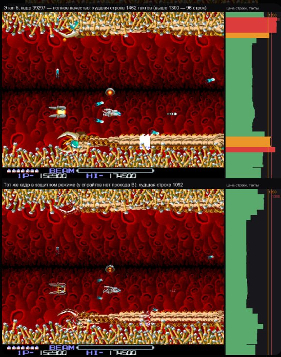

# VDAC2: accelerating the FT812 renderer - experiment results

**Date:** 2026-10-02. **Status:** experiments done, nothing built into eve-emu yet.
The experiments themselves (code, scripts, one README per experiment):
[`tools/poc/021-eve-accel/`](../../../tools/poc/021-eve-accel/README.md) (see "Where the experiments are" at the end).

## Why

The FT812 on the VDAC2 card is emulated by eve-emu. Run in step with the machine it took
a whole host core before the 2026-10-02 optimizations (R-Type 0.61x real time on one core),
and some games are still slow (Zuma: 1.2x real time). The question was how far CPU threads
and a GPU can take it, and which compromises between accuracy and speed are worth having.

Input came from TS-Labs (the VDAC2 author): lines can only be drawn in parallel when the
display list does not change per line; a GPU could compute antialiasing with 256 honest
sub-pixels, but switching between GPU kernels might eat the gain; and the realistic target
is a native-GPU renderer with per-line display list emulation and the coprocessor executed
procedurally, charged the time it takes on real hardware. Cross-platform GPU frameworks
(WebGPU, OpenCL, translation layers) are out: tested, too slow. Either a native GPU API or
straight back to the CPU SIMD path.

## Terms

| Term | Meaning |
|:--|:--|
| Display list (DL) | the program the FT812 runs for every screen line to draw it |
| Batch | lines drawn together because nothing they read changes in between |
| Bit-exact | the accelerated picture equals eve-emu's CPU picture in every pixel |
| Dispatch | one launch of a GPU kernel (a program run by thousands of GPU threads) |
| Real-time factor | chip time / host time: 1.0x = one host core just keeps up with the chip |
| Goldens | reference pictures made with Bridgetek's own emulator, used by eve-emu's tests |

## How it was measured

- Workloads: bus captures (`.evr`) of R-Type (boot, 6 minutes of play, 24 193 frames) and
  Zuma (829 frames), replayed through eve-emu alone by `eve-replay`, which checks every chip
  answer byte and every picture hash.
- Gate: every accelerated path must reproduce eve-emu bit for bit. It did, everywhere it was
  checked: the line-parallel CPU renderer and the GPU backend on the whole 410 s R-Type play
  capture, the GPU kernel on 125 of 125 test frames.
- Host: Apple M1 Ultra (20 CPU cores, 64-core GPU), Metal. The machine was shared with other
  builds the whole time (1-minute load 37-195), so wall times scatter 2-4x; CPU times repeat
  within a few percent. The final timing pass did not run; `tools/poc/021-eve-accel/run-all-timings.sh`
  repeats every measurement on a quiet machine.

## Results

| # | Question | Result |
|:--|:--|:--|
| 01 | Speed on one core, where the time goes | R-Type 3.5-4.8x real time; **Zuma 1.2x**: its BILINEAR-filtered frames miss the fast path (28 ms per heavy frame) |
| 02 | How often something a line reads changes mid-frame | 70-95 % of frames are one batch; 80-100 % when writes to graphics memory the display list does not read are deferred. **No capture swaps the display list per line**; the splits come from graphics memory writes |
| 03 | Lines in parallel on the CPU (thread pool) | bit-exact on all captures; 0.13-0.95 % of lines stay serial; R-Type boot 5.1x faster at 8 threads, 6.1x at 16; play and Zuma at least 3.6x (noisy); 5-20 % more CPU time for the threading |
| 04 | Can a GPU kernel reproduce eve-emu exactly | yes: one integer-only per-pixel routine builds as C++ and as Metal (and is written to build for CUDA / HLSL); every bitmap format, filter, blend and stencil mode, antialiased points, lines and rectangles. Edge strips, text formats and the REG_CSPREAD / ROTATE / SWIZZLE output options stay on the CPU (1-10 % of lines) |
| 04a | One dispatch per frame | GPU 0.12-0.49 ms per frame against 0.3-5.1 ms on one core; Zuma's heavy frame 0.64 ms against 28 ms. Submitting and waiting (0.7 ms and more) costs more than the drawing |
| 04b | One dispatch per line | 768 line dispatches without barriers cost as much as one per frame (0.76 ms); 29 us per line with a serial encoder; **waiting for the GPU after every line: 2.3 ms per line** - not viable |
| 04c | Hybrid inside eve-emu: frames on the GPU, split where something changes, CPU fallback | bit-exact over the whole play capture, 90-97 % of lines on the GPU; falls back at start-up (no Metal), per batch (unsupported feature) and per batch by measured cost. The synchronous wait per batch is the weak spot: collect results asynchronously |
| 05 | OpenGL 4.1 fragment shader | exact on the frames tried; not recommended (deprecated, a layer over Metal on macOS) |
| 06 | 256 honest sub-pixels vs the current distance table | against the goldens: the table differs in 37 of 3 993 600 pixels (one case still TO VERIFY), 256 sub-pixels in about 200 000. **Keep the table**; on the GPU both are cheap |
| 07 | Whole frame on the GPU | one kernel per frame; a kernel per primitive doubles the GPU time and grows with the list; about 1-2 ms per frame end to end on an idle machine |
| 08 | Hardware-level line timing model (public documentation only) | R-Type boot: the worst line uses 621 of the 1344-clock budget, none overflows. Budget and overflow cut point in closed form: < 1 % of a core; stepping clock by clock: 7-24 % in bookkeeping alone |
| 09 | Native GPU backends | one shared integer core, a thin backend each: Metal here; Vulkan (native driver), D3D12, CUDA on Windows / Linux; CPU SIMD fallback with the same output |
| 10 | Coprocessor timing | eve-emu already charges each command a cost in clocks, but every cost is 0; a measurement plan for a VDAC2 board |
| 11 | Cheapest picture that changes | skipping frames whose inputs did not change is exact and drops 35-39 % of boot's lines; draw-1-in-N and half vertical resolution keep the chip's timing answers exact |

R-Type stage 5, frame 39297 (picture above, captions in Russian): per-line cost in FT812
clocks on the right. At full quality the worst line costs 1462 clocks and 96 lines exceed
1300; the same frame in the game's protected mode (sprites without the B pass) peaks at
1092. So real games do reach the line budget in play, unlike the boot sequence measured in
experiment 08: the overflow behavior must be modeled and checked on a card.

Firmware-level execution: studied separately, not in this repository.

## TS-Labs' hypotheses, checked

1. **Lines in parallel only, not with a per-line display list swap:** true as stated,
   harmless in practice - no capture swaps per line, and most batch boundaries (graphics
   memory writes) can be skipped. A program that rewrites the display list during the raster
   (TS-Labs plans one) splits batches at its change points; the hybrid (04c) handles that.
2. **256 sub-pixels on the GPU, eaten by kernel switching:** half true. The sub-pixels are
   cheap on the GPU but are not the model the reference uses; the distance table is. Switching
   costs only when the CPU waits for the GPU after each line or when each primitive gets its
   own kernel; one kernel per frame or band, or band dispatches recorded together without
   waits, avoids it.

## Three emulation profiles

| | FULL - maximum accuracy | OPTIMAL - the one to build | CHEAP - almost a slideshow |
|:--|:--|:--|:--|
| What it emulates | the documented line pipeline: per-line budget, the overflow cut point | eve-emu's renderer bit-exact: a native GPU backend per batch where it pays, else the SIMD CPU renderer on parallel lines; coprocessor commands native, charged measured durations | eve-emu with exact skipping of unchanged frames, optionally draw 1 frame in N or every other line |
| Cost | closed-form budget: < 1 % of a core on top of OPTIMAL | R-Type GPU 0.3-1 ms per frame; Zuma 0.64 ms instead of 28 ms; CPU fallback 3.6-6x faster with 8 threads | skip-unchanged is free; draw-1-in-4 about 10 % of a core for R-Type (estimate) |
| Accuracy loss | none (what an overflowing line shows must be measured on a card) | none in the picture; coprocessor durations approximate until measured | none for skip-unchanged; stale or line-doubled pictures otherwise; chip answers stay exact |
| Portability | plain C++ | Metal now; Vulkan / D3D12 / CUDA from the same core; CPU fallback everywhere (NEON / SSE2 / C++) | plain C++ |

## Recommendation

1. **eve-emu on the CPU first:** line threads (a thread-count setting, one by default),
   deferred graphics memory writes outside what the display list reads, exact skipping of
   unchanged frames, a SIMD fast path for BILINEAR (what makes Zuma slow).
2. **Then the GPU backend per batch (04c):** Metal first on the shared integer core, results
   collected asynchronously, precompiled shaders, the CPU renderer as reference and fallback.
3. **Coprocessor:** keep the native commands; fill the cost table from measurements on a
   VDAC2 board, and record there what an overflowing line looks like.
4. **Windows / Linux:** port the backend to native Vulkan first (D3D12 or CUDA if needed);
   re-run 03, 04a, 04b and 04c on a quiet machine, and check upload and the 3 MB readback on
   a discrete GPU (AMD Ryzen / Windows 11, NVIDIA).

## Where the experiments are

[`tools/poc/021-eve-accel/`](../../../tools/poc/021-eve-accel/README.md): `README.md` (index and profiles), one folder per experiment
(`01-baseline` ... `11-cheap-profile`) with goal, method, results, analysis and conclusions,
and the code to reproduce. The library changes per experiment are replacement files next to
the experiment; the vendored eve-emu in `core/src/3rdparty/eve-emu` is untouched. The scripts
read the captures from `EVE_CAPTURES` (default `scratch/`) and the ROM from `EVE_ROM` (default
`data/rom/ft81x.rom`); game data and the ROM are not in the repository.
