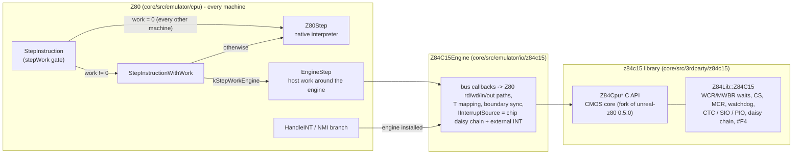

# Design: the Z84C15 CPU library and the engine seam

Status: design, 2026-10-01. Inputs: [research-cpu-z84c15.md](../2026-09-28-sprinter/research-cpu-z84c15.md)
(the chip facts, cited below as "research §n"), the `master-z80lib` precedent (branch
`github/master-z80lib`, docs `docs/inprogress/2026-09-24-z80-core-upgrade/` there: it ran every
machine on unreal-z80 through a seam inside `Z80::Z80Step`, zero copy through
`Z80CpuAttachRegisterFile`), and today's `core/src/emulator/cpu/z80.{h,cpp}`.

## Contents

1. [What changes, in one picture](#1-what-changes-in-one-picture)
2. [The engine seam in `Z80`](#2-the-engine-seam-in-z80)
3. [The library `core/src/3rdparty/z84c15/`](#3-the-library-coresrc3rdpartyz84c15)
4. [The host adapter `Z84C15Engine`](#4-the-host-adapter-z84c15engine)
5. [What lives where](#5-what-lives-where)
6. [Timing: the wait generator, worked examples](#6-timing-the-wait-generator-worked-examples)
7. [CPU-LIBRARY-MIGRATION tags](#7-cpu-library-migration-tags)
8. [Tests](#8-tests)
9. [Risks and open questions](#9-risks-and-open-questions)

## 1. What changes, in one picture



The native path is the line `StepInstruction -> Z80Step`: nothing in it changes. A machine with an
engine raises one more bit in the per-step work word (`EmulatorContext::stepWork`), which every
step already loads (performance-guidelines §5), so the other machines pay no new test per
instruction.

## 2. The engine seam in `Z80`

### 2.1 Interface

```cpp
/// z80.h - an instruction engine that replaces the native interpreter for one machine
class ICpuEngine
{
public:
    virtual ~ICpuEngine() = default;
    /// One step: the instruction at PC (opcode fetch through execution, Q), or one M1 of a halted
    /// CPU, or the instruction a pending DD/FD prefix introduces. Registers and tt are current on
    /// entry and on return; memory and port cycles go through the machine's normal paths
    virtual void ExecuteStep() = 0;
    /// The INT acknowledge cycle and what follows (push PC, IM2 vector read, PC = handler);
    /// Z80::ProcessInterrupts has accepted the INT and `vector` is the byte on the data bus
    virtual void AcknowledgeInterrupt(uint8_t vector) = 0;
    /// The NMI acknowledge (restart fetch, push PC, PC = #0066)
    virtual void AcknowledgeNmi() = 0;
};

void Z80::SetEngine(ICpuEngine* engine);   // also raises / clears EmulatorContext::kStepWorkEngine
ICpuEngine* Z80::GetEngine() const;
```

The machine's port decoder installs its engine at init and removes it on destruction, exactly like
`SetInterruptSource` / `SetMachineStepHook`. That is the per-model selection: shared code never
names a model (the Sprinter isolation test forbids `MM_SPRINTER` in `z80.cpp`), and a model without
an engine never sees one.

### 2.2 Where it is called

| Place | Native machines | Engine machine |
|:--|:--|:--|
| `StepInstruction` | unchanged: `stepWork == 0` -> `Z80Step` | `stepWork` has `kStepWorkEngine` -> `StepInstructionWithWork` |
| `StepInstructionWithWork` | unchanged branch to `Z80Step` | `EngineStep` instead of `Z80Step` (one bit test on the rare path) |
| `HandleINT` | unchanged | first statement: `if (_engine) [[unlikely]]` -> `AcknowledgeInterrupt`; once per accepted INT, not per instruction |
| NMI branch of `ProcessInterruptsImpl` | unchanged | the push / restart part goes to `AcknowledgeNmi`; the test runs only while an NMI is pending |

`EngineStep` keeps the host work that belongs to the machine, not to the CPU core, exactly as
`Z80Step` does it: the boundary entry, `RunInstructionStartHooks` (TR-DOS paging, breakpoints,
analyzers, the ROM traps), the call trace, the opcode profiler, the debug trace. Only the block
"fetch + execute + Q" becomes `_engine->ExecuteStep()`.

`Z80Step` stays the native interpreter's own step. Tests that drive a Sprinter must use
`StepInstruction` (the one entry that honors the engine); the one Sprinter test that called
`Z80Step` directly is switched over.

### 2.3 Cost

Zero instructions are added to the native per-instruction path: the work word is already loaded
and tested by every step. `HandleINT` gains one pointer test per accepted interrupt (50 per second).
Gate: `BM_HostFrame_Pentagon_*` A/B per performance-guidelines §4 before / after step 1 and step 3.

## 3. The library `core/src/3rdparty/z84c15/`

### 3.1 Origin and shape

A fork of `core/src/3rdparty/unreal-z80/` (upstream commit `a0433ec`, library 0.5.0), flat like the
original, MIT, its own `README.md` (origin, every local change) and a `THIRD_PARTY_NOTICES.md` row.

| Change against unreal-z80 0.5.0 | Why |
|:--|:--|
| C API prefix `Z80Cpu` -> `Z84Cpu`, `Z80CPU` -> `Z84CPU`, private namespace `Z80Lib` -> `Z84Lib`, bus namespace `Z80Cb` -> `Z84Cb`, header `z80cpu.h` -> `z84cpu.h` | links beside the native core and the GS card's unreal-z80 without one clashing symbol or type |
| Only the callback bus (the flat and paged builds are dropped) | the host owns memory (paging, overlays, the PLD); one bus build means the wait generator is written once |
| The memory read callback gets the bus-cycle kind (`Z84CpuAccessM1`, `Operand`, `Read`) instead of a 0/1 "instruction stream" flag | the host and the wait generator must tell an opcode fetch from an operand fetch |
| A halted CPU runs its M1 quanta through the read callback at PC | the board sees those M1 cycles (the PLD stretches them at 21 MHz; the native core re-executes HALT the same way) |
| The bus primitives take `cpu->t` back after every host callback | the host's external `/WAIT` (the PLD) is added by advancing the clock from inside the callback (`Z84CpuAddWaitStates`) |
| CMOS core: `OUT (C),0` writes `#FF` by default; the LD A,I / LD A,R P/V quirk is gone | research §3 |
| The on-chip block (§3.3) and its hooks in the bus primitives | research §4 |

### 3.2 CPU core API (`z84cpu.h`, C)

The unreal-z80 API under the new prefix: create / reset / step, `Z84CpuInt` / `Z84CpuNmi`,
register access, `Z84CpuAttachRegisterFile` (zero copy), the memory / port / INT-vector / RETI /
RETN / contention callbacks, plus `Z84CpuAddWaitStates`. `Z84CpuInt` takes the vector from the
`IntVector` callback as before; its INTA cycle now carries the chip's daisy-chain and vector waits,
and the push / vector-table cycles go through the memory callbacks with T published, so the board's
wait logic sees them (research §7, gap 4: the native core charges the 19 T up front and writes raw).

### 3.3 On-chip block (`z84c15.h`, C++ `Z84Lib::Z84C15`)

| Part | Model | Host-visible |
|:--|:--|:--|
| Wait-state generator (WCR, MWBR) | effective WCR, MWBR range, the power-on window (WCR = `#FF` for 15 M1 cycles unless written; reads `#FF` meanwhile), waits per cycle kind (§6) | nothing: it is CPU timing |
| Chip selects (CSBR, MCR D0/D1) | stored; `Cs0End()` / `Cs1Active(addr)` | the board maps memory with them (the Sprinter loader layout) |
| MCR D4 (clock divider), D3 (reset output), D2 (CRC) | stored bits: the Sprinter clocks CLKIN, so D4 has no effect (research §4.3) | read back |
| Watchdog (WDTMR, WDTCR) | enabled at reset (`#FB`, 2^22 clocks), clear `#4E`, disable `#B1` after WDTE = 0, counted on the CPU clock | `SetWatchdogHandler`: the `/WDTOUT` event; **default: not connected** (research Q3) |
| CTC | the S1 model (timer read-back) + zero-count interrupts in timer mode | clock source from the host |
| SIO | the S1 model (async, FIFO) + receive interrupts (WR1 modes 01/10/11), status-affects-vector | `Receive`, the transmit sink |
| PIO | the S1 register file + mode 3 interrupts on the input condition | `SetInputs` |
| Daisy chain | IP / IUS per source, the `#F4` priority table (MAME `tmpz84c015.cpp:144-150`), vectors, RETI clears the highest source under service; the external `/INT` comes after the chain | `IntPending`, `AcknowledgeInterrupt`, the RETI hook |
| Fixed ports | `Owns(port)` decodes A7-A0 only (research §4.5): `#10-#13`, `#18-#1F`, `#EE`, `#EF`, `#F0`, `#F1`, `#F4` | the host routes them to `Read` / `Write` |

The on-chip ports stay in the host's normal port path (`Z80::in` / `out` -> the model decoder ->
`Z84C15::Read` / `Write`): the TTD port journal, the port trace with its `z84` codes and the PLD's
write tap keep working unchanged. The chip itself knows which ports are its own, which is all the
wait generator needs ("no wait states for the on-chip registers", research §4.1).

## 4. The host adapter `Z84C15Engine`

`core/src/emulator/io/z84c15/z84c15engine.{h,cpp}`, machine neutral (the isolation test keeps it
free of Sprinter names). It owns the library chip and implements `ICpuEngine` and
`IInterruptSource`.

| Job | How |
|:--|:--|
| Registers | `Z84CpuAttachRegisterFile(&z80.pc)`: the library executes on `Z80Registers` from `pc` to `nmi_in_progress` (layout pinned by `static_assert`s on both sides) |
| Time | before a step: library T = `Z80::t`; at every callback: `tt = T << 8 | t_l`, after it library T = `tt >> 8` (a decoder's `AddWaitStates`, a mid-frame turbo switch are taken over); after the step: `tt` from the library |
| Instruction start | before the step `m1_pc` = PC (PC - 1 behind a pending prefix); the first M1 callback runs the start observers (`m1TraceHook`, TTD coverage / probe) |
| M1 | `machineM1Hook->BeforeMachineM1`, `MemIf->MemoryReadM1`, `OnMachineM1`, `busTraceHook('R')` |
| Memory | `MemIf->MemoryRead(addr, kind != Read)` / `MemoryWrite` (so the bus overlays - the PLD waits, the write intercept - act as before), `busTraceHook` |
| Ports | `Z80::in` / `Z80::out`: TTD journal, RZX, interceptor, decoder, trace, floating bus |
| Boundary | `Z80State::boundary` and the library's boundary register are synchronized around every step and acknowledge (a TTD restore or a reset writes the host side) |
| INT | `IsIntAsserted` = chip daisy chain or the external source (the PLD); `AcknowledgeInterrupt` = the chip's vector when an on-chip source wins, else the external source's |
| RETI | library RETI callback -> chip daisy chain, then the external source's `OnReti` |

## 5. What lives where

| Piece | Before | After |
|:--|:--|:--|
| CMOS `OUT (C),0`, no LD A,I/R quirk | not modeled | library core |
| WCR / MWBR waits, power-on window | stored, no effect | library chip + core bus primitives |
| CSBR / MCR | `Z84SystemRegs` (Sprinter package) | library chip, same accessors |
| Watchdog | stored | library chip, runs, event not connected |
| CTC / SIO / PIO | `core/src/emulator/io/z84c15/` | library chip (moved, same behavior + interrupts) |
| Daisy chain, `#F4` | not modeled | library chip |
| Fixed-port decode | `Z84C15::Owns` | library chip `Owns` |
| PLD `/WAIT` (MAME's rule) | `SprinterWaits` overlay + `AddPortWait` | unchanged: the external wait |
| PLD INT, vector `#FF` | `SprinterIntSource` | unchanged: the external `/INT` behind the chain |
| Loader / fast start | writes the system registers | the same writes, to the library chip |

## 6. Timing: the wait generator, worked examples

Waits per bus cycle (WCR fields, research §4.1; `inRange` = `MWBR[7:4] >= A15-A12 >= MWBR[3:0]`):

| Cycle | Programmed waits | Where in the cycle |
|:--|:--|:--|
| Opcode fetch (M1), halted M1, NMI restart M1 | `inRange ? WCR[3:2] : 0` + `WCR[4]` | after the read, before the refresh T |
| Second M1 of `ED xx` | `xx = 4D`: 0 / 0 / 2 / 4 by `WCR[7:6]`; another `xx`: 1 when `WCR[7:6]` >= 2 | after that read |
| Operand fetch, data read, data write, INT push, IM2 vector read | `inRange ? WCR[3:2] : 0` | after the access |
| I/O | 0 / 2 / 4 / 6 by `WCR[1:0]`; 0 for the on-chip ports | after IORQ |
| INT acknowledge (INTA) | 0 / 2 / 4 / 6 by `WCR[7:6]` + `WCR[5]` | inside the 7 T acknowledge |

External waits (the PLD) come from the host inside the callback and add to these (research §4.1:
`/WAIT` is sampled after the programmed waits). Placing both after the access keeps
`Z80::AccessStartClock()` at the true cycle start, which the PLD's phase rule needs.

**Worked example 1 (power-on).** WCR reads `#FF` for the first 15 M1 cycles: a `NOP` costs 4 + 3
(memory) + 1 (M1 extension) = 8 T. Twenty NOPs from power-on take 15 x 8 + 5 x 4 = 140 T instead
of 80.

**Worked example 2 (the PLD loader, WCR = `#04`).** One bitstream byte of the stream loop is 29
memory cycles (M1s included) and 113 T without waits; with one memory wait each it is 142 T. The
whole stream (59 215 bytes) grows from 6 691 295 T to 8 408 530 T, 1.91 s -> 2.40 s at 3.5 MHz.
MAME stores WCR and never applies it, so its trace shows 113 T (research §5, §6).

**Worked example 3 (BIOS start after the fast start).** The fast start leaves WCR = `#04`, as the
loader does. The BIOS runs with one memory wait per cycle until `InitCpuPorts` writes WCR = 0; every
later access keeps the same distance to the first BIOS port access, shifted by the waits that fell
between them (counted in `SprinterReference_Test`).

## 7. CPU-LIBRARY-MIGRATION tags

Format (also in [performance-guidelines.md](../../guidelines/performance-guidelines.md) §2 rule 7):
`// CPU-LIBRARY-MIGRATION(<id>): <what changes for the main CPU>`. One id can mark several places.
Each tag sits in the native CPU code or right next to it; none changes behavior.

| Id | Where | What changes when the main CPU moves to a library |
|:--|:--|:--|
| `engine-seam` | `z80.h` `ICpuEngine`, `Z80::SetEngine` | every machine installs an engine; the native interpreter is one engine or goes away |
| `step-routing` | `Z80::StepInstruction`, `StepInstructionWithWork` | the plain step calls the engine; the `kStepWorkEngine` bit goes |
| `native-step` | `Z80::Z80Step` | its fetch / execute / Q block moves into the engine (`EngineStep` remains) |
| `m1-cycle` | `Z80::m1_cycle`, `rdM1` | the engine's M1 callback: start observers, `machineM1Hook`, ULA snow |
| `memory-bus` | `Z80::rd`, `wd` | memory callbacks; the 3 T and contention come from the engine (contention hook) |
| `io-bus` | `Z80::in`, `out`, `inFromBus` | port callbacks; ULA I/O contention via the engine's pre / post IORQ hook kinds |
| `idle-cycles` | `Z80::Idle`, `IdleSlow` | the engine's `Internal` access kind on the contention hook |
| `t-model` | `Z80::IncrementCPUCyclesCounter`, `AddWaitStates`, `tt` / `rate` | the engine counts plain T; the host maps frame T to it (as the adapter does) |
| `register-file` | `Z80Registers` | attached as the engine's register file; the layout is a compile-time contract |
| `boundary-state` | `Z80State::boundary`, `Z80BoundaryEnum` | the engine's boundary register is the source; the host copy goes |
| `int-ack` | `Z80::HandleINT` | the engine's INT acknowledge, its bus cycles through the callbacks |
| `nmi-ack` | NMI branch of `Z80::ProcessInterruptsImpl` | the engine's NMI acknowledge |
| `reti-hook` | `op_ed.cpp` RETI -> `IInterruptSource::OnReti` | the engine's RETI callback |
| `cmos-variant` | `Z80State::outc0`, the LD A,I/R quirk in `HandleINT` | an engine variant setting per model |
| `ddcb-registers` | `op_ddcb.cpp` `direct_registers` | engine internal |
| `q-register` | Q update at the end of `Z80Step` | the engine keeps Q |
| `even-m1` | Scorpion Even M1 in `Z80Step` | a contention-hook rule on the M1 kind |
| `rzx-boundary` | `Z80::RzxFrameEnd` | reads / writes the engine's boundary register |
| `opcode-profiler` | `OpcodeProfiler::LogExecution` call in `Z80Step` | prefix / opcode from the engine's decoded opcode word |
| `ttd-cpu-state` | `ttdcheckpoint.h` CPU state | engine state outside the register file (boundary, halt phase) is captured too |

## 8. Tests

| Layer | Tests |
|:--|:--|
| Seam (step 1) | a stub engine on a plain machine: `StepInstruction` routes to it with the instruction-start hooks, `HandleINT` and the NMI go to it, removing it restores the native step and clears the work bit; the full suite, TTD corpus and CI gate unchanged |
| Library core | the FUSE vectors (`testdata/z80/fuse/`) on the library: registers, memory, T, port writes, with the CMOS expectation for `ED 71` (`#FF`); the LD A,I + INT P/V case (CMOS: P/V kept); RETI / RETN callbacks; zero-copy attach |
| Library chip | the moved CTC / SIO / PIO tests; the wait generator per cycle kind (§6 table), the power-on window, MWBR range, on-chip ports without I/O waits, INTA / RETI waits; the daisy chain (priority table, IUS, RETI); the watchdog event |
| Exercisers | zexdoc / zexall and z80test from the unreal-z80 upstream tree, run once through the library (too slow for the suite: minutes per program), results recorded in [TODO.md](TODO.md) |
| Sprinter | `SprinterReference_Test` (port trace, INT positions, acknowledge, palette), the boot test, the full start through the real loader with its new timing (142 T per byte), `Z80State` capture / restore with the engine attached |

## 9. Risks and open questions

| Risk / question | Handling |
|:--|:--|
| The native path slows down | the routing sits behind the existing work word; A/B per performance-guidelines §4 |
| Two Z80 cores drift apart | intended (owner decision 1); the README lists every local change against unreal-z80 0.5.0 |
| A test calls `Z80Step` on the Sprinter and silently gets the NMOS core | documented in the seam comment; the Sprinter tests use `StepInstruction` |
| The halted byte's bit 1 (library: pending prefix) is visible in `Z80Registers::halted` | host code that reads it treats non-zero as halted only on the native path; the engine owns HALT and prefixes on the Sprinter |
| Power-on window: "fifteen /M1 cycles" vs "trailing edge of the 16th /M1" (PS0182 p. 318) | 15, as the research reads it; open question O1 |
| `#F4` values 1-5 | MAME's table; values 6, 7 are undefined (MAME: `& 3`), the same here; O2 |
| Watchdog `/WDTOUT` wiring on the Sprinter | not connected (research Q3); O3 |
| SIO transmit / external-status interrupts, PIO handshake modes | not modeled (no wiring that uses them on the Sprinter yet); O4 |
