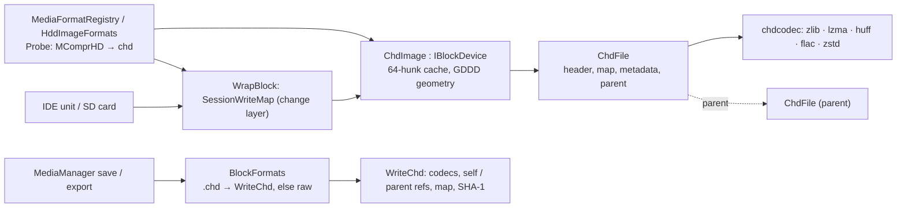

# CHD as a shared media format: design

Glossary: **hunk** = the CHD unit of compression (4 KB = 8 sectors from `chdman createhd`);
**codec** = a compression method; **parent / child** = a child CHD stores only the hunks that
differ from its parent; **change layer** = the media manager's `SessionWriteMap`, where guest
writes live until a save.

## 1. Owner decisions

1. CHD is a **shared** block format: every IDE unit and SD card slot of every machine takes it.
   One implementation behind the format registry; slots and machines do not know about it.
2. Reads come from the CHD (parents included), writes go to the change layer, and `save` /
   `export` write any supported block format, CHD included.
3. Every hard-disk sub-format, read **and write**: v5 (v3 / v4 read), uncompressed and compressed
   with every hard-disk codec MAME uses (zlib, lzma, huff, flac, zstd), parent / child, metadata,
   SHA-1 / CRC validation. CD codecs only if the CD slot path is in scope (it is not: §8).
4. Vendor third-party code only when own code would be hard or long, with a GPL-3-compatible license.

## 2. Own code or vendored

| Piece | Decision | Why |
|---|---|---|
| Container: header v3-v5, map (uncompressed and the Huffman-coded v5 map), metadata, parents, SHA-1 | **own** (`ChdFile`, `WriteChd`) | a few hundred lines; libchdr reads only, MAME's `chd.cpp` drags its `util::` file / thread layer |
| `zlib` | **existing vendored miniz 3.1.2** (MIT): raw deflate both ways | already in the tree |
| `lzma` | **existing vendored LZMA SDK 19.00** (public domain), the SDK MAME uses | a CHD LZMA stream has no header: decoder properties are derived from the encoder's (level 6, dictionary = hunk), so the same SDK is the safe choice |
| `zstd` | **existing vendored zstd 1.5.7** (BSD-3-Clause) | already in the tree |
| `huff` | **own** (`chdhuffman`) | ~400 lines; the format is MAME's canonical code layout and two table encodings |
| `flac` | **own** decoder (full frame syntax: LPC, Rice2, wasted bits, CRCs) and own encoder (fixed predictors, stereo decorrelation) | libFLAC is ~40 C files with CPU-specific variants: a warning and portability burden on four compilers for one codec. The decoder reads every frame libFLAC writes (tested on chdman's files); the encoder writes valid frames that libFLAC reads (chdman verify), less compact than libFLAC's |
| CRC-16 (CCITT), CRC-32, SHA-1 | own CRC-16; miniz `mz_crc32`; digestpp SHA-1 (public domain, already vendored) | |

No new third-party code. MAME's sources (BSD-3-Clause) are the format reference;
`THIRD_PARTY_NOTICES.md` says so. Nothing is copied verbatim; the map coder follows MAME's
`compress_v5_map` / `decompress_v5_map` step by step because that order *is* the format.

## 3. Components

| File | Role |
|---|---|
| `core/src/emulator/io/storage/chd/chdutil.*` | big-endian fields, MSB-first bit streams, CRC-16 / CRC-32, SHA-1 |
| `chdhuffman.*` | length-limited canonical Huffman codes, RLE and Huffman-coded tables, the `huff` codec |
| `chdflac.*` | FLAC frames |
| `chdcodec.*` | the codecs by tag; codec-list parsing (`none`, `default`, `lzma,zlib,...`) |
| `chdfile.*` | reading: v3 / v4 / v5, every hunk type, parents (found by SHA-1 next to the child), `Verify` |
| `chdwriter.*` | writing v5, uncompressed or compressed, children, reuse of stored hunks; `GDDD` helpers, chdman's geometry guess |
| `chdimage.*` | the block device (read-only), hunk cache, `NativeGeometry` from `GDDD`, 512-byte sectors only |
| `core/src/emulator/media/blockformats.*` | save / export of block media in the target's format, the change-layer base swap |

## 4. Layers and write-back

- **Insert**: `Probe` sees `MComprHD` → format `chd`; `OpenBlock` gives a `ChdImage`. Access
  `session` (the default) or `readonly`; a `writethrough` request (the IDE default) becomes
  `session` with a note in the reply, because a compressed file cannot take sector writes and an
  uncompressed one is MAME's to own.
- **Guest writes** go into `SessionWriteMap` (the existing change layer; media history H1-H5 will
  replace it with the versioned one, and CHD needs nothing new for that: it is a read-only source).
  The CHD file is never touched before `save`.
- **Save** (own file): `WriteChd` writes the whole file again to `<file>.writing` with the
  source's codecs, hunk size and metadata; a hunk with no changed sector keeps its stored bytes
  (`WriteOptions::reuse` — no second compression, chdman's FLAC frames stay libFLAC's); a child
  stays a child of the same parent. Then the old `ChdImage` is closed (Windows cannot replace an
  open file), the temporary file is renamed over the source, a new `ChdImage` goes under the
  change layer (`SessionWriteMap::ReleaseBase` / `SetBase`) and the layer is emptied. If the rename
  fails, the old file is opened again and the changes stay.
- **Save** of a raw / HDF / HDI / VHD file in session access: the changed sectors are written in
  place through a second handle, then the base is opened again (stale buffers).
- **Save to a path**: the same writers, then the medium stands for the new file (format, source,
  `SourceChanged` to the slot).
- **Export**: `.chd` → `WriteChd` (default codecs: the source CHD's, else chdman's
  `lzma,zlib,huff,flac`; `compression`; `parent` = a child of that CHD); any other extension → a
  raw image. The medium keeps its changes.
- Compressed CHDs carry the data SHA-1 and the overall SHA-1; uncompressed ones leave them zero, as
  MAME does (MAME writes into them).

## 5. Surfaces

The one verb layer (`MediaControl`) takes `compression` on `save` and `export`, and `parent` on
`export`; every surface passes options through: WebAPI (OpenAPI body properties added), MCP
(`MediaToolActions` mirrors `OptionsFor`, checked by `McpSlots_Test`), CLI (`--compression`,
`--parent` take a value), Lua and Python (option tables). `targets` classifies a CHD by its header:
hard disk first, SD card too. `formats` lists `chd` for block slots; the GUI's file filters come from
the same list.

Verified on a live build over the WebAPI (2026-10-02): `targets` on ZX-Evo lists `ide0.master`,
`sd.zc`, `sd.ngs`; insert into `sd.zc`; export with `compression: zstd` and with `parent`; a bad
codec is `bad-request`; `save` with `compression: lzma`; `chdman verify` passes on the results.

## 6. Performance

`BM_*` in `core/benchmarks/emulator/io/chdimage_benchmark.cpp` (Apple M-series, Release):

| Case | Cost |
|---|---|
| sector read, raw image (file read per sector) | 1.36 µs |
| sector read, CHD (uncompressed or chdman default), sequential | 16 ns (7 of 8 sectors from the hunk cache) |
| hunk decode on a cache miss | none 1.4 µs, zstd 20 µs, zlib 27 µs, huff 38 µs, flac 49 µs, lzma 75 µs |
| write 256 KB | none 1.3 ms, zlib 8, huff 7, lzma 18, zstd 18, flac 22, default set 42 ms |

A CHD costs the emulation nothing measurable: a DOS reads a hunk's sectors in a row, and even an
LZMA miss is 75 µs for 4 KB. Writing is single-threaded (§8).

## 7. Tests

| Test | Covers |
|---|---|
| `ChdFile_Test` | every chdman codec read against `mixed.img`, codec actually used, self refs, `Verify`; child + parent (found by SHA-1, wrong parent refused, missing parent refused); damaged hunk (CRC), damaged map (CRC-16), cut-short files, not a CHD, v2 refused; hand-built v3 and v4 files with every v3/v4 hunk type and CRC-32; CD / A/V CHDs refused |
| `ChdHuffman_Test`, `ChdFlac_Test`, `ChdCodec_Test` | round trips, length limit, single symbol, every stereo mode, short blocks, CRCs, codec lists |
| `ChdWriter_Test` | every codec written and read back, uncompressed layout as chdman's, children (compressed and uncompressed), CHD → img → CHD byte-identical, reuse on save, geometry; **`ChdmanAcceptsEveryVariant`** (with `UNREAL_CHDMAN`): `chdman verify`, `info`, `extracthd` on ten variants |
| `ChdImage_Test` | sectors, geometry, the cache (one decode per hunk), 512-byte sectors only |
| `BlockFormats_Test` | insert (WriteThrough → session), file untouched, save (codecs kept, stored hunks reused, `compression`), child save, export to raw / CHD of any codecs / child, raw save in place, save-as rebases |
| `MediaControl_Test.ChdOnTheSharedVerbs`, `MediaTargets_Test` | targets, insert into ZX-Evo `sd.zc`, export / save options |
| `ZXEvoErs_Test.SdCardBootFromAChd` | the real ERS boots `SD_BOOT.$C` from a compressed CHD in the SD slot |
| `SprinterBoot_Test.Dss162_BootsFromAChdAndSavesTheGuestWrites` | ACC-4 disk as a compressed CHD: DSS 1.62 boots, `MKDIR` stays in the layer, `save` writes it into the CHD |
| `SprinterBoot_Test.RealHdd_Dss171BootsFromTheMamePackChd` | (`UNREAL_SPRINTER_HDD_CHD`) MAME's `sp_hdd_sys.chd` as is: DSS 1.71.57 on BIOS 3.06 in 0.4 s; the file is not written |

Fixtures: `testdata/media/chd/` from `tools/chd/make-test-fixtures.py` (chdman 0.289).

## 8. Out of scope, follow-ups

- **CD-ROM CHDs** (`cdlz`, `cdzl`, `cdfl`, `cdzs`, `CHT2` track metadata): the CD slot path takes
  ISO 9660 images only; a CD CHD is refused with the reason. The codecs are thin wrappers over the
  ones here (data + subcode split); the work is the track layout (2352 / 2448-byte frames, mode 1 /
  mode 2) in front of the 2048-byte ATAPI block device.
- **Multi-threaded writing**: compression runs on one thread (~6 MB/s with chdman's default set on
  data; zero hunks cost nothing). MAME compresses hunks on a thread pool.
- **LPC in the FLAC encoder**: smaller `flac` hunks; only matters when FLAC wins (audio-like data).
- **Writable uncompressed CHDs in place** (MAME's own behavior) is not offered: the change layer +
  save covers it without two writers of one file.
- Media history H1-H5 replaces `SessionWriteMap`; a CHD stays a read-only source under it.
