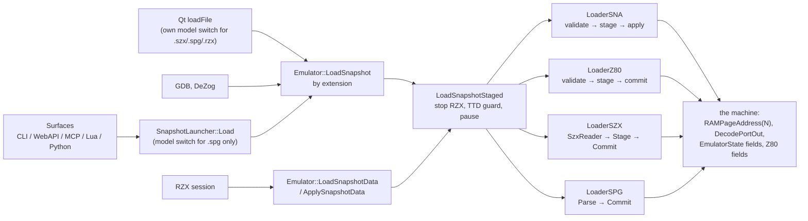
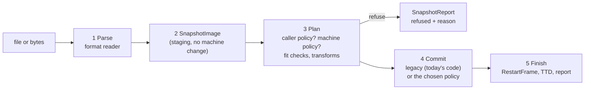

# One snapshot pipeline for every machine and every format

| | |
|---|---|
| **Date** | 2026-10-02 |
| **Status** | Proposal (documents only, no code). Owner questions in [§11](#11-open-questions) |
| **Plan** | [PLAN.md](../PLAN.md) row **#84** (T3, owner: lower priority); progress in [TODO.md](TODO.md) |
| **First user** | the Sprinter ZX mode, phase Z5 ([tdd-zx-mode.md](../2026-09-28-sprinter/tdd-zx-mode.md) §3.5, §9, Q4) |
| **Related** | SZX design ([2026-09-29-szx-snapshots/design.md](../2026-09-29-szx-snapshots/design.md), the stage-then-commit pattern this proposal generalizes), RZX playback (`core/src/emulator/rzx/`), `MachineStateTransfer` (`core/src/loaders/snapshot/machinestatetransfer.*`), the TTD sealed-replay rule |

> **In one line.** Every snapshot format is first read into one neutral, in-memory picture of a
> Spectrum (the *snapshot image*). Before anything in the running machine changes, the machine (or
> the caller) may say "I commit this myself" or "this cannot load here, because ...". If nobody
> speaks up, the image is committed exactly the way it is today. Saving runs the same road backwards.

## Contents

- [1. The owner's idea and what this proposal makes of it](#1-the-owners-idea-and-what-this-proposal-makes-of-it)
- [2. Today: inventory](#2-today-inventory)
- [3. Problem cases](#3-problem-cases)
- [4. Design](#4-design)
- [5. Worked examples](#5-worked-examples)
- [6. Save path](#6-save-path)
- [7. TTD](#7-ttd)
- [8. Automation surfaces](#8-automation-surfaces)
- [9. Zero behavior change and tests](#9-zero-behavior-change-and-tests)
- [10. Migration plan](#10-migration-plan)
- [11. Open questions](#11-open-questions)
- [12. Side findings](#12-side-findings)
- [13. Glossary](#13-glossary)

---

## 1. The owner's idea and what this proposal makes of it

Owner, 2026-10-02 (translated): *"A pipeline: the loader parses the format and loads into STAGING, then
checks whether anyone wants to intervene. If nobody does, the commit goes the legacy (standard) way; if
someone does, some transformation is applied. Or we have several kinds of commit, and the caller provides a
callback or otherwise says how it wants the commit done instead of the standard one. Everyone should get
this in a unified way."*

Both variants in the idea fit one mechanism:

| Owner's words | In this design |
|---|---|
| "loads into staging" | the parser fills a `SnapshotImage` (§4.2); nothing in the machine changes |
| "checks whether anyone wants to intervene" | the **plan** step asks, in a fixed order, the caller, then the machine (§4.4) |
| "if nobody does, the legacy way" | `LegacyCommit`: the code that commits today, unchanged (§4.3) |
| "some transformation is applied" | a policy may rewrite the image (image → image, pure and testable) and then hand it to the legacy commit, or commit it itself |
| "several kinds of commit, the caller says which" | named policies in one registry; the caller passes `commit=<name>` or, inside the core, a function (§4.5) |
| "everyone gets it in a unified way" | one entry point in the core; all five automation surfaces and Qt reach it with the same options and get the same report (§8) |

## 2. Today: inventory

Code of `master` at `8130fee8e`. Paths are repository-relative; line numbers are approximate pointers.

### 2.1 One entry point already exists, but each format commits on its own



| Piece | Where | What it does |
|---|---|---|
| `Emulator::LoadSnapshot` | `core/src/emulator/emulator.cpp:1445` | picks the loader by extension (`sna`, `z80`, `szx`, `spg`; `rzx` → `PlayRzx`) |
| `Emulator::LoadSnapshotData` / `ApplySnapshotData` | `emulator.cpp:1569`, `:1589` | the same from bytes in memory (RZX start and in-recording snapshots); also accepts `zxs` |
| `Emulator::LoadSnapshotStaged` | `emulator.cpp:1632` | common wrapper: stop RZX, TTD guard + `InvalidateSession("snapshot-load")`, pause, run the loader, `RestartFrame()`, resume, `NC_FILE_LOADED`. It does **not** stage machine state; each loader does |
| `Emulator::SaveSnapshot` | `emulator.cpp:1776` | `sna` / `z80` / `szx` writers; no TTD guard |
| `SnapshotLauncher::Load` | `core/src/loaders/snapshot/snapshotlauncher.cpp:31` | shared by CLI, WebAPI, Lua, Python; switches the model only for `.spg` (`RequiredModel` :15) |
| `MediaTargets::Classify` | `core/src/emulator/media/mediatargets.cpp:184` | the only content sniffing (`ZXST`, `RZX!`), else by extension |
| Qt `MainWindow::loadFile` | `unreal-qt/src/mainwindow.cpp:2197` | probes `.szx` / `.spg`, switches the model itself, then `LoadSnapshot` (:2303) |

### 2.2 Formats

| Format | Files | Staging | What the commit writes | Model check today |
|---|---|---|---|---|
| **SNA 48 / 128** | `core/src/loaders/snapshot/loader_sna.cpp` (`load` :55, `validate` :73, `loadToStaging` :237, `applySnapshotFromStaging` :431, `save` :929) | yes, private `_memoryPages[8]` | `core.Reset()`; RAM via `LoadRAMPageData(page)` (= `RAMPageAddress`); Z80 fields directly; 48K: banks 5/2/0, `SetROM48k`, PC popped from the stack, **#7FFD not written (no lock)**; 128K: `UnlockPaging`, `DecodePortOut(#7FFD)` then `p7FFD = v`, TR-DOS flag → `CF_TRDOS` + `SetROMDOS`; border via `pFE`, `border_attr`, `FillBorderWithColor`. No AY, #1FFD, #EFF7 (not in the format) | **none** |
| **Z80 v1 / v2 / v3** | `loader_z80.cpp` (`load` :38, `validate` :330, `stageLoad` :422, `commitFromStage` :457, hardware table `getMemoryModeV2` :1049 / `V3` :1082, `resolveSnapshotPage` :1420, `save` :55) | yes, `_stagingRAMPages[]` | `core.Reset()`; 48K: banks 5/2/0, `SetROM48k`, `DecodePortOut(#7FFD, #30)` (locked, ROM 1); 128K / 256K: `DecodePortOut(#1FFD)` **only on +2A / +3 / Scorpion / ProfScorp**, `DecodePortOut(#7FFD)`, `DecodePortOut(#FFFD)`; AY 0 via `getAYChip(0)->writeRegister` ×16; RAM `memcpy(RAMPageAddress(n))`; registers struct copy; v3 T-state → frame position | **none**; hardware byte only picks 48K / 128K / 256K; "modified hardware" bit ignored; SamRam and ROM blocks `throw std::logic_error` (:536, :570) |
| **SZX** | `core/src/loaders/snapshot/szx/` (`SzxReader::Parse`, `LoaderSZX::Commit` :152, `ApplyPaging` :274, `ApplyCpu` :323, `ApplyMedia` :507, `ApplyDevices` :599, `Capture` :832; machine table `szxformat.cpp:11`) | yes, `szx::Stage`; a per-block `szx::Report` | RAM `LoadRAMPageData` (pages beyond the RAM size skipped); `DecodePortOut(#EFF7)` (Pentagon 1024), `#1FFD` (+2A / +3 / Scorpion), `#7FFD`; exact CPU incl. MEMPTR, Q, HALT, EI shadow, frame position; AY 0; Beta 128 registers; media (BDSK, DSK, TAPE); GS, Covox, mouse | **refuses** another model ("create a Pentagon 512K to load it"); Scorpion on ProfScorp and a smaller Pentagon on a bigger one allowed with a warning |
| **SPG** (TS-Conf program) | `loaderspg.cpp` (`Probe` :34, `Parse` :52, `Commit` :125) | yes | TS-Conf registers via `WriteRegister` (MemConfig, Page1-3, SysConfig), `p7FFD = #10`, RAM by **physical byte address** (`RAMBase() + addr`), CPU defaults | refuses unless TS-Conf; launcher and Qt switch to `TSL` |
| **ZXP** (ZX-Poly, four modules) | `loaderzxp.cpp` (`Apply` :134), called by `ZXPolyGroup::LoadZXP` (`core/src/emulator/zxpoly/zxpolygroup.cpp:301`) | yes, all four contexts checked first | per module: `core.Reset()`, `LoadRAMPageData`, CPU, `DecodePortOut(#7FFD)`, border; then the group latches `#3D00` and the module registers | none (128K-compatible assumed) |
| **RZX** start snapshot and in-recording snapshots | `core/src/loaders/rzx/rzxreader.cpp:163`, `rzxsnapshot.cpp` (`DetectSnapshotMachine` :63, `MachineMatches` :133), `core/src/emulator/rzx/rzxsession.cpp` (`LoadStartSnapshot` :331, `ApplyRecordedSnapshot` :344) | through `LoadSnapshotData` | as the inner format | refuses with `ModelMismatch`; `RzxLauncher` and Qt switch the model |
| **TTD** checkpoints / `.ttd` session | `core/src/debugger/ttd/timetravelmanager.cpp` (`RestoreCheckpoint` :1434, `DeserializeSession` :3936) | — | full native state, no port decoder involved | refuses another model or ROM set |
| **MachineStateTransfer** (instance → instance, no file) | `core/src/loaders/snapshot/machinestatetransfer.cpp` (`Check` :903, `Apply` :921, `ApplyCrossPaging` :716) | in memory | same model: full TTD capture / restore; across models: replays #1FFD / #EFF7 / #7FFD, sets the Pentagon 1024 compatibility bit | explicit check, refusal with a reason |

No loader exists for `.sp`, `.zx`, `.ach`, `.prg`, `.slt`, `.sit`, `.snx`.

### 2.3 Savers

| Format | Where | Notes |
|---|---|---|
| SNA | `loader_sna.cpp:929` | writes straight from the live machine; 48K vs 128K chosen by the #7FFD lock bit; `captureStateToStaging` :675 and `save*FromStaging` :785 / :858 exist but only tests call them |
| Z80 | `loader_z80.cpp:55` | live → staging → always v3; model code by machine (+2, +2A, +3, Pentagon, Scorpion, 128K; Pentagon 512 / 1024 saved as Pentagon 128 with a warning) |
| SZX | `loaderszx.cpp:108` (`Capture` → `SzxWriter`) | refuses models without an SZX id; also the RZX seek keyframe store (`rzxsession.cpp:414`) |
| SPG, ZXP, RZX | — | no writer |

### 2.4 Automation entry points

| Surface | Load | Save | Path into the core |
|---|---|---|---|
| CLI | `snapshot load <file> [--no-switch]` (`core/automation/cli/src/commands/cli-processor-snapshot.cpp:59`) | `snapshot save <file> [--force]` (:151) | `SnapshotLauncher::Load` / `SaveSnapshot` |
| WebAPI + OpenAPI | `POST /api/v1/emulator/{id}/snapshot/load` `{path, switch_model}` or upload (`core/automation/webapi/src/api/snapshot_api.cpp:32`); `POST .../snapshot/transfer` | `POST .../snapshot/save` `{path, force}` (:197) | same; OpenAPI text in `core/automation/webapi/src/openapi/openapi_snapshot.inc` |
| MCP | `load_software` (`core/automation/mcp/src/mcp-tools.cpp:525`) → WebAPI load; `emulator_manage` `transfer_state` | only through `invoke_api` | WebAPI |
| Lua | `emu:snapshot_load(path)` (`core/automation/lua/src/emulator/lua_emulator.h:1817`) | `snapshot_save` (:1937) | `SnapshotLauncher::Load` / `SaveSnapshot` |
| Python | `unreal.snapshot_load(path, emulator_id, switch_model)` (`core/automation/python/src/emulator/python_emulator.h:550`), `Emulator.snapshot_load` (:1387) | `Emulator.snapshot_save` (:1401) | same |
| Qt | File > Open, Open Snapshot, drag and drop, command line → `loadFile` | Save as .sna / .z80 (no SZX menu item) | `Emulator::LoadSnapshot` directly, own model switch |
| GDB, DeZog | `gdbserver.cpp:823`, `dezogdebugadapter.cpp:784` | DeZog `:759` (a temporary `.sna`) | `Emulator::LoadSnapshot` / `SaveSnapshot` directly |

**TTD today.** A load is refused while a user recording runs (`TimeTravelManager::RecordingGuard`,
`timetravelmanager.cpp:842`); otherwise the whole TTD session is dropped (`InvalidateSession`, :440). A load is
not an event in the journal and creates no checkpoint (`TTDExternalEventKind` has no snapshot kind,
`core/src/debugger/ttd/ttdexternalevents.h:65`).

### 2.5 Mismatch policy today, in one table

| Format | 128K file on a 48K machine | 48K file on a 128K / Pentagon | File for another clone (ATM, Evo, TS-Conf, Sprinter) |
|---|---|---|---|
| SNA | loads; pages 0-7 written to physical pages the 48K never shows | loads; #7FFD stays unlocked after reset | loads into physical pages 0-7 whatever they mean there |
| Z80 | same as SNA | loads; #7FFD = #30 (locked, 48K ROM) | same as SNA |
| SZX | refused, both models named | refused | refused (no SZX id) |
| SPG | n/a | n/a | refused unless TS-Conf |
| RZX | refused (`ModelMismatch`), launcher may switch | refused, launcher may switch | refused |

The gap: `Memory::RAMPageAddress(n)` (`core/src/emulator/memory/memory.cpp:1351`) only checks
`n < MAX_RAM_PAGES` (256), not the configured RAM, and nothing asks the machine whether "page n" means
"Spectrum 128 bank n" on it.

## 3. Problem cases

"Identity" below means: physical RAM page *n* (`RAMPageAddress(n)`) is Spectrum 128 bank *n*, so the
legacy commit is right as long as the paging registers are in their 128K form.

| Case | Today | What a correct commit needs | Who should decide |
|---|---|---|---|
| **Sprinter** | **wrong**: SNA / Z80 write physical pages 0-7, which are Sprinter system pages; nothing refuses (Sprinter TODO, Z5) | Spectrum bank *n* lives in the RAM page the BIOS stored in PLD cell `#F0 + n` (`#F8+` for 8-15); #7FFD through the Sprinter decoder (PLD clean rules); refuse outside ZX mode, refuse a 128K file in a 48K-locked mode ([tdd-zx-mode.md](../2026-09-28-sprinter/tdd-zx-mode.md) §3.5). The Spectrum screen is a shadow copy in video RAM (`sprintermemory.h:30`), so RAM must be written through the path that keeps the copy in step | machine policy `sprinter-zx` |
| **ZX-Evo / BaseConf (`ATM3`)** | identity only when the pager (`pFFF7[]`, `aFF77`) is in 128K form; `core.Reset()` deliberately leaves `aFF77` / `pFFF7` alone, and with `#EFF7` bit 2 = 0 (1 MB mode) #7FFD bits 5-7 extend the page | set the pager to the 128K form (the `RM_DOS` boot defaults: `aFF77 = #4300`, `pFF77`, `pFFF7[]` = `#101, #205, #202, #200` twice), `#EFF7` bit 2 = 1 and bit 3 = 0, `evoWrProt = 0`, no NMI / trdemu page | machine policy (ATM family) |
| **ATM710** | as ZX-Evo without `#EFF7` | pager in 128K form | same policy |
| **ATM450** | identity when `aFE` bit 7 = 1 and `aFB` CPSYS = 0 | set those two latches | same policy family |
| **TS-Conf (`TSL`)** | the reset value of MemConfig (`#04`) leaves window 0 unmapped (TS-BIOS); `p7FFD` alone does nothing, the decoder's `Write7FFD` / registers decide | MemConfig mapped (`W0NoMap = 0`) and `Lck128` in 128K mode, Page0-3 and VPage through `WriteRegister` / `ApplyState`; the SPG loader already does it this way | machine policy `tsconf` (SPG keeps its own commit) |
| **Profi** | reset boots the service ROM with `CF_TRDOS` on; `pDFFD = 0` | `pDFFD = 0`, `CF_TRDOS` from the file only; identity holds | likely legacy is enough: verify in P0 |
| **Pentagon 1024** | reset sets `pEFF7 = 0`, which enables 1 MB paging: a 128K file with #7FFD bit 5 set (the lock) then maps page 32 + n instead of locking (decoder `switchRAMPage`). SNA / Z80 never write #EFF7; SZX and `MachineStateTransfer` do | set the `#EFF7` 128K-compatibility bit for any 128K file | shared transform `pentagon1024-compat` (probable defect: P0 proves it with a test first) |
| **Scorpion / ProfScorp** | identity; Z80 256K and SZX handle #1FFD | — | legacy |
| **+2A / +3** | identity; SNA cannot carry #1FFD (format), Z80 v3 and SZX can | — | legacy |
| **ZX-Poly** | `.zxp` has its own group loader; a plain SNA / Z80 on a ZX-Poly group goes to one instance | group-level commit: master only + replicate (`CopyMasterState`, `zxpolygroup.cpp:480`), or refuse | group policy `zxpoly`; owner question Q7 |
| **Spec256** | not in the codebase | nothing now; the image's extension chunks (§4.2) can carry its extra planes later | — |
| **48K file on a 128K / Pentagon** | SNA leaves #7FFD unlocked, Z80 locks it (#30): the two formats disagree | one shared transform `48k-on-128k` (owner question Q2) | shared transform |
| **128K file on a 48K** | loads into pages the machine never shows; the program crashes later | refuse with the reason; accept a 128K file whose #7FFD is locked with bank 0 at the top (it is a 48K state in disguise), committing banks 5 / 2 / 0 only | shared fit check (owner question Q1) |
| **SZX block the machine lacks** | SZX already reports "Ignored" per block | the same report for every format (`SnapshotReport`) | shared |

## 4. Design

### 4.1 The road a load takes



1. **Parse.** The format reader checks the file and fills a `SnapshotImage`. It never touches the machine.
   Today's readers stay (SNA `validate` + `loadToStaging`, Z80 `stageLoad`, `SzxReader`, SPG `Parse`);
   they gain one output: the image.
2. **Image.** Format-neutral, see §4.2.
3. **Plan.** Decides who commits and whether the load is allowed (§4.4). May rewrite the image through
   *transforms* (image in, image out, no machine access).
4. **Commit.** Writes the machine. The default is `LegacyCommit`, which is the existing code of each format.
5. **Finish.** As `LoadSnapshotStaged` does today (`RestartFrame()`, resume, notifications), plus the
   report returned to the caller.

The pause, TTD guard and RZX stop of `LoadSnapshotStaged` stay where they are; the pipeline runs inside them.

### 4.2 `SnapshotImage`

A plain data record, filled by a parser or by a capture (§6). Worked example values are for
`testdata/loaders/sna/action.sna` (a 128K SNA).

| Field | Meaning | `action.sna` |
|---|---|---|
| `format`, `formatVersion`, `sourcePath` | where it came from | `sna`, `128`, path |
| `machineHint` | what the file says it was made on: `48k`, `128k`, `plus2`, `plus2a`, `plus3`, `pentagon128/512/1024`, `scorpion256`, `tsconf`, `zxpoly`, or `unknown` plus the raw id (Z80 hardware byte + modified bit, SZX machine id) | `128k-family` (an SNA does not say more) |
| `memoryModel` | `48k` (banks 5, 2, 0 only), `128k` (banks 0-7), `extended` (more than 8 banks, with the scheme: Pentagon 512 / 1024, Scorpion 256, ...), `physical` (absolute addresses, SPG) | `128k` |
| `banks[n]` | 16 KB per **logical** bank *n*, in the 128K sense, plus a "present" flag | banks 0-7 present |
| `romBlocks` | ROM images the file carries (Z80 blocks 0-2, SZX ROM), reported, not written by default | none |
| `paging` | `p7FFD`, `p1FFD`, `pEFF7`, `pDFFD`, each with "present in the file" | `p7FFD = #14`; others absent |
| `trdosPaged` | the TR-DOS ROM was paged in | false |
| `cpu` | registers, IFF1 / IFF2, IM, and, when the format has them, MEMPTR, Q, HALT, the EI shadow | PC `#D055` etc.; MEMPTR absent |
| `framePosition` | T-state in the frame, when the format stores it (Z80 v3, SZX) | absent |
| `border` | 0-7 | from the header |
| `ay[]` | per chip: 16 registers + selected register | absent in SNA |
| `timingHints` | ULA / frame family when known (48K, 128K, Pentagon) | 128K family |
| `extensions[]` | anything else, each with **origin** (format + block id) and a typed payload: SZX B128, BDSK, TAPE, GS, COVX, AMXM, KEYB, ...; ZX-Poly module registers; TS-Conf registers; future Spec256 planes | none |
| `warnings[]` | parse notes ("libspectrum <= 0.5.0, A/F swapped") | none |

Rules: logical banks, not physical pages, so a 48K file holds banks 5, 2, 0 and a Z80 48K block 8 becomes
bank 5. Formats that only know physical addresses (SPG) say so with `memoryModel = physical`, and only a
policy that understands them may commit them. The image owns its data (vectors), so it can be kept,
compared, written by another writer, or attached to a report.

### 4.3 Commits

| Commit | What it is | Used when |
|---|---|---|
| `LegacyCommit` | the existing per-format commit (SNA `applySnapshotFromStaging`, Z80 `commitFromStage`, SZX `Commit`, SPG `Commit`) | nobody intervenes: every machine today, so behavior does not change |
| a machine policy's commit | code owned by one machine, e.g. `SprinterZxCommit` | the machine says "mine" |
| a named policy's commit | registered by name, e.g. `zxpoly-master-replicate` | the caller asks for it |

In the first steps, `LegacyCommit` keeps reading each loader's private staging (the image is built
next to it), so not one line of today's commit code changes. Moving the legacy commits to read the image
is a later clean-up step (P9) with the golden tests of P0 as the guard.

### 4.4 Plan: who commits, in what order

```text
Plan(image, machine, options):
  1. options.commit == "legacy"           -> LegacyCommit (explicit opt-out, for comparison runs)
  2. options.commit == "<name>"           -> that registered policy; unknown name -> refuse
     options.callback (core callers only) -> that function
  3. machine policy exists                -> ask it: Verdict = Take | Transform | Decline | Refuse
  4. shared fit checks (Q1, Q2)           -> Refuse or Transform
  5. otherwise                            -> LegacyCommit
```

The machine policy interface (C++ sketch, names illustrative):

```cpp
struct SnapshotVerdict {
    enum class Kind { Decline, Take, Transform, Refuse } kind;
    std::string reason;            // shown to the user on Refuse, logged otherwise
    std::string needs;             // machine-readable, e.g. "zx_mode", "model:PENTAGON-512"
};

class ISnapshotCommitPolicy {
public:
    virtual ~ISnapshotCommitPolicy() = default;
    virtual std::string Name() const = 0;                       // "sprinter-zx"
    virtual SnapshotVerdict Examine(const SnapshotImage&, const Emulator&) const = 0;
    virtual void Transform(SnapshotImage&) const {}             // image -> image, no machine access
    virtual bool Commit(const SnapshotImage&, Emulator&, SnapshotReport&) = 0;  // only for Take
};
```

- `Decline`: "not my business", continue with step 4 and 5. Every machine without a policy behaves as if
  it declined.
- `Transform`: rewrite the image, then continue (the transformed image goes to the legacy commit).
  Example: `48k-on-128k` (Q2) only sets `p7FFD = #30` in the image, which the legacy commit already
  knows how to write. The ATM-family policy cannot be a transform: putting the pager into its 128K form is
  not something the image or the legacy commit can express, so it uses `Take` (its own commit, which may
  call the legacy commit after setting the pager).
- `Take`: the policy commits itself.
- `Refuse`: nothing is written; the reason goes back to the caller.

**Where the machine policy lives.** The port decoder answers `GetSnapshotPolicy()` (default `nullptr`),
because the decoder is what differs per model and already knows its paging; the policy itself is a separate
class in the machine's folder (`core/src/emulator/ports/models/sprinter/sprinterzxsnapshot.*`), so decoders
stay small (owner question Q3).

**Named policies** live in one registry (`SnapshotPolicies::Register(name, factory)`), so the same name means
the same thing on every surface. Initial names: `legacy`, `sprinter-zx`, `zxpoly-master-replicate`
(Q7). A caller-supplied function is only for C++ callers inside the core (tests, RZX, ZX-Poly group,
`MachineStateTransfer`): automation scripts pick names, they never run code inside the commit, because the
commit runs on a paused emulation thread (owner question Q4).

### 4.5 Validation and refusal

Checks run in Plan, before anything is written, and each refusal names the reason and, when one exists,
what would work:

| Check | Example message |
|---|---|
| bank beyond the machine's RAM | "the snapshot uses 128K bank 6; a ZX Spectrum 48K has no such bank: load it on a 128K machine or a Pentagon" |
| machine policy refusal | "the Sprinter is at the DSS prompt, not in Spectrum mode: start `spectrum p128.zx` first" (`needs: zx_mode`) |
| model required by the format (SZX, SPG, RZX) | today's SZX text, unchanged |
| unknown named policy | "no snapshot commit policy named 'sprinter'; known: legacy, sprinter-zx, ..." |
| ROM blocks / SamRam (Z80) | "Z80 snapshots with ROM blocks are not supported" (today an uncaught `std::logic_error`, §12) |

`SnapshotReport` generalizes `szx::Report`: the chosen commit (`legacy`, `sprinter-zx`, ...), the verdict
chain (who was asked, what each said), per item `applied / approximated / ignored / refused`, the
`machineHint`, and warnings. Every surface returns it.

## 5. Worked examples

**a) `action.sna` on a Pentagon 128 (the everyday case).** Parse: 128K SNA, banks 0-7, `p7FFD = #14`.
Plan: no option, the Pentagon 128 decoder has no policy, fit checks pass (8 banks, 128K RAM) →
`LegacyCommit`. The machine ends in the same state, byte for byte, as on `master` today; the report says
`commit: legacy`.

**b) `action.sna` on a Sprinter in `P128.ZX` mode (4 MB board).** Plan: the Sprinter decoder returns
`SprinterZxCommit`; `Examine` sees the ZX mode active and #7FFD paging enabled → `Take`. Commit: bank 3
goes to the RAM page in cell `#F3` (the BIOS wrote `#F0-#F7` = `#9F, #9E, ..., #98`, so bank 3 → `#9C`),
#7FFD = `#14` through `PortDecoder_Sprinter::DecodePortOut`, border, registers, PC = `#D055`. The screen
matches the Pentagon run of the same file at the same frame (T-ZX-11). Report: `commit: sprinter-zx`,
`hardware_path: false`.

**c) The same file on the Sprinter at the DSS prompt.** `Examine` → `Refuse`, `needs: zx_mode`, nothing
written. Today it would overwrite system pages 0-7 and crash DSS.

**d) A 128K Z80 on a 48K machine.** Fit check (owner question Q1, recommended): banks 0-7 present, the
machine has 5 / 2 / 0 → refuse, "load it on a 128K machine". Today it loads and crashes later.

**e) A 48K SNA on a Pentagon 1024.** Transforms (Q2 and the P1024 item): `48k-on-128k` sets
`p7FFD = #30` in the image (locked, 48K ROM, like the Z80 loader does); `pentagon1024-compat` sets
`#EFF7` bit 2 so the lock really locks. Then `LegacyCommit`. Today the SNA path leaves paging unlocked.

**f) A `.zxp` on a ZX-Poly group.** Parse: four modules → image with four CPU states and module banks as
extensions of origin `zxp`. Plan: the group policy takes it, commit = today's `LoaderZXP::Apply` across
the four contexts. Nothing changes for the user; ZXP simply goes through the same front door.

**g) An SZX with a GS block on a Pentagon without General Sound.** Unchanged: legacy SZX commit, the block
is reported "ignored", which is now the shared report shape every surface prints the same way.

## 6. Save path

The same road backwards: **capture** (machine → `SnapshotImage`) → **writer** (image → file).

| Step | Default | Machine-provided |
|---|---|---|
| Capture | `LegacyCapture` = today's code of each writer (SNA reads live state, Z80 `captureStateToStaging`, SZX `Capture`) | `ISnapshotCapturePolicy::Capture`, e.g. the Sprinter in ZX mode reads bank *n* from cell `#F0 + n` |
| Fit | the writer checks the image fits the format (SZX: an SZX machine id; SNA: at most 8 banks) and refuses with the reason, as today | — |
| Write | SNA / Z80 / SZX writers | — |

Gains: a capture can be written in any format (SZX → SNA conversion falls out), the image is directly
comparable in round-trip tests, and the 48K SNA writer no longer needs to touch live RAM (§12). Saving the
Sprinter ZX mode stays out of scope for v1 ([tdd-zx-mode.md](../2026-09-28-sprinter/tdd-zx-mode.md) §5.4);
the interface leaves room for it.

## 7. TTD

A snapshot load is an **input from outside the machine**: the sealed-replay rule says replay must never need
the file, the policy code, or the host. Today the session is dropped on load (and the load is refused during a
recording), which satisfies the rule by ending the track.

Two places a future journal could record the load:

| Level | What is recorded | Replay needs | Verdict |
|---|---|---|---|
| **Image level** | the `SnapshotImage` + the policy name | the same commit code at replay time; a fix in a policy changes old tracks | breaks "track immutable, bit-exact" |
| **Committed level** | the full machine state right after the commit, as a checkpoint (every RAM page, CPU, chipset, devices), plus a marker "snapshot `action.sna`, commit `sprinter-zx`, image hash" | nothing but the track | **recommended** |

So: P1-P7 keep today's TTD behavior (guard + drop). A later step (P8, after TTD v2 regions) can let a load
during a recording continue the track by writing a full checkpoint at the load moment, with a marker that
search can find ("when was a snapshot loaded"). The image hash in the marker lets offline tools tell which
file it was without keeping the file. Owner question Q5.

## 8. Automation surfaces

One option, the same everywhere: **`commit`** = `auto` (default: the plan of §4.4) | `legacy` | `machine` (the
machine's policy or refuse if it has none) | `<policy name>`. Plus a read-only **inspect** that runs Parse and
Plan without committing, so a script can ask "would this load here, and how?".

| Surface | Load | Inspect | Report |
|---|---|---|---|
| WebAPI + OpenAPI | `POST .../snapshot/load` `{path, switch_model, commit}` | `POST .../snapshot/inspect` `{path}` | `report` object in the reply |
| MCP | `load_software` `commit` argument | `inspect_state`-style tool action or `invoke_api` | same JSON |
| CLI | `snapshot load <file> [--no-switch] [--commit <name>]` | `snapshot inspect <file>` | printed table |
| Lua | `emu:snapshot_load(path, {commit = "..."})` | `emu:snapshot_inspect(path)` | table |
| Python | `snapshot_load(path, ..., commit="...")` | `snapshot_inspect(path)` | dict |
| Qt | unchanged (`auto`); the status bar shows the refusal reason | — | log |

Each surface's docs, the OpenAPI text, the MCP resource text and `.recipe/media/load-snapshot.md` change in
the same step (automation parity rule).

## 9. Zero behavior change and tests

**Rule:** until a step is explicitly a behavior change approved by the owner (Q1, Q2, the Pentagon 1024
fix), every machine commits through `LegacyCommit` and produces the same bytes as today.

Suites that must stay green unchanged (about 135 tests in snapshot files plus about 74 in RZX and ZX-Poly):

| File | Tests |
|---|---|
| `core/tests/loaders/snapshot/loader_sna_test.cpp` | 40 |
| `core/tests/loaders/snapshot/loader_z80_test.cpp` | 40 |
| `core/tests/loaders/snapshot/loader_z80_fuzzing_test.cpp` | 10 |
| `core/tests/loaders/snapshot/szx/loaderszx_test.cpp`, `szxreader_test.cpp` | 13 + 7 |
| `core/tests/loaders/snapshot/loaderzxp_test.cpp` | 4 |
| `core/tests/loaders/snapshot/machinestatetransfer_test.cpp` | 20 |
| `core/tests/emulator/machines/tsconf/loaderspg_test.cpp` | 5 |
| `core/tests/loaders/rzx/rzxreader_test.cpp` | 12 |
| `core/tests/emulator/rzx/rzxsession_test.cpp`, `rzxlauncher_test.cpp`, `rzxkeyframes_test.cpp` | 36 + 3 + 4 |
| `core/tests/emulator/zxpoly/zxpolygroup_test.cpp` | 31 |
| incidental users: `emulator_test`, `framelifecycle_test`, `core_golden_test`, `screenzxframes_test`, `contentionprobe_test`, the TTD corpus / divergence / TSFM / sparsity / recording-guard tests, `scroller_boot_test`, `loader_tap_test`, `loader_tzx_test`, `tsfm_render_diag_test` | — |

Plus the interop checks of `tools/verification/szx` and the RZX corpus.

**New tests**

| Id | Test | Level |
|---|---|---|
| SP-1 | **Golden commit digests** (P0): for each fixture in `testdata/loaders/{sna,z80,szx}` × each creatable model, a digest of RAM pages, paging latches, CPU, AY, border after the load on `master`; stored as expected values. Every later step must reproduce them, except rows a step changes on purpose (listed in its commit) | unit, data-driven |
| SP-2 | Parse → image: every fixture parses to the expected bank set, paging, CPU (image dumped to JSON, compared) | unit |
| SP-3 | Round trip per format and machine: load → capture → write → parse → image equal (minus what the format cannot hold) | unit |
| SP-4 | Plan order: caller name beats machine policy beats legacy; unknown name refuses; `legacy` forces legacy | unit with fake policies |
| SP-5 | Fit refusals (after Q1): 128K on 48K refused, locked 128K-on-48K accepted, banks beyond RAM refused | unit |
| SP-6 | Pentagon 1024: a locked 128K SNA maps bank *n*, not 32 + *n* (fails on `master` first, if the defect is real) | unit |
| SP-7 | Sprinter: T-ZX-11 and T-ZX-12 of the ZX-mode design | L3 / unit |
| SP-8 | ATM3, ATM710, ATM450, TS-Conf: `action.sna` loaded from the BIOS menu state and from a cold reset gives the Pentagon 128 screen digest at frame N | L3 |
| SP-9 | Each surface: `commit` option and `inspect` (WebAPI, CLI, Lua, Python; MCP smoke) | integration |

**Performance.** Not a hot path: a load happens once, on a paused machine. The image adds one copy of at
most a few hundred KB (one memcpy per bank, well under a millisecond). The only constraint: load time
must not regress noticeably; SP-1 timing is logged, no benchmark gate.

## 10. Migration plan

Small steps, each its own commit, each green on the full suite. Sizes: S = up to a day or two, M = a few
days, L = a week or more.

| Step | Content | Size | Behavior change |
|---|---|---|---|
| **P0** | Golden commit digests SP-1 for every fixture × model on `master`; tests that pin the suspected defects (P1024 lock, ATM / TS-Conf after a cold reset, 128K on 48K) as *documented current behavior* | S-M | none |
| **P1** | `SnapshotImage` + `SnapshotReport`; SNA, Z80, SZX, SPG, ZXP parsers also fill the image; `SnapshotPipeline` inside `LoadSnapshotStaged`; `LegacyCommit` = today's commit; SP-2 | M | none |
| **P2** | Plan step, `ISnapshotCommitPolicy`, the registry, `GetSnapshotPolicy()` on the port decoder (all `nullptr`); SP-4 | S | none |
| **P3** | `commit` option and `inspect` on all five surfaces, OpenAPI, MCP text, recipe; SP-9 | S-M | none (new options only) |
| **P4** | **Sprinter ZX commit** = Sprinter Z5: `SprinterZxCommit`, refusal outside ZX mode, T-ZX-11 / T-ZX-12 | M | Sprinter only (fixes a bug) |
| **P5** | Fit checks and per-machine policies, one commit each, each after the owner's answer: 128K-on-48K (Q1), 48K-on-128K (Q2), Pentagon 1024 compatibility, ATM family, TS-Conf; SP-5, SP-6, SP-8 | M (S each) | yes, per item, approved |
| **P6** | Save path: capture → image → writer for SNA / Z80 / SZX; the 48K SNA writer stops touching live RAM; SP-3 | M | none intended (SP-1 / SP-3 prove it) |
| **P7** | One model-switch orchestrator: `SnapshotLauncher` uses the image's `machineHint` for SZX, SPG, RZX alike; Qt calls the launcher instead of its own probes (Q6) | S | automation SZX loads may switch the model (Q6) |
| **P8** | TTD: a load during a recording continues the track with a full checkpoint + marker (§7), after TTD v2 regions | S-M | yes, TTD only |
| **P9** | Clean-up: legacy commits read the image instead of private staging; drop the duplicated staging and the SNA dead code; SP-1 unchanged | M | none |

P0-P4 are what the Sprinter needs (about M-L together). P5-P9 are independent and can wait.

## 11. Open questions

Each with a recommendation; asked one at a time when work starts.

1. **Q1 — 128K snapshot on a 48K machine.** Today it loads into invisible pages and crashes later.
   *Recommendation:* refuse with the reason; accept the one safe case (128K file with #7FFD locked and bank 0
   at the top: commit banks 5 / 2 / 0 only).
2. **Q2 — 48K SNA on a 128K / Pentagon.** SNA leaves #7FFD unlocked, Z80 locks it to #30. *Recommendation:*
   one shared transform that locks like Z80 does (a real 128K running a 48K program is in that state); it
   changes SNA goldens for those rows only, listed in the commit.
3. **Q3 — where the machine policy lives.** *Recommendation:* the port decoder hands it out
   (`GetSnapshotPolicy()`), the class lives in the machine's folder; no new hooks in `Memory`.
4. **Q4 — callbacks from automation.** *Recommendation:* names only on the five surfaces, plus `inspect` so a
   script can decide before loading; C++ callbacks only for core callers. Lua / Python code inside a commit
   would run on a paused emulation thread and could not be journaled for TTD.
5. **Q5 — TTD level.** *Withdrawn 2026-10-06 (owner, final):* a snapshot load does not continue a recording at all. It ENDS the
   session like a reset (TTD decision D42); a new one starts only with the `ttdrestart` feature. Nothing about a load is
   recorded on the track, so the question of image versus checkpoint no longer arises.
6. **Q6 — model switch for SZX through automation.** Qt switches the model, `SnapshotLauncher` refuses.
   *Recommendation:* one orchestrator (P7) honoring the existing `switch_model` option, so SZX behaves like SPG
   and RZX on every surface.
7. **Q7 — plain SNA / Z80 on a ZX-Poly group.** *Recommendation:* load into the master and replicate to the
   three modules (`CopyMasterState`), which is what a ZX-Poly user loading a normal game expects; a
   `commit=legacy` keeps the single-instance load.
8. **Q8 — fold `MachineStateTransfer` into the pipeline?** It already does check → apply with a report.
   *Recommendation:* later: make its source side a capture into `SnapshotImage` and its cross-model paging
   the shared transforms, so one set of rules serves files and instance transfers; not part of P0-P4.

Already decided: **2026-10-02, owner:** the Sprinter's snapshot parse/apply split (ZX-mode design Q4) is
done through this shared pipeline, at lower priority (PLAN T3).

## 12. Side findings

One line each; none is fixed by this proposal.

- `loader_sna.cpp` 48K save writes the pushed PC into live RAM (below SP) as a side effect (:1013-1030).
- `loader_z80.cpp` throws an uncaught `std::logic_error` for SamRam files (:536) and ROM blocks (:570).
- `loader_z80.cpp` ignores the "modified hardware" bit; `_modelCode` is stored, never used (the RZX code's `FromZ80Code` handles it).
- `Emulator::LoadSnapshot` rejects `.zxs`, `ApplySnapshotData` accepts it.
- `Memory::RAMPageAddress` is bounded by `MAX_RAM_PAGES`, not by the configured RAM size.
- SNA `captureStateToStaging` / `save*FromStaging` are reached only from tests.
- Qt has no "Save as .szx" menu item although the core writes SZX.

## 13. Glossary

| Term | Meaning here |
|---|---|
| **Bank** (logical) | a 16 KB piece of Spectrum 128 memory as programs see it, numbered 0-7 (more on Pentagon 512 / 1024, Scorpion) |
| **Physical page** | a 16 KB piece of the emulator's RAM array, `RAMPageAddress(n)`; equal to bank *n* on most machines, not on the Sprinter |
| **Paging latch** | a port value that selects banks and ROMs: #7FFD (128K), #1FFD (+3, Scorpion), #EFF7 (Pentagon 1024, ZX-Evo), #DFFD (Profi) |
| **Staging** | holding a parsed snapshot in memory before changing the machine, so a bad file never leaves a half-loaded machine |
| **`SnapshotImage`** | the staged snapshot in a form that does not depend on the file format |
| **Commit** | writing the image into the running machine |
| **Legacy commit** | the commit code each format has today |
| **Policy** | a named rule set that may refuse, rewrite the image, or commit it its own way |
| **Transform** | a policy step that changes only the image (for example "lock #7FFD for a 48K file") |
| **Capture** | the reverse of a commit: machine state into an image, for saving |
| **Cell table** (Sprinter) | the PLD's 64 entries that say which RAM page each Spectrum bank or ROM role uses |
| **ZX mode** (Sprinter) | the Sprinter running Spectrum software, with Spectrum banks held in BIOS-chosen RAM pages |
| **TTD** | time-travel debugging: the recorded track of a session that can be replayed exactly |
| **Sealed replay** | the rule that a replay uses only what the track recorded, never files or the host |
| **Checkpoint** | a full copy of machine state inside a TTD track |
