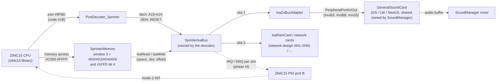
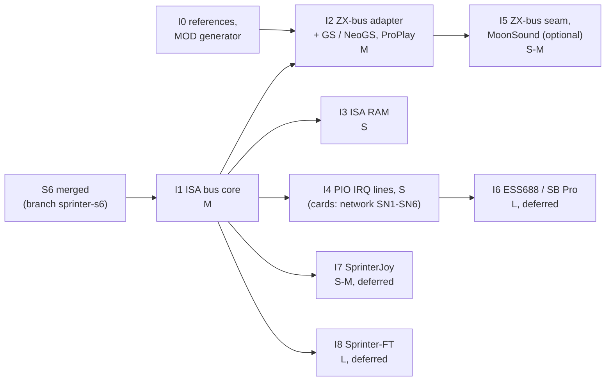

# Sprinter ISA slots: technical design

| | |
|---|---|
| **Date** | 2026-10-02 |
| **Status** | Draft for owner review; decisions needed are in [open-questions.md](open-questions.md) (the design follows each recommendation until the owner decides otherwise) |
| **Research** | [research.md](research.md) (hardware, MAME, software evidence, glossary) |
| **Parent** | [2026-09-28-sprinter](../2026-09-28-sprinter/README.md) phase S6b; the TTD id `SprinterIsa = 33` reserved in S1 |
| **Effort scale** | S < 1 week, M 1-2 weeks, L 2-4 weeks (as in [mame-gap-analysis.md](../2026-09-28-sprinter/mame-gap-analysis.md) §4) |

## Contents

1. [Goal and scope](#1-goal-and-scope)
2. [Ownership: what is Sprinter-only and what is shared](#2-ownership-what-is-sprinter-only-and-what-is-shared)
3. [Architecture](#3-architecture)
4. [The ISA bus](#4-the-isa-bus)
5. [Slot configuration](#5-slot-configuration)
6. [The ZX-bus adapter](#6-the-zx-bus-adapter)
7. [General Sound / NeoGS on the adapter](#7-general-sound--neogs-on-the-adapter)
8. [Other cards, in priority order](#8-other-cards-in-priority-order)
9. [TTD](#9-ttd)
10. [Automation surfaces](#10-automation-surfaces)
11. [Tests](#11-tests)
12. [Phased plan](#12-phased-plan)
13. [Risks](#13-risks)
14. [As built](#14-as-built)

## 1. Goal and scope

**Goal (v1).** A Sprinter user runs `PROPLAY.EXE MUSIC.MOD` from DSS and hears the MOD played by a General
Sound or NeoGS that sits on a ZX-bus adapter in ISA slot 1 - with the same pitch and tempo as MAME, recorded
and replayed exactly by TTD, and visible and controllable from every automation surface.

**In scope:** the ISA bus model with two slots, the window-3 routing, the `#9FBD` latch (address, AEN, RESET),
the ZX-bus adapter card, the existing GS / NeoGS card on it, slot configuration in the machine INI, TTD,
automation, tests, and a plan for the next cards (ISA RAM, 16550 UART / Wi-Fi, Sound Blaster, pads, FT812).

**Out of scope for v1:** ISA interrupts and DRQ / DACK (PIO port B) - designed here, built with the first card
that needs them (the UART, phase I4); IOCHRDY waits (no v1 card stretches a cycle); the native-port path of
code `#32` (research §4.4: it does not reach the slots on the Sp2000).

**Worked example of the whole path.** ProPlay writes command `#F3` (GS warm restart):

1. `#1FFD` <- `#11`, `OUT (#E2),#D4`, `#9FBD` <- `#00`: window 3 now shows ISA I/O space of slot 1.
2. `LD (#C0BB),A` with A = `#F3`: the Z80 writes memory address `#C0BB`.
3. `SprinterMemory` sees window 3 in ISA mode and hands the write to `SprinterIsaBus`: I/O write, slot 1,
   ISA address `(#00 << 14) | #00BB = #000BB`.
4. The bus calls the card in slot 1, the ZX-bus adapter: "OUT to Spectrum port `#00BB`, value `#F3`".
5. The adapter forwards to the General Sound card's existing port handler, which first runs the card's own
   Z80 up to the current moment (lazy catch-up), then stores `#F3` in its command register and sets status
   bit 0 (command busy).
6. ProPlay reads `#C0BB` in a loop until bit 0 clears; each read takes the same path and lets the GS
   firmware run a little further.

## 2. Ownership: what is Sprinter-only and what is shared

The owner rule: shared code only when other machines use it too; odd chips in their own isolated code.
Each piece, decided explicitly:

| Piece | Decision | Why |
|---|---|---|
| **ISA-8 bus, slots, window routing, `#9FBD` latch** | **Sprinter-only**: `core/src/emulator/io/sprinter/isa/` | no other emulated machine has ISA slots (Pentagon, Scorpion, ATM, ZX-Evo, TS-Conf, Profi all use the ZX-bus edge connector). The bus is also Sprinter-shaped: reached through memory pages, address high bits from a latch, IRQ through the Z84C15 PIO. A generic `isa8` bus with nothing else to serve would be clutter. If a second ISA machine ever appears, the card interface (§4.2) moves out unchanged |
| **ISA card models** | Sprinter-only folder `core/src/emulator/io/sprinter/isa/cards/`; each card is a thin wrapper over a chip | the cards exist only for the Sprinter |
| **Chips inside the cards** | **shared, reused unchanged**: `GeneralSoundCard` (GS / NeoGS), `Uart16550` + `ComPort` peers + ESP `AtModule`, ymfm OPL3, eve-emu FT812 | they already serve other machines; a card wraps them, never forks them. A chip that turns out to need Sprinter-only behavior gets its own isolated copy (owner rule), not a flag in the shared one |
| **ZX-bus** (the Spectrum peripheral bus the GS, MoonSound, ZXNETUSB sit on) | **shared concept, minimal seam in v1**: one new virtual `PortDecoder::ZxBusPresent()` (default `true`) plus the existing exact-match port map as "the ZX-bus" for the GS | ZX-bus cards are shared devices used by most machines. The adapter needs to reach them without the native Z80 port funnel. The exact-match map (`RegisterPortHandler` / `PeripheralPortIn/Out`) already *is* how every machine decoder reaches the GS, so the adapter uses the same door. A full "machine -> buses -> slots -> devices" refactor (the owner's stated direction) is not needed for v1; phase I5 is where it would start |
| **Sprinter mixer** | unchanged | the GS is mixed by `SoundManager`'s device registry like on every machine; on the real Sprinter its output is the card's own analog output, not the PLD's DAC, so a separate mixer row is the faithful model |

**What "ZxBusPresent" changes for other machines: nothing.** Every decoder except the Sprinter keeps the
default `true`. The Sprinter answers `true` only when a ZX-bus adapter is fitted in a slot. `SoundManager`
fits the GS only where `ZxBusPresent()` holds (today the Sprinter builds a NeoGS whose Z80 runs every frame
although nothing can reach it), and `DescribeNetwork().zxBus` on the Sprinter becomes `false` in v1 (ZX-bus
network cards through the adapter: [open-questions.md](open-questions.md) Q7).

**As built ahead of I1 (2026-10-03, branch `sprinter-zx-mode-report`, [Sprinter tdd-zx-mode.md](../2026-09-28-sprinter/tdd-zx-mode.md)
§12.3):** `PortDecoder::ZxBusPresent()` exists (default `true`); the Sprinter answers `false` until the adapter is
built, and `SoundManager::attachToPorts` removes the GS / NeoGS card `[SOUND] GSType` asked for (the decoder exists
only from there on; the mixer rows go with it). This was the minimal step that lets the TTD port journals record on
the Sprinter (the NeoGS's ZX-DMA kept them off). I1 / I2 turn the answer into "an adapter is fitted" and fit the card
again through it; `DescribeNetwork().zxBus` is still the default (`true`) and moves with I1.

## 3. Architecture



Ownership: `PortDecoder_Sprinter` owns `SprinterIsaBus` (the bus is board logic, like the PLD state it
already owns); the bus owns the card objects; the GS card stays owned by `SoundManager` and the adapter only
holds the decoder pointer through which it reaches it. Everything runs on the emulator thread; no new thread.

## 4. The ISA bus

### 4.1 `SprinterIsaBus`

```cpp
// core/src/emulator/io/sprinter/isa/sprinterisabus.h (sketch; names follow the coding guidelines)
enum class IsaSpace : uint8_t { Memory, Io };

class SprinterIsaBus
{
public:
    static constexpr int kSlots = 2;                     // J6 = slot 1, J7 = slot 2 (index 0, 1)

    // From the port decoder, code #1B (port #9FBD)
    void WriteLatch(uint8_t value);                      // A19-A14, AEN (bit 6), RESET (bit 7, edge -> cards)
    uint8_t Latch() const;

    // From SprinterMemory, window 3 in ISA mode. offset = CPU A13-A0
    uint8_t Read(IsaSpace space, int slot, uint16_t offset);              // a real cycle (side effects)
    void Write(IsaSpace space, int slot, uint16_t offset, uint8_t value);
    uint8_t Peek(IsaSpace space, int slot, uint16_t offset) const;        // debugger: no side effects

    // Slot population (from the config at creation)
    void Fit(int slot, std::unique_ptr<IIsaCard> card);
    IIsaCard* Card(int slot) const;

    // PIO port B input byte: bit 0/1 = IRQ slot 1/2, bit 4/2 = DRQ slot 1/2 (active low on the pins); phase I4
    uint8_t PioInputs() const;

    void Reset(SprinterResetKind kind);                  // the latch has no reset input (research §4.3)
    void FrameStart();
    void FrameEnd();
    void Describe(IsaReport& out) const;                 // the one source for every automation surface (§10)
};
```

- **Address.** `isaAddress = (latch & #3F) << 14 | offset` (20 bits).
- **Empty slot or a card that does not answer:** reads `#FF` (the data bus pull-ups), writes vanish.
- **AEN** travels with every cycle (`IsaCycle::aen`); a card that decodes I/O ignores cycles with AEN = 1,
  as on a PC. ESSMIXER and ESPKIT set AEN together with RESET (`#C0`), so the cycle-level check matters only
  if someone accesses a card with AEN high.
- **RESET:** a 0->1 change of latch bit 7 calls `card->SetReset(true)` on both slots, 1->0 `SetReset(false)`;
  cards ignore cycles while held in reset. Power-on latch value 0 (MAME, today's code).
- The latch's A19-A14 stay where S1 put them (`SprinterPldState::isaAddrExt`, PLD blob 25, unchanged layout);
  the bus keeps the full byte for AEN / RESET and owns blob 33 (§9).

### 4.2 The card interface

```cpp
struct IsaCycle
{
    uint32_t address;     // 20-bit ISA address
    bool aen;             // #9FBD bit 6
    bool dack;            // this slot's DACK (PIO port B output), phase I4
};

class IIsaCard
{
public:
    virtual ~IIsaCard() = default;
    virtual const char* Kind() const = 0;                          // "zxbus", "ram", "uart16550", ...

    virtual bool IoRead(const IsaCycle& c, uint8_t& value) = 0;     // false = card does not drive the bus
    virtual bool IoWrite(const IsaCycle& c, uint8_t value) = 0;
    virtual bool MemRead(const IsaCycle& c, uint8_t& value) { (void)c; (void)value; return false; }
    virtual bool MemWrite(const IsaCycle& c, uint8_t value) { (void)c; (void)value; return false; }
    virtual bool IoPeek(uint32_t address, uint8_t& value) const = 0;  // no side effects
    virtual bool MemPeek(uint32_t address, uint8_t& value) const { (void)address; (void)value; return false; }

    virtual void SetReset(bool asserted) = 0;
    virtual bool Irq() const { return false; }                      // phase I4
    virtual bool Drq() const { return false; }
    virtual uint32_t ExtraWaitClocks(const IsaCycle& c) const { (void)c; return 0; }  // IOCHRDY, later

    virtual void FrameStart() {}
    virtual void FrameEnd() {}

    virtual void Describe(IsaCardReport& out) const = 0;
    virtual void SaveState(ttd::Writer& w) const = 0;               // part of blob 33 (§9)
    virtual bool LoadState(ttd::Reader& r) = 0;
};
```

### 4.3 Routing from window 3

`SprinterMemory` already marks window 3 `BankAction::Isa` / `ReadRedirect::Isa` for pages `#D0/#D2/#D4/#D6`
with `#1FFD` bit 4. Today `Redirect()` is `const` and returns `#FF`; the change:

| Path | Today | v1 |
|---|---|---|
| CPU read / M1 fetch in window 3 (ISA) | `Redirect()` -> `#FF` | the non-const read path calls `bus->Read(space, slot, addr & #3FFF)`; space = page bit 2, slot = page bit 1. Code can run from ISA memory (Shaos's TIMER does) |
| CPU write | `BankAction::Isa: return;` | `bus->Write(...)` |
| Debugger / memory viewer / automation memory read | the same `#FF` | `bus->Peek(...)`: the card answers from its state without side effects (a GS status peek must not clear anything) |
| Accelerator | never reaches ISA (`AcceleratorReaches`) | unchanged |
| Refresh cycle | not modeled as a memory access | unchanged (the PLD never starts an ISA cycle on refresh) |
| Spectrum screen shadow write | - | the ISA write wins: the PLD's ISA select replaces the RAM cycle (test: ProPlay sets PORT_Y `#C0`, a test with the shadow on checks no shadow write happens) |

**Cost for other machines: none.** All of it sits behind the Sprinter's existing `_anyRedirect` branch and its
own `BankAction` switch; no shared hot path changes. The Sprinter itself pays only while window 3 maps ISA.

### 4.4 Wait states

v1 keeps today's rule for a window-3 access in turbo (MAME's `do_mem_wait(3)`: the RAM rule), so ProPlay's
polling loops run at MAME's speed and the A/B against MAME stays clean. The PLD's own ISA counter (research §5:
about 2-3 clocks at 21 MHz) is a measured follow-up: it changes only how many status polls a loop makes, never
what a GS program does. `IIsaCard::ExtraWaitClocks` is the IOCHRDY hook for a later card that needs it.

### 4.5 Interrupts and DRQ (phase I4)

The bus computes `PioInputs()` from the cards' `Irq()` / `Drq()` and pushes the byte into the Z84C15 PIO
(`Z84Pio::SetInputs`) only when it changes (a card calls `bus->LinesChanged()`), so no per-instruction polling.
DACK (PIO port B outputs bits 3 / 5) flows back into `IsaCycle::dack`. The PIO's bit-control mode then raises a
mode-2 interrupt through the existing Z84C15 daisy chain. Nothing in v1 raises IRQ: the GS adapter passes no
interrupt (MAME: none either).

*As built (I4): see §14; `PioLines()` / `LinesMayHaveChanged()`, DACK only in the report (no card uses it).*

## 5. Slot configuration

Machine INI, Sprinter section (`data/configs/sprinter/unreal.ini`), read at instance creation:

```ini
[ISA]
Slot1=ZXBUS        ; ISA slot 1 (J6): NONE | ZXBUS | RAM | NE2000 | SPRINTERESP | MODEM | DUAL16552 | EL3C509B  (later: ESS688, JOY, FT812)
Slot1ZxBus=GS      ; cards on a ZX-bus adapter: GS (the [SOUND] GSType personality) | NONE
Slot2=NONE         ; ISA slot 2 (J7)
; RAM card:   SlotNRamBase=#DC000  SlotNRamSize=16      (KB, 16..256)
; network cards (NE2000, EL3C509B, SPRINTERESP, MODEM, DUAL16552): SlotNChip / SlotNBase / SlotNMac / SlotNPeer,
;   see docs/inprogress/2026-10-02-sprinter-network/tdd.md §12
```

- **Default: slot 1 = ZX-bus adapter with the GS** ([open-questions.md](open-questions.md) Q2): what MAME fits by
  default and what the owner's MAME setup runs. The GS personality stays `[SOUND] GSType=` (NGS in the Sprinter
  config today), its settings stay `[NGS]` / `[ROM] GS=`: no second copy of GS settings.
- Slot numbers are **1 and 2** in config, UI and automation, as on the board and in INFO_012 ("ISA1", "ISA2");
  programs call them slot 0 / 1 (`#D4` / `#D6`). Every report shows both: `slot: 1, page: #D4`.
- **One GS per machine** (the card is a single `SoundManager` object). `Slot1ZxBus=GS` and `Slot2ZxBus=GS`
  together: the second is refused with a logged reason and shown in the slot report; the machine still starts
  (the owner's "a clash disables the device, never blocks" rule).
- `GSType=NONE` with an adapter fitted: the adapter is there, the ZX-bus is empty, reads `#FF` (ProPlay prints
  "not found").
- **Runtime refit** (insert / remove a card in a running machine) is not in v1: slot population changes with a
  new instance, like `GSType` today. The GS *personality* switch at run time (`gs_switch_personality`) keeps
  working, because the adapter reaches whatever card `SoundManager` currently publishes. Q5 asks whether runtime
  refit is wanted.

## 6. The ZX-bus adapter

`IsaZxBusAdapter` (`core/src/emulator/io/sprinter/isa/cards/isazxbusadapter.{h,cpp}`) models a transparent
adapter (research §6, MAME `zxbus_adapter.cpp`):

| ISA side | ZX-bus side |
|---|---|
| I/O read at ISA address A | `IN` from Spectrum port `A & #FFFF` |
| I/O write | `OUT` |
| memory read / write | nothing (no ZX `/MREQ` cycles; reads `#FF`) - Q7 |
| AEN = 1 | cycle ignored |
| RESET (latch bit 7) | ZX `/RESET` to the cards: **the GS card reset** (the `#33` bit-7 "reset_card" path: CPU and banking, mailbox kept) - Q3 |
| IRQ, IOCHRDY | not driven (GS `/INT` and `/WAIT` are not ZX-bus outputs that matter here) |

**How it reaches the GS.** For a ZX port `P`, the adapter calls
`decoder->PeripheralPortIn(GsHostPort(P))` / `PeripheralPortOut(...)`, where `GsHostPort` maps the low byte the
way the other machine decoders do (`#B3` data, `#BB` command / status, `#33` control; GS decodes A7-A0, so
`#C1BB` is a mirror of `#C0BB`). Those are exactly the port numbers `SoundManager::attachToPorts` registers for the
current GS personality, so:

- the GS card is used **unchanged** (no Sprinter code in `sound/chips/gs/` or `.../neogs/`);
- a runtime personality switch re-registers the ports and the adapter follows automatically;
- the GS port trace (`/state/audio/gs/porttrace`) sees the Sprinter's host traffic like any other host's.

A ZX port that no ZX-bus card claims returns `#FF` (the adapter does not drive the ISA data bus).

**Peek** (debugger reads of `#C0BB` / `#C0B3`): from `GeneralSoundCard::snapshotMailbox()` - the status byte and
the last data byte as the host would see them, with no side effect.

**NeoGS ZX-DMA.** The NeoGS can grab the host's `#0000-#3FFF` through a `HostBusOverlay` that depends on the
Spectrum `/CSROM` signal (`neogszxdma.h`). Through an ISA adapter that signal does not exist, and installing the
overlay on the Sprinter would corrupt its memory map. The adapter therefore tells the card "no host memory bus":
`NeoGSZxDma::zxInstall` is refused while the GS is reached through an adapter (one flag the card's context
already carries for the install decision; the only touch inside the NeoGS code, and only if a Sprinter-side
refusal in `Core::AddBusOverlay` cannot express it - implementation picks the less invasive of the two).

## 7. General Sound / NeoGS on the adapter

| Concern | Design |
|---|---|
| Card object | the existing `GeneralSoundCard` (classic GS with its own Z80, lightweight player, NeoGS), owned by `SoundManager`, fitted only when `ZxBusPresent()` (§2) |
| Clock domain | unchanged: the card runs in its own time units (classic 12 MHz cycles, NeoGS 120 MHz base ticks) and catches up lazily on the emulator thread: on every host access (`hostPortSync` -> `GSCardRunner::runTo`) and at the frame end. Host time is `AudioTstate(z80->t)`, which already removes the Sprinter's 6x turbo, so the card's speed does not change with turbo - as on the real board, where the GS has its own crystal |
| Access timestamp | the access happens inside a memory cycle instead of a port cycle; `z80->t` at that point must be the cycle's time, as for a port access. Test T-ISA-6 pins it at 3.5 and 21 MHz |
| Frame length | the Sprinter's 320-line frame (71 680 T, 48.83 Hz) and the 312-line one are taken from `config.frame` at each frame start (S6 made `ScreenSprinter` set it); `GSHostClock::frameUnits` follows |
| Audio | the card's buffer is mixed by `SoundManager` as the `GeneralSound` row (and `GeneralSoundMp3` for the NeoGS MP3 path); volume `[SOUND] GSVol` / `[NGS] Volume`; the HUD LED and the per-source recording work as on other machines. No change to the Sprinter's Covox-Blaster / AY rows |
| Machine reset | the real latch is not reset, so a Sprinter reset does not pulse ISA RESET; the GS follows the existing `[SOUND] GSReset=` option, which the Sprinter config sets to 0 (the hardware: the GS keeps running through a machine reset; 1 restores the reinit) - Q9 |
| NeoGS SD card | media slot `sd.ngs`, unchanged; empty by default (the NeoGS loader then runs the main ROM from flash). MAME's runs need the pack's `neogs.chd` content for an exact comparison (Q4) |
| What ProPlay needs from the card | the standard GS command set (`#F3`, `#30`, `#D1`, `#D2`, `#31`) - both the classic GS firmware (`gs105a.rom`) and the NeoGS main ROM implement it, so the acceptance test runs on both personalities |

## 8. Other cards, in priority order

| # | Card | Model | Software to test with | Phase / size |
|---|---|---|---|---|
| 1 | ZX-bus adapter + GS / NeoGS | §6-7 | ProPlay, Neo Player Light, ISACHK | I1 + I2 (M + M) |
| 2 | **ISA RAM** | `IsaRamCard`: a byte array at `RamBase`, `RamSize` KB, memory cycles only; contents start as `#FF` (Q11) | Shaos's TIMER (tests RAM, runs code from it) | I3 (S) |
| 3 | **Network cards**: NE2000-class Ethernet (RTL8019AS, owner decision 2026-10-02), 16550 UART cards (SprinterESP Wi-Fi at `#3E8`, ISA modem / SprinterSerial at `#3F8` / `#2F8`), 3C509B | designed in [2026-10-02-sprinter-network](../2026-10-02-sprinter-network/tdd.md): shared `PcSerialCard` built like `Atm2IoEsp` (a `ComPort` with `registerOf = port & 7`, no `AttachToPorts`) with **`Uart16550::DefaultParams(Chip16550)`** (a real 16550: interrupts, AFE, no access wait - *corrected: not the Evo AVR flavor*), shared `Dp8390` / `Ne2000Board`, `EtherLink3`, the Ethernet gateway on the virtual network; one Sprinter wrapper `IsaBusDeviceCard`; IRQ from `Uart16550::InterruptActive()` (`ComPort` drives none) to PIO port B | the 2026 RTL8019AS / Wi-Fi / 3C509B kits, ESPT, wterm, BC-Term | network phases SN1-SN6 (PIO lines stay in I4) |
| 4 | ESS688 / Sound Blaster Pro | its own isolated device: ymfm OPL3 for FM, the SB DSP (reset, direct DAC `#10`, version), the ESS / SB Pro mixer; no ISA DMA (Sprinter has no DMA controller: a sample path needs a software-DMA model, research §5) | ESSMIXER (mixer only), maybe "Wild Sound" | I6 (L), deferred |
| 5 | SprinterJoy (two Sega pads at `#250`) | needs the card's firmware / CPLD logic first (board "in development") | `TESTSD.C` | I7 (S-M), deferred |
| 6 | Sprinter-FT (FT812 video) | eve-emu FT812 (shared with TS-Conf VDAC2) + a second video output | the Sprinter-FT tester | I8 (L), deferred |

MoonSound on the adapter (ZX-bus card, full-decode observer today) is phase I5 (§12): it needs the ZX-bus seam
generalized, and no Sprinter program uses it.

## 9. TTD

| Item | Design |
|---|---|
| Blob | id **33 `SprinterIsa`** (reserved in S1), model-owned (`GetTTDModelStateIds` / `CreateTTDSerializers` of the Sprinter decoder), v1 |
| Layout v1 | `version`, the full `#9FBD` byte, per slot: card kind (`uint8`), the adapter's ZX-bus card set, then each card's own state (`IIsaCard::SaveState`): adapter = nothing beyond its kind; RAM card = its contents (full bytes in v1; a TTD memory region when the v2 memory regions land for all devices); UART card = the shared serial-port state the network work already serializes (`PeripheralId::SerialPort` layout, reused, not copied) |
| GS state | unchanged: the card's own blob (ids 5 / 11 / 12) as on every machine |
| `isaAddrExt` | stays in the PLD blob 25 (layout unchanged); blob 33 holds the whole latch byte, a load checks the two agree |
| Config check | a recording made with one slot population does not replay on another: blob 33's kinds are compared at load, mismatch = a refusal with the reason (the same rule as a GS personality mismatch) |
| Inputs | ISA cycles are deterministic machine state: no journal events. UART peers journal through the existing network events (ESP / TCP), unchanged |
| Fixtures | `testdata/machines/sprinter/ttd/boot.ttd` is re-recorded once (blob 33 joins; with the default population the GS blob stays); `TTD_Corpus_Test` and the bench gate rows for the Sprinter are updated in the same commit |

## 10. Automation surfaces

One source: `SprinterIsaBus::Describe()` fills an `IsaReport`; every surface prints it (the same pattern as
`state/sprinter` `sound` in S6). Names are machine-neutral (`isa`), so a machine without slots answers "no ISA
slots on this machine" (HTTP 404 with a reason) instead of each surface naming the Sprinter.

| Surface | Read | Act |
|---|---|---|
| **WebAPI + OpenAPI** | `GET /api/v1/emulator/{id}/state/isa`: `latch {value, a19_a14, aen, reset}`, `window {mapped, slot, space, page}`, `slots [{slot: 1, page_io: "#D4", page_mem: "#D0", card: "zxbus", zxbus: {cards: ["gs"], gs_type: "NGS"}, irq, drq, counters {io_reads, io_writes, mem_reads, mem_writes}}]`; also embedded as `isa` in `GET .../state/sprinter` | `POST /api/v1/emulator/{id}/control/isa` `{"action": "io_read" \| "io_write" \| "mem_read" \| "mem_write" \| "reset", "slot": 1, "address": "#0BB", "value": ...}`: a real ISA cycle from outside (for recipes and tests; journaled as a TTD barrier like other automation writes) |
| **MCP** | `inspect_state` aspect `isa` | `emulator_manage` actions `isa_io_read`, `isa_io_write`, `isa_reset`; the existing `gs_*` actions keep working on the Sprinter |
| **CLI** | `isa` (state) | `isa io <slot> <address> [value]`, `isa mem <slot> <address> [value]`, `isa reset` |
| **Lua** | `isa_state()` | `isa_io_read(slot, addr)`, `isa_io_write(slot, addr, value)`, `isa_mem_read/_write`, `isa_reset()` |
| **Python** | `isa_state()` | the same names as Lua |
| **Port trace** | ISA cycles appear in the Sprinter port trace as dispositions `isa_io` / `isa_mem` with slot and 20-bit address, next to the `#1B` latch writes | - |
| **Qt** | the GS window / LED work unchanged; an "ISA slots" line in the Sprinter dock (S7 docks) shows the population | slot editing in the machine settings: with runtime refit (Q5) |

Recipes: new `.recipe/machines/sprinter-isa.md` (check the slots, play a MOD with ProPlay, read the GS state,
capture audio; every command verified on a live instance), updates to `.recipe/peripherals/generalsound.md` (it
still describes the old `generalsound` branch; add the Sprinter path and the window address) and
`.recipe/machines/sprinter-sound.md` (MOD playback row). `data/configs/sprinter/unreal.ini` documents `[ISA]`.

## 11. Tests

| Id | Test | Kind |
|---|---|---|
| T-ISA-1 | page -> slot / space for `#D0/#D2/#D4/#D6`, nothing for `#D1`, `#D8`, other pages, nothing with `#1FFD` bit 4 clear, nothing outside window 3 | unit, `sprinterisabus_test.cpp` |
| T-ISA-2 | address = latch bits 5-0 << 14 \| A13-A0 (the four worked examples of research §4.3) | unit |
| T-ISA-3 | empty slot: reads `#FF`, writes vanish; a card that does not answer: `#FF` | unit |
| T-ISA-4 | RESET edge reaches both cards; AEN = 1 cycles are ignored by an I/O card | unit |
| T-ISA-5 | `Peek` has no side effects (GS data-ready flag unchanged after a debugger read of `#C0B3`) | unit |
| T-ISA-6 | the GS sees the access at the right host time: a write at a known T in a frame at 3.5 and 21 MHz gives the same card time as the same write through a Pentagon port | machine |
| T-ISA-7 | `sprintermemory_test` T-MEM-9 replaced: window 3 ISA routes to the bus; an M1 fetch from ISA memory executes card RAM (RAM card, I3) | unit |
| T-ISA-8 | ProPlay's open sequence + `#F3` + the GS command `#20` (total RAM, two bytes back through `#C0B3`) in a small Z80 program in RAM: the RAM size the firmware reports, both personalities (classic 128 KB, NeoGS) | machine, `sprintergeneralsound_test.cpp` |
| T-ISA-9 | ISACHK on an image: empty slots dump `#FF`; with the adapter, ISA `#00BB` / `#00B3` show the GS status / data | program |
| T-ISA-10 | **ProPlay end to end**: a FAT16 disk built by the test (the S3b builder) with `PROPLAY.EXE` and a generated MOD (one sample, three known notes, fixed tempo; generator script in `tools/machines/sprinter/`), boot DSS, run `PROPLAY TEST.MOD`, capture 10 s of the GS row: dominant frequencies equal the notes (within 0.5 %), row timing equals the MOD tempo | program; slow (a DSS boot plus 10 s of audio): the boot is a justified exception to the 50 ms rule; `EnableTurboMode` may speed the boot but is switched off before the capture, since the test asserts on audio |
| T-ISA-11 | **against MAME** (reference capture, not a unit test): the same disk on MAME 0.289 with `-isa0 zxbus_adapter -isa0:zxbus_adapter:card neogs` and `SPC_WAV`; compare spectrum peaks, tempo (onset autocorrelation) and the envelope correlation (S6 reached 0.918 for WAVPLAY), plus a Lua tap of every ISA I/O access (mame-gap 5.4) against our port trace: same addresses and order | capture + comparison script, results in the phase outcome doc |
| T-ISA-12 | TTD: record ProPlay playback for 300 frames, replay: identical GS blob and audio hash at every checkpoint; blob 33 round trip; refusal on a different slot population | TTD |
| T-ISA-13 | config: default population, `Slot1=NONE` (no GS built: the frame cost drops), two adapters with one GS (second refused, reason reported), unknown kind (refused, machine starts) | unit |
| T-ISA-14 | automation: `state/isa` identical on WebAPI, MCP, CLI, Lua, Python (one report); `control/isa io_write` reaches the GS | automation tests per surface, as for `state ide` |
| T-ISA-15 | zero cost elsewhere: A/B `BM_HostFrame_48K_Fast`, `_Pentagon_Fast`, `_Sprinter_Fast` (interleaved rounds, load checked) | benchmark |

Every phase ends with a green `core-tests` run, zero warnings on clang, gcc (docker) and the MinGW syntax check.

## 12. Phased plan



| Phase | Content | Done when | Size | Depends on |
|---|---|---|---|---|
| **I0** | MAME captures: ProPlay with NeoGS (`SPC_WAV`), the ISA I/O tap (mame-gap 5.4); the MOD generator; the owner's answers to Q1-Q4 | captures and generator in place | S | - |
| **I1** | `SprinterIsaBus`, `IIsaCard`, window-3 routing (read / write / peek), full `#9FBD` latch, `[ISA]` config, empty slots, TTD blob 33, `state/isa` + `control/isa` on all five surfaces + OpenAPI, port trace dispositions, `ZxBusPresent()`; hardware-reference §11 corrected | T-ISA-1..5, 7, 9 (empty), 13-15 | M | S6 merged (CBL, `IModelAudioSource`, TTD id 32) |
| **I2** | `IsaZxBusAdapter`, GS / NeoGS through it, peek via the mailbox snapshot, NeoGS ZX-DMA refusal, `DescribeNetwork().zxBus = false`, recipes (`sprinter-isa.md`, GS recipe), outcome doc with the MAME comparison | T-ISA-6, 8-12; ProPlay plays a MOD from the GUI | M | I1, I0 |
| **I3** | `IsaRamCard` | TIMER runs; T-ISA-7 | S | I1 |
| **I4** (built 2026-10-03, §14) | PIO port B lines (card IRQ -> bits 0 / 1, DRQ / DACK bits), wired to `IIoBusDevice::Irq()` of the fitted cards. The UART cards, the network slot rows and every other network card moved to the network design ([phases SN1-SN6](../2026-10-02-sprinter-network/tdd.md#16-phased-plan)) | a UART card's receive interrupt reaches the Z84C15 PIO and raises a mode-2 interrupt (BC-Term, network phase SN4) | S | I1 |
| **I5** | the ZX-bus as a real shared seam (cards register on "a ZX-bus" instead of the native funnel; the native funnel becomes one bus host, the adapter another); MoonSound on the adapter | MoonSound plays through the adapter; no change on other machines (A/B) | S-M | I2; owner go (Q1) |
| **I6** | ESS688 / Sound Blaster Pro (isolated device) | ESSMIXER; an FM test | L | I4 (IRQ) |
| **I7** | SprinterJoy | its test program | S-M | I1; card firmware analysis |
| **I8** | Sprinter-FT | its tester | L | I1; VDAC2 FT812 work |

The owner's goal (MOD playback) is **I0 + I1 + I2: about S + M + M**.

## 13. Risks

| Risk | Effect | Mitigation |
|---|---|---|
| The real adapter is not transparent (address mapping, reset wiring) | ProPlay's addresses are fixed (`#00BB`, `#00B3`), so only reset and memory cycles are uncertain | follow MAME and the software; Q3 / Q7 record the defaults; a real adapter photo or schematic would settle it |
| GS firmware differences between our NeoGS flash image and MAME's NeoGS ROM | different MOD output in T-ISA-11 | compare firmware-independent facts (pitch from the MOD periods, tempo from speed / BPM) on both our personalities; for the waveform comparison load MAME's NeoGS ROM into our NeoGS (Q4) |
| Memory-cycle timestamp inside the z84c15 library differs from port-cycle timing | GS catch-up off by a few T | T-ISA-6 |
| Window 3 code paths in `SprinterMemory` become non-const and touch the bank fast path | Sprinter slowdown | only the ISA branch changes; `BM_HostFrame_Sprinter_Fast` A/B in I1 |
| Fitting the GS only with an adapter changes the Sprinter's default frame cost and TTD fixture | fixture re-record | default population keeps the GS (Q2), so the fixture changes only by blob 33 |

## 14. As built

### I1 (2026-10-03, branch `sprinter-isa-network`)

| Item | As built | Differs from the design |
|---|---|---|
| Bus | `SprinterIsaBus` + `IIsaCard` in `core/src/emulator/io/sprinter/isa/` (`sprinterisabus.{h,cpp}`, `iisacard.h`), owned by `PortDecoder_Sprinter` (`GetIsaBus()`); `ReadAt` / `WriteAt` / `PeekAt` take a full 20-bit address for automation | `IsaCycle` carries `address` and `aen` (no `dack` until I4); cards report state for blob 33 through `StateSize` / `SaveState` / `LoadState` (bytes) instead of `ttd::Writer` |
| Window 3 | `SprinterMemory`: the ISA page sets `_isaSpace` / `_isaSlot`; `MemoryReadFast` / `MemoryReadDebug` call `IsaRead` (opcode fetches too), the write intercept calls `Write`, `ToolReadRedirect` peeks | - |
| Latch | code `#1B` writes the whole byte (`WriteLatch`): A19-A14 (also `SprinterPldState::isaAddrExt`), AEN, RESET DRV; an edge reaches both slots' `SetReset`; while RESET is held every cycle reads `#FF`; **a machine reset keeps the latch** (no reset input), power-on clears it | `ResetPld` no longer clears `isaAddrExt` (hardware: the 74HC374 has no reset) |
| Population | `[ISA] SlotN=` (+ `SlotNChip`, `SlotNBase`, `SlotNIrq`, `SlotNMac` for network cards) parsed into `CONFIG::sprinter.isa` (`isaslotconfig.h`); create option `"sprinter": {"isa_slot1", "isa_slot2"}` (WebAPI), `--isa-slot1/2` (CLI), `sprinter_isa_slot1/2` (MCP). A kind this build has not got is refused with the reason (`not_fitted` in the report) | default slot 1 = **NONE** until I2 builds the adapter (owner: slot 1 = adapter + NeoGS is the I2 target), slot 2 = **NE2000** (network owner decision Q1 = B). The INI writes the base as `0x300`: `#` starts an INI comment |
| TTD | blob 33 v1: version, the `#9FBD` byte, the fitted kind of slot 1 / 2, the cards' own bytes (none yet); `PortDecoder::TtdSessionMatches` refuses a session recorded with another population ("ISA slot N mismatch: recorded with X, fitted: Y") | network cards carry their state in their own blob (network tdd §13) |
| Automation | `DeviceState::Isa` (also the `isa` section of `state/sprinter`) and `IsaAccess::Execute` (`isaaccess.{h,cpp}`): WebAPI `GET state/isa`, `POST control/isa` (+ OpenAPI `openapi_isa.inc`), MCP `inspect_state` aspect `isa`, CLI `isa` / `state isa`, Lua / Python `isa_state`, `isa_io_read/_write/_peek`, `isa_mem_read/_write`, `isa_reset`, `isa_latch` | MCP acts through `invoke_api POST /control/isa` (as `rtc` / `cdaudio`), no `emulator_manage` actions |
| Port trace | ISA cycles (not peeks) while a capture runs: internal code `#200 + (memory ? 2 : 0) + slot` (`isa_io slot 1` ... `isa_mem slot 2`), decoded port = ISA address bits 15-0, raw port = the CPU address | - |
| Tests | `sprinterisabus_test` (T-ISA-1..5, tracer, population, blob 33), `isaslotconfig_test`, `isaaccess_test` (T-ISA-14 core part), `sprintermemory_test` (T-ISA-7: routing, opcode fetch from card memory, peeks), `sprinterbios_test` (create option), `ttdsprinter_test` (blob 33 in every checkpoint) | T-ISA-9 (ISACHK on an image) and T-ISA-15 (A/B) move to the network phase SN1, where the default NE2000 changes the Sprinter |

### I4 (2026-10-03, branch `sprinter-isa-i4`)

| Item | As built | Differs from the design |
|---|---|---|
| Wiring (schematic) | J6's IRQ pins (B4, B21-B25) = net `IRQ1` -> PB0, J7's = `IRQ2` -> PB1; DRQ2 PB2, DACK2 PB3, DRQ1 PB4, DACK1 PB5; 3.9 kOhm pull-ups on all six (R165-R170), no inverter; IEI high, IEO not connected (the PLD's `/INT` is outside the daisy chain) | - |
| Lines | `SprinterIsaBus::PioLines()`: per slot IRQ = the card's level where it drives the pin (`IIsaCard::IrqDriven`), else 1 (pull-up); DRQ, DACK, printer bits 1. The decoder (`PortDecoder_Sprinter::PushIsaLines`) writes the byte into PIO port B only on a change (the PIO's bit-mode edge), after every ISA cycle, a RESET DRV edge, a refit and every card notice (`IIoBusDevice::SetIrqListener`: the DP8390's ISR / IMR changes, the 16550's `onAdvance`) | `LinesMayHaveChanged()` instead of `LinesChanged()`; DRQ is never driven (no card asks for DMA) and DACK reaches only the report, not `IsaCycle` |
| Time | A card's line can change with no access (a character lands in the 16550, a DP8390 transmit ends): `IIoBusDevice::NextIrqEventAt` / `CatchUp`. Only while the PIO waits for an ISA interrupt (port B mode 3, interrupt enabled, PB0 / PB1 input and monitored) the decoder keeps the earliest deadline and the step hook (`OnMachineStep`) catches the cards up after the instruction that reaches it; a read of `#1E` and a write of `#1F` catch them up first. Software that polls (the network kits) gets no extra catch-up: its behavior and recordings are unchanged | the design had no deadline: a line pushed only on accesses and frames would interrupt up to a frame late |
| Cards | NE2000: `Irq` = ISR & IMR (bits 0-6); driven while CONFIG1.IRQEN (RTL8019AS) and the selected IRQ is an 8-bit pin (2/9, 3, 4, 5, 7; IRQ 10-15 sit on the 16-bit connector); deadline = transmit end. SprinterESP: INTR straight to IRQ3, always driven (`Uart16550::IntrPin`, not gated by OUT2); deadline = the next character in / out (`Uart16550::NextEventAt`) | - |
| Acknowledge | `IZ84InterruptObserver` on `Z84C15Engine` (after the chip's acknowledge and RETI): the decoder counts and journals the PIO port B services; the on-chip chain wins the acknowledge over the PLD's INT; the board's INT logic sees that acknowledge too (the PLD presets its INT flip-flop on any `/M1` + `/IORQ`, `SP2_1K30.TDF:744`): a frame INT pending at that moment ends | the engine used to keep the PLD's INT pending (corrected) |
| Report | per slot `irq_line` {card_irq, pio_bit, driven, line, card_request, cause, pio {input, monitored, active_level, logic, interrupt_enabled, vector, condition, pending, under_service}, reaches_cpu}, counters `irq_rises`, `irq_falls`, `irq_pio_requests`, `irq_acknowledged`, `irq_service_ends`; `pio_port_b`; `irq_summary` (one line); `resources.irq_route` names the net and pin. The access journal carries `event: irq` entries (line edges with the card's cause, PIO requests, INT acknowledged with IM / vector / table, RETI), live and in a TTD replay; they also go into their own 128-entry ring (`irq_events` of the journal endpoint): BC-Term polls MSR thousands of times a frame and flushes the 512-entry access journal in a few frames | the key is `irq_line` (`irq` is the card's own IRQ number) |
| Surfaces | one source (`SprinterIsaBus::Describe`): WebAPI `state/isa` (+ OpenAPI text), MCP `inspect_state` aspect `isa` prints `irq_summary`, CLI `isa irq` (the cut-down view) and `isa journal`, Lua / Python `isa_state` / `isa_journal`, Qt network window slot rows ("IRQ line low -> PB0, interrupts the CPU, N acknowledged") | no new actions: nothing to control |
| TTD | no blob change: the PIO port B (inputs, condition, IP, IUS) is in the Z84C15 state, the cards in theirs; the deadline is recomputed from the restored state at the first step after a load (no catch-up, no push) | - |
| Tests | `sprinterisabus_test` (lines and pull-ups, handler on cycle / reset / refit / card notice, deadlines, report), `sprinternetwork_test` (default population PB1 = 0 and IRQEN; a program in RAM takes the 16550's loopback receive interrupt through PB0 / IM 2 one character time after the THR write; PIO arming rules), `sprinternetworkkit_test` `SprinterBcTerm_Test` (env `UNREAL_SPRINTER_HDD`: BC-Term 1.11 from the system disk finds the SprinterESP at `#3E8`, programs PIO B, and its interrupt handler receives the ESP's boot lines and echo; replay to the same blobs 46 / 33) | BC-Term's rate table assumes 1.8432 MHz: on the SprinterESP's 14.7456 MHz its "57600" is 460 800 baud, so the test's ESP keeps UART_DEF 460800 (`SlotNPeer=AT,460800`); BC-Term ends lines with CR, ESP-AT waits for CR LF |


### I2 (2026-10-04, branch `sprinter-isa-i2-neogs`; MAME comparison in [i2-outcome.md](i2-outcome.md))

| Item | As built | Differs from the design |
|---|---|---|
| Adapter | `IsaZxBusAdapter` (`core/src/emulator/io/sprinter/isa/cards/isazxbusadapter.{h,cpp}`): an ISA I/O cycle with AEN = 0 at address A is the Spectrum IN / OUT of port A15-A0; the GS decodes A7-A0 (`#B3` data, `#BB` command / status, `#33` control, write-only), reached through `PortDecoder::PeripheralPortIn/Out` (the exact port map SoundManager registers, so a personality switch needs nothing); other ports, memory cycles and `#33` reads leave the bus to the pull-ups (`#FF`). Peek: status `getStatusRaw() \| #7E`, data `getDataToHost()`, no catch-up | the adapter carries the GS of `[SOUND] GSType`; no `SlotNZxBus=` key (GSType = NONE leaves its ZX-bus empty) |
| Population | `[ISA] Slot1=ZXBUS` by default (Q2), slot 2 NE2000; `PortDecoder_Sprinter::FitZxBusAdapters` at decoder construction (before SoundManager attaches); `ZxBusPresent()` = an adapter carries the GS; a second `ZXBUS` adapter is fitted with an empty ZX-bus ("one General Sound per machine: it sits on the adapter in slot 1") | the second adapter is fitted (empty) rather than refused |
| RESET | RESET DRV edge -> the GS's `#33` bit-7 reset through the port map (each personality's own catch-up and reset), at the assert and again at the release; the bus passes no cycle while held (Q3) | - |
| Machine reset | `[SOUND] GSReset=0` in the Sprinter config (Q9). **Found:** the BIOS pulses RESET DRV at POST (3.07: `#FF` at `#0399`, `#00` at `#03AB`), so the GS is reset on every boot anyway, through the adapter | - |
| NeoGS ZX-DMA | `PortDecoder::ZxBusMemoryCycles()` (default `ZxBusPresent()`, Sprinter `false`); `NeoGSZxDma::Host::zxHostMemoryBus()` gates the overlay; `GeneralSoundCard::onHostBusChanged()` re-checks once SoundManager attaches the card; the NeoGS report shows `dma.zx.host_memory_bus` + a note | the refusal is a property of the ZX-bus, not a Sprinter flag in the card |
| TTD | port journals on with the NeoGS present (`TimeTravelManager::PortJournalUnsupportedReason` asks `ZxBusMemoryCycles`); blob 33 unchanged (the adapter has no state; the GS keeps its own blob); fixture `boot.ttd` re-recorded with the classic GS. Exact replay of ProPlay with the classic GS (blobs 5 and 33); the NeoGS replays the same music but not bit-exact (its RAM is not in TTD v1) | audio compared by notes and correlation, not per sample (host-side rendering phase) |
| Report | per slot `summary_line`; the adapter's `zx_bus` object (adapter, reset, reset_held, reset_pulses, memory_cycles, cards[]: gs, personality, device, firmware, ports, cpu_addresses, status / flags, data_to_host, ready_for_commands, sound, zx_dma, machine_reset) or `empty`; the summary line "slot 1: zxbus I/O #033-#0BB -> NeoGS on the ZX-bus: #B3 / #BB / #33, RESET from ISA RESET DRV"; journal names "GS command (#BB)", "GS status (#BB)", "GS data (#B3)", "GS control (#33)" | - |
| Surfaces | WebAPI `state/isa` (+ OpenAPI text), MCP `inspect_state` `isa` prints the card line, CLI `isa` (+ help), Lua / Python `isa_state()`; Qt network window: the slot row of a non-network card is its ISA `summary_line` | - |
| Config | `GS=rom/gs105a.rom` for the classic card (was the NeoGS loader `bootgs.rom`) | - |
| Tests | `isazxbusadapter_test` (population, mailbox through I/O cycles, decode, AEN, peek, RESET DRV, report, NONE / two adapters / GSType NONE, ZX-DMA + port journal), `sprintergeneralsound_test` (T-ISA-8 on both personalities; T-ISA-10 / 12 env-gated: ProPlay pitch, tempo, replay), Qt `networkpanelmodel_test` | T-ISA-6 (access time at 3.5 / 21 MHz) covered by the ProPlay pitch / tempo match with MAME, not a separate test |
