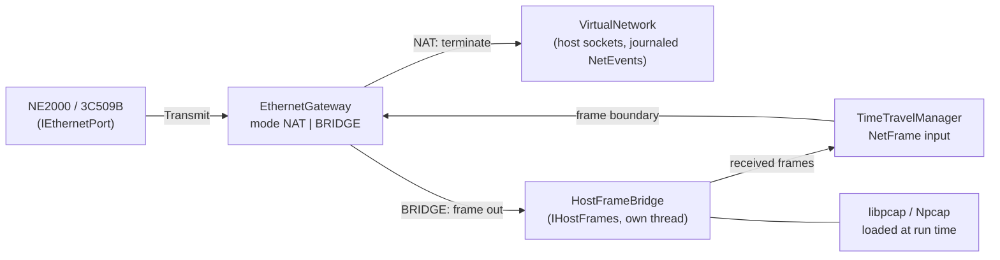

# SN6 - the frame cards on the host's real LAN (bridge mode)

**Status:** SN6a (wired adapters) and SN6b (Wi-Fi through MAC translation) built and verified live 2026-10-04
(sections 10, 11). Builds on [tdd.md](tdd.md) §7.8 (the first
sketch) and the owner's decision Q2 ([open-questions.md](open-questions.md): "the bridge right away"; NAT stays the
no-admin default, the bridge is the second host path for the same card).

## 1. What it is for

Today a frame-level card (NE2000 / RTL8019AS, 3Com 3C509B) is plugged into the **Ethernet gateway**: a switch with a
small home router behind it (10.0.2.2, DHCP 10.0.2.15, DNS, NAT, inbound forwards). The Sprinter reaches the internet,
but nothing on the real LAN sees it.

In **bridge mode** the card's frames go out on a host network adapter as they are, and the frames for the card come
back in: the LAN's own router gives the Sprinter its address, other computers can ping it and connect to its servers,
and Sprinter-to-Sprinter traffic between two machines (or two emulators) works on the real wire.

Example: the RTL8019AS kit's `IFUP` sends DHCP DISCOVER from `02:53:50:00:01:02`. In NAT mode the gateway answers
10.0.2.15; in bridge mode the home router answers, say, 192.168.1.57, and `ping 192.168.1.57` from the Mac reaches
the Sprinter.

Only the **frame cards** use it. The socket-level adapters (SprinterESP / ESP-AT, ZiFi, ZXNETUSB / W5300, the Hayes
modem) talk TCP / UDP through host sockets and have no frames to bridge; they keep the virtual network.

## 2. Parts



| Part | Where | What |
|---|---|---|
| `IHostFrames` | `core/src/common/network/hostframes.h` | `Open(adapter, error)`, `Close()`, `Send(frame)`, `Drain(out)`: the frames received since the last call; `Adapters()`: the host's adapters with name, description, MAC, kind (wired / wireless / loopback / virtual), up |
| `HostFrameBridge` | `core/src/common/network/hostframebridge.{h,cpp}` | the pcap implementation: a capture thread per open adapter, a bounded queue (frames over the limit dropped and counted), promiscuous, a BPF filter that keeps frames to our cards' MACs, broadcast and multicast, and drops what the host itself sent |
| pcap loader | `core/src/common/network/pcaplibrary.{h,cpp}` | loads the library at run time (`libpcap.A.dylib` / `libpcap.so.1` / Npcap's `wpcap.dll`): no build dependency, a release runs without it; "not available" is a report line, not a failure |
| `EthernetGateway` | existing | a mode: **NAT** (today) or **BRIDGE**. In BRIDGE the router, DHCP, DNS and TCP termination are off; the switch part stays (two cards in one machine still see each other directly); a frame that is not for a local station goes to `IHostFrames::Send` |
| `NetFrame` | TTD input kind | a frame from the host LAN, journaled with its bytes in the payload store (like `NetEvent`), applied at the frame boundary: offered to the card(s) it is addressed to |

## 3. Data path and timing

- **Card -> LAN:** the card's `Transmit` reaches the gateway inside the TXP access (as today); in BRIDGE the frame
  is handed to the bridge thread at once. During a TTD **replay** nothing is sent (the recording already did).
- **LAN -> card:** the capture thread queues frames; at each frame boundary the machine thread drains the queue and
  submits each frame as a `NetFrame` input through `TimeTravelManager::SubmitLiveInput` (the one path for outside
  input: journaled while recording, refused while the journal drives the machine). Applying it offers the frame to
  the addressed station(s) in the gateway's switch, with the existing per-card queue while a receive ring is full.
- **Granularity:** a frame from the LAN reaches the card at the next frame boundary (20 ms). Real cards see a frame
  within microseconds; protocols on the Sprinter are paced by its own polling and its 50 Hz timers, so a boundary
  delivery is invisible to them (the NAT mode delivers the same way today).

## 4. Determinism and TTD

The bridge is the only outside source in this mode, and every frame it delivers is a journaled input: a replay
reproduces the card's traffic byte for byte without the host LAN (the [sealed replay](tdd.md) principle). Leaving
the recorded past (a seek, resume from the past) drops the bridge queue; the LAN does not rewind, so the guest sees
lost frames, as after a cable pull. The mode (NAT / BRIDGE) is part of the machine config a recording carries; a
recording made in one mode replays in that mode without opening any adapter.

## 5. Configuration and automation

```ini
[NETWORK]
EthernetMode=NAT        ; NAT | BRIDGE
BridgeAdapter=en0       ; the host adapter for BRIDGE (name as Adapters() lists it)
```

Runtime change on every surface (WebAPI + OpenAPI, MCP, CLI, Lua, Python) through the existing network settings
verb: `network set ethernet_mode=bridge bridge_adapter=en0`; refused while a TTD recording runs (the hardware is fixed
while recording, as for a media swap). A new read: `network adapters` (the list above). The `ethernet_gateway`
section of the network report gains `mode`, `adapter`, `bridge: {open, error, frames_out, frames_in, dropped,
library}`. Qt Network window: a mode selector and an adapter list, the error line when the adapter cannot be
opened (with the fix, section 6).

## 5a. Traffic capture

The bridged frames join the gateway's existing capture (`network frames`, pcap) with the directions `lan_out` (card
-> host LAN) and `lan_in` (host LAN -> card). The full traffic view for the debuggers (every adapter, TTD-linked,
live stream, Qt window) is the next task, PLAN #91 ([2026-10-04-network-traffic-debug](../2026-10-04-network-traffic-debug/README.md)).

The bridge is part of the shared gateway: every machine with a frame-level card gets it, not only the Sprinter, and
the pcap loader serves macOS, Linux and Windows from one code path.

## 6. Host permissions (what the user has to do)

| Host | Needs | Report when missing |
|---|---|---|
| macOS | read / write on `/dev/bpf*` (root by default): Wireshark's **ChmodBPF** (group `access_bpf`) or run as root | "cannot open /dev/bpf: permission denied - install ChmodBPF (Wireshark) or ..." |
| Linux | `CAP_NET_RAW` + `CAP_NET_ADMIN` on the binary (`setcap`), or root | the same, with the `setcap` line |
| Windows | **Npcap** installed (WinPcap-compatible mode not needed) | "Npcap is not installed" with the download link |

The development Mac: `en0` is wired Ethernet; `/dev/bpf*` is `crw------- root` (no ChmodBPF yet), so a live check
needs ChmodBPF or one run with sudo.

## 7. Wireless adapters

A Wi-Fi access point accepts frames only from the MAC addresses associated with it: frames with the card's own
MAC are dropped, so a plain bridge over Wi-Fi does not work (VirtualBox, VMware and QEMU meet the same limit).
Section 9 Q1 asks how far SN6 goes here.

## 8. Tests

- `HostFrameBridge` behind `IHostFrames` has a fake (`FakeHostFrames`) for unit tests: the gateway in BRIDGE mode
  sends a card's frame out, delivers a LAN frame to the right card only, keeps two local cards switched directly,
  refuses to send during a replay.
- TTD: a recorded bridged `IFUP` / `PING` with the fake replays byte for byte with the bridge closed.
- The real pcap path: an env-gated test (`UNREAL_BRIDGE_ADAPTER=en0`) for a machine with the permission; and a live
  check of the RTL kit's `IFUP` getting a lease from the real LAN router.

## 9. Open questions (asked one at a time)

- **Q1. Wi-Fi host adapters** - **owner, 2026-10-04: Ethernet first, then Wi-Fi.** Step 1 (SN6a): the plain bridge on
  wired adapters (the card is on the LAN with its own MAC); a wireless adapter is listed but refused with the reason.
  Step 2 (SN6b), still in SN6: Wi-Fi through MAC translation as VirtualBox does - frames leave with the host
  adapter's MAC, answers are mapped back by IPv4 address (ARP and DHCP rewritten, the DHCP broadcast flag set);
  IPv4 works, non-IP protocols may not.

## 10. As built (SN6a, 2026-10-04)

| Part | Where |
|---|---|
| `DynamicLibrary` (dlopen / LoadLibrary) | `core/src/platform/dynamiclibrary.h`, `platform/posix/`, `platform/windows/`; `${CMAKE_DL_LIBS}` linked |
| `IHostFrames`, `HostAdapter` | `core/src/common/network/hostframes.h` |
| `HostFrameBridge` (libpcap / Npcap at run time, a capture thread on a promiscuous handle, a separate send handle, a queue of 1024 frames, the cards' MACs + broadcast + multicast taken, our own echo dropped) | `core/src/common/network/hostframebridge.{h,cpp}` |
| Gateway modes `Nat` / `Bridge`, `SetLanOutput`, `FromLan`, `StationMacs`, LAN counters (not in the TTD state), capture directions `lan_out` / `lan_in` | `vnet/ethernetgateway.*`, `vnet/ethernetaccess.*` |
| `TTDInputKind::NetFrame` (16), `HasNetRecord`; applied by `ApplyInputEvent` to `pEthernetGateway` | `debugger/ttd/ttdinputjournal.h`, `ttdinputapply.*`, file reader checks, `ttd.ksy` |
| `[NETWORK] EthernetMode=NAT|BRIDGE`, `BridgeAdapter=`; settings `ethernet_mode`, `bridge_adapter`; the bridge's report `ethernet_gateway.bridge` | `config.cpp`, `platform.h`, `networkmanager.*`, `devicestate.cpp` |
| Automation: WebAPI `GET .../network/adapters` + OpenAPI, CLI `network adapters`, Lua / Python `network_adapters()`, MCP via `invoke_api` (tool text); the settings through the existing network config verb on every surface | `core/automation/*` |
| Qt: Network window, group "Ethernet cards": the path (NAT / bridge) and the host adapter list | `unreal-qt/src/network/` |

Tests: `EthernetGateway_Test.Bridge_*` (3), `HostFrameBridge_Test.*` (the frame filter; the one that loads libpcap and
lists the host's adapters is `DISABLED_`: unit tests do not touch the host network, owner 2026-10-04), `SprinterNetwork_Test.Bridge_FramesFromTheLanAreJournaledInputs`
(a fake adapter: the NetFrame lands in the TTD journal with its bytes). Linux CI image (gcc) builds and passes them;
MinGW syntax check of the Windows files.

**Live check (macOS, `en0` wired, `/dev/bpf*` opened with `sudo chmod o+rw /dev/bpf*`):** the RTL8019AS kit on DSS
1.71 - `IFUP` got a lease from the office router (172.16.30.122 from 172.16.16.1), `PING 172.16.16.1` 3 / 3
replies (the router's real MAC through ARP), `NSLOOKUP example.com` answered by the router's DNS. The capture showed
the LAN's broadcasts arriving (`lan_in`) and the card's frames leaving (`lan_out`).

**Limits found:**

- The host itself cannot reach the bridged card on the same adapter: what pcap injects leaves on the wire and the
  host's own stack never receives it (the same as VirtualBox's pcap bridge on macOS). Other machines on the LAN can.
- The Sprinter kits are not resident: after `IFUP` returns nobody on the Sprinter answers ARP or ping. A test that
  pings the Sprinter needs a resident program (a kit server) running.
- The adapter list marks only loopback as not bridgeable; tunnels (`utun*`) are refused when opened (not Ethernet),
  not in the list.

## 11. As built (SN6b, Wi-Fi, 2026-10-04)

A wireless adapter (libpcap's `PCAP_IF_WIRELESS`) bridges through **MAC translation**, chosen automatically - no
setting:

| Part | Where |
|---|---|
| The adapter's own MAC: macOS `AF_LINK`, Linux `AF_PACKET` from the libpcap address list, Windows the IP Helper API by the Npcap GUID | `core/src/platform/hostadaptermac.h`, `platform/{macos,linux,windows}/hostadaptermac_*.cpp`; `HostAdapter::mac` |
| `MacTranslator`: out - Ethernet source and ARP sender = the host MAC, DHCP requests get the BROADCAST flag (UDP checksum cleared); in - a unicast for the host MAC goes to the card whose IPv4 address it carries (IPv4 destination, ARP target; learned from the card's packets and the DHCP ACK), the card's MAC put back; the host's own traffic dropped | `core/src/common/network/mactranslator.{h,cpp}` |
| The capture thread keeps group frames and the unicasts that can be for a guest (`WantsInbound`): the bulk of the host's own Wi-Fi traffic never reaches the queue | `hostframebridge.cpp` |
| The journal keeps the frame as the card sees it (after translation): a replay needs no translation table | `networkmanager.cpp` `PumpBridge` |
| Frames from the adapter shorter than 60 bytes are padded (Wi-Fi's 802.11-to-Ethernet conversion leaves the padding out; the DP8390 drops runts) - for wired adapters too | `PumpBridge` |
| Report `ethernet_gateway.bridge`: `translation`, `host_mac`, `guests[]` (ip, card_mac); adapters list `mac`, `translation` | `networkmanager.cpp`, `ethernetaccess.cpp` |

Tests: `MacTranslator_Test.*` (DHCP, ARP and IPv4 both ways, the host's traffic, the capture filter),
`SprinterNetwork_Test.Bridge_*` (a short frame padded).

**Live check (macOS `en1`, Wi-Fi, 172.16.13.55):** `IFUP` lease 172.16.15.142 from 172.16.0.1, `PING 172.16.0.1`
3 / 3, `NSLOOKUP example.com` through 172.16.1.1. The first try found the runt problem: the router's 56-byte ARP
reply reached the card and was dropped by its receive filter, so PING reported "ARP reply timeout".

Limits: IPv4 only (ARP, DHCP, ICMP, UDP, TCP); a protocol that carries the card's MAC elsewhere in its payload, or a
non-IP protocol, does not cross. As with the wired bridge, the host itself does not reach the card.
