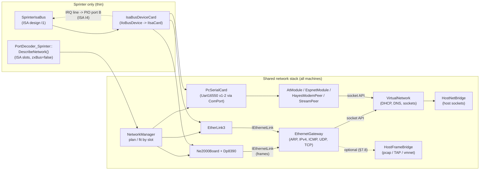
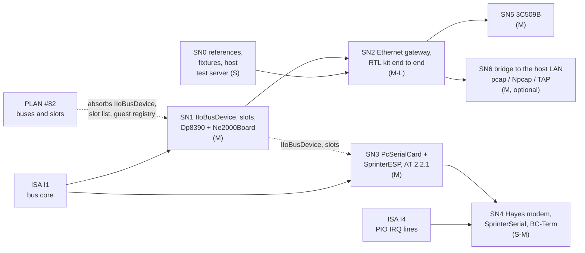

# Sprinter network adapters: technical design

| | |
|---|---|
| **Date** | 2026-10-02 |
| **Status** | Draft for owner review. Decided by the owner on 2026-10-02: NE2000-class Ethernet is built (not subject to the scoring cut-off); maximum reuse of the shared network stack, no Sprinter-only parallel paths. Still open: [open-questions.md](open-questions.md) (the design follows each recommendation until decided) |
| **Research** | [research.md](research.md) (adapters, software, sources, glossary) |
| **Builds on** | ISA design [2026-10-02-sprinter-isa/tdd.md](../2026-10-02-sprinter-isa/tdd.md) (bus I1, interrupt lines I4; owner decisions Q1-Q3); network stack [2026-09-30-nedoos-integration/tdd-network.md](../2026-09-30-nedoos-integration/tdd-network.md); ATM2IOESP [tdd.md](../2026-10-02-atm2ioesp/tdd.md); [PLAN #82](../PLAN.md) (buses and slots) |
| **Effort scale** | S < 1 week, M 1-2 weeks, L 2-4 weeks |

## Contents

1. [Goal and scope](#1-goal-and-scope)
2. [Which adapters, in which order](#2-which-adapters-in-which-order)
3. [Reuse map](#3-reuse-map)
4. [Architecture](#4-architecture)
5. [Generic extensions of the shared stack](#5-generic-extensions-of-the-shared-stack)
6. [NE2000-class Ethernet](#6-ne2000-class-ethernet)
7. [The Ethernet gateway (host side for frame cards)](#7-the-ethernet-gateway-host-side-for-frame-cards)
8. [SprinterESP Wi-Fi card](#8-sprinteresp-wi-fi-card)
9. [3Com 3C509B](#9-3com-3c509b)
10. [ISA modem and SprinterSerial](#10-isa-modem-and-sprinterserial)
11. [Not planned: SprinterNet, ZX-bus network cards](#11-not-planned-sprinternet-zx-bus-network-cards)
12. [Configuration](#12-configuration)
13. [TTD](#13-ttd)
14. [Automation, Qt, recipes](#14-automation-qt-recipes)
15. [Tests](#15-tests)
16. [Phased plan](#16-phased-plan)
17. [Risks](#17-risks)

## 1. Goal and scope

**Goal.** A Sprinter user fits a network card in an ISA slot, boots DSS and uses the real 2026 network kits
exactly as on the real machine: `IFUP` gets an address by DHCP, `PING`, `NSLOOKUP`, `NTP`, `WGET`, `FTP`,
`TELNET` and the Gopher browser reach the host's network through unreal-ng's virtual network - recorded and
replayed exactly by TTD, visible on every automation surface and in the Qt Network window.

**Worked example (the target for phase SN2).**

1. `[ISA] Slot2=NE2000` (RTL8019AS at `#300`), DSS boots from the hard disk with the RTL kit in `C:\NET`.
2. `NETCFG -i` with `IP=DHCP`, then `IFUP`. The kit's driver finds the card at slot 2 (page `#D6`), reads ID
   `'P' 'p'` at `#C30A/#C30B`, reads the MAC from the PROM by remote DMA, starts the receiver.
3. `IFUP` writes a DHCP DISCOVER frame into packet RAM (data port `#C310`) and sets "transmit" in the command
   register `#C300`. The NE2000 model hands the frame to the **Ethernet gateway**, which hands the DHCP payload
   to the virtual network's existing `DhcpServer` (lease by MAC): the OFFER comes back as a frame, the model
   stores it in the receive ring, the driver's poll loop sees `ISR.PRX` and reads it. Address `10.0.2.15`.
4. `WGET http://example.test/readme.txt`: the gateway answers the ARP for `10.0.2.2`, forwards the DNS query to
   the virtual network's DNS, and when the TCP SYN to port 80 arrives it opens an ordinary virtual network TCP
   socket (the same API the W5300 uses) and answers SYN-ACK once the host connected. Host bytes come back as
   journaled `NetEvent`s and leave the gateway as TCP segments sized to the guest's window.

**In scope:** every adapter of [research.md](research.md) §5 that has released hardware and Sprinter software:
NE2000-class Ethernet, SprinterESP, 3C509B, ISA modem, SprinterSerial; the host side for frame-level cards; config,
TTD, automation, Qt, recipes, tests, phases.

**Out of scope:** SprinterNet (no released card, §11), ZX-bus network cards through the adapter (no software; it
follows from PLAN #82), ISA DMA (the Sprinter has no DMA controller), the real-board "missed ISA cycle" behavior of
some clones (research §4: the emulated bus is ideal).

## 2. Which adapters, in which order

Scores 1 (low) to 5 (high), from [research.md](research.md) §5-7. "Cost" counts reuse: 5 = everything exists.

| Adapter | Users (hardware out there) | Software | Stability | Activity | Cost | Total | Rank |
|---|---|---|---|---|---|---|---|
| **NE2000-class Ethernet** (RTL8019AS, UM9003, clones) | 4 (cheap PC cards, 4 board types verified; frequent topic in the Telegram group) | 5 (13 programs + UNET + Gopher option) | 3 (0.3.x, real-board acceptance) | 5 (May-Sep 2026) | 2 (new chip + gateway) | **19** | **1 (owner decision)** |
| **SprinterESP** Wi-Fi + the Sprinter ESP Network Kit (`sprinter_wifi`, `UNETESP.DLL`; owner: must be supported) | 3 (open hardware since 2022) | 5 (16 programs + `UNETESP.DLL` + Gopher default + weather + ESPT, wterm) | 3 (0.2-0.3; card finished) | 5 | 5 (UART + AT module exist) | **21** | **2** |
| 3Com 3C509B | 2 (3 boards verified) | 5 (same set) | 3 (0.1.x) | 5 | 2 (new chip; gateway reused) | 17 | 3 |
| ISA Hayes modem | 2 (period cards; nothing to dial today) | 2 (BC-Term) | 5 (frozen) | 1 | 4 (UART exists; Hayes peer new) | 14 | 4 |
| SprinterSerial | 1 | 1 (BC-Term finds it) | 5 | 1 | 5 (a preset) | 13 | 4 (with the modem) |
| SprinterNet (W5100) | 0 (prototype) | 1 (emulator-only programs) | 1 | 1 | 3 (W5100 close to W5300) | 6 | not planned |
| ZX-bus + ZXNETUSB / Spectranet | 0 | 0 | - | - | - | - | not planned (PLAN #82) |

ESP scores highest only because it is cheap; the owner put Ethernet first. The plan (§16) therefore builds the NE2000
chip right after ISA phase I1 and the ESP card in parallel with or right after it - the two share nothing but the
ISA bus, so either order works.

## 3. Reuse map

The owner rule: the host side, the Qt Network window, slot settings and `DescribeNetwork()`, the automation surfaces
and the TTD journaling are the **same code** the ZX-Evo, ATM Turbo 2+ and ZXNETUSB adapters use; extend them
generically, never add a Sprinter-only parallel path. Chips other machines use are reused unchanged. A new chip is a
shared, machine-independent device with a thin ISA wrapper.

| Adapter | Reused as is | Generic extensions (shared code, any machine benefits) | Sprinter-only code |
|---|---|---|---|
| **All** | `VirtualNetwork` (sockets, DHCP, DNS, ICMP, forwards, hosts table), `HostNetBridge` / `IHostNet`, `NetEvent` / `NetLinkReset` journal, `NetworkManager` plan / refit / `not_fitted`, `DeviceState::Network`, the five automation entry points, Qt `NetworkWindow` status tree | **§5.1** `IIoBusDevice`: the bus-neutral device interface (extracted from `IAtmIoDevice`); **§5.2** slot list in `NetworkCapabilities` (`DescribeNetwork()`); **§5.3** guest registry replacing the fixed `SerialGuests` fields; **§14** `slots` rows in the network report, the Qt form and the runtime keys | `PortDecoder_Sprinter::DescribeNetwork()` override (ISA slots, `zxBus = false`); `IsaBusDeviceCard`, one adapter class from `IIoBusDevice` to the ISA design's `IIsaCard` (window offset -> device offset, IRQ line -> PIO port B); the `[ISA]` slot keys (owned by the ISA design) |
| **NE2000** | the ISA bus (I1) | new shared chip `Dp8390` + board `Ne2000Board` (RTL8019AS / UM9003 / NE1000 variants) in `core/src/emulator/io/network/ethernet/`; new shared `EthernetGateway` in `vnet/` on top of the virtual network sockets (§7); `IEthernetLink` (frame port) for any frame-level card; optional host frame bridge (§7.8); `NetFrame` journal input only for that bridge | none beyond the "All" row |
| **SprinterESP** | `Uart16550` (`Chip16550` params, 14.7456 MHz, AFE), `ComPort` with a `registerOf` map (as `Atm2IoEsp`), `ComPortSpec`, `AtModule` / `EspnetModule`, `TTDSerialPort` | `PcSerialCard` (shared: one or two 16550s at ISA-style bases, OUT2-gated IRQ, presets); `ISerialPeer::OnAuxLines(out1, out2)` + ESP reset / flash pins; ESP8266 AT 2.2.1 / 2.2.2 presets and the missing AT commands (§8.3) | none |
| **3C509B** | the gateway (§7), `IEthernetLink` | new shared chip `EtherLink3` (ID port, windows, FIFOs, EEPROM) | none |
| **ISA modem, SprinterSerial** | `PcSerialCard`, `ComPort`, `StreamPeer` (TCP) | `HayesModemPeer` (`ComPortSpec` value `MODEM`): AT dialer whose "phone numbers" are `host:port`; usable on the ZX-Evo COM port and ATM2IOESP as well | none |

`Atm2IoEsp` already wraps a `ComPort` on a non-native bus; once `IIoBusDevice` and `PcSerialCard` exist it becomes
a `PcSerialCard` preset on the ATM INTERNAL bus (optional cleanup, PLAN #82).

## 4. Architecture



Ownership: `NetworkManager` owns every network device, as it owns the ZXNETUSB and ATM2IOESP today. The Sprinter's
ISA bus owns only the slot wrappers; each wrapper holds a pointer to the device `NetworkManager` fitted. Everything
runs on the emulator thread; the host bridges keep their own threads behind the existing interfaces.

## 5. Generic extensions of the shared stack

### 5.1 `IIoBusDevice`: one device interface for every non-native bus

Today the ATM INTERNAL bus has `IAtmIoDevice` (`Matches`, `Read`, `Write`, `Reset`). ISA cards need the same plus an
interrupt line and a side-effect-free peek. The interface moves to `core/src/emulator/io/iiobusdevice.h`:

```cpp
// Sketch. A device on a bus that is not the Z80's own port funnel (ISA slot, ATM INTERNAL connector, later the
// shared ZX-bus of PLAN #82). Offsets are the device's own register numbers; the bus wrapper does the decoding.
class IIoBusDevice
{
public:
    virtual ~IIoBusDevice() = default;
    virtual const char* Kind() const = 0;                         // "ne2000", "el3c509b", "pcserial", ...
    virtual bool Decodes(uint32_t ioAddress, uint16_t& offset) const = 0;  // base + window -> register offset
    virtual uint8_t Read(uint16_t offset) = 0;                    // a real bus cycle (side effects)
    virtual void Write(uint16_t offset, uint8_t value) = 0;
    virtual uint8_t Peek(uint16_t offset) const = 0;              // debugger / automation, no side effects
    virtual void Reset() = 0;                                     // the bus RESET line
    virtual bool Irq() const { return false; }                    // level of the device's interrupt output
    virtual void SetIrqListener(std::function<void()> changed) {} // called when Irq() may have changed
    virtual void OnFrame() {}
};
```

`Atm2IoEsp` implements it unchanged in behavior (its `Matches(latch)` becomes `Decodes`). The Sprinter wrapper
`IsaBusDeviceCard : IIsaCard` forwards `IoRead` / `IoWrite` / `IoPeek` with the 20-bit ISA address, maps `SetReset`
to `Reset()`, and feeds `Irq()` into the ISA bus's `PioInputs()` (I4). That is the only per-bus code.

### 5.2 Slots in `DescribeNetwork()`

`NetworkCapabilities` gains a list of slots a network card can occupy, next to the existing `zxBus`, `serialPort` and
`internalIo` fields:

```cpp
struct NetworkSlot
{
    std::string id;          // "isa1", "isa2" (later: "zxbus1", "atm.internal" when PLAN #82 lands)
    std::string label;       // "ISA slot 1 (J6), page #D4"
    std::vector<std::string> kinds;   // card kinds the slot accepts: "NE2000", "EL3C509B", "SPRINTERESP", "MODEM", "DUAL16552"
    std::function<bool(IIoBusDevice*)> fit;   // plug / unplug (nullptr) the device; false = refused (reason logged)
    std::string occupiedBy;  // a non-network card in the slot ("zxbus" adapter, "ram"): the slot is not free
};
std::vector<NetworkSlot> slots;
```

`NetworkManager::MakePlan()` walks `slots` exactly as it walks the ZX-bus cards today: a configured card whose slot
does not exist or is occupied goes to `not_fitted` with the reason; the machine always starts. The Sprinter override
returns `zxBus = false`, `serialPort = None` and two ISA slots. **No other machine changes**: the list is empty by
default.

### 5.3 Guest registry

`SerialGuests{com, machine, atmIo}` (guests 2-4) cannot describe "one or two UARTs per ISA slot, two slots". It
becomes a small registry: every socket-level guest of the virtual network (the W5300 chip, each UART peer, the
Ethernet gateway) registers under a stable key (`"zxnetusb"`, `"com"`, `"machine"`, `"atm.internal"`,
`"isa2.uart0"`, `"isa2.eth"`), and the TTD state stores the key instead of the fixed guest number. Existing keys map to
the existing numbers 1-4, so recordings made before the change still load (the numbers are kept as aliases). Decision pending: [open-questions.md](open-questions.md) Q10.

### 5.4 Network devices keep reporting through `DeviceState::Network`

Each fitted slot adds one row to the report (§14): bus, slot, card kind, chip, base address, MAC, IRQ level, the
chip's registers and counters. The Qt form builds its slot rows from that list, not from a Sprinter group box.

## 6. NE2000-class Ethernet

### 6.1 Code layout

| File | Content | Machine-specific? |
|---|---|---|
| `core/src/emulator/io/network/ethernet/dp8390.{h,cpp}` | the DP8390 core: register pages 0-2, command register, local DMA into packet RAM, remote DMA, receive ring, transmit, ISR / IMR, tally counters, loopback | no |
| `core/src/emulator/io/network/ethernet/ne2000board.{h,cpp}` | the board: I/O layout (`+#00-#0F` chip, `+#10` data port, `+#1F` reset port), PROM, packet RAM size, the variant (RTL8019AS: ID `'P' 'p'`, page 3, 9346CR + 93C46 EEPROM, CONFIG0-4; UM9003; NE1000); implements `IIoBusDevice` | no |
| `core/src/emulator/io/network/ethernet/ethernetlink.h` | `IEthernetLink`: `Transmit(frame)` from the card, `Deliver(frame)` / `CanAccept(size)` towards it | no |
| `core/src/emulator/io/sprinter/isa/cards/isabusdevicecard.{h,cpp}` | the wrapper of §5.1 | Sprinter (one class for every network card) |

The chip is **not** an isolated vendored library: it has no Sprinter-specific behavior, and the owner wants it
pluggable on any future ISA or ZX-bus host. MAME's `dp8390.cpp` (BSD-3) and the RTL kit's harness model
(`tools/exe-harness/rtl8019-model.js`, research §8) are references; the datasheets (research DS-8390, DS-8019) decide
where they disagree.

### 6.2 The registers the Sprinter software uses

Offsets from the card's I/O base (default `#300`; the program sees it at CPU `#C300` with page `#D4` / `#D6`):

| Offset | Page 0 read | Page 0 write | Page 1 | Page 3 (RTL8019AS) |
|---|---|---|---|---|
| `#00` | CR | CR | CR | CR |
| `#01` | CLDA0 | PSTART | PAR0 (MAC) | 9346CR (EEPROM bit-bang) |
| `#02` | CLDA1 | PSTOP | PAR1 | BPAGE |
| `#03` | BNRY | BNRY | PAR2 | CONFIG0 |
| `#04` | TSR | TPSR | PAR3 | CONFIG1 |
| `#05` | NCR | TBCR0 | PAR4 | CONFIG2 |
| `#06` | FIFO | TBCR1 | PAR5 | CONFIG3 |
| `#07` | ISR | ISR (write 1 to clear) | CURR | - |
| `#08`/`#09` | CRDA0/1 | RSAR0/1 | MAR0/1 | - |
| `#0A`/`#0B` | **`#50` `#70`** on RTL8019AS ("Pp"); reserved otherwise | RBCR0/1 | MAR2/3 | - |
| `#0C` | RSR | RCR | MAR4 | - |
| `#0D` | CNTR0 | TCR | MAR5 | - |
| `#0E` | CNTR1 | DCR | MAR6 | - |
| `#0F` | CNTR2 | IMR | MAR7 | - |
| `#10` | data port: remote DMA byte (8-bit mode) | | | |
| `#1F` | reset port: a read resets the chip (ISR.RST = 1) | write: no effect | | |

Page 2 reads back the page-0 write registers (PSTART, PSTOP, TPSR, RCR, TCR, DCR, IMR); undefined bits read as the
datasheet defines (RTL8019AS) or, on the UM9003 variant, as the last bus value (research §5.1; the kit masks them).

### 6.3 Packet RAM, PROM and the receive ring

- **RTL8019AS:** 16 KB packet RAM at pages `#40-#7F`; the PROM (32 bytes: each MAC byte twice, then the board
  signature) appears at remote DMA addresses `#0000-#001F`, as an NE2000 in byte mode does (NE-LINUX `ne.c`, the RTL
  kit's PROM reader; the PROM layout options of the kit's harness decide the exact bytes in the tests). NE1000
  variant: 8 KB at `#20-#3F`.
- **Remote DMA:** RSAR = address, RBCR = count, CR.RD = read (`01`) or write (`10`); every data-port access moves
  one byte and decrements RBCR; ISR.RDC when RBCR reaches 0. Remote DMA reads wrap from PSTOP to PSTART (drivers
  read a frame that wraps the ring in one go). The "send packet" command (`CR.RD = 11`) is supported for completeness.
- **Receive:** a frame accepted by the address filter (RCR: broadcast, multicast hash MAR0-7, promiscuous, own MAC
  PAR0-5; runts under 64 bytes are padded by the sender model, not by the receiver) is written at CURR with the
  4-byte header `status, next page, length low, length high`; CURR advances; ISR.PRX. If the frame does not fit
  before BNRY: ISR.OVW, the frame is dropped, the receiver stays as the datasheet says until the driver recovers.
- **Transmit:** CR.TXP with TPSR / TBCR: the frame (padded to 60 bytes plus the 4-byte CRC the card adds) goes to
  the link; `ISR.PTX` and `TSR` after the wire time (§6.5).
- **Loopback** (TCR.LB): the datasheet behavior, not MAME's: internal loopback does not reach the ring (data stays
  in the FIFO; RSR / TSR report the result). The RTL kit's `NICLB` accepts both ([open-questions.md](open-questions.md) Q4).

### 6.4 Variants and quirks

| Variant | ID at `#0A/#0B` | Page 3 | Reset port read | Undefined bits | Use |
|---|---|---|---|---|---|
| `RTL8019AS` (default) | `#50 #70` | 9346CR, CONFIG0-4, 93C46 EEPROM content generated from the slot settings (base, IRQ, media) | resets the chip | defined | the kit's main target; auto-scan finds it |
| `UM9003` | `#20 #01` | mirrors page 1 | **stalls the ISA cycle: the machine hangs** (as on the real card; logged and shown in the slot report) | float (last bus value) | the kit's `RTL_HW=0/#300` path |
| `NE1000` | none | none | resets | defined | MAME's `ne1000`, references |

The UM9003 hang is what the hardware does and what the kit documents; [open-questions.md](open-questions.md) Q5
asks whether to model it literally.

### 6.5 Time

The chip keeps its own time in emulated T-states of the host clock (`AudioTstate`-like, so turbo does not change
the wire speed), and catches up lazily on every register access, like `Uart16550::Advance(now)`:

- a transmit completes `(frame bytes + 8 preamble + 12 gap) x 0.8 us` after TXP (10 Mbit/s): the PTX bit appears
  on the first access after that time;
- received frames enter the ring at the frame boundary when the gateway pumps (§7.6).

No per-instruction cost: nothing runs between accesses.

### 6.6 Interrupt

`Irq() = (ISR & IMR & #7F) != 0` (and CONFIG1.IRQEN on the RTL8019AS). The wrapper routes it to PIO port B bit 0 /
1 once ISA phase I4 has the lines. No Sprinter program enables it today (the kits poll), so SN1 works without I4.

## 7. The Ethernet gateway (host side for frame cards)

### 7.1 Why a gateway, and why on the virtual network

The virtual network is socket-level: the W5300 and the ESP modules ask it for TCP and UDP sockets. An NE2000
speaks Ethernet frames. Three ways to connect the two:

| Option | Host needs | Determinism / TTD | Reuse |
|---|---|---|---|
| **A (recommended)** Own **user-mode gateway** in `vnet/`: terminates the guest's ARP, IPv4, ICMP, UDP and TCP and turns them into virtual network sockets | nothing (no admin rights, no drivers): same as ZXNETUSB and ESP today | the existing `NetEvent` journal covers every host input; the gateway is deterministic emulator code | full: DHCP, DNS, hosts table, forwards, host bridge, Qt and automation all unchanged |
| B Vendor libslirp or lwIP as the gateway | libslirp needs GLib; lwIP needs its timers on emulated time | possible, but their internal timers and allocators must be made deterministic; a second copy of DHCP / DNS logic | partial: their own DHCP / DNS would bypass `DhcpServer` and the hosts table |
| C Raw frames to the host (pcap / TAP / vmnet) only | admin rights or Npcap on Windows; a real LAN and DHCP server | every received frame is a journaled input | none of the services (the host LAN provides them) |

A is the default and the only mode for tests ([open-questions.md](open-questions.md) Q9); C is an optional extra (§7.8, Q2).

### 7.2 What the gateway is

`EthernetGateway` (`core/src/emulator/io/network/vnet/ethernetgateway.{h,cpp}`, with small helpers `ipv4.h`,
`tcpsegment.h`): one per virtual network, a virtual switch with the router behind it. Every frame card attaches an
`IEthernetLink`. Frames between two cards on the same machine (slot 1 and slot 2) are switched directly; everything
else goes to the router part:

| Guest sends | Gateway does |
|---|---|
| ARP request for `10.0.2.2` (router), `10.0.2.3` (DNS) or any address outside the guest's own | answers with the router MAC (`52:55:0A:00:02:02`, locally administered, as QEMU's user network) |
| ARP request for its own address (duplicate check) | stays silent |
| DHCP DISCOVER / REQUEST (UDP 67) | passes the payload to the existing `DhcpServer` (lease keyed by the card's MAC, so the lease table and its TTD state are shared with the W5300 path); wraps the answer in UDP / IPv4 / Ethernet |
| DNS query (UDP 53) | the virtual network's DNS path (`DnsMode=HOST`: host resolver; hosts table first) |
| ICMP echo | `VirtualNetwork` echo for the router / DNS addresses, `IcmpEcho` through the host for others; reply frame back |
| UDP to anything else | one virtual network UDP socket per (guest port, remote) flow; answers become UDP frames; idle flows close after 60 s of emulated time |
| TCP SYN | §7.3 |
| IPv4 fragments, IP options, other protocols | dropped and counted (`unsupported` counter, visible in the report) |

The guest learns its address by DHCP or uses a static one (the kit's `IP=` key): the gateway accepts any source
address in `10.0.2.0/24` and remembers the MAC-to-address pairs it sees (ARP table in the report).

### 7.3 TCP termination

For each guest TCP connection the gateway keeps a small state record (guest address and port, remote endpoint,
sequence numbers, the guest's window and MSS, a send queue of host bytes not yet acknowledged):

1. **SYN** from the guest: open a virtual network TCP socket, `Connect`. On `Connected`: SYN-ACK (MSS = the guest's
   MSS option or 536, window 4 KB). On `ConnectFailed`: RST.
2. **Data from the guest**: in-order segments are acknowledged and passed to `Send`; duplicates are acknowledged
   again; out-of-order segments are dropped (the guest retransmits; the RTL kit's `tcp_ooo.asm` handles the reverse
   direction).
3. **Data from the host** (`Data` events): queued, then sent as segments no larger than the guest's MSS and never
   beyond the guest's advertised window. Unacknowledged data is resent after a timeout counted in emulated frames
   (start 25 frames = 0.5 s, doubling, at most 5 tries, then RST) - deterministic because it counts emulated time.
4. **FIN** in either direction maps to `ShutdownWrite` / `PeerClosed`; RST to `Close`.
5. **`NetLinkReset`** (TTD: the machine left the recorded past and the host connections are gone): RST to the guest
   for every connection, as the W5300 socket sees a disconnect.
6. **Inbound** (`[NETWORK] Forward=` rules): the gateway `Listen`s on each rule's guest port; an accepted host
   client becomes a SYN to the guest's address (the most recent DHCP lease or the address learned from its traffic).

Checksums: the gateway computes IPv4 / TCP / UDP / ICMP checksums and checks the guest's (a bad one: drop, count).
MTU 1 500, no fragmentation.

### 7.4 Flow control towards the host

Host data must not pile up without limit when a 21 MHz Z80 reads slowly. The gateway's per-connection queue has a
limit (64 KB); above it the gateway asks the virtual network to pause reading that socket. If `VirtualNetwork` /
`IHostNet` has no such pause today (the W5300 path relies on its socket buffers), it gets a generic
`PauseReceive(id, bool)` that the host bridge honors by not reading the host socket - useful for the W5300 and ESP
paths too. Paused / resumed are host commands, not inputs: they are not journaled and are not issued during replay.

### 7.5 Addresses and MAC

The card's MAC comes from the slot setting (`SlotNMac=`), default `02:53:50:00:0i:0s` (locally administered; `i` =
emulator instance index, `s` = slot) so two instances or two cards never collide ([open-questions.md](open-questions.md)
Q3). The PROM, PAR0-5 after the driver copies them, and the DHCP lease all follow it.

### 7.6 Frame delivery and time

- **Card -> gateway:** at the moment of `TXP` (inside the access). The gateway processes the frame at once: local
  answers (ARP, DHCP, DNS from the hosts table, router ping) are queued; host requests become virtual network calls.
- **Gateway -> card:** at the frame boundary, in `VirtualNetwork::Pump()` order: first the gateway's own answers,
  then host events (journaled). Each queued frame is offered with `CanAccept(size)`; frames that do not fit the
  receive ring stay queued for the next frame boundary (the gateway is a switch with a buffer; the real wire would
  drop them, but a lossless switch is what a home network looks like to a 10 Mbit card). With the kit's 26-page ring
  this delivers up to about 6.6 KB per frame (about 330 KB/s), more than the Z80 stack can consume.

### 7.7 Determinism

The gateway is a pure function of (frames the card sent, journaled host events, emulated time). It has no host
timers, no random numbers (initial sequence numbers are derived from the connection's addresses and the frame
counter), no allocation-order dependence. Its tables are part of the virtual network state (§13).

### 7.8 Optional: frames to the host's real LAN

`HostFrameBridge` behind a new `IHostFrames` interface (`Open(adapter)`, `Send(frame)`, `PollFrame()`, its own
thread like `HostNetBridge`): libpcap on macOS and Linux, Npcap on Windows (installed by the user), Linux TAP as an
alternative; Apple vmnet needs an entitlement and is left out. Selected per virtual network
(`[NETWORK] EthernetMode=NAT|BRIDGE`, `BridgeAdapter=en0`). In bridge mode the gateway switches frames to the host
adapter instead of terminating them; every received frame is a TTD input (`NetFrame`, §13). Phase SN6, only if the
owner wants it (Q2).

## 8. SprinterESP Wi-Fi card

### 8.1 The card

`PcSerialCard` (shared, `core/src/emulator/io/network/pcserialcard.{h,cpp}`, `IIoBusDevice`): one or two
`ComPort`s, each at its own base, built exactly the way `Atm2IoEsp` builds its one: `ComPort` created with
`registerOf = port & 7`, `AttachToPorts` **not** called, every access through `portDeviceInMethod` /
`portDeviceOutMethod(register)`. The peer, the TTD serialization and the state report then come with `ComPort` for
free; no UART or peer code is copied. Chip parameters: `Uart16550::DefaultParams(Flavor::Chip16550)` (a real 16550:
interrupts, AFE, no access wait), with `uartClockHz` set per preset - **not** the ZX-Evo AVR flavor (no interrupts,
AVR waits, no AFE). A card that does not wire every modem line sets `Params::ctsOnly`. Presets:

| Preset | UARTs | Base(s) | UART clock | Extra wiring | Peer default |
|---|---|---|---|---|---|
| `SPRINTERESP` | TL16C550C | `#3E8` (fixed on the card) | 14.7456 MHz | OUT1 -> ESP reset, OUT2 -> ESP GPIO0 (flash mode), RTS / CTS to the ESP, AFE | `AT` with `EspChip=ESP8266-AT222` (§8.3) |
| `MODEM` | 16550A | `#3F8` (`#2F8`, `#3E8`, `#2E8` selectable) | 1.8432 MHz | OUT2 gates the IRQ (PC convention) | `MODEM` (Hayes, §10) |
| `DUAL16552` (SprinterSerial) | PC16552D (two) | `#3F8` + `#2F8` | 1.8432 MHz | OUT2 gates each IRQ; both share the slot's IRQ line | `TCP:` / `SERIAL:` / `LOOPBACK` per channel |

**Worked example: ESPT starts the card.** Slot 1. ESPT writes FCR `#81` at `#C3EA`, IER 0 at `#C3E9`, sets DLAB
and divisor 8 (`14 745 600 / 16 / 8 = 115 200`), LCR 3, then MCR 6 at `#C3EC`: OUT1 = 1 drives the ESP's reset pin
low. 200 ms later MCR 2 releases it: the `AtModule` reboots - it sends a few bytes of boot noise (the real ROM
prints at 74 880 baud, which reads as junk at 115 200), then `ready`. ESPT waits for that first byte, waits 700 ms,
sets MCR `#22` (AFE) and sends `AT`.

### 8.2 Generic serial extensions

| Extension | Detail | Also used by |
|---|---|---|
| `ISerialPeer::OnAuxLines(bool out1, bool out2)` (default: ignore) | called by the UART on MCR changes, like `OnModemLines` | any card that wires OUT1 / OUT2 |
| ESP module pins | `EspModule` gets `SetResetPin(bool asserted)` and `SetFlashPin(bool low)`: reset held = silent, all links dropped (`AT+RST` path); release = reboot with boot noise + `ready`, factory baud restored, `UART_CUR` forgotten, `UART_DEF` kept; GPIO0 low at release = download mode: silent (flashing is not emulated, logged) | any ESP wired to a UART with reset |
| UART interrupt output | `ComPort` does not drive an interrupt to the Z80; `Uart16550::InterruptActive()` finally gets a consumer: `PcSerialCard::Irq()` = active and (preset gates by OUT2 ? MCR.OUT2 : true), polled by the bus wrapper after each access and frame (ISA I4 routes it to PIO port B) | ZX-Evo / ATM cards when they wire an IRQ |
| Guest registry | each UART peer registers as `"isaN.uartK"` (§5.3). Without it, each new peer would need the full list the ATM2IOESP needed for guest 4: a `SerialGuests` field, `hasGuest` in `netstate`, `ComPort::SerialNetGuests`, `VirtualNetwork::Reset` / `SaveState` / `LoadState` - else its connections drop on a bus reset and do not come back after a TTD move. The registry does that once for any number of peers | all serial peers |
| `NetworkManager` fitting | the ATM2IOESP / machine-serial plan is the template: `MakePeer(spec, espBaud)` (default ESP baud from `NetworkCapabilities::espBaud`; spec syntax `AT[,baud]`, `ESPNET[,baud]`), fit, remove, `OnFrame`, report through the shared `peerFields` / `uartFields` of `devicestate.cpp`; the Qt Network window and all five surfaces change in the same commit | - |

### 8.3 AT dialect and the Sprinter ESP Network Kit

The kit (`sprinter_wifi`, research §5.2a) expects ESP8266 ESP-AT **2.2.2** (recommended, its own build) or **2.2.1**
(compatibility), and tells them apart by `AT+SYSSTORE?` (`ERROR` on 2.2.1, `OK` on 2.2.2). `AtModule` today answers
as ESP8266 NonOS AT 1.7.4 or ESP32 AT 2.2.0 and accepts `AT+SYSSTORE` on both. Generic extension (shared by every
machine with an ESP): `[NETWORK] EspChip=` gains two ESP8266 firmware presets.

| Preset | `AT+GMR` identity | `AT+SYSSTORE` | Passive receive (`CIPRECVMODE`, `CIPRECVDATA`) | `_CUR` / `_DEF` forms |
|---|---|---|---|---|
| `ESP8266` (today) | NonOS AT 1.7.4, SDK 3.0.4 | `ERROR` (fix: today `OK`) | no | yes |
| **`ESP8266-AT221`** | AT 2.2.1.0, ESP8266 RTOS SDK | `ERROR` | no (`ERROR`) | yes |
| **`ESP8266-AT222`** (Sprinter default) | AT 2.2.2.0, ESP8266 RTOS SDK | `OK` | yes | yes |
| `ESP32` (today) | AT 2.2.0, IDF v4.2.2 | `OK` | yes | no (2.x form only) |

Commands the kit sends that `AtModule` lacks, added to the shared module with the 2.2.x answers (ESP-AT docs,
research ESP-AT): `AT+CWLAPOPT` (scan result fields), `AT+CIPTCPOPT` (`OK`, values stored), `AT+SYSLOG` (error-code
mode), `AT+CIPDNS` / `_CUR` (DNS servers: stored and reported; the virtual network's DNS answers whatever server is
named, `DnsMode=HOST`), `AT+CIPSERVERMAXCONN`. Already present and used by the kit: `CIPMUX=1` with two links,
link-id `CIPSTART` / `CIPSEND`, `+IPD,<link>,<len>:`, `CIPRECVMODE` / `CIPRECVDATA`, `UART_CUR` with `flow=3`, `PING`,
`CIPDOMAIN`, `CIPSNTPCFG` / `CIPSNTPTIME`. Unknown commands keep answering `ERROR`. The ESP joins the virtual access
point `UnrealNG` as on every machine.

**Flow control as the kit uses it.** By default the kit keeps RTS asserted (MCR `#02`) and drops it (MCR `#00`)
around slow work; it turns on AFE (MCR `#22`, receive trigger 4 bytes) only after `AT+UART_CUR=...,3` and a working
round trip. Both modes already exist in `Uart16550` (auto-RTS at the trigger level, CTS-gated transmit) and in
`EspModule` (CTS = receive buffer not full, RTS honored). The tests run both `NET_ESP_FLOW=0` and `3`.

**Test note (from the ATM2IOESP work).** Drivers hold RTS only as a short pulse between reads. A test that holds RTS
for a whole frame makes the ESP answer back to back and overflows the 16-byte receive FIFO: a test bug, not a model
bug. The SprinterESP tests read the way ESPT and the kit do, with pauses.

## 9. 3Com 3C509B

`EtherLink3` (shared, `core/src/emulator/io/network/ethernet/etherlink3.{h,cpp}`, `IIoBusDevice`), on the same
`IEthernetLink` and gateway as the NE2000:

| Part | Model |
|---|---|
| ID port `#110` | the ISA ID state machine: the 255-byte ID sequence (LFSR from `#FF`), "select tag", read the 16 EEPROM words bit-serially with the contention rule (one card per slot here, so contention always succeeds), "activate at base" |
| EEPROM | 16 words: MAC, product ID `#9550` (TPO) or `#9050` (TP), manufacturer `#6D50`, address / resource config, both checksums; generated from the slot settings |
| Registers | 16 bytes at the activated base: command / status at `+#0E`, window select command, windows 0 (setup), 1 (operating: TX / RX FIFO ports, RX status, TX status, free bytes), 3, 4 (media / diagnostics), 6 (statistics) |
| FIFOs | transmit FIFO (length word + data, padded to 4 bytes) of 2 KB; receive FIFO with RX status (length, errors) and `RxDiscard`; frames from the gateway enter when the FIFO has room (§7.6) |
| Commands | GlobalReset, SelectWindow, RxEnable / Disable / Reset / Discard, TxEnable / Disable / Reset, AckIntr, SetIntrMask, SetReadZeroMask, SetRxFilter, SetTxAvailThresh, StatsEnable / Disable, Start / StopCoax, the TP link enable |
| IRQ | modeled (status & mask), unused by the kit |

References: Linux `3c509.c`, the EtherLink III user guide, the EL3 kit's own harness model (research §3, §8).

## 10. ISA modem and SprinterSerial

- **`HayesModemPeer`** (shared, `core/src/emulator/io/serial/hayesmodempeer.{h,cpp}`, `ComPortSpec` value
  `MODEM[,phonebook]`): command mode understands `AT`, `ATZ`, `ATE0/1`, `ATQ`, `ATV`, `ATH`, `ATA` (answers a
  forwarded inbound connection), `ATDT` / `ATDP` + number, `ATO`, `AT&F`, `ATS0`-`S12` (stored), `+++` with guard
  time in emulated time. A number is a `host:port`, a host name (port 23), or an entry of the phone book
  (`[NETWORK] ModemPhonebook=5551234=bbs.example.org:23;...`). Dialing opens a virtual network TCP socket (the same as
  `StreamPeer`); `CONNECT 115200` / `NO CARRIER` / `BUSY` follow; DCD follows the link. Works on every machine's
  UART (ZX-Evo COM port, ATM2IOESP, the Sprinter ISA cards).
- **BC-Term** needs the ISA interrupt: receive data raises the UART interrupt, OUT2 enables it on the card, the slot
  line reaches PIO port B bit 0 / 1 (ISA I4), the Z84C15 PIO in bit-control mode gives the mode-2 interrupt. That is
  why the modem phase follows I4.
- **SprinterSerial** is the `DUAL16552` preset: two `ComPort`s, each with its own peer (`TCP:host:port` for a
  null-modem link to a host program, `SERIAL:/dev/tty...` for a real port).

## 11. Not planned: SprinterNet, ZX-bus network cards

- **SprinterNet** (W5100 card, research §5.6): no released hardware, only prototypes; its programs run in SprintEm
  through a high-level DSS call (`RST #10`, `C = #D0`). Emulating that call would be a DSS patch, not hardware, and
  the W5100 card's own register interface is unpublished. Revisit if a card is released ([open-questions.md](open-questions.md) Q8).
- **ZX-bus network cards through the ZX-bus adapter** (ZXNETUSB / W5300, Spectranet): no Sprinter software; the
  adapter passes I/O cycles only (ISA Q7). When PLAN #82 makes the ZX-bus a real shared bus, a ZXNETUSB behind the
  adapter would come for free; nothing Sprinter-specific is planned.

## 12. Configuration

Slot population stays where the ISA design put it (`[ISA]`, read at instance creation, ISA Q5); network settings of a
slot use the same slot-numbered keys. New card kinds in `SlotN=`:

```ini
[ISA]
Slot1=ZXBUS              ; owner default: ZX-bus adapter + NeoGS (ISA Q2)
Slot2=NE2000             ; NONE | ZXBUS | RAM | NE2000 | EL3C509B | SPRINTERESP | MODEM | DUAL16552
Slot2Chip=RTL8019AS      ; NE2000: RTL8019AS | UM9003 | NE1000.   EL3C509B: TPO | TP
Slot2Base=#300           ; NE2000: #200..#3E0 step #20.  MODEM: #3F8 | #2F8 | #3E8 | #2E8.  SPRINTERESP: fixed #3E8
Slot2Irq=3               ; written into the card's EEPROM / config (informational: one IRQ line per slot)
Slot2Mac=auto            ; auto = 02:53:50:00:<instance>:<slot>
; UART cards: one peer per channel, ComPortSpec syntax (NONE | LOOPBACK | TCP:host:port | SERIAL:dev[,baud] | AT | ESPNET | MODEM)
; Slot2Peer=AT           ; SPRINTERESP / MODEM
; Slot2Peer0=TCP:localhost:2323  Slot2Peer1=SERIAL:/dev/ttyUSB0   ; DUAL16552

[NETWORK]                ; unchanged keys, shared by every machine
HostAccess=1
DnsMode=HOST
Forward=8080:8080
EspChip=ESP8266-AT222    ; new values ESP8266-AT221 | ESP8266-AT222 (§8.3)
ModemPhonebook=          ; new (§10)
EthernetMode=NAT         ; new: NAT | BRIDGE (BRIDGE only with phase SN6)
BridgeAdapter=
```

The Sprinter config ships `Slot2=NONE` ([open-questions.md](open-questions.md) Q1 asks whether a network card should be
fitted by default) and loses the dead `[MISC] Modem=` / `ZiFi=` lines. A configured network card while `Slot1` is the
ZX-bus adapter and `Slot2` is taken: refused, `not_fitted` with the reason, the machine starts.

**Runtime.** `POST .../network/config` accepts slot-oriented keys `slot` + `peer` / `mac` / `chip` / `base`: the
peer, the host access, the AT dialect and the phone book change live (as `com_port` does today); changing a card kind
or base waits for an instance restart in v1 (ISA Q5; this folder's Q11), and the reply says so.

## 13. TTD

| Item | Design |
|---|---|
| Ethernet card state | one new shared blob **`PeripheralId::EthernetNics = 39`** (the first free id on master `eecf86777`: 0-38 are taken - 32 = Sprinter Covox-Blaster, 33-35 reserved or used by the Sprinter, 36 / 37 the ATM INTERNAL bus and ATM2IOESP, 38 the ZX-Evo mouse; the enum does not catch duplicates, so the number is re-checked by hand when the phase lands): for each fitted frame card its link key (`isa2.eth`), kind, variant, version and state. NE2000: registers of all pages, remote / local DMA pointers, the 16 KB packet RAM (bytes in v1; a TTD memory region when v2 regions land for devices), EEPROM content, time of the pending transmit completion. 3C509B: ID state, window, registers, both FIFOs, EEPROM |
| UART card state | the existing generic **`TTDSerialPort`** (constructor takes a function returning the `ComPort`, an id and a name) - one instance per UART channel under ids **40-43** (`SlotSerial0`-`3`: slot 1 channel A / B, slot 2 channel A / B; machine-neutral names so a future bus reuses them). No format copy |
| ISA blob 33 | holds only the slot kinds and the ZX-bus adapter (ISA design §9); a load compares the kinds with blob 39 |
| Virtual network state | the gateway's tables (ARP pairs, UDP flows, TCP connection records incl. queued host bytes and timers) join the virtual network tables of `netstate`. If those tables are saved today only with the ZXNETUSB blob, they move into their own blob saved whenever a virtual network exists (a generic fix: the ESP and gateway paths need it too) |
| Outside inputs, NAT mode | unchanged: host answers are `NetEvent` inputs (payload in the payload store) applied at the frame boundary; `NetLinkReset` when leaving the recorded past. The frames entering the card are computed from those inputs by deterministic code, so replay needs no host and reproduces every frame byte for byte |
| Outside inputs, BRIDGE mode (SN6) | a new input kind **`NetFrame`** (target link key, frame bytes in the payload store), applied at the frame boundary; nothing is sent to the host during replay |
| Guest keys | the registry keys of §5.3 in the state; old recordings map numbers 1-4 to the old keys |
| Config check | a recording made with a different slot population or card variant refuses to load, with the reason (as a GS personality mismatch does) |
| Fixtures | the Sprinter boot fixture is unchanged while `Slot2=NONE`; a new `testdata/machines/sprinter/ttd/net-wget.ttd` records the SN2 end-to-end run |

## 14. Automation, Qt, recipes

One source: `DeviceState::Network` gains `slots` and `ethernet_gateway`; every surface prints it.

| Surface | Read | Act |
|---|---|---|
| **WebAPI + OpenAPI** (`openapi_network.inc`) | `GET .../state/network`: new `slots: [{id: "isa2", bus: "isa", label, page_io: "#D6", card: "ne2000", chip: "RTL8019AS", base: "#300", mac, irq, registers {cr, isr, imr, rcr, tcr, dcr, pstart, pstop, bnry, curr, tpsr}, counters {tx_frames, rx_frames, rx_ring_full_waits, rx_filtered, crc_errors}, uarts: [...] }]`, `ethernet_gateway {mode, router_mac, arp [...], tcp [...], udp [...], counters {unsupported, bad_checksum, retransmits}}`; `GET .../network/frames?link=isa2&format=pcap`: the last N frames (ring of 256) as a pcap file | `POST .../network/config` with `{"slot": "isa2", "peer": "AT"}` etc.; `POST .../network/frame` `{"link": "isa2", "hex": "..."}`: inject a frame towards the card (tests, recipes; journaled as an automation input) |
| **MCP** | `inspect_state` aspect `network` shows the slot rows and the gateway | `invoke_api` for config / frame injection (as today) |
| **CLI** | `network` (adds slot rows), `network frames <link> [file.pcap]` | `network set slot=isa2 peer=AT`, `network frame <link> <hex>` |
| **Lua / Python** | `network_state()` (adds `slots`, `ethernet_gateway`), `network_frames(link)` | `network_configure{slot=..., ...}`, `network_inject_frame(link, bytes)` |
| **Port trace** | ISA cycles already appear as `isa_io` with slot and address (ISA design §10) | - |
| **Qt Network window** | a generic "Expansion slots" group built from `slots` (one row per slot: card kind, chip, base, MAC, peer, a "save capture" button), the status tree shows registers and the gateway; `NetworkPanelModel` gets the slot rows (Qt-free, unit-tested) | the existing machine-independent controls; no Sprinter group box |

Recipes: new `.recipe/machines/sprinter-network.md` (fit the NE2000 or the ESP card, boot DSS with the kit, `IFUP` /
`NETUP`, `WGET` from a host HTTP server, read the slot report, save a pcap; every command checked on a live
instance); `.recipe/peripherals/network.md` gets the slot rows, the Ethernet gateway, the frame capture and the
`MODEM` peer.

## 15. Tests

| Id | Test | Kind |
|---|---|---|
| T-NET-1 | `Dp8390_Test`: page select, page-2 read-back, remote DMA read / write / wrap at PSTOP, PROM bytes, reset port, ISR write-1-to-clear, IMR -> IRQ, ring header and CURR / BNRY, overflow, address filter (unicast, broadcast, multicast hash, promiscuous), transmit time at 3.5 and 21 MHz, loopback (datasheet behavior), tally counters | unit |
| T-NET-2 | `Ne2000Board_Test`: RTL8019AS ID and page 3 (9346CR bit-bang reads the generated EEPROM), UM9003 variant (no ID, page 3 = page 1, floating bits, reset-port stall reported), NE1000 RAM layout | unit |
| T-NET-3 | `EthernetGateway_Test` with `FakeHostNet`: ARP, DHCP through `DhcpServer` (same lease as a W5300 with that MAC), DNS (hosts table and host), router ping, UDP flow, TCP connect ok / refused (RST), data both ways within MSS and window, retransmit on silence, duplicate ACK, FIN in both orders, `NetLinkReset` -> RST, inbound forward, pause above the queue limit, same inputs -> identical frames (determinism) | unit |
| T-NET-4 | `EtherLink3_Test`: ID sequence, EEPROM read via the ID port, activation at a base, windows, TX / RX FIFO, RX discard | unit |
| T-NET-5 | `PcSerialCard_Test`: presets, register map at `#3E8`, OUT2-gated IRQ, OUT1 reset -> boot noise + `ready`, GPIO0 low -> silent; `AtModule` ESP8266-AT221 / -AT222 identities, `AT+SYSSTORE?` answers per preset, passive receive refused on 2.2.1, the new commands | unit |
| T-NET-6 | `HayesModemPeer_Test`: dial host:port / name / phone book, `CONNECT`, data, `+++` guard time, `ATH`, `NO CARRIER` on refused, `ATA` for an inbound forward | unit |
| T-NET-7 | slots in the plan: a Sprinter with `Slot2=NE2000` reports it; a card in an occupied slot -> `not_fitted`; other machines' plans unchanged (empty slot list); `zxBus = false` refuses `Card=ZXNETUSB` on the Sprinter with a reason | unit |
| T-NET-8 | **RTL kit, no network** (program test): the kit's floppy image (fixture, Q6) on a booted DSS: `NICINFO` finds RTL8019AS in slot 2 at `#300` with our MAC; `NICRAM`, `NICLB` pass; `ISAPROBE` lists the card | program; slow (DSS boot): justified |
| T-NET-9 | **RTL kit end to end**: `IFUP` (DHCP) -> `10.0.2.15`; `PING 10.0.2.2`; `NSLOOKUP example.test` (hosts table); `WGET http://example.test/f.bin` from a scripted host HTTP server (new test helper on `FakeHostNet`, reusable for every adapter) -> the file on the DSS disk equals the served bytes; `FTP` passive `GET`; `TELNET` echo; `NTP` sets the DSS clock from a scripted UDP answer | program |
| T-NET-10 | **TTD**: record T-NET-9's `WGET`, replay with no host: identical frames (link counters), screen and disk hash; blobs 39-43 round trip; a TTD move during an ESP connection keeps the peer's virtual network socket (guest registry); refusal on a different slot population | TTD |
| T-NET-11 | **SprinterESP + the Sprinter ESP Network Kit** (the kit's floppy image, real driver and DLL): `NETRESET`; `NETUP` joins `UnrealNG` and reports `NET_ESP_FW=2.2.2` (and `2.2.1` with `EspChip=ESP8266-AT221`); `PING 10.0.2.2`; `WGET` a file from the scripted host HTTP server (bytes equal); `FTP` passive `LIST` + `GET` (two channels, `CIPMUX=1`); `NTP`; `TELNET` echo; `UNETTEST` exercises `UNETESP.DLL` (connect, send, receive, UDP, resolve, ping, listen with a host client through a `Forward=` rule); the Gopher browser loads a scripted Gopher menu through the DLL; each with `NET_ESP_FLOW=0` and `3`. Also ESPT (`AT` -> `OK`) and wterm | program |
| T-NET-12 | **3C509B**: `EL3INFO` finds the card, `IFUP` + `WGET` | program |
| T-NET-13 | **BC-Term** (after I4): interrupt-driven receive, `ATDT test.bbs` -> `CONNECT`, a screen of text from a scripted BBS; RTS drops when its ring fills | program |
| T-NET-14 | automation: the `slots` and `ethernet_gateway` report identical on WebAPI, MCP, CLI, Lua, Python; frame injection reaches the ring; pcap export opens in a pcap reader (header check) | automation |
| T-NET-15 | zero cost: `BM_HostFrame_48K_Fast`, `_Pentagon_Fast`, `_Sprinter_Fast` A/B interleaved (load checked); a Sprinter with an idle NE2000 costs nothing per instruction (lazy chip time) | benchmark |
| T-NET-16 | against MAME (reference, not a unit test): the MAME fork's RTL8019AS / SprinterESP with the same kit binaries: frame sequence of `IFUP` (DHCP), ARP and `PING` captured on both sides and compared up to MAC / address / timing fields | capture + script, results in the phase outcome doc |

Every phase ends with a green `core-tests` run, zero warnings on clang, gcc (docker) and the MinGW syntax check.

## 16. Phased plan



| Phase | Content | Done when | Size | Depends on |
|---|---|---|---|---|
| **SN0** | Kit release images as test fixtures (Q6); the MAME fork built with `rtl8019as` / `sprinter_esp` for reference frame captures (T-NET-16); a scripted host server helper (HTTP, Gopher, FTP, telnet echo, NTP) on `FakeHostNet` | fixtures, captures, helper in place | S | - |
| **SN1** | `IIoBusDevice` (+ `Atm2IoEsp` on it), `NetworkCapabilities::slots`, guest registry, `PortDecoder_Sprinter::DescribeNetwork()`, `IsaBusDeviceCard`, `[ISA]` network kinds and keys; `Dp8390` + `Ne2000Board` (all three variants), `IEthernetLink` with a loopback-only link; TTD blob 39 (`EthernetNics`); `slots` in the report on all five surfaces + OpenAPI; Qt slot rows | T-NET-1, 2, 7, 8, 14 (slots part), 15 | M | ISA I1 |
| **SN2** | `EthernetGateway` (ARP, DHCP via `DhcpServer`, DNS, ICMP, UDP, TCP termination, forwards, flow control), virtual network state with the gateway tables, frame ring + pcap export + frame injection on all surfaces, recipe `sprinter-network.md`, outcome doc with the MAME comparison | T-NET-3, 9, 10, 14, 16 | M-L | SN1, SN0 |
| **SN3** | `PcSerialCard` (presets `SPRINTERESP`, `MODEM`, `DUAL16552`; TTD ids 40-43 through `TTDSerialPort`), `OnAuxLines` + ESP reset / flash pins, `ESP8266-AT221` / `-AT222` presets and the missing AT commands; the Sprinter ESP Network Kit end to end; replaces the "UART card" half of ISA I4 | T-NET-5, 11 | M | ISA I1; SN1 (for the shared slot pieces; can start in parallel with SN1's chip work) |
| **SN4** | `HayesModemPeer`, `ModemPhonebook`; BC-Term with interrupts | T-NET-6, 13 | S-M | SN3; ISA I4 (PIO port B lines) |
| **SN5** | `EtherLink3` | T-NET-4, 12 | M | SN2 |
| **SN6** (optional) | `IHostFrames` + `HostFrameBridge` (libpcap / Npcap / TAP), `EthernetMode=BRIDGE`, `NetFrame` journal input | a kit `IFUP` gets a lease from the real LAN; TTD replay of a bridged session | M | SN2; owner go (Q2) |

**Shortest path to the owner's goal (Ethernet working):** ISA I1 + SN0 + SN1 + SN2 = M + S + M + M-L. The Wi-Fi card
(SN3) adds one M and can run in parallel.

**Relation to the ISA plan.** ISA I4 ("PIO port B lines, `IsaUartCard`, network window slot rows") is split: the
PIO lines stay in I4; the UART card is SN3 / SN4 here; the slot rows are SN1. ISA §8's card priority list moves the
network cards ahead of ISA RAM if the owner agrees (Q7).

**Relation to PLAN #82.** SN1's `IIoBusDevice`, slot list and guest registry are the first concrete pieces of the
"machine -> buses -> slots -> devices" model: written bus-neutral so that #82 adopts them instead of replacing them.

## 17. Risks

| Risk | Effect | Mitigation |
|---|---|---|
| The gateway's TCP is a new protocol implementation | subtle bugs with the Z80 stacks (window 0, small MSS, out-of-order) | test against the real kit programs (T-NET-9) and the kits' own harness scenarios; frame capture on every surface for diagnosis; MAME comparison |
| Kit binaries change often (0.x releases) | tests drift | pin the fixture versions (Q6); assert on program behavior (file received, address leased), not screen text |
| RTL8019AS details the kit does not exercise (EEPROM writes, PnP) are approximated | software beyond the kit may see differences | datasheet first; report unknown register accesses in the slot counters |
| Real-board ISA timing ("missed cycles") is not modeled | a bug that only shows on real hardware will not show here | documented as out of scope; the kit is hardened against it anyway |
| Host data floods a slow guest | memory growth | per-connection limit + `PauseReceive` (§7.4) |
| Bridge mode needs admin rights / Npcap | users without them | NAT is the default and complete; bridge is optional (SN6) |
