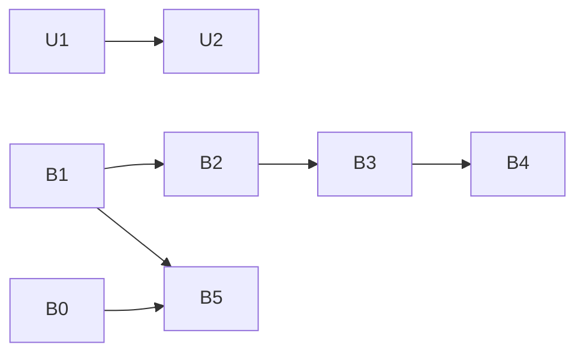

# ZiFi S3: the SMB server and the online update - technical design

Status: design, 2026-10-04. Scope: the last two services of the ZiFi ESP32-S3 native firmware that the emulator
still answers with "not emulated" ([TODO.md](TODO.md) Z3b row "SMB (S3), the online update"; Z5 results rows
`ZIFISMB.WMF` and `ZIFIUPD.WMF`). Builds on [tdd.md](tdd.md) §7.2 (the native module) and §7.5 (the file bridge, FTP,
HTTPS through the host, WC Update). Docs only: no code changes come with this document.

Primary sources: the firmware [ZiFi-ESP32-S3-Zero](https://github.com/andrewinsidelazarev/ZiFi-ESP32-S3-Zero) at
commit `2e5ba83` (`s3-native-0.6.94`), the same commit as tdd §7. Links below use the `main` branch; line numbers
are from `2e5ba83`. Short names: **FW** = `https://github.com/andrewinsidelazarev/ZiFi-ESP32-S3-Zero/blob/main/`.

## Glossary

| Term | Meaning |
|:--|:--|
| SMB | Server Message Block: the Windows file-sharing protocol (also used by macOS Finder and Linux `smbclient`). SMB2 / SMB3 are its modern versions; a **dialect** is one exact version number (2.0.2, 2.1, 3.0, 3.0.2, 3.1.1) |
| NTLMSSP, NTLMv2 | the password login used inside SMB: the server sends a random challenge, the client answers with a hash of the password and the challenge; nobody sends the password itself |
| Signing | every SMB message carries a check value made with a key from the login, so it cannot be altered on the way. SMB 3.0.2 signs with AES-CMAC |
| Share, tree | a shared folder (`\\ZX-Evo\0`); connecting to it is a "tree connect". `IPC$` is the hidden share that carries remote procedure calls |
| srvsvc | the "server service" remote procedure call that lists a server's shares (what Explorer shows when you open `\\ZX-Evo`) |
| NBNS, LLMNR | name lookup on a local network without a DNS server: NetBIOS Name Service (UDP 137, broadcast) and Link-Local Multicast Name Resolution (UDP 5355, multicast) |
| WS-Discovery | how Windows finds devices for its "Network" folder: multicast UDP 3702 plus an HTTP description on TCP 5357 |
| libsmb2 | an open-source SMB2/3 library ([sahlberg/libsmb2](https://github.com/sahlberg/libsmb2)), client and (since 6.x) server; the firmware embeds a modified copy |
| VFS bridge | the firmware's way of reaching the SD card: it sends file requests (frames `40..5E`) to the Z80, and the Wild Commander plugin answers them ([tdd.md](tdd.md) §7.5) |
| WMF plugin | a Wild Commander plugin file: `ZIFISMB.WMF` starts the SMB server and answers the VFS; `ZIFIUPD.WMF` runs the online update |
| Manifest | a small text file that says which firmware version is published and its SHA-256 checksum |
| OTA | over-the-air firmware update: writing a new firmware image into the ESP's second flash slot and restarting into it |
| TTD sealed replay | a recorded session replays with no host and no network: every input from outside is in the journal ([tdd.md](tdd.md) §7.5 "HTTPS" and "WC Update") |
| Forward rule | `[NETWORK] Forward=tcp:<host port>:<guest port>`: a host program connecting to `127.0.0.1:<host port>` reaches the emulated server on `<guest port>` ([network recipe](../../../.recipe/peripherals/network.md)) |

## 1. What the real firmware does

### 1.1 The SMB server: commands and events

The plugin `ZIFISMB.WMF` v0.5.10
([SMB Server/src/smb_server.asm](https://github.com/andrewinsidelazarev/ZiFi-ESP32-S3-Zero/blob/main/SMB%20Server/src/smb_server.asm))
does, in order: `SYS_RESET` (the ESP restarts at every plugin start), up to 30 `PING`s until it answers, `SYS_INFO`
(firmware version after `FW:`), `WIFI_INI` with the whole `zifi.ini`, then `SMB_START` with fixed values
(`dw 445, "<WC drive digit>",0, "ZX-Evo",0, "WORKGROUP",0, "zx",0, "zx",0`, lines 519-524). Its main loop answers
VFS requests and shows the events; Esc sends `SMB_STOP`.

| Frame | Layout | Firmware |
|:--|:--|:--|
| `0B SMB_START` | `[port LE16][share\0][host\0][workgroup\0][user\0][password\0]`, fields may be omitted from the end, an empty one keeps the default (445, `SD`, `ZX-Evo`, `WORKGROUP`, `zx`, `zx`); limits share 31, host 15, workgroup 15, user 32, password 64 bytes | ACK `FE`, then `8B [status][port LE16][nbns 0/1]` (zeros on failure). [src/main.cpp](https://github.com/andrewinsidelazarev/ZiFi-ESP32-S3-Zero/blob/main/src/main.cpp) `processSmbStart` (843-875), [src/smb_server.cpp](https://github.com/andrewinsidelazarev/ZiFi-ESP32-S3-Zero/blob/main/src/smb_server.cpp) `SmbServer::Impl::start` (1658-1812) |
| `0C SMB_STOP` | empty | `8C [1]`; `8C [0]` after `EE "smb:stop timeout"` (3 s). `processSmbStop` (877), `Impl::stop` (1814) |
| `62` client event | `[state]`: 0 no client, 1 connected (login needed), 2 logged in | `sendClientEvent` (3757) |
| `63` operation event | ASCII `OP[ path]`, at most 31 bytes, repeats suppressed: `LOGIN`, `LOGOFF`, `TREE <share>`, `UNTREE`, `PIPE srvsvc`, `SHARES`, `OPEN`, `READ`, `WRITE`, `DIR`, `CACHE`, `FLUSH`, `INFO`, `RENAME`, `WATCH`, `ATTR`, `SETEOF`, `ALLOCATE`, `RESERVE`, `LISTENER RETRY` | `sendOperation` (3763) |
| `64` progress event | `READ\|WRITE\|DONE\|DELETE <done>/<total>` with sizes `512B` / `12.3K` / `1.23M`, at most 4 per second; empty = clear | `sendProgress` (3929), `formatTransferSize` |
| `66` Wi-Fi signal | `Wi-Fi [################]  NN%` every 2 s while FTP or SMB runs | main.cpp `formatWifiSignal` (70), `networkTaskLoop` (580-597); already emulated for FTP |

`SMB_START` order of work (main.cpp 843-875): refused with `EE "smb:ota active"` while the LAN OTA listener runs;
else close the TCP client, stop FTP, stop the WC updater (20 s, `smb:wc update stopping`), stop a previous SMB
(`smb:previous stopping`), set the time zone from `time:`, start. Start errors, each sent as `EE "smb:<text>"` before
`8B` zeros: `smb already running`, `smb no wifi`, `smb vfs bridge`, `smb payload null`, `smb port zero`,
`smb option too long`, `smb bad options` (trailing bytes, an empty middle field, `\` or `/` in the share),
`smb io psram`, `smb task create`, `smb listen failed:%d` (listener not ready in 5 s). `nbns` is 1 when UDP 137 was
bound and the host name fits 15 characters (`startDiscovery`, 3975).

Who stops SMB: `FTP_START` (`ftp:smb stopping`), `WCU_START`, `UPDATE_START` (LAN OTA, `ota:smb stopping`) and
`ONLINE_UPDATE` (`update:smb stopping`). FTP, SMB and the LAN OTA listener never run together. `NET_*`, `PING`, NTP
and weather do not stop SMB; they wait their turn on the same network task.

Threads (main.cpp 46-48, 431; smb_server.cpp 76-78): the UART and the VFS bridge on core 1, the network task
`zifi-net` on core 0, the SMB server in its own task `zifi-smb` on core 0 looping in libsmb2's `smb2_serve_port`
(backlog 4). Discovery (NBNS / LLMNR / WS-Discovery) is polled from `zifi-net`. Events go through the 8-deep
inter-core queue and are dropped when it is full.

### 1.2 The SMB server: protocol

Architecture: [src/smb_server.cpp](https://github.com/andrewinsidelazarev/ZiFi-ESP32-S3-Zero/blob/main/src/smb_server.cpp)
(10 345 lines) is an adapter on libsmb2's server mode (`struct smb2_server`, the `smb2_server_request_handlers` table
at ~1155-1177). libsmb2 does the framing, NEGOTIATE, SESSION_SETUP / NTLMSSP, signing, compound requests and
credits; the adapter turns each file operation into VFS requests through `requestVfs` / `requestVfsAt` (4224).

| Area | What the firmware does | Source |
|:--|:--|:--|
| Dialect | **only SMB 3.0.2**: `smb2_set_version(SMB2_VERSION_0302)` in `newClient` (1894); a client that does not offer 0x0302 is dropped ("No common dialects"). 3.1.1 is off on purpose (libsmb2 6.1.0 pre-auth hashing fails with Windows, comment at 1934). The plugin README's "2.0.2 / 2.1 / 3.0 / 3.0.2" is not what the code does; the host test asserts 0x0302 | smb_server.cpp, [lib/libsmb2/lib/libsmb2.c](https://github.com/andrewinsidelazarev/ZiFi-ESP32-S3-Zero/blob/main/lib/libsmb2/lib/libsmb2.c) `smb2_negotiate_request_cb` (4487-4561), [tools/host_smb/build_and_test.py](https://github.com/andrewinsidelazarev/ZiFi-ESP32-S3-Zero/blob/main/tools/host_smb/build_and_test.py) |
| SMB1 start | an SMB1 multi-protocol NEGOTIATE (`FF 'SMB' 72`) gets the SMB2 wildcard answer 0x02FF (caps LARGE_MTU, SecurityMode 1); the client then sends an SMB2 NEGOTIATE | lib/pdu.c 523, lib/socket.c 486 |
| NEGOTIATE answer | caps LARGE_MTU \| ENCRYPTION (0x44), no LEASING; SecurityMode 1 (signing enabled, not required); a new random server GUID per start (`makeServerInstanceGuid`, 270); max read / write / transact 64 KiB | smb_server.cpp |
| Login | NTLMSSP only, no guest, no anonymous; `authorizeHandler` (8120) strips `DOMAIN\`, compares the user name case-insensitively, libsmb2 checks the NTLMv2 answer; a bad password is `STATUS_LOGON_FAILURE` and the connection stays (a new SESSION_SETUP may follow); random session and tree ids | smb_server.cpp, libsmb2.c 4337 |
| Signing | done when the client requires it (Windows 11 24H2 and recent macOS do), AES-CMAC for 3.0.2; `FSCTL_VALIDATE_NEGOTIATE_INFO` answered (signed) inside libsmb2. Encryption is advertised but never switched on | libsmb2.c 3830, smb_server.cpp 1754, 1942 |
| Trees | `IPC$` and the configured share (case-insensitive); else `STATUS_BAD_NETWORK_NAME`; 8 trees at most; share flag MANUAL_CACHING | `treeConnectHandler` (8181) |
| srvsvc | pipe `srvsvc` on `IPC$` (other names `OBJECT_NAME_NOT_FOUND`); DCE/RPC BIND, NetrShareEnum (opnum 15, levels 0 / 1 / 2: the share with remark "ZX Evo SD Card", `IPC$` hidden), NetrShareGetInfo, NetrShareCheck, NetrServerGetInfo level 101 ("ZiFi ESP32-S3 SMB Server", NT 10.0); other opnums fault 0x1c010002 | 8269, `ioctlHandler` (9275), lib/libsmb2-dcerpc.c 1114 (a ZiFi addition) |
| IOCTL | DFS referrals `STATUS_FS_DRIVER_REQUIRED`; object id / file regions `INVALID_DEVICE_REQUEST`; PIPE_WAIT success; PIPE_TRANSCEIVE srvsvc; QUERY_NETWORK_INTERFACE_INFO and the rest `NOT_SUPPORTED` | 9275 |
| CREATE | 8 open handles; DELETE_ON_CLOSE; contexts MxAc, QFid answered, DHnC / DH2C seen but not honored, RqLs answered with lease NONE; oplock NONE | 8239, 9158 |
| READ / WRITE | 64 KiB; credit target 8 (`SMB2_SERVER_CREDIT_TARGET`), up to 8 queued requests, one physical read or write at a time; after 30 s an interim `STATUS_PENDING`, after 90 s without progress `STATUS_IO_TIMEOUT`; a whole-file read cache up to 640 KiB (Explorer reads files twice) | `activateRead` 5603, `activateWrite` 5633 |
| QUERY_DIRECTORY | Full / Both / IdBoth / IdFull classes; a directory snapshot cache; cold directories read through VFS with a 250 ms budget per answer; `NO_MORE_FILES` at the end | 9591, [src/directory_cache.cpp](https://github.com/andrewinsidelazarev/ZiFi-ESP32-S3-Zero/blob/main/src/directory_cache.cpp) |
| QUERY_INFO | file: Basic, Standard, EA, All, Internal, NetworkOpen, Name, Position, Stream; volume: Attribute ("FAT32", 255), Device, Control, Volume, Size, FullSize, SectorSize (from VFS `43` / `44`); SECURITY `NOT_SUPPORTED` | 9741 |
| SET_INFO | Basic (attributes mask 0x27 + times -> VFS `5E`), Disposition, Allocation, EndOfFile (VFS `5C`), Rename (same folder without replace: `59`, else `5D`); hard links etc. `NOT_SUPPORTED` | 10016 |
| Others | LOCK (32 ranges, no waiting), CANCEL, ECHO, FLUSH, CHANGE_NOTIFY (8 watches, only changes made through this server) | 9168, 9390, 9686 |
| Time | FAT times are local; converted to UTC with the `time:` hours of `zifi.ini` | `fileTimeToFat` (648) |
| Errors | FILEX status -> NTSTATUS: 01 END_OF_FILE, 13 / 14 / 1C / 1D / 23 INVALID_PARAMETER, 15 NOT_SUPPORTED, 18 MEDIA_WRITE_PROTECTED, 19 OBJECT_NAME_NOT_FOUND, 1A OBJECT_NAME_COLLISION, 1B DIRECTORY_NOT_EMPTY, 22 DISK_FULL, other IO_DEVICE_ERROR | `smbStatusFromFilex` (615) |
| Limits (README) | no TCP 139, no 3.1.1, no durable handles, files under 4 GiB, no ACLs or alternate streams, one physical file at a time | [SMB Server/README.md](https://github.com/andrewinsidelazarev/ZiFi-ESP32-S3-Zero/blob/main/SMB%20Server/README.md) |

SMB operation to VFS request (the bridge frames of [TODO.md](TODO.md) "The file bridge"; layouts in
[docs/PROTOCOL.md](https://github.com/andrewinsidelazarev/ZiFi-ESP32-S3-Zero/blob/main/docs/PROTOCOL.md)):

| SMB operation | VFS | Note |
|:--|:--|:--|
| a path's details | `40 STAT` | `statPath` (4425) |
| a cold folder listing | `41 OPENDIR`, then `42 READDIR [count]` batches (each batch ends with `[02]` more / `[01]` end) | `activateDirectory` (5743) |
| free space | `43 FSINFO`, plus `44 FAT_WINDOW` when the free count is unknown (FAT read in 512-byte multiples, up to 31 sectors, 8 entries per bit-byte) | [src/fat_allocation_cache.cpp](https://github.com/andrewinsidelazarev/ZiFi-ESP32-S3-Zero/blob/main/src/fat_allocation_cache.cpp) |
| open | `50 OPEN` mode 3 (FILEX random access); mode 1 for a new empty file; mode 0 only as a fallback | |
| data | `5B SEEK` + `58 READ_WINDOW` / `57 WRITE_WINDOW`; `51` / `56` when the plugin lacks the window capabilities | |
| close, delete, folder, rename, move, size, metadata | `53`, `54`, `55`, `59`, `5D` (flag bit 0 = replace), `5C`, `5E` | `5A EXTEND` and OPEN mode 2 are not used by SMB |

VFS timeouts: 10 s, 190 s for changes (`kNormal/kMutateVfsTimeoutMs`).

### 1.3 Discovery

| Service | Firmware behavior | Source |
|:--|:--|:--|
| NBNS, UDP 137 | answers a name query (type 0x20) for the host name with suffix 0x00 / 0x20, flags 0x8500, TTL 15, the module's IPv4; no node status, no registration, no browser announcements | smb_server.cpp `answerNbns` (4070) |
| LLMNR, UDP 5355, 224.0.0.252 | A / ANY queries for the host name (one label), TTL 15, IPv4 only | `answerLlmnr` (4141) |
| WS-Discovery, UDP 3702, 239.255.255.250 | Hello at start and every 30 s, Bye at stop, ProbeMatches / ResolveMatches unicast to the asker (WS-Discovery 2005/04, SOAP 1.2, `dp:Device pub:Computer`); an HTTP server on TCP 5357 answers WS-Transfer Get (FriendlyName = host name, Manufacturer "ZiFi", ModelName "ZX Evolution SMB Server", `HOST/Workgroup:WG`); the endpoint id is `ZiFiSMB!` + the eFuse MAC | [src/ws_discovery.cpp](https://github.com/andrewinsidelazarev/ZiFi-ESP32-S3-Zero/blob/main/src/ws_discovery.cpp), [src/ws_discovery_xml.cpp](https://github.com/andrewinsidelazarev/ZiFi-ESP32-S3-Zero/blob/main/src/ws_discovery_xml.cpp) |
| mDNS / Bonjour | none: macOS users type `smb://<IP>` | - |

An address change restarts all three (`addressChanged`, 3997).

### 1.4 The online update

The plugin `ZIFIUPD.WMF` ("ZiFi Online Update v0.6",
[Online Update/README.md](https://github.com/andrewinsidelazarev/ZiFi-ESP32-S3-Zero/blob/main/Online%20Update/README.md),
[Online Update/src/updater.asm](https://github.com/andrewinsidelazarev/ZiFi-ESP32-S3-Zero/blob/main/Online%20Update/src/updater.asm)):
`SYS_RESET`, PING until ready, `SYS_INFO` ("Current:"), `WIFI_INI`, then `0E ONLINE_UPDATE_CHECK` ("Available:").
The status line follows the relation: "Same version. ENTER = reinstall", "New version available. ENTER = install",
"Older version. DOWNGRADE BLOCKED" (no install offered), "Different build. ENTER = install". Enter sends
`0D ONLINE_UPDATE`; a 32-cell bar shows events `65` ("Reading version and SHA-256", "Downloading firmware.bin",
"Checking SHA-256 and installing"); at the end "SHA-256 OK. ESP is restarting", 60 HALTs, PING until ready,
`SYS_INFO` again and "Update completed. ESC = return" (or "Installed; ESP restart not confirmed"). It does not run the
check again. Any `EE` ends the wait and shows its text; silence over ~5 s gets a PING, ~5 minutes of silence is
"ERROR: online update failed".

| Frame | Layout | Firmware |
|:--|:--|:--|
| `0E ONLINE_UPDATE_CHECK` | empty | `FE`, then `8E [status][relation][version ASCII]`; relation 0 SAME, 1 NEWER, 2 OLDER, 3 DIFFERENT ([include/zifi/protocol.hpp](https://github.com/andrewinsidelazarev/ZiFi-ESP32-S3-Zero/blob/main/include/zifi/protocol.hpp) 106, 126-131). Not in the PROTOCOL.md command table, only in its prose (153-157) |
| `0D ONLINE_UPDATE` | empty (the Z80 cannot give a URL) | `FE`, events `65`, then `8D [status][SHA-256 32 bytes]`; on success flush, 250 ms, restart (main.cpp 1427-1435). No cancel: only `SYS_RESET` |
| `65` progress | `[stage][percent]`: 1 manifest, 2 firmware, 3 verify / install | [include/zifi/online_updater.hpp](https://github.com/andrewinsidelazarev/ZiFi-ESP32-S3-Zero/blob/main/include/zifi/online_updater.hpp) 11-15; lossy queue |

**Check** (main.cpp `processOnlineUpdateCheck` 976-1009, [src/online_updater.cpp](https://github.com/andrewinsidelazarev/ZiFi-ESP32-S3-Zero/blob/main/src/online_updater.cpp)
`loadManifest` 171-230): joins Wi-Fi if needed, closes the TCP client only (FTP, SMB and WC Update keep running), then
`GET https://raw.githubusercontent.com/andrewinsidelazarev/ZiFi-ESP32-S3-Zero/refs/heads/main/firmware/firmware.sha256`
through `NetClient` (the same HTTPS client as `HTTP GET`: CA bundle, HTTP/1.0, header 2048 bytes in 10 s, up to 5
redirects, no downgrade, chunked refused, the proxy never used for TLS). Events `65 [1][0]` and `65 [1][100]`.
The [manifest](https://github.com/andrewinsidelazarev/ZiFi-ESP32-S3-Zero/blob/main/firmware/firmware.sha256) is text,
not JSON (`parseManifest` 64-154): exactly one `VERSION <v>` line (1-31 characters of `A-Za-z0-9._+-`) and one
`<64 hex> [*]firmware.bin` line (the exact name; `path/firmware.bin` ignored); today

```
VERSION s3-native-0.6.94
E39DB73BCA240FEBFA6CAC8F5D0C203AF89B5D168EE1C84C0C1E090EEE59A6C5  firmware.bin
1BDE88B4D40A6BF40726C548CDDF5131304BF48B5258D00FE8FD89DB4936A7F2  firmware.factory.bin
```

**Version compare** (main.cpp `parseReleaseVersion` 119-127, `comparePublishedVersion` 129-160): equal strings are
SAME (even when not parseable); else both must parse as `s3-native-%u.%u.%u` with nothing after it, or the result is
DIFFERENT (a `-log` build, the ESP-01S `native-0.2.2`); else major, minor, patch compared as numbers: NEWER / OLDER;
equal numbers with different text (`0.6.094`) are DIFFERENT.

**Errors** (`EE` text, at most 48 bytes, then `8E [0]` / `8D [0]`): `update-check:no wifi`,
`update-check:ota listener active`, `update-check:manifest http <code>`, `...:manifest length` (no Content-Length, or
1024 bytes or more), `manifest overflow`, `manifest short`, `manifest version or sha`, the HTTPS errors
(`tls connect failed`, `header timeout`, `chunked unsupported`, `too many redirects`, `redirect tls downgrade`), and
`network busy` while another network command runs.

**Install** (`processOnlineUpdate` 1011-1052, `installFirmware` 245-388): the same guards (`update:no wifi`,
`update:ota listener active`), close the client, stop FTP, stop SMB (`update:smb stopping`; WC Update is not
stopped), the manifest again, then `GET .../firmware/firmware.bin` (1 207 936 bytes today): `firmware http <code>`,
size 36 bytes .. free OTA slot (1 966 080 bytes, [partitions.csv](https://github.com/andrewinsidelazarev/ZiFi-ESP32-S3-Zero/blob/main/partitions.csv))
or `firmware does not fit`; the 36-byte image header must be an ESP32-S3 application (magic `E9`, chip id 9 at +12,
`ABCD5432` at +32, [src/ota_image.cpp](https://github.com/andrewinsidelazarev/ZiFi-ESP32-S3-Zero/blob/main/src/ota_image.cpp))
or `not ESP32-S3 application`; then 1 KiB blocks into the flash and SHA-256, stage 2 progress every 5 points and at
100; stage 3: `sha256 mismatch` / `update end`; any failure aborts and the old firmware stays. After the restart the
new firmware marks itself valid only when it starts cleanly (rollback otherwise, main.cpp 100-111).

**ESP-01S** ([ZiFi-ESP-01S-Native-C-Project](https://github.com/andrewinsidelazarev/ZiFi-ESP-01S-Native-C-Project),
`90834e4`): no SMB, no online update. `0B`..`0E` hit the `default` case: `EE "unknown cmd 0B"` etc., no ACK, no
result frame. The emulator does this already (tdd §7.2).

## 2. SMB in the emulator: options and recommendation

### 2.1 Options

| | A. Port the firmware's code (smb_server.cpp + libsmb2) | B. Our own SMB2 server, the firmware as the specification | C. Host-side bridge (a real Samba / Windows share, or our server on host sockets) |
|:--|:--|:--|:--|
| Size | ~10 300 lines adapter + ~30 500 lines libsmb2 C + ~8 900 lines DCE/RPC; 640 KiB cache, 8 x 64 KiB pools | estimate 5 000-6 500 lines C++ + ~700 lines crypto | small glue, but the VFS frames to the Z80 disappear |
| License | libsmb2 LGPL-2.1-or-later, DCE/RPC BSD-2; both can be combined with the project's GPL-3 | ours (GPL-3); crypto from existing `digestpp` (MD5, SHA-1, SHA-2) plus small MD4 and AES-128 / CMAC | - |
| Platforms | libsmb2 has `_WIN32` / `_MSC_VER` paths (the firmware's `tools/host_smb` builds it with MSVC); MinGW and gcc `-Werror` not tried; it brings its own crypto, a second copy beside OpenSSL; zero-warning policy across ~40 000 foreign lines is a large, ongoing cost | plain C++20 like the FTP / WebDAV servers | - |
| Fit with the virtual network | poor: libsmb2 owns its sockets (`smb2_serve_port`: listen, accept, `select()`), so a socket backend onto `EspStack` slots would have to be written inside the library | direct: `EspStack` slots like `ZiFiFtpServer` | none |
| Threads, time | a FreeRTOS task in the firmware; here a thread or a cooperative loop; `millis()` in 69 places to map onto the emulated clock | the emulation thread, emulated clock, as every ZiFi service | host threads |
| TTD | libsmb2's state (contexts, queued PDUs, NTLM state, crypto keys) cannot be saved; only a re-run from `SMB_START` against the journal, cost growing with the session (a 1 MB copy is thousands of frames), and only if libsmb2 is fully deterministic | state saved like the FTP server's jobs (journal references, no raw bytes); seeks anywhere | breaks sealed replay (the host share is outside the journal) |
| Faithfulness | highest for libsmb2's quirks; still needs the ESP's timing and memory stand-ins | the observable behavior (dialect, statuses, events, VFS traffic) from the firmware's code and tests; quirks only where a client sees them | not the firmware: the plugin never gets VFS requests |
| Effort | L-XL and open-ended (the socket backend, determinism audit, warnings, state) | L in phases, predictable | S, but it is not emulation |

### 2.2 Recommendation: B

Write `ZiFiSmbServer` as our own SMB 3.0.2 server in the style of `ZiFiFtpServer`: each SMB request is a job on the
emulation thread that waits for VFS results, socket bytes or time; the firmware's code is the specification, its
`tools/host_smb` tests are the conformance target. Reasons: TTD seeks anywhere in a copy (A cannot save libsmb2), no
40 000 foreign lines under the zero-warning rule on four compilers, and it plugs into `EspStack`, the one
`ZiFiVfsBridge` and the existing status / surfaces. C is out: it removes the part that matters, the Z80 plugin
serving the card.

What the server covers (exactly the firmware's surface, which is also what the common clients need):

| Piece | Content |
|:--|:--|
| Transport | direct TCP (4-byte length prefix), port from `SMB_START` (445), no 139; several connections, several sessions per connection |
| NEGOTIATE | SMB1 multi-protocol -> 0x02FF wildcard; SMB2 -> 0x0302 only (others: close, as the firmware), caps 0x44, SecurityMode 1, 64 KiB limits, server GUID per start |
| SESSION_SETUP | SPNEGO wrapping, NTLMSSP NEGOTIATE / CHALLENGE / AUTHENTICATE, NTLMv2 check ([MS-NLMP](https://learn.microsoft.com/en-us/openspecs/windows_protocols/ms-nlmp/b38c36ed-2804-4868-a9ff-8dd3182128e4)): MD4 (NT hash), HMAC-MD5; `LOGON_FAILURE` keeps the connection |
| Signing | 3.0.x key derivation (SP800-108 counter mode, HMAC-SHA256) and AES-128-CMAC ([MS-SMB2](https://learn.microsoft.com/en-us/openspecs/windows_protocols/ms-smb2/5606ad47-5ee0-437a-817e-70c366052962)); signed VALIDATE_NEGOTIATE_INFO; no encryption (as the firmware) |
| Commands | TREE_CONNECT / DISCONNECT, LOGOFF, CREATE (+ MxAc, QFid, RqLs -> NONE), CLOSE, FLUSH, READ, WRITE, LOCK, IOCTL subset, CANCEL, ECHO, QUERY_DIRECTORY (4 classes), CHANGE_NOTIFY, QUERY_INFO, SET_INFO; credits (target 8), compound requests, interim `STATUS_PENDING` |
| srvsvc | DCE/RPC BIND + the four opnums of §1.2 (NDR encoding of the share list by hand; small) |
| VFS mapping | §1.2 table through `ZiFiVfsBridge`; new in the bridge: `44 FAT_WINDOW` (all others exist for FTP / WC Update: batched `42`, `5B`, `5C`, `5D`, `5E`); the directory snapshot and the 640 KiB read cache, because they decide which VFS frames the plugin sees |
| Events, status | `62 / 63 / 64` with the firmware's texts and rate limits; `66` shared with FTP |
| Sockets | `EspStack` slots: FTP and SMB never run together, so SMB takes the FTP range (2-9, 14) for its listener and connections; the three discovery UDP sockets and the HTTP 5357 listener need more, so `kSlots` grows from 16 to 24 (the bridge section already saves slots beyond the eighth) |
| Randomness | server GUID, NTLM challenge, session / tree ids from a deterministic generator seeded at `SMB_START` and saved with the state (the ESP uses its hardware RNG; any value is valid, and no outside contact means nothing to log) |

### 2.3 The network: ports, forwards, privileges, discovery

The module's server listens on guest port 445 of the virtual network (`EspStack::Listen`). A host client reaches it
through a Forward rule; the host side listens on `127.0.0.1` only (`IHostNet::TcpListen`).

| Host | Port 445 on the host | What works |
|:--|:--|:--|
| macOS | binding below 1024 needs no root since 10.14, but 445 is taken while File Sharing is on, and `netbiosd` holds UDP 137 | `Forward=tcp:4450:445`, Finder "Connect to Server" `smb://zx@127.0.0.1:4450/0`; `smbutil` / `mount_smbfs` the same |
| Linux | below 1024 needs `CAP_NET_BIND_SERVICE` or `net.ipv4.ip_unprivileged_port_start`; Samba may hold 445 / 137 | `smbclient //127.0.0.1/0 -p 4450 -U zx%zx` ([smbclient](https://www.samba.org/samba/docs/current/man-html/smbclient.1.html)); `mount.cifs ... port=4450` |
| Windows | 445 and 137 belong to the system (Server service, NetBT): cannot be bound | Windows 11 24H2 / Server 2025 clients take another port: `net use \\127.0.0.1\0 /TCPPORT:4450` ([alternative SMB ports](https://learn.microsoft.com/en-us/windows-server/storage/file-server/smb-ports)); older Windows needs a second machine or VM pointing at the emulator host (only with a LAN-facing listener, below) |

Decisions:

1. **Default forward for the plugin's port**: none is added silently (owner's rule: settings are explicit). The
   `esp.native_session.file_bridge.smb` status shows `host_port` and a note when no Forward rule covers 445, as FTP
   does today (`host_port_note`). The recipe gives `Forward=tcp:4450:445`.
2. **Discovery runs inside the virtual network, faithfully** (NBNS, LLMNR, WS-Discovery + HTTP 5357 answer guest-side
   queries; `8B`'s `nbns` byte is 1 as on a module that bound UDP 137). Reaching them from the host needs **UDP
   forwards**, which the virtual network does not have (`Forward=` parses `tcp:` only, `NetworkManager` line ~1291).
   New generic piece: `Forward=udp:<host port>:<guest port>` (host datagrams to a guest UDP listener, answers back).
   Multicast (LLMNR, WS-Discovery Hello) does not cross the virtual network's NAT, exactly as on a home router: the
   Hello is visible in the status and the traffic capture (#91), not on the host LAN.
3. **A LAN-facing listener** (bind `0.0.0.0` so another PC, or an older Windows, can connect, and real WS-Discovery
   to the LAN): decided network-wide (owner, 2026-10-04): `0.0.0.0` by default with an "allow remote access" setting
   (§6 item 1; phase N0)
   (the SN6 host bridge carries frames for frame cards only; the ESP is socket-level).

### 2.4 TTD sealed replay

- **SMB server**: all its inputs are already journaled network events (TCP bytes, connects, closes) and VFS answers
  from the emulated Z80; its randomness is seeded from saved state. The server is deterministic emulator code, so it
  needs no contact log (the FTP / WebDAV pattern). State saved in the ZiFi blob's bridge section
  (`kBridgeVersion` 3): connections, sessions (keys, signing state, ids), trees, open handles, queued requests per
  connection (received bytes as journal references), the in-flight VFS job, caches by reference where the bytes came
  from the journal, else raw, the event rate timers. Older blobs load with no SMB.
- **Online update**: an outside contact (HTTPS to GitHub). It reuses `ZiFiHttpFetch` (journal references for the
  body) and, if built as a coroutine like `ZiFiWcUpdater`, the same primitive-log approach: the state is the request
  + the log of primitive results + the primitive in flight; a load re-runs against the log with no side effects.
  The firmware image (1.2 MB) is hashed while it arrives and not kept (the running SHA-256 state and the byte count
  are the state; the bytes stay in the journal).

### 2.5 Concurrency and the one VFS bridge

As the firmware: FTP, SMB and the LAN OTA listener exclude each other (`StopFileServers` gains SMB; `FTP_START`,
`WCU_START`, `UPDATE_START`, `ONLINE_UPDATE` stop it with their `...:smb stopping` texts; `SMB_START` stops FTP and
WC Update, `Op::WcuStop` exists). The ESP-01S WebDAV never meets SMB (other firmware). One `ZiFiVfsBridge`: one
physical VFS operation at a time; SMB queues per its own async FIFOs (read, write, directory, create, close) in the
firmware's order, which is what fixes the VFS frame order the plugin sees. Network commands during SMB
(`NET_*`, NTP, weather, the online-update check) run as on the S3: the network task is shared, the SMB task is
separate, so they interleave; the emulator runs both on the emulation thread with the firmware's ordering at frame
boundaries [inferred: core-0 task interleaving at 1 ms granularity is not observable through the UART].

### 2.6 ESP01S vs S3

Nothing to build for the ESP-01S: `0B`..`0E` already answer `EE "unknown cmd XX"` with no ACK. Tests pin it.

## 3. ONLINE_UPDATE_CHECK and ONLINE_UPDATE

`ZiFiOnlineUpdater` (new, `zifionlineupdater.{h,cpp}`): the firmware's `OnlineUpdater` as a small coroutine on the
`ZiFiWcUpdater` primitive machinery (fetch, event with queue room, time), using `ZiFiHttpFetch` on its own socket
slot (11, free in today's map - FTP 2-9 / 14, WC Update 10, WebDAV 12 / 13 / 15; slot 10 stays the WC updater's because the check does not stop WC Update) and the module's
`Op` / `network busy` rules. Manifest URL and image URL as the firmware (§1.4), constants in one place; a
`[NETWORK]`-free test override (`ZiFiOnlineUpdater::SetSource`) points tests at a fake host.

**Check** - fully faithful: Wi-Fi guard, `65 [1][0]`, GET, the manifest parser (the firmware's rules, including
the 1024-byte limit and duplicate lines), `65 [1][100]`, `8E [1][relation][version]` with `comparePublishedVersion`
against the emulated firmware's own version string (`s3-native-0.6.94`). With today's manifest the answer is SAME;
when the author publishes 0.6.95 it becomes NEWER, as on a real module.

**Install** - what the emulator can and cannot do. Everything before the flash write is real; the flash write cannot
change what the emulator runs. Behavior:

| Relation of the published version | Emulator |
|:--|:--|
| SAME (reinstall) | exactly the firmware: manifest, image download with stage-2 progress, header check, SHA-256, stage 3, `8D [1][sha]`, restart after 250 ms; after the restart `SYS_INFO` reports the same version. Indistinguishable from a real reinstall |
| NEWER / DIFFERENT / OLDER (the plugin blocks OLDER, a test may send `0D` anyway) | download, header check and SHA-256 as the firmware (a mismatch fails as `update:sha256 mismatch` etc.), stage 3 `[3][0]`, then **`EE "update:flash not emulated"`** and `8D [0]`; the module keeps running. The plugin shows the text, which is honest and fits its error path (§1.4: any `EE` ends the wait) |

Rejected: pretending success for a different version (the plugin would print "Update completed" with the old
version), and skipping the download (the progress and network behavior would not be checked). The status records
`online_update {last_check: {version, relation}, last_install: {result, sha256, bytes}}`.

## 4. Test plan

| Id | Test | Kind |
|:--|:--|:--|
| T-SMB-1 | `ZiFiSmbCrypto_Test`: MD4 / HMAC-MD5 / AES-128 / AES-CMAC / SP800-108 against RFC 1320, RFC 4493 and MS-SMB2 / MS-NLMP published test vectors | unit |
| T-SMB-2 | `ZiFiSmbServer_Test` with a fake client and the fake plugin of `ZiFiWcUpdater_Test`: SMB_START parsing (defaults, limits, every error text), SMB1 wildcard, 3.0.2-only negotiate (a 3.0-only client dropped), NTLMv2 good / bad password / wrong user, signing on and off, IPC$ + srvsvc share list, tree limits, CREATE / READ / WRITE / CLOSE mapping to the exact VFS frames of §1.2, directory batches, FAT_WINDOW free space, SET_INFO paths, LOCK, CANCEL, CHANGE_NOTIFY, credits and compounds, interim PENDING at 30 s, IO_TIMEOUT at 90 s, events 62 / 63 / 64 texts and rates, FILEX -> NTSTATUS table, time-zone conversion | unit |
| T-SMB-3 | TTD: seek into a recorded copy (VFS waiting for `57`, a queued READ) restores the same server state every time; a blob without SMB loads | unit |
| T-SMB-4 | discovery: NBNS / LLMNR answers, WS-Discovery Probe / Resolve / Get bodies against the firmware's XML; `Forward=udp:` round trip | unit |
| T-SMB-5 | ESP-01S: `0B`..`0E` -> `EE "unknown cmd XX"`, nothing else | unit |
| T-SMB-6 | conformance in `scratch/` (not committed): `smbclient -m SMB3_02` (ls, get / put 1 MB byte-exact, mkdir, rename, rm), impacket raw negotiate / session probes ([impacket](https://github.com/fortra/impacket); its default dialect list may lack 3.0.2 [to verify], then `preferredDialect`), the firmware's `tools/host_smb` libsmb2-client scenarios (`smb_reproduce_test.c`, built in scratch against upstream libsmb2) run against the emulator; macOS Finder / `mount_smbfs`; Windows 11 24H2 `net use /TCPPORT` when a Windows host is available | conformance |
| T-SMB-7 | real `ZIFISMB.WMF` v0.5.10 under WC Improved on TS-Conf, `ZiFi=ZIFI-NATIVE,S3`, TTD recording (rolling limit) before every run: status lines (Client / Last / Copying / Wi-Fi), copy 100 KB both ways byte-exact (also on the exported card), folder listing, rename, delete, Esc stops; a TTD seek mid-copy | program |
| T-UPD-1 | `ZiFiOnlineUpdater_Test` with a fake HTTPS host: manifest parser cases (the firmware's test cases incl. CRLF, `*firmware.bin`, `path/firmware.bin` decoy, duplicates, 1024-byte limit), the version compare table, events, every error text, `network busy`, Wi-Fi guard | unit |
| T-UPD-2 | install: SAME -> `8D [1][sha]` + restart; NEWER -> download + SHA + `update:flash not emulated`; bad header, size, SHA mismatch; SMB stopped first, WC Update not; TTD seek during the download | unit |
| T-UPD-3 | real `ZIFIUPD.WMF` v0.6 against GitHub with TTD on: "Same version. ENTER = reinstall", Enter, the bar through all three stages, "Update completed" with the same version | program |

Surfaces (each with its docs: WebAPI + OpenAPI text, MCP, CLI, Lua, Python, Qt Network window status tree):
`esp.native_session.file_bridge.smb` (running, port, `host_port` / note, connections, sessions, user, trees, open
handles, last operation, progress, bytes, VFS waits, discovery: nbns / llmnr / wsd counters) and
`esp.native_session.online_update`; MCP `[zifi]` line ("SMB on 445 (host 4450), n client(s)"); `Forward=udp:` in
`network set`, `POST /network/config` and every surface. Recipe: `.recipe/peripherals/network.md` ZiFi section gets
"SMB from the host" (per OS, as §2.3) and "Online update"; [TODO.md](TODO.md) Z5 rows updated; tdd.md §7.5 gets the
as-built sections.

## 5. Phases and estimate

S < 1 week, M 1-2 weeks, L 2-4 weeks (one developer, including tests, surfaces and docs of that phase).

| Phase | Content | Tests | Size | Depends on |
|:--|:--|:--|:--|:--|
| **U1** online update check | `ZiFiOnlineUpdater` (coroutine on the WC updater primitives, `ZiFiHttpFetch` slot 11), manifest parser, version compare, events `65`, errors, status, surfaces, recipe | T-UPD-1, T-UPD-3 (check part) | S | Z3b HTTPS, WC Update (done) |
| **U2** online update install | download, header check, streaming SHA-256 (`digestpp`), progress cadence, SAME = real reinstall + restart, else `update:flash not emulated`; stops FTP / SMB | T-UPD-2, T-UPD-3 | S | U1 |
| **B0** UDP forwards | `Forward=udp:<host>:<guest>`, guest UDP listener for host datagrams, journal, TTD, every surface | `Forward=udp` unit + virtual network tests | S | - |
| **B1** SMB core | `ZiFiSmbServer` transport, SMB1 wildcard, NEGOTIATE 3.0.2, SPNEGO / NTLMSSP / NTLMv2, signing (MD4, AES-CMAC, KDF), sessions, trees, IPC$ + srvsvc, ECHO / LOGOFF, `SMB_START` / `SMB_STOP` with every text, exclusion with FTP / WC Update / OTA, events 62 / 63, deterministic ids | T-SMB-1, T-SMB-2 (session part), T-SMB-5 | M | - |
| **B2** SMB files | CREATE / CLOSE / READ / WRITE / FLUSH / QUERY_DIRECTORY / QUERY_INFO / SET_INFO / LOCK / CANCEL / CHANGE_NOTIFY / IOCTL; credits, compounds, interim PENDING, timeouts; the VFS mapping incl. new `44 FAT_WINDOW`, directory and read caches, event 64 | T-SMB-2 (file part) | L | B1 |
| **B3** SMB TTD, status, surfaces | bridge section `kBridgeVersion` 3, `file_bridge.smb` on all five surfaces + OpenAPI + Qt, recipe "SMB from the host" | T-SMB-3 | M | B2 |
| **B4** conformance and the real plugin | smbclient, impacket, the libsmb2 scenarios, Finder, Windows 24H2 where available; `ZIFISMB.WMF` under WC with TTD; fixes found; tdd §7.5 as built, TODO Z5 rows | T-SMB-6, T-SMB-7 | M | B3 |
| **B5** discovery | NBNS, LLMNR, WS-Discovery + HTTP 5357 inside the virtual network, `nbns` byte, status counters; host reach through B0 | T-SMB-4 | S | B1, B0 |

Total: about 9-12 weeks (U1 + U2 ~1.5 weeks, independent of SMB and can go first; SMB B0-B5 ~8-10 weeks; B0 and
B5 can run beside B2).



## 6. Open questions

1. ~~A LAN-facing listener~~ **Decided (owner, 2026-10-04):** host listeners of the virtual network bind `0.0.0.0` by
   default, with a network-wide setting "allow remote access" (on by default; off = `127.0.0.1` only). It applies to
   every `Forward=` listener (TCP now, UDP with B0), not per device, and is available on every automation surface and
   in Qt. Implementation: PLAN #92 phase N0 (before B0).
2. The plugin README claims 2.0.2 / 2.1 / 3.0 / 3.0.2; the code negotiates 3.0.2 only. We follow the code; ask the
   author whether the README or the code is intended (same channel as tdd §7.4).
3. The firmware's 640 KiB read cache and directory cache shape the VFS traffic; B2 copies their policies. If a
   simpler cache gives the same frames for the tested clients, keep the simpler one (measure, naive first).
