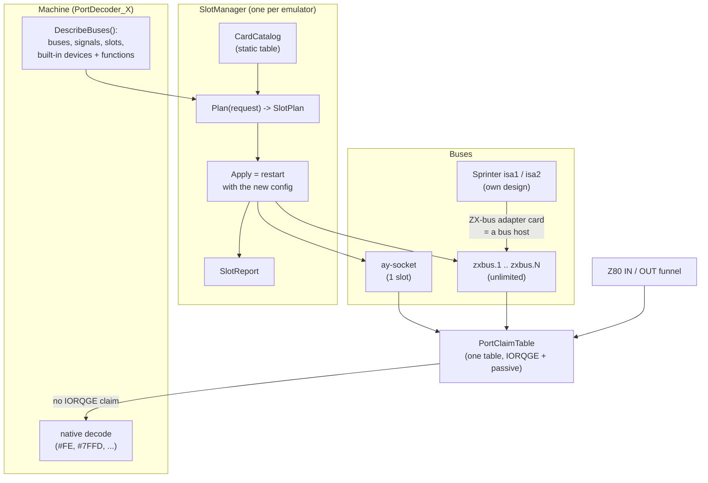

# ZX-bus slots: architecture

| | |
|---|---|
| **Date** | 2026-10-03 |
| **Status** | Draft for owner review |
| **Requirements** | [requirements.md](requirements.md) |
| **Decisions** | [open-questions.md](open-questions.md) Q1-Q6 |
| **Matrix** | [compatibility-matrix.md](compatibility-matrix.md) |
| **Plan and tests** | [tdd.md](tdd.md) |
| **Related** | [Sprinter ISA](../2026-10-02-sprinter-isa/tdd.md) (the first slot bus), [Sprinter network](../2026-10-02-sprinter-network/tdd.md) (`IIoBusDevice`, `NetworkCapabilities::expansionSlots`), [media manager](../2026-09-28-storage-manager/technical-design.md) (slot / medium split, queued changes), TTD v2 D38 (device set fixed per session; branch `ttd-engine`, `phase-2-device-state-tdd.md` §5.4.3) |

## Contents

1. [What exists today](#1-what-exists-today)
2. [Target model](#2-target-model)
3. [Declarations: machines and cards](#3-declarations-machines-and-cards)
4. [The port claim table and IORQGE](#4-the-port-claim-table-and-iorqge)
5. [SlotManager: plan and apply](#5-slotmanager-plan-and-apply)
6. [Configuration](#6-configuration)
7. [Ownership of existing devices](#7-ownership-of-existing-devices)
8. [TTD and snapshots](#8-ttd-and-snapshots)
9. [Automation surfaces and Qt](#9-automation-surfaces-and-qt)
10. [Performance](#10-performance)
11. [Risks](#11-risks)

## 1. What exists today

Facts from master (`bef7a17f4`); file references are repository-relative.

**Three port-claim mechanisms, not two** (`core/src/emulator/ports/portdecoder.h`):

| Mechanism | Storage | Users |
|---|---|---|
| Exact port map, reached from each machine decoder's `switch` on the *decoded* port | `std::map<uint16_t, PortDevice*> _portDevices`; `RegisterPortHandler`; `PeripheralPortIn/Out` | WD1793, AY / TS / TSFM, GS |
| Full-decode observers, tapped in the Z80 funnel before the machine decode | `_fullDecodeDevices` map + `_fullDecodeLowByteDevices[256]`; `NotifyFullDecodeIn/Out` | MoonSound, ZXNETUSB (`#AB`), ZX-WiFi `ComPort` (`#EF`) |
| Self-decoding devices, tried after the machine decode found nothing | `_selfDecodingDevices` vector; `DispatchSelfDecodingIn/Out` (Pentagon, ATM3, Scorpion only) | Covox / SounDrive |

**Priority rules spread over the code:** `Z80::inFromBus` lets an observer's value win only if it claims the read
or the machine decoded nothing ("R6"); `OverrideDecodeForFullDecodeClaim` makes the motherboard decode stand down for
a claiming low-byte card (except Beta-128 ports); IDE decodes first in every decoder. There is **no IORQGE concept**.

**Device ownership:** `SoundManager` owns one GS slot (`_gs`: LLE / LW / NeoGS), one TurboSound slot
(`_turboSound`: AY / TS / TSFM), the Covox and the MoonSound; `NetworkManager` owns network cards and already plans
changes (`MakePlan`) against `NetworkCapabilities` (`zxBus`, `internalIo`, `expansionSlots`); the Sprinter's
`SprinterIsaBus` owns ISA cards. Cards are chosen by INI keys at create time; only the GS personality and the network
set change at run time.

**Gaps:** no catalog of cards, no declaration of buses per machine (besides `ZxBusPresent()`, `DescribeNetwork()`,
`HasKempstonJoystick()`, `ReservesLowByte()`), no compatibility rules beyond "one GS slot / one TS slot", the clash
analysis (`FindFullDecodeClashes`) runs only in tests, MoonSound vs Profi `#7E` is handled by an INI comment, and the
hot path does a `std::map::find` on every IN / OUT even with no card fitted.

## 2. Target model



- **Bus kinds:** `ay-socket` (one slot; holds the built-in AY or a TurboSound board in its place), `zxbus` (Nemo /
  ZX-bus), `sinclair-edge`, `scorpion` (if it differs electrically; research step SL-0), and the Sprinter's `isa8`
  (unchanged design; its ZX-bus adapter card hosts a `zxbus` of its own).
- **Card instance** = card type + options + slot. Cards are built from shared chip modules and never fork them.
- **One owner of fitted cards:** `SlotManager`. `SoundManager` and `NetworkManager` keep the mixer and network
  plumbing, but stop deciding which cards exist (§7).

## 3. Declarations: machines and cards

### 3.1 Machine side

```cpp
// core/src/emulator/slots/busdeclaration.h (sketch)
enum class BusKind : uint8_t { AySocket, ZxBus, SinclairEdge, Scorpion, Isa8 };
enum class BusSignal : uint32_t { Iorqge = 1, IoDos = 2, Dos = 4, Wait = 8, Plus12V = 16, Reset = 32,
                                  RomCs = 64, M1 = 128, Rfsh = 256, Int = 512, Nmi = 1024 };

struct BusDeclaration
{
    std::string id;              // "ay-socket", "zxbus"
    BusKind kind;
    uint32_t signals;            // BusSignal mask
    int physicalSlots;           // informational (real board); our limit is unlimited (owner rule)
    ReadConflictRule readRule;   // what a read returns when two non-IORQGE drivers answer (default WiredAnd)
};

struct BuiltInDevice
{
    std::string id;              // "ay", "turbosound-fpga", "covox-board", "beta128"
    std::vector<Function> functions;
    std::vector<PortClaim> ports;
    bool switchable;             // a machine setting can switch it off (R-COMP-5)
};

struct MachineBuses { std::vector<BusDeclaration> buses; std::vector<BuiltInDevice> builtIn; };

// New virtual on PortDecoder, next to DescribeNetwork(); the base returns the plain 48K declaration.
virtual MachineBuses DescribeBuses() const;
```

`DescribeNetwork()`'s `expansionSlots` and `zxBus` become views derived from `DescribeBuses()` (one source). The
Sprinter answers its ISA slots and, through a fitted ZX-bus adapter, a `zxbus` bus.

### 3.2 Card side

```cpp
// core/src/emulator/slots/cardcatalog.h (sketch)
struct PortClaim
{
    uint16_t mask, match;        // claims port p when (p & mask) == match
    PortDir dir;                 // In, Out, InOut
    bool iorqge;                 // true: the card pulls IORQGE; the machine decode stays silent on this cycle
    bool lockedOnRomFetch;       // MultiSound SAA / SounDrive: ignored while M1 runs from #0000-#3FFF
};

struct CardType
{
    const char* id;              // "multisound", "tsfm", "gs", "neogs", "moonsound", "soundrive", "covox-fb", "zxnetusb", ...
    const char* displayName;
    BusKind nativeBus;
    uint32_t requiredSignals;
    OptionSchema options;                                          // DIP switches, RAM sizes, firmware variants
    std::vector<Function> (*Functions)(const CardOptions&);       // claims follow the options (R-COMP-2)
    std::vector<PortClaim> (*Ports)(const CardOptions&);
    std::unique_ptr<ICard> (*Create)(CardContext&, const CardOptions&);
};
```

```cpp
class ICard                       // the running card
{
public:
    virtual ~ICard() = default;
    virtual const CardType& Type() const = 0;
    virtual uint8_t In(uint16_t port, uint64_t t, bool& drives) = 0;     // drives = false: card stays off the bus
    virtual void Out(uint16_t port, uint8_t value, uint64_t t) = 0;
    virtual uint8_t Peek(uint16_t port) const = 0;                      // debugger, no side effects
    virtual void BusReset(uint64_t t) {}                                // ZX /RESET
    virtual void FrameStart() {}
    virtual void FrameEnd() {}
    virtual void RegisterMedia(MediaManager&) {}                        // e.g. NeoGS sd.ngs
    virtual void UnregisterMedia(MediaManager&) {}
    virtual void RegisterMixerRows(SoundManager&) {}
    virtual void UnregisterMixerRows(SoundManager&) {}
    virtual void CollectTtdSerializers(std::vector<ttd::TTDSerializable*>&) {}
    virtual void Describe(CardReport& out) const = 0;
};
```

`ICard` deliberately mirrors `IIsaCard` / `IIoBusDevice` (Sprinter): an existing `IIoBusDevice` network device gets a
thin `ICard` wrapper, as `IsaBusDeviceCard` does for ISA.

### 3.3 Functions

A function is a short string from one enum-backed table (`ay-socket`, `gs`, `saa`, `soundrive`, `covox-fb`, `opl4`,
`midi`, `net.zxnetusb`, `serial.ef`, `kempston-joystick`, `kempston-mouse`, `beta128`, `ide.<scheme>`, ...). The
compatibility matrix is computed from them ([compatibility-matrix.md](compatibility-matrix.md)).

## 4. The port claim table and IORQGE

One table replaces the three mechanisms. It is rebuilt when the slot set changes (never on the hot path).

**Structure:**
- `std::array<uint8_t, 8192> claimedBits` - one bit per 16-bit port: "some card claims this port". The hot path for a
  port no card claims is one load and one bit test (cheaper than today's `map::find`).
- For a claimed port: a compact list in a per-low-byte bucket (`buckets[256]`), each entry `{mask, match, dir, iorqge,
  lockedOnRomFetch, ICard*}`, sorted IORQGE first, then slot order.

**OUT cycle:**
1. Every claiming card whose entry matches gets the write (bus writes are seen by every listener; a SounDrive
   and the machine can both latch).
2. If any matching entry has `iorqge`, the machine's native decode is skipped for this cycle. Otherwise the machine
   decodes as today.

**IN cycle:**
1. IORQGE claimers answer; the machine decode is skipped. Several IORQGE claimers on one port: the first by slot
   order drives, the clash is reported (it is an accidental clash, R-COMP-6, the later card is disabled at plan time,
   so at run time this cannot happen).
2. Otherwise passive claimers and the machine both may drive; the bus's `ReadConflictRule` combines them (default:
   wired AND, as an NMOS data bus with two drivers settles low; a machine declares otherwise if documented).
3. Nobody drives: the floating-bus rule of the machine, unchanged.

**Shadowing.** A built-in device whose port claims are covered by a card's IORQGE claims is *shadowed*: it is not
called for those ports, and if it is a sound source its mixer row is muted and marked `shadowed by zxbus.N` (the
hardware: it never sees the cycle, so it holds its last state and makes no new sound; a TurboSound in the ZX-Evo
FPGA stays silent).

**The `#DFFD` case (MultiSound):** the card claims `#DFFD` writes *without* IORQGE (its decode covers A15-A14 only,
IORQGE needs A13 = 1). The table delivers the write to the card *and* the machine's `#DFFD` paging, which is exactly
what the real board does.

**ROM-fetch lock:** entries with `lockedOnRomFetch` consult one flag the Z80 already has at hand (the last M1
address in `#0000-#3FFF`); the flag is computed only when such an entry matches.

**Migration of today's rules:** R6 ("legacy device keeps priority unless the observer claims") becomes "IORQGE claims
win; otherwise wired combine"; `OverrideDecodeForFullDecodeClaim` becomes an IORQGE claim; the Beta-128 exception
stays as a machine rule (Beta-128 is a built-in device with its own DOS gate); IDE first stays. Each rule move is a
separate, tested step (tdd.md phase SL-3).

## 5. SlotManager: plan and apply

```cpp
// core/src/emulator/slots/slotmanager.h (sketch)
struct SlotRequest
{
    enum class Op { Plug, Remove, SetOptions } op;
    std::string slot;                 // "zxbus.1", "ay-socket", "zxbus.next"
    std::string card;                 // Plug
    CardOptions options;              // Plug / SetOptions
    bool replaceIfIncompatible = false;  // automation flag (Q1, Q5)
    bool dryRun = false;
    media::Disposition mediaDisposition = media::Disposition::None;  // for removed cards' dirty media
};

struct SlotPlan
{
    bool allowed;                      // false: refused, reasons filled
    std::vector<std::string> reasons;  // human-readable, one per blocking item
    std::vector<RemovedCard> removed;  // slot, card, full options (enough to put it back), clashing functions
    std::vector<ShadowedDevice> shadowed;
    std::vector<Function> lostFunctions;
    std::vector<MediaRelease> media;   // slot id, dirty?, disposition applied
    Fit fit;                           // Real / Adapter / Unrealistic
    std::vector<SwitchedOff> builtInSwitchedOff;
};

class SlotManager
{
public:
    SlotPlan Plan(const SlotRequest& r) const;           // pure: no state change
    SlotPlan Request(const SlotRequest& r);              // Plan + (if allowed and !dryRun) write the config and restart
    void Describe(SlotReport& out) const;                // single source for every surface
    void DescribeMatrix(MatrixReport& out) const;
};
```

**Plan algorithm** (deterministic, R-OP-2):
1. Resolve the target slot (`zxbus.next` = the first empty `zxbus` slot; a new one is created, unlimited).
2. Compute the new card's functions from its options and its ports.
3. **Bus fit:** missing required signals on the slot's bus -> `Fit::Unrealistic` unless an adapter is configured in
   that slot (`Fit::Adapter`). Without `replaceIfIncompatible` (automation) or the UI's confirmation, refuse.
4. **Function clashes:** the union of every fitted card sharing any function with the new card -> `removed`.
   Built-in devices sharing a function: fixed -> refuse (even with the flag); switchable -> `builtInSwitchedOff`.
5. **Shadowing:** built-in devices covered by the new card's IORQGE claims -> `shadowed`. A *card* in a slot that would
   be shadowed (TSFM in the AY socket under a MultiSound) is a pointless pair -> `removed`, and the socket returns to
   the machine's own AY.
6. **Lost functions:** functions offered by removed cards and not by the new card.
7. **Media:** every media slot of every removed card; a dirty medium without a disposition -> refuse.
8. **TTD:** recording -> refuse ("TTD session <id> is recording; the device set is fixed for a session").
9. **Accidental port clashes** with remaining cards (overlap of claims not explained by functions): the new card is
   plugged in but `disabled: port #xxxx clashes with zxbus.2` (R-COMP-6).

For `SetOptions`, the same algorithm runs with "the card as it would be with the new options".

**Apply = restart with the new configuration** (owner decision Q6: no hot plug, no adventures). An allowed plan
writes the new slot set into the instance's configuration and restarts the machine through the same path as a model
switch (`ModelSwitch::Run` / `CreateEmulatorWithModel`): a new emulator is built from the configuration, every card
is created once at start, the claim table is built once, and media are carried over by `TakeMediaSet` with the
stranded-media rules (the removed cards' media slots, such as `sd.ngs`, are reported like stranded media). If the
new machine fails to start, the previous configuration is restored and started again, and the reply carries the
error. There is no card creation or destruction inside a running machine, so no frame-boundary queue, no partial
state and no rollback of live objects.

**UI flow:** the Qt slot window calls `Plan` with `replaceIfIncompatible = true`; a plan with `fit = Unrealistic`
first shows the "not possible on real hardware" explanation and a confirm button; applying shows a warning toast
listing removed / shadowed / lost with an Undo action that replays the removed cards' configurations.

## 6. Configuration

```ini
[SLOTS]
ay-socket = tsfm                 ; ay (default: the machine's own chip) | ts | tsfm | none
zxbus.1 = multisound
zxbus.1.dip = ym,saa,gs,sd       ; card options: zxbus.N.<option> = value
zxbus.1.gsRam = 1M
zxbus.1.ctrlMask = pro
zxbus.2 = zxnetusb
zxbus.3 = gs                     ; would clash with zxbus.1's gs: at load the first wins, zxbus.3 disabled (R-CFG-3)
```

- Parsed into `SlotRequest`s in slot order through the same `Plan` (without the override), so an INI can never
  produce a state that the API cannot.
- **Legacy keys** (Q4): `[SOUND] TurboSound`, `GSType`, `MoonSound`, `CovoxFB`, `SD`, `[NETWORK] Card=` are translated
  into `[SLOTS]` entries at load with a deprecation warning; the card-specific settings sections (`[NGS]`,
  `[MOONSOUND]`, `[ROM] GS`, ...) stay as the cards' option sources until each card's migration moves them under
  `zxbus.N.*` (each move listed in tdd.md).
- **Model switch:** `ModelSwitch::Run` today rebuilds everything from the target model's INI. New: the current slot set
  is carried as the request list and planned against the new machine; non-fitting cards are reported in the switch
  result (R-OP-9), exactly as stranded media are reported today.

## 7. Ownership of existing devices

| Device | Today | After migration |
|---|---|---|
| AY / TS / TSFM | `SoundManager::_turboSound` from `[SOUND] TurboSound` | the `ay-socket` slot's content; `SoundManager` keeps mixing |
| GS / LW / NeoGS | `SoundManager::_gs`, runtime personality switch | cards `gs`, `gs-lw`, `neogs` (function `gs`); the personality switch becomes a slot replace (one plan, applied by a restart) |
| MoonSound | `SoundManager` behind `[SOUND] MoonSound` | card `moonsound`; Profi's `#7E` clash becomes a declared built-in claim (palette) -> the card is disabled with the reason, no INI comment needed |
| Covox / SounDrive | one `Covox` device, `Fitment {Mono, Quad}` | cards `covox-fb` (`#FB`) and `soundrive` (mode 1 + mode 2 ports) built on the same `Covox` module |
| ZXNETUSB, ZX-WiFi | `NetworkManager::MakePlan` / `Refit` | cards `zxnetusb`, `zx-wifi`; `NetworkManager` keeps the virtual network and peers, `SlotManager` decides fitting |
| ATM2IOESP | `IIoBusDevice` on the ATM INTERNAL connector | a slot on a machine-declared `atm-internal` bus (same model, one more bus kind) |
| Sprinter ISA cards | `SprinterIsaBus` | unchanged; `isa1` / `isa2` appear in the slot report; the ZX-bus adapter hosts a `zxbus` |
| Built-ins (Beta-128 on Pentagon, ZX-Evo TurboSound, board Covox, Kempston on Pentagon) | inline in decoders | declared in `DescribeBuses().builtIn` with functions and ports; behavior unchanged |
| Beta-128 / IDE / Kempston as *interfaces* on Sinclair machines | config flags | later cards (function `beta128`, `ide.*`, `kempston-*`); not in the first migration (tdd.md "later") |

## 8. TTD and snapshots

- **Device set fixed per session** (D38): the slot set and every card's options go into the session's configuration
  fingerprint (branch `ttd-engine`, "configuration fingerprint" step). `SlotManager::Request` refuses while recording.
  `PortDecoder::TtdSessionMatches` (today Sprinter-only) moves to `SlotManager`: a session whose slot set differs from
  the machine's is refused with the difference listed.
- **Per-card blobs:** a card contributes its chip modules' serializers through `CollectTtdSerializers`;
  `RegisterMachinePeripherals` asks `SlotManager` instead of `SoundManager` / `NetworkManager` for fitted cards. Blob
  ids stay those of the chip modules (TSFM 4, GS 5, NeoGS 12, MoonSound 10, ...); a card with its own glue logic (the
  MultiSound decoder) adds one id. Two instances of one module in two cards (two SAA chips) need an instance index in
  the registry key (`{PeripheralId, instance}`), checked against the engine's registry key format.
- **Snapshots** (SZX and our own): the slot set is written where the format allows (SZX has blocks for some cards);
  loading a snapshot plans its cards like an INI (no override), reporting what could not be fitted.

## 9. Automation surfaces and Qt

One core layer `SlotControl::Execute(verb, args)` (like `MediaControl`) behind every surface; `DeviceState::Slots` is
the shared report builder.

| Surface | Commands |
|---|---|
| WebAPI | `GET /slots`, `GET /slots/catalog`, `GET /slots/matrix`, `POST /slots/{slot}/plug`, `POST /slots/{slot}/remove`, `PUT /slots/{slot}/options` (body: `card`, `options`, `replaceIfIncompatible`, `dryRun`, `mediaDisposition`; the reply says the machine was restarted); refusals are HTTP 409 with the plan as body; OpenAPI in `openapi_slots.inc` |
| CLI | `slots`, `slots catalog`, `slots matrix`, `slots plug <slot> <card> [opt=val ...] [--replace] [--dry-run]`, `slots remove <slot>`, `slots set <slot> opt=val` |
| MCP | `inspect_state` aspect `slots`; `emulator_manage` actions `slots_plug` / `slots_remove` / `slots_set` / `slots_catalog` (parameters as WebAPI) |
| Lua / Python | `slots_state()`, `slots_catalog()`, `slots_matrix()`, `slots_plug(slot, card, opts)`, `slots_remove(slot, opts)`, `slots_set(slot, opts)` returning the plan |
| Qt | Machine > Slots window: one row per slot (bus, card, options, state, fit), the catalog with the matrix (incompatible entries marked, tooltip with the reason), plan preview, warning toast with Undo, override confirmation |
| Recipe | `.recipe/machines/slots.md` (plug, replace, dry-run, undo) |

The create-time options (`"sprinter": {"isa_slot1": ...}`, `[ISA] SlotN`) stay for the Sprinter and gain the general
`"slots": {...}` form on create.

## 10. Performance

- No card fitted: one bit test per IN / OUT instead of today's `map::find` + array index (expected small win).
- Claimed port: one bucket scan (typically one or two entries).
- The ROM-fetch flag is read only for entries that need it.
- Every migrated card: A/B benchmark of the port hot path per `docs/guidelines/performance-guidelines.md`
  (interleaved runs, load check) and the TTD corpus unchanged.

## 11. Risks

| Risk | Mitigation |
|---|---|
| Moving three dispatch mechanisms into one changes subtle priorities (R6, Beta-128 exception, IDE first) | one rule per step, each with the existing tests plus new IORQGE tests; the TTD corpus and machine boot tests as regression net |
| TTD fixture churn when ownership moves | blob ids and layouts unchanged; only the registry's source of devices changes; fixtures re-recorded only where a format change is the point |
| Read-conflict rule (wired AND) is a guess for some boards | the rule is per bus declaration and documented per machine; research step SL-0 collects schematics |
| Two instances of one chip module (TTD registry key) | checked in SL-0 against the engine branch; instance index added if needed |
| Concurrent branches touching `SoundManager` / decoders | migration one card per merge, rebased on master each time |
