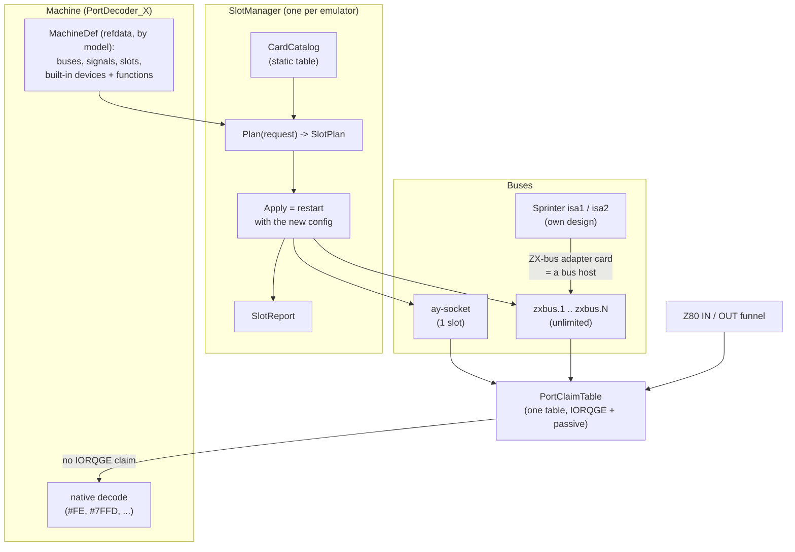

# ZX-bus slots: architecture

| | |
|---|---|
| **Date** | 2026-10-03 |
| **Status** | Draft for owner review |
| **Requirements** | [requirements.md](requirements.md) |
| **Decisions** | [open-questions.md](open-questions.md) Q1-Q7 |
| **Matrix** | [compatibility-matrix.md](compatibility-matrix.md) |
| **Plan and tests** | [tdd.md](tdd.md) |
| **Related** | [Sprinter ISA](../2026-10-02-sprinter-isa/tdd.md) (the first slot bus), [Sprinter network](../2026-10-02-sprinter-network/tdd.md) (`IIoBusDevice`, `NetworkCapabilities::expansionSlots`), [media manager](../2026-09-28-storage-manager/technical-design.md) (slot / medium split, queued changes), TTD v2 D38 (device set fixed per session; branch `ttd-engine`, `phase-2-device-state-tdd.md` §5.4.3) |

## Contents

1. [What exists today](#1-what-exists-today)
2. [Target model](#2-target-model)
3. [Declarations: machines and cards](#3-declarations-machines-and-cards)
4. [The port claim table and bus arbitration](#4-the-port-claim-table-and-bus-arbitration)
5. [SlotManager: plan and apply](#5-slotmanager-plan-and-apply)
6. [Configuration](#6-configuration)
7. [Ownership of existing devices](#7-ownership-of-existing-devices)
8. [TTD and snapshots](#8-ttd-and-snapshots)
9. [Automation surfaces and Qt](#9-automation-surfaces-and-qt)
10. [Performance](#10-performance)
11. [Risks](#11-risks)

## 1. What exists today

Facts from master (`bef7a17f4`); file references are repository-relative.

**Three port-claim mechanisms, not two** (`core/src/emulator/ports/portdecoder.h`):

| Mechanism | Storage | Users |
|---|---|---|
| Exact port map, reached from each machine decoder's `switch` on the *decoded* port | `std::map<uint16_t, PortDevice*> _portDevices`; `RegisterPortHandler`; `PeripheralPortIn/Out` | WD1793, AY / TS / TSFM, GS |
| Full-decode observers, tapped in the Z80 funnel before the machine decode | `_fullDecodeDevices` map + `_fullDecodeLowByteDevices[256]`; `NotifyFullDecodeIn/Out` | MoonSound, ZXNETUSB (`#AB`), ZX-WiFi `ComPort` (`#EF`) |
| Self-decoding devices, tried after the machine decode found nothing | `_selfDecodingDevices` vector; `DispatchSelfDecodingIn/Out` (Pentagon, ATM3, Scorpion only) | Covox / SounDrive |

**Priority rules spread over the code:** `Z80::inFromBus` lets an observer's value win only if it claims the read
or the machine decoded nothing ("R6"); `OverrideDecodeForFullDecodeClaim` makes the motherboard decode stand down for
a claiming low-byte card (except Beta-128 ports); IDE decodes first in every decoder. There is **no IORQGE concept**.

**Device ownership:** `SoundManager` owns one GS slot (`_gs`: LLE / LW / NeoGS), one TurboSound slot
(`_turboSound`: AY / TS / TSFM), the Covox and the MoonSound; `NetworkManager` owns network cards and already plans
changes (`MakePlan`) against `NetworkCapabilities` (`zxBus`, `internalIo`, `expansionSlots`); the Sprinter's
`SprinterIsaBus` owns ISA cards. Cards are chosen by INI keys at create time; only the GS personality and the network
set change at run time.

**Gaps:** no catalog of cards, no declaration of buses per machine (besides `ZxBusPresent()`, `DescribeNetwork()`,
`HasKempstonJoystick()`, `ReservesLowByte()`), no compatibility rules beyond "one GS slot / one TS slot", the clash
analysis (`FindFullDecodeClashes`) runs only in tests, MoonSound vs Profi `#7E` is handled by an INI comment, and the
hot path does a `std::map::find` on every IN / OUT even with no card fitted.

## 2. Target model



- **Bus kinds:** `ay-socket` (one slot; holds the built-in AY or a TurboSound board in its place), `zxbus` (Nemo /
  ZX-bus), `sinclair-edge`, `scorpion` (if it differs electrically; research step SL-0), and the Sprinter's `isa8`
  (unchanged design; its ZX-bus adapter card hosts a `zxbus` of its own).
- **Card instance** = card type + options + slot. Cards are built from shared chip modules and never fork them.
- **One owner of fitted cards:** `SlotManager`. `SoundManager` and `NetworkManager` keep the mixer and network
  plumbing, but stop deciding which cards exist (§7).

## 3. Declarations: machines and cards

### 3.1 Machine side

**As built (SL-1):** the declaration is a `MachineDef` in `core/src/emulator/slots/refdata/machines.cpp`, keyed by
`MEM_MODEL` ([reference-data.md](reference-data.md) §3-4: `BusDef`, `BuiltInDef` with `Fixed` / `Switchable` /
`Socketed`, board ports as `PortClaim`s). There is **no** `DescribeBuses()` virtual on the decoders: decoders are chosen
by model as well, so a table keyed by model is the same single source without needing a decoder instance (a model
switch plans the slot set against the target model before any decoder exists), and the docs are generated from it.
The sketch below is the original idea, kept for the field list.

```cpp
// core/src/emulator/slots/busdeclaration.h (sketch)
enum class BusKind : uint8_t { AySocket, ZxBus, SinclairEdge, AtmIoBus, ProfiBus, Isa8 };   // Scorpion = ZxBus (research §11)
enum class BusSignal : uint32_t { Iorqge = 1, IoDos = 2, Dos = 4, Wait = 8, Plus12V = 16, Reset = 32,
                                  CsRom = 64, RdRom = 128, M1 = 256, Rfsh = 512, Int = 1024, Nmi = 2048,
                                  Busrq = 4096, Busak = 8192 };       // CsRom = board output, RdRom = override input
enum class Arbitration : uint8_t { CardWins, BoardWins, UlaOnly, None };   // research-machines.md §1

struct BusDeclaration
{
    std::string id;              // "ay-socket", "zxbus"
    BusKind kind;
    uint32_t signals;            // BusSignal mask
    int physicalSlots;           // informational (real board); our limit is unlimited (owner rule)
    Arbitration arbitration;     // how IORQGE and the board's own ports interact (§4)
    ReadConflictRule readRule;   // two drivers on one read (default WiredAnd: a modeling choice, flagged as a bus fight)
    std::vector<uint16_t> boardPorts; // BoardWins: the ports the board hides from the slots (porthit), as mask/match list
};

struct BuiltInDevice
{
    std::string id;              // "ay", "turbosound-fpga", "covox-board", "beta128"
    std::vector<Function> functions;
    std::vector<PortClaim> ports;
    bool switchable;             // a machine setting can switch it off (R-COMP-5)
    bool socketed;               // a chip in a socket: a plan can take it out (Q7, ZX-Evo YM2149)
};

struct MachineBuses { std::vector<BusDeclaration> buses; std::vector<BuiltInDevice> builtIn; };

// New virtual on PortDecoder, next to DescribeNetwork(); the base returns the plain 48K declaration.
virtual MachineBuses DescribeBuses() const;
```

`DescribeNetwork()`'s `expansionSlots` and `zxBus` become views derived from the machine's `MachineDef` (one source). The
Sprinter answers its ISA slots and, through a fitted ZX-bus adapter, a `zxbus` bus.

### 3.2 Card side

```cpp
// core/src/emulator/slots/cardcatalog.h (sketch)
struct PortClaim
{
    uint16_t mask, match;        // claims port p when (p & mask) == match
    PortDir dir;                 // In, Out, InOut
    bool iorqge;                 // true: the card pulls IORQGE (effect depends on the bus arbitration, §4)
    bool lockedOnRomFetch;       // MultiSound SAA / SounDrive: ignored while M1 runs from #0000-#3FFF
};

struct CardType
{
    const char* id;              // "multisound", "tsfm", "gs", "neogs", "moonsound", "soundrive", "covox-fb", "zxnetusb", ...
    const char* displayName;
    BusKind nativeBus;
    uint32_t requiredSignals;
    CycleDetection detection;    // Iorq (default) | RdWr (sees cycles the board hides, §4.1)
    OptionSchema options;                                          // DIP switches, RAM sizes, firmware variants
    std::unique_ptr<ICard> (*Create)(CardContext&, const CardOptions&);
};
// Functions, claims, options, required signals and detection come from the reference data (reference-data.md,
// core/src/emulator/slots/refdata/cards.cpp); only Create() is card code. Option-dependent functions and claims carry
// a typed When{option, anyOf} condition.
```

```cpp
class ICard                       // the running card
{
public:
    virtual ~ICard() = default;
    virtual const CardType& Type() const = 0;
    virtual uint8_t In(uint16_t port, uint64_t t, bool& drives) = 0;     // drives = false: card stays off the bus
    virtual void Out(uint16_t port, uint8_t value, uint64_t t) = 0;
    virtual uint8_t Peek(uint16_t port) const = 0;                      // debugger, no side effects
    virtual void BusReset(uint64_t t) {}                                // ZX /RESET
    virtual void FrameStart() {}
    virtual void FrameEnd() {}
    virtual void RegisterMedia(MediaManager&) {}                        // e.g. NeoGS sd.ngs
    virtual void UnregisterMedia(MediaManager&) {}
    virtual void RegisterMixerRows(SoundManager&) {}
    virtual void UnregisterMixerRows(SoundManager&) {}
    virtual void CollectTtdSerializers(std::vector<ttd::TTDSerializable*>&) {}
    virtual void Describe(CardReport& out) const = 0;
};
```

`ICard` deliberately mirrors `IIsaCard` / `IIoBusDevice` (Sprinter): an existing `IIoBusDevice` network device gets a
thin `ICard` wrapper, as `IsaBusDeviceCard` does for ISA.

### 3.3 Functions

A function is a short string from one enum-backed table (`ay-socket`, `gs`, `saa`, `soundrive`, `covox-fb`, `opl4`,
`midi`, `net.zxnetusb`, `serial.ef`, `kempston-joystick`, `kempston-mouse`, `beta128`, `ide.<scheme>`, ...). The
compatibility matrix is computed from them ([compatibility-matrix.md](compatibility-matrix.md)).

## 4. The port claim table and bus arbitration

One table replaces the three mechanisms. It is rebuilt when the machine starts (slot changes restart the machine,
Q6), never on the hot path.

### 4.1 Research results that shape it

[research-machines.md](research-machines.md) shows that IORQGE does **not** mean the same on every machine, and
[research-cards.md](research-cards.md) shows that cards do not all detect an I/O cycle the same way:

| Arbitration mode (per bus) | Machines | Rule |
|---|---|---|
| `CardWins` | NemoBus standard / Kay, Pentagon-1024SL class, Scorpion ZS-256 (incl. Turbo+), ATM with the CPU-socket ZX-bus adapter | a card driving IORQGE hides the cycle from lower slots and from the **whole** board decoder (reads and writes) |
| `BoardWins` | ZX-Evo Baseconf, TS-Conf, Profi (`/OUTIORQ`) | the board masks /IORQ to the slots for its own ports (`porthit`); IORQGE only lets slot 1 block slot 2; a card cannot shadow a built-in |
| `UlaOnly` | 48K | IORQGE silences only the ULA's `#FE` |
| `None` | 128K, +2A, +3 (no IORQGE on the edge) | no suppression; card and board both answer |

| Cycle detection (per card) | Cards | Meaning |
|---|---|---|
| `Iorq` (default) | almost all | the card sees a cycle only when its /IORQ is active |
| `RdWr` | ZX-MultiSound ("RD or WR without MREQ and M1") | the card sees every I/O cycle, including those the board hides by masking /IORQ |

### 4.2 Structure

- `std::array<uint8_t, 8192> claimedBits` - one bit per 16-bit port: "some card claims this port". The hot path for a
  port no card claims is one load and one bit test (today: an always-empty `std::map::find` plus an array index on
  every IN / OUT, and two map lookups in `PeripheralPortIn/Out`; research §code).
- Per claimed port: a compact entry list in a per-low-byte bucket (`buckets[256]`): `{mask, match, dir, iorqge,
  lockedOnRomFetch, detection, ICard*}`, sorted IORQGE first, then slot order.
- Per machine: the set of board ports (`porthit` for `BoardWins` machines), precomputed into a second bitmap.

**As built (SL-2,** `core/src/emulator/slots/portclaimtable.{h,cpp}`**):** the buckets are sorted by **slot order
only**, not "IORQGE first": an IORQGE card hides the cycle from *later* slots (§4.3 step 2), so a passive card in an
earlier slot must still see it. The owner is today's `PortDevice*` (an `ICard` wraps one from SL-4 on). Entries also
carry the claim's `Gate` (DOS-gated claims and board ports); the DOS state and the last M1 address come from an
`IClaimSignals` read only when an entry needs it. `ReadRule::SlotOrder` puts the board before the slots (a modeling
choice like `WiredAnd`, flagged as a bus fight). The table is rebuilt whenever a device registers or leaves (the
existing observers register at attach and at a network refit, both at a frame boundary), never on the access path.

### 4.3 Cycle resolution

For an access to port `p` (read or write):

1. **Which cards see it.** `CardWins` / `UlaOnly` / `None`: every matching card. `BoardWins`: if `p` is a board port,
   only cards with `detection = RdWr`; otherwise every matching card.
2. **Which cards are hidden by IORQGE.** Slot order: a card that drives IORQGE on `p` hides the cycle from later
   slots (all modes).
3. **Is the board hidden.** `CardWins`: yes if a visible card drives IORQGE on `p`. `UlaOnly`: only the `#FE` decode.
   `BoardWins` / `None`: never.
4. **Writes** go to every visible card and, unless hidden, to the board decoder.
5. **Reads:** the drivers are the visible cards that answer reads plus the board unless hidden. One driver: its value.
   Several: the bus's `readRule` (`WiredAnd` is a modeling choice, research found no documented answer; the slot report
   flags every such port as a bus fight). Nobody: the machine's floating-bus rule (ZX-Evo: the FPGA drives `#FF`).

**Shadowing** is step 3 on `CardWins` machines: the built-in device on `p` gets no cycle and, if it is a sound source,
its row is marked `shadowed by zxbus.N`. On `BoardWins` machines a card port equal to a board port is dead for `Iorq`
cards (reported as an incompatibility at plan time, not as shadowing) and a bus fight for `RdWr` cards on reads.

**Socketed built-ins.** A built-in chip in a socket (the ZX-Evo YM2149, the AY of boards that socket it) can be
*removed* by a plan, the physical fix for a bus fight (owner decision Q7: the MultiSound on ZX-Evo empties the
socket).

**The `#DFFD` case (MultiSound on `CardWins`):** the card claims `#DFFD` writes without IORQGE; the write reaches the
card and the machine's `#DFFD` paging, as on the real board.

**ROM-fetch lock:** entries with `lockedOnRomFetch` consult the last M1 address; read only when such an entry matches.

**Migration of today's rules:** R6 and `OverrideDecodeForFullDecodeClaim` become step 3 / step 5 of the resolution;
the Beta-128 exception becomes a declared built-in property; "IDE decodes first" stays a machine rule. Each move is a
separate tested step (tdd.md SL-3).

**As built (SL-3,** [tdd.md](tdd.md) §7**):** the Z80 runs one bus cycle, `PortDecoder::ReadCycle` / `WriteCycle`: a
port no card claims is one bit test and the board's decode; a claimed port is resolved in one out-of-line pass (one
lookup, the card's access, the board's stand-down decided once, the board decode, R6). The self-decoding devices and
the exact peripheral port map are claim tables too, but three role instances rather than one (raw address before the
board, raw address after the board, decoded port): the board decode is not yet expressed as claims, so the single
table and `Read` / `Write` arrive with the card declarations of SL-4. The Beta-128 exception stays in the override.

## 5. SlotManager: plan and apply

```cpp
// core/src/emulator/slots/slotmanager.h (sketch)
struct SlotRequest
{
    enum class Op { Plug, Remove, SetOptions } op;
    std::string slot;                 // "zxbus.1", "ay-socket", "zxbus.next"
    std::string card;                 // Plug
    CardOptions options;              // Plug / SetOptions
    bool replaceIfIncompatible = false;  // automation flag (Q1, Q5)
    bool dryRun = false;
    media::Disposition mediaDisposition = media::Disposition::None;  // for removed cards' dirty media
};

struct SlotPlan
{
    bool allowed;                      // false: refused, reasons filled
    std::vector<std::string> reasons;  // human-readable, one per blocking item
    std::vector<RemovedCard> removed;  // slot, card, full options (enough to put it back), clashing functions
    std::vector<ShadowedDevice> shadowed;
    std::vector<Function> lostFunctions;
    std::vector<MediaRelease> media;   // slot id, dirty?, disposition applied
    Fit fit;                           // Real / Adapter / Unrealistic
    std::vector<SwitchedOff> builtInSwitchedOff;
};

class SlotManager
{
public:
    SlotPlan Plan(const SlotRequest& r) const;           // pure: no state change
    SlotPlan Request(const SlotRequest& r);              // Plan + (if allowed and !dryRun) write the config and restart
    void Describe(SlotReport& out) const;                // single source for every surface
    void DescribeMatrix(MatrixReport& out) const;
};
```

**As built (SL-1):** the pure part is `SlotPlanner::Plan(model, slotSet, request, context)`
(`core/src/emulator/slots/slotplanner.h`), returning the `SlotPlan` above plus `removedFromSocket`, `disabled`,
`deadPorts`, `busFights`, `exceptions` and `resultingSlots` (the slot set once applied). `SlotManager` (SL-6) keeps
the slot set of a running emulator and calls it. Steps 7-8 below take their state from a `PlanContext` (dirty media;
the TTD check arrives with SL-5).

**Plan algorithm** (deterministic, R-OP-2):
1. Resolve the target slot (`zxbus.next` = the first empty `zxbus` slot; a new one is created, unlimited).
2. Compute the new card's functions from its options and its ports.
3. **Bus fit:** missing required signals on the slot's bus -> `Fit::Unrealistic` unless an adapter is configured in
   that slot (`Fit::Adapter`). Without `replaceIfIncompatible` (automation) or the UI's confirmation, refuse.
4. **Function clashes:** the union of every fitted card sharing any function with the new card -> `removed`.
   Built-in devices sharing a function: fixed -> refuse (even with the flag); switchable -> `builtInSwitchedOff`.
5. **Shadowing (`CardWins` buses only):** built-in devices covered by the new card's IORQGE claims -> `shadowed`. A
   *card* in a slot that would be shadowed (TSFM in the AY socket under a MultiSound) is a pointless pair ->
   `removed`, and the socket returns to the machine's own AY. **`BoardWins` buses:** a claim of an `Iorq` card on a
   board port is dead -> incompatibility (refused / override); an `RdWr` card's read claim on a board port is a bus
   fight -> a socketed built-in on that port is planned out of its socket (Q7), otherwise `fit: unrealistic`.
6. **Lost functions:** functions offered by removed cards and not by the new card.
7. **Media:** every media slot of every removed card; a dirty medium without a disposition -> refuse.
8. **TTD:** recording -> refuse ("TTD session <id> is recording; the device set is fixed for a session").
9. **Accidental port clashes** with remaining cards (overlap of claims not explained by functions): the new card is
   plugged in but `disabled: port #xxxx clashes with zxbus.2` (R-COMP-6).

For `SetOptions`, the same algorithm runs with "the card as it would be with the new options".

**Apply = restart with the new configuration** (owner decision Q6: no hot plug, no adventures). An allowed plan
writes the new slot set into the instance's configuration and restarts the machine through the same path as a model
switch (`ModelSwitch::Run` / `CreateEmulatorWithModel`; research: `ModelSwitchRequest` gains a `configOverride`
combined with today's `RamPowerOnOverride`, the same model is allowed, and the instance's create-time override
(Sprinter ISA, Profi options) is carried - today a model switch silently drops it): a new emulator is built from the configuration, every card
is created once at start, the claim table is built once, and media are carried over by `TakeMediaSet` with the
stranded-media rules (the removed cards' media slots, such as `sd.ngs`, are reported like stranded media). If the
new machine fails to start, the previous configuration is restored and started again, and the reply carries the
error. There is no card creation or destruction inside a running machine, so no frame-boundary queue, no partial
state and no rollback of live objects.

**UI flow:** the Qt slot window calls `Plan` with `replaceIfIncompatible = true`; a plan with `fit = Unrealistic`
first shows the "not possible on real hardware" explanation and a confirm button; applying shows a warning toast
listing removed / shadowed / lost with an Undo action that replays the removed cards' configurations.

## 6. Configuration

```ini
[SLOTS]
ay-socket = tsfm                 ; ay (default: the machine's own chip) | ts | tsfm | none
zxbus.1 = multisound
zxbus.1.dip = ym,saa,gs,sd       ; card options: zxbus.N.<option> = value
zxbus.1.gsRam = 1M
zxbus.1.ctrlMask = pro
zxbus.2 = zxnetusb
zxbus.3 = gs                     ; would clash with zxbus.1's gs: at load the first wins, zxbus.3 disabled (R-CFG-3)
```

- Parsed into `SlotRequest`s in slot order through the same `Plan` (without the override), so an INI can never
  produce a state that the API cannot.
- **Legacy keys** (Q4): `[SOUND] TurboSound`, `GSType`, `MoonSound`, `CovoxFB`, `SD`, `[NETWORK] Card=` are translated
  into `[SLOTS]` entries at load with a deprecation warning; the card-specific settings sections (`[NGS]`,
  `[MOONSOUND]`, `[ROM] GS`, ...) stay as the cards' option sources until each card's migration moves them under
  `zxbus.N.*` (each move listed in tdd.md).
- **As built (SL-4,** [tdd.md](tdd.md) §8**):** `[SLOTS]` is `CONFIG::slotConfig` (`slots/slotconfig.{h,cpp}`), planned
  by `SlotManager` in `Core::Init` before any card is built. Two keys beyond the sketch: `<slot>.adapter = <id>` and
  `<slot>.fit = unrealistic` (the fit override per slot: an INI is planned without the replace flag, but the shipped and
  old configs fit cards the reference data calls unrealistic, such as NeoGS on the Sinclair edge; every translated
  legacy key carries it, so an old INI keeps its devices; it never displaces a card and never lifts a hard refusal);
  and `builtin.<id> = on | off` for a switchable built-in (wired: the board Covox). A missing `ay-socket` means the
  machine's own chip. `[NETWORK] Card=ATM2IOESP` stays a network key (INTERNAL connector). The card-specific sections
  (`[NGS]`, `[MOONSOUND]`, `[SOUND] GSRamSize`) stay option sources; a slot option (`ram`) overrides them.
- **Model switch:** `ModelSwitch::Run` today rebuilds everything from the target model's INI. New: the current slot set
  is carried as the request list and planned against the new machine; non-fitting cards are reported in the switch
  result (R-OP-9), exactly as stranded media are reported today.

## 7. Ownership of existing devices

| Device | Today | After migration |
|---|---|---|
| AY / TS / TSFM | `SoundManager::_turboSound` from `[SOUND] TurboSound` | the `ay-socket` slot's content; `SoundManager` keeps mixing |
| GS / LW / NeoGS | `SoundManager::_gs`, runtime personality switch | cards `gs`, `gs-lw`, `neogs` (function `gs`); the personality switch becomes a slot replace (one plan, applied by a restart) |
| MoonSound | `SoundManager` behind `[SOUND] MoonSound` | card `moonsound`; Profi's `#7E` clash becomes a declared built-in claim (palette) -> the card is disabled with the reason, no INI comment needed |
| Covox / SounDrive | one `Covox` device, `Fitment {Mono, Quad}` | cards `covox-fb` (`#FB`) and `soundrive` (mode 1 + mode 2 ports) built on the same `Covox` module |
| ZXNETUSB, ZX-WiFi | `NetworkManager::MakePlan` / `Refit` | cards `zxnetusb`, `zx-wifi`; `NetworkManager` keeps the virtual network and peers, `SlotManager` decides fitting |
| ATM2IOESP | `IIoBusDevice` on the ATM INTERNAL connector | a slot on a machine-declared `atm-internal` bus (same model, one more bus kind) |
| Sprinter ISA cards | `SprinterIsaBus` | unchanged; `isa1` / `isa2` appear in the slot report; the ZX-bus adapter hosts a `zxbus` |
| Built-ins (Beta-128 on Pentagon, ZX-Evo TurboSound, board Covox, Kempston on Pentagon) | inline in decoders | declared as `BuiltInDef`s of the machine's `MachineDef` with functions and ports; behavior unchanged |

**As built (SL-4):** `SlotManager` owns the decision and the slot report (`DeviceState::Slots`), not the card
objects: it writes the fitted set into the CONFIG card fields `SoundManager` / `NetworkManager` / the Covox module
read (`SlotManager::Apply`), and those keep building, mixing and wiring the cards. `ICard` objects come with the
ZX-MultiSound and the restart path (SL-6). The board Covox (ATM, ZX-Evo, TS-Conf, Profi v3 / v5) is a switchable
built-in on the same Covox module; the SounDrive card's `mode` (1 / 2 / `both`, the emulator's decode) selects the
module's decode.
| Beta-128 / IDE / Kempston as *interfaces* on Sinclair machines | config flags | later cards (function `beta128`, `ide.*`, `kempston-*`); not in the first migration (tdd.md "later") |

## 8. TTD and snapshots

- **Device set fixed per session** (D38): the slot set and every card's options go into the session's configuration
  fingerprint (branch `ttd-engine`: `CaptureConfigFingerprint` takes `uint64` fields, so each slot adds
  `slots.<slotId>` = hash(card + options), `affectsRestore = true`). `SlotManager::Request` refuses while recording.
  `PortDecoder::TtdSessionMatches` (today Sprinter-only) moves to `SlotManager`: a session whose slot set differs from
  the machine's is refused with the difference listed.
- **Per-card blobs:** a card contributes its chip modules' serializers through `CollectTtdSerializers`;
  `RegisterMachinePeripherals` asks `SlotManager` instead of `SoundManager` / `NetworkManager` for fitted cards. Blob
  ids stay those of the chip modules (TSFM 4, GS 5, NeoGS 12, MoonSound 10, ...); a card with its own glue logic (the
  MultiSound decoder) adds one id. Two instances of one module in two cards: on master the registry is keyed by `PeripheralId`
  alone and a duplicate **silently overwrites**; on `ttd-engine` the device table is keyed by `TTDDeviceKey{type,
  instance}` and refuses duplicates, but the per-id map still collapses them before. Rule: cards name their chip
  instances by slot (`zxbus.1.saa`); a configuration with two instances of one id lands only after `ttd-engine` (and
  its id-keyed map is replaced by the device key). Until then the plan refuses such a set with that reason.
- **Fixture corpus:** the Sprinter and TS-Conf fixtures were recorded with the classic GS swapped in; card migration must
  keep every blob byte-identical (`TTD_Corpus_Test.EveryFixtureLoadsRestoresAndReplaysExactly`).
- **Snapshots** (SZX and our own): the slot set is written where the format allows (SZX has blocks for some cards);
  loading a snapshot plans its cards like an INI (no override), reporting what could not be fitted.

## 9. Automation surfaces and Qt

One core layer `SlotControl::Execute(verb, args)` (like `MediaControl`) behind every surface; `DeviceState::Slots` is
the shared report builder.

| Surface | Commands |
|---|---|
| WebAPI | `GET /slots`, `GET /slots/catalog`, `GET /slots/matrix`, `POST /slots/{slot}/plug`, `POST /slots/{slot}/remove`, `PUT /slots/{slot}/options` (body: `card`, `options`, `replaceIfIncompatible`, `dryRun`, `mediaDisposition`; the reply says the machine was restarted); refusals are HTTP 409 with the plan as body; OpenAPI in `openapi_slots.inc` |
| CLI | `slots`, `slots catalog`, `slots matrix`, `slots plug <slot> <card> [opt=val ...] [--replace] [--dry-run]`, `slots remove <slot>`, `slots set <slot> opt=val` |
| MCP | `inspect_state` aspect `slots`; `emulator_manage` actions `slots_plug` / `slots_remove` / `slots_set` / `slots_catalog` (parameters as WebAPI) |
| Lua / Python | `slots_state()`, `slots_catalog()`, `slots_matrix()`, `slots_plug(slot, card, opts)`, `slots_remove(slot, opts)`, `slots_set(slot, opts)` returning the plan |
| Qt | Machine > Slots window: one row per slot (bus, card, options, state, fit), the catalog with the matrix (incompatible entries marked, tooltip with the reason), plan preview, warning toast with Undo, override confirmation |
| Recipe | `.recipe/machines/slots.md` (plug, replace, dry-run, undo) |

The create-time options (`"sprinter": {"isa_slot1": ...}`, `[ISA] SlotN`) stay for the Sprinter and gain the general
`"slots": {...}` form on create.

## 10. Performance

- No card fitted: one bit test per IN / OUT instead of today's `map::find` + array index (expected small win).
- Claimed port: one bucket scan (typically one or two entries).
- The ROM-fetch flag is read only for entries that need it.
- Every migrated card: A/B benchmark of the port hot path per `docs/guidelines/performance-guidelines.md`
  (interleaved runs, load check) and the TTD corpus unchanged.

## 11. Risks

| Risk | Mitigation |
|---|---|
| Moving three dispatch mechanisms into one changes subtle priorities (R6, Beta-128 exception, IDE first) | one rule per step, each with the existing tests plus new IORQGE tests; the TTD corpus and machine boot tests as regression net |
| TTD fixture churn when ownership moves | blob ids and layouts unchanged; only the registry's source of devices changes; fixtures re-recorded only where a format change is the point |
| Read-conflict rule (wired AND) is a guess for some boards | the rule is per bus declaration and documented per machine; research step SL-0 collects schematics |
| Two instances of one chip module (TTD registry key) | SL-0 found: master overwrites, `ttd-engine` keys by type + instance; such sets wait for `ttd-engine` and are refused before |
| Concurrent branches touching `SoundManager` / decoders | migration one card per merge, rebased on master each time |
