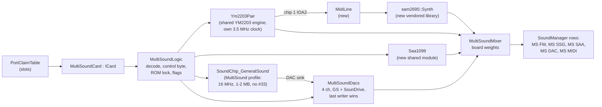

# ZX-MultiSound: architecture

| | |
|---|---|
| **Date** | 2026-10-03 |
| **Status** | Draft for owner review |
| **Requirements** | [requirements.md](requirements.md) |
| **Hardware** | [hardware-reference.md](hardware-reference.md) |
| **Slots** | [ZX-bus slots architecture](../2026-10-03-zx-bus-slots/architecture.md) (`ICard`, `CardType`, `PortClaim`, `SlotManager`) |
| **TDDs** | new modules: [SAA1099](tdd-saa1099.md), [libsam2695](tdd-libsam2695.md), [MIDI line](tdd-midi-line.md), [card logic](tdd-card-logic.md); [integration](tdd-integration.md) |

## 1. Composition

The card is glue logic around shared modules. It forks none of them (owner rule); where a module needs a
card-specific behavior, it gets a parameter in its configuration.



| Piece | Kind | Location |
|---|---|---|
| `MultiSoundCard` | new card (the `ICard` + `CardType` entry) | `core/src/emulator/slots/cards/multisound/multisoundcard.{h,cpp}` |
| `MultiSoundLogic` | new, pure logic, no audio: the CPLD's decode and latches; testable against the Verilog | `.../multisound/multisoundlogic.{h,cpp}` |
| `MultiSoundDacs` | new, the four shared DAC channels | `.../multisound/multisounddacs.{h,cpp}` |
| `MultiSoundMixer` | new, applies the board's weights (hardware reference §4.5) | `.../multisound/multisoundmixer.{h,cpp}` |
| `Ym2203Pair` | **extracted** from `SoundChip_TurboSoundFM`: two YM2203 with timers, busy, FM and SSG rendering, parameterized by master clock; TSFM keeps its board logic on top | `core/src/emulator/sound/chips/tsfm/ym2203pair.{h,cpp}` |
| `Saa1099` | new shared module | `core/src/emulator/sound/chips/saa1099/` |
| `SoundChip_GeneralSound` | existing, gains a **profile** (clock, INT divider clock, RAM size up to 2 MB, host port set, DAC sink) | `core/src/emulator/sound/chips/gs/` |
| AY / YM2203 I/O port output | existing SSG, gains an **I/O port output callback** (register 14 / 15 writes and register 7 direction) | `soundchip_ay8910.*`, the SSG part of `Ym2203Pair` |
| `MidiLine` | new: line level timeline from IOA2 to the synthesizer | `core/src/emulator/sound/midi/midiline.{h,cpp}` |
| `sam2695::Synth` | new vendored library | `core/src/3rdparty/sam2695/` |

## 2. Time

- The card's time axis is the emulator's audio time `AudioTstate(z80->t)` (turbo removed), the same axis as GS, Covox
  and MoonSound use. Each module converts it to its own clock with an integer ratio accumulator whose phase is in
  its state:

| Module | Clock | Ratio from 3.5 MHz T-states |
|---|---|---|
| YM2203 pair | 3.5 MHz exact (DDS average) | 1 : 1 on a 3.5 MHz host, a true ratio on 3.5469 MHz hosts (128K) |
| SAA1099 | 8 MHz | 16 : 7 |
| GS Z80 | 16 MHz, INT from 12 MHz / 321 (RTL) | card units as today (`GSCardRunner`) |
| SAM2695 | its internal rate | library `hostTickRate` |

- **Why the YM pair needs a ratio:** today TSFM uses "one YM master clock = one CPU T-state" because the TSFM's clock
  *is* the host's AY clock × 2. The MultiSound has its own oscillator, so on a 128K-family host (3.5469 MHz) its FM
  pitch is 1.3 % lower than a TSFM's. `Ym2203Pair` takes `masterClockHz` and the host rate; with equal rates the ratio
  is 1 : 1 and the TSFM path stays bit-identical (golden tests prove it).

## 3. Port path

`MultiSoundCard::Ports(options)` returns the claims of hardware reference §3.1 (with the DIP functions applied):

| Claim | mask / match | dir | IORQGE | ROM lock |
|---|---|---|---|---|
| YM register, A13 = 1 | `#E00F` / `#E00D` | InOut | yes | no |
| YM register, A13 = 0 (`#DFFD` family) | `#E00F` / `#C00D` | InOut | **no** | no |
| YM data | `#C00F` / `#800D` | Out (reads float on the card) | yes | no |
| SAA | `#00FF` / `#00FF` | Out | no | yes |
| GS data, command | `#00FF` / `#00B3`, `#00FF` / `#00BB` | InOut | yes | no |
| SounDrive | `#00AF` / `#000F` | Out | no | yes |

`MultiSoundCard::Out` hands the write to `MultiSoundLogic`, which returns the actions (YM address / data to chip N,
control byte latched, SAA address / data, GS mailbox write, SounDrive channel write); the card executes them on the
modules at the access time. The split keeps the logic free of audio so it is tested cycle for cycle against `top.v`
in Verilator ([tdd-card-logic.md](tdd-card-logic.md)).

## 4. Module changes needed

### 4.1 `Ym2203Pair` extraction (from `SoundChip_TurboSoundFM`)

- Moves: the two chips (ymfm YM2203 via `ym2203_engine.h`), timers, busy, FM word queues, SSG render, `syncTo` /
  `advanceChip`, the decimator setup.
- Stays in `SoundChip_TurboSoundFM`: `TsfmBoard` latches and the `#FFFD` parse (five-bit mask), the TSFM's mixer rows.
- New parameters: `masterClockHz` and `hostTickRate` (ratio accumulator), `addressWriteOnControlByte` (the MultiSound
  passes the control byte through as an address; the TSFM does not - kept in the board logic, not the pair), an
  I/O port output callback per chip.
- Proof of no regression: the existing TSFM tests (`core/tests/emulator/sound/tsfm/*`, `ttdtsfm_test.cpp`) unchanged
  and green; golden digests of the TSFM output identical before and after; A/B benchmark on the TSFM render path.
- The `ITurboSoundDevice::SetPsgClock` contract ("TSFM stays at `PSG_CLOCK_RATE`") becomes implementable as a side
  effect; not used here.

**As built (MS-1, 2026-10-04).** `core/src/emulator/sound/chips/tsfm/ym2203pair.{h,cpp}`; tests
`core/tests/emulator/sound/tsfm/ym2203pair_test.cpp` (`Ym2203Pair_Test`) and the TSFM golden digests
`core/tests/emulator/sound/tsfm/tsfm_golden_test.cpp` (`TsfmGolden_Test`).

| Piece | In the pair | Notes |
|---|---|---|
| Chips | `Ym2203Chip` (was `TsfmChip`): SSG `SoundChip_AY8910` at YM2149, ymfm engine, `Ym2203Interface` (timers, busy), address latch, key-on mirror, `FmWordQueue`, `SsgWriteQueue`, `Ym2203OutputState` (was `TsfmOutputState`) | `TsfmChip` / `TsfmOutputState` stay as aliases, so the TSFM tests and the state report compile unchanged |
| Parameters | `Ym2203PairConfig`: `masterClockHz`, `hostTickRate`, `fmCouplingHz` (the stereo output stage's coupling corner; the TSFM passes its C14 / C15 value) | configuration, not state |
| Time | `syncTo(hostT)`: integer accumulator `phase + delta x masterClockHz`, `delta = acc / hostTickRate`, remainder = `ratioPhase()`. Equal rates: the 1 : 1 path (no multiply / divide), the master-clock axis is the frame-relative host axis and `rebaseFrame` moves the words, pending writes and cursor with it. A true ratio: the master-clock axis (`chipT()`) is continuous and never rebased; the host axis is | `advanceChip` unchanged (FM sample and timer-expiry walk, muted-core skip) |
| Bus | `writeAddress`, `writeData` (SSG: latch now with the host tick for the pin listener, apply on the tick; FM: `write_data` + key-on mirror; busy), `readData` (SSG register through `readRegisterOnBus`: an input port reads its pins; `#FF` with an FM address), `readStatus` | the board decides which chip and what a control byte does (`addressWriteOnControlByte` is the MultiSound board logic, MS-3) |
| I/O ports | `setIoPortListener(chip, listener)`: the SSG's `IAyIoPortListener` (`ayioport.h`); pin changes reported with the write's host tick | MultiSound: chip 1 IOA2 -> `MidiLine` (MS-3) |
| Stereo output stage (TSFM) | `configureDecimators`, `fmHalfTick(chip, h, fmEnabled)`, `fmLqSample`, `applySsgWrites`, `renderTick(fmEnabled, onSsgTick)` (one SSG tick with its two FM half-ticks; the board's lambda takes the SSG levels), `flushOutputStage`, `clearWords` | the TSFM's mix (gain, per-chip buffers, LQ split, taps) stays in `SoundChip_TurboSoundFM::handleStep` |
| Per-channel outputs (board mixers) | `configureChannelOutputs(rate)`, `renderChannels(frames, Ym2203ChannelBlock, fmEnabled)`: FM per chip (word / 32768 after the mute gate, no coupling) and SSG per chip and channel (YM2149 table level 0..1 before panning and DC removal) at the output rate; eight decimators slaved to chip-0 channel A, input rates `masterClockHz / 16` and `/ 8`; the cursor trails the synced master clock by the render lag | the `MultiSoundMixer` input (§5); allocated on first use, the TSFM never pays for it |
| TTD | `saveChipState` / `loadChipState` (586 B per chip) and `saveTimeline` / `loadTimeline` (render cursor + pending SSG writes, relative to the synced master clock): the TSFM blob's pieces, byte for byte; `TTDSaveState` / `TTDLoadState(src, hostBase)`: the pair's own blob (version 1, 1967 B: ratio phase, per-channel render phase, chips, timeline) for a board that carries the pair whole | no `PeripheralId`: the card's blob set carries it (§7) |

`SoundChip_TurboSoundFM` keeps `TsfmBoard`, the five-bit `#FFFD` parse, the read-mode switch, the FM mute (passed to
the half-ticks as `fmEnabled`), `nowT()`, the render loop's PLL / LQ phase / buffers / gain / taps, the frame-start
rules (re-anchor window, flush, suppressed-path clear, prescaler warning) and its TTD blob (v5, 2008 B, layout
unchanged, built from the pair's pieces).

Proof of no change:

- `TsfmGolden_Test` (four sessions: HQ 44.1 kHz, LQ 44.1 kHz, HQ 48 kHz, a mid-frame TTD save / restore): a fixed
  script of FM notes on both chips, SSG tones / noise / envelopes, control words, timers with status reads, a
  prescaler excursion, synthesis suppression and a muted-core frame; FNV-1a over the five output buffers, the three
  native taps, every byte read and the TTD blob every fourth frame. Digests captured on the pre-extraction binary
  (master `dd93445d8`, built from a clean export) and identical after.
- The TSFM suite unchanged and green: `core/tests/emulator/sound/tsfm/*` (`TsfmCore_Test`, `TsfmPort_Test`,
  `TsfmTimer_Test`, `TsfmBusy_Test`, `TsfmPrescaler_Test`, `TsfmTimeline_Test`, `TsfmOutput_Test`,
  `TsfmBitIdentity_Test`, `TsfmGain_Test`, `TsfmMixer_Test`, `TsfmPlayer_Test`, `TsfmPlayerHarness_Test`,
  `TsfmVolumeReplay_Test`, `TsfmRenderDiag`, `YmfmTtdPatch`), `ttdtsfm_test.cpp` (`TtdTsfm_Test`,
  `TTD_TurboSoundFM_Serializer_Test`, `TTD_TSFM_ManagerIntegration_Test`) and the TTD fixture corpus
  (`ttdcorpus_test.cpp`, the `tsfm_tech_support` fixture included): the TSFM blob is byte-identical.
- A/B of `BM_TurboSoundFrame_*` (Pentagon, TSFM): see the MS-1 row of [tdd-integration.md](tdd-integration.md).

### 4.2 GS profile

| Parameter | Classic (default) | MultiSound |
|---|---|---|
| CPU clock | 12 MHz | 16 MHz |
| INT period | 320 clocks of 12 MHz | **321** clocks of 12 MHz (37.383 kHz from the 12 MHz DDS, not the CPU clock; low 33 clocks), per the RTL ([tdd-card-logic.md](tdd-card-logic.md) §7 F8) |
| RAM | 128-512 KB (`[SOUND] GSRamSize`) | 1 MB or 2 MB (`gsRam`); `_ramPairMask` widened, banking unchanged |
| Host ports | `#B3`, `#BB`, `#33` | `#B3`, `#BB` |
| ROM | `[ROM] GS` | GS 1.05b (`data/rom/gs105b.rom`, shipped with the card profile) |
| DAC output | the card's own stereo mix (50 % cross-feed) | a **DAC sink** interface: the GS reports (channel, sample) and (channel, volume) events with their time; the MultiSound's `MultiSoundDacs` consumes them |

`GSClassicTiming` stays the classic default; the profile carries the clocks per instance (`GSHostClock` already takes
`unitsPerSecond`). The lightweight player personality (LW) is not offered on the MultiSound (the card has a real Z80;
LW stays a GS-card option).

**As built (MS-2, 2026-10-04):** `GSProfile` (`core/src/emulator/sound/chips/gs/gsprofile.h`), passed to the
`SoundChip_GeneralSound` constructor (default `GSProfile::Classic()`, so every existing caller is unchanged);
`GSProfile::MultiSound(ramKB, sink)` is the board.

| Field | Classic | MultiSound | Where it acts |
|---|---|---|---|
| `cpuClockHz` / `intClockHz` | 12 / 12 MHz | 16 / 12 MHz | card unit = their least common multiple: classic 12 MHz (1 unit per CPU cycle, so the TTD blob, traces and golden digests keep their values), MultiSound 48 MHz (3 units per CPU cycle); `GSCardRunner` multiplies by `unitsPerCycle()` as it does for NeoGS; blip clock and host conversion use the unit rate |
| `intPeriodClocks` | 320 | 321 (1284 units) | period boundary event |
| `intLowClocks` | 0 = held until accepted (the classic model, gs-tdd §2.4) | 33 (132 units): the CPLD has no acknowledge latch, a pulse that ends unaccepted is lost (counted in `interruptsCoalesced`) | `intLine()` compares the time with the period start |
| `minRamKB` / `maxRamKB` | 128 / 512 | 1024 or 2048 | the constructor's size is clamped into the range |
| `controlPort` | yes | no | `#33` writes and `triggerNMI()` do nothing |
| `memoryMap` | `Classic` | `MultiSound1Mb` / `MultiSound2Mb` | `applyBanking` per 16 KB window through `MultiSoundLogic::GsMemoryMapFor` (the CPLD's map, the same function the card logic uses; no copy). RAM chips of 512 KB lie in order in the RAM image |
| `portRules` | `Classic` | `MultiSound` | GS-side decode A3-A0 (mirrors every 16); a port 3 read sets the data flag and leaves the reply register (classic sets it to `#FF`); port 4 = `{data, 111111, command}`; `#0B` copies volume 3 bit 5 (`vol3` in `top.v`; classic: volume 0) |
| `undecodedPortRead` | `#FF` | `#FF` | every GS read nothing drives; INTA stays `#FF` |
| `romPath` | empty (`[ROM] GS`) | `rom/gs105b.rom` | the board's firmware, `data/rom/gs105b.rom` (README-ROMS: source, SHA-256, license) |
| `dacSink` | none | the card's `MultiSoundDacs` | `IGSDacSink` (`gsdacsink.h`): `GsSample(time, ch, byte)` on a `#6000-#7FFF` read, `GsVolume(time, ch, vol)` on a port 6-9 write, `time` in host tacts (AudioTstate) of the instruction's start; the card's own mix gets no steps (its buffer stays silent), the latches still report |

- **ROM A15:** the card repository's `gs105b.64K.rom` (27C512) is the 32 KB image twice, so whether the ROM's A15 is
  `gma[15]` does not change what the firmware sees; the profile loads the 32 KB image and masks the chip address.
- **Firmware check:** GS 1.05b boots on both maps (`MultiSound_Gs105bBootsAndReportsTheBoardsRam`): COM20 reports
  1008 KB on 1 MB (pages 1-`#20`, page `#20` is RAM 1 gma 0 because bit 5 is ignored) and 2000 KB on 2 MB (pages
  1-`#3F`; RAM 1's first 32 KB is reachable only through page `#40`, which the firmware does not probe).
- **Classic cost:** none on the per-instruction path. `GSCardRunner::runTo<Policy>` takes the two per-instruction
  answers (units per cycle, INT line) from a policy; the classic timing runs a policy with the constant 1 and the bare
  held-INT flag (the pre-profile code), the MultiSound and NeoGS ask the card. The GS-side port handlers are bound per
  rule set at construction (`gsIn` / `gsOut` unchanged, `gsInMultiSound` / `gsOutMultiSound`). A first version that
  tested the pulse in `intLine()` cost the idle firmware about 5 % (it runs long stretches with a request pending);
  the A/B of `BM_GeneralSoundFrame_*` / `BM_NeoGSFrame_*` with the policy is within noise (load 54-75, 8 interleaved
  rounds; to repeat on a quiet machine).
- **TTD:** the blob layout is unchanged (same fixed part; timing fields in profile units; RAM image 1-2 MB). The
  profile is configuration, not state.
- **For MS-3:** the GS keeps its own host mailbox (`#B3` / `#BB`) like the classic card; `MultiSoundLogic` latches the
  same registers. The card picks one owner. A SounDrive write sets volume 3 to 63 on the board, which `#0B` reads: the
  card must pass those writes to the GS's volume register as well as to `MultiSoundDacs`.

### 4.3 AY / SSG I/O port output

Today register 14 / 15 writes are stored and nothing else happens (`soundchip_ay8910.cpp` `applyRegister` default).
New: an optional `IoPortListener` on the AY and on the YM2203 SSG part, called with `(time, port, value, isOutput)`
when register 14 / 15 changes or register 7 bits 6 / 7 change the direction. Zero cost without a listener (one null
check on register 7 / 14 / 15 writes only). The same hook later serves the 128K's own MIDI / RS-232 out on the AY
(PLAN follow-up, not in this work).

### 4.4 `MultiSoundDacs` (as built, 2026-10-04)

`core/src/emulator/slots/cards/multisound/multisounddacs.{h,cpp}`; the board constants and the RC filter in
`multisoundanalog.{h,cpp}`. Self-contained like `MultiSoundLogic` (no slot, emulator or SoundManager dependency).

| Item | Behavior |
|---|---|
| Inputs | strobe events with the time their strobe **ends** on the card axis (`hostTickRate`, e.g. 3.5 MHz audio T-states): `GsSample(t, ch, byte)` (GS memory read at `#6000-#7FFF`), `GsVolume(t, ch, vol)` (GS ports 6-9), `SoundriveWrite(t, ch, byte)` (sample + volume 63) |
| Register semantics | the same three writes as `MultiSoundLogic` (L14): `ConvertSample`, 6-bit volume, SounDrive = volume 63 |
| Ordering (tdd-card-logic F7) | events wait in a queue sorted by strobe end (1024 slots); `Run(t)` applies those ending at or before `t`. The card calls it once both the host and the GS timeline have reached `t`, so the later-ending strobe wins whatever order the timelines hand events over in. Equal end time = same last edge: GS sample over SounDrive sample, SounDrive volume over GS volume. An event ending before the time already run to is applied at once (`LateEvents()`); a full queue runs to its earliest event |
| Transfer (F9) | per channel `level x gain` units (`SampleLevel` x `VolumeGain64`: -127..+127 with `#7F` / `#80` both 0, 63 counts as 64); full scale `kChannelFullScale` = 128 x 64 (never reached). The 0.5 midpoint is dropped (the coupling capacitors remove it); sigma-delta noise not modeled |
| Output | channels 0 + 1 left, 2 + 3 right, no cross-feed; steps into a blip_buf pair at their exact time; `EndFrame(t, stereo, frames)` as `Saa1099` |
| HiFi / Authentic | Authentic adds the per-channel RC (1k series, 10n shunt, 47k load: 16.25 kHz, 1-pole) after the band-limited synthesis (the network is linear and equal on both channels of a side, so the side sum is filtered); bilinear, prewarped so the corner is exact (clamped to 0.45 x the output rate) |
| TTD | fixed 11.3 KB blob: version, four channels, time axis, the pending queue, late-event counter; no `PeripheralId` (the card's blob set carries it). Output buffers and filter history are render layer: a load restarts the frame with one step to the restored level |

The board weight (0.208) and the absolute level are the mixer's (§5).

## 5. Mixer rows

Each source is its own `SoundManager` row so the user can mute / solo / record it (and the HUD shows activity): `MS
FM`, `MS SSG`, `MS SAA`, `MS DAC` (GS + SounDrive), `MS MIDI`. The board weights (hardware reference §4.5) are applied
inside the card before the rows, so the rows' unity volume equals the real board. New `AudioSourceType` values go
before `Custom`; `AudioActivityIndicators::HUD_SOURCES` grows accordingly.

**As built (2026-10-04):** `MultiSoundMixer` (`.../multisound/multisoundmixer.{h,cpp}`, not registered yet; MS-4 wires
the rows). `Mix(input, output)` takes one block of every source at the output rate and writes the five rows (int16,
interleaved stereo; a sixth `external` output exists for the J3 line input, which has no emulated source).

| Source | Input (module convention) | Calibration (row level, 1.0 = INT16_MAX) | Weight L / R |
|---|---|---|---|
| FM 1, FM 2 | mono, DAC word / 32768 | `kFmFullScale` 0.7033 = TSFM `kFmBaseGain` 0.30 x `TSFM_FmTrimDb` 7.4 dB (the TSFM board measurement, TSFM ISSUES #1) | 1.000 / 1.000 |
| SSG A / B / C, both chips | mono, YM2149 table level 0..1 | `kSsgChannelFullScale` 0.30 (the emulator's SSG channel, the level that measurement was taken against at equal board weights) | A 0.417 / 0; B 0.213 / 0.213; C 0 / 0.417 |
| SAA L / R | `Saa1099::EndFrame` units | `kSaaUnit` 1 / 32767 (module convention; absolute level unmeasured) | 0.833 own side |
| MIDI L / R | `sam2695::Synth::Render` (+-1.0) | `kMidiFullScale` 1.0 (module convention; unmeasured) | 1.000 own side |
| DAC L / R | `MultiSoundDacs::EndFrame` units | `kDacUnit`: 2.5 V per channel full scale (U14 at 5 V) x `kLevelPerVolt` (= 0.7033 / 1.25 V, the YM3014B's +-Vdd/4 full scale) | 0.208 own side |
| External (J3) | volts | `kLevelPerVolt` | 0.417 own side |

So the MS FM row equals the TSFM module's FM level and every other source sits where the board puts it relative to
FM: a full-scale DAC channel is 0.417 x a full-scale FM word (via volts), an SSG channel at full volume 0.125 / 0.70.
Every weight is computed from the component values (`MultiSoundBoard::kWeight*` = Rf / Rin, designators in
`multisoundanalog.h`) and tested against the table.

- **SAA weight:** the network's pass band is 10k / (1k + 1k + 10k) = **0.833**; the 0.825 of hardware reference §4.5
  is the same network at 1 kHz (tested). Its -3 dB corner computes to **7.02 kHz** (-10.3 dB at 20 kHz).
- **SSG naming:** A left, B centre at 0.213, C right is what the emulator calls ABC (`AYStereoMode::ABC`).
- **Inversion:** the summing amplifiers invert every source alike (the external input too), so relative polarity is
  kept and the overall inversion is inaudible: not modeled.
- **AC coupling** (`acCoupling`, default on, both modes): one 1-pole high-pass per coupling capacitor at
  1 / (2 pi R 10 uF) with the resistance it drives (FM 5k = 3.2 Hz, SSG A / C 24k = 0.66 Hz, SSG B 23.5k, SAA 12k,
  MIDI 10k, DAC 48k); it removes the DC of the unipolar SSG and SAA outputs as the board does.
- **Authentic:** the SAA's 2-pole ladder (exact analog prototype from the five components, bilinear, prewarped at
  7.02 kHz). The DAC RC is `MultiSoundDacs`' own Authentic mode; the YM3014B hold-cap corner is unknown and not
  modeled.
- Filter state is render layer (not in TTD).

## 6. Shadowing and compatibility

The card's IORQGE claims on `#FFFD` / `#BFFD` shadow the machine's AY socket content (slots Q2). Its functions (DIP
dependent): `ym` -> `ay-socket` role (shadowing) and `midi`; `saa`; `gs`; `soundrive`. See the slots
[compatibility matrix](../2026-10-03-zx-bus-slots/compatibility-matrix.md).

## 7. TTD

| Blob | Id | Content |
|---|---|---|
| `MultiSoundCard` | new id (next free when it lands; 48-50 free on master today, shared with SAA1099 / SAM2695 below) | logic latches (chip select, read mode, FM mute, SAA clock, ROM lock flag), DAC channels, the YM pair (both chips, ratio phase), the MIDI line state |
| `Saa1099` | new id | chip state (tdd-saa1099 §5), saved through the card |
| `Sam2695` | new id | synthesizer state incl. bank SHA-256 (tdd-libsam2695 §4) |
| General Sound | 5 (existing) | unchanged layout; RAM 1-2 MB (the GS RAM as a TTD v2 memory region is PLAN #45; until then the blob is large, which the TTD v2 engine's per-device dedup handles) |

The MIDI line itself is driven by YM register 14 writes, which the port journal records; replay re-executes them.

## 8. Configuration

```ini
[SLOTS]
zxbus.1 = multisound
zxbus.1.dip = ym,saa,gs,sd      ; functions enabled (default: all)
zxbus.1.gsRam = 1M              ; 1M | 2M
zxbus.1.ctrlMask = pro          ; pro | classic (unofficial issue #11 patch)

[MIDI]
Bank = data/midi/generaluser-gs.sf2   ; default; any SF2
```
