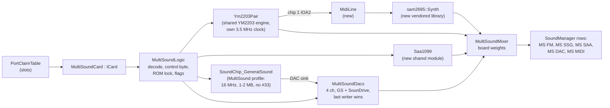

# ZX-MultiSound: architecture

| | |
|---|---|
| **Date** | 2026-10-03 |
| **Status** | Draft for owner review |
| **Requirements** | [requirements.md](requirements.md) |
| **Hardware** | [hardware-reference.md](hardware-reference.md) |
| **Slots** | [ZX-bus slots architecture](../2026-10-03-zx-bus-slots/architecture.md) (`ICard`, `CardType`, `PortClaim`, `SlotManager`) |
| **TDDs** | new modules: [SAA1099](tdd-saa1099.md), [libsam2695](tdd-libsam2695.md), [MIDI line](tdd-midi-line.md), [card logic](tdd-card-logic.md); [integration](tdd-integration.md) |

## 1. Composition

The card is glue logic around shared modules. It forks none of them (owner rule); where a module needs a
card-specific behavior, it gets a parameter in its configuration.



| Piece | Kind | Location |
|---|---|---|
| `MultiSoundCard` | new card (the `ICard` + `CardType` entry) | `core/src/emulator/slots/cards/multisound/multisoundcard.{h,cpp}` |
| `MultiSoundLogic` | new, pure logic, no audio: the CPLD's decode and latches; testable against the Verilog | `.../multisound/multisoundlogic.{h,cpp}` |
| `MultiSoundDacs` | new, the four shared DAC channels | `.../multisound/multisounddacs.{h,cpp}` |
| `MultiSoundMixer` | new, applies the board's weights (hardware reference §4.5) | `.../multisound/multisoundmixer.{h,cpp}` |
| `Ym2203Pair` | **extracted** from `SoundChip_TurboSoundFM`: two YM2203 with timers, busy, FM and SSG rendering, parameterized by master clock; TSFM keeps its board logic on top | `core/src/emulator/sound/chips/tsfm/ym2203pair.{h,cpp}` |
| `Saa1099` | new shared module | `core/src/emulator/sound/chips/saa1099/` |
| `SoundChip_GeneralSound` | existing, gains a **profile** (clock, INT divider clock, RAM size up to 2 MB, host port set, DAC sink) | `core/src/emulator/sound/chips/gs/` |
| AY / YM2203 I/O port output | existing SSG, gains an **I/O port output callback** (register 14 / 15 writes and register 7 direction) | `soundchip_ay8910.*`, the SSG part of `Ym2203Pair` |
| `MidiLine` | new: line level timeline from IOA2 to the synthesizer | `core/src/emulator/sound/midi/midiline.{h,cpp}` |
| `sam2695::Synth` | new vendored library | `core/src/3rdparty/sam2695/` |

**As built (MS-3, 2026-10-04).** `MultiSoundCard` (`.../multisound/multisoundcard.{h,cpp}`) is self-contained: no slot
framework, no `SoundManager`, no machine (the slots core is built in parallel on `zx-bus-slots`). A thin `ICard`
adapter wraps it in MS-4 ([tdd-integration.md](tdd-integration.md) §3.1). Tests:
`core/tests/emulator/slots/cards/multisound/multisoundcard_test.cpp` (`MultiSoundCard_Test`).

| Item | As built |
|---|---|
| Owns | `MultiSoundLogic`, `Ym2203Pair` (3.5 MHz master clock, `hostTickRate` = the card axis), `Saa1099` (8 MHz, the clock gate follows the control byte), `SoundChip_GeneralSound` (`GSProfile::MultiSound(ram, sink = MultiSoundDacs via the card, clock = the card)`, ROM `rom/gs105b.rom`), `MultiSoundDacs`, `MidiLine` (U4 IOA2), `sam2695::Synth`, `MultiSoundMixer` |
| Configuration | `MultiSoundCardConfig`: `options` (DIP `ym` / `saa` / `gs` / `sd`, `gsRam`, `ctrlMask`), `hostTickRate`, `outputRate`, `renderMode`, `gsRomPath`, `midiBankPath` (`[MIDI] Bank=`, default `midi/generaluser-gs.sf2`, resolved like a ROM: working dir, executable dir, resources), `midiBank` (a bank object; tests use a synthetic one). `SetOptions` switches DIP and `ctrlMask` live (the CPLD reads its DIP inputs continuously); `gsRam` sizes the GS RAM and is construction-only |
| Bus | `Iorqge(port)`, `M1(address)` (ROM lock), `Out(port, value, t)`, `In(port, t, drives&)`, `Peek(port[, drives&])` (no side effects), `BusReset(t)` (CPLD, both YM2203, SAA, GS, DACs, MIDI line and SAM2695: they share the board reset) |
| Frames | `FrameStart(t, frameTicks)`, `FrameEnd(t, frames = 0)` (`frames = 0`: the card counts output samples from the time, remainder carried), `Row(MultiSoundRow::Fm / Ssg / Saa / Dac / Midi)`, `RowFrames()` |
| Report | `Describe(MultiSoundCardReport&)`: options, CPLD latches (GS fields from the GS), per YM address / status / SSG registers / key-on mirror, ratio phase, `Saa1099Report`, GS (ROM, RAM, page, mailbox, firmware ready, counters), DAC channels + pending / late events, `MidiLineReport`, MIDI (bank status `loaded` / `no bank`, name, source, error, UART counters, voices); `DescribeSynth(sam2695::SynthReport&)` |
| Time | absolute, monotonic host ticks on the card axis (`hostTickRate`, the emulator's AudioTstate rate). The YM pair runs without `rebaseFrame` (its 64-bit axes take absolute time); the GS reads the axis through `IGSHostClock` frame-relative to the last `FrameStart`, as it reads the machine's Z80 otherwise, and its DAC sink times are turned back into absolute ones by adding the frame base |
| Control byte | `Control` action: SAA clock gate at `t`; an FM mute change is recorded with its time and `FrameEnd` renders the FM streams in parts split at those times (output-sample granularity). The `YmAddress` action that follows is the address write the control byte also is (`addressWriteOnControlByte` is this board logic) |
| MIDI | the pair's chip 0 (U4, selected by control bit 0 = 0) SSG listener is the `MidiLine`; the pair reports pin changes at the write's host tick, which is already the card axis, so the line feeds `Synth::WriteLine` unchanged. The synthesizer is configured with `resetDelay` (the chip's 50 ms boot window) and its effects path. A missing or unreadable bank leaves it silent; `Describe` says `no bank` and why |
| Rows | `FrameEnd`: the GS to its frame end (its own buffer stays silent), the pair synced and rendered per channel (`renderChannels`), `Saa1099::EndFrame`, `MultiSoundDacs::EndFrame`, `Synth::Run` + `Render` (a short first frame holds the last level, the backlog covers later ones), then `MultiSoundMixer::Mix` into the five rows (int16 stereo, at most `MAX_SAMPLES_PER_FRAME` frames) |

**As built (MS-4, 2026-10-04).** The card sits in a slot through `MultiSoundSlotCard` (`ICard`,
[tdd-integration.md](tdd-integration.md) §3.2): `[SLOTS] zxbus.N = multisound` builds it at machine creation, its claims
(§3, with the DIP options) go into the port decoder's claim table in its slot order and every cycle on them is
resolved with the machine's bus arbitration (§6 "As built"); its five rows are `SoundManager` rows (§5).

MS-2 open items, resolved:

- **One owner of the GS mailbox: `SoundChip_GeneralSound`.** `MultiSoundLogic` decides whether a host cycle is a GS
  cycle (decode, DIP, IORQGE); the card then calls the GS's `portDeviceOutMethod` / `portDeviceInMethod`, whose latches
  and flags the GS CPU's own port accesses also change. The logic's GS-side latches (data, command, page, output,
  flags and its DAC copy) are not used by the card: only the GS sees both sides, and its TTD blob already carries them.
  `Describe` reports the GS's values in the latch fields.
- **SounDrive and the GS volume register.** A SounDrive write calls `SoundChip_GeneralSound::sharedVolumeWrite(ch, 63)`
  (new: runs the GS to the host's now, then sets the shared volume without telling the sink) and submits the DAC event
  to `MultiSoundDacs`. GS port `#0B` therefore reads volume 3 bit 5 = 1 after a SounDrive write to channel 3
  (`SoundriveAndGsShareTheDacsTheLaterStrobeWins`).
- **Event times.** A host DAC event ends at its `Out` time (`kHostStrobeEndOffset` = 0: the emulator's port access
  time); a GS event at its instruction's start in host ticks (truncated, the GS reports per instruction). The GS is run
  to `t` before a host event at `t` is submitted, so the DACs only ever see both timelines at or past an event's time
  (no late events in any test).

Module changes made for MS-3 (each a configuration of a shared module, none forked):

| Module | Change | Classic / TSFM cost |
|---|---|---|
| `GSProfile` | `IGSHostClock` (host tacts now, tick rate, frame length on the board's axis) and `GSProfile::hostClock`; `MultiSound(ram, sink, clock)` | none: null = the machine's Z80 through `GSHostClock`, one pointer test per host port access (never per instruction) |
| `SoundChip_GeneralSound` | `hostUnitsPerTact` / `hostTactsNow` behind the clock; `sharedVolumeWrite`; `resetAtHostNow` (bus /RESET anchored at the host's now: card time 0 = now, the frame end runs the rest of the host frame; `reset()` alone keeps the frame base and replays the elapsed frame, the `#33` semantics) | none |
| `Ym2203Pair::renderChannels` | the cursor may trail the chips by up to `kMaxRenderBehind` (three quarters of the FM word queue, ~3 frames) before it is re-anchored; it was 4 x `kRenderLag`, so a board that syncs a whole frame and renders it lost every word but the last per render (aliased, beating FM). Pinned by `Ym2203Pair_Test.PerChannelOutputsRenderAWholeSyncedFrameAtOnce`. MS-7 (2026-10-05): the re-anchor checks where the block ENDS (`renderT + frames x masterClockHz / rate`) and places the cursor so that the block ends `kRenderLag` behind the chips; it used to anchor the block's start at the chips, which after a bus reset on the card's continuous axis (a snapshot load) rendered every block one block ahead of the chips and held the last FM word (owner report: clicks for FM). Pinned by `Ym2203Pair_Test.PerChannelOutputsFollowTheChipsAfterAResetOnAContinuousAxis` and the card's tone tests. Then (owner, 2026-10-05: "no synchronization problems") one rule for every owner and path, see "Render cursor" below | none: the TSFM does not use the per-channel outputs |
| `Ym2203Pair` render cursor (2026-10-05) | ONE rule, `anchorRender(reference, span, force)`: a render about to advance the cursor by `span` master clocks must END within `kRenderWindow` (4 x `kRenderLag`) behind its reference, else the cursor is placed so that it ends `kRenderLag` behind. The owners differ only in the reference: the TSFM (renders as the CPU runs) passes its frame origin 0 with span 0 at each frame start (bit-identical to its old check, `TsfmGolden_Test` unchanged); the card (syncs, then renders the frame) passes the synced master clock and the frame's samples (`beginChannelRender`, once per frame before the mute-split blocks). The axis is expressed once: `Ym2203PairConfig::continuousHostAxis` (the card); a reset moves the cursor only on a frame-relative axis (to the frame origin), on a continuous axis time does not jump and the cursor keeps its place; `rebaseFrame` asserts a frame-relative axis; a TTD restore puts the cursor back exactly (relative timeline). `kMaxRenderBehind` is gone | TSFM: identical arithmetic at 1x |
| `SoundChip_TurboSoundFM` sample phase (2026-10-05) | found by the invariant suite: after frames at a host speed multiplier (x2 renders twice the time) the device's sample phase and the mixer's frame sample count disagreed for good - a never-rendered or dropped sample at some frame boundaries, a click. The first 1x frame takes the mixer's frame-start phase (`SoundManager::samplePhase`) | none at 1x (the branch is taken only on the first 1x frame after a multiplier) |

Known limits (for MS-4 / MS-5): the pair's SSG write queue holds 64 writes per chip; a frame with more (a MIDI stream
bit-banged on R14) applies the oldest early to the generators, which R14 does not affect, and the pins (the MIDI line)
change at their write time regardless. One emulated frame of the card costs about 1 ms on the dev machine (all five
paths rendered; not profiled yet).

## 2. Time

- The card's time axis is the emulator's audio time `AudioTstate(z80->t)` (turbo removed), the same axis as GS, Covox
  and MoonSound use. Each module converts it to its own clock with an integer ratio accumulator whose phase is in
  its state:

| Module | Clock | Ratio from 3.5 MHz T-states |
|---|---|---|
| YM2203 pair | 3.5 MHz exact (DDS average) | 1 : 1 on a 3.5 MHz host, a true ratio on 3.5469 MHz hosts (128K) |
| SAA1099 | 8 MHz | 16 : 7 |
| GS Z80 | 16 MHz, INT from 12 MHz / 321 (RTL) | card units as today (`GSCardRunner`) |
| SAM2695 | its internal rate | library `hostTickRate` |

- **Why the YM pair needs a ratio:** today TSFM uses "one YM master clock = one CPU T-state" because the TSFM's clock
  *is* the host's AY clock × 2. The MultiSound has its own oscillator, so on a 128K-family host (3.5469 MHz) its FM
  pitch is 1.3 % lower than a TSFM's. `Ym2203Pair` takes `masterClockHz` and the host rate; with equal rates the ratio
  is 1 : 1 and the TSFM path stays bit-identical (golden tests prove it).

## 3. Port path

`MultiSoundCard::Ports(options)` returns the claims of hardware reference §3.1 (with the DIP functions applied):

| Claim | mask / match | dir | IORQGE | ROM lock |
|---|---|---|---|---|
| YM register, A13 = 1 | `#E00F` / `#E00D` | InOut | yes | no |
| YM register, A13 = 0 (`#DFFD` family) | `#E00F` / `#C00D` | InOut | **no** | no |
| YM data | `#C00F` / `#800D` | Out (reads float on the card) | yes | no |
| SAA | `#00FF` / `#00FF` | Out | no | yes |
| GS data, command | `#00FF` / `#00B3`, `#00FF` / `#00BB` | InOut | yes | no |
| SounDrive | `#00AF` / `#000F` | Out | no | yes |

`MultiSoundCard::Out` hands the write to `MultiSoundLogic`, which returns the actions (YM address / data to chip N,
control byte latched, SAA address / data, GS mailbox write, SounDrive channel write); the card executes them on the
modules at the access time. The split keeps the logic free of audio so it is tested cycle for cycle against `top.v`
in Verilator ([tdd-card-logic.md](tdd-card-logic.md)).

## 4. Module changes needed

### 4.1 `Ym2203Pair` extraction (from `SoundChip_TurboSoundFM`)

- Moves: the two chips (ymfm YM2203 via `ym2203_engine.h`), timers, busy, FM word queues, SSG render, `syncTo` /
  `advanceChip`, the decimator setup.
- Stays in `SoundChip_TurboSoundFM`: `TsfmBoard` latches and the `#FFFD` parse (five-bit mask), the TSFM's mixer rows.
- New parameters: `masterClockHz` and `hostTickRate` (ratio accumulator), `addressWriteOnControlByte` (the MultiSound
  passes the control byte through as an address; the TSFM does not - kept in the board logic, not the pair), an
  I/O port output callback per chip.
- Proof of no regression: the existing TSFM tests (`core/tests/emulator/sound/tsfm/*`, `ttdtsfm_test.cpp`) unchanged
  and green; golden digests of the TSFM output identical before and after; A/B benchmark on the TSFM render path.
- The `ITurboSoundDevice::SetPsgClock` contract ("TSFM stays at `PSG_CLOCK_RATE`") becomes implementable as a side
  effect; not used here.

**As built (MS-1, 2026-10-04).** `core/src/emulator/sound/chips/tsfm/ym2203pair.{h,cpp}`; tests
`core/tests/emulator/sound/tsfm/ym2203pair_test.cpp` (`Ym2203Pair_Test`) and the TSFM golden digests
`core/tests/emulator/sound/tsfm/tsfm_golden_test.cpp` (`TsfmGolden_Test`).

| Piece | In the pair | Notes |
|---|---|---|
| Chips | `Ym2203Chip` (was `TsfmChip`): SSG `SoundChip_AY8910` at YM2149, ymfm engine, `Ym2203Interface` (timers, busy), address latch, key-on mirror, `FmWordQueue`, `SsgWriteQueue`, `Ym2203OutputState` (was `TsfmOutputState`) | `TsfmChip` / `TsfmOutputState` stay as aliases, so the TSFM tests and the state report compile unchanged |
| Parameters | `Ym2203PairConfig`: `masterClockHz`, `hostTickRate`, `fmCouplingHz` (the stereo output stage's coupling corner; the TSFM passes its C14 / C15 value) | configuration, not state |
| Time | `syncTo(hostT)`: integer accumulator `phase + delta x masterClockHz`, `delta = acc / hostTickRate`, remainder = `ratioPhase()`. Equal rates: the 1 : 1 path (no multiply / divide), the master-clock axis is the frame-relative host axis and `rebaseFrame` moves the words, pending writes and cursor with it. A true ratio: the master-clock axis (`chipT()`) is continuous and never rebased; the host axis is | `advanceChip` unchanged (FM sample and timer-expiry walk, muted-core skip) |
| Bus | `writeAddress`, `writeData` (SSG: latch now with the host tick for the pin listener, apply on the tick; FM: `write_data` + key-on mirror; busy), `readData` (SSG register through `readRegisterOnBus`: an input port reads its pins; `#FF` with an FM address), `readStatus` | the board decides which chip and what a control byte does (`addressWriteOnControlByte` is the MultiSound board logic, MS-3) |
| I/O ports | `setIoPortListener(chip, listener)`: the SSG's `IAyIoPortListener` (`ayioport.h`); pin changes reported with the write's host tick | MultiSound: chip 1 IOA2 -> `MidiLine` (MS-3) |
| Stereo output stage (TSFM) | `configureDecimators`, `fmHalfTick(chip, h, fmEnabled)`, `fmLqSample`, `applySsgWrites`, `renderTick(fmEnabled, onSsgTick)` (one SSG tick with its two FM half-ticks; the board's lambda takes the SSG levels), `flushOutputStage`, `clearWords` | the TSFM's mix (gain, per-chip buffers, LQ split, taps) stays in `SoundChip_TurboSoundFM::handleStep` |
| Per-channel outputs (board mixers) | `configureChannelOutputs(rate)`, `renderChannels(frames, Ym2203ChannelBlock, fmEnabled)`: FM per chip (word / 32768 after the mute gate, no coupling) and SSG per chip and channel (YM2149 table level 0..1 before panning and DC removal) at the output rate; eight decimators slaved to chip-0 channel A, input rates `masterClockHz / 16` and `/ 8`; the cursor trails the synced master clock by the render lag | the `MultiSoundMixer` input (§5); allocated on first use, the TSFM never pays for it |
| TTD | `saveChipState` / `loadChipState` (586 B per chip) and `saveTimeline` / `loadTimeline` (render cursor + pending SSG writes, relative to the synced master clock): the TSFM blob's pieces, byte for byte; `TTDSaveState` / `TTDLoadState(src, hostBase)`: the pair's own blob (version 1, 1967 B: ratio phase, per-channel render phase, chips, timeline) for a board that carries the pair whole | no `PeripheralId`: the card's blob set carries it (§7) |

`SoundChip_TurboSoundFM` keeps `TsfmBoard`, the five-bit `#FFFD` parse, the read-mode switch, the FM mute (passed to
the half-ticks as `fmEnabled`), `nowT()`, the render loop's PLL / LQ phase / buffers / gain / taps, the frame-start
rules (re-anchor window, flush, suppressed-path clear, prescaler warning) and its TTD blob (v5, 2008 B, layout
unchanged, built from the pair's pieces).

Proof of no change:

- `TsfmGolden_Test` (four sessions: HQ 44.1 kHz, LQ 44.1 kHz, HQ 48 kHz, a mid-frame TTD save / restore): a fixed
  script of FM notes on both chips, SSG tones / noise / envelopes, control words, timers with status reads, a
  prescaler excursion, synthesis suppression and a muted-core frame; FNV-1a over the five output buffers, the three
  native taps, every byte read and the TTD blob every fourth frame. Digests captured on the pre-extraction binary
  (master `dd93445d8`, built from a clean export) and identical after.
- The TSFM suite unchanged and green: `core/tests/emulator/sound/tsfm/*` (`TsfmCore_Test`, `TsfmPort_Test`,
  `TsfmTimer_Test`, `TsfmBusy_Test`, `TsfmPrescaler_Test`, `TsfmTimeline_Test`, `TsfmOutput_Test`,
  `TsfmBitIdentity_Test`, `TsfmGain_Test`, `TsfmMixer_Test`, `TsfmPlayer_Test`, `TsfmPlayerHarness_Test`,
  `TsfmVolumeReplay_Test`, `TsfmRenderDiag`, `YmfmTtdPatch`), `ttdtsfm_test.cpp` (`TtdTsfm_Test`,
  `TTD_TurboSoundFM_Serializer_Test`, `TTD_TSFM_ManagerIntegration_Test`) and the TTD fixture corpus
  (`ttdcorpus_test.cpp`, the `tsfm_tech_support` fixture included): the TSFM blob is byte-identical.
- A/B of `BM_TurboSoundFrame_*` (Pentagon, TSFM): see the MS-1 row of [tdd-integration.md](tdd-integration.md).

**After the time-travel engine (TTD v2) landed on master (2026-10-04).** The engine gave the TSFM a device descriptor
(`TTDDescribe`: four time fields, `runsBehindCpu`) and a sync check (`TTDSyncedTime`), written against the fields MS-1
had moved into the pair. Both now live in the pair, the TSFM only places them:

| Engine piece | In the pair | In the TSFM |
|---|---|---|
| Time fields (ymfm's envelope counter u32 at payload +5, clock count u8 at +15, per chip) | `Ym2203Pair::TTDTimeFields(out, chipsOffset)`; `kChipYmfmOffset` (19) and `kStateChipsOffset` (17, the pair's own blob) | `TTDDescribe` passes `kTsfmStateHeaderSize` (50, `static_assert`ed against the blob's header); offsets 74 / 84 / 660 / 670 as on master |
| Sync check | `Ym2203Pair::TTDSyncedTime(now, offset)`: synced to `now`, or the next sync adopts it (after a reset or restore) | `TTDSyncedTime` asks the pair with `nowT()` |

The pair's own blob (the MultiSound's, ratio phase included) meets the same contract: with
`TTDTimeFields(kStateChipsOffset)` it passes the engine's `CheckDeviceTable` (`Ym2203Pair_Test.PairBlobMatchesItsDescriptorAndItsTimeFieldsAdvance`).
The ratio phase is a remainder, not a counter, so it is not a time field. Equality with master: `TsfmGolden_Test` (digests
captured on `dd93445d8`, before the engine) passes unchanged on master's own binary (`6de37a50c`) and on the branch, so
the engine did not change TSFM output and the branch matches it; `Ym2203Pair_Test.TsfmDescriptorTimeFieldsAreMastersThroughThePair`
pins master's descriptor values.

### 4.2 GS profile

| Parameter | Classic (default) | MultiSound |
|---|---|---|
| CPU clock | 12 MHz | 16 MHz |
| INT period | 320 clocks of 12 MHz | **321** clocks of 12 MHz (37.383 kHz from the 12 MHz DDS, not the CPU clock; low 33 clocks), per the RTL ([tdd-card-logic.md](tdd-card-logic.md) §7 F8) |
| RAM | 128-512 KB (`[SOUND] GSRamSize`) | 1 MB or 2 MB (`gsRam`); `_ramPairMask` widened, banking unchanged |
| Host ports | `#B3`, `#BB`, `#33` | `#B3`, `#BB` |
| ROM | `[ROM] GS` | GS 1.05b (`data/rom/gs105b.rom`, shipped with the card profile) |
| DAC output | the card's own stereo mix (50 % cross-feed) | a **DAC sink** interface: the GS reports (channel, sample) and (channel, volume) events with their time; the MultiSound's `MultiSoundDacs` consumes them |

`GSClassicTiming` stays the classic default; the profile carries the clocks per instance (`GSHostClock` already takes
`unitsPerSecond`). The lightweight player personality (LW) is not offered on the MultiSound (the card has a real Z80;
LW stays a GS-card option).

**As built (MS-2, 2026-10-04):** `GSProfile` (`core/src/emulator/sound/chips/gs/gsprofile.h`), passed to the
`SoundChip_GeneralSound` constructor (default `GSProfile::Classic()`, so every existing caller is unchanged);
`GSProfile::MultiSound(ramKB, sink)` is the board.

| Field | Classic | MultiSound | Where it acts |
|---|---|---|---|
| `cpuClockHz` / `intClockHz` | 12 / 12 MHz | 16 / 12 MHz | card unit = their least common multiple: classic 12 MHz (1 unit per CPU cycle, so the TTD blob, traces and golden digests keep their values), MultiSound 48 MHz (3 units per CPU cycle); `GSCardRunner` multiplies by `unitsPerCycle()` as it does for NeoGS; blip clock and host conversion use the unit rate |
| `intPeriodClocks` | 320 | 321 (1284 units) | period boundary event |
| `intLowClocks` | 0 = held until accepted (the classic model, gs-tdd §2.4) | 33 (132 units): the CPLD has no acknowledge latch, a pulse that ends unaccepted is lost (counted in `interruptsCoalesced`) | `intLine()` compares the time with the period start |
| `minRamKB` / `maxRamKB` | 128 / 512 | 1024 or 2048 | the constructor's size is clamped into the range |
| `controlPort` | yes | no | `#33` writes and `triggerNMI()` do nothing |
| `memoryMap` | `Classic` | `MultiSound1Mb` / `MultiSound2Mb` | `applyBanking` per 16 KB window through `MultiSoundLogic::GsMemoryMapFor` (the CPLD's map, the same function the card logic uses; no copy). RAM chips of 512 KB lie in order in the RAM image |
| `portRules` | `Classic` | `MultiSound` | GS-side decode A3-A0 (mirrors every 16); a port 3 read sets the data flag and leaves the reply register (classic sets it to `#FF`); port 4 = `{data, 111111, command}`; `#0B` copies volume 3 bit 5 (`vol3` in `top.v`; classic: volume 0) |
| `undecodedPortRead` | `#FF` | `#FF` | every GS read nothing drives; INTA stays `#FF` |
| `romPath` | empty (`[ROM] GS`) | `rom/gs105b.rom` | the board's firmware, `data/rom/gs105b.rom` (README-ROMS: source, SHA-256, license) |
| `dacSink` | none | the card's `MultiSoundDacs` | `IGSDacSink` (`gsdacsink.h`): `GsSample(time, ch, byte)` on a `#6000-#7FFF` read, `GsVolume(time, ch, vol)` on a port 6-9 write, `time` in host tacts (AudioTstate) of the instruction's start; the card's own mix gets no steps (its buffer stays silent), the latches still report |

- **ROM A15:** the card repository's `gs105b.64K.rom` (27C512) is the 32 KB image twice, so whether the ROM's A15 is
  `gma[15]` does not change what the firmware sees; the profile loads the 32 KB image and masks the chip address.
- **Firmware check:** GS 1.05b boots on both maps (`MultiSound_Gs105bBootsAndReportsTheBoardsRam`): COM20 reports
  1008 KB on 1 MB (pages 1-`#20`, page `#20` is RAM 1 gma 0 because bit 5 is ignored) and 2000 KB on 2 MB (pages
  1-`#3F`; RAM 1's first 32 KB is reachable only through page `#40`, which the firmware does not probe).
- **Classic cost:** none on the per-instruction path. `GSCardRunner::runTo<Policy>` takes the two per-instruction
  answers (units per cycle, INT line) from a policy; the classic timing runs a policy with the constant 1 and the bare
  held-INT flag (the pre-profile code), the MultiSound and NeoGS ask the card. The GS-side port handlers are bound per
  rule set at construction (`gsIn` / `gsOut` unchanged, `gsInMultiSound` / `gsOutMultiSound`). A first version that
  tested the pulse in `intLine()` cost the idle firmware about 5 % (it runs long stretches with a request pending);
  the A/B of `BM_GeneralSoundFrame_*` / `BM_NeoGSFrame_*` with the policy is within noise (load 54-75, 8 interleaved
  rounds; to repeat on a quiet machine).
- **TTD:** the blob layout is unchanged (same fixed part; timing fields in profile units; RAM image 1-2 MB). The
  profile is configuration, not state.
- **Time-travel engine (TTD v2, landed on master 2026-10-04):** the profile meets the engine's contracts with no
  change to them. The descriptor size follows `TTDStateSize()` (95 + 1-2 MB), `firmwareFingerprint` is the loaded
  ROM's (GS 1.05b for the board), the RAM is one engine region of 4 KB pieces (`TTDRegions`; 256 / 512 pieces at
  1 / 2 MB) and the engine's blob is the 95-byte fixed part; every RAM write goes through `writeMem`, whose armed
  tracker marks the piece through the CPLD map as through the classic one; `TTDSyncedTime` works in profile units.
  `finishLoad` also rebuilds the card-units-per-host-tact factor (DAC sink times), so a restore does not depend on the
  frames run before it (classic: unused until the next frame start recomputes it). Tests:
  `MultiSound_MatchesTheEngineDescriptorWithItsRamAsRegion`, `MultiSound_RegionTrackingMarksEveryChipAndRestoresWithoutTheBlobRam`.
  **Left for MS-5** (registration): the engine binds regions by `TTDRegionId` and devices by `PeripheralId`, so the
  board's GS, next to a classic GS card, needs its own ids (next free in each table when it lands: region 17+,
  peripheral 58+), an instance / region name of its own (today both say `generalsound` / `gs.ram`) and a fingerprint
  field for the board's GS RAM (the classic card's is `sound.gs_ram_kb`; the board's comes from the slot options).
- **For MS-3:** the GS keeps its own host mailbox (`#B3` / `#BB`) like the classic card; `MultiSoundLogic` latches the
  same registers. The card picks one owner. A SounDrive write sets volume 3 to 63 on the board, which `#0B` reads: the
  card must pass those writes to the GS's volume register as well as to `MultiSoundDacs`. **Resolved in MS-3** (§1 "As
  built"): the GS owns the mailbox; SounDrive writes reach `sharedVolumeWrite`.

### 4.3 AY / SSG I/O port output

Today register 14 / 15 writes are stored and nothing else happens (`soundchip_ay8910.cpp` `applyRegister` default).
New: an optional `IoPortListener` on the AY and on the YM2203 SSG part, called with `(time, port, value, isOutput)`
when register 14 / 15 changes or register 7 bits 6 / 7 change the direction. Zero cost without a listener (one null
check on register 7 / 14 / 15 writes only). The same hook later serves the 128K's own MIDI / RS-232 out on the AY
(PLAN follow-up, not in this work).

### 4.4 `MultiSoundDacs` (as built, 2026-10-04)

`core/src/emulator/slots/cards/multisound/multisounddacs.{h,cpp}`; the board constants and the RC filter in
`multisoundanalog.{h,cpp}`. Self-contained like `MultiSoundLogic` (no slot, emulator or SoundManager dependency).

| Item | Behavior |
|---|---|
| Inputs | strobe events with the time their strobe **ends** on the card axis (`hostTickRate`, e.g. 3.5 MHz audio T-states): `GsSample(t, ch, byte)` (GS memory read at `#6000-#7FFF`), `GsVolume(t, ch, vol)` (GS ports 6-9), `SoundriveWrite(t, ch, byte)` (sample + volume 63) |
| Register semantics | the same three writes as `MultiSoundLogic` (L14): `ConvertSample`, 6-bit volume, SounDrive = volume 63 |
| Ordering (tdd-card-logic F7) | events wait in a queue sorted by strobe end (1024 slots); `Run(t)` applies those ending at or before `t`. The card calls it once both the host and the GS timeline have reached `t`, so the later-ending strobe wins whatever order the timelines hand events over in. Equal end time = same last edge: GS sample over SounDrive sample, SounDrive volume over GS volume. An event ending before the time already run to is applied at once (`LateEvents()`); a full queue runs to its earliest event |
| Transfer (F9) | per channel `level x gain` units (`SampleLevel` x `VolumeGain64`: -127..+127 with `#7F` / `#80` both 0, 63 counts as 64); full scale `kChannelFullScale` = 128 x 64 (never reached). The 0.5 midpoint is dropped (the coupling capacitors remove it); sigma-delta noise not modeled |
| Output | channels 0 + 1 left, 2 + 3 right, no cross-feed; steps into a blip_buf pair at their exact time; `EndFrame(t, stereo, frames)` as `Saa1099` |
| HiFi / Authentic | Authentic adds the per-channel RC (1k series, 10n shunt, 47k load: 16.25 kHz, 1-pole) after the band-limited synthesis (the network is linear and equal on both channels of a side, so the side sum is filtered); bilinear, prewarped so the corner is exact (clamped to 0.45 x the output rate) |
| TTD | fixed 11.3 KB blob: version, four channels, time axis, the pending queue, late-event counter; no `PeripheralId` (the card's blob set carries it). Output buffers and filter history are render layer: a load restarts the frame with one step to the restored level |

The board weight (0.208) and the absolute level are the mixer's (§5).

## 5. Mixer rows

Each source is its own `SoundManager` row so the user can mute / solo / record it (and the HUD shows activity): `MS
FM`, `MS SSG`, `MS SAA`, `MS DAC` (GS + SounDrive), `MS MIDI`. The board weights (hardware reference §4.5) are applied
inside the card before the rows, so the rows' unity volume equals the real board. New `AudioSourceType` values go
before `Custom`; `AudioActivityIndicators::HUD_SOURCES` grows accordingly.

**Registered (MS-4, 2026-10-04):** the five rows are `SoundManager` rows while the card is fitted (keys `ms_fm`,
`ms_ssg`, `ms_saa`, `ms_dac`, `ms_midi`; one HUD source `MultiSound`); the master mix runs on the wide float bus with
the limiter while the card is fitted ([tdd-integration.md](tdd-integration.md) §3.2).

**As built (2026-10-04):** `MultiSoundMixer` (`.../multisound/multisoundmixer.{h,cpp}`, not registered yet; MS-4 wires
the rows). `Mix(input, output)` takes one block of every source at the output rate and writes the five rows (int16,
interleaved stereo; a sixth `external` output exists for the J3 line input, which has no emulated source).

| Source | Input (module convention) | Calibration (row level, 1.0 = INT16_MAX) | Weight L / R |
|---|---|---|---|
| FM 1, FM 2 | mono, DAC word / 32768 | `kFmFullScale` 0.7033 = TSFM `kFmBaseGain` 0.30 x `TSFM_FmTrimDb` 7.4 dB (the TSFM board measurement, TSFM ISSUES #1) | 1.000 / 1.000 |
| SSG A / B / C, both chips | mono, YM2149 table level 0..1 | `kSsgChannelFullScale` 0.30 (the emulator's SSG channel, the level that measurement was taken against at equal board weights) | A 0.417 / 0; B 0.213 / 0.213; C 0 / 0.417 |
| SAA L / R | `Saa1099::EndFrame` units | `kSaaUnit` 1 / 32767 (module convention; absolute level unmeasured) | 0.833 own side |
| MIDI L / R | `sam2695::Synth::Render` (+-1.0) | `kMidiFullScale` 1.0 (module convention; unmeasured) | 1.000 own side |
| DAC L / R | `MultiSoundDacs::EndFrame` units | `kDacUnit`: 2.5 V per channel full scale (U14 at 5 V) x `kLevelPerVolt` (= 0.7033 / 1.25 V, the YM3014B's +-Vdd/4 full scale) | 0.208 own side |
| External (J3) | volts | `kLevelPerVolt` | 0.417 own side |

So the MS FM row equals the TSFM module's FM level and every other source sits where the board puts it relative to
FM: a full-scale DAC channel is 0.417 x a full-scale FM word (via volts), an SSG channel at full volume 0.125 / 0.70.
Every weight is computed from the component values (`MultiSoundBoard::kWeight*` = Rf / Rin, designators in
`multisoundanalog.h`) and tested against the table.

- **SAA weight:** the network's pass band is 10k / (1k + 1k + 10k) = **0.833**; the 0.825 of hardware reference §4.5
  is the same network at 1 kHz (tested). Its -3 dB corner computes to **7.02 kHz** (-10.3 dB at 20 kHz).
- **SSG naming:** A left, B centre at 0.213, C right is what the emulator calls ABC (`AYStereoMode::ABC`).
- **Inversion:** the summing amplifiers invert every source alike (the external input too), so relative polarity is
  kept and the overall inversion is inaudible: not modeled.
- **AC coupling** (`acCoupling`, default on, both modes): one 1-pole high-pass per coupling capacitor at
  1 / (2 pi R 10 uF) with the resistance it drives (FM 5k = 3.2 Hz, SSG A / C 24k = 0.66 Hz, SSG B 23.5k, SAA 12k,
  MIDI 10k, DAC 48k); it removes the DC of the unipolar SSG and SAA outputs as the board does.
- **Authentic:** the SAA's 2-pole ladder (exact analog prototype from the five components, bilinear, prewarped at
  7.02 kHz). The DAC RC is `MultiSoundDacs`' own Authentic mode; the YM3014B hold-cap corner is unknown and not
  modeled.
- Filter state is render layer (not in TTD).

## 6. Shadowing and compatibility

The card's IORQGE claims on `#FFFD` / `#BFFD` shadow the machine's AY socket content (slots Q2). Its functions (DIP
dependent): `ym` -> `ay-socket` role (shadowing) and `midi`; `saa`; `gs`; `soundrive`. See the slots
[compatibility matrix](../2026-10-03-zx-bus-slots/compatibility-matrix.md).

**As built (MS-4, 2026-10-04):**

| Machine | Bus | What happens |
|---|---|---|
| Pentagon (and the other CardWins boards: Scorpion, Profi Scorpion, ATM behind the CPU-socket adapter) | CardWins | an IN / OUT on the card's IORQGE claims (`#FFFD` / `#BFFD` families, `#B3`, `#BB`) never reaches the board (an `IN #BFFD` included: the CPLD asserts IORQGE for it and drives nothing, so the read floats; claimed In + Out since 2026-10-05): the board AY stays fitted, gets no cycle and its mixer row reports `shadowed by zxbus.N` (the slot report's built-in `ay` too); the passive SAA (`#FF`), SounDrive (`#0F` family) and `#DFFD` writes reach the card and the board, the SAA and SounDrive ones skipped while the IN / OUT runs from `#0000-#3FFF` |
| ZX-Evo Baseconf / TS-Conf | BoardWins | the card detects RD / WR (`RdWr`), so it sees the board's own ports (`#FFFD`, SounDrive `#1F`); the YM2149 is taken out of its socket (Q7): the board AY device is not built, the report says `taken out of its socket for zxbus.N` (`removed: true`), and the board's decode of `#FFFD` no longer drives the read, so the card alone answers |

At creation a config that leaves the AY socket unconfigured lets the card take the chip out (the physical step Q7
describes). Since the slots' owner decision Q8 (2026-10-05) configured cards that conflict refuse the machine with
every pair and its rule: `ay-socket = ay` on the ZX-Evo (the chip kept in its socket), a TSFM / TS in the socket under
the card (a pointless pair), a GS or SounDrive card next to the card's `gs` / `sd` functions. A config that wants the
card writes no `ay-socket` line (or `ay-socket = ay` on the Pentagon, whose AY the card shadows) and no GS / SounDrive
card. No shipped config fits the MultiSound; tests fit it in their own configs.

## 7. TTD

| Blob | Id | Content |
|---|---|---|
| `MultiSound` (`MultiSoundCardTtd`) | 58, instance `<slot>.multisound` | the adapter's time base, then `MultiSoundCard`: card axis times, pending FM mute changes, CPLD latches (chip select, read mode, FM mute, SAA clock, ROM lock, GS mailbox copies, flags), DAC registers, the YM pair (synced time, both chips, ratio phase, timeline), the MIDI line, the shared DACs |
| `Saa1099` | 53, `<slot>.multisound.saa1099` | chip state (tdd-saa1099 §5) |
| `Sam2695` (`Sam2695Ttd`) | 59, `<slot>.multisound.sam2695` | synthesizer state incl. bank SHA-256 (tdd-libsam2695 §4); the bank is a fingerprint field and the session guard compares it |
| `MultiSoundGs` | 60, `<slot>.multisound.gs` | the GS blob (layout of id 5) with 1-2 MB RAM; engine region `MultiSoundGsRam` (17, `multisound.gs.ram`) |

As built in MS-5 (2026-10-05): [tdd-integration.md](tdd-integration.md) §4.1. The ids came from the next free ones on
the branch (58-60 peripheral, 17 region); master may have taken some since, which a merge must renumber.

The MIDI line itself is driven by YM register 14 writes, which the port journal records; replay re-executes them.

## 8. Configuration

```ini
[SLOTS]
zxbus.1 = multisound
zxbus.1.dip = ym,saa,gs,sd      ; functions enabled (default: all)
zxbus.1.gsRam = 1M              ; 1M | 2M
zxbus.1.ctrlMask = pro          ; pro | classic (unofficial issue #11 patch)

[MIDI]
Bank = data/midi/generaluser-gs.sf2   ; default; any SF2
```
