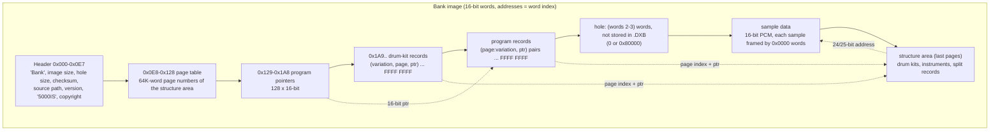
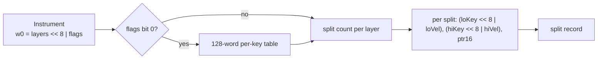
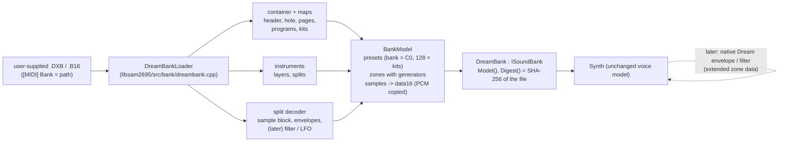

# SAM-7: Dream-native sound banks (.DXB / .B16) - reverse-engineered format and integration path

Research for phase SAM-7 of [tdd-libsam2695.md](tdd-libsam2695.md) §8. POC code, how to run it and the raw
results: [tools/poc/024-dream-banks](../../../tools/poc/024-dream-banks/README.md).

**Status (2026-10-08):** the container, the program / variation / drum-kit maps, instruments (layers, key and velocity
splits), the sample block (addresses, loop, one-shot, pitch) and the sample encoding (plain 16-bit PCM, no compression,
no encryption) are understood and validated on all 24 bank files in `testdata/midi/`. The per-split synthesis
parameters (envelopes, filter, LFOs, keyboard tables) form a compact tagged stream that is only partly understood:
the amplitude envelope is mapped approximately, the rest is not decoded. A converter turns a Dream bank into the
SF2-shaped model libsam2695 plays; renders through libsam2695 are pitch-exact (median 0.9 cents on Dream's own
GMBK5X128 loops) with approximate envelopes and no filter.

## 1. Inputs and licensing

| Bank file (repo-relative, untracked) | Origin | Notes |
|---|---|---|
| `testdata/midi/dream-gmbk5x/GMBK5X128_203.DXB`, `GMBK5X128.DXB`, `GMBK5X64.DXB`, `GMBK5X128-V2.03.B16` | Dream S.A.S. (CleanWave-5000 sound package) | bank maps as PDF next to them |
| `testdata/midi/dreamblaster-buran/BURAN11.DXB`, `BURAN-v1.00.B16` | Serdaco | partly GeneralUser GS samples |
| `testdata/midi/dreamblaster-gud/GUD_104.DXB` | Serdaco | GeneralUser GS 1.44 samples, hand-tuned |
| `testdata/midi/dreamblaster-unofficial-hummtaro/*` | community conversions (16 files: GXSCC, Roland GM, Yamaha GM, MT-32, OPL-3, ESFM, ...) | some with their source SF2 elsewhere in `testdata/midi/` |
| `testdata/midi/dream-sam2695-sf2/sam2695.sf2` | community SF2 approximation of the SAM2695 ("Reyna SE / 2695 SF2") | shares no PCM with the GMBK banks (0 of 806 samples found) |

Dream and Serdaco banks are licensed for DreamBlaster cards only. Nothing from them is in the repository: no bytes,
no samples, no converted banks. This document quotes only small structural excerpts (headers, table words). The POC
writes every extraction and conversion under `scratch/`. A core loader would read a bank the user supplies, the
same way the emulator reads a ROM image, and would never ship one.

Public information: none on the compiled format. Serdaco states that "the spec for the compiled dream banks is
proprietary" and that only the Dream 5000 SDK bank compiler produces them; Awave Studio 12.4 reads and writes the
SDK *source* formats (.XDB bank XML, .XDI instruments, .XDD drum sets, WAV samples), not the binary
([Serdaco: Converting SF2 soundfonts to X2 DreamBlaster soundbanks](https://serdaco.com/downloads/X2/X2_Documentation/Converting%20SF2%20soundfonts%20to%20X2%20DreamBlaster%20soundbanks.pdf),
[DOS Days: software wavetables part 3](https://www.dosdays.co.uk/topics/software_wavetables_pt3.php),
`testdata/midi/docs/5000-SDK_short.pdf`, `testdata/midi/docs/MakeRom User Guide.pdf`). Everything below was
derived from the files.

## 2. Method

1. Word statistics and entropy: per-MB byte entropy 7.4..7.9 bits, but neighbor differences of 16-bit LE words are
   0.10..0.39 of the mean magnitude (random data gives about 1.3): audio-like PCM, not encrypted or compressed (the
   SAM5000 can decrypt AES banks on the fly, see the SAM5704B datasheet, but none of these banks use it).
2. Known-plaintext: GXSCC GM.dxb is a conversion of `testdata/midi/gxscc-gm/GXSCC_gm_033.sf2` (CC BY 4.0). All 126
   SF2 samples were found verbatim in the DXB as 16-bit little-endian PCM; their addresses then appeared in the split
   records, which fixed the address encoding.
3. Known-plaintext at scale: GUD_104.DXB contains GeneralUser GS 1.44 samples (99 of 118 probes found verbatim). 8 526
   splits were matched to SF2 samples at 11 different sample rates (11 025..48 000 Hz), which fixed the pitch word.
4. Cross-file consistency: the same bank as DXB and as B16 (GMBK5X128 2.03, Roland GM, BURAN), old and new compiler
   versions (GMBK5X128 2015 vs 2019), 24 banks from 4 sources and compiler versions 0.33..2.03.
5. Dream's bank maps (`GMBK5X128_203.pdf`, `GMBK5X128.pdf`, `GMBK5X64.pdf`, `Dream-CleanWave_Sound_Packages.pdf`):
   variation counts, the variation list, drum kits, exclusive classes.
6. Audible / measurable checks: extracted loops played at the decoded root key against equal temperament; renders
   through libsam2695 against the source SF2s.

Confidence levels used below: **confirmed** (checked against ground truth or across all files), **likely**
(consistent everywhere, meaning inferred), **unknown**.

## 3. File layout

A bank is an image of 16-bit little-endian words. Every pointer is a word address in that image. The load address
in the header is 0x800000 words (the bank sits at 16 MB in the card's flash); pointers are relative to the image
start, so the bank is relocatable (the GMBK5X64 map says so).



### 3.1 Header

| Word | Field | Example (GMBK5X128_203.DXB) | Confidence, how |
|---|---|---|---|
| 0-1 | magic `Bank` | `4261 6e6b` | confirmed, 24/24 files |
| 2-3 | hole size in words (image size - file size) | `0x80000` | confirmed, 24/24 files (11 DXB have 0x80000, B16 and small or old DXB 0) |
| 4-5 | image size in words | `0x70260B` | confirmed, equals file words + hole |
| 6-7 | load address in words | `0x800000` | likely (constant; "relocatable" note in GMBK5X64.pdf) |
| 8 | 16-bit checksum: the word sum of the whole file is 0 | | confirmed on 22 files; absent in the 2014/2015 GMBK files (path starts at word 8 there) |
| 9-0x43 | source path of the compiled `.xdb`, NUL-padded | `C:\research\serdaco\...\GMBK5X128.xdb` | confirmed (it is the SDK bank source) |
| 0x44-0x46 | version string, NUL-padded (`2.03`, `1.0.16`, empty in old files) | `2.03` | confirmed, matches the bank file names / maps |
| 0x47 | compiler or format revision (`0x0100` 2014/2015, `0x010C`, `0x011F`) | `0x010C` | likely; selects the old instrument header and the missing checksum |
| 0x48 | small number (`0x01`..`0x3B`; always `0x3B` in B16) | `0x22` | unknown |
| 0x49-0x4B | target tag `5000IS` | | confirmed (SAM5000 family; all files) |
| 0x4C | flags (`0x0203`, `0x4203`, `0x4703`, ...) | `0x4203` | unknown |
| 0x4D | 1 | | unknown |
| 0x4E-0x4F | image size again | | confirmed |
| 0x50-0x51 | 32-bit value (B16: always ends in `...F0`) | `0x8FD9E5` | unknown (not a plain word or byte sum) |
| 0x52-0xD3 | table of 32-bit slots, unused ones `0x1DEF 0x1DEF`; B16 files use 2-3 slots (addresses inside the image) | | unknown |
| 0xD4-0xE7 | copyright text, `0xFE`-terminated, `0xEE`-padded (some files right-align it into the slot table) | `Dream S.A.S Copyright 1994-2019` | confirmed |
| 0xE8 | `0xC4`..`0xE2` | `0xE2` | unknown |
| 0xE9.. | page table: the high 16 bits of the 64K-word pages that hold the structures; zero-terminated (page 0 can be the only entry) | `0x6E 0x6F 0x70` | confirmed: every pointer resolves |

Excerpt (GMBK5X128_203.DXB, bytes 0x88..0xA3): `322e 3033 0000 0c01 2200 3530 3030 4953 0342 0100 0b26 7000 e5d9 8f00`.

### 3.2 Program and variation map

| Item | Layout | Confidence |
|---|---|---|
| program pointers | 128 words at 0x129: word address of the program's record list (always in page 0) | confirmed |
| program record | pairs `(pageIndex << 8 | variation, low16)` until `FFFF FFFF`; instrument address = `page[pageIndex] << 16 | low16` | confirmed |
| variation | the GS "C0" bank-select value; 0 = GM capital tone, 127 = MT-32 map | confirmed: GMBK5X128 2.03 has 397 records = 128 GM + 269 variations, its map says "269 variation instruments (including 128 MT-32 variations)", and exactly 128 records carry variation 127; the 2015 file has 140 variations, matching the CleanWave-5000 package sheet; every variation the map lists (101 of 101 in the 2015 map, 103 of 105 in the 2.03 map) is in the bank, the two misses are a map row that lists the Fingered / Picked Bass variations one program early |
| missing programs | a program can have no record (GMBK5X64: program 56 Orchestra Hit, although its map lists it) | confirmed |
| drum kits | records `(variation, pageIndex << 8, low16)` at 0x1A9 until `FFFF FFFF` | confirmed: GMBK has kits 0, 8, 16, 24, 25, 32, 40, 48, 56, 127 = "9 drum sets + 1 SFX set" plus the MT-32 kit |

### 3.3 Drum kit

| Word | Field | Confidence |
|---|---|---|
| 0 | `0xFFFF` | confirmed (all kits) |
| 1 | `highNote << 8 | lowNote` (27..87 for GM kits, 39..84 SFX, 35..108 MT-32) | confirmed (GS ranges) |
| 2.. | one 16-bit pointer per note (same page) to an instrument; notes can share an instrument | confirmed: GXSCC note -> sample matches the source SF2 for every note |
| after | exclusive groups as a byte stream `count, note...`, terminated by `0xFF` | confirmed: GM kit `[42 44 46] [71 72] [73 74] [78 79] [80 81] [86 87]` = hi-hats, whistles, guiros, cuicas, triangles, surdos, the "EXC1..EXC6" marks of the GMBK5X64 drum table; orchestra kit `[27 28 29]` |
| | optional names (BURAN, GUD: ASCII instrument / kit names stored before the structures) | likely |

### 3.4 Instrument



| Field | Layout | Confidence |
|---|---|---|
| word 0 | `layers << 8 | flags`; flags `0x40` on every Dream-made instrument, `0x00` on community banks, bit 0 = per-key table present, bit 15 seen on a few BURAN instruments | layers: confirmed; flags: unknown except bit 0 (likely) |
| early layout | 2014/2015 compiler: word 0 = flags only, word 1 = `layers << 8 | splits of layer 0`, then one count per further layer | confirmed (GMBK5X128 2015 parses fully) |
| per-key table | 128 signed words (ramps for Reverse Cymbal, a curve for Helicopter, constant for Gunshot) | likely a key -> pitch or key -> level table |
| counts | one word per layer, bit 7 is a flag (`0x84` = 4 splits) | confirmed |
| split entry | `loKey << 8 | loVel`, `hiKey << 8 | hiVel`, 16-bit pointer into the instrument's page | confirmed |
| key range | high key inclusive; the stored low key is the previous split's high key (exclusive), except for the first split; bit 7 of a key byte is a flag (set on the last drum split, e.g. `0xA5` = 0x80 + 37) | confirmed against GXSCC (`(0..59) (60..83)` stored as `0000 3b7f`, `3b00 537f`) |
| velocity | same convention; layers split by velocity (`ff01` = velocity 0..1 layer) | likely |
| layers | several layers sound together (stereo pairs, layered tones) | likely |

### 3.5 Split record

A split record is a header word (`0x82xx` / `0x83xx` / `0x80xx`), 2..5 pointers to its own sub-blocks, then a tagged
parameter stream. The stream is byte-oriented (tag in the low byte, value in the high byte; some tags have
optional extra words switched by bit 0 or bit 6 of the tag). Only the sample block and the amplitude envelope are
decoded.

```text
82 4b | 0a26 0a1d 0a21 0a24 | b5f0 9834 ca23 1032 e204 0082 | 0c16 0000 0ce2 9b01 0000 00bd 0c44 e6e7 00dc 0d2d | 7f0e 4b06 e7e7 | 7f00 1fe3 8019 6048 | 7f00 1950 6532 | 0001 1b0a | f1f1 ... fffe | 0017 0403 ...
head    sub-block offsets      parameter stream (filter?)      pitch ext  loop-1      start       level end         amp words      envelope 1          envelope 2      ?           16-byte table  tail
```

Sample block (10 words; a rare variant of 12 words puts the end before the level word and adds a second end):

| Word | Field | Confidence, how |
|---|---|---|
| -1 | parameter word with bit 7 set (`0x81`, `0x82`, `0x91`, `0xC1`, `0xE1` ...; high byte a signed value) | unknown meaning, used as an anchor |
| 0 | **pitch**: signed, 1/256 semitone: `pitch / 256 = 12 log2(rate) - rootKey - 120.384`, i.e. at note `n` the sample plays at `2^((n + pitch/256 + 120.384) / 12)` samples per second | confirmed: GXSCC 256 splits one constant (-120.384), GUD 121 splits at 11 rates, slope 1 in log2(rate); identical in DXB and B16 |
| 1 | bit 6 = address bit 24 for all three addresses (banks over 16 M words); low 6 bits a small signed value (fine tune?) | bit 6: confirmed (GUD: with it the bit-6 splits land exactly on their SF2 samples, without it they land in unrelated sample data); low bits: unknown |
| 2-3 | loop start - 1: `w2 << 8 | w3 >> 8`; low byte of w3 is always 1 | confirmed (GXSCC full loops, GUD: loop start equal to the SF2 loop start, or 3 / 8 samples earlier where the compiler moved it) |
| 4 | 0 (BURAN: small values) | unknown |
| 5-6 | sample start: `w6 << 8 | (w5 & 0xFF)`; high byte of w5 mostly 0 | confirmed (start is preceded by a `0x0000` separator word) |
| 7 | level pair, two bytes that differ by about 1 (`e6e7`, `f6f7`), rising with the key across splits | likely a level / attenuation; scale unknown |
| 8-9 | end = last sample of the loop: `w9 << 8 | (w8 & 0xFF)` | confirmed (= SF2 loop end - 1) |
| one-shot | loop start one word before the sample start (it points at the separator) | likely: 175 splits in the OPL-3 banks, all on percussive sounds; the end is followed by zero words |

Envelope blocks follow `7f0e xx06 LLRR` (two amplitude words and a second level pair). An envelope is a start word
(`0000` or `7f00`) followed by segment words `level << 8 | rate` and ends with a release word `0x60rr`:

| Segment | Meaning | Confidence |
|---|---|---|
| `1Frr` | attack segment(s); `1FFF` = instant | likely |
| `80rr`..`8Frr` | decay to silence (percussive sounds: piano, guitar, bass) | likely: present where the GeneralUser source has sustain 100 dB |
| `5Frr` | hold at the reached level (organs, strings, winds) | likely |
| `60rr` | release; a larger byte is faster: about 143 timecents per step (`tc = 10424 - 142.7 x rate`, r = -0.72 against GeneralUser) | likely, approximate |
| second block | a second envelope of the same shape (filter or pitch) | unknown |

Not decoded: the `b5f0 ...` stream before the sample block (filter type / cutoff / resonance, LFO depths, velocity
sensitivity are the candidates; the SDK sheet lists per split "1 oscillator, 1 multi-mode filter, 1 amplifier,
3 envelopes, 2 LFOs and 4 keyboard tables"), the 16-byte tables (rising byte ramps like `f1 f1 ... fe ff`: keyboard
or velocity tables), the tail words (`0403 0012 0201 ...`).

### 3.6 Sample data

| Property | Value | Confidence |
|---|---|---|
| encoding | signed 16-bit little-endian PCM, mono | confirmed (verbatim SF2 data, 100 % of probes in GXSCC, 84 % in GUD) |
| compression / encryption | none | confirmed (verbatim data; the SAM5000 AES option is unused) |
| framing | `0x0000` before each sample; a sample occupies `length + 1` words | confirmed |
| sample rate | not stored; folded into the pitch word | confirmed |
| synthetic waves | short single-cycle waves (saw, square) are stored like samples | confirmed (GMBK `0x638DE2` is a sawtooth ramp) |
| stereo | two layers with one mono sample each | likely |

### 3.7 .B16 versus .DXB

A .B16 is **not** the raw flash image of the .DXB. It is the same compiled bank linked again for the X16: identical
programs, instruments, split records and pitch words (GMBK5X128 2.03: 2 725 of 2 733 splits aligned, 2 723 equal
pitch words; Roland GM: 1 613 of 1 613), identical PCM (2 651 / 1 556 samples byte-equal), but the samples are
moved so that about half of them end exactly at a 4 096-word boundary (`...FFF`), the file has no hole, and the
page table points at page 0. B16 files are larger (GMBK: 15.6 MB vs 13.7 MB) because of that padding. The X16
loads B16 from its 1 GB flash; the 4K-word alignment fits a NAND page / cache line (likely).

### 3.8 .DXP

A DXP (56..120 bytes) is an effects preset, not part of the bank: pairs `(address, value)` of 16-bit words, `0xF6xx`
addresses, `FFFF EEEE` separators, `FFFF FFFF` end. The addresses match the Dream NRPN space of the DreamBlaster
X16 MIDI spec (reverb, chorus, equalizer, `37xxh`), likely sent as NRPNs by the upload tool. Out of scope here.

## 4. Results (POC)

All 24 bank files parse; the self-check passes on all of them.

| Bank | Version | Checksum | MB | Hole | Records / variations | Kits | Splits decoded | Samples |
|---|---|---|---|---|---|---|---|---|
| GMBK5X128_203.DXB | 2.03 | ok | 14.7 | 0x80000 | 397 / 269 | 10 | 3368 / 3380 | 853 |
| GMBK5X128.DXB (2015) | - | n/a | 13.3 | 0 | 268 / 140 | 10 | 2499 / 2507 | 856 |
| GMBK5X64.DXB | - | n/a | 7.9 | 0 | 127 / 0 | 1 | 892 / 893 | 441 |
| GMBK5X128-V2.03.B16 | 2.03 | ok | 15.6 | 0 | 397 / 269 | 10 | 3371 / 3380 | 885 |
| BURAN11.DXB | 1.1 | ok | 47.2 | 0x80000 | 256 / 128 | 10 | 4332 / 4352 | 882 |
| BURAN-v1.00.B16 | 1.00 | ok | 54.3 | 0 | 256 / 128 | 10 | 4377 / 4399 | 903 |
| GUD_104.DXB | 1.04 | ok | 36.9 | 0x80000 | 128 / 0 | 9 | 2471 / 2485 | 866 |
| 17 community banks (GXSCC, Roland GM, Yamaha GM, OPL-3, MT-32, ESFM, UltraSound, ...) | 0.1..2.0 | ok | 0.2..505 | both | | 0..10 | 100 % except the two MT-32 banks (4 of 6 246 undecoded) | |

Pitch decoding on Dream's own bank (no source available): every looped sample of the sustained families
(organs, strings, ensembles, brass, reeds, pipes) played at its decoded root key, autocorrelation pitch against
equal temperament: **GMBK5X128 2.03: 157 loops, median 0.9 cents, 99 % within 25 cents**; GMBK5X64: 156 loops,
0.9 cents, 98 %; BURAN 1.1: 347 loops, 2.1 cents, 97 %.

### 4.1 Renders through libsam2695

`compare.py` renders one MIDI file (C major scale and a held note on eight GM instruments, four drum hits) with
`sam2695render --dry` (voice mix only) through three banks. "dream" is GMBK5X128_203.DXB converted by `tosf2.py`.

| Instrument | Pitch error, mean abs, cents: dream / GeneralUser GS / sam2695.sf2 | Spectral centroid, Hz: dream / GU GS / sam2695.sf2 |
|---|---|---|
| Acoustic Grand Piano | 10.4 / 5.1 / 7.8 | 1282 / 971 / 1140 |
| Nylon Guitar | 1.3 / 5.2 / 2.1 | 1104 / 1140 / 859 |
| Violin | 0.4 / 12.3 / 1.8 | 2129 / 2373 / 2123 |
| String Ensemble 1 | 3.3 / 1.6 / 1.6 | 2372 / 1961 / 1984 |
| Trumpet | 1.8 / 1.8 / 5.0 | 1636 / 2804 / 2035 |
| Flute | 2.7 / 2.8 / 3.6 | 992 / 1528 / 662 |
| Church Organ | 1.6 / 1.3 / 3.2 | 3438 / 1511 / 1784 |
| Finger Bass | 1.0 / 0.7 / 3.5 | 941 / 866 / 1439 |

| Held note (C4, 2 s) | Attack ms / level change 0.25..1.5 s dB / release to -40 dB ms: dream | GU GS | sam2695.sf2 |
|---|---|---|---|
| Acoustic Grand Piano | 55 / -18.2 / 330 | 5 / -8.6 / 435 | 20 / -17.4 / 440 |
| Nylon Guitar | 5 / -10.6 / 70 | 45 / -18.5 / 290 | 10 / -11.7 / 240 |
| String Ensemble 1 | 60 / -1.3 / 375 | 335 / +2.9 / 645 | 225 / -2.8 / 555 |
| Church Organ | 105 / -0.1 / 150 | 235 / -3.5 / 370 | 60 / +4.6 / 285 |

1/3-octave level distance between banks (mean dB difference of normalized band levels, median over 76 notes):
dream vs GU GS 9.7 dB, dream vs sam2695.sf2 8.7 dB, GU GS vs sam2695.sf2 8.4 dB. The three banks are three
different sample sets; the numbers say how far apart they are, not which is closer to a real SAM2695 (no recording
of the chip exists in the repository).

Conversion fidelity (same samples on both sides):

| Pair | Melodic spectral distance | Pitch | Envelope |
|---|---|---|---|
| GXSCC GM.dxb converted vs its source GXSCC_gm_033.sf2 | 0.0 dB | identical (14.5 vs 14.6 cents, the source's own detune) | decay 3 dB less over 1.25 s, release 180 vs 205 ms |
| GUD_104.DXB converted vs GeneralUser GS 1.44 | 3.4 dB | within a few cents | close on most notes; GUD was hand-tuned, so differences are partly intended |

## 5. What the libsam2695 voice model lacks for Dream data

| Dream feature (SDK sheet, files) | libsam2695 today (SF2 2.04 model) | Gap |
|---|---|---|
| multi-segment envelopes (several attack segments, levels per segment), 3 envelopes per split | DAHDSR volume envelope + one modulation envelope | needs a segment-list envelope; the DAHDSR approximation loses shape |
| multi-mode filter | SF2 two-pole low-pass | high-pass / band-pass / other modes, Dream's cutoff and resonance scales |
| 2 LFOs with Dream routing | SF2 mod LFO + vibrato LFO | probably fits, once decoded |
| 4 keyboard tables per split, 128-word per-key tables | key-number generators with linear scaling | arbitrary per-key / per-velocity curves |
| two level pairs per split (rising with the key) | initial attenuation, pan | scale unknown |
| 25-bit sample addresses | 32-bit frame indices | none |
| exact pitch word (1/256 semitone + rate) | root key + coarse + fine (1 cent) | sub-cent rounding only |

None of the gaps blocks a playable bank: the converter plays every Dream program with correct samples, splits,
layers, loops and pitch. They decide how close the envelopes, brightness and dynamics get.

## 6. Proposed integration



`ISoundBank` already exposes an SF2-shaped `BankModel`, so a Dream loader fills that model the way `tosf2.py`
fills an SF2. The bank's SHA-256 identity and the save-state refusal of another bank work unchanged.

| Phase | Content | Size |
|---|---|---|
| D-1 | `DreamBank::LoadFile / LoadMemory` in libsam2695: header, hole, page table, programs, variations, kits, exclusive groups, instruments, sample block, pitch, loops, one-shot; approximate amplitude envelope; `BankError` values for bad magic / truncation / unparsed splits (skip and warn) | M (2-3 days) |
| D-2 | Tests without licensed data: a synthetic DXB writer in the test suite (tiny image: header, one program, one kit, a sine sample) plus golden renders; optional local-only test that runs when `testdata/midi/dream-gmbk5x/` exists | S-M |
| D-3 | Emulator wiring: the `[MIDI] Bank=` setting accepts `.dxb` / `.b16` next to `.sf2`; docs: the user supplies the bank, never shipped | S |
| D-4 (research) | Decode the parameter stream: filter, LFOs, second / third envelope, keyboard tables, level pairs. Needs controlled ground truth (see Q2) | L, open-ended |
| D-5 | Voice-model extensions for what D-4 finds (segment envelopes, filter modes, key tables), behind a bank-type switch so SF2 playback stays bit-identical | M-L |

## 7. Open questions for the owner

| # | Question | Recommendation |
|---|---|---|
| Q1 | Is a Dream-bank mode with exact samples / splits / pitch but approximate envelopes and no filter worth landing (D-1..D-3), or only after D-4? | Land D-1..D-3 as an experimental, opt-in bank type: it already plays Dream's CleanWave-5000 samples, which is closer to the chip family than any SF2, and the approximation is documented. |
| Q2 | D-4 needs ground truth. Options: (a) Awave Studio (commercial) to write .XDB sources from an SF2 with controlled parameters, compiled by the Dream 5000 SDK (Serdaco, price on request); (b) a DreamBlaster X2 / X16 to record reference audio; (c) statistics on more source-paired banks (slow, imprecise). | (b) a DreamBlaster X2 recording set is the most useful single item (it also answers "how close to the real chip"); (a) only if the SDK becomes available. Without either, stop at the approximation. |
| Q3 | Bank versions to support: DXB 2014..2019 compilers and B16. | Both: they share every structure; the cost is the hole and the old instrument header (already handled). |
| Q4 | Licensing posture: loader reads a user-supplied bank like a ROM, nothing shipped, no bank-derived data in tests or CI. | Keep it exactly so; the SAM2695's own CleanWave ROM remains unavailable, the GMBK banks are its 5000-series relatives, not the chip's ROM. |
| Q5 | Variation 127 holds an MT-32 map (128 programs) and kit 127 the MT-32 kit in Dream's and the community banks. Expose an MT-32 mode for the card? | Not now; note it for the MT-32 work if it ever comes. |

## 8. References

- POC: [tools/poc/024-dream-banks/README.md](../../../tools/poc/024-dream-banks/README.md) (`dreambank.py`, `tosf2.py`, `compare.py`)
- libsam2695 bank model: `core/src/3rdparty/sam2695/include/sam2695/soundbank.h`
- Dream documents in `testdata/midi/docs/`: `5000-SDK_short.pdf` (split structure), `MakeRom User Guide.pdf` (word
  addressing, image building), `SAM5704B.pdf` (sample cache, on-the-fly AES sample decryption option, memory sizes),
  `DreamBlaster X16 MIDI Specs.pdf` (NRPN map, DXP addresses), bank maps in `testdata/midi/dream-gmbk5x/`
- Serdaco, [Converting SF2 soundfonts to X2 DreamBlaster soundbanks](https://serdaco.com/downloads/X2/X2_Documentation/Converting%20SF2%20soundfonts%20to%20X2%20DreamBlaster%20soundbanks.pdf) (SDK tool chain, XDB / XDI / XDD sources)
- DOS Days, [Software Wavetables part 3](https://www.dosdays.co.uk/topics/software_wavetables_pt3.php) (DXB described as proprietary, SDK-only)
