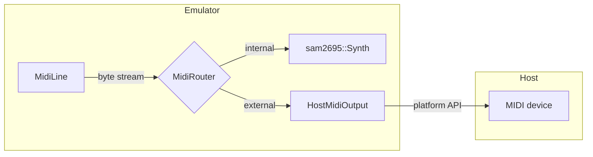
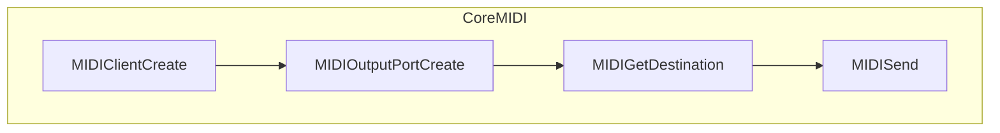
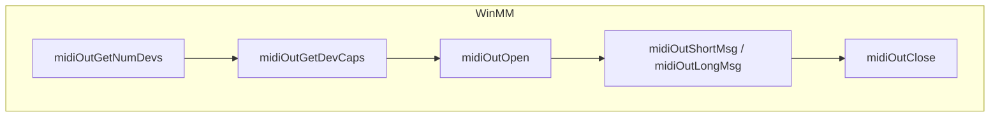
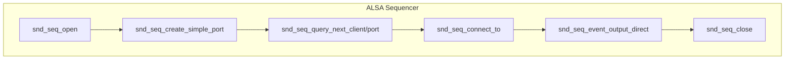
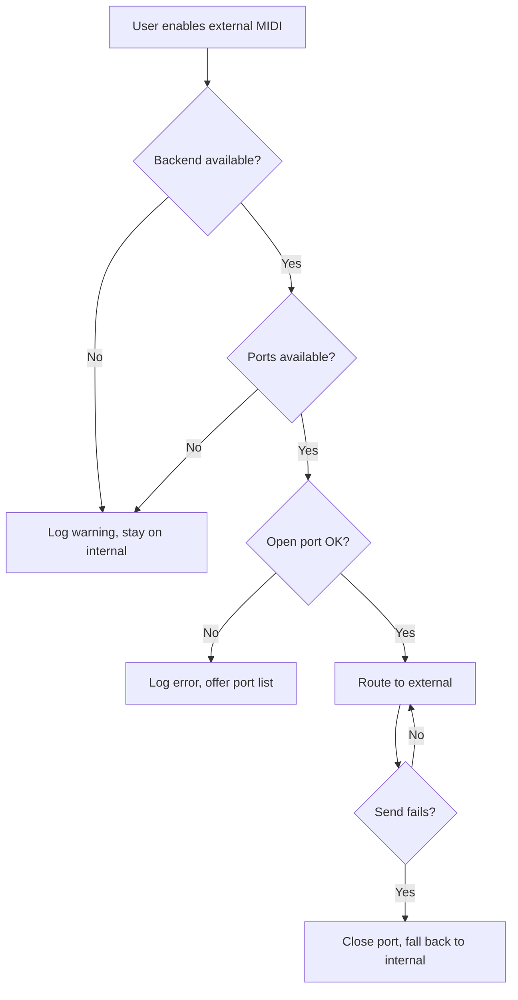
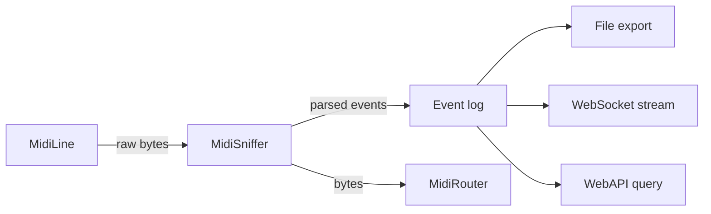

# Host MIDI output (SAM-6): technical design

| | |
|---|---|
| **Date** | 2026-10-08 |
| **Status** | Design |
| **Depends on** | [tdd-midi-line.md](tdd-midi-line.md) (MidiLine captures the bit-banged stream) |
| **Effort scale** | S < 1 week, M 1-2 weeks, L 2-4 weeks |

## 1. Goal

Route the MIDI stream that the emulated software bit-bangs through the YM chip's I/O port to a **real MIDI device** on
the host (hardware synth, DAW, soft synth). The emulator's internal SAM2695 synthesizer remains the default; host
output is an **opt-in alternative** for users who prefer external sound.

**Non-goals (this phase):**

- MIDI input (keyboard -> emulator)
- Timing tighter than frame granularity (~20 ms)
- SysEx bulk dumps (pass through, but no special handling)

## 2. Architecture overview



`MidiRouter` sits between the `MidiLine` (which decodes bit-banged bytes) and the sink(s). It decides where each byte
goes based on the user's configuration.

## 3. Platform backends

Each backend implements `IHostMidiBackend`:

```cpp
class IHostMidiBackend
{
public:
    virtual ~IHostMidiBackend() = default;

    // List available output ports. Returns empty if the subsystem is unavailable.
    virtual std::vector<MidiPortInfo> EnumeratePorts() = 0;

    // Open a port by id. Returns false on failure (port gone, permission denied).
    virtual bool Open(const std::string& portId) = 0;

    // Close the current port. Safe to call if not open.
    virtual void Close() = 0;

    // Send a MIDI message (1-3 bytes for channel messages, variable for SysEx).
    // Returns false if the port is not open or the send fails.
    virtual bool Send(std::span<const uint8_t> message) = 0;

    // Human-readable error from the last failed operation.
    virtual std::string LastError() const = 0;
};
```

### 3.1 macOS: CoreMIDI



| Step | API | Notes |
|------|-----|-------|
| Init | `MIDIClientCreate` | One client per process; name = "Unreal-NG" |
| Enumerate | `MIDIGetNumberOfDestinations`, `MIDIGetDestination`, `MIDIObjectGetStringProperty` | Destination = output port from our perspective |
| Open | `MIDIOutputPortCreate` | One output port, reused for all destinations |
| Send | `MIDISend` with `MIDIPacketList` | Timestamp 0 = now |
| Close | `MIDIPortDispose`, `MIDIClientDispose` | Client disposed at shutdown |

**Fallback:** `MIDIClientCreate` returns `kMIDIServerStartErr` if the MIDI server is unreachable (sandbox, daemon
crash). Log once, disable the feature for this session.

**Framework:** `CoreMIDI.framework` (weak-linked, availability check at runtime).

```cpp
// coremidibackend.mm (sketch)
#include <CoreMIDI/CoreMIDI.h>

class CoreMidiBackend : public IHostMidiBackend
{
    MIDIClientRef client_ = 0;
    MIDIPortRef outPort_ = 0;
    MIDIEndpointRef dest_ = 0;
    std::string lastError_;

public:
    CoreMidiBackend()
    {
        OSStatus err = MIDIClientCreate(CFSTR("Unreal-NG"), nullptr, nullptr, &client_);
        if (err != noErr) {
            lastError_ = "MIDIClientCreate failed: " + std::to_string(err);
            return;
        }
        MIDIOutputPortCreate(client_, CFSTR("Output"), &outPort_);
    }

    std::vector<MidiPortInfo> EnumeratePorts() override
    {
        std::vector<MidiPortInfo> result;
        if (!client_) return result;

        ItemCount n = MIDIGetNumberOfDestinations();
        for (ItemCount i = 0; i < n; ++i) {
            MIDIEndpointRef ep = MIDIGetDestination(i);
            CFStringRef name = nullptr;
            MIDIObjectGetStringProperty(ep, kMIDIPropertyDisplayName, &name);
            // Convert CFString to std::string, add to result
        }
        return result;
    }

    bool Open(const std::string& portId) override
    {
        // Find endpoint by id, store in dest_
        return dest_ != 0;
    }

    bool Send(std::span<const uint8_t> message) override
    {
        if (!dest_) return false;
        MIDIPacketList pktList;
        MIDIPacket* pkt = MIDIPacketListInit(&pktList);
        pkt = MIDIPacketListAdd(&pktList, sizeof(pktList), pkt, 0,
                                message.size(), message.data());
        return MIDISend(outPort_, dest_, &pktList) == noErr;
    }

    void Close() override { dest_ = 0; }
    std::string LastError() const override { return lastError_; }
};
```

### 3.2 Windows: WinMM (midiOut*)



| Step | API | Notes |
|------|-----|-------|
| Enumerate | `midiOutGetNumDevs`, `midiOutGetDevCapsW` | Device 0 = Microsoft GS Wavetable (fallback soft synth) |
| Open | `midiOutOpen` | Callback = null (we don't need done notifications) |
| Send | `midiOutShortMsg` (channel messages), `midiOutLongMsg` (SysEx) | Short msg packed into DWORD |
| Close | `midiOutClose` | |

**Fallback:** `midiOutGetNumDevs() == 0` means no MIDI devices. `midiOutOpen` returns `MMSYSERR_*` on failure (device
busy, removed). Log and disable.

```cpp
// winmmbackend.cpp (sketch)
#include <Windows.h>
#include <mmsystem.h>
#pragma comment(lib, "winmm.lib")

class WinMmBackend : public IHostMidiBackend
{
    HMIDIOUT hMidiOut_ = nullptr;
    std::string lastError_;

public:
    std::vector<MidiPortInfo> EnumeratePorts() override
    {
        std::vector<MidiPortInfo> result;
        UINT n = midiOutGetNumDevs();
        for (UINT i = 0; i < n; ++i) {
            MIDIOUTCAPSW caps;
            if (midiOutGetDevCapsW(i, &caps, sizeof(caps)) == MMSYSERR_NOERROR) {
                // Convert wchar to utf8, add to result
            }
        }
        return result;
    }

    bool Open(const std::string& portId) override
    {
        UINT devId = /* parse from portId */;
        MMRESULT res = midiOutOpen(&hMidiOut_, devId, 0, 0, CALLBACK_NULL);
        if (res != MMSYSERR_NOERROR) {
            lastError_ = "midiOutOpen failed: " + std::to_string(res);
            return false;
        }
        return true;
    }

    bool Send(std::span<const uint8_t> message) override
    {
        if (!hMidiOut_) return false;
        if (message.size() <= 3) {
            DWORD msg = 0;
            for (size_t i = 0; i < message.size(); ++i)
                msg |= message[i] << (8 * i);
            return midiOutShortMsg(hMidiOut_, msg) == MMSYSERR_NOERROR;
        }
        // SysEx: midiOutLongMsg with MIDIHDR
        return true;
    }

    void Close() override
    {
        if (hMidiOut_) {
            midiOutClose(hMidiOut_);
            hMidiOut_ = nullptr;
        }
    }

    std::string LastError() const override { return lastError_; }
};
```

### 3.3 Linux: ALSA (RawMidi or Sequencer)

Two options:

| API | Pros | Cons |
|-----|------|------|
| **RawMidi** (`snd_rawmidi_*`) | Simple, direct byte stream | No virtual ports, hardware only |
| **Sequencer** (`snd_seq_*`) | Virtual ports, timestamps, routing | More complex |

**Recommendation:** Use the **Sequencer API** for flexibility (software synths like FluidSynth expose sequencer ports).



| Step | API | Notes |
|------|-----|-------|
| Init | `snd_seq_open`, `snd_seq_set_client_name` | Mode = `SND_SEQ_OPEN_OUTPUT` |
| Create port | `snd_seq_create_simple_port` | Caps = `SND_SEQ_PORT_CAP_READ | SND_SEQ_PORT_CAP_SUBS_READ` |
| Enumerate | `snd_seq_query_next_client`, `snd_seq_query_next_port` | Filter: `SND_SEQ_PORT_CAP_WRITE | SND_SEQ_PORT_CAP_SUBS_WRITE` |
| Connect | `snd_seq_connect_to` | Our port -> destination |
| Send | `snd_seq_event_output_direct` | Event type from MIDI status byte |
| Close | `snd_seq_close` | |

**Fallback:** `snd_seq_open` fails if ALSA is not available (no `/dev/snd/seq`). Log and disable.

```cpp
// alsabackend.cpp (sketch)
#include <alsa/asoundlib.h>

class AlsaBackend : public IHostMidiBackend
{
    snd_seq_t* seq_ = nullptr;
    int port_ = -1;
    snd_seq_addr_t dest_{};
    std::string lastError_;

public:
    AlsaBackend()
    {
        if (snd_seq_open(&seq_, "default", SND_SEQ_OPEN_OUTPUT, 0) < 0) {
            lastError_ = "snd_seq_open failed";
            return;
        }
        snd_seq_set_client_name(seq_, "Unreal-NG");
        port_ = snd_seq_create_simple_port(seq_, "MIDI Out",
            SND_SEQ_PORT_CAP_READ | SND_SEQ_PORT_CAP_SUBS_READ,
            SND_SEQ_PORT_TYPE_APPLICATION);
    }

    std::vector<MidiPortInfo> EnumeratePorts() override
    {
        std::vector<MidiPortInfo> result;
        if (!seq_) return result;

        snd_seq_client_info_t* cinfo;
        snd_seq_port_info_t* pinfo;
        snd_seq_client_info_alloca(&cinfo);
        snd_seq_port_info_alloca(&pinfo);

        snd_seq_client_info_set_client(cinfo, -1);
        while (snd_seq_query_next_client(seq_, cinfo) >= 0) {
            int client = snd_seq_client_info_get_client(cinfo);
            snd_seq_port_info_set_client(pinfo, client);
            snd_seq_port_info_set_port(pinfo, -1);
            while (snd_seq_query_next_port(seq_, pinfo) >= 0) {
                unsigned caps = snd_seq_port_info_get_capability(pinfo);
                if (caps & SND_SEQ_PORT_CAP_WRITE) {
                    // Add to result
                }
            }
        }
        return result;
    }

    bool Open(const std::string& portId) override
    {
        // Parse client:port from portId
        return snd_seq_connect_to(seq_, port_, dest_.client, dest_.port) >= 0;
    }

    bool Send(std::span<const uint8_t> message) override
    {
        if (!seq_ || port_ < 0) return false;
        snd_seq_event_t ev;
        snd_seq_ev_clear(&ev);
        snd_seq_ev_set_source(&ev, port_);
        snd_seq_ev_set_subs(&ev);
        snd_seq_ev_set_direct(&ev);
        // Decode MIDI message into ev (note on/off, cc, etc.)
        snd_seq_ev_set_noteon(&ev, message[0] & 0x0F, message[1], message[2]);
        return snd_seq_event_output_direct(seq_, &ev) >= 0;
    }

    void Close() override
    {
        if (seq_ && port_ >= 0) {
            snd_seq_disconnect_to(seq_, port_, dest_.client, dest_.port);
        }
    }

    std::string LastError() const override { return lastError_; }

    ~AlsaBackend()
    {
        if (seq_) snd_seq_close(seq_);
    }
};
```

## 4. Router and configuration

### 4.1 MidiRouter

```cpp
enum class MidiOutputMode
{
    Internal,   // SAM2695 (default)
    External,   // Host MIDI device
    Both        // Mirror to both (for comparison / recording)
};

class MidiRouter
{
    MidiOutputMode mode_ = MidiOutputMode::Internal;
    sam2695::Synth* synth_ = nullptr;
    HostMidiOutput* hostOutput_ = nullptr;

public:
    void SetMode(MidiOutputMode mode);
    void SetHostOutput(HostMidiOutput* output);

    // Called by MidiLine when a complete MIDI message is decoded
    void OnMidiMessage(uint64_t t, std::span<const uint8_t> message)
    {
        if (mode_ == MidiOutputMode::Internal || mode_ == MidiOutputMode::Both) {
            for (auto b : message)
                synth_->WriteByte(t, b);
        }
        if (mode_ == MidiOutputMode::External || mode_ == MidiOutputMode::Both) {
            if (hostOutput_)
                hostOutput_->Send(message);
        }
    }
};
```

### 4.2 HostMidiOutput (cross-platform wrapper)

```cpp
class HostMidiOutput
{
    std::unique_ptr<IHostMidiBackend> backend_;
    std::string selectedPortId_;
    bool available_ = false;

public:
    HostMidiOutput()
    {
#if defined(__APPLE__)
        backend_ = std::make_unique<CoreMidiBackend>();
#elif defined(_WIN32)
        backend_ = std::make_unique<WinMmBackend>();
#elif defined(__linux__)
        backend_ = std::make_unique<AlsaBackend>();
#endif
        available_ = backend_ && !backend_->EnumeratePorts().empty();
    }

    bool IsAvailable() const { return available_; }
    std::vector<MidiPortInfo> GetPorts() { return backend_ ? backend_->EnumeratePorts() : std::vector<MidiPortInfo>{}; }
    bool SelectPort(const std::string& portId);
    bool Send(std::span<const uint8_t> message);
    void Close();
};
```

### 4.3 Configuration

INI:

```ini
[MIDI]
; Output mode: internal (default), external, both
Output = internal

; Host MIDI port (name or id). Empty = first available.
; Ignored when Output = internal.
HostPort =
```

The feature is **off by default** (`Output = internal`). Explicit opt-in required.

## 5. Fallback and error handling



| Failure | Action |
|---------|--------|
| Backend init fails | Log once, feature unavailable this session |
| No ports enumerated | Feature unavailable (no devices) |
| Port open fails | Log error with port name, stay on internal |
| Send fails | Log warning, close port, revert to internal |
| Port disappears (hot unplug) | Next send fails, triggers fallback |

**Key principle:** The emulator always works. MIDI output is a convenience; failures are logged but never block
emulation.

## 6. UI integration

### 6.1 Qt

- **Settings dialog:** dropdown for output mode (Internal / External / Both), dropdown for host port (populated from
  `GetPorts()`), "Refresh" button.
- **Status bar:** icon when external MIDI is active, tooltip shows port name.
- **Error:** toast notification on fallback.

### 6.2 WebAPI

```
GET  /api/v1/midi/ports          -> { "ports": [...], "selected": "...", "mode": "internal" }
POST /api/v1/midi/mode           <- { "mode": "external", "port": "..." }
```

### 6.3 CLI

```
--midi-output=internal|external|both
--midi-port=<name>
```

## 7. Testing

| Test | What |
|------|------|
| `HostMidiOutput_Test.EnumerateReturnsEmptyWhenNoBackend` | Stub backend, no crash |
| `HostMidiOutput_Test.FallbackOnOpenFailure` | Mock backend returns false, router stays internal |
| `MidiRouter_Test.InternalModeRoutesToSynth` | Bytes reach `sam2695::Synth` |
| `MidiRouter_Test.ExternalModeRoutesToHost` | Mock backend receives bytes |
| `MidiRouter_Test.BothModeRoutesBoth` | Both sinks receive the same message |
| Integration (manual) | Connect a hardware synth, play a MIDI tune, hear sound |

## 8. Build integration

| Platform | Dependency | CMake |
|----------|------------|-------|
| macOS | CoreMIDI.framework | `find_library(COREMIDI CoreMIDI)` + weak link |
| Windows | winmm.lib | Always available |
| Linux | libasound2-dev | `pkg_check_modules(ALSA alsa)`, optional |

If ALSA is not found on Linux, the MIDI host output is compiled out (`UNREALNG_HAVE_ALSA=0`).

## 9. Phases

| Phase | Scope | Effort |
|-------|-------|--------|
| SAM-6.1 | `IHostMidiBackend` interface, `MidiRouter`, stubs | S |
| SAM-6.2 | CoreMIDI backend (macOS) | S |
| SAM-6.3 | WinMM backend (Windows) | S |
| SAM-6.4 | ALSA backend (Linux) | S |
| SAM-6.5 | Qt settings UI, WebAPI, CLI args | M |
| SAM-6.6 | Integration tests, manual hardware test | S |

## 10. MIDI sniffer / protocol analyzer

A logging layer between `MidiLine` and the sinks captures every MIDI event for debugging, verification and analysis.

### 10.1 Architecture



The sniffer sits **before** the router, so it sees every message regardless of output mode.

### 10.2 Event log entry

```cpp
struct MidiLogEntry
{
    uint64_t frameIndex;      // Emulator frame
    uint64_t tState;          // T-state within frame
    double   wallTimeMs;      // Wall clock (for correlation with external recordings)
    std::vector<uint8_t> raw; // Raw bytes
    std::string decoded;      // Human-readable: "Note On Ch1 C4 vel=100"
    bool     valid;           // False if framing error / incomplete
};
```

### 10.3 Automation surfaces

#### WebAPI

```
GET  /api/v1/midi/log
     ?limit=100           # Last N entries (default 100, max 10000)
     &since=<frameIndex>  # Entries after this frame
     &channel=<0-15>      # Filter by channel
     &type=<noteon|noteoff|cc|pc|sysex|...>
Response:
{
  "entries": [
    {
      "frame": 12345,
      "t": 45678,
      "wall_ms": 1234567890.123,
      "raw": "90 3C 64",
      "decoded": "Note On Ch1 C4 vel=100",
      "valid": true
    },
    ...
  ],
  "overflow": false  // True if log wrapped and entries were lost
}

DELETE /api/v1/midi/log   # Clear the log

POST /api/v1/midi/log/export
     <- { "format": "csv" | "json" | "mid", "path": "/path/to/file" }
     -> { "ok": true, "path": "/path/to/file", "entries": 1234 }
```

#### WebSocket (real-time stream)

```
WS /api/v1/midi/stream

-> (server sends each event as it happens)
{ "type": "midi", "frame": 12345, "t": 45678, "raw": "90 3C 64", "decoded": "Note On Ch1 C4 vel=100" }
```

Useful for live monitoring in external tools or the Qt MIDI activity window.

#### CLI

```bash
# Dump last 50 events
unreal-cli midi log --limit=50

# Stream to stdout (Ctrl+C to stop)
unreal-cli midi stream

# Export to file
unreal-cli midi export --format=mid --output=capture.mid
```

### 10.4 Export formats

| Format | Description |
|--------|-------------|
| **JSON** | Full log with all fields |
| **CSV** | `frame,t,wall_ms,raw_hex,decoded,valid` |
| **SMF (Standard MIDI File)** | Type 0 .mid file with delta-time from T-states (requires tempo assumption: default 3.5 MHz CPU) |

### 10.5 Configuration

```ini
[MIDI]
; Enable the sniffer (default off for performance)
Log = false

; Ring buffer size (entries)
LogSize = 10000

; Auto-export on emulator exit
LogExportOnExit = false
LogExportPath = ~/midi-log.json
```

**Off by default.** The ring buffer and decoding add minimal overhead, but the WebSocket broadcast could affect
performance if a slow client backs up.

### 10.6 Qt integration

- **MIDI Activity window** (existing): add a scrolling log view with filters (channel, message type).
- **Export button:** save log to file.
- **Clear button:** reset the log.

```mermaid
flowchart TD
    subgraph Qt MIDI Activity Window
        Filter[Channel / Type filter] --> List[Scrolling log list]
        List --> Detail[Selected entry detail]
        Toolbar[Clear | Export | Pause]
    end
```

### 10.7 Use cases

| Use case | How |
|----------|-----|
| Debug a MIDI program | Watch the stream in real-time via WebSocket or Qt |
| Compare with real hardware | Export to .mid, play both, diff |
| Verify timing | Export JSON, analyze T-state deltas |
| CI / automated tests | Query `/midi/log` after a TTD replay, assert expected events |
| Protocol reverse engineering | Log SysEx from unknown software |

## 11. Open questions

| # | Question | Options | Decision |
|---|----------|---------|----------|
| Q1 | Should `Both` mode add latency compensation? | a) No, just mirror b) Yes, delay internal to match USB latency (~5-10 ms) | |
| Q2 | Support MIDI Thru (echo received messages)? | a) No (not needed for ZX MIDI) b) Later | |
| Q3 | SysEx handling: pass through or filter? | a) Pass all b) Filter vendor-specific | |
| Q4 | Sniffer always on (small buffer) or opt-in? | a) Always on, 1000 entries b) Off by default, 10000 when enabled | |

## 12. References

- [CoreMIDI Programming Guide](https://developer.apple.com/documentation/coremidi)
- [Windows Multimedia MIDI Reference](https://learn.microsoft.com/en-us/windows/win32/multimedia/musical-instrument-digital-interface--midi)
- [ALSA Sequencer API](https://www.alsa-project.org/alsa-doc/alsa-lib/group___sequencer.html)
- [tdd-midi-line.md](tdd-midi-line.md) - bit-banged MIDI decoding
- [tdd-libsam2695.md](tdd-libsam2695.md) - internal synthesizer
