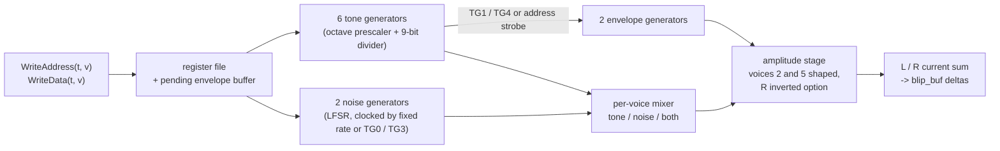

# SAA1099: technical design

| | |
|---|---|
| **Date** | 2026-10-03 |
| **Status** | SAA-0..3 built 2026-10-04 (not committed); §10 records what was built and where it deviates |
| **Decision** | [open-questions.md](open-questions.md) Q2: our own module, brought to full accuracy by co-simulation |
| **Users** | ZX-MultiSound ([requirements.md](requirements.md) R-MS-13); later any card or machine with an SAA1099 (SAM Coupe-style cards, the ZX-Evo / TS-Conf FPGA SAA cores if modeled) |
| **Effort scale** | S < 1 week, M 1-2 weeks, L 2-4 weeks |

## 1. Goal

A shared, deterministic emulation of the Philips SAA1099 six-voice sound generator that matches the consensus of
the reference implementations for every register combination real software uses, renders band-limited audio at any
host rate, and serializes its full state for TTD.

**Worked example.** Middle A on voice 0, left only, full volume:
```
reg #00 = #0F     amplitude voice 0: left 15, right 0
reg #08 = 227     frequency voice 0
reg #10 = #03     octave voice 0 = 3
reg #14 = #01     tone enable voice 0
reg #1C = #01     sound enable
```
Tone frequency, as documented for the chip at 8 MHz: `f = 15 625 * 2^octave / (511 - n)` Hz, so
15 625 * 8 / (511 - 227) = 125 000 / 284 = 440.1 Hz. (MAME writes the same rate as half-periods:
`(2 * clock / 512 << octave) / (511 - n)` toggles per second. The test pins the period every reference agrees on.)

## 2. Where it lives

| Piece | Location |
|---|---|
| Chip module | `core/src/emulator/sound/chips/saa1099/saa1099.{h,cpp}` (class `Saa1099`), shared like the AY and YM2203 engines |
| Tests | `core/tests/emulator/sound/chips/saa1099/saa1099_test.cpp`, `saa1099_golden_test.cpp` |
| Golden corpus | `tools/verification/saa1099/corpus/*.saa`, read by `saa1099_golden_test.cpp` |
| Co-simulation | `tools/verification/saa1099/` (§6) |

The existing placeholders are reused, not duplicated: `SUBMODULE_SOUND_SAA` (`core/src/emulator/platform.h`), the
`saa1099` config section name (`core/src/emulator/config.h`), the unused `saa1099fq` / `saa1099_vol` fields (removed or
wired, nothing left dangling), the "Future: SAA1099" note in `core/src/debugger/ttd/ttdserializable.h`.

## 3. The chip model

### 3.1 Registers (32 addresses, A0 selects address / data)

| Address | Content |
|---|---|
| `#00-#05` | amplitude voice 0-5: bits 0-3 left, 4-7 right |
| `#08-#0D` | tone frequency voice 0-5 (8 bits) |
| `#10-#12` | octave: low nibble voice 2n, high nibble voice 2n+1 (3 bits each) |
| `#14` | tone enable, bit per voice |
| `#15` | noise enable, bit per voice |
| `#16` | noise generator 0 (bits 0-1) and 1 (bits 4-5) clock: three fixed rates or tone generator 0 / 3 |
| `#18`, `#19` | envelope generator 0 (voices 0-2, shapes voice 2) and 1 (voices 3-5, shapes voice 5): enable, clock source (tone generator 1 / 4, or the address-write strobe), mode (8 shapes), 3-bit / 4-bit resolution, right channel inverted |
| `#1C` | bit 0 sound enable, bit 1 reset / sync all generators |

### 3.2 Structure



### 3.3 Behaviors that need to be pinned by the references

Each item gets a test that fails until our module agrees with the reference consensus (memory: consensus, not one
emulator). Known disagreement areas between emulators (the World of SAM accuracy discussion in §8):

1. Exact tone frequency formula and the octave / frequency latch timing (a new octave takes effect when the divider
   reloads, not at the write).
2. Output when tone and noise are both enabled on a voice (AND of the two, not a sum).
3. Amplitude quantization: the chip's DAC drops the least significant amplitude bit in some modes; the envelope
   multiplication (4-bit vs 3-bit resolution) and its rounding.
4. Envelope buffering: a write to `#18` / `#19` while the envelope runs takes effect only at the end of the current
   period (the "waiting for buffer" behavior), and the external clock mode clocks on an address write.
5. Noise LFSR polynomial, its seed after reset, and noise clocked from a tone generator.
6. `#1C` bit 1: which counters reset and whether the outputs are forced.
7. The DC level of a silent channel and of a channel with amplitude 0 but tone on (the chip's output stage).

## 4. Interface

```cpp
// core/src/emulator/sound/chips/saa1099/saa1099.h (sketch)
struct Saa1099Config
{
    uint32_t hostTickRate = 3500000;   // time axis of every call (the emulator passes its AudioTstate rate)
    uint32_t chipClockHz = 8000000;    // MultiSound: 32 MHz / 4; SAM Coupe: 8 MHz
    uint32_t outputRate = 44100;
};

class Saa1099 : public ttd::TTDSerializable
{
public:
    void Configure(const Saa1099Config& cfg);
    void Reset(uint64_t t);
    void SetClockEnabled(uint64_t t, bool enabled);   // MultiSound gates the chip clock (control byte bit 3)
    void WriteAddress(uint64_t t, uint8_t value);     // also the external envelope clock strobe
    void WriteData(uint64_t t, uint8_t value);
    void Run(uint64_t t);                              // advance the generators to t
    void EndFrame(uint64_t t, int16_t* stereo, size_t frames);  // band-limited output
    void SetOutputRate(uint32_t rate);                 // at a frame boundary, state kept
    void Describe(Saa1099Report& out) const;           // registers, generator phases, envelope states
    // TTD: fixed-size POD blob (registers, divider counters, LFSR, envelope state, clock-ratio accumulator phase)
};
```

- **Time.** The host axis is converted to chip clocks by an integer ratio accumulator (no floating drift); its phase
  is part of the state. The emulator passes `AudioTstate(z80->t)` (turbo removed), so the SAA, like the real card's,
  does not speed up with the CPU turbo.
- **Clock gate.** With the clock stopped (`SetClockEnabled(false)`) the counters freeze and the output holds its last
  level, exactly what stopping `SAA_CLK` does on the card.
- **Output.** Deltas into a `blip_buf` stereo pair on the chip clock axis, like the GS and Covox paths. Two render
  modes, as in libopl4: `HiFi` (band-limited, default) and `Authentic` (the pulse-density output of the real DAC
  before the board's filter, for comparison).
- **No allocation** after `Configure`; `Describe` is the single source for every automation surface.

## 5. TTD

`PeripheralId::Saa1099` = **48** (taken on the `multisound` branch; ids are append-only, the first branch to master
keeps the number). The blob is 149 bytes (layout in `saa1099.cpp`, documented in `ttd.ksy`). The blob is a fixed-size POD, layout version byte first. A
card that contains an SAA (the MultiSound) saves it inside its own blob set (integration TDD §4) so the card is
restored as one unit.

## 6. Co-simulation

| Reference | How it runs | Role |
|---|---|---|
| **SAASound** (Dave Hooper, SourceForge) | built from its source in `tools/verification/saa1099/refs/` (fetched by a pinned `fetch-refs.sh`, not committed) into a small driver | primary software reference |
| **MAME `saa1099.cpp`** | same, extracted with its minimal device shims | second software reference |
| **MiSTer `saa1099.sv`** | Verilator model driven by the same register stream at the chip clock | RTL reference; derives from Rodriguez Jodar's SAA1099.v and SAASound |
| **rejunity `tt06-psg-saa1099`** | not run: the repository holds no RTL (it is the Tiny Tapeout template; the design was never written) | its README carries **real-chip measurements** (the output-stage PDM patterns, the noise polynomial) and the Philips documentation; those decide where they speak |

The harness follows the libopl4 template (`tools/poc/015-opl4-synthesis/cosim/`):

1. **Stimulus corpus:** register-write streams with timestamps: hand-written edge cases (§3.3), random streams
   (seeded), and streams captured from real programs (SAM Coupe ETracker / Protracker tunes; VGMPLAY.WMF SAA
   tracks, VGM command `#BD`) via our port trace.
2. **Comparison at the generator level, not only audio:** each reference is instrumented to dump per-voice output
   bits, LFSR state and envelope level per chip clock. Mismatch reports the first diverging clock and generator.
3. **Audio level:** sample-exact comparison of the `Authentic` stream; for `HiFi` a spectral tolerance.
4. **Consensus table** in `tools/verification/saa1099/README.md`: per behavior (§3.3) what each reference does and
   which one we follow and why. Where the references disagree and no hardware capture decides, the RTL model of an
   independent implementation (`tt06`) was to break the tie; it has no RTL, so the Philips documentation and the
   real-chip measurements decide where they speak, and the primary software reference (SAASound) otherwise. Every
   choice is recorded.
5. **Golden digests** (FNV-1a of state and samples, like `soundchip_gs_golden_test.cpp`) freeze the agreed behavior in
   `core-tests`; the co-simulation tools themselves stay outside the test binary.

## 7. Tests (core-tests, under 50 ms each)

| Test | Checks |
|---|---|
| `Saa1099_Test.ToneFrequencyAllOctaves` | divider period for octave 0-7 and n = 0, 255, boundary values |
| `Saa1099_Test.OctaveLatchAtReload` | a new octave takes effect at the next divider reload |
| `Saa1099_Test.NoiseLfsrSequence` | the first 64 noise bits after reset for every noise clock source |
| `Saa1099_Test.ToneAndNoiseCombined` | the combined-output rule (§3.3 item 2) |
| `Saa1099_Test.EnvelopeShapesAndResolution` | all 8 shapes × 3/4-bit × inverted right channel |
| `Saa1099_Test.EnvelopeBufferedWrite` | a write mid-period applies at the period end |
| `Saa1099_Test.EnvelopeExternalClockOnAddressWrite` | address strobe clocks the envelope |
| `Saa1099_Test.SyncResetBit` | `#1C` bit 1 effect |
| `Saa1099_Test.ClockGateFreezes` | `SetClockEnabled(false)` freezes counters and holds output |
| `Saa1099_Test.OutputRateChangeKeepsState` | rate switch at a frame boundary |
| `Saa1099_Test.TtdRoundTrip` | save mid-tune, load into a fresh chip, identical output afterwards |
| `Saa1099_Test.EnvelopeAmplitudeFromPdm` | an envelope-shaped voice's level is the AND of the measured PDM patterns, sounding while the mixer output is low |
| `Saa1099_Test.AuthenticMeanMatchesHiFi` | the PDM bit stream's mean over a period pair equals the HiFi level |
| `Saa1099_Test.TimeAxisRatioIsExact` | host ticks to chip clocks without drift; a timestamp that does not advance does nothing |
| `Saa1099Golden_Test.*` | digests of the consensus corpus streams (26: every stream in HiFi, two in Authentic) |

## 8. Phases

| Phase | Content | Size |
|---|---|---|
| SAA-0 | References fetched and built, driver + stimulus corpus, consensus table draft | M |
| SAA-1 | `Saa1099` core (§3-4), unit tests §7 | M |
| SAA-2 | Co-simulation until the consensus corpus matches at the generator level; golden digests | M |
| SAA-3 | TTD blob, `Describe`, logger submodule wired | S |

## 9. Sources

- [SAASound](https://sourceforge.net/projects/saasound/) (Dave Hooper)
- [MiSTer SAM Coupe core, saa1099.sv](https://github.com/MiSTer-devel/SAM-Coupe_MiSTer/blob/master/rtl/saa1099.sv)
- [rejunity/tt06-psg-saa1099](https://github.com/rejunity/tt06-psg-saa1099)
- [World of SAM: accuracy of SAA1099 emulation in different emulators](https://www.worldofsam.org/forum/2018-08-09/1082)
- [VGMPF wiki: SAA1099](https://www.vgmpf.com/Wiki/index.php?title=SAA1099)

## 10. As built (2026-10-04)

**Files.** `core/src/emulator/sound/chips/saa1099/saa1099.{h,cpp}`; tests
`core/tests/emulator/sound/chips/saa1099/saa1099_test.cpp` (14 tests) and `saa1099_golden_test.cpp` (26 digests);
co-simulation `tools/verification/saa1099/` (fetch, drivers, corpus, compare, expectations, README with the full
consensus table). `PeripheralId::Saa1099` = 48 with its row in `ttdfileinfo.cpp`, `ttd.ksy` and the id contract
test. The unused `saa1099fq` / `saa1099_vol` fields are removed from `platform.h`; the `SUBMODULE_SOUND_SAA` logger
id is used (debug: configuration, writes to unused registers; warning: a refused TTD blob).

**Model.** Event-driven on the chip clock: each step runs to the nearest tone transition, fixed-rate noise shift
or (Authentic only) PDM slot. Host time converts through an integer ratio accumulator (remainder in the blob).
The output axis keeps running while the clock gate is stopped, so frames still produce samples (the held level).
Output: unipolar summed level 0..720 per side (units: PDM ones per 128 slots), `x 40` into blip_buf at the chip
clock. The level of a voice comes from the real-chip PDM patterns, so the HiFi mean and the Authentic bit stream
share one table. `Describe` reports registers, latched and pending numbers, counters, LFSRs, envelope state and
per-voice levels.

**Consensus (summary; full table in `tools/verification/saa1099/README.md`).**

| §3.3 item | Decision | Who agreed | Outvoted |
|---|---|---|---|
| 1 period, latch | `(511 - n) << (8 - oct)` clocks; tone and octave numbers act at the next transition | Philips, MAME, MiSTer | SAASound (a lone tone number waits one more transition) |
| 2 tone + noise | full when tone high and noise low, half when both high, 0 when tone low | all | - |
| 3 amplitude / envelope | PDM AND of the measured patterns (LSB of the amplitude dropped, 7/8); 3-bit mode steps by 2; voice sounds while the mixer output is low | real-chip PDM data, Philips, SAASound (table identical to the PDM AND), MiSTer (within 1 unit) | MAME |
| 4 envelope buffering, external clock | enable / resolution direct, the rest at points 3 / 4; address #18 / #19 clocks generator 0 / 1 | Philips, SAASound | MiSTer (single shapes play twice), MAME (immediate) |
| 5 noise | 18-bit x^18 + x^11 + 1, seed all ones; source 3 shifts on every edge of tone 0 / 3 | real chip, SAASound, MAME | MiSTer (17-bit) |
| 6 RST | Philips: restart with the numbers held at RST, hold, new numbers after the first half period; output 0 while held; envelopes untouched | Philips (+ SAASound for the output and the envelopes) | SAASound, MiSTer, MAME for the timing of numbers written during RST |
| 7 silence | 0 | all | - |

**Co-simulation result.** 24 streams x 3 references x 6 checks: 263 agree, 6 agree up to a documented SAASound
jitter point, 139 differ exactly where `expect.txt` cites a consensus-table row, 0 unexplained. Our tone timing
matches the MiSTer RTL to the clock on every stream except the RST case (row 9).

**Deviations from this TDD.**
- §4 `EndFrame`: frames the band-limited buffer cannot supply repeat the last sample instead of zero (no click on a
  one-sample shortfall); a reader that reads fewer frames than it renders has the surplus dropped beyond 256 samples.
- §5: a TTD load restarts the output frame with one step from silence to the restored level: blip_buf integrates
  steps and the chip's output is unipolar, so adopting the level without a step would leave a permanent offset.
  Original and restored outputs then agree to within the buffers' sub-sample phase (host state); two restores of
  one blob replay bit-exactly.
- §6: `tt06` has no RTL (see the table there); the tie-break falls to Philips and the measurements, then SAASound.
- §6 item 1: real-program captures (SAM Coupe trackers, VGM `#BD`) are not in the corpus yet; hand-written and
  seeded streams cover §3.3. Audio-level comparison against SAASound / the real-chip FLAC recordings is not
  automated (generator-level and summed-level comparison only).
- Row 8 of the consensus table (noise divider leaving source 3) has no consensus at all: we follow SAASound.

**Open.**
- Plug-in by the MultiSound integration (TTD inside the card's blob set, mixer row, automation surfaces through
  `Describe`, the `[SAA1099]` ini section if a card wants a configurable clock).
- Audio-level check against the real-chip recordings in `rejunity/tt06-psg-saa1099/real_chip_recordings/`.
- Captured real-program streams for the corpus.

