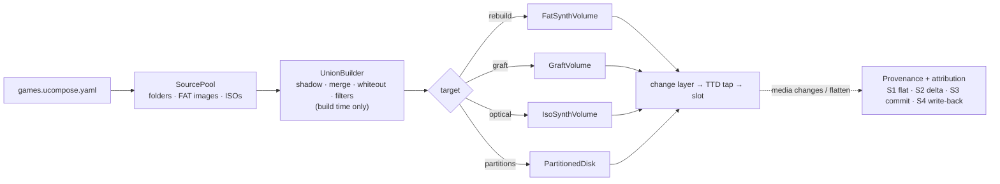

# Multi-source media for the media manager

Composite block and optical media built from several sources at once:

- host folders, FAT disk images and ISO images, layered overlayfs-style into one synthesized FAT16,
  FAT32 or ISO 9660 volume;
- a base disk image with folder layers grafted into its free space;
- several disks as partitions of one virtual disk.

Each guest write has a known destination, and the result can be flattened back into a single
image.

Extends the unified media manager ([2026-09-28-storage-manager](../2026-09-28-storage-manager/TODO.md), PLAN #58).

## Documents

| File | Topic |
|---|---|
| [goals-and-requirements.md](goals-and-requirements.md) | **Start here.** Problem, goals, non-goals, owner decisions, use cases, FR / NFR (performance, memory), acceptance |
| [architecture.md](architecture.md) | Component view, data model, build workflow, read / write / flatten sequences, threading, relation to media history H1-H5 (mermaid component, workflow and sequence diagrams); §12: map of every policy decision tree (DT-1…DT-16) |
| [fs-compatibility.md](fs-compatibility.md) | Can FAT16, FAT32 and ISO 9660 be mixed? Limits, source × target matrix, conversion rules, scenarios, guest support, verdict |
| [flatten-strategies.md](flatten-strategies.md) | Sector provenance, change attribution, and the strategies S1 flat image (mandatory), S2 session delta, S3 graft-base commit, S4 file write-back |
| [tdd.md](tdd.md) | Technical design: descriptor schema, classes and data structures, union and layout algorithms, graft, ISO writer, partitions, integration, memory budget, code placement, phases C0-C9 |
| [test-and-benchmark-plan.md](test-and-benchmark-plan.md) | Test-first order, oracles, every unit / acceptance test, benchmark families, mode comparison, scalability charts C1-C8, results table |
| [library-extraction/](library-extraction/README.md) | **Follow-up plan** (after C0-C9): extracting the whole media layer into the standalone MIT library unreal-media, one VFS for every guest file system, platform packs and plugins (incl. tape codecs), reference integrations into other emulators and platforms |

## In one picture

## Status

Design (2026-10-05): owner questions answered, no code. See [TODO.md](TODO.md).
