# Multi-source media: architecture

| | |
|---|---|
| **Date** | 2026-10-05 (design); reviewed against the code 2026-10-09 (round 1) |
| **Status** | Built and merged (C0-C11). This document describes the code as it is; where the design changed, the entry says what was designed, what was built, and links the phase document |
| **Requirements** | [goals-and-requirements.md](goals-and-requirements.md) |
| **Details** | [tdd.md](tdd.md) (classes, data structures, algorithms), [fs-compatibility.md](fs-compatibility.md), [flatten-strategies.md](flatten-strategies.md) |
| **As built** | [phases/](phases/README.md) (one document per phase, an "As built" section in each), [benchmarks/README.md](benchmarks/README.md) (NFR table), [TODO.md](TODO.md), the user guide [docs/features/media.md](../../features/media.md) |

## Review round 1 (2026-10-09)

**Status:** the architecture holds: resolve, union and synthesize at build time, one change layer at run time,
attribution and flatten on demand. Several designed classes were folded into others or never needed, and the
change layer, sparse media and write-back grew parts the design did not have. Not built: H1 versions (§10), the
C9 bulk read (dropped after measuring), the rescan disposition of DT-16 (§12.3, built 2026-10-09).

What changed in this document:

- §0, §2, §3: `IFileTreeSource` is not an interface: each source kind has a static `Enumerate` that fills a
  `FileTree`. `UnionTree` / `UnionNode` are `FileTree` / `TreeNode`. `NameEquivalence` is a key function of
  `UnionBuilder` (`FatKey`, `ExactKey`) plus `FatNameMapper`. `TargetValidator`, `ProvenanceMap`,
  `SectorPatchMap` and `FlattenPlanner` are not classes; the table says where each job went.
- §1: the block stack drawn as built. `MediaReadTap` sits on top of exactly one access layer (`ReadOnlyGuard`,
  `SessionWriteMap` or `HostWriteHold`). It is not a chain. Composites reach the factory through
  `MediaFormatRegistry::Open`.
- §2: added `FatImageExpander` (C4b), `GraftBuilder`, `FatBootPlan`, `IComposedLayout` / `SectorOwner` /
  `OffsetLayout`, `ListMediumChanges`, `SessionDelta`, `CommitJournal`, `WriteBack`, `HostTrash`, `BlockFormats`
  (S1, compact), `VhdDynamicImage`, `SessionWriteMap` with `IChangeView`, the session journal and its I/O pool,
  `SparseMemoryDisk` and `CompositeInfo::CompleteCounts`. Code locations corrected: `SourcePool` lives in
  `io/storage/compose/`, not `media/compose/`.
- §3: the data model as in `filetree.h`, including the C4b fields `unexpanded` and `baseCluster`. Names are strings
  per node, not a name pool.
- §4: the build workflow with the recovery hooks, the lazy graft base, the sidecars, the delta restore and the
  journal attach.
- §5, §6: the read and write sequences name real classes. Writes go to arenas and an optional journal. Attribution
  compares directory listings from before and after the writes, scoped by provenance.
- §7: flatten as built. S3 leaves the descriptor alone and rebases the slot on the base image. S4 keeps whiteouts
  and attributes in sidecar files and supports the host trash and partitioned disks.
- §9: threading as built: builds run on the caller's thread, journal I/O runs on a shared pool, lazy indexes and
  counts are built on first use.
- §10: H1 is still not built. `IChangeView` and the C10e journal are what exists today.
- §11: the existing-code table as built, with additions (C9 dropped, `ZeroRun`, dynamic VHD, sparse blank media,
  `[MEDIA]` session keys).
- §12: DT-16 as built (2026-10-09: the "unchanged" shortcut and the disposition). DT-15 as built (D-8 as changed).

## 0. Summary

A **composite medium** is built from a descriptor in three steps:

1. **Resolve.** Every layer's source is opened once. A source is a host folder, a FAT image (or one of its
   partitions) or an ISO image. ~~Each is seen through one interface, `IFileTreeSource`~~ **As built:** each kind has
   a static `Enumerate` (`HostFolderSource`, `FatImageSource`, `IsoImageSource`). `Enumerate` fills a `FileTree`
   whose files say where their bytes are: a host file, **extents** of an opened device, or zeros. The bytes are
   served by one `SourcePool` through `ExtentReader`.
2. **Union.** `UnionBuilder::Merge` merges the layers bottom-up into one `FileTree` (the design's `UnionTree`),
   using the target's name key (`FatKey` / `ExactKey`). Shadowing, whiteouts, opaque directories and filters are
   applied here, **once**. After this step there are no layers at read time, only a tree whose files point into
   sources. A graft reads its base lazily: only the base directories that the upper layers reach are listed
   ([C4b](phases/c4b-lazy-graft-base.md)).
3. **Synthesize.** A target builder lays the tree out:
   - `FatSynthVolume` builds a fresh FAT16 / FAT32 volume (rebuild).
   - `GraftVolume` builds the base FAT image plus a sorted table of patched sectors and runs of grafted clusters (graft).
   - `IsoSynthVolume` builds an ISO 9660 + Joliet volume, served as a CD by `IsoSynthVolume::MakeDisc` (a `CdImage`).
   - `PartitionedDisk` builds an MBR (and an EBR chain past four partitions) over child volumes.

   Each result is an `IBlockDevice` (or a CD frame source), so the existing block stack, slots,
   TTD tap and export code use it unchanged.

Guest writes land in the **single change layer** on top, which is `SessionWriteMap`. Since C10d / C10e it holds at
most `SessionMemoryLimit` (16 MiB) in 1 MiB arenas. The rest goes to a spill file, or to a recoverable journal
`<source>.usession` when the journal is on (it is off by default since 2026-10-07,
[c10e §9](phases/c10e-session-journal.md)). Writes are attributed to layers and files **only when asked**
(`media changes`, flatten), from the layout's provenance (`IComposedLayout::OwnerOf`) and a scoped re-read of the
volume before and after the writes. The read path has no per-layer cost and no copies.

## 1. Where it sits

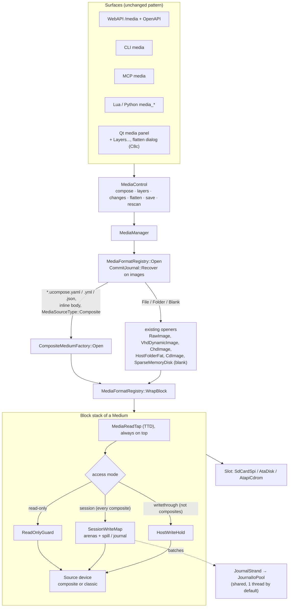

The slots, `MediaReadTap`, `HostWriteHold`, `ReadOnlyGuard` and `BlockFormats` keep their roles. A composite is
just another source device at the bottom of the stack. A composite always has session access: `writethrough` is
refused ([C2](phases/c2-composite-descriptor.md)).

The design drew `MediaChangeLayer (H1)` as the access layer. H1 is not built; `SessionWriteMap` is the change layer
(§10).

## 2. Component view

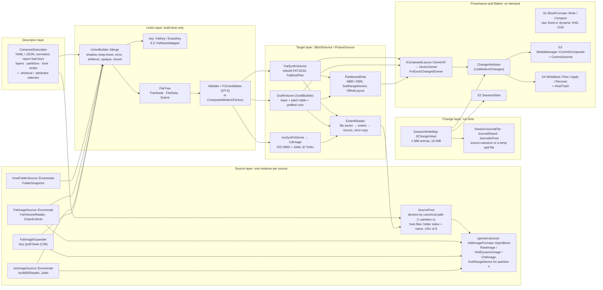

| Component | Responsibility | Lives |
|---|---|---|
| `ComposeDescriptor` | Parse and normalize the descriptor. Paths become absolute, defaults are filled in, unknown keys and bad values are report lines. `Normalized()` is the canonical JSON the content id hashes. Also holds partitions (C7), the `boot:` section (C5b), `writes`, and the sidecars `deleted` (`<descriptor>.whiteout`, C8b) and `attributes` (`<descriptor>.attributes`, C8d) | `core/src/emulator/media/composedescriptor.{h,cpp}` |
| `SourcePool` | Open each distinct source once, share it between layers and partitions, and own its lifetime. Devices are keyed by canonical path (`<key>#partition<n>` for an explicit partition). Host files are read through an LRU of 8 open streams. Since C11 a host file is a folder index plus a name, not a `std::filesystem::path` ([benchmarks §3](benchmarks/README.md)) | `core/src/emulator/io/storage/compose/sourcepool.h` (the design said `media/compose/`) |
| `HostFolderSource`, `FatImageSource`, `IsoImageSource` | A source as a tree of entries with metadata, and file data as `FileData` (host file, device extents, zero). **Designed** as implementations of an interface `IFileTreeSource` (`Root`, `ReadData`, `Identity`, `Describe`). **Built** as three static `Enumerate` functions into a `FileTree`. Reads go through `SourcePool` + `ExtentReader`, and identities are computed by the factory ([C1](phases/c1-core-and-parity.md), [C3](phases/c3-image-sources.md), [C5](phases/c5-iso.md)) | `core/src/emulator/io/storage/compose/` |
| `FatImageExpander` | C4b: reads a lazily enumerated FAT base one directory at a time (`Expand`, `ExpandPath` by FAT key, `ExpandAll` for the rebuild fallback, `Count` for deferred counts) | `.../storage/compose/fatimagesource.h` |
| `UnionBuilder`, `FileTree` | Merge the layers into one tree under the target's name key, and record the layer of every node. `UnionBuilder::MergeDir` refuses to merge into an unexpanded base directory (C4b guard) | `.../storage/compose/unionbuilder.h`, `filetree.h` |
| ~~`NameEquivalence`~~ | Not a class. The merge key is `UnionBuilder::FatKey` (FAT: case-insensitive, trailing dots and spaces ignored) or `ExactKey` (ISO with Joliet). 8.3 names come from `FatNameMapper::MapFolder`, ISO names from `IsoSynthVolume` | `.../storage/compose/unionbuilder.h`, `.../storage/hostfolder/`, `.../storage/cd/` |
| ~~`TargetValidator`~~ | Not a class: `Validate` (FR-20) and `FsCandidates` (DT-6) in `CompositeMediumFactory`, plus the size checks in `FatSynthVolume` and `GraftVolume` (`DoesNotFit`) ([C2](phases/c2-composite-descriptor.md)) | `core/src/emulator/media/compositemediumfactory.cpp` |
| `FatSynthVolume` | `HostFolderFat`'s layout engine, generalized to read file data from any source by extent. `HostFolderFat` is now a subclass that feeds it one `HostFolderSource` layer. `BuildToSize` handles fixed sizes; `FatBootPlan` carries boot structures (D-6, C5b). It implements `IComposedLayout` and `ZeroRun` | `.../storage/fat/fatsynthvolume.h`; `.../storage/hostfolder/hostfolderfat.h` |
| `GraftVolume` | A FAT image as the base, a sorted table of patched metadata sectors (`_patchLba` + `_patchData`; the design's `SectorPatchMap`), and runs of grafted clusters. Built by `GraftBuilder` (in the `.cpp`). Implements `IComposedLayout`, indexing base files and unread directories on the first `OwnerOf` that needs them (C4b). `PatchLbas` / `GraftedSectorRuns` give the S3 plan | `.../storage/compose/graftvolume.{h,cpp}` |
| `IsoSynthVolume` | An ISO 9660 Level 1/2 + Joliet layout over the union tree, with El Torito (C5b), given to `CdImage` as a `Cooked2048` frame source (`MakeDisc`) | `.../storage/cd/isosynthvolume.h` |
| `PartitionedDisk`, `SubRangeDevice` | MBR / EBR synthesis and LBA range routing to child devices. Patches hidden sectors into a child's BPB, and carries the MBR code of a source. Each `Part` carries its child's layout and offset for `media changes` | `.../storage/partitioneddisk.h`, `.../storage/subrangedevice.h` |
| `ExtentReader` | The shared hot path: a file's sector → extent (last hit, else binary search) → source read into the caller's buffer | `.../storage/compose/extentreader.h` |
| `IComposedLayout`, `SectorOwner`, `OffsetLayout`, `ForEachChangedOwner` | **Designed** as `ProvenanceMap`. **Built** as an interface on the volumes: `OwnerOf(lba)` gives the role, node, layer, `dirCluster`, offset, `patched`, and `unlisted` (C4b). It is answered from the run tables; nothing is stored per sector ([C6 §7](phases/c6-provenance-flatten.md)) | `.../storage/compose/composedlayout.h` |
| `ChangeAttributor` | What changed in which file, with the owner layer (DT-8). `ListMediumChanges` runs it per medium, and per FAT partition on a partitioned disk | `.../storage/compose/changeattributor.h`; `core/src/emulator/media/mediachanges.h` |
| ~~`FlattenPlanner`~~ | Not one class. DT-9 is in `MediaManager::SaveBlockMedium`, the S3 plan is in `MediaManager::CommitComposite`, and S4 routing (DT-10 to DT-12) is in `WriteBack::Plan` | `core/src/emulator/media/mediamanager.cpp`, `writeback.cpp` |
| `BlockFormats` | S1: `Write` (sparse raw, fixed VHD footer, CHD, all skipping known-zero runs) and `Compact` (the volume re-synthesized through `FatImageSource` → `FatSynthVolume::BuildToSize`) | `core/src/emulator/media/blockformats.h` |
| `VhdDynamicImage`, `vhd::` | C10b: dynamic VHD read, write and in-place growth; `vhd::Footer` / `Geometry` are shared with the fixed writer; `vhd::WriteDynamic` | `.../storage/vhdimage.h` |
| `SessionDelta` | S2: the `UNGDELTA` v1 file, streamed save and load (C6c, C10d) | `core/src/emulator/media/sessiondelta.h` |
| `CommitJournal` | S3 undo journal `<image>.ujournal`: written streamed from a generator of LBAs (C8d), recovered on the next open of the image | `.../storage/commitjournal.h` |
| `WriteBack` | S4: `Plan` (routing, deletes, conflict gate, per partition since C8d), `Apply` (staging, `<descriptor>.writeback` step list), `Recover` (finishes an interrupted apply on insert) | `core/src/emulator/media/writeback.h` |
| `HostTrash` | `onDelete: trash`: Recycle Bin, `~/.Trash`, freedesktop.org trash (C8d). A namespace, not a class | `core/src/common/hosttrash.h` |
| `SessionWriteMap` | The change layer: arenas in memory (default 16 MiB of 1 MiB arenas), a spill file or a journal on disk, `ZeroRun`, a content id kept up to date per write, `Tick` once a frame ([C10d](phases/c10d-session-spill.md), [C10e](phases/c10e-session-journal.md)) | `.../storage/sessionwritemap.h` |
| `IChangeView`, `MapChangeView`, `WindowChangeView` | The change layer as seen by attribution, delta, commit and in-place save (`NextChanged`, `ReadChanged`, `ForEachChange`), in place of the old `Changes()` map | `.../storage/changeview.h` |
| `SessionJournalFile`, `JournalStrand`, `JournalIoPool` | The journal or spill file (positional I/O), one strand of ordered batches per session, one pool per process (`[MEDIA] SessionIoThreads`, default 1) | `.../storage/sessionjournalio.h` |
| `SparseMemoryDisk` | A blank medium (`media create`, up to 128 GiB). It stores only written 64 KiB chunks in a two-level table (C10a, C10e) | `.../storage/sparsememorydisk.h` |
| `CompositeMediumFactory` | The glue to `MediaManager`. `Build` / `BuildPartitioned` / `Open` (stack, content id, report, DT-4, DT-13 delta restore, recovery hooks). `CompositeInfo` holds the facts and `CompleteCounts` (deferred counts of a lazy graft, C4b) | `core/src/emulator/media/compositemediumfactory.h` |

## 3. Data model

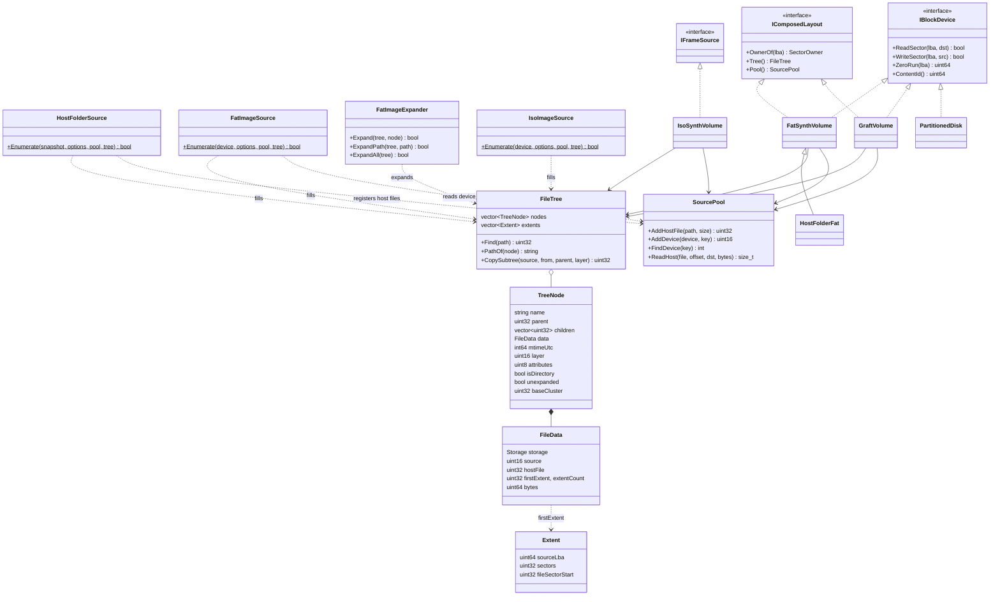

`IFrameSource` is `cd::IFrameSource` (`io/storage/cd/cdimage.h`). `IsoSynthVolume::MakeDisc` puts it under a
`CdImage`, which is the `IBlockDevice` the slot sees.

**Key points**

- The tree is **one vector of nodes** that refer to each other by index, plus one table of extents. **Designed:**
  flat arrays with names in one string pool (`UnionNode`, `NamePool`, `BuildReport`). **Built:** `TreeNode` keeps
  its `std::string name` and a `std::vector` of child indices, and the report is a separate list of strings.
  NFR-M2 is met anyway: 16.6 MiB at 100 K entries after the C11 change to `SourcePool`
  ([benchmarks §2](benchmarks/README.md)).
- `FileData` says where a file's bytes are:
  - `HostFile`: an index into the `SourcePool`'s host files, read through its LRU of open streams.
  - `DeviceExtents`: sector extents on a pool device (FAT clusters or ISO blocks, coalesced). An `Extent` is 16 bytes.
  - `Zero`: a sparse or empty file.
- Every node keeps the **layer** it came from (the first layer, for a merged directory). Provenance at attribution
  time needs no other record.
- C4b: a directory of a lazily read graft base is `unexpanded`, with its first cluster in `baseCluster`. It has no
  children in the tree until `FatImageExpander` reads it. `GraftVolume::OwnerOf` reports sectors under such
  directories as `SectorOwner::unlisted` (layer 0, `dirCluster` and offset known, no node).

## 4. Build workflow

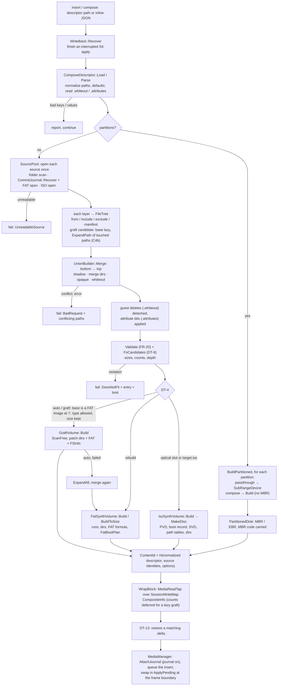

Everything up to `Q` runs **on the calling thread, off the emulation thread**: the manager opens media on the
thread that asks (`mediamanager.h`). The folder scans and image opens can take a long time on network folders.
They support `cancelRequested` / `onProgress` (`CompositeBuildOptions`) as `FolderSnapshot` does (BUGS.md #3).
Only the swap happens on the emulation thread, at the frame boundary, as before.

As built, and not in the original drawing:

- **Recovery hooks.** `CommitJournal::Recover` runs before an image opens: an image layer, a passthrough partition,
  or an image inserted on its own through `MediaFormatRegistry::Open`. `WriteBack::Recover` runs before the
  descriptor is read ([C8](phases/c8-commit-writeback.md)).
- **Lazy base (C4b).** Only for a graft candidate whose base layer has no `include` / `exclude`. A fallback to a
  rebuild reads the whole base and merges again ([C4b §7](phases/c4b-lazy-graft-base.md)).
- **Delta and journal.** The DT-13 delta restore runs in `CompositeMediumFactory::Open`. The session journal is
  attached by `MediaManager::AttachJournal` after the open, and only when the journal is on (§9).

## 5. Read path

### 5.1 Rebuild volume (FAT target)

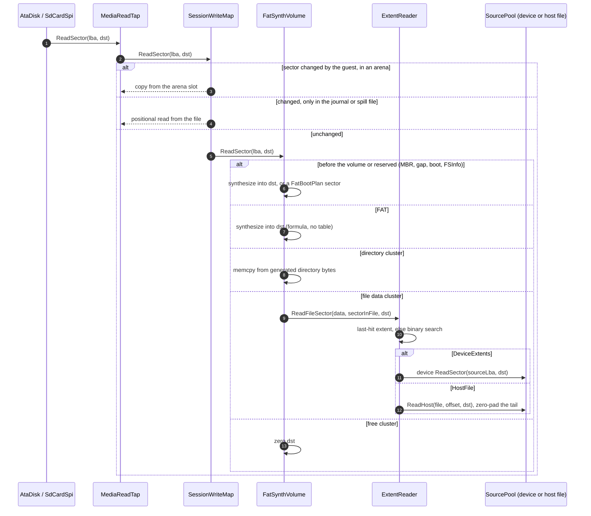

There is exactly **one copy**, from the source into `dst`, which is the read itself. The union, the
layers and the name mapping cost nothing here; they were resolved at build time. NFR-P3 (no allocation per read) is
checked by `ComposeReadAllocations_Test` ([benchmarks §2](benchmarks/README.md)).

Known-zero runs (C10a): exports and the CHD writer ask `ZeroRun(lba)` down the same stack instead of reading free
space. The tap does not see those sectors, because nothing was read.

### 5.2 Graft volume

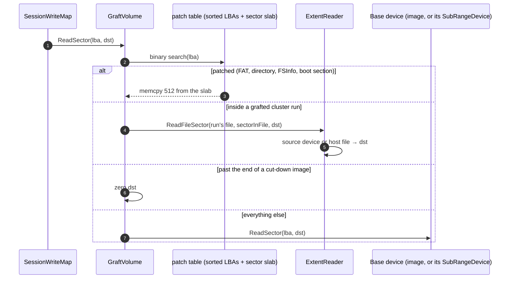

The patch table is a sorted vector of LBAs plus a slab of 512-byte sectors (`_patchLba`, `_patchData`: built once,
read only). The design called it `SectorPatchMap`, but no class of that name exists. Grafted runs are a sorted vector
with a last-hit run. Both are binary-searched; the base needs no lookup at all.

### 5.3 ISO target

`IsoSynthVolume` is a `cd::IFrameSource`. `IsoSynthVolume::MakeDisc` puts it under a `CdImage` as one Mode 1 track
with `StoredFormat::Cooked2048`, so `CdImage` serves READ (10), READ CD, TOC and the 512-byte `IBlockDevice` view
exactly as for an `.iso` file. A 2048-byte block of file data maps to four 512-byte sectors of a FAT source or a
host file, or to one 2048-byte block of an ISO source. Either way the bytes land directly in the caller's buffer.
An El Torito image is either the extent of a union file or a separate extent placed after the files (C5b).

### 5.4 Partitioned disk

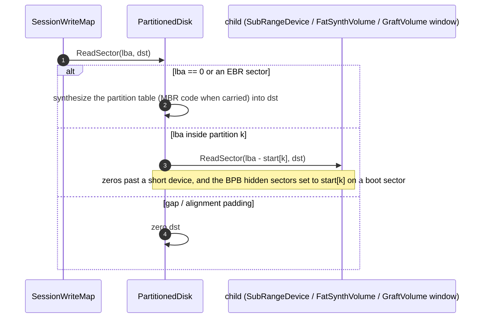

A graft over an image partition is a `GraftVolume` in the image's coordinates. Its partition is a `SubRangeDevice`
window from `VolumeStart()`, and its layout is offset by `OffsetLayout` ([C7 §7](phases/c7-partitions.md)).

## 6. Write path and provenance

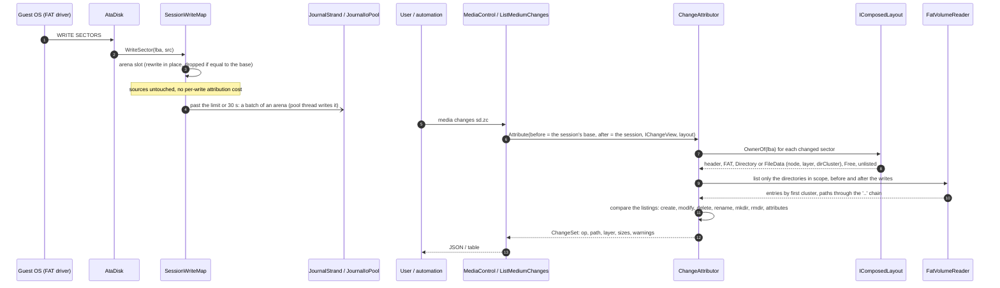

Attribution is **pull-based**. The guest's write path is one arena write; the journal I/O is posted to the pool and
collected at the next write or tick ([C10e §8](phases/c10e-session-journal.md)). The cost of attribution moves to the
moment someone asks (NFR-P9: 12 / 84 ms at 10 K / 100 K entries).

Changed from the design ([C6 §7](phases/c6-provenance-flatten.md)): the attributor does not diff the union tree (T0)
against a full re-read (T1). It lists only the directories the changed sectors name, before and after the writes.
The owner layer of each entry is the `OwnerOf` of its first cluster before the writes. A medium without a layout
(not a composite, or a composite rebased onto a file) gets a full scan with no layers.

## 7. Flatten workflow

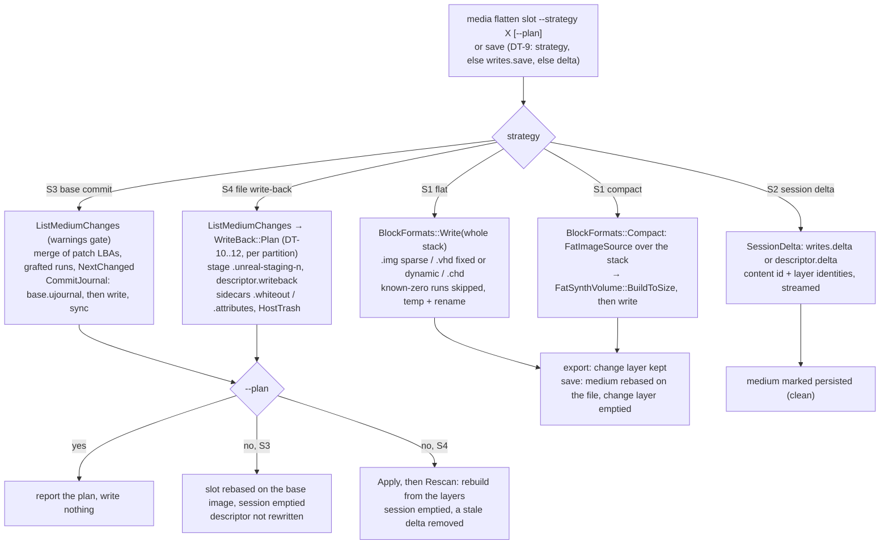

The strategies, their trade-offs and the routing table are in
[flatten-strategies.md](flatten-strategies.md). Differences as built:

- **S3** ([C8 §2, §5](phases/c8-commit-writeback.md)): the descriptor is never rewritten. The slot is rebased on the
  base image instead. A partitioned disk is not committed; a CHD base is refused. Since C8d the sectors are streamed
  in LBA order, with no list in memory ([C8d §6](phases/c8d-writeback-tails.md)).
- **S4** ([C8 §6](phases/c8-commit-writeback.md), [C8d §6](phases/c8d-writeback-tails.md)): whiteouts go to
  `<descriptor>.whiteout` and attribute bits to `<descriptor>.attributes`, never into the YAML. `onDelete: trash` uses
  `HostTrash`. If a trash move fails, the apply stops part way and is retried on the next insert. The plan does not
  probe the trash. Partitioned disks are written back per composed partition.
- **S1**: `vhd: dynamic` writes a dynamic VHD (C10b).
- **Any save, discard, commit or write-back** empties the session, which also deletes its journal (C10e).

## 8. Insert sequence (end to end)

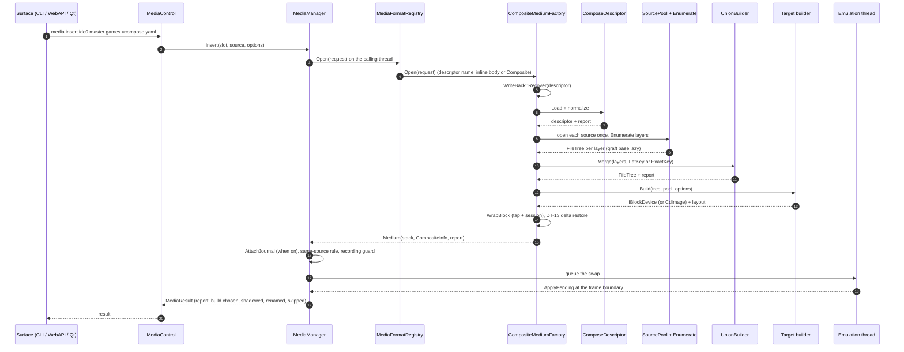

## 9. Threading, lifetime, identity

| Topic | Rule |
|---|---|
| Build | On the calling thread, never the emulation thread. Cancellable, with progress (`CompositeBuildOptions::cancelRequested` / `onProgress`), as the folder pipeline is. |
| Read / write | Emulation thread only, as for every block device. The composite is immutable after the build except for state that is per instance and needs no locks: the host-file LRU, the last-hit caches, and the indexes built on first use (`GraftVolume`'s base-file and unread-directory indexes, C4b). |
| Session journal I/O | `SessionWriteMap` posts batches to its `JournalStrand`. `JournalIoPool` (one per process, shared by every emulator instance; `[MEDIA] SessionIoThreads`, default 1 since 2026-10-07) writes them and runs `fsync`. The emulation thread collects finished batches at the next write or at `Tick` (once a frame, from `ApplyPending`). It waits for the disk only when more than half the limit is in flight. A write to an arena in flight goes to a new slot. Opening the file happens on the emulation thread, once per session ([C10e §8](phases/c10e-session-journal.md)). |
| Source lifetime | The volume (`FatSynthVolume`, `GraftVolume`, `IsoSynthVolume`) holds `shared_ptr`s to the `FileTree` and the `SourcePool`. The medium owns the volume, so ejecting it destroys the pool and closes every file. |
| Attribution / flatten | Run with the machine parked (`media changes` parks it while the volume is read) or paused (a save refuses while the emulator runs). The design's "frozen copy of the change map" (H1 versions) is not built. |
| Deferred work | `CompositeInfo::CompleteCounts` lists the unread base directories of a lazy graft at the first `layers` reply. `GraftVolume::OwnerOf` indexes them at the first query that lands there (C4b). |
| `ContentId` | An FNV-1a hash of the normalized descriptor, each source's identity (`FolderSnapshot` identity, image `ContentId` ⊕ partition, code page) and the build options. Equal ids mean byte-identical media, so a persisted delta (S2) or a snapshot reference is valid. A session's own id is the base's id mixed with an XOR of one hash per changed sector, kept up to date on every write (C10d). |
| TTD | Unchanged: `MediaReadTap` above the composite records and replays reads; guest writes are barriers as before. S3 reads its plan through the session layer, not the tap, so time travel does not record those reads. |

## 10. Relationship to the media history (H1-H5)

**Designed:** the composite needs only a sparse map of changed sectors and a `Changes()` iterator. When H1 replaces
`SessionWriteMap` with `MediaChangeLayer` (versions, spill to disk), attribution becomes versioned for free
(`media changes --at v3`), and the S2 delta becomes the H1 spill file. Nothing in this design blocks H1 or depends
on it.

**As built (2026-10-09):** H1-H5 are not started ([storage-manager TODO](../2026-09-28-storage-manager/TODO.md)).
`mediahistory.h` reports `hasVersions = false`. There is no `MediaChangeLayer` and no `--at`. Some of H1's ground is
covered by this work:

- **Spill** is built inside `SessionWriteMap`: arenas, a temp spill file, and the optional journal
  `<source>.usession`, replayed after a crash of the emulator ([C10d](phases/c10d-session-spill.md),
  [C10e](phases/c10e-session-journal.md)). These are recovery, not versions.
- **`Changes()` is gone.** The seam is `IChangeView` (`NextChanged`, `ReadChanged`, `ForEachChange`), used by
  attribution, the delta, the commit and the in-place save. A versioned layer can implement the same interface.
- **The S2 delta** (`UNGDELTA` v1) holds one unversioned piece. H1 may reuse the format as its spill file
  ([C6 §8](phases/c6-provenance-flatten.md)).

## 11. What changes in existing code

| Code | Designed change | As built |
|---|---|---|
| `HostFolderFat` | Layout engine moved into `FatSynthVolume`; `HostFolderFat::Build` becomes "one `HostFolderSource` layer → union → `FatSynthVolume`", byte-identical (parity test) | Done (C1). `HostFolderFat` is a subclass of `FatSynthVolume`; parity is held by `HostFolderFatParity_Test`. One deliberate exception: the label entry carries the folder's time ([C4 §8](phases/c4-graft.md)) |
| `FatVolumeReader` | `ChainExtents`, `ScanFree`, per-directory cluster list | Done: `ChainExtents`, `ChainClusters`, `ScanFree`, `ListDirectory`, `ReadRawDirectory`, `FindPartition`, `FsInfoSector`, `VolumeSectors`, `DosToUnix` / `UnixToDos`, a two-sector FAT window cache |
| `FolderSnapshot` | - | The root carries its folder's time (owner decision 2026-10-05) |
| `MediaSourceType` | New value `Composite`; `formatHint` `"compose"` | `Composite` done, with `MediaSource::inlineBody`. No `"compose"` format hint: a descriptor is recognized by its name (`*.ucompose.yaml` / `.yml` / `.json`), an inline body, or the type |
| `MediaManager` / `MediaControl` | Dispatch to `CompositeMediumFactory`; verbs `compose`, `layers`, `changes`, `flatten` | Done, through `MediaFormatRegistry::Open`. Added: `SaveBlockMedium` (DT-9), `SaveDelta`, `CommitComposite`, `WriteBackComposite`, `AttachJournal`, the `journal` insert option, and session `Tick` in `ApplyPending` |
| `MediaFormatRegistry` | - | Recognizes descriptors; runs `CommitJournal::Recover` before opening an image |
| `BlockFormats` | Fixed VHD writer | Done (C6a), plus sparse raw export, `Compact`, dynamic VHD output (`vhd: dynamic`, C10b), and skipping of known-zero runs |
| `HddImageFormats` | - | Opens dynamic VHDs (`VhdDynamicImage`); refuses differencing VHDs |
| `IBlockDevice` | Optional, phase C9: `ReadSectors(lba, count, dst)`, A/B gated (NFR-P7) | **Not built:** C9 was dropped after measuring (14x cheaper at the device, about 2 % of a guest's per-sector cost; [C9](phases/c9-bulk-read.md)). **Added instead:** `ZeroRun(lba)`, with a default of 0 (C10a) |
| `SessionWriteMap` | Unchanged (the composite needs a sparse map) | Rewritten: arenas, spill / journal, `IChangeView` in place of `Changes()`, `[MEDIA] SessionMemoryLimit` / `SessionArenaKiB` / `SessionFlushSeconds` / `SessionSyncSeconds` / `SessionJournal` / `SessionIoThreads` / `SpillFolder` (C10d, C10e) |
| `media create` | - | Uses `SparseMemoryDisk` instead of `MemoryDisk`; the size cap is 128 GiB |
| IDE slot descriptors | - | Sprinter and Profi IDE disks have `fsCompatibility = {Fat16}` (C2, C7) |
| Qt | A media panel with layers and changes views | `MediaPanelWindow`: a Layers... button and the flatten dialog (`unreal-qt/src/media/flattendialog`, choices in `media/core/flattenchoice`). The owner's check on macOS / Windows is pending ([TODO.md](TODO.md)) |
| Nothing else | Slots, peripherals, TTD tap, model switch, config parsing for other keys | Holds, apart from the rows above |

## 12. Decision trees

Every policy of this design is a decision tree, drawn next to the rules it implements. This
section maps when each one runs and adds the two that belong to the medium's life cycle.

### 12.1 Which tree runs when

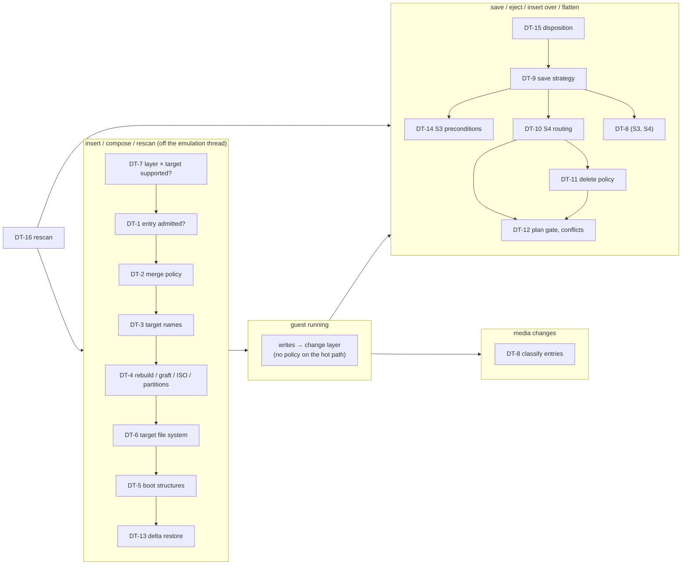

| Tree | Policy | Where |
|---|---|---|
| DT-1 | entry admission: from, service files, links, include / exclude, manifest, limits | [tdd.md](tdd.md) §3.2 |
| DT-2 | merge: whiteout, opaque, shadow / keep-lower / error, directory merge | [tdd.md](tdd.md) §3.2 |
| DT-3 | target names: LFN / 8.3, ISO / Joliet, `onBadName` | [tdd.md](tdd.md) §3.3 |
| DT-4 | build strategy: partitions, ISO, graft or rebuild, `auto` fallbacks | [tdd.md](tdd.md) §6.3; as built: [C4 §2](phases/c4-graft.md), lazy base [C4b](phases/c4b-lazy-graft-base.md) |
| DT-5 | boot structures: boot layer, bottom source, relocation (D-6) | [tdd.md](tdd.md) §5; as built: [C5 §10](phases/c5-iso.md) |
| DT-6 | target file system: slot `fsCompatibility` / `defaultFs`, `auto` | [fs-compatibility.md](fs-compatibility.md) §6 |
| DT-7 | which source may feed which target | [fs-compatibility.md](fs-compatibility.md) §3 |
| DT-8 | change attribution: create / modify / delete / rename / attributes | [flatten-strategies.md](flatten-strategies.md) §2; as built: [C6 §7](phases/c6-provenance-flatten.md) |
| DT-9 | save strategy: GUI dialog, automation policy, eject rule (D-7, D-8) | [flatten-strategies.md](flatten-strategies.md) §3; as built: [C6 §8](phases/c6-provenance-flatten.md) |
| DT-10 | S4 routing per operation | [flatten-strategies.md](flatten-strategies.md) §3 S4; as built: [C8 §6](phases/c8-commit-writeback.md) |
| DT-11 | delete policy `onDelete` (D-4) | [flatten-strategies.md](flatten-strategies.md) §3 S4; `trash`: [C8d §6](phases/c8d-writeback-tails.md) |
| DT-12 | S4 plan gate: inconsistent guest FS, host names, conflicts | [flatten-strategies.md](flatten-strategies.md) §3 S4 |
| DT-13 | S2 delta on insert | [flatten-strategies.md](flatten-strategies.md) §3 S2 |
| DT-14 | S3 preconditions and journal recovery | [flatten-strategies.md](flatten-strategies.md) §3 S3; as built: [C8 §5](phases/c8-commit-writeback.md) |
| DT-15 | eject / insert-over disposition of a composite | below |
| DT-16 | rescan with pending changes | below |

### 12.2 DT-15: a composite leaves its slot (eject, insert over it, model switch that drops it)

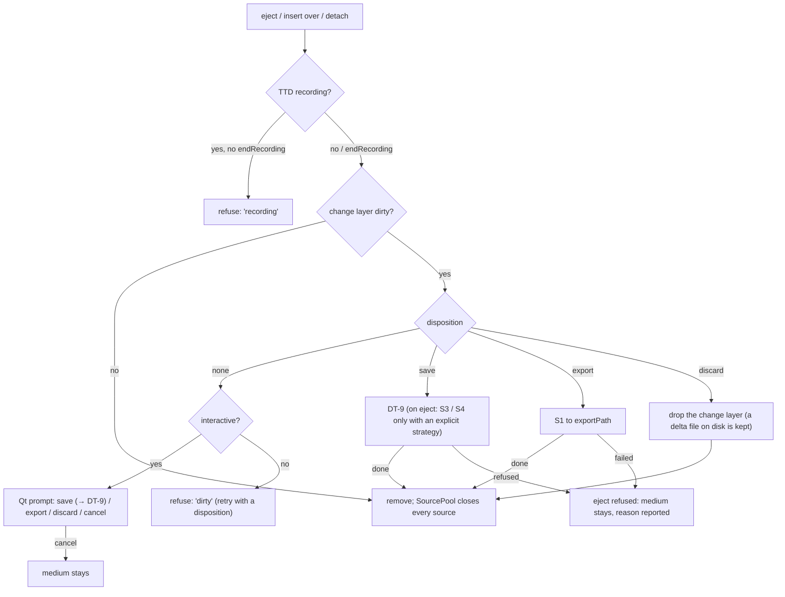

A model switch (M5) keeps a composite whose slot exists on the new model, changes included. When
the slot does not exist there, the switch applies DT-15 with the switch's own disposition.

As built (`MediaManager::ApplyDisposition`, `SaveBlockMedium`): as drawn, with D-8 as changed 2026-10-09. A save
follows the eject's `strategy`, else `writes.save` (S3 / S4 included; `discard` drops the writes, `ask` saves S2). A
strategy that fails keeps the writes as S2 with a report line, unless the eject says `strict`. The Qt prompt opens
the flatten dialog for a composite (C8c). An eject or swap always deletes the medium's session journal. The manager
going away first saves every dirty composite by its policy (`SaveByPolicyOnRelease`); a medium still dirty after
that keeps its journal ([C10e §7](phases/c10e-session-journal.md)).

### 12.3 DT-16: rescan (FR-54)

Designed:

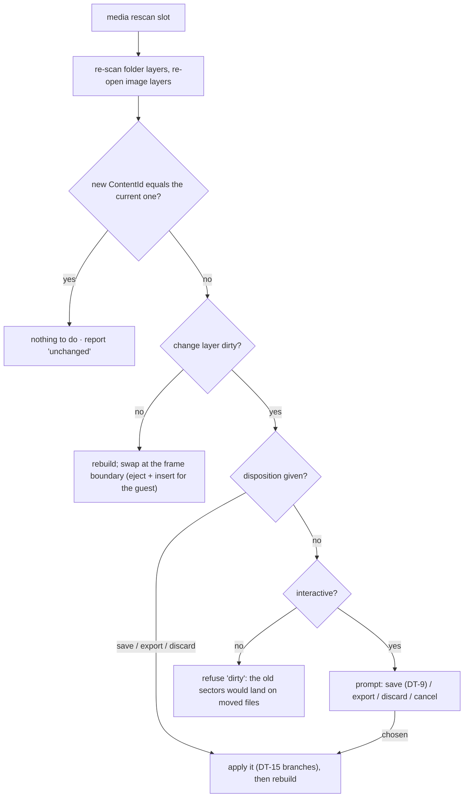

As built (`MediaManager::Rescan`, 2026-10-09): as drawn, without the interactive prompt (the Qt panel's rescan
gets the "dirty" reply). The sources are built again and compared by the content id of the volume without the
session (`SessionWriteMap::Base().ContentId()`): the same id leaves the medium, writes and all, and reports
"unchanged". Otherwise a dirty medium needs `save` (DT-9 with the D-8 fallback; after a save the sources are built
once more, as a commit or write-back changed them), `export <path>` or `discard`, then the new volume is swapped in
at the frame boundary. A delta saved there is kept on disk but not applied to the rebuilt volume (DT-13 mismatch).

Changes cannot be carried across a rebuild with a different `ContentId`: every cluster may have
moved. Only S3 / S4 (which turn changes into source content first) or S1 (a copy) keep them.
