# Multi-source media: architecture

| | |
|---|---|
| **Date** | 2026-10-05 |
| **Status** | Draft for review |
| **Requirements** | [goals-and-requirements.md](goals-and-requirements.md) |
| **Details** | [tdd.md](tdd.md) (classes, data structures, algorithms), [fs-compatibility.md](fs-compatibility.md), [flatten-strategies.md](flatten-strategies.md) |

## 0. Summary

A **composite medium** is built from a descriptor in three steps:

1. **Resolve.** Every layer's source is opened once. Each source is a host folder, a FAT image
   partition or an ISO image, and each is seen through one interface, `IFileTreeSource`, as a tree
   of entries whose data is a list of **extents** in that source.
2. **Union.** The layers are merged bottom-up into one `UnionTree`, under the target file system's
   name rules. Shadowing, whiteouts and filters are applied here, **once**. After this step there
   are no layers at read time, only a tree whose files point into sources.
3. **Synthesize.** A target builder lays the tree out:
   - `FatSynthVolume` builds a fresh FAT16 / FAT32 volume (rebuild).
   - `GraftVolume` builds the base FAT image plus a sparse patch (graft).
   - `IsoSynthVolume` builds an ISO 9660 + Joliet volume.
   - `PartitionedDisk` builds an MBR over child volumes.

   Each result is an `IBlockDevice` (or a CD frame source), so the existing block stack, slots,
   TTD tap and export code use it unchanged.

Guest writes land in the **single change layer** on top, which is `SessionWriteMap` today. They are
attributed to layers and files **only when asked** (`media changes`, flatten), from the layout's
provenance and a re-read of the merged volume. The read path has no per-layer cost and no copies.

## 1. Where it sits

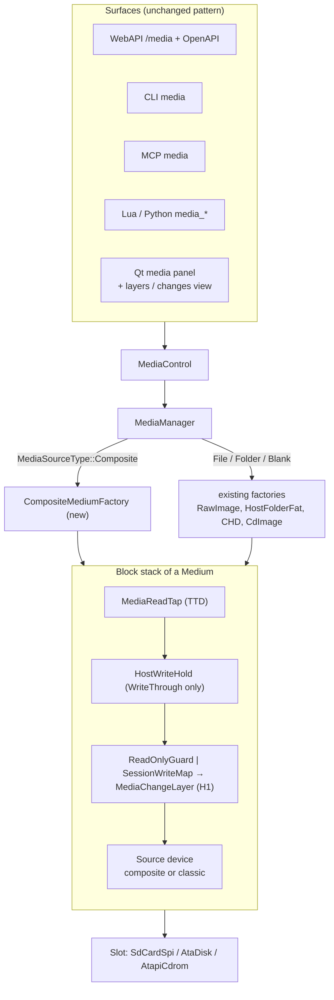

The slots, `MediaReadTap`, `HostWriteHold`, the access layers and `BlockFormats` are unchanged. A
composite is just another source device at the bottom of the stack.

## 2. Component view

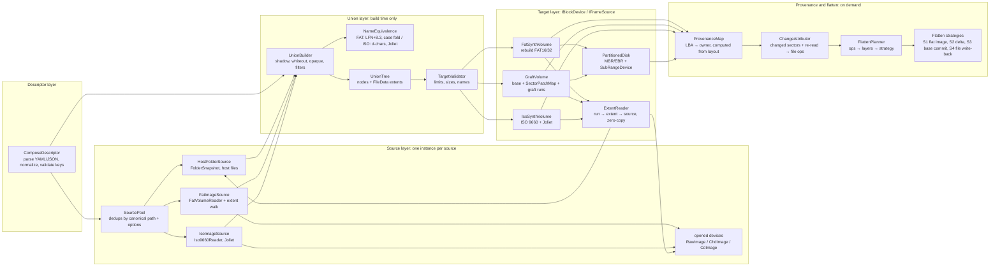

| Component | Responsibility | Lives |
|---|---|---|
| `ComposeDescriptor` | Parse and normalize the descriptor. Paths are made absolute; defaults are filled in; unknown keys are reported. | `core/src/emulator/media/compose/` |
| `SourcePool` | Open each distinct source once, share it between layers and partitions, and own its lifetime. | same |
| `IFileTreeSource` + 3 implementations | A source as a tree of entries with metadata, and file data as extents. | `core/src/emulator/io/storage/compose/` |
| `UnionBuilder`, `UnionTree` | Merge the layers into one tree under the target's name equivalence, and record the provenance of every node. | same |
| `TargetValidator` | Check the union against the target's limits before any layout work. | same |
| `FatSynthVolume` | `HostFolderFat`'s layout engine, generalized to read file data from any source by extent. `HostFolderFat` becomes a thin wrapper. | `.../storage/fat/` |
| `GraftVolume` | A FAT image as the base, a sparse map of patched metadata sectors, and runs of grafted clusters. | `.../storage/compose/` |
| `IsoSynthVolume` | An ISO 9660 Level 1/2 + Joliet layout over the union tree, given to `CdImage` as a cooked 2048 frame source. | `.../storage/cd/` |
| `PartitionedDisk`, `SubRangeDevice` | MBR / EBR synthesis and LBA range routing to child devices. | `.../storage/` |
| `ExtentReader` | The shared hot path: target run → file extent → source read into the caller's buffer. | `.../storage/compose/` |
| `ProvenanceMap`, `ChangeAttributor`, `FlattenPlanner` | Who owns a sector, what changed in which file, and where each change should go. | `.../storage/compose/` |
| `CompositeMediumFactory` | The glue to `MediaManager`: build the stack, content id, report, and save / flatten dispatch. | `core/src/emulator/media/` |

## 3. Data model

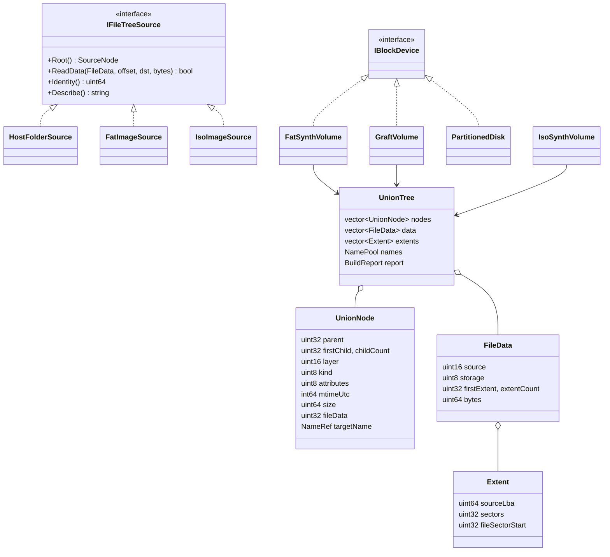

**Key points**

- The tree is **flat arrays** (structure of indices, no per-node heap objects). Names live in one
  string pool. That gives the memory bound NFR-M2 and cache-friendly build passes.
- `FileData` says where a file's bytes are:
  - `HostFile`: a host path, read with the shared LRU of open streams.
  - `DeviceExtents`: sector extents on an opened device (FAT clusters or ISO blocks, coalesced).
  - `Zero`: a sparse or empty file.
- Every node keeps the **layer** it came from. Provenance at flatten time needs no other record.

## 4. Build workflow

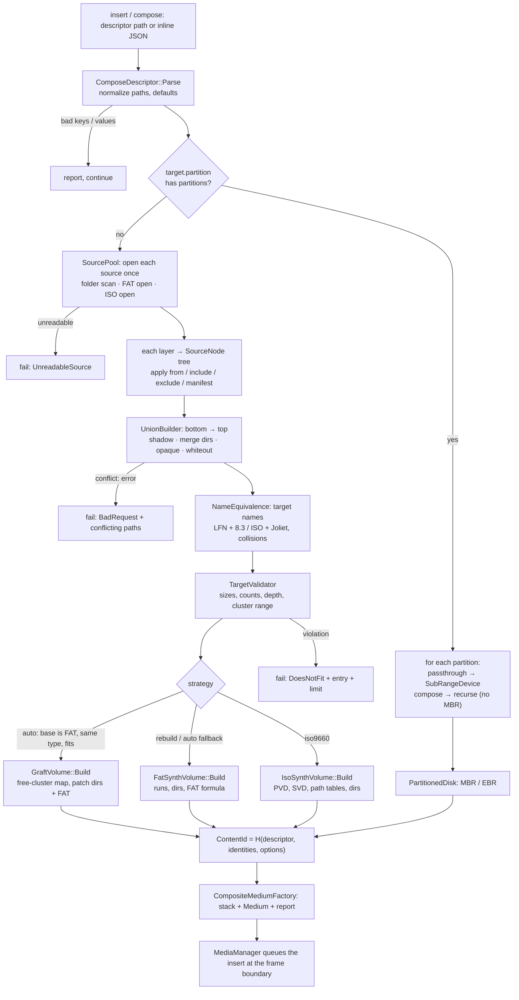

Everything up to `O` runs **off the emulation thread**. The folder scans and image opens can take a
long time on network folders. They support `cancelRequested` / `onProgress` as `FolderSnapshot`
does (BUGS.md #3). Only the final swap happens on the emulation thread at the frame boundary, as
today.

## 5. Read path

### 5.1 Rebuild volume (FAT target)

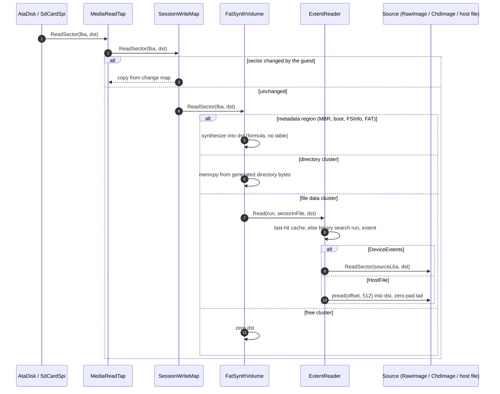

There is exactly **one copy**, from the source into `dst`, which is the read itself. The union, the
layers and the name mapping cost nothing here; they were resolved at build time.

### 5.2 Graft volume

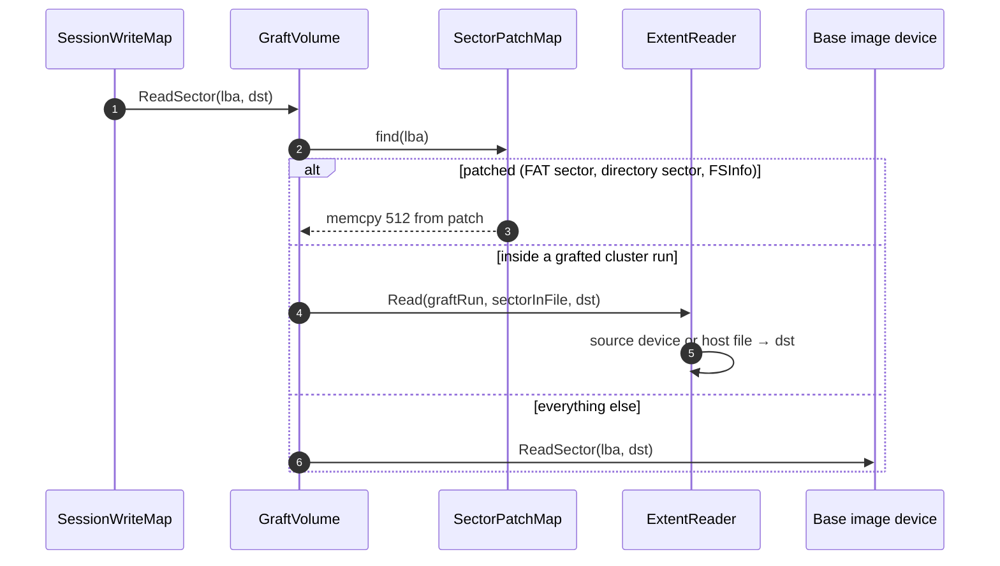

The patch map is a sorted vector of LBAs plus a slab of 512-byte sectors (built once, read only).
Grafted runs are a sorted vector. Both are binary-searched; the base needs no lookup at all.

### 5.3 ISO target

`IsoSynthVolume` is a `cd::IFrameSource` with `StoredFormat::Cooked2048`, so `CdImage` serves READ
(10), READ CD, TOC and the 512-byte `IBlockDevice` view exactly as for an `.iso` file. A 2048-byte
block of file data maps to four 512-byte source sectors (FAT or host file), or to one 2048-byte
block of an ISO source. Either way the bytes land directly in the caller's buffer.

### 5.4 Partitioned disk

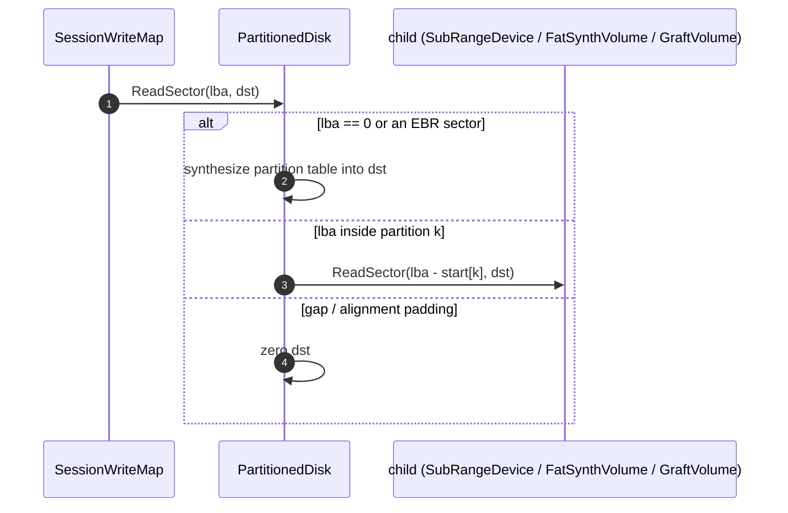

## 6. Write path and provenance

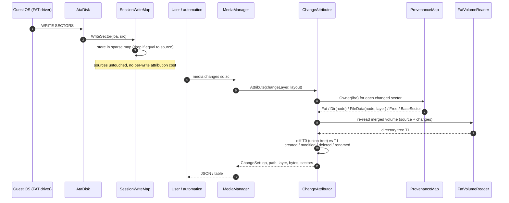

Attribution is **pull-based**. The guest write path stays as it is today: one sparse-map insert.
The cost moves to the moment someone asks (NFR-P9).

## 7. Flatten workflow

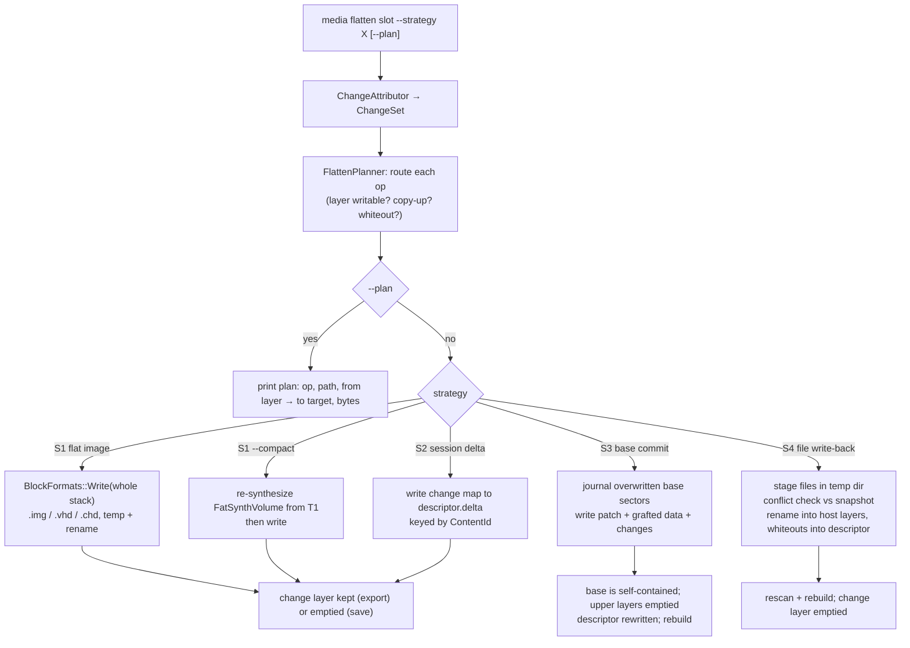

The strategies, their trade-offs and the routing table are in
[flatten-strategies.md](flatten-strategies.md).

## 8. Insert sequence (end to end)

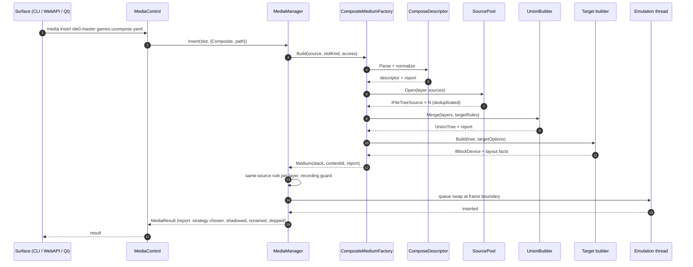

## 9. Threading, lifetime, identity

| Topic | Rule |
|---|---|
| Build | Off the emulation thread, cancellable, with progress (as the folder pipeline). |
| Read / write | Emulation thread only, as every block device today. The composite is immutable after the build except for the host-file LRU and the last-hit caches, which are per instance and need no locks. |
| Source lifetime | `SourcePool` holds `shared_ptr`s. The medium owns the pool. Eject destroys it and closes every file. |
| Attribution / flatten | Runs with the emulation paused (as `BlockFormats::Save` requires today) or on a frozen copy of the change map (H1 versions make that cheap). |
| `ContentId` | Hash of the normalized descriptor, each source's identity (`FolderSnapshot::Identity`, image `ContentId`) and the build options. Equal ids mean byte-identical media, so a persisted delta (S2) or a snapshot reference is valid. |
| TTD | Unchanged: `MediaReadTap` above the composite records and replays reads; guest writes are barriers as today. |

## 10. Relationship to the media history (H1-H5)

The composite needs only what `SessionWriteMap` has today: a sparse map of changed sectors and a
`Changes()` iterator. When H1 replaces it with `MediaChangeLayer` (versions, spill to disk), the
composite gains versioned attribution for free: `media changes --at v3`. The persisted delta (S2)
becomes the H1 spill file. Nothing in this design blocks H1 or depends on it.

## 11. What changes in existing code

| Code | Change |
|---|---|
| `HostFolderFat` | Layout engine moved into `FatSynthVolume`. `HostFolderFat::Build` becomes "one `HostFolderSource` layer → union → `FatSynthVolume`", with byte-identical output (parity test over the existing test corpus). |
| `FatVolumeReader` | New: enumerate a file's cluster chain as coalesced extents (`ChainExtents`). New: free-cluster bitmap (`ScanFree`). New: per-directory cluster list (graft patching). Read-only, no behavior change for current callers. |
| `MediaSourceType` | New value `Composite`. `formatHint` `"compose"`. |
| `MediaManager` / `MediaControl` | Dispatch to `CompositeMediumFactory`; new verbs `compose`, `layers`, `changes`, `flatten`. |
| `BlockFormats` | New writer: fixed VHD (`.vhd`): raw data + a 512-byte `conectix` footer with CHS geometry. |
| `IBlockDevice` | Optional, phase C9: `ReadSectors(lba, count, dst)` with a default loop, overridden by `RawImage` and the composite for bulk reads. A/B gated (NFR-P7). |
| Nothing else | Slots, peripherals, TTD tap, model switch, config parsing for other keys. |

## 12. Decision trees

Every policy of this design is a decision tree, drawn next to the rules it implements. This
section maps when each one runs and adds the two that belong to the medium's life cycle.

### 12.1 Which tree runs when

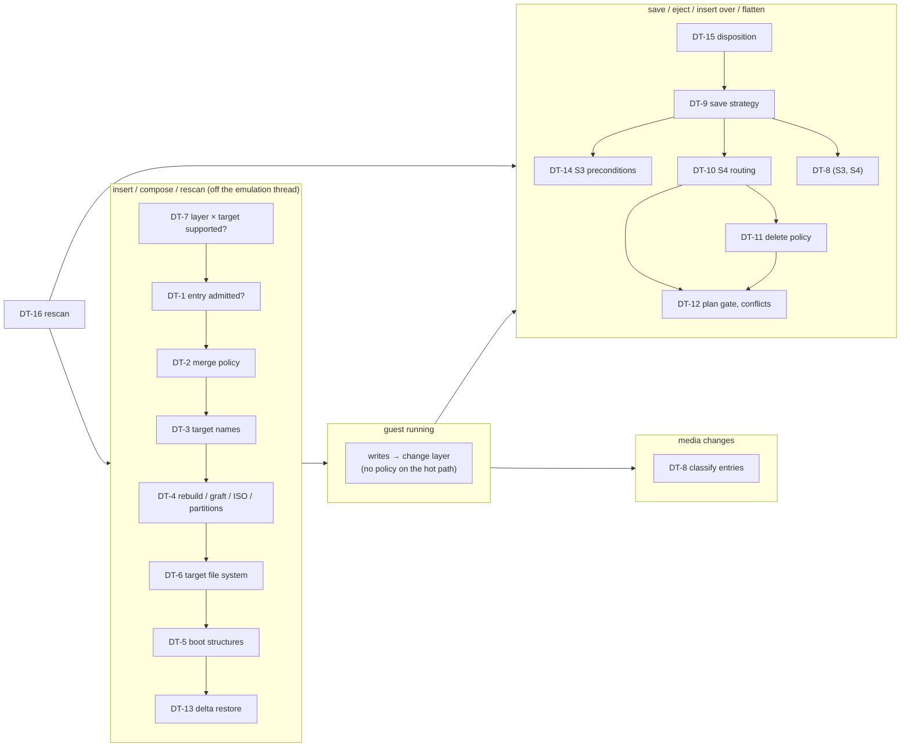

| Tree | Policy | Where |
|---|---|---|
| DT-1 | entry admission: from, service files, links, include / exclude, manifest, limits | [tdd.md](tdd.md) §3.2 |
| DT-2 | merge: whiteout, opaque, shadow / keep-lower / error, directory merge | [tdd.md](tdd.md) §3.2 |
| DT-3 | target names: LFN / 8.3, ISO / Joliet, `onBadName` | [tdd.md](tdd.md) §3.3 |
| DT-4 | build strategy: partitions, ISO, graft or rebuild, `auto` fallbacks | [tdd.md](tdd.md) §6.3 |
| DT-5 | boot structures: boot layer, bottom source, relocation (D-6) | [tdd.md](tdd.md) §5 |
| DT-6 | target file system: slot `fsCompatibility` / `defaultFs`, `auto` | [fs-compatibility.md](fs-compatibility.md) §6 |
| DT-7 | which source may feed which target | [fs-compatibility.md](fs-compatibility.md) §3 |
| DT-8 | change attribution: create / modify / delete / rename / attributes | [flatten-strategies.md](flatten-strategies.md) §2 |
| DT-9 | save strategy: GUI dialog, automation policy, eject rule (D-7, D-8) | [flatten-strategies.md](flatten-strategies.md) §3 |
| DT-10 | S4 routing per operation | [flatten-strategies.md](flatten-strategies.md) §3 S4 |
| DT-11 | delete policy `onDelete` (D-4) | [flatten-strategies.md](flatten-strategies.md) §3 S4 |
| DT-12 | S4 plan gate: inconsistent guest FS, host names, conflicts | [flatten-strategies.md](flatten-strategies.md) §3 S4 |
| DT-13 | S2 delta on insert | [flatten-strategies.md](flatten-strategies.md) §3 S2 |
| DT-14 | S3 preconditions and journal recovery | [flatten-strategies.md](flatten-strategies.md) §3 S3 |
| DT-15 | eject / insert-over disposition of a composite | below |
| DT-16 | rescan with pending changes | below |

### 12.2 DT-15: a composite leaves its slot (eject, insert over it, model switch that drops it)

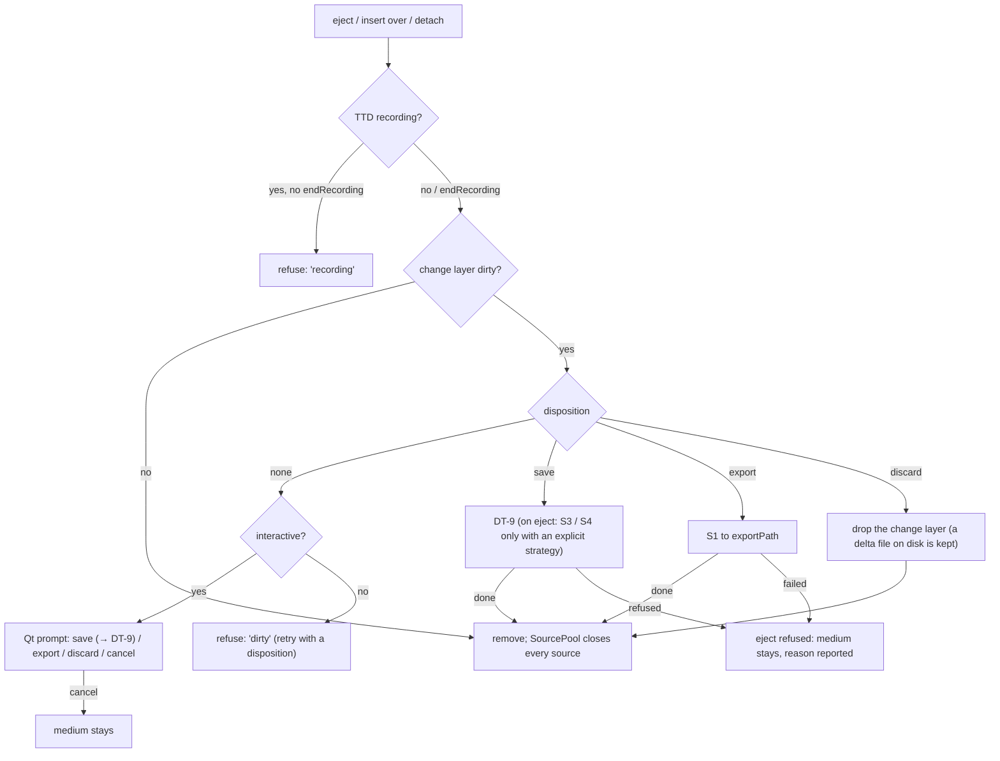

A model switch (M5) keeps a composite whose slot exists on the new model, changes included. When
the slot does not exist there, the switch applies DT-15 with the switch's own disposition.

### 12.3 DT-16: rescan (FR-54)

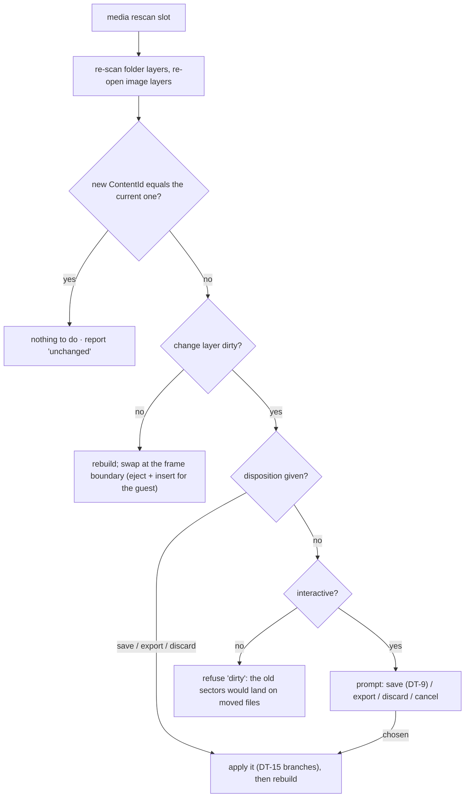

Changes cannot be carried across a rebuild with a different `ContentId`: every cluster may have
moved. Only S3 / S4 (which turn changes into source content first) or S1 (a copy) keep them.
