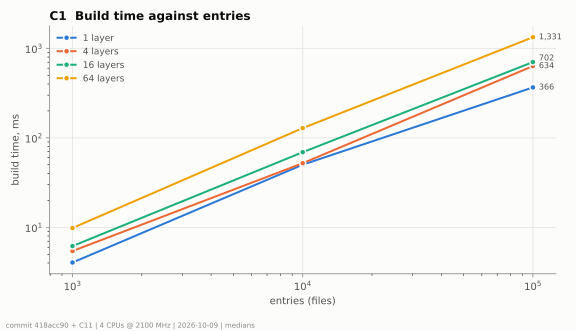
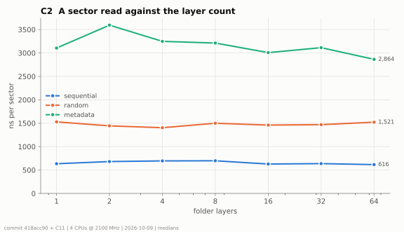
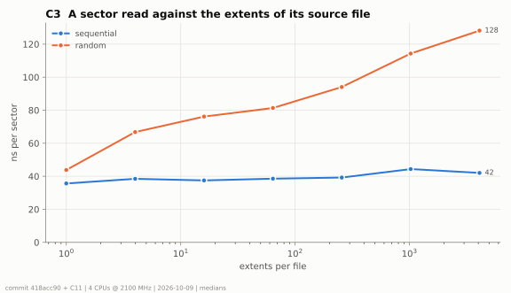
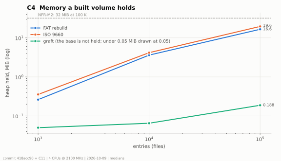
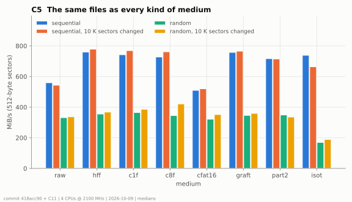
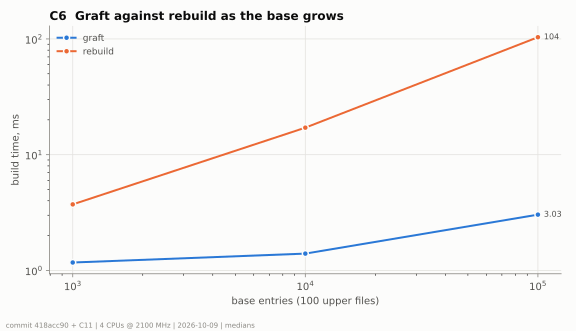
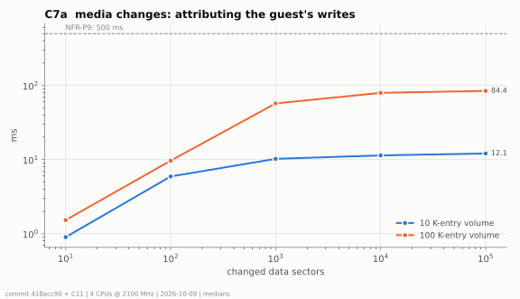
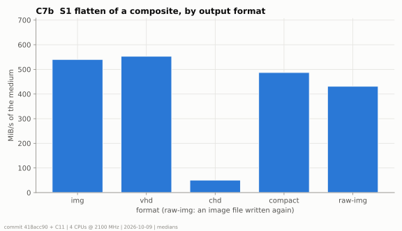
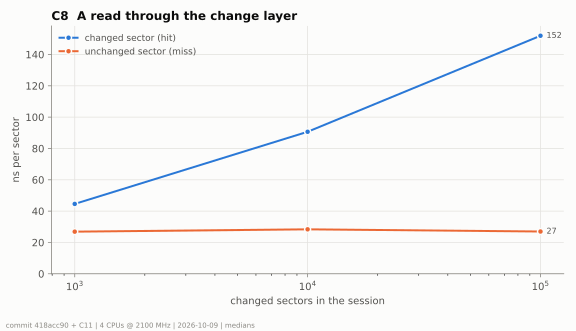

# Multi-source media: benchmarks C1-C8

**Status:** measured 2026-10-09 on master `418acc90` plus the changes of this round (§3); closes the benchmark
row of [TODO.md](../TODO.md) and fills [test-and-benchmark-plan.md](../test-and-benchmark-plan.md) §5.5.

Host: the Linux cloud container (4 CPUs at 2.1 GHz, gcc 13, the agent build's flags: `-O3`, no build type). Medians of
3 repetitions (`--benchmark_repetitions=3`); the build families run 3 iterations each. The raw run is
[run-2026-10-09.json](run-2026-10-09.json) (medians and spread only, machine paths removed).

## 1. How to run

```bash
cmake -S . -B cmake-build-agent-release -G Ninja -DBENCHMARKS=ON   # once
tools/build/build.sh core-benchmarks
./cmake-build-agent-release/bin/core-benchmarks \
    --benchmark_filter='^Compose(ScaleBuild|ScaleBuildIso|LayersRead|Fragmented|Mode|GraftVsRebuild|Attribute|Flatten|SessionRead)/' \
    --benchmark_repetitions=3 --benchmark_report_aggregates_only=true \
    --benchmark_out=scratch/bench/media-compose/run.json --benchmark_out_format=json
python3 tools/bench/plot-media-compose.py scratch/bench/media-compose/run.json --out scratch/bench/media-compose/ \
    [--ab-base 'scratch/bench/ab/base-*.json' --ab-cur 'scratch/bench/ab/cur-*.json']
```

The families are in `core/benchmarks/emulator/io/compose_benchmark.cpp` (one per chart, described at its top). The
script needs matplotlib and writes the SVG / PNG charts and `results.md` (the tables below). The whole run takes
about 15 minutes, most of it making the fixtures (up to 100 000 files per tree).

## 2. NFR table

| NFR | Target | Measured | Chart |
|---|---|---|---|
| NFR-P1 parity data / metadata (c1f against hff) | <= 1.10x / <= 1.05x | 1.03x sequential, 0.98x random / 0.94x | C5 |
| NFR-P2 64 layers against 1 | <= 1.15x | 1.00x (the worst of sequential, random, metadata) | C2 |
| NFR-P3 allocations per read | 0 | 0 (`ComposeReadAllocations_Test`: folder and image rebuild, graft, partitions, ISO, each with and without a session) | - |
| NFR-P5 build 100 K entries | <= 1.5 s | 366 ms (1 layer), 634 ms (4 layers), 702 ms (16 layers), 1331 ms (64 layers) | C1 |
| NFR-P6 graft independent of base | flat | 1.17 / 1.40 / 3.03 ms at 1 K / 10 K / 100 K base entries | C6 |
| NFR-P7 non-composite media | no change (noise band) | inside the noise band on 11 benchmarks (RawImage, CHD, Z-Controller SD) | A/B table |
| NFR-P8 flatten img | >= 80% of a raw copy | 125% | C7b |
| NFR-P9 attribution 10 K / 100 K | <= 500 ms | 12 / 84 ms (the most changed sectors) | C7a |
| NFR-M2 memory 100 K entries | <= 32 MiB | 16.6 MiB (rebuild, heap the volume holds) | C4 |

Notes:
- **NFR-P1** compares the one-folder composite (`c1f`) with `HostFolderFat` (`hff`) in the same binary; the A/B of
  `HostFolderFat` itself before and after the refactor is in [phases/c1-core-and-parity.md](../phases/c1-core-and-parity.md).
- **NFR-P5** includes the folder scan (the requirement excludes it): the numbers are an upper bound.
- **NFR-P6**: the graft grows with the free-cluster scan of the base's FAT (one bit per cluster), as the requirement
  allows; 1 K to 100 K base entries is 2.6x while the rebuild is 28x.
- **NFR-P7**: six interleaved runs (base, measured, base, ...) of each binary, 5 repetitions each; "spread" is the
  larger of the two sides' max / min. The base is `37171597`, master before the media work, built in a worktree with
  the same flags (and the gcc 13 `slotconfig.cpp` fix the branch made, so that it builds). `RawImage::ReadSector`,
  the CHD reader and the Z-Controller SPI path are unchanged in the code; this container's run-to-run spread is wide
  (up to 29 %), so the A/B is worth repeating on the quiet macOS host.
- **NFR-M2**: the heap the built volume holds (glibc `mallinfo2`, after the build's temporaries are returned). 64 folder
  layers of the same 100 K entries hold 42 MiB: every layer brings its own 1 000 folders (64 000 in all).

## 3. What this round changed to meet them

The first run missed two targets: NFR-M2 (100 K entries held 47.6 MiB) and NFR-P5 at 64 layers (1.8 s).

| Change | Where | Effect |
|---|---|---|
| A host file is kept as its folder's index plus its name; folders are kept as strings (a `std::filesystem::path` holds its parsed components: a few hundred bytes per file) | `SourcePool` | 100 K entries: 47.6 -> 17.4 MiB; 64 layers: 69 -> 42 MiB |
| `UnionBuilder::FatKey` upper-cases ASCII names in place (no UTF-32 round trip) | `unionbuilder.cpp` | the key was a third of a 64-layer build |
| The merge keeps each node's key once (every layer used to recompute the keys of every directory it merges into) | `unionbuilder.cpp` | 64 layers, 100 K entries: 1.8 -> 1.33 s |
| The boot sector's label is made once, at build (it allocated on every read of the boot sector) | `FatSynthVolume` | found by the new NFR-P3 test: one allocation per pass over a rebuilt volume, now none |

## 4. Charts

### C1 build time against entries and layers



| entries | 1 layer, ms | 4 layers, ms | 16 layers, ms | 64 layers, ms |
|---|---|---|---|---|
| 1,000 | 4.1 | 5.4 | 6.2 | 9.8 |
| 10,000 | 50.2 | 52.1 | 69.1 | 128.5 |
| 100,000 | 366.0 | 633.9 | 702.5 | 1330.9 |

### C2 a sector read against the layer count

Layers are resolved at build: a read is the same at 1 and at 64 layers.



| layers | sequential, ns | random, ns | metadata, ns |
|---|---|---|---|
| 1 | 634 | 1529 | 3105 |
| 2 | 681 | 1443 | 3594 |
| 4 | 695 | 1404 | 3248 |
| 8 | 698 | 1499 | 3212 |
| 16 | 628 | 1460 | 3008 |
| 32 | 637 | 1469 | 3113 |
| 64 | 616 | 1521 | 2864 |

### C3 a sector read against the extents of its source file

Sequential reads stay on the last-hit extent; random reads search the file's extents (O(log k)).



| extents | sequential, ns | random, ns |
|---|---|---|
| 1 | 36 | 44 |
| 4 | 38 | 67 |
| 16 | 37 | 76 |
| 64 | 39 | 81 |
| 256 | 39 | 94 |
| 1024 | 44 | 114 |
| 4096 | 42 | 128 |

### C4 memory a built volume holds



| entries | rebuild, MiB | ISO, MiB | graft, MiB |
|---|---|---|---|
| 1,000 | 0.3 | 0.4 | 0.0 |
| 10,000 | 3.6 | 4.2 | 0.1 |
| 100,000 | 16.6 | 19.6 | 0.2 |

### C5 the same files as every kind of medium

`raw` is the FAT16 image file read through `RawImage` (a clear, a seek and a read of the stream per sector, and a
memset first); `isot` is an ISO 9660 target read as 512-byte sectors (its random
reads cross 2 KiB blocks). "10 K sectors changed": a session over the medium with 10 000 sectors written elsewhere.



| mode | seq, ns | random, ns | metadata, ns | seq + session, ns | random + session, ns |
|---|---|---|---|---|---|
| raw | 880 | 1487 | 862 | 906 | 1457 |
| hff | 653 | 1379 | 3250 | 642 | 1352 |
| c1f | 675 | 1357 | 3058 | 643 | 1289 |
| c8f | 676 | 1422 | 3016 | 642 | 1163 |
| cfat16 | 964 | 1530 | 2999 | 957 | 1422 |
| graft | 650 | 1436 | 580 | 661 | 1372 |
| part2 | 695 | 1401 | 1577 | 703 | 1460 |
| isot | 667 | 2914 | 30 | 743 | 2669 |

### C6 graft against rebuild as the base grows



| base entries | graft, ms | rebuild, ms |
|---|---|---|
| 1,000 | 1.17 | 3.72 |
| 10,000 | 1.40 | 17.12 |
| 100,000 | 3.03 | 103.53 |

### C7 `media changes` and S1 flatten





| changed sectors | 10 K entries, ms | 100 K entries, ms |
|---|---|---|
| 10 | 0.9 | 1.5 |
| 100 | 5.9 | 9.6 |
| 1,000 | 10.2 | 57.2 |
| 10,000 | 11.4 | 79.4 |
| 100,000 | 12.1 | 84.4 |

| format | MiB/s | ms per flatten |
|---|---|---|
| img | 540 | 80 |
| vhd | 553 | 71 |
| chd | 51 | 603 |
| compact | 487 | 82 |
| raw-img | 431 | 88 |

`raw-img` writes the same composite's exported image again through `RawImage`: the composite is the faster source.

### C8 a read through the change layer



| changed sectors | hit, ns | miss, ns |
|---|---|---|
| 0 | - | 24 |
| 1,000 | 45 | 27 |
| 10,000 | 91 | 28 |
| 100,000 | 152 | 27 |

## 5. NFR-P7 A/B

| benchmark | before, ns | after, ns | change | run-to-run spread |
|---|---|---|---|---|
| `BM_SectorRead_RawImage` | 678 | 730 | +7.6 % | ±8.5 % |
| `BM_SectorRead_ChdUncompressed` | 37 | 38 | +3.9 % | ±9.4 % |
| `BM_SectorRead_ChdDefaultCodecs` | 39 | 37 | -3.9 % | ±10.4 % |
| `BM_HunkDecode/none` | 705 | 712 | +0.9 % | ±18.1 % |
| `BM_HunkDecode/zlib` | 33084 | 32407 | -2.0 % | ±15.1 % |
| `BM_HunkDecode/lzma` | 96659 | 99936 | +3.4 % | ±6.3 % |
| `BM_HunkDecode/huff` | 51859 | 52566 | +1.4 % | ±5.5 % |
| `BM_HunkDecode/flac` | 66053 | 67352 | +2.0 % | ±8.9 % |
| `BM_HunkDecode/zstd` | 21365 | 21299 | -0.3 % | ±8.2 % |
| `BM_ZControllerSpi_SdSectorRead` | 1327 | 1504 | +13.3 % | ±29.2 % |
| `BM_ZControllerSpi_ConfigToggle` | 19 | 19 | -2.8 % | ±10.9 % |

## 6. Not measured, and why

| Plan item | Why not |
|---|---|
| `BM_ComposeBuild` at 1 M entries | a million host files per tree is beyond this container's fixture budget; 1 K - 100 K shows the slope |
| `cchd` mode (a composite over a CHD source) | the CHD reader is measured on its own (`chdimage_benchmark`); a CHD source reads through the same extents as `cfat16` |
| 10 repetitions (plan §5.1) | 3, to keep the run near 15 minutes; the spread is in the raw JSON (`_cv` rows) |
| `BM_Flatten` of a 256 MiB composite | the data set's composite (about 43 MiB with its free space); throughput, not size, is the measure |
