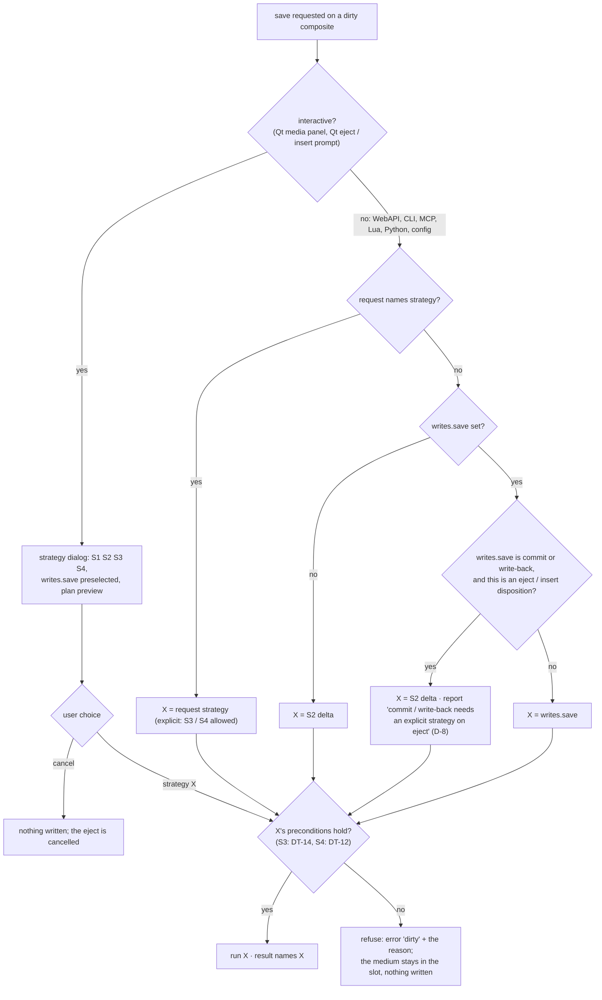
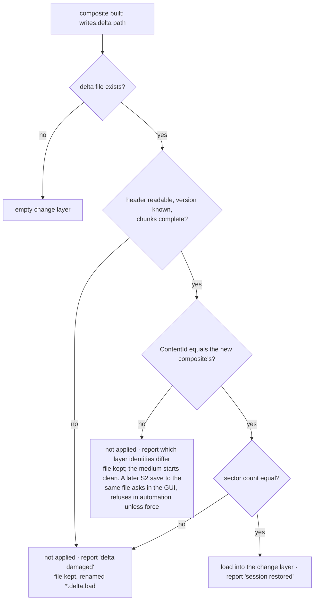
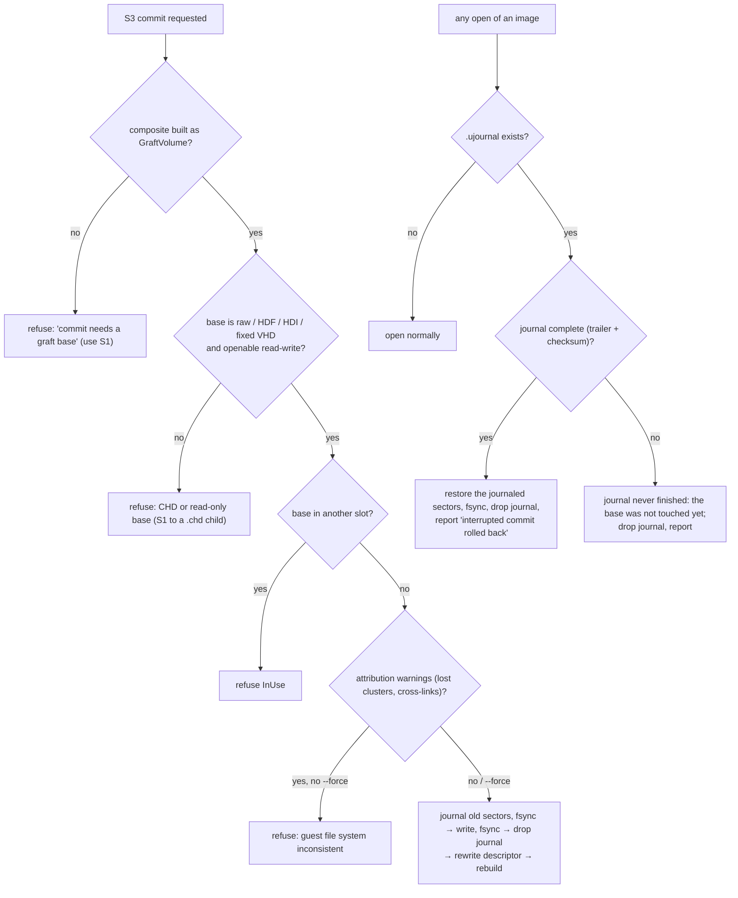
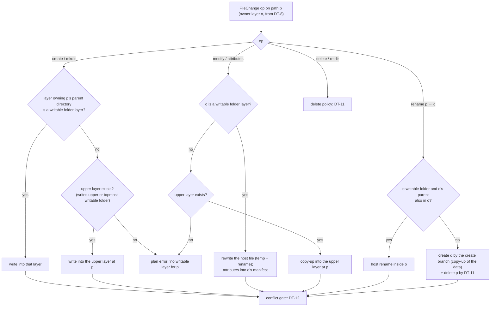
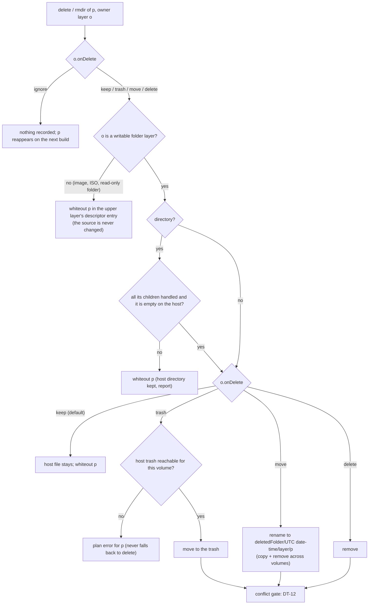
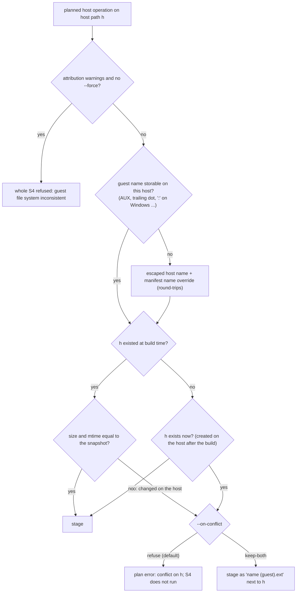

# Multi-source media: where guest changes go (provenance, attribution, flatten strategies)

| | |
|---|---|
| **Date** | 2026-10-05 |
| **Status** | Research and recommendation for review |
| **Owner decision (D-3)** | Research the strategies. One must exist in any case: flatten into a single flat `.img` / `.vhd` file with no layers. |
| **Requirements** | FR-40…FR-47, NFR-S2, NFR-P8, NFR-P9 in [goals-and-requirements.md](goals-and-requirements.md) |

## 0. Summary

| | Strategy | What it writes | Keeps layers | Touches sources | Phase |
|---|---|---|---|---|---|
| **S1** | **Flat image** (mandatory) | one `.img` / `.vhd` / `.chd`: sources + changes; `--compact` re-synthesizes a defragmented volume | no: the result has none | never | **C6**, first |
| **S2** | **Persisted session delta** | the change layer, next to the descriptor | yes, unchanged | never | C6 |
| **S3** | **Commit into the graft base** | base image sectors: patches + grafted data + guest changes, journaled | the base absorbs the upper layers | the base image only | C8 |
| **S4** | **File-level write-back** | host files in writable folder layers; whiteouts into the descriptor | yes, updated | writable folder layers only | C8, opt-in |
| S5 | Export as a folder tree | a new host folder with the merged tree | n/a | never | H3 (media history) |

**Recommendation.** Ship S1 and S2 first: they are safe, need no source writes and cover "keep my
changes" and "give me one image". Add S3 for the base-image-plus-folders workflow (UC-1, UC-3).
Add S4 last, behind an explicit flag and a dry-run plan, for the developer loop where a guest edits
files that live in a host folder.

All four strategies stand on the same two pieces: the **provenance** of every sector (§1) and the
**change attribution** that turns changed sectors into file operations (§2).

## 1. Provenance: who owns a sector

No per-sector table is stored. The owner is **computed from the layout** in O(log n). The layout
already has sorted run tables for the read path.

| Region | Owner record |
|---|---|
| MBR / EBR (partitioned disk or `mbr: true`) | `PartitionTable` |
| Boot sector, backup boot sector, FSInfo | `VolumeHeader(volume)` |
| FAT sector *k* (copy 1 or 2) | `Fat(volume, firstCluster = k × entriesPerSector)` |
| FAT16 root region | `Directory(node = root)` |
| Directory cluster | `Directory(node)`; the node knows its layer of origin, and for a merged directory every contributing layer |
| File data sector | `FileData(node, layer, source, sourceOffset)` |
| Free cluster | `Free` |
| Graft: unpatched base sector | `Base(baseLba)`; a base file is resolved lazily through a cluster → file index built from `FatVolumeReader` the first time it is needed |
| Graft: patched sector | `Patch(kind = Fat / Directory(node) / FsInfo)` |

`ProvenanceMap::Owner(lba)` is the API. `ProvenanceMap::Owners(changeLayer)` streams the owners of
all changed sectors in LBA order (a merge walk over two sorted sequences, O(changes + runs)).

## 2. Change attribution: sectors → file operations

Changed sectors alone do not say what the guest did. A rename rewrites one directory sector; an
append rewrites a FAT sector, a directory sector and new data clusters. Attribution therefore
combines two views:

1. **Structural diff.** Re-read the merged volume (composite + change layer) with
   `FatVolumeReader`, which is independent of the builder. The result is tree **T1**. Compare it
   with the union tree **T0** the medium was built from:

   | T0 → T1 | Operation |
   |---|---|
   | path in both, same first cluster, same size, no changed data sector in its chain | unchanged (or metadata only: time, attributes) |
   | path in both, data sectors changed, or size or chain changed | **modify** |
   | path only in T1, first cluster not owned by any T0 file | **create** |
   | path only in T0, its first cluster free or owned by another T1 path | **delete**, or **rename** if a T1-only path has the same first cluster and size |
   | directory only in T1 / only in T0 | **mkdir** / **rmdir** |

   Matching by first cluster finds renames and moves without content hashing. Files with first
   cluster 0 (empty) are matched by path only.

   **Decision tree DT-8: classifying one entry.** Run for every path in T0 ∪ T1 inside the
   directories the sector evidence names.

   ```mermaid
   flowchart TD
       A["path p"] --> B{"in T0?"}
       B -->|"yes"| C{"in T1?"}
       C -->|"yes"| D{"directory in both?"}
       D -->|"yes"| U0["unchanged directory (its children are classified on their own)"]
       D -->|"no"| E{"type changed (file ↔ dir)?"}
       E -->|"yes"| TC["delete old + create new"]
       E -->|"no"| F{"data sector in its chain changed,<br/>or size / first cluster / chain changed?"}
       F -->|"yes"| MOD["modify"]
       F -->|"no"| G{"time or attributes changed?"}
       G -->|"yes"| ATT["attributes"]
       G -->|"no"| UN["unchanged"]
       C -->|"no"| H{"a T1-only path q with the same first cluster ≠ 0<br/>and the same size?"}
       H -->|"yes"| REN["rename p → q (q not reported again as create)"]
       H -->|"no"| DEL["delete (rmdir for a directory)"]
       B -->|"no"| I{"already paired as a rename target?"}
       I -->|"yes"| SKIP["done"]
       I -->|"no"| J{"first cluster owned by a T0 file<br/>still present at its own path?"}
       J -->|"yes"| W["create · warning 'cross-link'"]
       J -->|"no"| CR["create (mkdir for a directory)"]
   ```

   The owner layer of each operation is the T0 node's layer (modify, delete, rename, attributes)
   or none (create); DT-10 then routes it.

2. **Sector evidence.** `ProvenanceMap::Owners` narrows the diff to the directories and files whose
   sectors changed. Unchanged subtrees are skipped without reading them, which makes NFR-P9
   (10 000 changes on 100 000 entries in ≤ 500 ms) reachable. Only touched directories are re-read
   in full.

The output is a `ChangeSet`: one entry per operation with path, old path (rename), owning layer,
source, sizes and the changed sector ranges. `media changes <slot>` prints it at any time without
writing anything.

**Inconsistent guest state.** A guest may be in the middle of an update, with the FAT written but
the directory not yet. Attribution reports what the volume says *now*. It flags lost clusters
(allocated in the FAT, not reachable from any entry) and cross-links as `warnings`. It does not
repair them. S3 and S4 refuse to run while such warnings exist unless `--force`. S1 and S2 always
run, because they copy blocks and do not interpret them.

## 3. The strategies

**Decision tree DT-9: which strategy a save runs (D-7, D-8).** The same tree serves `media save`,
an eject or insert disposition `save`, and the GUI. `export` is always S1 and `media flatten`
always names its strategy, so neither goes through this tree.



### S1 — Flat image (mandatory)

- **What:** `BlockFormats::Write` over the whole stack writes every sector the guest sees.
  - `.img`: raw, already supported.
  - `.vhd`: fixed VHD; new writer, raw data plus a 512-byte `conectix` footer with geometry.
  - `.chd`: already supported, compressed.
- **Streaming:** sector by sector through a 1 MiB buffer. Free clusters of a synthesized volume
  are runs of zeros: the raw writer seeks over them (sparse file), and the CHD writer stores them as
  zero hunks.
- **`--compact`:** instead of copying the composite's layout, re-synthesize: T1 becomes the single
  layer (a `FatImageSource` over the merged stack), and a new `FatSynthVolume` is laid out and
  written. Every file comes out contiguous, deleted data and lost clusters disappear, and the size
  can change (`--size`). This also converts between FAT16 and FAT32 (`--fs fat32`).
- **Afterwards:** export leaves the medium as it was. `save --as flat` additionally replaces the
  medium in its slot with the new image (single source, empty change layer), following the existing
  "save into `target`, which it then stands for" rule of `BlockFormats::Save`.
- **Safety:** temp file, then rename. Sources are never opened for writing.
- **Cost:** O(volume size) I/O. NFR-P8: ≥ 80% of raw-to-raw copy throughput.

### S2 — Persisted session delta

- **What:** the change layer's sparse map is written to `<descriptor>.delta` (or a path the user
  names): a header (magic, version, composite `ContentId`, sector count), then sorted runs of
  `(lba, count, data)`, zstd-compressed per 1 MiB chunk.
- **Restore:** on insert, if a delta exists and its `ContentId` equals the newly built composite's,
  it is loaded into the change layer. If the ids differ (a source changed, a folder gained a file),
  the delta is **not** applied. The report says which layer identities differ. The user can
  `media flatten --strategy flat` from the *old* state only if the old sources still exist, so the
  report recommends S1 before editing sources.
- **Why the id must match:** a sector delta is only meaningful over byte-identical sources. Any
  layout change (one more file in a folder shifts every cluster after it) makes old sectors land on
  the wrong data.
- **H1 alignment:** the delta file is designed as the future `MediaChangeLayer` spill file
  (versioned pieces, zstd, shared with TTD v2). S2 is the first, unversioned use of the same format.

**Decision tree DT-13: a delta file met on insert.**



### S3 — Commit into the graft base

Applies only to graft composites whose base is a writable image (raw family, not CHD).

1. Build the plan: base sectors to write, made of
   - the patch map (FAT, directories, FSInfo),
   - the grafted clusters, read through `ExtentReader` from the upper sources,
   - the guest's changed sectors.
2. **Journal:** copy the current content of every base sector about to be overwritten into
   `<base>.ujournal`, then fsync.
3. Write the sectors in LBA order, then fsync.
4. Delete the journal. On the next open, a leftover journal means an interrupted commit; the
   original sectors are restored from it before anything else.
5. Rewrite the descriptor: upper layers whose files were all materialized are removed (or marked
   `committed: true`). Rebuild the composite: the base now holds everything, and the change layer is
   empty.

- **Why it is efficient:** only touched sectors plus grafted data are written. A 4 GiB base with a
  20 MiB folder layer writes about 20 MiB, not 4 GiB.
- **Limits:** the base must not also be in another slot, read-write or committed (FR-52). A CHD
  base cannot be committed in place; use S1 to a `.chd` child (`BlockWriteOptions::parent`).

**Decision tree DT-14: may S3 run, and recovery on open.**



### S4 — File-level write-back into layers

Opt-in per layer: `writable: true`. The upper writable layer is named in `writes.upper:`, or by
default it is the topmost writable folder layer.

**Routing table** (operation × owner of the affected entry):

| Operation | Entry owned by a **writable folder** layer | Entry owned by a **read-only** layer (image, ISO, RO folder) |
|---|---|---|
| modify | rewrite the host file (temp + rename) | **copy-up**: write the new content into the upper layer at the same path |
| create | into the layer that owns the parent directory, if writable; else into the upper layer | into the upper layer |
| delete | per the layer's `onDelete` (below) | `keep` / `trash` / `move` / `delete`: a **whiteout** in the descriptor's upper layer entry (the image is never changed); `ignore`: nothing |
| rename / move | host rename inside the same layer | copy-up under the new name + whiteout of the old path |
| mkdir / rmdir | create the host directory / rmdir per `onDelete` (only once its contents are handled) | upper-layer mkdir / whiteout (or nothing for `ignore`) |
| attribute / time change | set host mtime; FAT attributes recorded in the folder manifest (`files: {name: {attrs: RH}}`) | copy-up of metadata only (manifest entry in the upper layer) |

**Decision tree DT-10: routing one file operation (S4).**



**Delete policies** (`onDelete`, per layer, owner decision D-4):

| Policy | Host file | Descriptor | Next build shows the file | Recoverable |
|---|---|---|---|---|
| `keep` (default) | stays | whiteout added | no | yes: drop the whiteout |
| `trash` | moved to the host's trash | — | no | yes: the OS trash |
| `move` | moved to `<deletedFolder>/<UTC date-time>/<layer>/<path>` | — | no | yes: move it back |
| `delete` | removed for good | — | no | no |
| `ignore` | stays | nothing | **yes**: the guest's delete is not carried over | n/a |

The plan (`--plan`) lists each delete with its policy. A trash that is not reachable on the host
(no trash on a network volume, no `$XDG_DATA_HOME`) fails that operation in the plan; it never falls
back to `delete`.

**Decision tree DT-11: a guest delete (`onDelete`, D-4).**



**Decision tree DT-12: the plan gate and conflicts (S4).** Every host write or delete passes it
before staging; the plan shows the outcome per operation.



**Execution:**

1. **Plan.** `media flatten <slot> --strategy write-back --plan` prints every operation, its target
   layer and its byte count, plus every conflict. Nothing is written.
2. **Conflict check.** For each host file to be modified or deleted, compare its current size and
   mtime with the `FolderSnapshot` taken at build time. A difference means someone changed it on the
   host. That is a **conflict**: the default is to refuse; `--on-conflict keep-both` writes
   `name (guest).ext`.
3. **Stage.** Write every new or changed file into a staging folder on the same host volume as its
   target layer.
4. **Apply.** Renames from staging into place, deletes and whiteouts. A journal lists the planned
   renames, so an interrupted apply can be completed or rolled back.
5. **Rebuild.** Rescan the layers, rebuild the composite and empty the change layer. The guest now
   sees the same tree, served from the host files.

**What S4 cannot do:** write into a FAT or ISO image layer file by file (that needs a FAT writer;
non-goal NG-8). Changes to files owned by image layers always copy up.

**Risks:**
- The guest wrote a FAT-legal but host-illegal name (for example `AUX` or a trailing dot on
  Windows). The plan marks it, and it is written as an escaped name plus a manifest name override,
  so it round-trips.
- Timestamps: FAT has 2-second resolution. The host file gets the FAT time; the next build gives
  the same FAT time, so the round trip is stable.

### S5 — Export as a folder (pointer)

Writes the merged tree into a **new** folder. It belongs to the media history H3 (file views) and
reuses `FatVolumeReader`; this design only lists it for completeness.

## 4. Strategy comparison

| Criterion | S1 flat | S1 compact | S2 delta | S3 base commit | S4 write-back |
|---|---|---|---|---|---|
| Safe without user care | ✓ | ✓ | ✓ | ⚠ journaled; modifies the base | ⚠ conflicts possible; staged + journaled |
| Writes proportional to | volume size | used data | changed sectors | changed + grafted | changed files |
| Result usable without the emulator | ✓ one file | ✓ | ✗ | ✓ base image | ✓ host folders |
| Keeps the layered setup | ✗ | ✗ | ✓ | partly (upper layers absorbed) | ✓ |
| Survives source changes | n/a | n/a | ✗ (id mismatch) | n/a | ✓ (by design: works on files) |
| Needs a consistent guest FS | no | yes | no | yes | yes |
| Implementation effort | S (VHD footer) | M | S | M | L |

## 5. Phasing (owner decision D-9)

Attribution (`media changes`, read-only) ships with S1 and S2 in phase C6, so automation (UC-6)
gets it early and the S3 / S4 logic is hardened before anything writes to sources. S3 and S4 follow
in phase C8, after the read side has proven itself on real guests.
