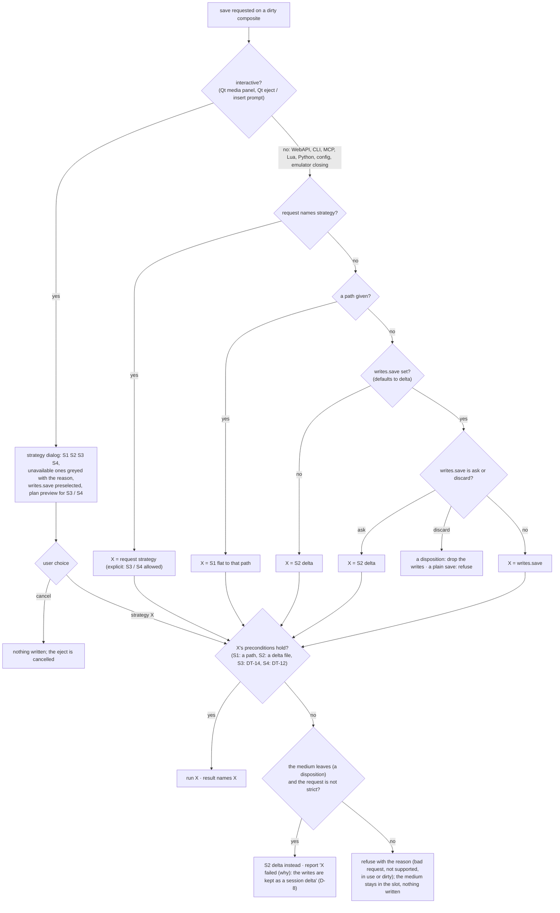
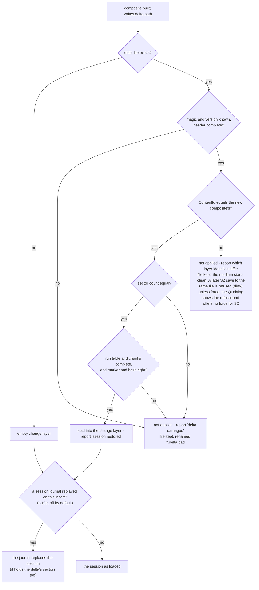
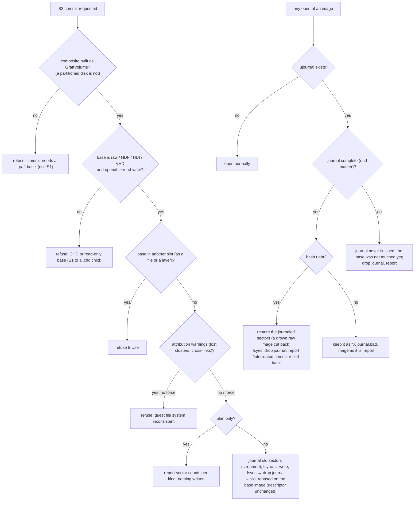
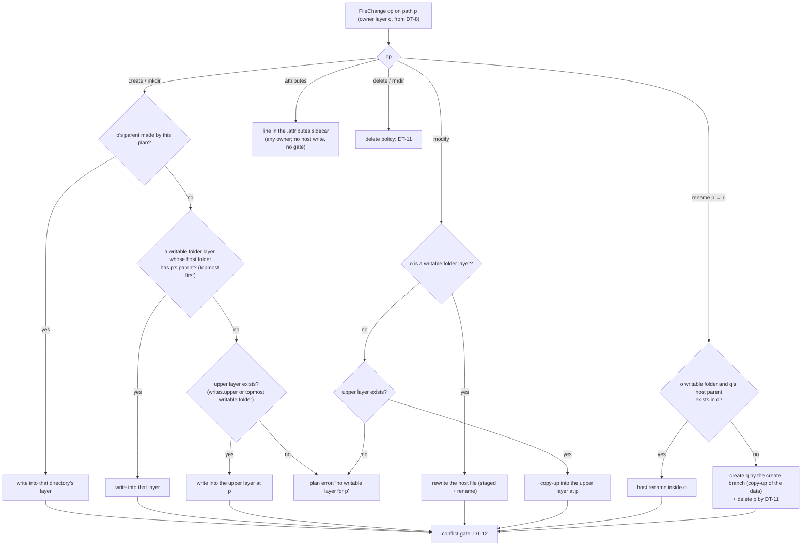
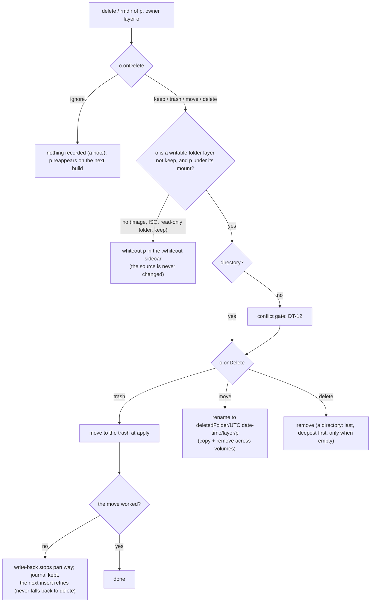
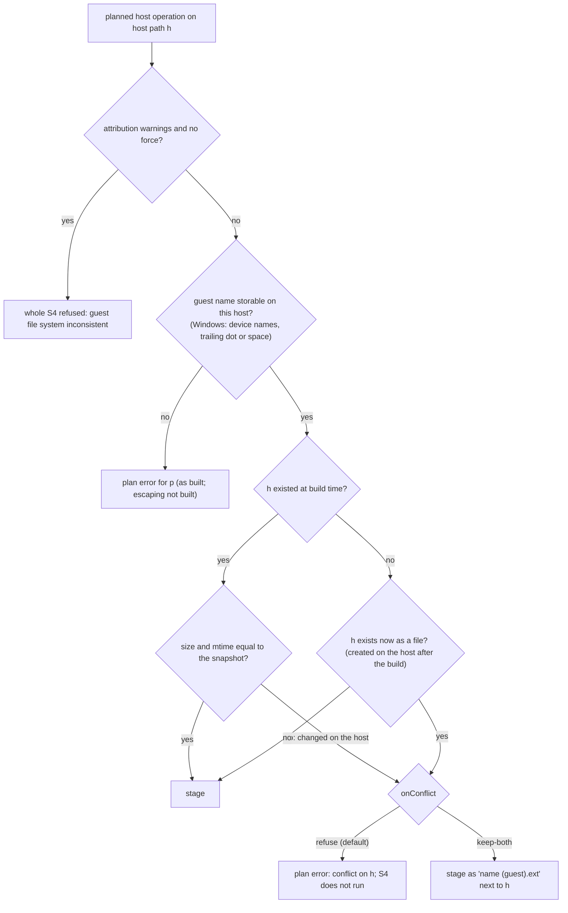

# Multi-source media: where guest changes go (provenance, attribution, flatten strategies)

| | |
|---|---|
| **Date** | 2026-10-05; review round 1 2026-10-09 |
| **Status** | Built: S1, S2 (C6), S3, S4 (C8, C8d), the Qt strategy dialog (C8c, owner's Qt check pending). S5 not built. Review round 1 below |
| **Owner decision (D-3)** | Research the strategies. One must exist in any case: flatten into a single flat `.img` / `.vhd` file with no layers. |
| **Requirements** | FR-40…FR-47, NFR-S2, NFR-P8, NFR-P9 in [goals-and-requirements.md](goals-and-requirements.md) |

## Review round 1 (2026-10-09)

**Status:** the design was built in C6 ([phases/c6-provenance-flatten.md](phases/c6-provenance-flatten.md)), C8
([phases/c8-commit-writeback.md](phases/c8-commit-writeback.md)) and C8d
([phases/c8d-writeback-tails.md](phases/c8d-writeback-tails.md)), with C4b, C10b, C10d and C10e touching it. This
document is checked against the code and the as-built notes; where they differ, the text now says what is built, and
the original design text stays, followed by an *As built* or *Review 1* note. The phase documents remain the as-built record.

What changed in this document:

- **S1:** `.vhd` is fixed by default and dynamic with `vhd: dynamic` (C10b). Writing skips zero runs without
  reading them (C10a). The options are named `compact`, `fs` and `size` on every surface. `save --as flat` is
  `save <slot> <path>` or `strategy: flat`. NFR-P8 measured: 125% of a raw copy.
- **S2:** the delta file layout as built (a run table, then the chunks, then an end marker and hash). DT-13's check
  order follows the code. A mismatched delta is not "asked" about in the GUI: the dialog shows the refusal and offers
  no `force` for a delta. The session journal `<source>.usession` (C10e, off by default since 2026-10-07) replaces
  a composite's `.delta` when it is replayed.
- **S3:** the descriptor is not rewritten; the slot holds the base image afterwards (C8 §2). DT-14 gains the
  damaged-journal case (`*.ujournal.bad`). A commit streams its sectors with no list in memory (C8d §4). A partitioned
  composite cannot be committed.
- **S4:** whiteouts go to the sidecar `<descriptor>.whiteout`, never into the descriptor. Attributes go to the sidecar
  `<descriptor>.attributes` (`<bits><TAB><path>`, `-` for none). There is no folder manifest entry and no copy-up for
  them. A failed trash move is not a plan error: it stops the write-back part way, and the next insert retries
  (C8d §6). Partitioned disks are written back per composed partition (`name:/PATH`); a change on a passthrough
  partition is a plan error. Host-illegal names are plan errors on Windows, not escaped (DT-12). There is no staging
  folder: each file is staged next to its target. The apply journal only rolls forward. DT-11's directory branch and
  the CLI flag spelling (`--onConflict`) follow the code.
- **§1, §2:** the as-built names (`IComposedLayout::OwnerOf`, `MediumChanges`); NFR-P9 measured: 84 ms.
- **DT-8:** a time-only change is not reported; only the read-only, hidden and system bits make `attributes`.
- **DT-9:** a path without a strategy means `flat`. An eject or insert disposition cannot name a strategy (eject takes
  no `strategy` option). The Qt availability rules are listed.
- **Open points found, fixed 2026-10-09:** a commit left `<descriptor>.delta` behind (noise on the next insert);
  `keep-both` did not protect a host-changed file from a guest delete (S4 Risks); a guest `rmdir` took a host
  directory whole under `trash` / `move` (DT-11). Tests: `ComposeCommit_Test.CommitRemovesTheSessionDelta`,
  `ComposeWriteBack_Test.KeepBothKeepsAHostFileTheGuestDeleted`, `ComposeWriteBack_Test.RmdirKeepsAFolderWithHostFiles`.
- **Not built:** S5 (media history H3); a `committed:` marker in the descriptor (C8 §2); escaped host names
  (no tracking item); commit of a partitioned disk (C8 §2, no tracking item); the dynamic VHD choice in the Qt dialog
  ([phases/c10-sparse-memory.md](phases/c10-sparse-memory.md) §7).

## 0. Summary

| | Strategy | What it writes | Keeps layers | Touches sources | Phase |
|---|---|---|---|---|---|
| **S1** | **Flat image** (mandatory) | one `.img` / `.vhd` (fixed or dynamic) / `.chd`: sources + changes; `compact` re-synthesizes a defragmented volume | no: the result has none | never | **C6a**, built |
| **S2** | **Persisted session delta** | the change layer, next to the descriptor (`<descriptor>.delta`) | yes, unchanged | never | C6c, built |
| **S3** | **Commit into the graft base** | base image sectors: patches + grafted data + guest changes, journaled (`<image>.ujournal`) | the base absorbs the upper layers; the slot then holds the base | the base image only | C8a, C8d, built |
| **S4** | **File-level write-back** | host files in writable folder layers; whiteouts and attributes into sidecars next to the descriptor | yes, updated | writable folder layers only | C8b, C8d, opt-in, built |
| S5 | Export as a folder tree | a new host folder with the merged tree | n/a | never | H3 (media history), not built |

**Recommendation.** Ship S1 and S2 first: they are safe, need no source writes and cover "keep my
changes" and "give me one image". Add S3 for the base-image-plus-folders workflow (UC-1, UC-3).
Add S4 last, behind an explicit flag and a dry-run plan, for the developer loop where a guest edits
files that live in a host folder. *(Review 1: done in this order: C6, then C8, then C8d.)*

All four strategies stand on the same two pieces: the **provenance** of every sector (§1) and the
**change attribution** that turns changed sectors into file operations (§2).

## 1. Provenance: who owns a sector

No per-sector table is stored. The owner is **computed from the layout** in O(log n). The layout
already has sorted run tables for the read path.

| Region | Owner record |
|---|---|
| MBR / EBR (partitioned disk or `mbr: true`) | `PartitionTable` |
| Boot sector, backup boot sector, FSInfo | `VolumeHeader(volume)` |
| FAT sector *k* (copy 1 or 2) | `Fat(volume, firstCluster = k × entriesPerSector)` |
| FAT16 root region | `Directory(node = root)` |
| Directory cluster | `Directory(node)`; the node knows its layer of origin, and for a merged directory every contributing layer |
| File data sector | `FileData(node, layer, source, sourceOffset)` |
| Free cluster | `Free` |
| Graft: unpatched base sector | `Base(baseLba)`; a base file is resolved lazily through a cluster → file index built from `FatVolumeReader` the first time it is needed |
| Graft: patched sector | `Patch(kind = Fat / Directory(node) / FsInfo)` |

`ProvenanceMap::Owner(lba)` is the API. `ProvenanceMap::Owners(changeLayer)` streams the owners of
all changed sectors in LBA order (a merge walk over two sorted sequences, O(changes + runs)).

**As built (C6b, C4b).** The API is `IComposedLayout::OwnerOf(lba)` → `SectorOwner` (`compose/composedlayout.h`),
implemented by `FatSynthVolume` and `GraftVolume`. `ForEachChangedOwner` walks a change map in LBA order with one
`OwnerOf` per changed sector, so no merge walk is needed. The roles are partition table, boot area (the gap after the
MBR), volume header, FAT, directory, file data and free. A directory or file sector also carries `dirCluster`, the
first cluster of the directory that holds its entry. A graft marks re-encoded sectors `patched`. It indexes the
directories it never read (C4b lazy base) at the first `OwnerOf` miss and reports them `unlisted`: layer 0, no tree
node. Details: [phases/c6-provenance-flatten.md](phases/c6-provenance-flatten.md) §7,
[phases/c4b-lazy-graft-base.md](phases/c4b-lazy-graft-base.md) §4, §7.

## 2. Change attribution: sectors → file operations

Changed sectors alone do not say what the guest did. A rename rewrites one directory sector; an
append rewrites a FAT sector, a directory sector and new data clusters. Attribution therefore
combines two views:

1. **Structural diff.** Re-read the merged volume (composite + change layer) with
   `FatVolumeReader`, which is independent of the builder. The result is tree **T1**. Compare it
   with the union tree **T0** the medium was built from:

   | T0 → T1 | Operation |
   |---|---|
   | path in both, same first cluster, same size, no changed data sector in its chain | unchanged (or attributes: read-only, hidden, system) |
   | path in both, data sectors changed, or size or chain changed | **modify** |
   | path only in T1, first cluster not owned by any T0 file | **create** |
   | path only in T0, its first cluster free or owned by another T1 path | **delete**, or **rename** if a T1-only path has the same first cluster, kind and size |
   | directory only in T1 / only in T0 | **mkdir** / **rmdir** |

   Matching by first cluster finds renames and moves without content hashing. Files with first
   cluster 0 (empty) are matched by path only.

   **Decision tree DT-8: classifying one entry.** Run for every path in T0 ∪ T1 inside the
   directories the sector evidence names.

   ```mermaid
   flowchart TD
       A["path p"] --> B{"in T0?"}
       B -->|"yes"| C{"in T1?"}
       C -->|"yes"| D{"directory in both?"}
       D -->|"yes"| U0["unchanged directory (its children are classified on their own)"]
       D -->|"no"| E{"type changed (file ↔ dir)?"}
       E -->|"yes"| TC["delete old + create new"]
       E -->|"no"| F{"data sector in its chain changed,<br/>or size / first cluster / chain changed?"}
       F -->|"yes"| MOD["modify"]
       F -->|"no"| G{"read-only, hidden or system bit changed?<br/>(a time-only change is not reported)"}
       G -->|"yes"| ATT["attributes"]
       G -->|"no"| UN["unchanged"]
       C -->|"no"| H{"a T1-only path q with the same first cluster ≥ 2,<br/>the same kind and the same size?"}
       H -->|"yes"| REN["rename p → q (q not reported again as create)"]
       H -->|"no"| DEL["delete (rmdir for a directory, then deletes of what it held)"]
       B -->|"no"| I{"already paired as a rename target?"}
       I -->|"yes"| SKIP["done"]
       I -->|"no"| J{"a cluster of its chain used by another<br/>changed path too?"}
       J -->|"yes"| W["create · warning 'cross-linked'"]
       J -->|"no"| CR["create (mkdir for a directory, then creates of what it holds)"]
   ```

   The owner layer of each operation is the T0 node's layer (modify, delete, rename, attributes)
   or none (create); DT-10 then routes it.

   *Review 1:* DT-8 was "time or attributes changed?" and "first cluster owned by a T0 file still present"; as built
   (`ChangeAttributor`, C6b §7) only the R/H/S bits count, and a cross-link is a cluster that two changed paths use.
   Names are compared ASCII case-insensitively. Lost clusters are checked on FAT16 and FAT32, not on FAT12.

2. **Sector evidence.** `ProvenanceMap::Owners` narrows the diff to the directories and files whose
   sectors changed. Unchanged subtrees are skipped without reading them, which makes NFR-P9
   (10 000 changes on 100 000 entries in ≤ 500 ms) reachable. Only touched directories are re-read
   in full. *Measured: 12 / 84 ms at 10 K / 100 K entries ([benchmarks/README.md](benchmarks/README.md) §2).*

The output is a `ChangeSet`: one entry per operation with path, old path (rename), owning layer,
source, sizes and the changed sector ranges. `media changes <slot>` prints it at any time without
writing anything. *As built:* `MediumChanges` (`ListMediumChanges`): `changes` (op, path, oldPath, layer name,
sizeBefore, sizeAfter), `warnings`, `changedSectors`, `directoriesRead`, `fullScan`. No sector ranges per entry. On a
partitioned disk a path is `name:/PATH` and the layer is `name/layer`.

**Inconsistent guest state.** A guest may be in the middle of an update, with the FAT written but
the directory not yet. Attribution reports what the volume says *now*. It flags lost clusters
(allocated in the FAT, not reachable from any entry) and cross-links as `warnings`. It does not
repair them. S3 and S4 refuse to run while such warnings exist unless `force`. S1 and S2 always
run, because they copy blocks and do not interpret them.

## 3. The strategies

**Decision tree DT-9: which strategy a save runs (D-7, D-8).** The same tree serves `media save`,
an eject or insert disposition `save`, and the GUI. `export` is always S1 and `media flatten`
always names its strategy, so neither goes through this tree.



*Review 1, as built* (`MediaManager::SaveBlockMedium`, `MediaControl::Save`; C6 §8, C8 §1):

- A `save` with a path and no strategy is `flat`. `flat` without a path, and an unknown strategy, are bad requests.
  A strategy other than `flat` on a non-composite is a bad request.
- `flatten` requires `strategy` and runs the same code with it, so DT-9's defaults never apply.
- An eject, swap, insert, create or rescan disposition is `save`, `export <path>` or `discard`; with `save` it takes
  `strategy` (also `discard`, `ask`), `onConflict` and `strict`. Without `strategy` it follows `writes.save`, S3 and S4
  included (D-8 as changed 2026-10-09). A strategy that fails there falls back to S2 unless `strict`. The emulator
  closing runs the same save for every dirty composite (`MediaManager::SaveByPolicyOnRelease`; the test runner turns
  it off). In the GUI, the dialog runs `flatten` with the chosen strategy, then the eject goes on as requested.
- An inline descriptor without `writes.delta` refuses S2 (no file to keep the delta in).
- **Qt availability** (`unreal-qt/src/media/core/flattenchoice.cpp`, `FlattenOptionsFor`):

  | Strategy | Available when | Dialog options |
  |---|---|---|
  | S1 `flat` | always | a path (required), Browse, Compact |
  | S2 `delta` | the descriptor is a file (not inline) | none (no `force`: a delta over another delta's sources is refused and shown) |
  | S3 `commit` | the composite's `build` is `graft` (so never a partitioned disk) | force, Preview (`plan`) |
  | S4 `write-back` | some layer (of any partition) is `writable: true` and the descriptor is a file | keep-both, force, Preview (`plan`) |

  Preselected: `writes.save` when available, else `delta`, else `flat`. A refusal (conflict, lost clusters) keeps the
  dialog open with the reason. The dialog has no dynamic-VHD choice (`vhd` option) yet.

### S1 — Flat image (mandatory)

- **What:** `BlockFormats::Write` over the whole stack writes every sector the guest sees.
  - `.img`: raw, already supported.
  - `.vhd`: fixed VHD; new writer, raw data plus a 512-byte `conectix` footer with geometry. *As built:* fixed by
    default; `vhd: dynamic` writes a dynamic VHD holding only the 2 MiB blocks with data (C10b,
    [phases/c10-sparse-memory.md](phases/c10-sparse-memory.md) §4).
  - `.chd`: already supported, compressed (`compression` option). A CHD child of another CHD: `export` with `parent`
    (not offered on `save` or `flatten`).
- **Streaming:** sector by sector through a 1 MiB buffer. Free clusters of a synthesized volume
  are runs of zeros: the raw writer seeks over them (sparse file), and the CHD writer stores them as
  zero hunks. *As built:* `ExportBlockDevice` goes sector by sector. It skips runs that the device knows are zero
  without reading them (`ZeroRun`, C10a) and seeks over other all-zero sectors. The file gets its size at the end. The
  CHD writer skips zero runs too.
- **`compact`:** instead of copying the composite's layout, re-synthesize: T1 becomes the single
  layer (a `FatImageSource` over the merged stack), and a new `FatSynthVolume` is laid out and
  written. Every file comes out contiguous, deleted data and lost clusters disappear, and the size
  can change (`size`). This also converts between FAT16 and FAT32 (`fs: fat32`). *As built:* `fs` and `size` are
  refused without `compact`. A FAT12 volume needs `fs`. A too small `size` fails with `does-not-fit`. The label, the
  MBR and the boot structures are carried (C6 §6).
- **Afterwards:** export leaves the medium as it was. `save --as flat` additionally replaces the
  medium in its slot with the new image (single source, empty change layer), following the existing
  "save into `target`, which it then stands for" rule of `BlockFormats::Save`. *As built:* that is
  `save <slot> <path>` (or `strategy: flat` with a path, or `flatten --strategy flat <path>`). `save` with `compact`
  needs a path.
- **Safety:** temp file, then rename. Sources are never opened for writing.
- **Cost:** O(volume size) I/O. NFR-P8: ≥ 80% of raw-to-raw copy throughput. *Measured:* 125% (img 540 MiB/s, vhd
  553, compact 487, chd 51, against 431 for a raw-to-raw copy; [benchmarks/README.md](benchmarks/README.md) §2, §4 C7).

### S2 — Persisted session delta

- **What:** the change layer's sparse map is written to `<descriptor>.delta` (or a path the user
  names): a header (magic, version, composite `ContentId`, sector count), then sorted runs of
  `(lba, count, data)`, zstd-compressed per 1 MiB chunk. *As built* (`media/sessiondelta.{h,cpp}`): `UNGDELTA`,
  version 1, flags, content id, sector count, changed sectors, then each layer's name and source identity, a run table
  `(lba, count)`, the sectors in 1 MiB chunks (zstd level 3, stored when not smaller), then `UNGDEND!` and an FNV-1a
  hash. The file is written to `<file>.writing` and renamed. Save and load stream (C10d). The descriptor key
  `writes.delta` moves the file.
- **Restore:** on insert, if a delta exists and its `ContentId` equals the newly built composite's,
  it is loaded into the change layer. If the ids differ (a source changed, a folder gained a file),
  the delta is **not** applied. The report says which layer identities differ. The user can
  `media flatten --strategy flat` from the *old* state only if the old sources still exist, so the
  report recommends S1 before editing sources. *As built:* a restored medium is marked persisted (clean until the
  guest writes again). `discard` leaves the delta file alone, so the next insert restores it again.
- **Session journal (C10e).** With a journal (`[MEDIA] SessionJournal = on`, or the insert option
  `journal: replay`), each medium's session also goes to `<source>.usession`, which is `<descriptor>.usession` for a
  composite. A journal left by a crash is replayed on the next insert after the delta was loaded. It **replaces**
  what the session holds, because the journal has everything since that insert, the delta's sectors included. Save,
  discard, eject, commit and write-back delete the journal. `SessionJournal` is **off** by default since 2026-10-07:
  writes past `SessionMemoryLimit` then go to a temp file and are lost on a crash
  ([phases/c10e-session-journal.md](phases/c10e-session-journal.md) §4, §7, §9).
- **Why the id must match:** a sector delta is only meaningful over byte-identical sources. Any
  layout change (one more file in a folder shifts every cluster after it) makes old sectors land on
  the wrong data.
- **H1 alignment:** the delta file is designed as the future `MediaChangeLayer` spill file
  (versioned pieces, zstd, shared with TTD v2). S2 is the first, unversioned use of the same format.

**Decision tree DT-13: a delta file met on insert.**



*Review 1:* DT-13 checked "chunks complete" before the content id. As built, the content id and sector count are
checked from the header, and the chunks are checked in a first pass before anything is applied. A damaged delta
written over other sources is therefore reported as a mismatch. DT-13 also said "a later S2 save asks in the GUI". As
built, the Qt dialog shows the refusal. A save to an explicit path is not checked against the conflict.

### S3 — Commit into the graft base

Applies only to graft composites whose base is a writable image (raw family, not CHD).

1. Build the plan: base sectors to write, made of
   - the patch map (FAT, directories, FSInfo),
   - the grafted clusters, read through `ExtentReader` from the upper sources,
   - the guest's changed sectors.
2. **Journal:** copy the current content of every base sector about to be overwritten into
   `<base>.ujournal`, then fsync.
3. Write the sectors in LBA order, then fsync.
4. Delete the journal. On the next open, a leftover journal means an interrupted commit; the
   original sectors are restored from it before anything else.
5. Rewrite the descriptor: upper layers whose files were all materialized are removed (or marked
   `committed: true`). Rebuild the composite: the base now holds everything, and the change layer is
   empty.

*As built* (C8a, C8d; `MediaManager::CommitComposite`, `io/storage/commitjournal.{h,cpp}`):

- **Plan:** `GraftVolume::PatchLbas`, `GraftedSectorRuns` and the session's changed sectors (`NextChanged`) are merged
  as three sorted sequences, each LBA once. No list of sectors is held in memory (C8d §4). Each sector is read as the
  composite reads it now, through the session layer, not the read tap. `plan: true` reports the counts per kind and
  writes nothing.
- **Journal:** `UNGJRNL1`, the image's sector count, the entry count (patched in at the end), then `(lba, 512 old
  bytes)` per entry, `UNGJEND!` and an FNV-1a hash. Streamed and synced (`fsync` / `_commit`) before the base is
  touched.
- **Write:** through `HddImageFormats::OpenBlock(..., ReadWrite)`, so an HDI header or a VHD footer stays. A cut-down
  raw base grows to hold its volume, and a rollback cuts it back. Other formats that end early are refused.
- **Step 5 changed** (C8 §2): the descriptor is **not** rewritten (rewriting a user's YAML loses its comments and
  order). The slot is rebased on the base image (session access, empty change layer). Inserting the descriptor again
  grafts the upper layers again. A `committed:` marker is not built; C8 §2 leaves it for later. The session journal
  `.usession` is deleted with the session. The `.delta` file is left as it is (see the note under DT-14).
- **Recovery** runs before an image is opened: a slot insert of the image (`MediaFormatRegistry::Open`), an image layer
  or a passthrough partition of a composite (`CompositeMediumFactory`).

- **Why it is efficient:** only touched sectors plus grafted data are written. A 4 GiB base with a
  20 MiB folder layer writes about 20 MiB, not 4 GiB.
- **Limits:** the base must not also be in another slot, read-write or committed (FR-52). A CHD
  base cannot be committed in place; use S1 to a `.chd` child (`BlockWriteOptions::parent`, the `export` option
  `parent`). As built, a base used anywhere else is refused, whether as a file or as a layer. A partitioned composite
  is not a graft and is refused ("commit needs a graft composite"); it is not built, see C8 §2.

**Decision tree DT-14: may S3 run, and recovery on open.**



*Review 1 note:* a commit left `<descriptor>.delta` in place (write-back removed it), and the next insert reported it
as a mismatch. **Fixed 2026-10-09:** a commit removes the delta too ("disk.ucompose.yaml.delta removed: the base
image holds its changes now"; `ComposeCommit_Test.CommitRemovesTheSessionDelta`).

### S4 — File-level write-back into layers

Opt-in per layer: `writable: true`. The upper writable layer is named in `writes.upper:`, or by
default it is the topmost writable folder layer. *As built:* a `writes.upper` that is not a writable folder layer is a
plan error. An inline descriptor cannot take write-back.

**Routing table** (operation × owner of the affected entry):

| Operation | Entry owned by a **writable folder** layer | Entry owned by a **read-only** layer (image, ISO, RO folder) |
|---|---|---|
| modify | rewrite the host file (staged next to it, then renamed) | **copy-up**: write the new content into the upper layer at the same path |
| create | into a directory this plan makes, else the topmost writable folder layer whose host folder has the parent directory, else the upper layer | the same |
| delete | per the layer's `onDelete` (below) | `keep` / `trash` / `move` / `delete`: a **whiteout** in `<descriptor>.whiteout` (the image is never changed); `ignore`: nothing |
| rename / move | host rename inside the same layer (when the target's host parent exists) | copy-up under the new name + whiteout of the old path |
| mkdir / rmdir | create the host directory / rmdir per `onDelete` (DT-11) | upper-layer mkdir / whiteout (or nothing for `ignore`) |
| attribute change (R, H, S) | a line in `<descriptor>.attributes`; the host file is not touched | the same (no copy-up) |

*Review 1:* the table had whiteouts "in the descriptor's upper layer entry". It also had attributes "recorded in the
folder manifest (`files: {name: {attrs: RH}}`)" plus "set host mtime", with a metadata copy-up for read-only owners.
As built, the descriptor is never rewritten. Whiteouts go to the `<descriptor>.whiteout` sidecar, one guest path per
line (C8b). Attributes go to the `<descriptor>.attributes` sidecar, one line `<bits><TAB><path>` per file (`RH\t/WORK/TOOL.TXT`,
`-` for none, which overrides a bit the layer gives, such as hidden for a dot file). Both sidecars are written whatever
layer owns the file and are applied at every build, after the union (C8d §1, §6). A time-only change is not
attributed (DT-8), so it is not written back; a rewritten file carries the guest's FAT time. On a partitioned disk the
sidecar lines carry the partition: `work:/PATH`.

**Decision tree DT-10: routing one file operation (S4).**



*Review 1:* DT-10 had "the layer owning p's parent directory" for a create and sent attributes through the modify
branch. As built (`WriteBack::Plan`, `media/writeback.cpp`), a create goes as drawn above, and attributes go to the
sidecar. A mkdir is not gated.

**Partitioned disks (C8d §3, §6).** Changes are grouped by their partition prefix (`name:/PATH`; the partition's name,
`pN` when it has none). Each **composed** partition gets its own planner over its own descriptor (its layers, its
`writes.upper`) and over its window of the disk. Steps carry `partition`, and reports and the journal name it. A change
on a **passthrough** partition (an image as it is) is a plan error: "partition pN is an image as it is: commit or
flatten it instead". After the apply, the whole composite is rebuilt.

**Delete policies** (`onDelete`, per layer, owner decision D-4):

| Policy | Host file | Descriptor | Next build shows the file | Recoverable |
|---|---|---|---|---|
| `keep` (default) | stays | whiteout added to `<descriptor>.whiteout` | no | yes: drop the whiteout line |
| `trash` | moved to the host's trash | — | no | yes: the OS trash |
| `move` | moved to `<deletedFolder>/<UTC yyyymmdd-hhmmss>/<layer>/<path>`; `deletedFolder` defaults to `.deleted` next to the descriptor | — | no | yes: move it back |
| `delete` | removed for good | — | no | no |
| `ignore` | stays | nothing | **yes**: the guest's delete is not carried over | n/a |

The host trash (`common/hosttrash.{h,cpp}`, `HostTrash::Move`): the Recycle Bin on Windows (`SHFileOperationW`,
`FOF_ALLOWUNDO`); `~/.Trash` on macOS (`<volume>/.Trashes/<uid>` for another volume; no "Put Back"); the freedesktop.org
Trash 1.0 on Linux / BSD (`$XDG_DATA_HOME/Trash`, or `$topdir/.Trash-$uid` on another device, with a `.trashinfo`).

The plan (`plan`) lists each delete with its policy. A trash that is not reachable on the host
(no trash on a network volume, no `$XDG_DATA_HOME`) fails that operation in the plan; it never falls
back to `delete`. **Changed in C8d** ([phases/c8d-writeback-tails.md](phases/c8d-writeback-tails.md) §6): the plan
does not probe the trash. A move that fails at apply stops the write-back part way. The journal stays, that file is
not deleted, the reply says so, and the next insert of the descriptor retries the move. It still never falls back to
`delete`.

**Decision tree DT-11: a guest delete (`onDelete`, D-4).**



*Review 1:* DT-11 had a "keep" branch under a writable layer (now folded into the whiteout branch: same result). Its
trash branch ended in a plan error. Its directory branch checked "all its children handled and empty on the host",
else whiteout and keep the host directory. As built (C8b §6, `Planner::Delete`, `WriteBack::Recover`):

- A directory is not gated and is not checked at plan time. The attributor emits the `rmdir` before the deletes of what
  the directory held.
- Review 1 found that `trash` and `move` took the host directory whole, with any host-only files in it. **Fixed
  2026-10-09:** under every policy a directory is a `remove` step done last: the files it held go one by one under the
  layer's policy (a `move` keeps their relative paths), then the directory is removed when it is empty.
- A directory that still holds host files the guest never saw stays, and the write-back report says so ("kept, it
  holds host files the guest did not see"; `ComposeWriteBack_Test.RmdirKeepsAFolderWithHostFiles`). No whiteout is
  written: those files show on the next build.

**Decision tree DT-12: the plan gate and conflicts (S4).** Every host write or delete passes it
before staging; the plan shows the outcome per operation.



*Review 1:* DT-12's name branch was "escaped host name + manifest name override (round-trips)". As built (C8b §6), a
name the host cannot store is a plan error, and only on Windows. Escaping is not built and has no tracking item. The
option is `onConflict` on every surface; the CLI flag is `--onConflict`, not `--on-conflict`. "Existed at build time"
means the build's tree node at `p` was a host file of this path. Size comes from the source pool and mtime from the
tree node.

**Execution:**

1. **Plan.** `media flatten <slot> --strategy write-back --plan` prints every operation, its target
   layer and its byte count, plus every conflict. Nothing is written. *As built:* one line per step (`write`,
   `mkdir`, `rename`, `remove`, `move`, `trash`, `whiteout`, `attributes`, `note`), with the path, `[layer]`, the
   host path, the bytes of a write and a detail, then `error:` lines.
2. **Conflict check.** For each host file to be modified or deleted, compare its current size and
   mtime with the `FolderSnapshot` taken at build time. A difference means someone changed it on the
   host. That is a **conflict**: the default is to refuse; `onConflict: keep-both` writes
   `name (guest).ext`.
3. **Stage.** Write every new or changed file into a staging folder on the same host volume as its
   target layer. *As built:* each file is staged as `.unreal-staging-<n>` **next to its target** (no staging
   folder), carrying the guest's FAT time. Staged names are service files that a folder scan skips.
4. **Apply.** Renames from staging into place, deletes and whiteouts. A journal lists the planned
   renames, so an interrupted apply can be completed or rolled back. *As built:* `<descriptor>.writeback` lists
   every step (`write`, `mkdir`, `rename`, `remove`, `whiteout`, `attributes`, `trash`) and ends with `end`. It is
   synced, then performed: removes go last, deepest first, and steps already done are skipped. It only rolls
   **forward**. A journal without `end` is dropped and nothing is applied. A complete one left by a crash or a
   failed step is finished by `CompositeMediumFactory::Open` (`WriteBack::Recover`) before the descriptor is read.
5. **Rebuild.** Rescan the layers, rebuild the composite and empty the change layer. The guest now
   sees the same tree, served from the host files. *As built:* the session is emptied, which deletes the
   `.usession` journal. A `<descriptor>.delta` is removed ("the layers hold its changes now"). Then the slot is
   rescanned.

**What S4 cannot do:** write into a FAT or ISO image layer file by file (that needs a FAT writer;
non-goal NG-8). Changes to files owned by image layers always copy up. Nor can it write a passthrough partition of a
partitioned disk (a plan error).

**Risks:**
- The guest wrote a FAT-legal but host-illegal name (for example `AUX` or a trailing dot on
  Windows). The plan marks it, and it is written as an escaped name plus a manifest name override,
  so it round-trips. *As built:* the plan marks it as an error and S4 does not run (Windows only).
- Timestamps: FAT has 2-second resolution. The host file gets the FAT time; the next build gives
  the same FAT time, so the round trip is stable.
- *Review 1:* with `onConflict: keep-both`, a delete of a host file changed since the build went ahead on the changed
  host file. **Fixed 2026-10-09:** the host's changed file stays and the plan says "changed on the host since the
  build: kept (keep-both)"; it shows again on the next build (`ComposeWriteBack_Test.KeepBothKeepsAHostFileTheGuestDeleted`).

### S5 — Export as a folder (pointer)

Writes the merged tree into a **new** folder. It belongs to the media history H3 (file views) and
reuses `FatVolumeReader`; this design only lists it for completeness. *Not built*; tracked with the media history
H1-H5 ([goals-and-requirements.md](goals-and-requirements.md), "Coordinates with").

## 4. Strategy comparison

| Criterion | S1 flat | S1 compact | S2 delta | S3 base commit | S4 write-back |
|---|---|---|---|---|---|
| Safe without user care | ✓ | ✓ | ✓ | ⚠ journaled; modifies the base | ⚠ conflicts possible; staged + journaled |
| Writes proportional to | volume size (zero runs skipped) | used data | changed sectors | changed + grafted | changed files |
| Result usable without the emulator | ✓ one file | ✓ | ✗ | ✓ base image | ✓ host folders (+ the `.whiteout` / `.attributes` sidecars for the next build) |
| Keeps the layered setup | ✗ | ✗ | ✓ | partly (the slot holds the base; the descriptor still names its layers) | ✓ |
| Survives source changes | n/a | n/a | ✗ (id mismatch) | n/a | ✓ (by design: works on files) |
| Needs a consistent guest FS | no | yes | no | yes (or `force`) | yes (or `force`) |
| Partitioned composite | ✓ | ✓ (the FAT volume) | ✓ | ✗ (not built) | ✓ per composed partition |
| Implementation effort | S (VHD footer) | M | S | M | L |
| Built in | C6a, C10b (dynamic VHD) | C6a | C6c, C10d | C8a, C8d | C8b, C8d |

## 5. Phasing (owner decision D-9)

Attribution (`media changes`, read-only) ships with S1 and S2 in phase C6, so automation (UC-6)
gets it early and the S3 / S4 logic is hardened before anything writes to sources. S3 and S4 follow
in phase C8, after the read side has proven itself on real guests.

*As built:* C6a 2026-10-05, C6b and C6c 2026-10-06, C8a / C8b / C8c 2026-10-06, then C8d 2026-10-06 (attributes, the
host trash, partitioned write-back, a commit in bounded memory). The Qt dialog (C8c) and `HostTrash` on macOS /
Windows await the owner's check ([TODO.md](TODO.md)). Phase table: [phases/README.md](phases/README.md). User
documentation: [docs/features/media.md](../../features/media.md).
