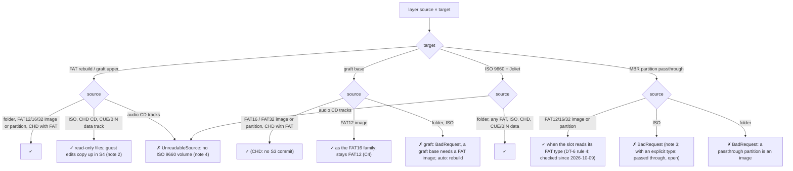
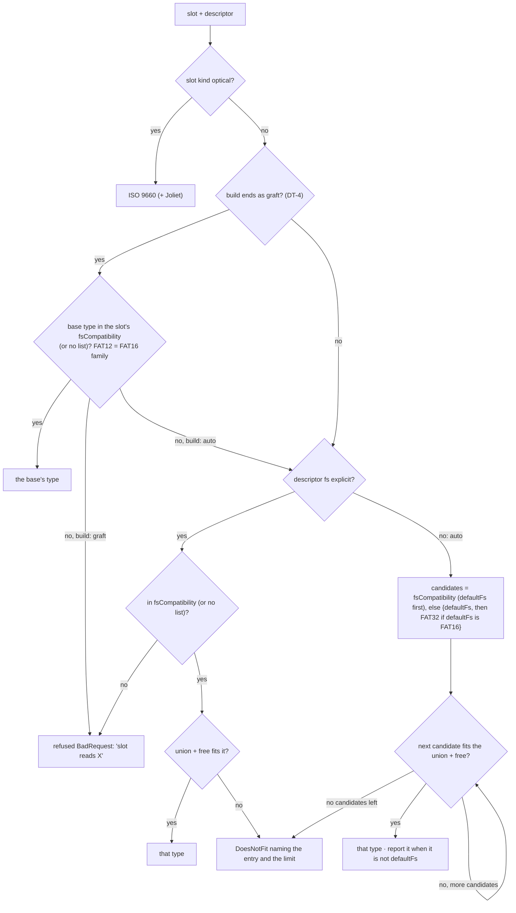

# Multi-source media: file-system compatibility (FAT16 / FAT32 / ISO 9660)

| | |
|---|---|
| **Date** | 2026-10-05 |
| **Status** | Analysis, reviewed against the as-built code (round 1, 2026-10-09) |
| **Question** | Can FAT16 and FAT32 disks be combined, optionally together with ISO 9660, and on what terms? |
| **Short answer** | **Yes for file-level composition in every direction, with clear size and name limits.** A FAT target can take files from FAT12/16/32 and ISO sources. An ISO target can take files from FAT and ISO sources. Partitions keep FAT16 and FAT32 side by side unchanged. Not possible: ISO as a hard-disk partition, a FAT12 rebuild target (a FAT12 base can be grafted and stays FAT12), and block-level merging of two file systems. |

## Review round 1 (2026-10-09)

**Status:** checked against the code (`compositemediumfactory.cpp`, `mediamanager.cpp`, `idecontroller.cpp`,
`fatsynthvolume.cpp`, `iso9660reader.cpp`, the slot descriptors), the phase as-built notes
([phases/README.md](phases/README.md)) and the tests. The slot table and the guest table hold; the changes below
make the rest true today. Open items are marked **open** or **unverified** in place.

- §3: a FAT12 image as a graft base is ✓ since C4 (FAT12 counts as the FAT16 family; `graft-fat12`;
  `GraftVolume_Test.BootSectorAndReservedPreserved` on the DSS floppy), not "v2". DT-7 updated.
- §3: the refusal codes are `BadRequest` / `UnreadableSource`, not `NotSupported` (only a composite in a floppy or tape
  slot is `NotSupported`). Note 3: an `.iso` named as `{image: ...}` with an explicit `type` is passed through, not
  refused (**open**). Note 2: interleaved ISO files were not refused; **fixed 2026-10-09**: they are left out with a report
  line (`ComposeIso_Test.InterleavedAndAssociatedFilesSkipped`).
- §2, notes 1, S-2, S-11: a rebuilt FAT16 root grows past 512 slots when the root needs it; a rebuilt FAT32 volume
  starts at 4 KiB clusters, so its minimum is about 256 MiB, not 32 MiB.
- §4: the rebuilt FAT label is the descriptor's or `UNREAL NG` (the bottom layer's is not carried); ISO associated
  files were not filtered; **fixed 2026-10-09**: left out with a report line. Versions `;n` are still stripped, not
  filtered (**open**).
- §6: evidence per guest now names the tests; NedoOS FAT32 / ISO, ERS FAT32 and Wild Commander on ZX-Evo are
  **unverified** by test. The fsCompatibility rule is BUGS.md "TSConf Z-Controller FAT32 Compatibility Matrix", the
  FAT16 → FAT32 switch is BUGS.md "#2" (the text cited #2 for the matrix).
- §6 rules 2-4 and DT-6: candidate order as built (`FsCandidates`); with `build: auto` a base the slot does not read
  is rebuilt, not refused. Passthrough partitions were not checked against the slot's file systems (rule 4 said they
  were); **fixed 2026-10-09** (`ComposePartitions_Test.PassthroughPartitionFollowsTheSlotsFileSystems`).
- §6 slot table: Sprinter and Profi done (C2, C7) with their tests; the Sprinter partition checks (entry 0,
  `#0B`/`#0C` warning) are not built; ZX Next has no media slot yet.

## 1. Why file-level composition makes the mix possible

Two FAT volumes cannot be merged sector by sector. Each has its own boot sector, FAT, root
directory and cluster numbering, and they collide on the same LBAs. The design composes at the
**file** level instead ([architecture.md](architecture.md) §0):

- A source is only asked for its **tree** (names, sizes, times, attributes) and, per file, the
  **extents** where its bytes lie. Which file system the source uses stops mattering after this
  step.
- The target's metadata (boot sector, FAT, directories, or the ISO descriptors and path tables) is
  always **synthesized fresh**. In graft mode it is patched in place in the base, which must then be
  FAT16 or FAT32.

So "mixing FAT16 and FAT32" really means: **files from either are laid out under one new file
system**. The constraints come only from the target's limits and from name and time conversion.

## 2. Limits of each file system

| | FAT12 | FAT16 | FAT32 | ISO 9660 L1 | ISO 9660 L2 | Joliet (SVD) |
|---|---|---|---|---|---|---|
| Cluster / block count | < 4 085 | 4 085 – 65 524 | ≥ 65 525, ≤ 268 435 445 | 32-bit blocks | same | same |
| Unit size | 512 B – 4 KiB clusters | 512 B – 32 KiB clusters (64 KiB non-standard) | 512 B – 32 KiB clusters | 2 048 B blocks | same | same |
| Max volume (practical) | 16 MiB | **2 GiB** (4 GiB with 64 KiB clusters, not for ZX guests) | 2 TiB (32-bit sector count, 512 B sectors) | 8 TiB | same | same |
| Min volume | — | ~2 MiB | **~32 MiB** (65 525 clusters × 512 B) | — | — | — |
| Max file | 4 GiB − 1 (volume-bound) | 4 GiB − 1 (volume-bound: 2 GiB) | 4 GiB − 1 | 4 GiB − 1 per extent (L3 multi-extent beyond) | same | same |
| Root directory | fixed region | **fixed region**: 512 entries is the compatible value; long names use slots | a cluster chain, unlimited | extent | extent | extent |
| Entries per directory | 65 536 slots (2 MiB) | 65 536 slots | 65 536 slots | unlimited (bounded by extent size) | same | same |
| Names | 8.3 + LFN (255 UTF-16) | 8.3 + LFN | 8.3 + LFN | 8.3 d-chars `A-Z 0-9 _` + `;1` | 31 d-chars | 64 UCS-2 chars |
| Case | insensitive (8.3 upper; LFN case-preserving) | same | same | upper only | upper only | case-sensitive |
| Depth | unlimited (260-char paths on DOS) | same | same | 8 levels | 8 levels | 8 (enforced by us by default) |
| Timestamps | 1980–2107, 2 s | same | same | 1900–2155, 1 s, UTC offset | same | same |
| Attributes | R/H/S/A/D/V | same | same | hidden, directory, associated | same | same |

The FAT type always follows the cluster count, as strict readers (ChaN FatFs, ZX Next firmware,
`FatVolumeReader`) decide it. A "FAT16" whose cluster count is out of range is read as something
else, so the builder picks the cluster size to keep the count in range (as `HostFolderFat` does
today).

As built (review round 1), `FatSynthVolume` keeps a margin of 64 clusters from each edge, which shapes two limits of
a rebuild:

- FAT16: clusters from 512 B to 32 KiB; the root region is 512 entries, or more when the root needs more
  (`max(512, root slots)`). Only a graft's root stays fixed (S-10). Whether every guest reads a root larger than 512
  is **unverified**.
- FAT32: clusters start at 4 KiB, as SD cards ship, so a rebuilt FAT32 volume is at least about 256 MiB (65 590
  clusters of 4 KiB). It is mostly zeros and costs little in memory (C10).

## 3. Source × target matrix

✓ = supported in v1 · ⚠ = supported with conditions (see notes) · ✗ = not supported (build fails with the reason;
as built the code is `BadRequest`, or `UnreadableSource` for a source that has no volume to read. `NotSupported` is
left for a composite in a floppy or tape slot)

| Source ↓ / Target → | FAT16 rebuild | FAT32 rebuild | FAT graft (as upper layer) | FAT graft (as **base**) | ISO 9660 + Joliet | MBR partition (passthrough) |
|---|---|---|---|---|---|---|
| Host folder | ✓ | ✓ | ✓ | ✗ (a folder has no layout) | ✓ | ✗ (compose it instead) |
| FAT12 image / partition | ✓ | ✓ | ✓ | ✓ since C4 (was "⚠ v2"); the result stays FAT12 (`graft-fat12`) | ✓ | ✓ |
| FAT16 image / partition | ✓ | ✓ | ✓ | ✓ | ✓ | ✓ |
| FAT32 image / partition | ⚠ 1 | ✓ | ✓ | ✓ | ✓ | ✓ |
| ISO 9660 (+ Joliet) image | ⚠ 2 | ⚠ 2 | ⚠ 2 | ✗ | ✓ | ✗ 3 |
| CHD hard disk (FAT inside) | ✓ | ✓ | ✓ | ✓ (read-only base; commit S3 ✗) | ✓ | ✓ |
| CHD CD / CUE+BIN data track (ISO inside) | ⚠ 2 | ⚠ 2 | ⚠ 2 | ✗ | ✓ | ✗ 3 |
| Audio CD tracks | ✗ | ✗ | ✗ | ✗ | ✗ 4 | ✗ |

**Decision tree DT-7: may this layer feed this target?** Run per layer (and per partition) before
the union is built.

Notes:

1. **FAT32 source → FAT16 target** works when the selected files fit FAT16: the union is at most
   about 2 GiB, the root has at most 512 slots, and no single file exceeds the volume. The
   validator names the first entry that breaks a limit. A typical use is pulling `/GAMES` out of a
   large FAT32 card into a small FAT16 disk for a guest that only reads FAT16.
   As built: a rebuild grows the root region past 512 slots instead of failing (§2); only a graft's fixed root
   fails (S-10). Tests: `ComposeFat_Test.IntoFat16WhenFits`, `.IntoFat16TooBigFails`.
2. **ISO source → FAT target** works for reading. Data comes from 2 048-byte blocks, each of which
   is four 512-byte sectors, so alignment is exact. Names come from Joliet when present, else the
   ISO name with `;1` stripped. ISO's hidden flag maps to FAT's hidden attribute. Guest writes to
   such files land in the change layer. Their owning layer is read-only, so S4 write-back
   **copies them up** into the writable layer ([flatten-strategies.md](flatten-strategies.md) §4).
   Multi-extent (Level 3) files become multi-extent `FileData`. Interleaved files (file unit size ≠
   0) are refused, as no ZX-era ISO uses them.
   As built (C5a): reading and multi-extent files are as above (`ComposeIso_Test.IsoLayerIntoFat`). Review 1 found
   interleaved files read as contiguous (wrong data); **fixed 2026-10-09**: `IsoDirEntry::interleaved` (record bytes
   26-27), and `IsoImageSource` leaves such a file out with "skipped, recorded interleaved".
3. **ISO as a hard-disk partition** is refused. No ZX guest mounts ISO 9660 from an MBR partition,
   and 2 048-byte addressing on a 512-byte disk would need a translation no guest expects. Put the
   ISO in a CD slot, or compose its files into a FAT partition.
   As built (C7): `{iso: ...}` as a passthrough is a descriptor error ("a passthrough partition is an image"); an
   `.iso` named as `{image: ...}` fails with `BadRequest` "holds no FAT volume: name its type". **Open:** with an
   explicit `type` the ISO's bytes are passed through as a partition; nothing refuses it.
4. **Audio tracks** stay in `AudioFolderDisc` and the CUE / CHD paths. A data + audio composite
   (Enhanced CD) is a possible later extension. As built: a CD image with no ISO 9660 volume as a layer fails with
   `UnreadableSource` (`Iso9660Reader`: "no ISO 9660 volume"). Mixed-mode targets stay out of scope
   ([phases/c5-iso.md](phases/c5-iso.md) §8).

## 4. Conversion rules between file systems

| Aspect | → FAT target | → ISO target |
|---|---|---|
| Long names | kept as LFN (UTF-16); 8.3 generated by `FatNameMapper` (unique `~N` tails, code page CP866 / CP1251) | Joliet name (UCS-2, truncated to 64 with a unique tail); ISO L1 name generated like an 8.3 name in d-characters |
| Short names from a FAT source | decoded with the **layer's** code page (`codepage:` per layer, default the target's), then re-mapped. An 8.3-only name stays the same when it is valid in the target code page | upper-cased, invalid characters become `_` |
| ISO source names | Joliet → LFN; ISO name (minus `;1` and a trailing `.`) → LFN when no Joliet | kept |
| Case collisions | `Readme.txt` and `README.TXT` are one entry; the upper layer wins (FR-11) | Joliet keeps both; the ISO L1 names get unique tails |
| Timestamps | clamped to 1980–2107, rounded down to 2 s; the report counts clamped entries | 1900–2155, UTC offset 0 |
| Attributes | FAT R/H/S/A kept; ISO hidden → H; host: none (A set, like `HostFolderFat`) | H → hidden flag; R/S/A dropped (reported once per build) |
| Volume label | descriptor `label`, else the bottom layer's label, else `UNREAL NG`. As built: a rebuild takes the descriptor's `label` or `UNREAL NG` (the bottom layer's label is not carried); a graft keeps the base's and reports a `label` as ignored | descriptor `label` → PVD volume id (d-chars) + Joliet volume id |
| Slack bytes past EOF in the last sector | zeroed in `dst` after the source read (a `memset` of the tail, no extra copy); this keeps output identical across sources whose slack differs | same |
| Empty files | first cluster 0, no data run | extent length 0 |
| Sparse / zero extents | `FileData::Zero` reads as zeros without touching the source | same |
| Deleted entries, LFN orphans, volume-label entries in a FAT source | ignored (never become files) | same |
| ISO associated files, version > 1 | ignored, reported. As built: associated files (flag bit 2) are left out with "skipped, an associated file" (fixed 2026-10-09); a `;n` version is stripped, not filtered (**open**) | same |

## 5. Combination scenarios

| # | Scenario | Verdict | How |
|---|---|---|---|
| S-1 | FAT16 image + FAT32 image merged into one **FAT32** volume | ✓ | rebuild; both are layers; size = union + free (`ComposeFat_Test.MergeFat16AndFat32IntoFat32`) |
| S-2 | the same into a **FAT16** volume | ⚠ | rebuild; only if the union fits FAT16 (≤ 2 GiB, root ≤ 512 slots; as built the rebuilt root grows instead, §2) (`ComposeFat_Test.IntoFat16WhenFits` / `.IntoFat16TooBigFails`) |
| S-3 | FAT16 base image (graft) + FAT32 image as an upper layer under `/DATA` | ✓ | graft; the upper layer's file system is irrelevant; needs the base's free clusters ≥ the upper data, and FAT16 root slots if mounted at `/` |
| S-4 | FAT32 base (graft) + host folders + an ISO's `/DEMOS` | ✓ | graft; the ISO's files are read-only extents in the base's free space |
| S-5 | FAT16 partition + FAT32 partition on one IDE disk | ✓ | partitions; each volume untouched (passthrough) or composed; types `#06`/`#0E` and `#0B`/`#0C` (`#04` for FAT16 below 32 MiB, `#01` for a FAT12 superfloppy) (`ComposePartitions_Test.Fat16AndFat32OnOneDisk`). Only on a slot without `fsCompatibility`: Sprinter and Profi refuse the composed FAT32 one |
| S-6 | FAT partition + ISO partition on one IDE disk | ✗ | note 3; use an IDE CD unit for the ISO (open: an `.iso` with an explicit `type` slips through) |
| S-7 | Two ISOs + a host folder into one **ISO** CD | ✓ | rebuild ISO; read-only medium (`ComposeIso_Test.IsoPlusFolderIntoIso`) |
| S-8 | FAT image + host folder into an **ISO** CD | ✓ | rebuild ISO (`ComposeIso_Test.FatSourcesIntoIso`) |
| S-9 | ISO as the **base** with folder layers, target ISO | ✓ (as rebuild) | the ISO is the bottom layer of an ISO rebuild; its layout is not kept (no guest depends on ISO block positions). A bootable base keeps El Torito: the boot catalog is rebuilt with new LBAs, the boot images are read from the base by extent; a base without one can get it from a boot layer (D-6). Built in C5b ([phases/c5-iso.md](phases/c5-iso.md) §10) |
| S-10 | Graft on a FAT16 base whose root is full (512 slots) with new files at `/` | ✗ graft, ✓ rebuild | `auto` falls back to rebuild and says why; `graft` fails with `DoesNotFit` (`GraftVolume_Test.Fat16RootFullFallsBackToRebuild`) |
| S-11 | FAT32 composite smaller than 32 MiB | ⚠ | FAT32 needs ≥ 65 525 clusters: the builder raises the volume to the minimum (free space), as `HostFolderFat` does, or fails if `size` is fixed below it. As built the minimum is about 256 MiB (4 KiB clusters, §2); a fixed `size` below it fails with `DoesNotFit` naming the bytes needed |

## 6. Guest support and the default target

The target's file system must be one the guest can read. The facts below come from the guests'
sources and from what already runs on master (researched 2026-10-05). The emulator enforces them
through the slot's existing `MediaSlotDescriptor::fsCompatibility` / `defaultFs` (the rule of
BUGS.md #2), so a composite follows exactly the same per-slot rules as a folder volume.

Review round 1: the type is `SlotDescriptor` (`media/mediaslot.h`: `defaultFs`, `fsCompatibility`, `folderMbr`). The
matrix itself is [BUGS.md](../BUGS.md) "TSConf Z-Controller FAT32 Compatibility Matrix"; BUGS.md #2 is the FAT16 →
FAT32 switch of rule 2. A test name in the Evidence column marks a fact proven in the emulator; the rest comes from
the guests' sources and is **unverified** by test.

| Guest (slot) | FAT12 | FAT16 | FAT32 | ISO 9660 | Evidence |
|---|---|---|---|---|---|
| NedoOS (ZX-Evo / ATM `sd.zc`, IDE, NeoGS SD) | ✓ | ✓ | ✓ | ✓ (CD mount, `cdplay`) | its disk driver is ChaN FatFs (`NOS/kernel/fatfsdrv.asm`, [baseconf-hardware-reference.md](../2026-09-15-atm-baseconf-highres-ports/baseconf-hardware-reference.md)), which reads all three; FAT16 boot proven by M1 ACC-3 (`ZXEvoErs_Test.NedoOsBootsFromAHostFolder`) and ACC-C1 (`.NedoOsBootsFromTwoComposedFolders`). FAT32 **unverified** by test. ISO 9660 **unverified**: `cdplay` (`.NedoOsCdplayPlaysAudioTracks`) plays audio tracks only; NedoOS listing a CD is the P2 item of [TODO.md](TODO.md) |
| ERS boot menu (ZX-Evo) | — | ✓ | ✓ | `AUTORUN.ZX` | `ROM/bootsecfat.a80` carries both BPB layouts (FAT12/16 at `:4-28`, FAT32 at `:30-44`); FAT16 proven by M1 ACC-1/2 and ERS-SD-1 (`ZXEvoErs_Test.SdCardBootRunsSdBootFromAFatVolume`); ISO by `.CdBootRunsAutorunFromAnIso` and ACC-C5 `.ErsBootsAutorunFromComposedIso`. FAT32 **unverified** by test |
| Wild Commander (ZX-Evo) | — | ✓ | ✓ | — | listed as a FAT16 / FAT32 target in the IDE design ([2026-09-25-ide-hdd-design.md](../2026-09-21-profi/2026-09-25-ide-hdd-design.md) §7.4.4); **unverified** by test on ZX-Evo |
| TS-BIOS + Wild Commander (TS-Conf `sd.zc`) | — | ✗ | ✓ | — | the slot declares `fsCompatibility = {Fat32}` (`portdecoder_tsconf.cpp`, `TsConfMedia_Test.SdSlotIsFat32Only`); a volume from sector 0, no MBR (`folderMbr = false`); FAT32 composite proven by ACC-C2 (`TsConfBootSd_Test.ComposeWildCommanderListsFilteredFat32Layers`) |
| Estex DSS (Sprinter IDE) | ✓ | ✓ | ✗ | — | DSS reads FAT12 / FAT16 only ([Sprinter hardware reference](../2026-09-28-sprinter/hardware-reference.md) §9.3: `fat_x.asm`, `DOSBOOT4.ASM:351-375`); partition types `#01 #04 #06 #0E`, extended `#05 #0F`; `#0B #0C` skipped; the boot loader reads **MBR entry 0 only**; boot code at LBA 1-3 ([sprinter-hdd recipe](../../../.recipe/media/sprinter-hdd.md)). FAT12 proven by ACC-3 (`SprinterBoot_Test.Dss162_BootsFromTheHdFloppyToThePrompt`), FAT16 by ACC-4 (`.Dss162_BootsFromAHardDiskImage`) and ACC-C3 (`.ComposeDssGraftedUtilFolder`); FAT32 not tried (the slot refuses it) |
| PQ-DOS (Profi IDE) | ✓ (boot floppy) | ✓ | ✗ (ACC-C4, 2026-10-06: a FAT32 partition 2 is ignored) | — | `testdata/machines/profi/pqdos/pqdos-hdd-small.img`: MBR entry 0 type `#06`, FAT16; `pqdos1.fdi` FAT12; no FAT32 source or image found. Tests: `ProfiPlusPqDos_Test.BootsFromTheFloppyToDosNavigator` (FAT12 floppy), `.BootsFromTheHardDiskToDosNavigator` (FAT16), ACC-C4 `ProfiPlusComposed_Test.Fat16SecondPartition`; the FAT32 run is recorded in `.Fat32SecondPartitionRefused`'s comment, the test now checks the refusal |
| NextZXOS / esxDOS (Next, later) | ✓ | ✓ | ✓ | — | [integration-next.md](../2026-09-28-storage-manager/integration-next.md); `MM_NEXT` has no media slot yet, so nothing is enforced or tested |
| NeoGS SD (loader, players) | — | ✓ | ✓ | — | [integration-neogs-sd.md](../2026-09-28-storage-manager/integration-neogs-sd.md); both proven by `SoundChip_NeoGS_SdBoot.LoaderBootsNeogsRomFromEveryLayout` / `.LoaderBootsNeogsRomFromAHostFolder` |

**Default target choice** (FR-2, `fs: auto`):

1. If the slot declares `fsCompatibility`, only those types are allowed. An explicit `fs` outside
   the set is refused (`BadRequest`, as for folders today).
2. Otherwise, or within the set: the slot's `defaultFs` if the union plus free space fits it, else
   the next allowed type (FAT16 → FAT32, the BUGS.md #2 rule); else `DoesNotFit`.
3. Graft: the base decides; a base whose type the slot does not allow is refused.
4. Partitions: each composed partition follows rules 1-2. Passthrough partitions are checked
   against `fsCompatibility` too, as inserted images are today.
5. Optical slot: ISO.

As built (review round 1):

1. Rule 1 holds twice: `MediaManager` refuses an insert option `fs` outside the set, and `FsCandidates` refuses a
   descriptor's `target.fs` outside it ("the slot reads fat16, not fat32"). Without an explicit `fs`, a `defaultFs`
   outside the set is clamped to the set's first entry.
2. Rule 2, `FsCandidates`: with a list, `defaultFs` first when the list has it, then the rest in FAT16, FAT32 order;
   without a list, `defaultFs` then the other type, except that a FAT32 default never falls back to FAT16. A build on a
   later candidate reports "the content does not fit fat16: built as fat32". Tests:
   `CompositeMediumFactory_Test` (`FsCandidates` cases, `.SlotThatReadsOnlyFat32BuildsFat32`).
3. Rule 3 differs: only `build: graft` refuses a base the slot does not read (`BadRequest`). `build: auto` rebuilds
   instead, in an allowed type, and reports "rebuild instead of a graft: the base is FAT32 and the slot does not read
   it" (DT-4, [phases/c4-graft.md](phases/c4-graft.md) §2). FAT12 counts as the FAT16 family.
4. Rule 4 holds for composed partitions: the child build gets the slot's list (ACC-C4
   `ProfiPlusComposed_Test.Fat32SecondPartitionRefused`). Passthrough partitions were not checked (a FAT32 one was
   built on a Profi or Sprinter disk); **fixed 2026-10-09**: `BuildPartitioned` refuses a passthrough partition whose
   FAT family the slot does not read (`ComposePartitions_Test.PassthroughPartitionFollowsTheSlotsFileSystems`).
5. Rule 5 holds; a FAT target on a CD slot and an ISO target on a disk slot fail with `BadRequest`
   (`ComposeIso_Test.KindMismatches`); a composite in a floppy or tape slot fails with `NotSupported`.

The image check of a plain insert had two gaps: it did not classify FAT12 (under 4 085 clusters), so a FAT12 image
passed a `{Fat32}` slot, and it missed a FAT16 volume over 32 MiB (its size in the 32-bit field). **Fixed
2026-10-09**: both are the FAT16 family (`MediaManager_Test.Fat32OnlySlotBuildsFoldersAsFat32AndChecksImages`). Still
open: `ProbeFatType` looks at the first FAT partition of an MBR only.

**Decision tree DT-6: the target file system.** As built (review round 1): a base the slot does not read is
refused only under `build: graft`; `auto` goes on to the rebuild branch.

**Consequences for the slot descriptors** (work items for phase C2):

| Slot | Today | Needed |
|---|---|---|
| Sprinter `ide0.*`, `ide1.*` | no `fsCompatibility`: a FAT32 folder or composite is accepted, although DSS cannot read it and the Sprinter storage design says it must be refused | `fsCompatibility = {Fat16}` (FAT12 targets are a non-goal); `ComposeSprinter_Test.Fat32Refused`. **Done in C2:** set by scheme in `IdeController` (hard disks only, not CD units); the test is `MediaControl_Test.SprinterHardDiskTakesFat16CompositesOnly` (the planned name was not used) |
| Sprinter, partitions mode | — | the DSS partition must be **entry 0**; types `#0B`/`#0C` are pointless (DSS skips them), so the validator warns; a rebuilt DSS boot volume would lose the boot code at LBA 1-3: `build: auto` picks graft for a bootable DSS base; a rebuild carries the base's reserved boot sectors (D-6), and a composite with no DSS base gets the loader from a boot layer (`boot.reserved`). As built: `auto` grafts any image base at `/` (ACC-C3); a rebuild carries the boot code and reserved sectors (C5b, `ComposeBoot_Test.CarriesBaseBootCode` on the DSS floppy). **Open:** the entry-0 check and the `#0B`/`#0C` warning are not built (no DSS-specific code in the factory or `PartitionedDisk`; the first primary partition is marked active) |
| Profi `ide0.*` | `{Fat16}` (since C7) | ACC-C4 (2026-10-06): PQ-DOS 2023-09 boots from a FAT16 partition and makes a directory on a composed FAT16 partition 2, but ignores a FAT32 one; the IDE slots now refuse FAT32 composites, folders and images as Sprinter's do. As built: refused for folders, composed partitions and plain images; a passthrough FAT32 partition is not (rule 4 above) |
| ZX-Evo `sd.zc`, IDE; NeoGS; Next | FAT16 default, both allowed | unchanged. As built: ZX-Evo `sd.zc` (`portdecoder_atm3.cpp`), NeoGS `sd.ngs` and the IDE disks of the ATM, Nemo, SMUC and DivIDE schemes: `defaultFs = Fat16`, no list. Next: no media slot yet |
| TS-Conf `sd.zc` | `{Fat32}` | unchanged (`defaultFs = Fat32`, `folderMbr = false`) |
| Floppy and tape slots (TR-DOS, +3DOS, DSS and PQ-DOS floppies) | no composite | unchanged: a composite there fails with `NotSupported` |

## 7. Verdict

- **FAT16 ↔ FAT32 mix: fully feasible.** Merge into either type if the limits allow, graft into
  either base, or keep each type as its own partition. The cost is one name and time conversion
  pass at build time; read speed and memory are the same as a single-source volume.
- **With ISO: feasible as a source everywhere and as a CD target.** It is not feasible as a
  hard-disk partition or as a graft base. CD targets are read-only, so they need no write
  attribution.
- **Risks** are in the guests, not the composition: a guest that only reads FAT16, a guest that
  mishandles one sector per cluster on large volumes (already avoided by the cluster-size rule), or
  a guest that depends on files being at fixed sectors. Graft mode exists for the last case.
