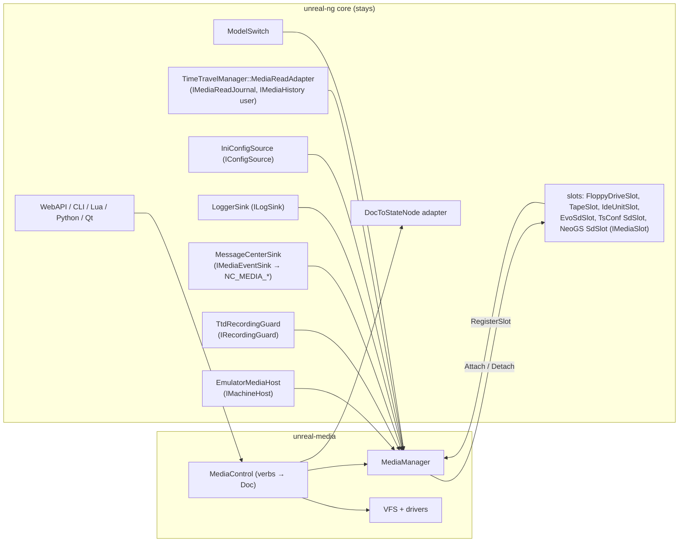
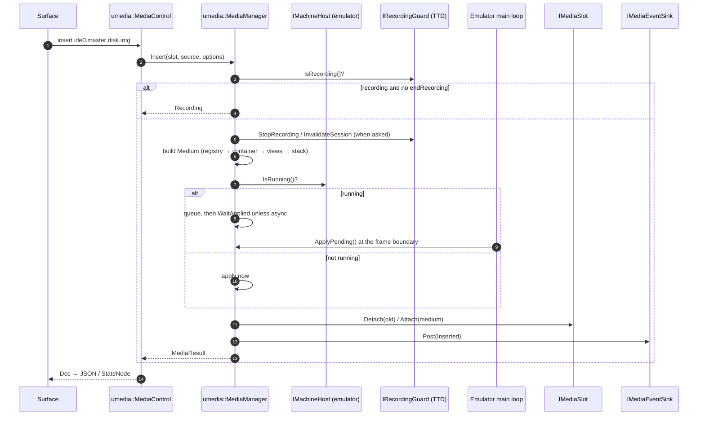
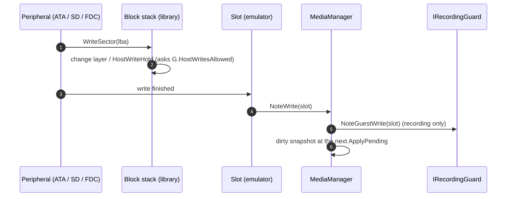
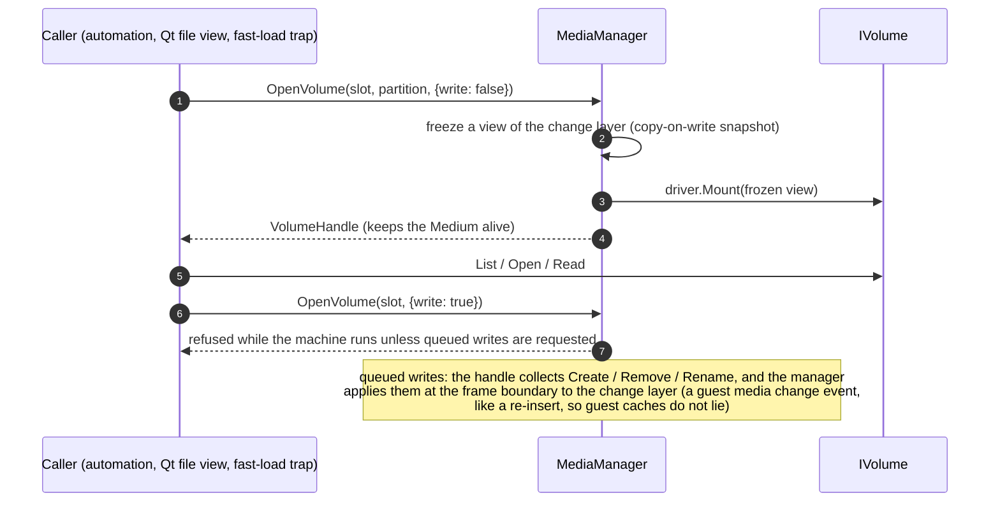

# Media library: API, ports and integration

| | |
|---|---|
| **Date** | 2026-10-05 |
| **Status** | Plan for review |
| **Architecture** | [library-architecture.md](library-architecture.md) |
| **Couplings replaced** | K1-K19 in [current-state.md](current-state.md) §3 |

## 1. The seam in one picture



## 2. Construction

```cpp
umedia::MediaManager::Ports ports;
ports.host      = &_mediaHost;          // EmulatorMediaHost, owned by Emulator
ports.recording = &_recordingGuard;     // TtdRecordingGuard
ports.events    = &_mediaEvents;        // MessageCenterSink (posts NC_MEDIA_* as today)
ports.log       = &_mediaLog;           // LoggerSink
auto manager = std::make_unique<umedia::MediaManager>(ports);
manager->SetReadJournal(ttd.MediaReadJournal());   // unchanged role
manager->ApplyConfigured(umedia::MediaConfig::FromSource(IniConfigSource(config.ini)));
```

Every port has a **null implementation** in the library. A tool constructs `MediaManager({})` and
gets the following behaviour: always "not running", so requests apply at once; no recording; events
dropped; logs to stderr. That is what the 17 pure `MediaManager(nullptr)` tests do today.

## 3. Ports

```cpp
namespace umedia {

class IMachineHost                       // K2, K4
{
public:
    virtual ~IMachineHost() = default;
    virtual bool IsRunning() const = 0;          // emulation thread alive
    virtual bool IsPaused() const = 0;
    virtual uint32_t FrameDurationUs() const = 0; // swap delays (20 000 default)
    virtual std::string MachineId() const = 0;    // event payloads
    /// Run `fn` with the machine parked (paused and confirmed); resumes after.
    /// False when it could not be parked within `timeoutMs`
    virtual bool WithMachineParked(const std::function<void()>& fn, uint32_t timeoutMs) = 0;
};

class IRecordingGuard                    // K1, K5
{
public:
    virtual ~IRecordingGuard() = default;
    virtual bool IsRecording() const = 0;
    virtual bool IsReplaying() const = 0;
    virtual bool HostWritesAllowed() const = 0;   // false during a replay (MediaWriteGate today)
    virtual void StopRecording(std::string_view reason) = 0;
    virtual void InvalidateSession(std::string_view reason) = 0;
    virtual void NoteGuestWrite(std::string_view slot) = 0;   // RecordExternalEvent(DiskWrite)
};

struct MediaEvent { MediaEventKind kind; std::string machine, slot; MediaKind media; std::string source, access, path; };
class IMediaEventSink { public: virtual ~IMediaEventSink() = default; virtual void Post(const MediaEvent&) = 0; };   // K3

class ILogSink { public: virtual ~ILogSink() = default; virtual void Log(LogLevel, std::string_view) = 0; };        // K6

class IConfigSource                      // K7
{
public:
    virtual ~IConfigSource() = default;
    virtual std::optional<std::string> Get(std::string_view section, std::string_view key) const = 0;
    virtual std::vector<std::pair<std::string, std::string>> Section(std::string_view section) const = 0;
};
}
```

`IMediaReadJournal`, `IMediaHistory` and `IMediaSlot` keep their current shape. They only move
into the `umedia` namespace. `IMediaSlot` gains two optional members, both with defaults:

- `Reconfigure(MediaKind)` (K8): the IDE unit switching between disk and CD drive.
- `ControllerTraits()` (K9): the uPD765 / WD1793 facts `MediaControl` asks about today through
  `MM_PLUS3`.

## 4. Runtime sequences (unchanged behaviour, new seams)

### 4.1 Insert at the frame boundary



### 4.2 Guest write and TTD



### 4.3 A volume over a medium in use



Writes into a medium the guest is using are queued and applied as a media change. A guest OS
caches directories, so silently changing sectors under it is unsafe. The guest sees a short
eject / insert, exactly as with a rescan.

## 5. Replies: `Doc` instead of `StateNode` (K10)

`MediaControl` returns `umedia::Doc`, a small ordered tree (object / array / string / integer /
bool / null) with a JSON writer and reader. The emulator converts `Doc` to `StateNode` in one
adapter (`DocToStateNode`, ~80 lines), so the WebAPI, OpenAPI generation, CLI, Lua and Python see
exactly the bytes they see today. A golden test compares the JSON of every verb before and after
the move (`MediaControlParity_Test`).

## 6. New verbs (file-system access on every surface)

| Verb | Arguments | Result |
|---|---|---|
| `media fs probe <slot\|file>` | `[--partition N]` | candidate drivers with scores and dialects (§7 of filesystem-unification) |
| `media fs ls <slot\|file>[:path]` | `--long`, `--meta` | entries with metadata |
| `media fs cat` / `get` | path, `--meta manifest\|wrap\|none` | content (base64 in JSON surfaces) or a host file / folder |
| `media fs put` | host file or folder → path, `--type/--start/--line` | created entries; queued for a running slot |
| `media fs rm` / `mv` / `mkdir` | path(s) | |
| `media fs check` | | `FsckReport` |
| `media fs compact` | | TR-DOS MOVE, CBM validate |
| `media convert` | source → target file, `--fs`, `--container` | `fs::Convert` |

They follow the existing `MediaControl` pattern: one implementation, generated OpenAPI, CLI, MCP
(through HTTP), Lua and Python bindings, and the Qt media panel's file view. **The TR-DOS catalog
code in `cli-processor-disk.cpp` and `tape_disk_api.cpp` is deleted** and those endpoints call
`media fs ls` internally (same JSON shape, golden-tested).

## 7. Build integration

```cmake
# libs/unreal-media/CMakeLists.txt (sketch)
cmake_minimum_required(VERSION 3.21)
project(unreal-media VERSION 1.0.0 LANGUAGES C CXX)
option(UMEDIA_BUILD_TESTS      "gtest suite"            ${PROJECT_IS_TOP_LEVEL})
option(UMEDIA_BUILD_BENCHMARKS "google benchmark suite" OFF)
option(UMEDIA_BUILD_TOOLS      "umedia CLI"             ${PROJECT_IS_TOP_LEVEL})
option(UMEDIA_BUILD_PYTHON     "pybind11 module"        OFF)
set(UMEDIA_FS_DRIVERS "all" CACHE STRING "semicolon list or 'all'")   # e.g. "trdos;fat;iso9660;cpm;tape"

foreach(dep zstd::libzstd lzma miniz)          # reuse the parent's targets
  if(NOT TARGET ${dep}) ... add_subdirectory(third_party/...) endif()
endforeach()

add_library(umedia-base STATIC ...)   # one target per module (library-architecture §2)
...
add_library(unreal-media INTERFACE)    # umbrella
target_link_libraries(unreal-media INTERFACE umedia-manager umedia-compose umedia-fs ...)
add_library(unrealng::media ALIAS unreal-media)
install(TARGETS ... EXPORT UnrealMediaTargets)  # + UnrealMediaConfig.cmake
```

- **Warnings:** `-Wall -Wextra -Wpedantic -Werror` (gcc / clang) and `/W4 /WX` (MSVC), set on the
  targets, not the directory.
- **No PCH.** Every file includes what it uses; a CI job builds with `-fno-pch` semantics (no PCH
  configured at all) to keep it honest.
- **The emulator** adds `add_subdirectory(libs/unreal-media)` before `core/src`. Core links
  `unrealng::media` PUBLIC, because peripherals see `IBlockDevice` and `DiskImage` in their headers.
- **Driver selection:** `UMEDIA_FS_DRIVERS` lets a small tool link only what it needs. Drivers
  register through an explicit `RegisterBuiltinDrivers()` generated from the list, not static
  initializers, because static libraries drop unreferenced self-registering objects.

## 8. The `umedia` CLI

```
umedia probe   <image>                       # containers, partitions, file systems with scores
umedia ls      <image>[:path] [-l] [--fs trdos] [--partition 2]
umedia get     <image>:<path> [dest] [--meta manifest|wrap|none]
umedia put     <image>[:dir] <host files...> [--type C --start 32768]
umedia rm|mv|mkdir ...
umedia check   <image>                       # fsck report, exit code 0 / 1 / 2
umedia compact <image>
umedia convert <src> <dst> [--fs cpm:+3] [--container dsk]
umedia compose <descriptor.ucompose.yaml> --out <image> [--strategy flat|compact]
umedia info    <image>                       # geometry, protection hints (tools/diskinfo parity)
umedia dump    <image> --sector C/H/S | --lba N | --track C/H [--raw]
```

Every command takes `--json` for machine output (the same `Doc` as the API). Exit codes: 0 ok,
1 operation failed, 2 usage, 3 corrupt medium. It replaces `tools/diskinfo` (inspection, heuristic
detection, dumps) and `tools/diskconverter` (TRD / SCL / FDI / UDI / TD0 conversions). Both Python
tools stay for one release as wrappers that print a deprecation line and call `umedia`.

## 9. The Python module

A standalone pybind11 module (`import umedia`), built with `UMEDIA_BUILD_PYTHON=ON` and published
as a wheel by CI (X10). It is separate from the emulator's embedded Python, which keeps its
`media_*` functions on top of `MediaControl`.

```python
import umedia
img = umedia.open("games.trd")              # container + probe
vol = img.mount()                            # best driver; img.mount(fs="trdos")
for e in vol.ls("/"):
    print(e.name, e.meta.zx.type, e.size)
data = vol.read("/ELITE.B")
vol.put("/HELLO.C", b"...", zx=umedia.ZxHeader.code(start=32768))
vol.commit()
umedia.convert("elite.tap", "elite.trd")
```

## 10. What the emulator keeps writing itself

| Piece | Lines (est.) | Notes |
|---|---|---|
| `EmulatorMediaHost`, `TtdRecordingGuard`, `MessageCenterSink`, `LoggerSink`, `IniConfigSource` | ~250 | thin adapters |
| `DocToStateNode` | ~80 | K10 |
| Slot classes (6) | unchanged logic; namespace / include changes | |
| `ModelSwitch` | unchanged logic; uses `umedia::MediaManager` | K19 |
| Floppy / tape loader shims `Loader*(EmulatorContext*, path)` | ~150, for one release | K13; removed in X6 |
