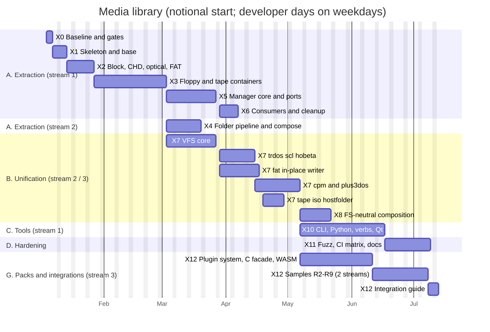

# Media library: the extraction and unification plan

| | |
|---|---|
| **Date** | 2026-10-05 |
| **Status** | Plan for review |
| **Starts** | after the multi-source media work (C0-C9) is integrated, merged and fully tested, including its benchmarks and acceptance tests |
| **Inputs** | [current-state.md](current-state.md) (measured), [library-architecture.md](library-architecture.md), [filesystem-unification.md](filesystem-unification.md), [api-and-integration.md](api-and-integration.md), [test-and-quality-plan.md](test-and-quality-plan.md) |

## 0. Summary

| Block | Phases | Effort (developer days) | Result |
|---|---|---|---|
| **A. Extraction** | X0-X6 | **79** (59-99) | `unrealng::media` builds alone; the emulator uses it through ports; no behaviour change; all tests green; A/B shows no regression |
| **B. Unification** | X7-X8 | **80.5** (60-100) | the VFS, tier-1 drivers (TR-DOS consolidated with write support, FAT in-place writer, CP/M with +3DOS, tape, SCL, Hobeta, ISO, host folder), file-system-neutral composition |
| **C. Tools** | X10 | **29** (22-36) | `umedia` CLI, Python wheel, `media fs` verbs on every surface, the Qt file view; the Python tools retired |
| **D. Hardening** | X11 | **15.5** (12-19) | fuzzing of every parser, tests on Linux / macOS / Windows, install / `find_package`, docs |
| **G. Packs, plugins, reference integrations** | X12 | **66** (50-83) | ZX / CP/M as packs, tape codecs, plugin system (static, dynamic C ABI, out-of-process, Python), C facade, WASM build, CMake functions, samples R2-R9 ([reference-integrations.md](reference-integrations.md)) |
| **Planned total (A-D + G)** | | **270 days** (203-338) | ~13 months for one developer, **~6.5 months with three parallel streams** (§3) |
| E. More ZX file systems (ZX pack) | X9a | 49, per driver 6-11 | G+DOS / UniDOS, Opus, MB-02, MDOS, iS-DOS, Microdrive; demand-driven, each independent |
| F. Foreign platform packs | X9b | 35.5 + tape codecs, per driver 1.5-17 | Amiga (OFS / FFS + RDB), CBM (CBM DOS + C64 TAP / T64 codecs), Atari ST, MSX (dialect + CAS / FSK), CPC (CDT), BBC (UEF); in-tree or out-of-tree plugins, demand-driven |

The ranges are ±25%. The estimates come from the measured line counts and the rates in §1, not
from guesses per task.

## 1. Effort model

| Kind of work | Rate | Basis |
|---|---|---|
| **Mechanical move** of production code (git mv, namespace `umedia`, explicit includes and `std::` instead of the PCH, CMake, forwarding header) | 1 500 lines / day | the code compiles unchanged otherwise; most time goes into includes (K17) and fixing what the PCH hid |
| Mechanical move of **tests** | 2 000 lines / day | fixtures and helpers move with them |
| **Decoupling** of a coupling edge (K1-K19) | estimated per edge (0.25-3 days) | §2, per edge |
| **New code** with tests | 120-150 lines / day | the rate of `FatVolumeReader` + `HostFolderFat` + tests in M1 |
| **Integration buffer** | +20% on moves and decoupling | conflicts with ongoing work, CI on three OSes, review rounds |

The move phases assume the media directories are **frozen for other work** during their week
(announced in PLAN.md). Moves are separate commits that contain nothing but the move (`git mv`, then
fix-ups in the next commit), so `git log --follow` and blame keep working.

## 2. Phases

### X0 — Baseline and gates (3 days)

| Task | Output |
|---|---|
| Re-measure everything in current-state.md with a script (`libs/unreal-media/tools/coupling-census.py`: LOC, include edges, `EmulatorContext` member uses, consumer edges, test counts). The script runs in CI from X1 on and fails when a library file includes an emulator header | census report committed; numbers in this plan updated if they moved > 10% |
| Golden outputs: JSON of every `media` verb on a fixed scenario set (all slot kinds, every error code), byte hashes of every built medium (folder FAT, TRD, TZX, composites), CHD / export outputs | `tests/golden/` with a regenerate script |
| Benchmark baselines: `chdimage_benchmark`, `zcontrollerspi_benchmark`, the compose benchmarks (C1-C8 of multi-source), a floppy load / save benchmark (new, 11 formats) | baseline JSON (quiet machine, `UNREAL_NICE=0`) |
| Freeze calendar for the media directories (X2-X6), agreed and written into PLAN.md | dates |

**Exit:** the census, the goldens and the baselines are committed, and the rest of the plan is
recalculated from the census.

### X1 — Library skeleton and base module (5 days)

| Task | Days |
|---|---|
| `libs/unreal-media/` CMake project: options, per-module targets, reuse of parent third-party targets, install / export, `UnrealMediaConfig.cmake` | 1.5 |
| L0 `umedia-base`: `MediaResult` / errors / enums (moved from `mediatypes`), `unicodehelper` (moved), host path helpers (the 12 `filehelper` functions used, K18), `ToLower` / `ToUpper`, CRC-16 / CRC-32 / EDC (K15), `HexDump`, ports with null implementations, `Doc` + JSON writer / reader | 2 |
| CI: standalone library job (Linux gcc + clang, macOS clang, Windows MSVC) running `umedia-tests`; the include-graph rule from the census script | 1 |
| `add_subdirectory(libs/unreal-media)` in the root; core links `unrealng::media` | 0.5 |

**Exit:** the empty library builds alone on three OSes. The emulator builds and links it, with no
behaviour change.

### X2 — Block, CHD, optical, FAT reader (8.5 days)

| Item | Lines | Days |
|---|---|---|
| Move `io/storage/` root, `chd/`, `cd/`, `fat/` (7 860 lines) | 7 860 | 5.2 |
| Move their tests (~2 800 lines of the 4 293 storage-test lines; host-folder tests wait for X4) | 2 800 | 1.4 |
| K16: the library owns the minimp3 implementation; NeoGS's `vs10xx.cpp` stops defining it | — | 0.5 |
| Forwarding headers at the old paths | — | included |
| +20% | | 1.4 |

**Exit:** `umedia-tests` passes the moved tests on three OSes. `core-tests` passes unchanged through
the forwarding headers. The CHD benchmark A/B is within noise.

### X3 — Floppy and tape containers (24.5 days)

| Item | Lines | Days |
|---|---|---|
| Move `DiskImage`, flux, MFM parser, TR-DOS structures, `TrdosCatalog`, boot injector | 3 056 | 2.0 |
| Move the 11 floppy loaders | 7 857 | 5.2 |
| Move tape types, catalog, TAP / TZX loaders and writers (K14) | 3 721 | 2.5 |
| Tape codec split ([plugins-and-usage.md](plugins-and-usage.md) §2.1): `TapeImage` becomes platform-neutral (data blocks with an encoding id + parameters, `TapeSignal`); `ITapeCodec` / `ITapeEncoding` registries; TAP / TZX loaders and writers become ZX-pack codecs; the ZX ROM and turbo timing become the `zx.rom` / `zx.turbo` encodings; the tape deck plays `TapeSignal` (TZX goldens and the tape loading tests unchanged) | — | 4.0 |
| Move tests (`DiskImage` 1 009 lines; floppy and tape loader tests, ~4 000 lines, measured in X0) | ~5 000 | 2.5 |
| K12 / K13: context-free loader API. `Parse(span, FloppyFormatOptions) → DiskImage`, `Serialize(DiskImage) → bytes`. `trdosInterleave` and similar emulator settings become options. Loaders that already have `parse()` (most) only lose their constructor | — | 3.0 |
| K15: `diskimage.h` loses `dumphelper.h` / `fdc.h`; `CRCHelper` and the `MAX_*` limits move to the library; `FdcDataRate` becomes `umedia::floppy::DataRate` with an alias in the emulator | — | 1.0 |
| Emulator shims `Loader*(EmulatorContext*, path)` for one release | ~150 | 0.25 |
| +20% | | 4.1 |

`DiskImage` is included by 23 production and 28 test files. They keep compiling through the
forwarding header; X6 rewrites the includes.

**Exit:** floppies and tapes load and save through the library. The floppy golden hashes are
unchanged, and so is the WD1793 / uPD765 behaviour (`core-tests` FDC suites green). The real-ROM
TR-DOS and +3 tests are green.

### X4 — Folder pipeline and composition engine (13 days)

| Item | Lines | Days |
|---|---|---|
| Move `hostfolder/` (2 702) and the multi-source code (C1-C8: measured in X0, estimated 9 000-12 000 with tests; 10 000 used here, ~6 000 production) | ~8 700 | 5.8 |
| Move their tests (host-folder 1 116 + multi-source ~4 000) | ~5 100 | 2.6 |
| `FolderDiskBuilder` no longer needs a context (K12 done in X3): its 7 emulator tests become unit tests | — | 0.5 |
| Builders register through the (still FAT / ISO / TR-DOS / tape specific) builder interface that X8 generalizes | — | 1.0 |
| +20% | | 3.1 (incl. rounding to whole days) |

**Exit:** the composites' golden hashes are unchanged. Multi-source tests and benchmarks are green,
with A/B within noise.

### X5 — Media manager core and ports (18 days)

| Item | Days |
|---|---|
| Move `emulator/media/` except `modelswitch` (5 348 lines) | 3.6 |
| K1 `IRecordingGuard` (+ `TtdRecordingGuard` adapter) | 1.0 |
| K2 / K4 `IMachineHost` (+ `EmulatorMediaHost`: running, paused, park / resume, frame duration, id) | 1.5 |
| K3 `IMediaEventSink` (+ `MessageCenterSink` posting the same `NC_MEDIA_*` and payloads) | 1.0 |
| K5, K6 (write gate, log sink) | 0.5 |
| K7 `IConfigSource` (+ `IniConfigSource`), `MediaConfig` over it | 1.0 |
| K8 `IMediaSlot::Reconfigure` implemented by `IdeUnitSlot`; K9 `ControllerTraits` | 1.5 |
| K10 `Doc`-based `MediaControl` replies + `DocToStateNode` + `MediaControlParity_Test` against the X0 goldens | 3.0 |
| K11 `MediaTargets` / `MediaControl` take a `MediaManager&` | 0.5 |
| Move media tests (2 951 lines); the 17 `MediaManager(nullptr)` tests and the pure ones become library tests, the 37 emulator ones stay as integration tests | 1.5 |
| +20% | 3.0 |

**Exit:** no file in `libs/unreal-media` includes an emulator header (census job green). JSON
goldens are byte-identical. All `core-tests` and TTD regression filters are green, with zero
warnings on gcc / clang / MSVC.

### X6 — Consumers, cleanup (7 days)

| Item | Days |
|---|---|
| Rewrite includes in the 41 consumer files (59 edges) and 86 test files to `umedia/...` (scripted, then reviewed) | 2.0 |
| Six slot classes: namespace and interface updates | 1.0 |
| Remove forwarding headers and loader shims (one commit) | 1.0 |
| Integration-test folder: the ~47 emulator-backed media tests move to `core/tests/integration/media/` | 1.0 |
| Full verification: `tools/build/build.sh` zero warnings, `tools/build/test.sh`, `docker/linux/build.sh --test`, the A/B set, acceptance tests (multi-source ACC-C1…C7, real-ROM TR-DOS / +3 / NedoOS / DSS) | 2.0 |

**Exit:** block A is done. **Release `unreal-media 1.0.0`** (an in-tree tag).

### X7 — Unified VFS and tier-1 drivers (69.5 days)

| Item | Lines | Days |
|---|---|---|
| VFS core: `IFsDriver`, `IVolume`, readers / sources, `FileMeta` + family metas + ZX pivot, `NameRules`, `FsCapabilities`, `FsckReport`, registry, probe engine (§7 of filesystem-unification), `MediumView`, the four views and their adapters (`DiskImage` → `ISectorDevice`, `TapeImage` → `ITapeVolume`, archives), `JournaledDevice`, cross-FS `Copy` / `CopyTree` / `Convert` / `Diff` | ~2 500 | 18.0 |
| Tier-1 drivers (filesystem-unification §8): `trdos` (10), `scl` (2), `hobeta` (1), `fat` in-place writer (15), `iso9660` Rock Ridge (2), `cpm` + Profi DPB research (14), `plus3dos` (1.5), `tape` (4), `hostfolder` (2) | ~7 950 | 51.5 |
| Delete the duplicated TR-DOS catalog parsers (CLI, WebAPI) and add-file copies (`LoaderHobeta::addFile`, `LoaderSCL::addFile`, `TrdosBootInjector` reimplemented over the `trdos` driver) | −1 900 | included |

**Exit:**

- Every tier-1 driver passes its oracle tests, its round-trip test (extract → folder → build →
  compare) and the probe corpus.
- The TR-DOS ROM agrees with the driver on CAT, LOAD and MOVE after driver writes; the +3 ROM
  agrees for CP/M.
- No duplicated catalog code is left (census rule).

### X8 — File-system-neutral composition (11 days)

| Item | Lines | Days |
|---|---|---|
| `IVolumeBuilder` for every tier-1 file system with a builder; `IFileTreeSource` becomes a view over any `IVolume` | ~600 | 4.5 |
| Union builder and validators take `NameRules` / capabilities / limits from the target driver; the multi-source decision trees DT-1…DT-7 lose their FAT / ISO special cases (same results for FAT / ISO: goldens) | ~500 | 3.5 |
| Cross-FS composites (TRD + SCL + folder → TRD; TAP → TRD; FAT image → +3 DSK) with acceptance tests on the real ROMs | ~400 | 3.0 |

### X9a / X9b — More drivers (demand-driven)

Each tier-2 / tier-3 driver is its own work item with a short design note: format facts verified
against the references and the oracle. Effort per driver is in
[filesystem-unification.md](filesystem-unification.md) §8. Start order by demand. The proposed
order is G+DOS (+D and DISCiPLE are popular and the MGT container exists), then Microdrive, MB-02,
MDOS, Opus, iS-DOS, then AmigaDOS (largest, proves the block / RDB path), CBM, the FAT dialects.

### X10 — Tools and surfaces (29 days)

| Item | Days |
|---|---|
| `umedia` CLI (api-and-integration §8), JSON output, exit codes, `tools/diskinfo` parity (geometry, protection hints, dumps) | 8 |
| Python module (pybind11), wheel CI for Linux / macOS / Windows | 8 |
| `media fs` verbs on WebAPI + OpenAPI, CLI, MCP, Lua, Python (api-and-integration §6) | 6 |
| Qt media panel: a file view per slot (browse, extract, drop files in, check), using `OpenVolume` | 6 |
| Retire `tools/diskinfo` and `tools/diskconverter` (wrappers with a deprecation line, removed one release later), update recipes | 1 |

### X12 — Packs, plugins and reference integrations (66 days)

Splits the platform-specific code into packs and opens the library to plugins
([plugins-and-usage.md](plugins-and-usage.md)), then proves every usage scheme with a working
sample ([reference-integrations.md](reference-integrations.md)). The ZX and CP/M packs are formed
already in X3 / X7, where their code is written: drivers and codecs live in `packs/zx` and
`packs/cpm` from the start, so X12 holds no move work.

| Item | Days |
|---|---|
| Plugin system: `PluginLoader` (dynamic C ABI), `ProcessPluginHost` (JSON-RPC + shared memory), Python driver base class, discovery / enable rules, `umedia plugins`, extensible `MetaBag` + `MetaSchema` registry, boundary fuzzing | 10 |
| C facade `umedia_c.h` + `libunrealmedia-c` | 6 |
| `IHostFileSystem` memory / OPFS variants (the OS one comes with X1) | 2 |
| Emscripten build, embind, npm package layout | 5 |
| CMake `umedia_add_image` + CI action | 2 |
| Samples R2-R9 | 38 |
| Integration guide (one page per usage scheme) | 3 |

### X11 — Hardening and release (15.5 days)

| Item | Days |
|---|---|
| libFuzzer harnesses: every container parser (11 floppy, TAP, TZX, CHD, CUE, ISO, VHD / HDF / HDI) and every driver's `Mount` + `Check` + `List` + `Read` (~25 targets × 0.3 days); seed corpora from `testdata/`; 10 minutes per target nightly | 7.5 |
| CI matrix: the library tests on Linux gcc / clang, macOS, Windows MSVC / MinGW (unit tests on Windows / macOS are new for this project) | 2 |
| Library docs: move `docs/file-formats/` (format specs) and add one page per driver (`libs/unreal-media/docs/`); user docs of the CLI and Python module | 3 |
| `find_package(UnrealMedia)` consumer test (a tiny external project in CI), versioning, changelog | 2 |
| Repository split runbook (optional): how to move `libs/unreal-media` to its own repository with history (`git filter-repo`) and vendor it back like eve-emu | 1 |

## 3. Schedule

The extraction itself runs X0 → X1 → X2 → X3 → X5 → X6. The VFS core needs only L0-L2, so it starts
after X3, and the overall critical path runs through it and the TR-DOS and CP/M drivers to the tools
and hardening. The other drivers run in parallel once the VFS core lands.

| Staffing | Calendar (mandatory blocks A-D) |
|---|---|
| 1 developer, sequential | A-D 204 days ≈ 9.7 months; with G 270 days ≈ **13 months** (21 working days a month) |
| 3 parallel streams as in the chart | **~136 working days ≈ 6.5 months**. Critical path: X0-X3 (42 d) → X7 VFS core (18) → `trdos` (13) → `cpm` + `plus3dos` (16) → X12 plugin system and facades (25) → samples on two streams (19) → guide (3). X10 / X11 (ending at day ~134) run beside it |
| More streams | little gain on blocks A-D: X3 and X5 are sequential by nature. Drivers (X7, X9) parallelize well, one per stream |

Parallel streams follow the repository's build rules: at most two builds and one test run at once
through `tools/build/`, and media-directory freezes per phase.

## 4. Verification gates (every phase)

| Gate | Tool |
|---|---|
| Zero warnings, full build | `tools/build/build.sh` |
| `core-tests` green | `tools/build/test.sh` |
| Linux gcc parity | `docker/linux/build.sh --test` |
| Library alone on three OSes | the X1 CI job |
| No emulator include in the library, no duplicated FS code | census script in CI |
| Behaviour unchanged | X0 goldens (JSON, image hashes) |
| Performance unchanged | A/B per performance-guidelines §4 on the X0 baseline set; the emulator's hot paths (`IBlockDevice` reads from ATA / SD, WD1793 track access) must not move outside the noise band |
| Real guests | acceptance tests on the real ROMs and OSes (TR-DOS, +3DOS, NedoOS, DSS, ERS), multi-source ACC-C1…C7 |

## 5. Risks

| Risk | Likelihood | Impact | Mitigation |
|---|---|---|---|
| The PCH hid missing includes and `using std::...`; the move breaks on one compiler only | high | low | the library has no PCH from day one; three-OS CI from X1; the move rate includes the fix-up time |
| Merge conflicts with feature work in `emulator/media/` and `loaders/` during the moves | medium | medium | freeze windows per phase; moves as pure `git mv` commits; forwarding headers keep feature branches compiling across the move |
| A loader's hidden emulator dependency beyond `trdos_interleave` | low | medium | X0 census lists every `EmulatorContext` member use per loader; X3 has 3 days for K13 |
| `DiskImage` moving changes FDC timing (inlined accessors no longer inline across the library boundary) | low | high | header-only accessors stay in headers; static library with LTO as today; FDC benchmarks in the A/B set |
| `Doc` replies differ from `StateNode` JSON in a corner case (number formatting, key order) | medium | medium | byte-exact goldens from X0; the adapter converts, never re-serializes differently |
| A tier-1 write driver corrupts a user's image | low | high | session change layer for slot media, `JournaledDevice` for tools, `Check()` before / after writes in tests, fuzzing, oracle agreement (mtools, cpmtools, the real ROMs) |
| CP/M dialect detection picks the wrong disk definition | medium | medium | capped scores without a matching definition; `--fs cpm:<def>` override; ambiguity reported, never guessed silently |
| Format facts for tier-2 / tier-3 file systems are wrong in the catalog | medium | low | each driver starts with a design note verifying facts against its reference and oracle; the catalog figures are estimates for planning |
| Library becomes a second place where emulator features must be added | medium | medium | the ports are the only coupling; the census CI rule; a short "where does it go" table in the library README |
| Scope creep from tier 2 / 3 into the mandatory plan | medium | medium | tiers are separate work items with their own priority in PLAN.md |

## 6. What "done" means

- `libs/unreal-media` builds and tests alone on Linux, macOS and Windows; the emulator consumes it
  through `unrealng::media` and five port adapters.
- No media, storage or file-system code remains under `core/src` except slots, peripherals,
  `ModelSwitch` and the adapters.
- One TR-DOS implementation, one FAT implementation, and the same for every other file system;
  every surface and tool goes through the VFS.
- The `umedia` CLI and the Python module ship; `tools/diskinfo` and `tools/diskconverter` are
  retired.
- Behaviour, JSON and image bytes are identical to the X0 goldens (except where a phase
  deliberately adds features). Performance is within the noise band.
