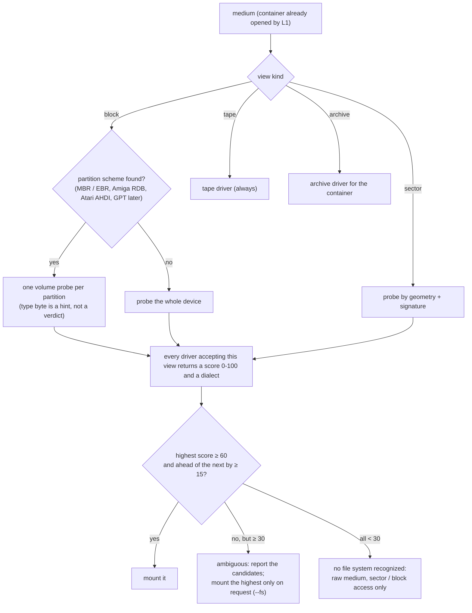

# Media library: one interface for every guest file system

| | |
|---|---|
| **Date** | 2026-10-05 |
| **Status** | Plan for review |
| **Architecture** | [library-architecture.md](library-architecture.md) (layers L2 views, L3 file systems, L4 builders) |
| **Today** | TR-DOS (read view + 3 add-file copies + 6 catalog parsers), FAT (reader + synthesis), tape catalog, ISO (with multi-source C5); nothing else ([current-state.md](current-state.md) §7) |

## 0. Summary

Every guest file system becomes a **driver** behind one interface. The driver gets a **media
view** (LBA blocks, CHS sectors, tape blocks or archive entries) and returns a **volume**. The
volume can list, read, write, create, delete and rename (as far as its capabilities allow), check
itself, and report where each file's bytes live (extents, for zero-copy composition). File metadata
has a common part and a typed per-family part, with a **ZX file header pivot**. Through the pivot,
a BASIC program with its autostart line survives TR-DOS → +3DOS → G+DOS → tape → host folder and
back.

Synthesizable file systems also offer a **builder**. With a builder, the multi-source composition
engine and the folder pipeline produce that file system from any union of sources. A host folder
or a mix of disks can then become a TRD, a +3 DSK, an MGT, an ADF or a D64 as easily as a FAT
volume today.

## 1. Media views (L2)

A file system never sees a container format; it sees one of four views.

| View | Addressing | Implemented over | Used by |
|---|---|---|---|
| `IBlockDevice` | LBA × 512 bytes | raw / HDF / HDI / VHD / CHD images, CD (2048 = 4 × 512), partitions (`SubRangeDevice`), composite volumes, raw sector images whose sectors are 512 | FAT, ISO, AmigaDOS (HDF, ADF), Atari ST, MSX-DOS, CP/M on hard disks |
| `ISectorDevice` | cylinder, head, sector id, native size (128-1024), with per-sector status (CRC error, deleted, missing) | `DiskImage` (any floppy container: TRD, FDI, UDI, TD0, DSK, MGT, HFE, SCP, …), plain sector images (ADF, D64, `.img`), an `IBlockDevice` with a declared geometry | TR-DOS, +3DOS / CP/M / AMSDOS, G+DOS, Opus, MB-02, MDOS, iS-DOS, CBM DOS (zone-dependent sectors per track) |
| `ITapeVolume` | ordered blocks with ROM-standard or custom timing | `TapeImage` (TAP, TZX, audio import) | tape "file system" (header + data pairs) |
| `IArchive` | named entries, no geometry | SCL, Hobeta, a +3DOS-headered file, a ZIP of images (later) | archive drivers |

A sector device reports what the medium really has: a protected disk with a missing sector or a
CRC error reads with that status. File-system drivers fail cleanly (`Corrupt`, with the C/H/S in
the report) instead of reading garbage. Weak bits and timing stay in `DiskImage`, which the
emulated FDC reads directly, below the view.

**Interleave and skew** belong to the view's geometry, not to the driver. A TR-DOS driver asks for
"logical sector 9 of track 0". The `DiskImage` adapter finds the sector with id 9 wherever the
interleave put it. CP/M's logical skew (`SKEW` in a disk definition) is applied by the CP/M driver,
because it is part of the CP/M disk parameters.

## 2. The volume interface (L3)

```cpp
namespace umedia::fs {

struct FsCapabilities
{
    bool write = false, create = false, remove = false, rename = false;
    bool directories = false;      ///< hierarchical (FAT, ISO, AmigaDOS, UniDOS, MSX-DOS 2, MB-02)
    bool longNames = false;
    bool caseSensitive = false;
    bool timestamps = false;
    bool contiguousFilesOnly = false;   ///< TR-DOS, Opus: files are one run of sectors
    bool userAreas = false;        ///< CP/M users 0-15
    bool zxHeaders = false;        ///< stores ZX type / start / length natively
    uint32_t maxNameBytes = 0, maxExtBytes = 0, maxEntriesPerDir = 0, maxFiles = 0;
    uint64_t maxFileSize = 0;
};

struct EntryInfo
{
    std::string name;              ///< display name, UTF-8 (decoded with the volume's code page)
    std::vector<uint8_t> nativeName;   ///< exactly as stored (round-trip, reports)
    EntryKind kind;                ///< File, Directory, Link, Volume label
    uint64_t size;                 ///< bytes of content (CP/M: records × 128 unless exact size is known)
    std::optional<int64_t> mtimeUtc;
    FileMeta meta;                 ///< §3
};

class IVolume
{
public:
    virtual const FsCapabilities& Capabilities() const = 0;
    virtual VolumeInfo Info() const = 0;                       // label, free space, file count, dialect
    virtual MediaResult List(std::string_view dir, const std::function<bool(const EntryInfo&)>& visit) = 0;
    virtual MediaResult Stat(std::string_view path, EntryInfo& out) = 0;
    virtual std::unique_ptr<IFileReader> Open(std::string_view path, MediaResult* result = nullptr) = 0;
    virtual std::optional<ExtentList> Extents(std::string_view path) = 0;   // zero-copy (block views)
    // writes (Unsupported / ReadOnlyVolume when the capability is off)
    virtual MediaResult Create(std::string_view path, const FileMeta& meta, IFileSource& data) = 0;
    virtual MediaResult Replace(std::string_view path, IFileSource& data) = 0;
    virtual MediaResult SetMeta(std::string_view path, const FileMeta& meta) = 0;
    virtual MediaResult Remove(std::string_view path) = 0;
    virtual MediaResult Rename(std::string_view from, std::string_view to) = 0;
    virtual MediaResult MakeDir(std::string_view path) = 0;
    virtual FsckReport Check() = 0;                              // read-only consistency check
    virtual MediaResult Repair(const RepairOptions&) { return Unsupported(); }
    virtual MediaResult Compact() { return Unsupported(); }      // TR-DOS MOVE, Opus, CBM VALIDATE
    virtual MediaResult Commit() = 0;                            // flush buffered metadata through the view
};

class IFsDriver
{
public:
    virtual std::string_view Id() const = 0;                     // "trdos", "fat", "cpm", "amiga-ffs", ...
    virtual ViewKind Accepts() const = 0;                        // which view(s) it mounts
    virtual ProbeScore Probe(const MediumView&) const = 0;       // 0..100 + the dialect it recognized
    virtual std::unique_ptr<IVolume> Mount(MediumView, const MountOptions&, MediaResult*) const = 0;
    virtual MediaResult Format(MediumView, const FormatOptions&) const = 0;
    virtual const NameRules& Names() const = 0;
    virtual const IVolumeBuilder* Builder() const { return nullptr; }   // synthesis (§6)
};
}
```

Paths are `/`-separated UTF-8 on every file system. File systems without directories have only `/`.
CP/M user areas appear as directories `/0` … `/15` (`/` lists user 0, as CP/M does). A tape volume
lists its files in order as `/001 name.B`, so names need not be unique.

## 3. Metadata: common part, family parts, and the ZX pivot

```cpp
struct ZxHeader                    // the pivot: what a ZX tape header can say
{
    ZxType type;                   // Program, NumberArray, CharArray, Code
    uint16_t length;
    uint16_t param1;               // Program: autostart line (≥ 32768 = none); Code: start address; arrays: variable name
    uint16_t param2;               // Program: program length without variables; Code: 32768
};

using FamilyMeta = std::variant<std::monostate,
    TrdosMeta,     // type letter (any byte), start, length, sectors; autostart line from the trailer
    Plus3Meta,     // +3DOS 128-byte header (issue, version, ZX header), CP/M attributes
    CpmMeta,       // user 0-15, F1-F4 user attributes, R/O, SYS, ARC, exact byte count (CP/M 3)
    GdosMeta,      // +D / DISCiPLE file type (1-11, snapshots, screens, opentype), ZX header, sector map
    AmigaMeta,     // protection bits (HSPA RWED), comment (≤ 79), days / minutes / ticks since 1978
    CbmMeta,       // type PRG / SEQ / USR / REL / DEL, locked, closed, REL record length
    FatMeta,       // attribute byte, create / access times, MSX-DOS 2 / Atari dialect flags
    IsoMeta,       // hidden, associated, file version, Rock Ridge mode (later)
    MicrodriveMeta,// record count, ZX header
    TapeMeta>;     // block index, pause, timing profile (turbo), headerless

struct FileMeta
{
    std::optional<ZxHeader> zx;    // filled by every ZX family driver, and by tape
    FamilyMeta family;
    uint8_t commonAttributes = 0;  // ReadOnly, Hidden, System, Archive (where the FS has them)
};
```

**Conversion through the pivot** (when copying between file systems):

| From \ To | TR-DOS | +3DOS | G+DOS | Tape | MB-02 / MDOS | FAT / host |
|---|---|---|---|---|---|---|
| ZX header available | type B / C / D: from `zx.type`; start / length from params; autostart written to the trailer | 128-byte header built from `zx` | directory header built from `zx` | header block built from `zx` | native header from `zx` | kept in the target's sidecar (§4) or wrapped (Hobeta, +3DOS header) per the copy option |
| no ZX header (a plain host file) | type from the extension map (`DiskTypeMap`: `.B` → B, `.scr` → C at 16384, else C at 32768), as the folder builder does | `zx` absent: a headerless CP/M file | type "opentype" | Code at 32768 | per the driver's default | plain file |

A **TR-DOS type letter that is not B / C / D / #** (games use any byte) is kept in `TrdosMeta` and
restored when copying TR-DOS → TR-DOS. The pivot only carries what other systems understand.

## 4. Host round-trip (extract to a folder and back)

Extracting to a host folder must not lose metadata, and building a medium from that folder must
restore it. One rule, three representations, chosen by the user (`--meta`):

| Mode | How metadata travels | Default for |
|---|---|---|
| `manifest` (default) | the folder manifest `.unreal-media.yaml` gets a `files:` entry per file (`name`, `type`, `start`, `line`, plus `family:` with the raw family fields, e.g. `trdos: {typeByte: 0x51}`, `amiga: {protect: "----rwed", comment: "..."}`); the host file holds the content only | every driver |
| `wrap` | the content is wrapped: Hobeta (`.$B`, `.$C` …) for TR-DOS, +3DOS header for +3, TAP (one header + data pair) for tape-family | ZX users who use other tools |
| `none` | content only; metadata lost (reported once) | dumping data files |

The folder pipeline already reads the manifest's `files:` entries and Hobeta wrappers. The
library makes the round trip lossless for every family and tests it per driver (`RoundTrip_Test`).

## 5. Name rules

`NameRules` is data, per driver (and dialect). The union builder and validators use it instead of
the FAT / ISO special cases in the multi-source design.

| File system | Stored form | Max | Case | Allowed / mapping | Uniqueness |
|---|---|---|---|---|---|
| TR-DOS | 8 bytes name + 1 byte type | 8 + 1 | as stored | printable ASCII kept, others → `_`, space-padded (`FolderDiskBuilder::CompatibleName`) | name + type; duplicates possible on real disks (kept, reported) |
| +3DOS / CP/M | 8.3, upper case, high bits = attributes | 8.3 | upper | `< > . , ; : = ? * [ ]` and space illegal | name + ext + user |
| AMSDOS | as CP/M | 8.3 | upper | as CP/M | as CP/M |
| FAT (all dialects) | 8.3 + LFN (UTF-16) | 255 | insensitive | `FatNameMapper` rules, code page per volume | case-folded long name |
| ISO 9660 / Joliet | d-chars 8.3 (L1) / 31 (L2) + Joliet UCS-2 64 | | upper / sensitive | multi-source DT-3 | per tree |
| G+DOS / UniDOS | 10 bytes, space-padded | 10 | as stored | printable | name |
| Opus | 10 bytes | 10 | as stored | printable | name |
| MB-02 (BS-DOS) | 10 bytes + ZX header | 10 | as stored | printable | name, per directory |
| MDOS (D40 / D80) | 10 bytes | 10 | as stored | printable | name |
| iS-DOS | 8 + 3 | 8 + 3 | as stored | printable | name + ext |
| Microdrive | 10 bytes | 10 | as stored | printable | name |
| AmigaDOS | Latin-1 (INTL: international case folding) | 30 | insensitive | `/` and `:` illegal | case-folded name, per directory |
| CBM DOS | PETSCII, `0xA0`-padded | 16 | as stored (PETSCII has its own case) | PETSCII table; `,` `:` `*` `?` `=` illegal in DOS commands | name |
| Tape | 10 bytes in the header | 10 | as stored | printable | none (sequence) |

## 6. Builders: synthesis from a union tree

A builder turns a union tree (from the multi-source engine: folders, other volumes, filters,
whiteouts) into a fresh medium of its file system. It generalizes the three builders that exist
today:

- `HostFolderFat`, which becomes `FatBuilder`;
- `FolderDiskBuilder`, which becomes `TrdosBuilder`;
- `FolderTapeBuilder`, which becomes `TapeBuilder`.

| Builder | Output view | Zero-copy | Notes |
|---|---|---|---|
| FAT (rebuild, graft) | `IBlockDevice` | ✓ extents (multi-source) | |
| ISO 9660 + Joliet | `IFrameSource` | ✓ | |
| TR-DOS | `DiskImage` (TRD geometry) | no: a floppy is at most 640 KB, built in memory once (as today) | 128 files, 2 544 free sectors on 80 × 2 |
| +3DOS / CP/M (any disk definition) | `DiskImage` | no | directory entries 64 (+3), extents by the DPB |
| G+DOS (MGT) | `DiskImage` | no | 80 directory entries, sector address maps |
| MB-02, MDOS, Opus, iS-DOS | `DiskImage` | no | tier 2 (§8) |
| Tape (TAP / TZX) | `TapeImage` | no | per-file pause, turbo profiles later |
| AmigaDOS OFS / FFS (ADF, HDF) | sector image or `IBlockDevice` | HDF: ✓ extents (FFS data blocks are raw); ADF: in memory | |
| CBM DOS (D64 / D71 / D81) | sector image | no | |

With builders for every family, **composition works across file systems**. Some examples:

- union of `game1.trd`, `game2.scl` and a host folder → one new TRD;
- the files of a FAT SD card image → a +3 DSK;
- a TAP file's files → a TRD.

The target's `NameRules`, capabilities and limits decide what fits; everything else is reported,
exactly as for FAT today. The multi-source decision trees DT-1…DT-7 become file-system neutral:
they take the target's rules from its driver instead of special-casing FAT and ISO.

## 7. Detection (probe)



Scores are evidence-based: hard signatures (FAT boot sector fields consistent with the size, TR-DOS
sector 9 id `#10`, `DOS\0`…`DOS\7` at Amiga block 0, BAM at 18/0 with the right DOS version byte,
`PLUS3DOS` header, `CD001`) count most. Directory plausibility (CP/M entries whose user is 0-15 or
`E5`, names in range, extents consistent) counts next, and geometry alone counts least. CP/M is
the classic ambiguous case: no signature, so its score is capped at 70 without a matching disk
definition. The probe tests (`Probe_Test.Corpus`) run every driver over every fixture and assert
that only the right one wins.

## 8. The driver catalog

**Where each driver lives** ([plugins-and-usage.md](plugins-and-usage.md) §1): the core ships
`fat` (with its dialects as data), `iso9660` and `hostfolder`. The ZX drivers (`trdos`, `scl`,
`hobeta`, `tape`, tier 2) form the ZX pack, `cpm` / `plus3dos` the CP/M pack, and tier 3 the
platform packs (in-tree or out-of-tree plugins). The interfaces are the same in every case.

Effort is in **developer days** for one experienced developer, including tests, oracles and docs.
The basis is LOC estimates at ~120-150 new lines per day for file-system code with tests (the rate
of the existing FAT reader and synthesizer). "Port" means moving and consolidating existing code.
Oracles are external tools used **only in tests**: executed as separate processes, never linked or
vendored, skipped when absent, installed in the CI image (test plan §4).

### Tier 1 — the emulator's own guests (needed to replace today's code and for the media panel)

| Driver | View | Dialects | Read | Write | Builder | LOC (est.) | Days | Oracle / reference |
|---|---|---|---|---|---|---|---|---|
| `trdos` | sector | TR-DOS 5.03 / 5.04T, 40 / 80 tracks, 1 / 2 sides; Scorpion / Pentagon variants | port | **new**: delete (mark `#01`), rename, `Compact` (MOVE), set type / start, label | port (`FolderDiskBuilder`) | 1 600 (−1 900 removed duplicates) | 10 | the real TR-DOS ROM through `trdostesthelper` (CAT, LOAD, MOVE); `tools/diskconverter` TR-DOS module during the overlap |
| `scl` (archive) | archive | SCL | port | port | ✓ | 300 | 2 | round trip with `trdos` |
| `hobeta` (archive) | archive | `$B` `$C` `$D` `$#`, 17-byte header + checksum | port | port | — | 200 | 1 | existing tests |
| `fat` | block | FAT12/16/32; dialects: MS-DOS, MSX-DOS 1 (media byte, no BPB), MSX-DOS 2, Atari ST (TOS boot checksum), Sprinter DSS (entry-0 rules), esxDOS / NextZXOS (no LFN on the firmware path) | port (`FatVolumeReader`) | **new**: in-place writer (cluster allocation, FAT copies, FSInfo, LFN, directory growth) — also lifts non-goal NG-8 of multi-source | port (synthesis, graft) | 2 400 | 15 | mtools, dosfstools `fsck.fat -n`, ChaN FatFs semantics; the guests (NedoOS, DSS) in acceptance |
| `iso9660` | block / frame | ISO L1-L3, Joliet, El Torito; Rock Ridge read later | port (C5) | — (read-only medium) | port (C5) | 0 new (C5) + 300 Rock Ridge | 2 | `isoinfo`, `xorriso` |
| `cpm` | sector / block | **driven by disk definitions** (cpmtools `diskdefs` format): +3DOS (`+3`), AMSDOS data / system, PCW, CP/M 2.2 / 3 generic, Profi CP/M HDD (DPB from the Profi BIOS, to be extracted in this phase), Sprinter CP/M (if any) | new | new: allocate blocks, extents, delete (`E5`), rename, user areas, attributes, CP/M 3 exact byte count and timestamps | ✓ | 2 200 | 14 | **cpmtools** (`cpmls`, `cpmcp`, `fsck.cpm`) with the same `diskdefs`; the +3 ROM (CAT, LOAD) through an emulator acceptance test |
| `plus3dos` header layer | over `cpm` | 128-byte `PLUS3DOS` header ↔ `ZxHeader` | new | new | — | 250 | 1.5 | +3 ROM |
| `tape` | tape | TAP / TZX: standard header + data pairs, headerless blocks, turbo blocks as opaque files | port (`TapeCatalogParser`) | new: insert / remove / reorder files, write back as TAP or TZX | port (`FolderTapeBuilder`) | 700 | 4 | `tzxlist` (fuse-utils), the 48K ROM LOAD in acceptance |
| `hostfolder` | — (host) | a host folder as a volume (read and S4 writes) | port | port (S4) | — | 300 | 2 | — |
| **Tier 1 total** | | | | | | **~7 950** | **~51.5** | |

### Tier 2 — other ZX disk systems (demand-driven; each one independent)

| Driver | View | Format facts (to confirm against the references in the driver's design note) | Read | Write | Builder | LOC | Days | Reference |
|---|---|---|---|---|---|---|---|---|
| `gdos` (+D / DISCiPLE G+DOS; UniDOS subdirectories as a dialect) | sector (MGT, 80 × 2 × 10 × 512) | directory on the first tracks, 80 entries × 256 bytes; each entry: type, name (10), sector count, first track / sector, sector address map, ZX header | new | new | ✓ | 1 400 | 9 | `.mgt` corpora, Fuse +D emulation, UniDOS docs |
| `opus` (Opus Discovery) | sector | 256-byte sectors, catalog on track 0; contiguous files | new | new | ✓ | 900 | 6 | Fuse Opus emulation, Opus manuals |
| `mb02` (MB-02 BS-DOS) | sector (HD, 1024-byte sectors) | FAT-like allocation, directories, ZX headers | new | new | ✓ | 1 600 | 11 | BS-DOS documentation, MB-02 disk corpora |
| `mdos` (Didaktik D40 / D80 MDOS) | sector (720 KB, 512-byte sectors) | FAT12-like allocation with ZX-specific directory entries | new | new | ✓ | 1 200 | 8 | MDOS documentation, D40 / D80 images |
| `isdos` (iS-DOS) | sector | to be specified from the iS-DOS sources / docs | new | new | ✓ | 1 300 | 9 | iS-DOS distribution disks |
| `microdrive` | archive / sector (MDR: 254 sectors × 543 bytes) | header + record per sector, files as record chains, ZX headers | new | new | ✓ | 900 | 6 | Fuse Microdrive emulation, `.mdr` corpora |
| **Tier 2 total** | | | | | | **~7 300** | **~49** | |

### Tier 3 — foreign file systems (the "and so on"; proves the abstraction)

| Driver | View | Format facts | Read | Write | Builder | LOC | Days | Oracle |
|---|---|---|---|---|---|---|---|---|
| `amiga` (AmigaDOS OFS / FFS, INTL, DirCache) | block (ADF 880 KB / 1.76 MB, HDF; `IPartitionScheme` RDB for hard disks) | 512-byte blocks; boot block `DOS\0`…`DOS\7`; root block in the middle; 72-slot hash tables; file header + extension blocks; OFS data blocks with 24-byte headers, FFS raw; bitmap blocks; names ≤ 30, comments ≤ 79; dates days / minutes / ticks since 1978-01-01 | new | new | ✓ | 2 600 | 17 | **amitools `xdftool`**, ADFlib (tests only) |
| `amiga-rdb` (partition scheme) | block | `RDSK` + `PART` + `FSHD` blocks | new | new | — | 500 | 3 | amitools `rdbtool` |
| `cbm` (CBM DOS: D64, D71, D81) | sector (zone-dependent: 21 / 19 / 18 / 17 sectors per track on D64) | BAM at 18/0, directory chain from 18/1, 2-byte track / sector links, PETSCII names (16), types PRG / SEQ / USR / REL / DEL | new | new (REL read-only in v1) | ✓ | 1 500 | 10 | VICE **`c1541`** |
| `atari-st` | block | FAT12 dialect of `fat` (boot sector checksum `#1234` for executable boot, 9-11 sectors per track) | via `fat` | via `fat` | via `fat` | 200 | 1.5 | mtools, Hatari images |
| `msx` | block | dialects of `fat` (MSX-DOS 1 / 2; DSK images 360 / 720 KB) | via `fat` | via `fat` | via `fat` | 250 | 2 | MSX DSK corpora, `openMSX` behaviour |
| **Tier 3 total** | | | | | | **~5 050** | **~33.5** | |

More (Apple DOS 3.3 / ProDOS, BBC DFS / ADFS, Oric Sedoric, SAM Coupé SAMDOS / MasterDOS, Amstrad
PCW CP/M variants, TRS-80) follow the same template: a view, a driver with dialects, an oracle, a
round-trip test. Each new driver is a separate work item. SAMDOS and MasterDOS are the nearest
candidates for this emulator's audience, because the SAM Coupé is a Spectrum relative and its
disks are MGT-shaped.

### Partition schemes

| Scheme | Read | Write (synthesis) | Days | Notes |
|---|---|---|---|---|
| MBR + EBR | port (multi-source `PartitionedDisk`) | port | 0 | |
| Amiga RDB | new | new | 3 | listed above |
| Atari AHDI | new | — | 2 | tier 3 |
| GPT | new | new | 3 | later, when a guest needs it |
| Sprinter / Profi custom tables (if any) | to be researched in X7 | | — | the Profi CP/M HDD layout is researched with the `cpm` driver |

## 9. Cross-file-system operations

| Operation | API | Behaviour |
|---|---|---|
| Copy file | `fs::Copy(srcVol, path, dstVol, path, CopyOptions)` | content streams from the source; metadata through the pivot (§3); name through the target's `NameRules` (`onBadName`: skip / replace / fail); `NoSpace` / `NameNotStorable` reported per file |
| Copy tree | `fs::CopyTree(...)` | the union builder with one layer; flat targets (TR-DOS, tape) flatten paths (`/GAMES/elite.B` → `elite.B`) with a collision rule |
| Convert medium | `fs::Convert(srcMedium, targetFs, targetContainer)` | mount the source, then build the target with its builder from a one-layer union; e.g. `elite.tap` → `elite.trd`, `disk.trd` → `disk.mgt`, a FAT folder → `.dsk` |
| Compose | multi-source engine | any readable volumes as layers, any builder as target |
| Diff | `fs::Diff(volA, volB)` | file-level comparison (names, metadata, content hashes); used by the S4 planner and by the CLI |

Content moves through `IFileReader` / `IFileSource` streams with a 64 KiB buffer. When both sides
are block-based and the target is a composite, extents are used instead and nothing is copied.

## 10. Write safety for in-place volumes

Writing into a mounted image (FAT in-place, TR-DOS delete, CP/M) goes through the view.

| Medium | What protects it |
|---|---|
| A medium in a slot | the session change layer (as today): the volume writes into the layer, and the source file changes only on save / flatten |
| An image file opened directly by a tool (CLI, Python) | `JournaledDevice`: the S3 journal mechanism generalized to any view. Old sectors are journaled before the first overwrite, and `Commit()` drops the journal; `--no-journal` for scratch copies |
| Floppy images (`DiskImage` in memory) | the whole image is in memory; the container is serialized to a temp file and renamed over the original on commit (as `FloppyFormats::Save` does) |

`Check()` runs before and after every write in tests, and before every commit in tools
(`--no-check` to skip on large volumes).
