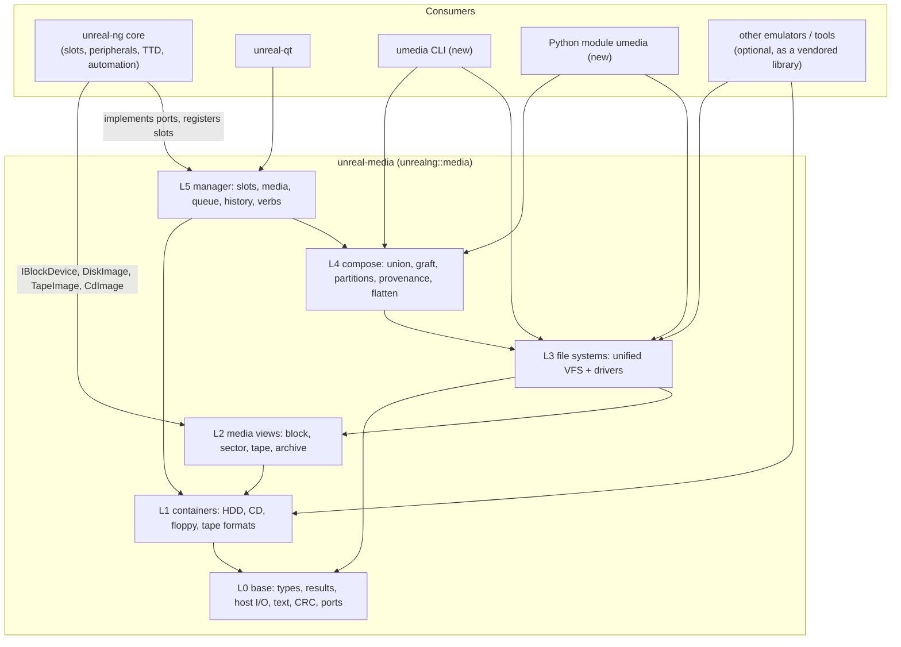
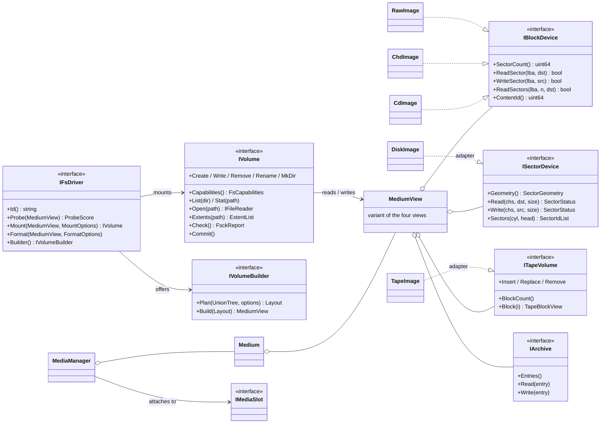

# Media library: target architecture

| | |
|---|---|
| **Date** | 2026-10-05 |
| **Status** | Plan for review. Executed after the multi-source media work (C0-C9) is integrated and fully tested |
| **Inputs** | [current-state.md](current-state.md) (measured), the storage manager and multi-source designs |
| **Next** | [filesystem-unification.md](filesystem-unification.md), [api-and-integration.md](api-and-integration.md), [extraction-plan.md](extraction-plan.md) |

## 0. Summary

**unreal-media** (`libunrealmedia`, CMake target `unrealng::media`, namespace `umedia`) is a
standalone C++20 library. It holds everything about storage media that is not emulation:

- the containers: block, optical, floppy and tape images;
- the guest file systems behind one unified interface, from TR-DOS and FAT to CP/M, MSX-DOS and
  AmigaDOS;
- the folder pipeline and the multi-source composition engine;
- the media manager core (slots, media, queue, dispositions, history);
- the media verbs every automation surface speaks.

It knows nothing about Z80s, frames or Qt. Platform-specific formats, file systems and tape codecs
live in **platform packs** loaded as static or dynamic plugins ([plugins-and-usage.md](plugins-and-usage.md)).
The emulator plugs into it through a handful of small
**ports** (host state, recording guard, events, logging, configuration). The same library powers a
command-line tool (`umedia`) and a Python module (`umedia`), which replace `tools/diskinfo` and
`tools/diskconverter`.

Design rules:

1. **No dependency on the emulator**, checked by the build: the library's CMake project cannot see
   `core/src`, and a CI job builds it alone.
2. **Layered**, with dependencies only downward (§2). Each layer is its own CMake component, so a
   tool that only reads TRD files links only what it needs.
3. **One interface per concept**: a block device, a sector device, a tape volume, a file-system
   volume, a medium, a slot. No format is special-cased above its own module.
4. **Zero-copy and zero-cost** as in the multi-source design: extents instead of copies, and no
   cost on the emulator's hot path that was not there before (A/B gated).
5. **MIT license** (owner decision), so any emulator or tool can use it.

## 1. Where it sits



## 2. Layers and modules

| Layer | Module (CMake component) | Contents | From today's code |
|---|---|---|---|
| **L0** | `umedia-base` | `Result` / `MediaError` / `MediaResult`, enums (`MediaKind`, `AccessMode`, …), `ContentId` hashing, CRC-16-CCITT / CRC-32 / EDC, text and code pages (UTF-8 / UTF-16 / CP866 / CP1251 / Amiga Latin-1 / PETSCII tables), host path and file I/O helpers (the 12 `filehelper` functions used today), `HexDump`, the **ports** (`ILogSink`, `IConfigSource`, `IMachineHost`, `IRecordingGuard`, `IMediaEventSink`, `IMediaReadJournal`), `Doc` (a neutral tree for replies) + JSON writer | `mediatypes.*`, `unicodehelper.*`, parts of `filehelper`, `stringhelper`, `fdc.h` CRC, `mediareadjournal.h` |
| **L1** | `umedia-block` | `IBlockDevice`, `RawImage` (raw, HDF, HDI, fixed VHD), `MemoryDisk`, `SessionWriteMap`, `ReadOnlyGuard`, `HostWriteHold`, `MediaReadTap`, `HddImageFormats`, `BlockFormats` (+ VHD writer), `SubRangeDevice` | `io/storage/` root, `media/blockformats.*` |
| L1 | `umedia-chd` | CHD v3-v5 read, v5 write, codecs (zlib, zstd, LZMA, Huffman, FLAC, CD codecs) | `io/storage/chd/` |
| L1 | `umedia-optical` | `CdImage`, `IFrameSource`, ECC / EDC, ISO / CUE / BIN / CD-CHD formats, audio folder disc, audio decoder | `io/storage/cd/` |
| L1 | `umedia-floppy` | `DiskImage` (tracks, raw MFM / FM bytes, sectors, weak bits, dirty tracking), `TrackFormatSpec` presets, flux PLL / MFM / FM codecs, the 11 floppy container formats as context-free `Parse` / `Serialize`, `FloppyFormats` registry | `io/fdc/diskimage.*`, `flux/`, `mfm_parser.h`, `loaders/disk/` |
| L1 | `umedia-tape` | the platform-neutral tape model (`TapeImage`, data blocks with an encoding id, `TapeSignal`) and the **codec registries** (`ITapeCodec` for files, `ITapeEncoding` for bytes ↔ pulses); no format and no platform encoding in the core ([plugins-and-usage.md](plugins-and-usage.md) §2.1). TAP / TZX / PZX / CSW and the ZX encodings go to the ZX pack | `io/tape/tapetypes.h`, `loaders/tape/` (split: model → core, formats → ZX pack), `tapecatalog.*` → ZX pack's tape driver |
| **L2** | `umedia-views` | the **media views** every file system reads through: `IBlockDevice` (LBA × 512), `ISectorDevice` (cylinder / head / sector with native sector sizes; adapters over `DiskImage`, over raw sector images and over an `IBlockDevice`), `ITapeVolume` (a sequence of blocks; adapter over `TapeImage`), `IArchive` (a file container without geometry: SCL, Hobeta, +3DOS-headered file, TAP as archive), `IPartitionScheme` (MBR / EBR, Amiga RDB, later GPT, Atari AHDI) | new; wraps L1 |
| **L3** | `umedia-fs` | the unified **VFS**: `IFsDriver`, `IVolume`, `IFileReader` / `IFileWriter`, `FileMeta` + per-family metadata, `NameRules`, `FsCapabilities`, `FsckReport`, the driver registry, cross-file-system `Copy` / `Convert` | `FatVolumeReader`, `TrdosCatalog` and the three TR-DOS add-file copies, `TapeCatalogParser` (as a volume), `Iso9660Reader` (C5) — all re-homed as drivers |
| L3 | `umedia-fs-<name>` | one module per driver family (`fat`, `trdos`, `cpm`, `iso9660`, `tape`, `hostfolder`, `mb02`, `mdos`, `gdos`, `opus`, `isdos`, `microdrive`, `amiga`, `cbm`, …) | see [filesystem-unification.md](filesystem-unification.md) §5 |
| **L4** | `umedia-compose` | `IFileTreeSource` (now just a view over any `IVolume`), union tree, union builder, validators, **volume builders** for every synthesizable file system (FAT, ISO, TR-DOS, TAP / TZX, CP/M, …), graft, `PartitionedDisk`, provenance, attribution, flatten strategies S1-S4, the folder pipeline (`FolderSnapshot`, manifests, service-file filter) | `io/storage/hostfolder/`, the multi-source C1-C8 code |
| **L5** | `umedia-manager` | `MediaManager`, `Medium`, `IMediaSlot` + `SlotDescriptor`, `MediaFormatRegistry`, `MediaConfig` (over `IConfigSource`), `MediaTargets`, `BlockAdvisory`, `IMediaHistory`, and the verbs (`MediaControl`) producing `Doc` replies | `emulator/media/` minus `modelswitch` |

**Dependency rules** (checked in CI by a script over the include graph, X1):

- A module includes only its own headers, the public headers of lower layers, and its third-party
  dependencies.
- L3 drivers depend on L2 views and L0, never on a specific L1 format: a TR-DOS driver works on any
  `ISectorDevice`, whether it comes from TRD, SCL-expanded, FDI, UDI, TD0, HFE or SCP.
- L4 depends on L3 interfaces only (plus the builders it registers).
- L5 depends on everything below but on no driver directly: drivers are found through the registry.

## 3. Directory layout

```
libs/unreal-media/                       # own CMake project (like opl4 / eve-emu)
  CMakeLists.txt                         # project(unreal-media VERSION 1.0.0); options UMEDIA_BUILD_TESTS/BENCHMARKS/TOOLS/PYTHON
  cmake/UnrealMediaConfig.cmake.in       # find_package support
  include/umedia/                        # public headers, by module
    base/ block/ chd/ optical/ floppy/ tape/ views/ fs/ fs/<driver>/ compose/ manager/
  src/                                   # private sources, mirroring include/
  third_party/                           # used only when the parent project has no such target
    zstd/ liblzma/ miniz/ digestpp/ rapidyaml/ minimp3/ dr_flac/
  tests/                                 # gtest, own executable umedia-tests
    _helpers/ (fatimagebuilder, isoimagebuilder, tzxtapebuilder, scratch paths, oracles)
    <module>/...
  fuzz/                                  # libFuzzer harnesses per parser
  benchmarks/                            # google benchmark, umedia-benchmarks
  packs/zx/ packs/cpm/                   # first-party platform packs (static and dynamic builds)
  plugin-abi/                            # umedia/plugin_abi.h, umedia_c.h (C facade)
  samples/                               # reference integrations R2-R15
  tools/umedia/                          # the CLI
  python/                                # pybind11 module
  docs/                                  # library docs (moved from docs/file-formats + new FS specs)
```

`libs/` is a new top-level folder for in-tree libraries meant to be usable on their own. The
emulator adds it with `add_subdirectory(libs/unreal-media)`, as it adds eve-emu today, and
`UNREAL_MEDIA_DIR` can point to an external checkout. Moving the library into its own repository
is an option for later (X11), not a goal of the extraction.

## 4. Core types and how they relate



**Medium vs view vs volume:**

- A **Medium** is what sits in a slot. It has a source, an access mode, a change layer and one
  container object.
- A **view** is how a file system or a peripheral addresses that medium: LBA sectors, CHS sectors,
  tape blocks or archive entries.
- A **volume** is a mounted file system over a view. A medium can carry several volumes (one per
  partition) or none (a raw disk with no recognized file system).

Peripherals use views directly: an ATA disk uses `IBlockDevice`, the WD1793 uses `DiskImage`
tracks, the tape deck uses `TapeImage`. Volumes are for everything that reasons about files:
automation, the media panel's file view, composition, flatten, the TR-DOS fast-load trap, the CLI.

## 5. Threading and ownership model

| Object | Thread rule |
|---|---|
| Containers, views | single-threaded per instance; the emulator uses them on its emulation thread, tools on any one thread |
| `IVolume` | single-threaded per instance; a volume over a medium that a slot is using is opened through the manager (`MediaManager::OpenVolume(slot)`), which hands out a volume over a **frozen view** (the change layer at that moment) for reading, or queues writes to be applied at the next frame boundary |
| `MediaManager` | as today: requests from any thread, applied on the emulation thread at the frame boundary through `IMachineHost`; internal recursive mutex |
| Builders, scans, flatten | off the emulation thread, cancellable, with progress (as `FolderSnapshot` today) |
| Ports | called on the thread the manager runs on; implementations must be cheap and non-blocking (`IMediaEventSink` queues) |

Ownership: `std::unique_ptr` for containers inside a `Medium`, `std::shared_ptr` only where a
source is shared (`SourcePool`, CHD parents). Views and volumes never own their medium; the manager
keeps a medium alive while any volume over it is open (a reference count on the `Medium`), and an
eject waits for or refuses open writers (`MediaError::InUse`).

## 6. Error model

One `MediaResult` (error code, message, report lines) everywhere, as today, extended with the codes
file systems need:

| New code | Meaning |
|---|---|
| `NotFound` | path or entry does not exist |
| `Exists` | create over an existing entry without `overwrite` |
| `NoSpace` | the volume is full (blocks, directory slots, catalog entries) |
| `NameNotStorable` | the name cannot be represented on this file system (FAT illegal characters, TR-DOS 8 + 1, CP/M 8.3, Amiga 30 characters) |
| `ReadOnlyVolume` | the driver or the medium is read-only |
| `Corrupt` | structures are inconsistent; `Check()` explains |
| `Unsupported` | the driver lacks this capability (rename on a tape volume) |

Error codes map to HTTP statuses as today (`MediaErrorHttpStatus`).

## 7. Versioning and compatibility

- Semantic versioning of the library (`1.0.0` at the first release from X5). The emulator pins the
  in-tree version; an external checkout must satisfy `find_package(UnrealMedia 1.0 REQUIRED)`.
- **Source compatibility** for the emulator during the move: the old include paths
  (`emulator/media/mediamanager.h`, `emulator/io/storage/iblockdevice.h`, …) stay as one-line
  forwarding headers until X6 ends, then are removed in one commit.
- No ABI promise across minor versions (static library, C++ API). The Python module and the CLI
  version with the library.
- The on-disk formats the library defines (S2 delta, S3 journal, descriptors, manifests) carry a
  version field and are read by every later version.
