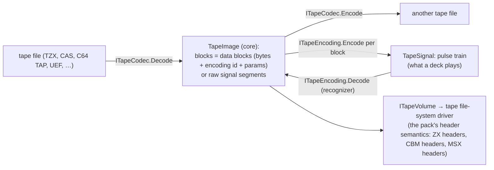
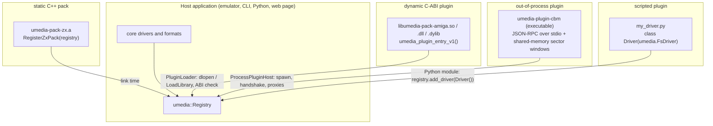

# Media library: platform packs, plugins and usage schemes

| | |
|---|---|
| **Date** | 2026-10-05 |
| **Status** | Plan for review |
| **Owner decision (P-1)** | Platform-specific file systems and formats may live **outside** the library, as wrappers / plugins. The library core stays platform-neutral |
| **Related** | [library-architecture.md](library-architecture.md), [filesystem-unification.md](filesystem-unification.md), [reference-integrations.md](reference-integrations.md) |

## 0. Summary

The library splits into a **platform-neutral core** and **platform packs**:

- The core holds the media model, views, the VFS, the generic containers and file systems
  (raw / CHD / VHD hard disks, CD formats, the generic floppy model with HFE / SCP / IMD / TD0 /
  DSK / raw images, FAT, ISO 9660, MBR / GPT, host folders), composition and the manager.
- Everything specific to one platform family is a pack: ZX Spectrum, CP/M machines, Amiga,
  Commodore, MSX, Atari, …

A pack registers **extensions** (container formats, file-system drivers, partition schemes,
archives, volume builders, name rules, code pages, metadata schemas) through one registry. It can
be delivered four ways:

- **static C++** (linked in);
- **dynamic C ABI** (a shared library loaded at run time; any compiler or language);
- **out-of-process** (a helper executable, for crash isolation or drivers in other runtimes);
- **scripted** (Python, for prototyping and archival tooling).

The library itself is used in nine schemes (§4), from "just open this CHD" to a full media manager
inside an emulator. Reference integrations for the common emulator and platform types are designed
in [reference-integrations.md](reference-integrations.md).

## 1. Core and packs

| Component | Home | Why there |
|---|---|---|
| L0 base, L1 block / CHD / optical, generic floppy model (`DiskImage`, flux, MFM / FM) | **core** | every platform needs them |
| Generic floppy containers: HFE, SCP, IMD (new), TD0, DSK / EDSK, raw sector images (`.img`, `.ima`, `.st`, `.adf` as raw) | **core** | multi-platform formats |
| **Tape model and codec registry** (no format, no platform encoding): `TapeSignal` (pulse train on a time base, levels, pauses), the generic block layer (data block = bytes + encoding id + encoding parameters), `ITapeCodec` / `ITapeEncoding` registries (§2.1) | **core** | every platform's tape is different, so the core holds only the model |
| FAT12 / 16 / 32 (+ dialects as data), ISO 9660 / Joliet / El Torito, host folder | **core** | multi-platform, and the composition engine's main targets |
| Partition schemes MBR / EBR, GPT | **core** | multi-platform |
| L4 composition, L5 manager, VFS, registry, plugin loader | **core** | |
| **ZX pack** `umedia-pack-zx`: TRD, SCL, FDI, UDI, Hobeta, MGT, MDR containers; tape codecs TAP, TZX, PZX, CSW and the ZX ROM / turbo encodings; TR-DOS, +3DOS header layer, G+DOS / UniDOS, Opus, MB-02, MDOS, iS-DOS, Microdrive, tape volume; ZX file header pivot; `DiskTypeMap` | **first-party pack, in-tree**, linked statically by unreal-ng | ZX-specific |
| **CP/M pack** `umedia-pack-cpm`: the disk-definition-driven CP/M driver and its dialects (+3, AMSDOS, PCW, Profi HDD, generic) | first-party pack, in-tree | shared by several platforms (ZX +3, Profi, CPC, PCW, MSX CP/M) |
| Amiga pack (OFS / FFS, RDB, ADF / ADZ / HDF), CBM pack (D64 / D71 / D81 / G64 / P64, CBM DOS, GCR, IDEDOS, SD2IEC; tape codecs C64 TAP and T64), MSX pack (MSX-DOS dialects, DMK / XSA, Nextor rules; CAS + FSK), CPC pack (AMSDOS, disk definitions, CDT + CPC ROM encoding), BBC pack (DFS, ADFS, SSD / DSD / ADF / ADL, MMB; UEF + Acorn FSK), Apple II pack (DOS 3.3, ProDOS, DSK / PO / NIB / WOZ / 2MG / HDV, 6-and-2 GCR), Atari pack (TOS FAT dialect, AHDI / ICD, ST / MSA / DIM / STX), SAM Coupé pack (SAMDOS / MasterDOS) — designs in [reference-integrations.md](reference-integrations.md) R5-R10 | packs, **in-tree or out-of-tree** as their maintainers choose | foreign platforms |

What moves out of the earlier catalog: the ZX formats listed in
[filesystem-unification.md](filesystem-unification.md) §8 tiers 1-2 live in the ZX pack, CP/M in
the CP/M pack, and tier 3 in their platform packs. The FAT dialects for MSX and Atari stay in the
core `fat` driver as data (boot-sector quirks), and their packs only add the platform's containers
and defaults. The ZX pack is still built and tested in the same repository and CI as the core,
because unreal-ng depends on it.

## 2. Extension points

Every extension is an interface with a stable C++ form (static packs) and a C ABI form (dynamic
and out-of-process packs).

| Extension point | C++ interface | Registered as | Example |
|---|---|---|---|
| Container format | `IContainerFormat`: `Probe(bytes, size) → score`, `Open(source, access) → Medium`, `Create(spec)`, `Save(medium, target)` | `Registry::AddContainer` | TRD, ADF, D64, STX |
| Tape container codec | `ITapeCodec` (§2.1) | `Registry::AddTapeCodec` | TZX, CAS, C64 TAP, UEF |
| Tape signal encoding | `ITapeEncoding` (§2.1) | `Registry::AddTapeEncoding` | `zx.rom`, `msx.fsk`, `cbm.pulse` |
| Floppy track encoding | `ITrackEncoding` (§2.2) | `Registry::AddTrackEncoding` | `ibm.mfm` (core), `cbm.gcr`, `apple.gcr62`, `amiga.mfm` |
| File-system driver | `IFsDriver` (filesystem-unification §2) | `Registry::AddDriver` | TR-DOS, OFS / FFS |
| Partition scheme | `IPartitionScheme`: `Probe`, `Partitions(view)`, `Write(table)` | `Registry::AddPartitionScheme` | Amiga RDB, Atari AHDI |
| Archive format | `IArchiveFormat` | `Registry::AddArchive` | SCL, Hobeta, LHA (Amiga), T64 (CBM) |
| Volume builder | `IVolumeBuilder` | through its driver | TR-DOS builder, ADF builder |
| Name rules / code page | `NameRules`, `CodePageTable` | `Registry::AddCodePage` | PETSCII, Amiga Latin-1, KOI-7 |
| Metadata schema | `MetaSchema` (namespaced keys with types, docs, defaults) | `Registry::AddMetaSchema` | `amiga.protect`, `cbm.type`, `zx.header` |
| Header pivot converters | `IMetaPivot` (family ↔ pivot) | `Registry::AddPivot` | ZX header ↔ +3DOS / G+DOS / TR-DOS |
| Slot / medium kind hints | `MediaKindHint` (which slot kinds a container suits) | `Registry::AddKindHint` | ADF → floppy, HDF → hard disk |

### 2.1 Tape codecs

Tape formats and tape signals differ on every platform, so the core carries no tape format at all.
Two kinds of codec plugins, in the style of media codecs:

| Plugin kind | Interface | Converts | Examples |
|---|---|---|---|
| **Container codec** | `ITapeCodec`: `Probe(bytes)`, `Decode(bytes) → TapeImage`, `Encode(TapeImage) → bytes`, `Capabilities()` (lossless signal, block-level only, which encodings it can store) | a tape **file** ↔ the neutral `TapeImage` | ZX TAP, TZX, PZX, CSW; C64 TAP, T64; MSX CAS; CPC CDT; BBC UEF |
| **Signal encoding** | `ITapeEncoding`: `Encode(DataBlock, params) → TapeSignal`, `Decode(TapeSignal span) → DataBlock + params` (with a confidence), `Describe(params)` | **bytes** ↔ **pulses** for one platform's loader | ZX ROM loader (pilot, sync, 0 / 1 pulse lengths), ZX turbo profiles, Kansas City / MSX FSK 1200 / 2400 baud, CBM pulse widths and checksums, CPC ROM, BBC 1200 baud |



**What follows:**

- The emulator's tape deck plays a `TapeSignal`, so it never needs to know the format.
- Converting between formats of one platform goes through `TapeImage`. Converting a recording
  ("decode the pulses") goes through the encodings' recognizers.
- A **tape file system** is per platform as well: the ZX pack's tape driver understands ZX header
  blocks, the CBM pack's understands CBM headers, and so on. All of them read through
  `ITapeVolume`.
- A codec states what it can hold losslessly. Saving a TZX turbo block as plain TAP is refused or
  reported (as `FloppyFormats::Save` retargets to UDI today), never silently degraded.

Today's `TapeImage` is ZX-shaped: ROM-standard blocks, turbo timing profiles, pulse trains. In the
core it keeps its three block forms, but "ROM-standard" becomes "a data block with the encoding
`zx.rom`", and the timing profile becomes that encoding's parameters. The ZX pack registers TAP /
TZX / PZX / CSW and the ZX encodings. That generalization is part of phase X3.

### 2.2 Floppy track encodings and nested media

The same codec idea applies to floppy tracks. `DiskImage` gains a bit-cell track form (`BitTrack`)
next to today's MFM / FM byte tracks. An **`ITrackEncoding`** plugin converts between sectors and
track bits:

- IBM MFM / FM stay in the core;
- CBM GCR, Apple 6-and-2 GCR and Amiga MFM come from the packs.

The emulated drive reads bits or bytes; file-system drivers read sectors through the encoding.
**Nested media** (`OpenNested(volume, path)`) opens an image stored as a file inside a mounted
volume, such as a D64 on an SD2IEC card or DFS disks in an MMB, as a medium of its own, reading
through the file's extents. Both are designed with the platform integrations in
[reference-integrations.md](reference-integrations.md) R5-R10.

**Extensible metadata.** A closed `std::variant` cannot grow from outside the library, so the
family metadata of filesystem-unification §3 becomes a **namespaced property bag**:

```cpp
struct FileMeta
{
    std::optional<ZxHeader> zx;               // pivot kept typed: the ZX pack registers it
    uint8_t commonAttributes = 0;
    MetaBag ext;                               // {"trdos.typeByte": 0x51, "amiga.protect": "----rwed", "amiga.comment": "..."}
};
// typed accessors live in each pack: zx::TrdosMeta::From(meta), amiga::Protection::Get(meta), ...
```

Each pack registers its keys with types and documentation (`MetaSchema`). The host round-trip
manifest (filesystem-unification §4) stores the bag under `family:`, so even an unknown pack's
metadata survives extraction and rebuild. Keys a reader does not know are kept and written back
unchanged.

## 3. Plugin delivery



| Delivery | When to use | Cost per call | Isolation | Language | ABI stability |
|---|---|---|---|---|---|
| **Static C++** | first-party packs, embedded / WASM builds, maximum speed | a virtual call | none | C++20, same compiler | source-level |
| **Dynamic C ABI** | packs shipped separately, other compilers, Rust / Zig / C drivers, closed-source drivers | a function-pointer call + view callbacks | none (same process) | any with a C ABI | **binary-stable**, versioned |
| **Out-of-process** | crash isolation for untrusted or experimental drivers; drivers wrapping an existing tool or runtime (a Java / .NET / Python implementation, an external disk utility) | IPC per request; sector data through a shared-memory window (one copy) | full (separate process; can be sandboxed) | any | protocol-versioned |
| **Scripted (Python)** | prototyping a new driver, preservation scripts, one-off formats | Python call | none | Python | module-level |

### 3.1 The C ABI (dynamic plugins and the C facade)

```c
/* umedia/plugin_abi.h */
#define UMEDIA_PLUGIN_ABI_VERSION 1

typedef struct umedia_block_view_v1 {           /* host → plugin: a view to read / write */
    uint32_t struct_size;
    void*    ctx;
    uint64_t (*sector_count)(void* ctx);
    int      (*read)(void* ctx, uint64_t lba, uint32_t count, uint8_t* dst);
    int      (*write)(void* ctx, uint64_t lba, uint32_t count, const uint8_t* src);
} umedia_block_view_v1;
/* umedia_sector_view_v1 (C/H/R/N addressing, status), umedia_tape_view_v1, umedia_archive_view_v1: same pattern */

typedef struct umedia_fs_driver_v1 {
    uint32_t    struct_size;
    const char* id;                   /* "amiga-ffs" */
    uint32_t    accepts;              /* UMEDIA_VIEW_BLOCK | UMEDIA_VIEW_SECTOR | ... */
    int  (*probe)(const umedia_view_v1* view, umedia_probe_result_v1* out);
    int  (*mount)(const umedia_view_v1* view, const umedia_mount_opts_v1* opts, void** volume);
    void (*unmount)(void* volume);
    int  (*list)(void* volume, const char* dir, umedia_entry_cb_v1 cb, void* user);
    int  (*read)(void* volume, const char* path, uint64_t offset, uint8_t* dst, uint64_t size, uint64_t* got);
    int  (*create)(void* volume, const char* path, const umedia_meta_v1* meta, umedia_source_v1* data); /* optional: NULL */
    int  (*remove)(void* volume, const char* path);      /* optional */
    int  (*rename)(void* volume, const char* from, const char* to);   /* optional */
    int  (*check)(void* volume, umedia_report_cb_v1 cb, void* user);
    int  (*commit)(void* volume);
} umedia_fs_driver_v1;

typedef struct umedia_plugin_v1 {
    uint32_t    abi_version;          /* UMEDIA_PLUGIN_ABI_VERSION */
    const char* id;                   /* "pack-amiga" */
    const char* version;              /* "1.2.0" */
    uint32_t    driver_count;   const umedia_fs_driver_v1*        drivers;
    uint32_t    container_count;const umedia_container_v1*        containers;
    uint32_t    scheme_count;   const umedia_partition_scheme_v1* schemes;
    uint32_t    schema_count;   const umedia_meta_schema_v1*      schemas;
} umedia_plugin_v1;

/* the one exported symbol */
UMEDIA_PLUGIN_EXPORT const umedia_plugin_v1* umedia_plugin_entry_v1(const umedia_host_api_v1* host);
```

Rules:

- **Versioning.** Every struct starts with `struct_size`, so later versions append fields and old
  plugins keep working. `abi_version` changes only on an incompatible change. The loader refuses a
  plugin with a newer ABI than it knows.
- **Memory and errors.** The plugin owns its memory. Strings and buffers passed in are valid only
  during the call. Errors are `umedia_error_t` codes (the same set as `MediaError`) plus a message
  through `host->set_error(...)`.
- **Threading.** Calls on one volume come from one thread at a time, the same contract as the C++
  `IVolume`.
- **The C++ side** wraps every C table in an adapter (`CFsDriverAdapter`), so the rest of the
  library sees an ordinary `IFsDriver`.

The same ABI header is the basis of the **C facade** (`umedia_c.h`: opaque handles for open, probe,
mount, list, read, write, compose, and the block / sector view of a medium). Emulators written in C
use the facade, and so do bindings in other languages (Rust `umedia-sys`, C#, Go, JS via WASM).

### 3.2 Out-of-process plugins

- **Transport.** The plugin is an executable started by `ProcessPluginHost`. Requests and replies
  are JSON-RPC 2.0 lines on stdio, with the same verbs as the C ABI.
- **Sector data.** A shared-memory window (`shm_open` / `CreateFileMapping`, 1 MiB) carries sector
  data, so a 512-byte read is one copy, not JSON.
- **Handshake.** The plugin reports its manifest (id, version, provided extensions). The
  host checks the protocol version.
- **Crashes.** A plugin crash fails the current operation with `IoError("plugin crashed")`. Volumes
  from that plugin are invalidated, and the host restarts the plugin lazily.
- **Cost.** Measured in the benchmark set. The expected order is tens of microseconds per request,
  which suits tools and catalogues, not an emulator's hot path. Emulators use static or dynamic
  packs for media that a guest reads.

### 3.3 Discovery and trust

| Rule | Detail |
|---|---|
| Search paths | the application's own plugin folder, then `UMEDIA_PLUGIN_PATH` entries; never the folder of an opened medium |
| Opt-in | dynamic and process plugins load only when the host enables them (`PluginLoader::Enable(paths)`); unreal-ng: `[MEDIA] plugins=` in the config and a Qt settings page |
| Manifest check | id, version, ABI / protocol version, provided extensions shown in `umedia plugins` and the media panel |
| Conflicts | two providers of the same id: the first loaded wins, and the conflict is reported; core extensions cannot be replaced unless the host allows overrides |
| Fuzzing | the C-ABI adapter and the process host are fuzz targets (malformed plugin replies must not crash the host) |

## 4. Usage schemes

| # | Scheme | Modules used | Ports implemented by the host | Typical host |
|---|---|---|---|---|
| **U1** | **Full media manager** inside an emulator: slots, queue at frame boundaries, dispositions, composition, TTD hooks, media verbs | all | `IMachineHost`, `IRecordingGuard`, `IMediaEventSink`, `ILogSink`, `IConfigSource`, `IMediaReadJournal` | unreal-ng (R1) |
| **U2** | **Containers only**: the emulator keeps its own media handling and peripherals and uses the library to read and write image formats | L0, L1 floppy / tape / block, packs | none (`ILogSink` optional) | an emulator with its own FDC that wants more formats (R2, R3, R5-R10) |
| **U3** | **Block provider**: the emulator's IDE / SD / SCSI / hardfile model reads an `IBlockDevice` the library builds (CHD, VHD, a host folder as FAT, a composite) | L0, L1 block, L4 compose, `fat` | none | any emulator with a hard disk or card (R2-R10, R12) |
| **U4** | **File access only**: list / extract / add files in images; no emulation | L0-L3, packs | none | file managers, disk explorers, the `umedia` CLI, GUI tools |
| **U5** | **Image building in a toolchain**: build media from a descriptor or folder as a build step | L0-L4, packs, CLI or CMake functions | none | homebrew toolchains (R13) |
| **U6** | **Batch analysis**: probe, list, hash and classify large image collections | L0-L3, Python module | none | preservation databases (R14) |
| **U7** | **Web / WASM**: any of U2-U5 inside a browser | as needed, built with Emscripten | `IHostFileSystem` over browser files / memory | web emulators and tools (R11) |
| **U8** | **Mobile / sandboxed**: static library in an app sandbox | as needed | `IHostFileSystem` over the app sandbox, document pickers | iOS / Android emulators (R15) |
| **U9** | **Remote / agent**: the media verbs over HTTP or MCP from a host that embeds U1 | U1 + surfaces | — | automation, AI agents |

**A new port for U7 / U8:** `IHostFileSystem` (open / read / write / stat / list / rename /
remove / mmap-optional). Its default implementation is the operating system's file system. The
browser and mobile hosts supply theirs. All host-file access in the library (folder snapshots,
`RawImage`, S2 / S3 files, manifests) goes through it. In the X1 skeleton this replaces the
`filehelper` subset.

## 5. Packaging matrix

| Artifact | Contents | Built by |
|---|---|---|
| `libunrealmedia` (static; shared optional) | core | CMake, every platform |
| `umedia-pack-zx`, `umedia-pack-cpm` | first-party packs, static and dynamic builds | CMake, in-tree |
| `umedia_c.h` + `libunrealmedia-c` | the C facade | CMake |
| `umedia` CLI | core + first-party packs + plugin loader | CMake |
| Python wheel `umedia` | core + first-party packs + plugin loader + `FsDriver` base for Python drivers | CI wheels |
| `umedia.wasm` + JS glue (`umedia.js`, npm package) | core + first-party packs; no dynamic plugins (WASM side modules later) | Emscripten CI job |
| Rust crate `umedia-sys` (+ safe wrapper, later) | bindings over the C facade | optional |
| CMake package `UnrealMedia` | `find_package(UnrealMedia COMPONENTS core pack-zx)` | install / export |
