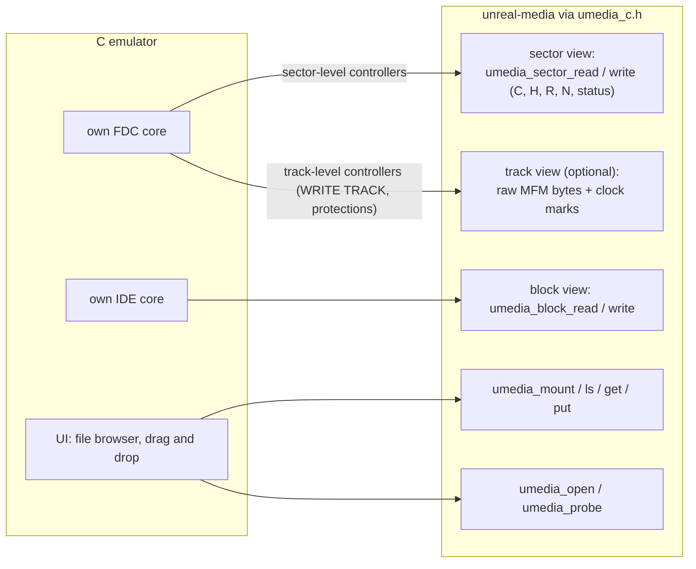
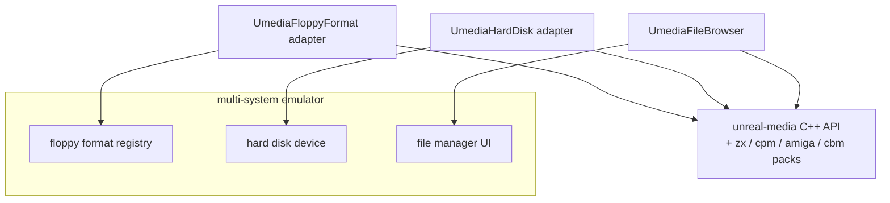
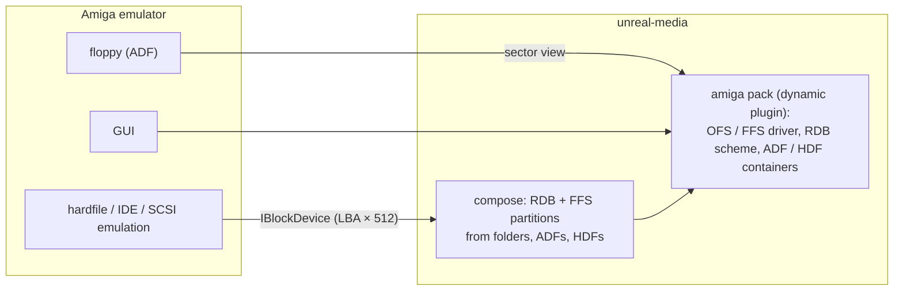
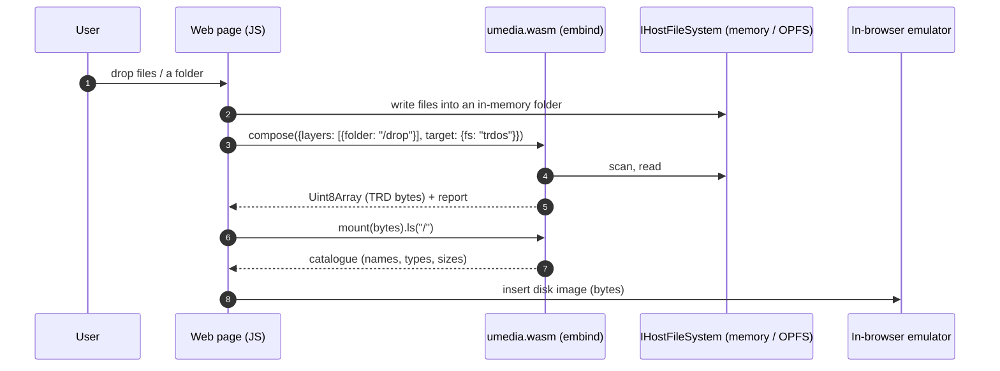

# Media library: reference integrations

| | |
|---|---|
| **Date** | 2026-10-05 |
| **Status** | Plan for review |
| **Usage schemes and plugins** | [plugins-and-usage.md](plugins-and-usage.md) (U1-U9, packs, the C ABI) |
| **Delivered in** | phase X12 of [extraction-plan.md](extraction-plan.md) |

## 0. Summary

Nine reference integrations, one per common kind of host. Each one is designed here and built as a
**working sample** under `libs/unreal-media/samples/<name>/`. A sample is a small, self-contained
program with its own README and a CI job, and it is the tested proof that its usage scheme works.

The samples are generic shapes, not patches to other projects. The examples name typical members
of each emulator family so the shape is recognisable; turning a sample into a contribution to a
specific emulator is up to that project.

| # | Host kind | Scheme | Interface used | Packs | Sample | Days |
|---|---|---|---|---|---|---|
| **R1** | unreal-ng (C++, full manager) | U1 | C++ ports + slots | zx, cpm | the emulator itself | 0 (X5-X6) |
| **R2** | C emulator with its own FDC and IDE (Fuse / ZEsarUX type) | U2 + U3 | C facade | zx (static) | `samples/c-emulator-fdc` | 5 |
| **R3** | Multi-system C++ emulator with an image-format framework (MAME type) | U2 + U3 | C++ adapters to the host's format / device interfaces | zx, cpm, + any | `samples/format-provider` | 6 |
| **R4** | Amiga emulator (WinUAE / FS-UAE type) | U3 + U4 | C facade or C++; RDB + FFS | amiga (dynamic plugin) | `samples/amiga-hardfile` | 5 |
| **R5** | Web emulator / tool (JS + WASM) | U7 | `umedia.js` (embind over the C++ API) | zx, cpm (static, in the WASM) | `samples/web-drop-zone` | 6 |
| **R6** | FPGA ecosystem (ZX-Next, ZX-Evo, MiSTer-style cores) | U4 + U5 | CLI + descriptors | zx, core FAT | `samples/sd-card-builder` | 3 |
| **R7** | Homebrew toolchain (sjasmplus / z88dk / CMake / CI) | U5 | CMake functions + CLI; a CI action | zx, cpm | `samples/toolchain` | 4 |
| **R8** | Preservation / catalogue service (zx-meta-db type, PLAN #86) | U6 | Python module | all, + process plugins | `samples/catalogue-indexer` | 4 |
| **R9** | Mobile emulator app (iOS / Android) | U8 | C++ static library, `IHostFileSystem` over the sandbox | zx | `samples/mobile-host` (desktop-testable core + platform notes) | 5 |
| | **Total** | | | | | **38** |

## R1 — unreal-ng (the in-tree reference)

The emulator is scheme U1, and the extraction plan delivers it (X5, X6). It is the reference for
the ports and slot contracts in [api-and-integration.md](api-and-integration.md).

## R2 — C emulator with its own FDC and hard-disk model

**Shape:** a C codebase with its own WD1793 / uPD765 and its own IDE emulation, and a few image
formats of its own. It wants every floppy format, TR-DOS / +3 file access for its UI, and
CHD / host folders for its hard disk.



**Integration steps:**

1. Replace the emulator's image loaders with `umedia_open(path)`. Keep its own formats as a
   fallback during the transition.
2. A sector-level FDC asks `umedia_sector_read(medium, c, h, r, n, buf, &status)`. A track-level
   FDC reads `umedia_track_raw(medium, c, h, &bytes, &clockmarks)` and writes the track back.
3. The IDE core opens a CHD, a VHD or a host folder as a block view. A folder becomes a FAT volume
   through `umedia_compose_folder(path, "fat16")`.
4. The UI's file browser mounts the medium and lists, extracts and adds files.
5. On eject or save, call `umedia_save(medium, NULL)`: the container is written back in its format,
   or retargeted to UDI if the image needs it.

```c
umedia_medium* m = NULL;
if (umedia_open("game.trd", UMEDIA_ACCESS_SESSION, &m) == UMEDIA_OK) {
    uint8_t sector[256]; umedia_sector_status st;
    umedia_sector_read(m, 0, 0, 9, 1, sector, sizeof sector, &st);   /* TR-DOS sector 9 */
    umedia_volume* v = NULL;
    umedia_mount(m, NULL /* auto */, &v);
    umedia_ls(v, "/", print_entry, NULL);
    umedia_close(m);
}
```

**Sample:** a 400-line C program with a toy sector-level "FDC". It lists, reads and writes sectors,
mounts and lists files, and round-trips TRD → UDI and DSK → DSK. CI compiles it as C99 with gcc,
clang and MSVC.

## R3 — Multi-system emulator with an image-format framework

**Shape:** a large C++ emulator with its own "floppy image format" and "hard disk image" interfaces
(MAME type). The library plugs in as **a provider of formats and file access**.

| Host interface (typical) | Adapter in the sample | Library side |
|---|---|---|
| floppy image format: identify / load / save over a track model | `UmediaFloppyFormat`: `identify` → container probe; `load` → `DiskImage` → host tracks (cells or MFM bytes with sync marks); `save` → the reverse | L1 floppy + packs |
| hard disk image device | `UmediaHardDisk`: CHD stays native; VHD, HDF and folder-as-FAT come from the library's `IBlockDevice` | L1 block, L4 compose |
| software list / file manager (host UI) | `UmediaFileBrowser` over `IVolume` | L3 |



**Key point:** the library's `DiskImage` keeps raw MFM / FM bytes with clock marks and weak bits.
The adapter converts them to and from the host's track model **without going through sectors**, so
copy-protected disks survive.

**Sample:** a mock "host format registry" with the adapter and conversion tests (TRD / UDI / HFE /
SCP round trips through the mock track model) and a hard-disk mock reading a folder composite.

## R4 — Amiga emulator: hardfiles and directories

**Shape:** an Amiga emulator with ADF floppies, RDB hardfiles, and a native "directory as a drive"
file system handler. What it gains from the library:

- **RDB hardfiles built from folders and layers** (multi-source composition with an FFS builder):
  boot from a hardfile whose `Work:` partition is a host folder, without a file-system handler.
- **ADF tooling**: list, extract, add and convert in its UI.



```yaml
# workbench.ucompose.yaml
version: 1
target: {kind: block, partition: rdb, size: 512MiB}
partitions:
  - {fs: amiga-ffs, name: DH0, bootPri: 0, compose: {layers: [{source: {image: wb31.hdf, partition: 1}}]}}
  - {fs: amiga-ffs, name: DH1, compose: {layers: [{source: {folder: ~/amiga/work}}]}}
```

**What this proves:**

- the plugin path: the Amiga pack is a **dynamic C-ABI plugin**, not linked into the core;
- a non-MBR partition scheme (RDB);
- FFS synthesis from folders;
- name rules for 30 Latin-1 characters with Amiga metadata (protection bits, comments) through the
  `MetaBag`.

**Sample:** a CLI that builds the descriptor above into an HDF and verifies it with the oracle
(`xdftool`). The plugin is loaded from `UMEDIA_PLUGIN_PATH`.

## R5 — Web emulator / tool (JS + WASM)

**Shape:** a browser page or web emulator. The user drops files (TAP, TRD, a folder of `.$C`
files). The page offers "make a TRD", "make an SD image", "show the catalogue", and feeds the
result to an in-browser emulator.



```js
import createUmedia from "umedia";
const um = await createUmedia();
const fs = um.memoryFs();                     // IHostFileSystem in memory
fs.writeFile("/drop/game.$C", bytes);
const trd = um.compose({ target: { fs: "trdos" }, layers: [{ source: { folder: "/drop" } }] }, { hostFs: fs });
const vol = um.open(trd.bytes).mount();
console.table(vol.ls("/").map(e => ({ name: e.name, type: e.zx?.type, size: e.size })));
```

**Constraints:**

- No threads are needed: builds run synchronously in a Web Worker.
- No dynamic plugins: the packs are linked statically into the WASM.
- `IHostFileSystem` is backed by memory or the browser's private file system (OPFS).
- Size budget: core + ZX pack ≤ 1.5 MB gzip, without CHD codecs (an optional second WASM module).

**Sample:** a static HTML page with a drop zone, a catalogue table and "download TRD / TAP / SD
image" buttons. CI builds it with Emscripten and runs headless browser tests (Playwright, which is
available in the CI image).

## R6 — FPGA ecosystem: preparing SD cards

**Shape:** users of FPGA machines (ZX Spectrum Next, ZX-Evo / TS-Conf, MiSTer-style cores) prepare
SD cards on a PC. The cards hold the firmware layout, OS files and collections of TRD / TAP / SNA.

```yaml
# next-sd.ucompose.yaml
version: 1
target: {kind: block, fs: fat32, size: 4GiB, label: NEXT, partition: mbr}
layers:
  - {name: distro, source: {image: tbblue-distro.img, partition: 1}}     # the official distribution as the base (graft)
  - {name: games,  source: {folder: ~/zx/games}, mount: /GAMES, include: ["*.tap", "*.tzx", "*.sna", "*.nex"]}
  - {name: mine,   source: {folder: ./build/out}, mount: /DEV}
```

```
umedia compose next-sd.ucompose.yaml --out /dev/sdX --strategy flat     # or --out card.img
umedia ls card.img:/GAMES -l
```

**Sample:** descriptors for three platforms (Next FAT32 with the firmware rules of the storage
design's integration-next.md, ZX-Evo FAT16 / FAT32, TS-Conf FAT32 from sector 0). It includes a
validator run that checks each platform's firmware constraints: the partition in entry 0, cluster
counts, no LFN where the firmware ignores them. Writing to a real card is documented, not run in CI.

## R7 — Homebrew toolchain

**Shape:** a ZX project built with sjasmplus or z88dk under CMake or Make. It wants
`build/game.trd`, `build/game.tap` and an SD image on every build, and the same in CI.

```cmake
find_package(UnrealMedia REQUIRED COMPONENTS core pack-zx)
umedia_add_image(game_trd
    OUTPUT  ${CMAKE_BINARY_DIR}/game.trd
    FS      trdos
    FILES   boot.$B ${CMAKE_BINARY_DIR}/game.bin:CODE:24576 intro.scr
    LABEL   "MYGAME")
umedia_add_image(game_tap OUTPUT ${CMAKE_BINARY_DIR}/game.tap FS tape FROM game_trd)   # convert
umedia_add_image(sd_card  DESCRIPTOR ${CMAKE_SOURCE_DIR}/sd.ucompose.yaml OUTPUT ${CMAKE_BINARY_DIR}/sd.img)
```

- `umedia_add_image` is a CMake function shipped with the package. It calls the `umedia` CLI with
  proper dependencies, so the image rebuilds when an input changes.
- A GitHub Action (`umedia/setup` + `umedia compose`) does the same in CI.

**Sample:** a tiny assembler project (pre-assembled binaries, so the sample needs no assembler)
with CMake, a Makefile and a CI workflow file. The test loads the produced TRD and TAP in
unreal-ng headlessly and checks the catalogue.

## R8 — Preservation and catalogue service

**Shape:** a service that indexes tens of thousands of images (the planned zx-meta-db, PLAN #86, is
this kind). For every image it needs:

- the container and file system;
- the list of files with ZX headers;
- content hashes per file;
- protection hints;
- damaged sectors.

```python
import umedia, json, pathlib
umedia.plugins.enable(["/opt/umedia/plugins"])           # extra packs, incl. process plugins
for path in pathlib.Path("corpus").rglob("*"):
    try:
        img = umedia.open(path)
    except umedia.Unsupported:
        continue
    rec = {"file": str(path), "container": img.format, "probe": img.probe()}
    for vol in img.volumes():                             # every partition / file system found
        rec.setdefault("volumes", []).append({
            "fs": vol.driver, "dialect": vol.dialect, "check": vol.check().summary,
            "files": [{"name": e.name, "zx": e.meta.zx and e.meta.zx.as_dict(),
                       "sha1": vol.hash(e.path, "sha1")} for e in vol.walk("/")]})
    print(json.dumps(rec))
```

- Batch mode is read-only. Every operation has a per-image time budget (`umedia.limits`) so that a
  hostile image cannot stall the batch.
- Process plugins isolate crashes.

**Sample:** the indexer above over `testdata/` and a small corpus, with a JSON Lines output
checked against a golden file.

## R9 — Mobile emulator app

**Shape:** an iOS / Android emulator app (the repository has an iOS client branch). Files arrive
through the system document picker and live in the app sandbox, and there is no free file-system
access. It needs scheme U8:

- the static C++ library;
- `IHostFileSystem` over the sandbox and security-scoped URLs (iOS) or the Storage Access Framework
  (Android);
- the ZX pack;
- composition of a picked folder into a TRD or SD image.

| Platform piece | Implementation in the sample |
|---|---|
| `IHostFileSystem` | iOS: Objective-C++ wrapper over `NSFileManager` + `startAccessingSecurityScopedResource`; Android: JNI wrapper over SAF file descriptors (documented, compiled in CI with the NDK) |
| Threading | builds on a background queue with progress and cancel (the library's existing `cancelRequested` / `onProgress`) |
| UI | out of scope: the sample is a headless core with a test harness runnable on desktop, plus the two platform wrappers |

## Plan for X12

| Item | Days |
|---|---|
| Plugin system: `PluginLoader` (dynamic C ABI: load, ABI check, adapters), `ProcessPluginHost` (JSON-RPC + shared memory), discovery and enable rules, `umedia plugins` command, fuzzing of the boundary | 10 |
| C facade `umedia_c.h` + `libunrealmedia-c` (open, probe, views, mount, ls / get / put, compose, save) with C tests | 6 |
| `IHostFileSystem` port (default OS implementation, memory implementation) — done in X1 for the base; here the memory / OPFS variants | 2 |
| Emscripten build + embind bindings (`umedia.js`, npm package layout) | 5 |
| CMake package functions (`umedia_add_image`) and a CI action | 2 |
| Reference samples R2-R9 (table in §0) | 38 |
| Docs: "integrating unreal-media" guide with one page per scheme | 3 |
| **Total** | **66** |

X12 depends on X7 (the VFS core and the ZX / CP/M packs). The Amiga sample (R4) needs the Amiga
pack (X9b) or a minimal FFS driver written for the sample (+8 days, if the pack is not done
first). The samples are independent of each other and parallelize one per stream.
