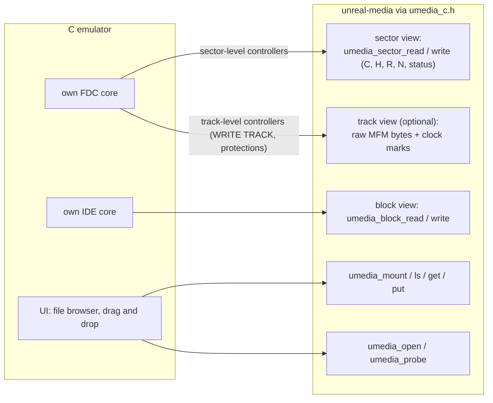
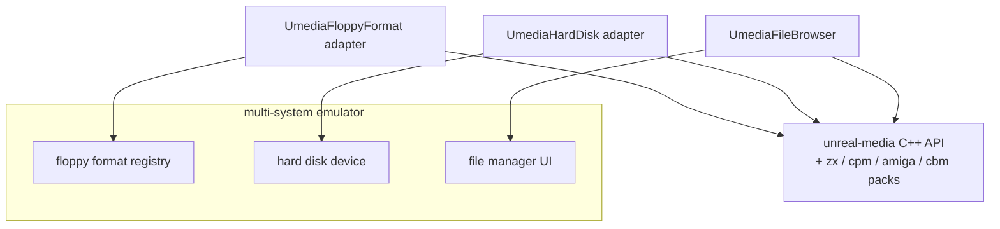
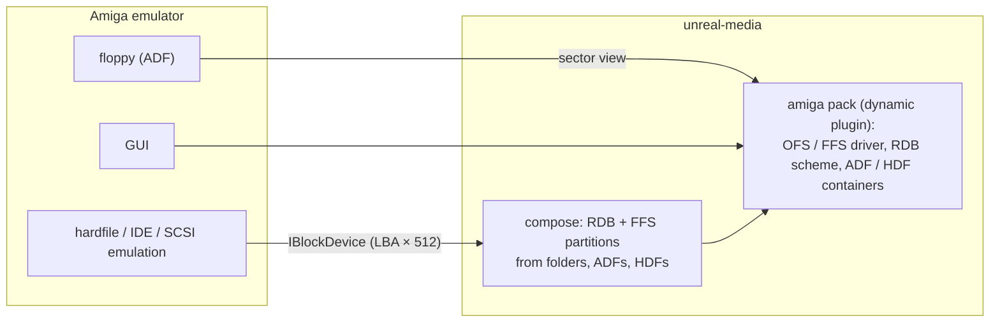
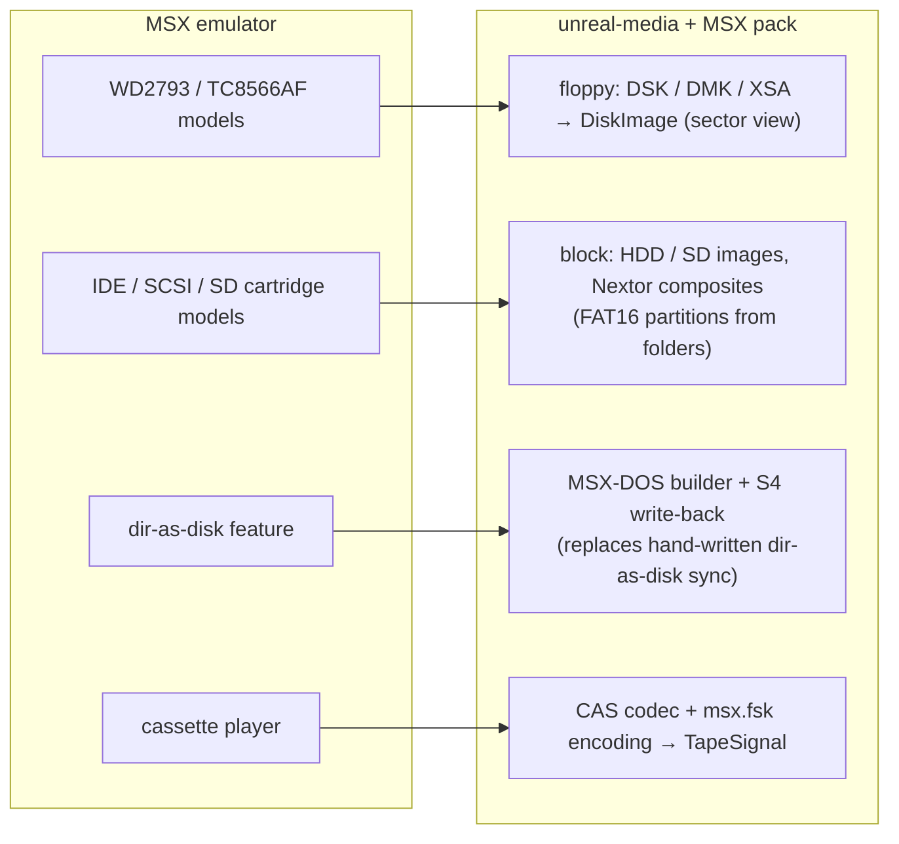
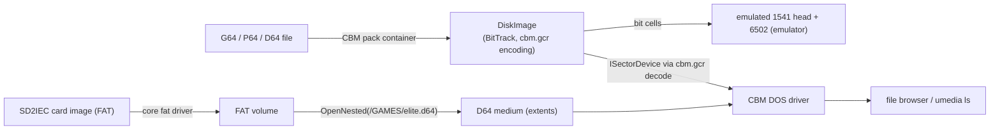
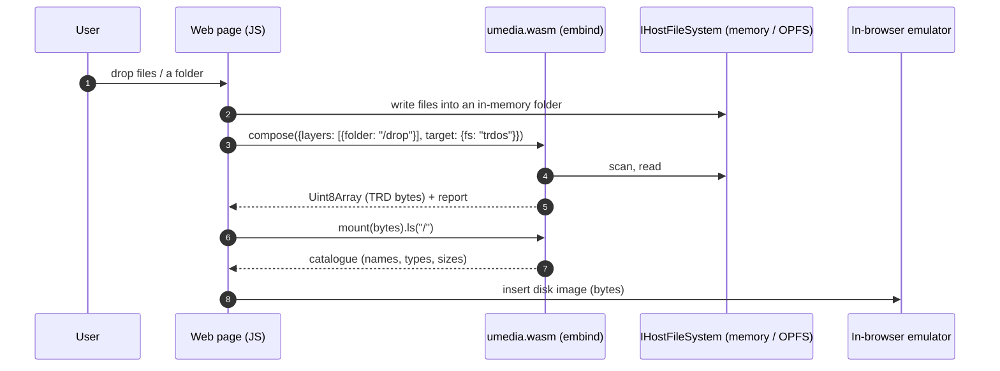

# Media library: reference integrations

| | |
|---|---|
| **Date** | 2026-10-05 |
| **Status** | Plan for review |
| **Usage schemes and plugins** | [plugins-and-usage.md](plugins-and-usage.md) (U1-U9, packs, the C ABI) |
| **Delivered in** | phase X12 of [extraction-plan.md](extraction-plan.md) |

## 0. Summary

Fifteen reference integrations, one per common kind of host; R5-R10 show the approach scaling to six more platforms with both floppies and hard disks. Each one is designed here and built as a
**working sample** under `libs/unreal-media/samples/<name>/`. A sample is a small, self-contained
program with its own README and a CI job, and it is the tested proof that its usage scheme works.

The samples are generic shapes, not patches to other projects. The examples name typical members
of each emulator family so the shape is recognisable; turning a sample into a contribution to a
specific emulator is up to that project.

| # | Host kind | Scheme | Interface used | Packs | Sample | Days |
|---|---|---|---|---|---|---|
| **R1** | unreal-ng (C++, full manager) | U1 | C++ ports + slots | zx, cpm | the emulator itself | 0 (X5-X6) |
| **R2** | C emulator with its own FDC and IDE (Fuse / ZEsarUX type) | U2 + U3 | C facade | zx (static) | `samples/c-emulator-fdc` | 5 |
| **R3** | Multi-system C++ emulator with an image-format framework (MAME type) | U2 + U3 | C++ adapters to the host's format / device interfaces | zx, cpm, + any | `samples/format-provider` | 6 |
| **R4** | Amiga emulator (WinUAE / FS-UAE type) | U3 + U4 | C facade or C++; RDB + FFS | amiga (dynamic plugin) | `samples/amiga-hardfile` | 5 |
| **R5** | MSX (openMSX type): WD2793 / TC8566AF floppies, IDE / SCSI / SD with Nextor | U2 + U3 + U4 | C++ | msx | `samples/msx-storage` | 5 |
| **R6** | Amstrad CPC: uPD765 floppies (AMSDOS / CP/M), IDE / M4 SD | U2 + U3 | C facade or C++ | cpc, cpm | `samples/cpc-storage` | 4 |
| **R7** | Atari ST (Hatari type): WD1772 floppies (ST / MSA / STX), ACSI / SCSI / IDE with AHDI | U2 + U3 | C facade | atari | `samples/atari-st-storage` | 5 |
| **R8** | Commodore 64 (VICE type): GCR drives (D64 / G64 / P64), IDE64, SD2IEC | U2 + U3 + U4 | C facade | cbm | `samples/c64-storage` | 6 |
| **R9** | BBC Micro (B-em / BeebEm type): 8271 / 1770 floppies (DFS / ADFS), SCSI / IDE, MMC with MMFS | U2 + U3 | C facade or C++ | bbc | `samples/bbc-storage` | 5 |
| **R10** | Apple II (AppleWin type): Disk II GCR (DSK / PO / NIB / WOZ), ProDOS hard disks | U2 + U3 + U4 | C++ | apple2 | `samples/apple2-storage` | 6 |
| **R11** | Web emulator / tool (JS + WASM) | U7 | `umedia.js` (embind over the C++ API) | zx, cpm (static, in the WASM) | `samples/web-drop-zone` | 6 |
| **R12** | FPGA ecosystem (ZX-Next, ZX-Evo, MiSTer-style cores) | U4 + U5 | CLI + descriptors | zx, core FAT | `samples/sd-card-builder` | 3 |
| **R13** | Homebrew toolchain (sjasmplus / z88dk / CMake / CI) | U5 | CMake functions + CLI; a CI action | zx, cpm | `samples/toolchain` | 4 |
| **R14** | Preservation / catalogue service (zx-meta-db type, PLAN #86) | U6 | Python module | all, + process plugins | `samples/catalogue-indexer` | 4 |
| **R15** | Mobile emulator app (iOS / Android) | U8 | C++ static library, `IHostFileSystem` over the sandbox | zx | `samples/mobile-host` (desktop-testable core + platform notes) | 5 |
| | **Total** | | | | | **69** (R2-R4, R11-R15: 38; R5-R10: 31) |

## R1 — unreal-ng (the in-tree reference)

The emulator is scheme U1, and the extraction plan delivers it (X5, X6). It is the reference for
the ports and slot contracts in [api-and-integration.md](api-and-integration.md).

## R2 — C emulator with its own FDC and hard-disk model

**Shape:** a C codebase with its own WD1793 / uPD765 and its own IDE emulation, and a few image
formats of its own. It wants every floppy format, TR-DOS / +3 file access for its UI, and
CHD / host folders for its hard disk.



**Integration steps:**

1. Replace the emulator's image loaders with `umedia_open(path)`. Keep its own formats as a
   fallback during the transition.
2. A sector-level FDC asks `umedia_sector_read(medium, c, h, r, n, buf, &status)`. A track-level
   FDC reads `umedia_track_raw(medium, c, h, &bytes, &clockmarks)` and writes the track back.
3. The IDE core opens a CHD, a VHD or a host folder as a block view. A folder becomes a FAT volume
   through `umedia_compose_folder(path, "fat16")`.
4. The UI's file browser mounts the medium and lists, extracts and adds files.
5. On eject or save, call `umedia_save(medium, NULL)`: the container is written back in its format,
   or retargeted to UDI if the image needs it.

```c
umedia_medium* m = NULL;
if (umedia_open("game.trd", UMEDIA_ACCESS_SESSION, &m) == UMEDIA_OK) {
    uint8_t sector[256]; umedia_sector_status st;
    umedia_sector_read(m, 0, 0, 9, 1, sector, sizeof sector, &st);   /* TR-DOS sector 9 */
    umedia_volume* v = NULL;
    umedia_mount(m, NULL /* auto */, &v);
    umedia_ls(v, "/", print_entry, NULL);
    umedia_close(m);
}
```

**Sample:** a 400-line C program with a toy sector-level "FDC". It lists, reads and writes sectors,
mounts and lists files, and round-trips TRD → UDI and DSK → DSK. CI compiles it as C99 with gcc,
clang and MSVC.

## R3 — Multi-system emulator with an image-format framework

**Shape:** a large C++ emulator with its own "floppy image format" and "hard disk image" interfaces
(MAME type). The library plugs in as **a provider of formats and file access**.

| Host interface (typical) | Adapter in the sample | Library side |
|---|---|---|
| floppy image format: identify / load / save over a track model | `UmediaFloppyFormat`: `identify` → container probe; `load` → `DiskImage` → host tracks (cells or MFM bytes with sync marks); `save` → the reverse | L1 floppy + packs |
| hard disk image device | `UmediaHardDisk`: CHD stays native; VHD, HDF and folder-as-FAT come from the library's `IBlockDevice` | L1 block, L4 compose |
| software list / file manager (host UI) | `UmediaFileBrowser` over `IVolume` | L3 |



**Key point:** the library's `DiskImage` keeps raw MFM / FM bytes with clock marks and weak bits.
The adapter converts them to and from the host's track model **without going through sectors**, so
copy-protected disks survive.

**Sample:** a mock "host format registry" with the adapter and conversion tests (TRD / UDI / HFE /
SCP round trips through the mock track model) and a hard-disk mock reading a folder composite.

## R4 — Amiga emulator: hardfiles and directories

**Shape:** an Amiga emulator with ADF floppies, RDB hardfiles, and a native "directory as a drive"
file system handler. What it gains from the library:

- **RDB hardfiles built from folders and layers** (multi-source composition with an FFS builder):
  boot from a hardfile whose `Work:` partition is a host folder, without a file-system handler.
- **ADF tooling**: list, extract, add and convert in its UI.



```yaml
# workbench.ucompose.yaml
version: 1
target: {kind: block, partition: rdb, size: 512MiB}
partitions:
  - {fs: amiga-ffs, name: DH0, bootPri: 0, compose: {layers: [{source: {image: wb31.hdf, partition: 1}}]}}
  - {fs: amiga-ffs, name: DH1, compose: {layers: [{source: {folder: ~/amiga/work}}]}}
```

**What this proves:**

- the plugin path: the Amiga pack is a **dynamic C-ABI plugin**, not linked into the core;
- a non-MBR partition scheme (RDB);
- FFS synthesis from folders;
- name rules for 30 Latin-1 characters with Amiga metadata (protection bits, comments) through the
  `MetaBag`.

**Sample:** a CLI that builds the descriptor above into an HDF and verifies it with the oracle
(`xdftool`). The plugin is loaded from `UMEDIA_PLUGIN_PATH`.

## Platform integrations R5-R10: floppies and hard disks on six more platforms

R5-R10 show that the approach scales. Each is a well-known platform with **both** a floppy
subsystem and a hard-disk or card subsystem, and each brings something the ZX work did not need.

| Proof point | Where |
|---|---|
| A different floppy **track encoding** (GCR instead of MFM) | C64 (R8), Apple II (R10) |
| **Sector-order** variants of one container | Apple II DOS order vs ProDOS order (R10) |
| **One file system on both a floppy and a hard disk** | MSX-DOS 2 / Nextor (R5), ADFS (R9), ProDOS (R10), TOS FAT (R7) |
| **Platform partition tables** | AHDI / ICD (R7), Nextor's MBR rules (R5) |
| **Big logical sectors** on a FAT dialect | TOS FAT16 (R7) |
| **Media inside media**: an image stored as a file inside another volume | SD2IEC D64 on FAT (R8), MMB with many DFS disks (R9), disk images on Nextor / M4 / SD cards (R5, R6) |
| **Host folder presented as the guest's own file system** (what openMSX DirAsDSK and Hatari's GEMDOS drive do by hand) | R5, R7: the library's builders + S4 write-back |
| **Copy protection kept** through bit-level containers | STX (R7), G64 / P64 (R8), WOZ (R10) |
| **Tape codecs per platform** | CAS / FSK (R5), CDT (R6), C64 TAP / T64 (R8), UEF (R9) |

These integrations are designed like R2-R4: a typical emulator of the platform, the integration
points, the pack the library needs, a composition example, and a sample. The format facts in the
tables are the planning basis; each pack verifies them against its references in its design note
before coding.

Two **core extensions** come with these platforms:

- **Bit-level tracks and track encodings.** `DiskImage` today stores MFM / FM bytes with clock
  marks. GCR platforms (C64, Apple II) and flux containers (WOZ, G64, P64, STX) need tracks as
  **bit cells**. The core gets a `BitTrack` form (bit cells + optional timing), and an
  `ITrackEncoding` extension point (sectors ↔ track bits: IBM MFM / FM in the core; CBM GCR, Apple
  6-and-2 GCR and Amiga MFM in packs). This is the same idea as the tape encodings
  ([plugins-and-usage.md](plugins-and-usage.md) §2.2).
- **Nested media.** `OpenNested(volume, path)` opens an image file stored inside a mounted volume
  as a medium of its own. It reads through the file's extents (zero-copy), and writes go through
  the outer volume. SD2IEC, MMB, Nextor and M4 all need it.

### R5 — MSX (openMSX type)

**Platform storage:**

| Subsystem | Hardware | Media / containers | File systems |
|---|---|---|---|
| Floppy | WD2793 (Philips, Sony, …), TC8566AF (Panasonic, turbo R) | 3.5" 360 / 720 KB; DSK (raw), DMK (track-level), XSA (compressed DSK) | MSX-DOS 1 (FAT12; disks without a BPB are recognized by the media byte), MSX-DOS 2 (FAT12 with subdirectories) |
| Hard disk / card | Sunrise IDE, MegaSCSI / Gouda SCSI, SD on MegaFlashROM SCC+ SD / Carnivore2-class cartridges | raw HDD / SD images | Nextor: FAT12 / FAT16, MBR primary and extended partitions; disk images mounted from FAT ("disk emulation mode") |
| Tape | cassette | CAS, WAV | MSX BIOS headers (binary, BASIC, ASCII), FSK 1200 / 2400 baud |

**Typical emulator:** C++, its own FDC and IDE / SCSI / SD models, image loading in its own code,
and a "directory as a disk" feature (openMSX: DirAsDSK) that maps a host folder to an MSX-DOS disk
and syncs writes back. Scheme **U2 + U3 + U4**.



```yaml
# nextor-sd.ucompose.yaml: an SD card for a Nextor cartridge with two partitions
version: 1
target: {kind: block, partition: mbr, size: 2GiB}
partitions:
  - {fs: fat16, compose: {layers: [{source: {folder: ~/msx/system}}]}, size: 32MiB}   # Nextor boots from the first FAT16 partition
  - {fs: fat16, compose: {layers: [{source: {folder: ~/msx/games}, include: ["*.dsk", "*.rom"]}]}}
```

**MSX pack:** DSK geometry and media-byte rules, the MSX-DOS 1 / 2 dialects of the core `fat`
driver, DMK and XSA containers, Nextor partition rules, the CAS codec and `msx.fsk` encoding.
**10 days.**
**Sample `samples/msx-storage`:** loads DSK / DMK / XSA into a toy WD2793 sector model. It builds
a 720 KB MSX-DOS 2 disk from a folder and syncs guest writes back (S4), and builds the Nextor SD
card above. Checked by the MSX-DOS dialect tests and mtools. **5 days.**

### R6 — Amstrad CPC

| Subsystem | Hardware | Media / containers | File systems |
|---|---|---|---|
| Floppy | uPD765A (the Amstrad FDC), 3" drive A, 3.5" / 5.25" drive B | DSK / EDSK, HFE | AMSDOS (CP/M 2.2 directory, 128-byte AMSDOS header) in the DATA (sector ids C1-C9), SYSTEM (41-49) and IBM (01-08) formats; CP/M Plus; ROMDOS / ParaDOS extended formats |
| Hard disk / card | IDE (Symbiface II, X-Mass), SD (M4 board), with UniDOS / the boards' ROMs | raw images | FAT16 / FAT32 (M4, X-Mass, Symbiface II), with DSK images on the card |
| Tape | cassette | CDT (TZX-structured), WAV | CPC ROM loader blocks |

**Typical emulator:** C / C++, uPD765 model, DSK / EDSK loader, IDE / M4 board emulation in some.
Scheme **U2 + U3**.

**What it proves:** the CP/M pack serves a second platform unchanged, with the CPC disk definitions
added as data. The ZX +3 and the CPC share the uPD765, EDSK and CP/M. The CDT codec reuses the TZX
block parser with the CPC encoding.

**CPC pack:** disk definitions for DATA / SYSTEM / IBM and the common extended formats, the
AMSDOS header layer (like `plus3dos`), the CDT codec and `cpc.rom` encoding. **5.5 days.**
**Sample `samples/cpc-storage`:**

- builds an AMSDOS DATA disk from a folder (headers from the manifest);
- converts a CDT to a DSK by copying files through the pivot;
- makes an M4 SD card with DSK images on it.

Checked by cpmtools with the CPC definitions. **4 days.**

### R7 — Atari ST (Hatari type)

| Subsystem | Hardware | Media / containers | File systems |
|---|---|---|---|
| Floppy | WD1772 | ST (raw), MSA (compressed), DIM, STX (Pasti: timing and protection) | TOS FAT12 dialect: 9-11 sectors per track, boot-sector checksum `#1234` marks an executable boot sector |
| Hard disk | ACSI, SCSI (TT), IDE (Falcon) | raw images | **AHDI** partition table (root sector, partitions `GEM` / `BGM` / `XGM`), ICD extensions; TOS FAT16 with **big logical sectors** (TOS keeps 16-bit sector counts by growing the logical sector to 1-16 KB) |
| Host folder | — | — | emulators map a host folder to a GEMDOS drive by intercepting GEMDOS calls |

**Typical emulator:** C, WD1772 and ACSI / SCSI / IDE models, image loaders, and a GEMDOS
host-drive feature. Scheme **U2 + U3**.

**What it proves:**

- a second partition scheme (AHDI / ICD);
- a FAT dialect whose logical sector differs from the physical one;
- a bit-level protected container (STX);
- a **sector-level alternative to GEMDOS interception**: a composite TOS FAT16 hard disk built from
  folders, which also works for software that bypasses GEMDOS.

```yaml
# st-hd.ucompose.yaml
version: 1
target: {kind: block, partition: ahdi, size: 512MiB}
partitions:
  - {fs: fat16, dialect: tos, compose: {layers: [{source: {image: tos-system.img, partition: 1}}]}}          # C:
  - {fs: fat16, dialect: tos, compose: {layers: [{source: {folder: ~/atari/games}}]}}                       # D:
```

**Atari pack:** ST / MSA / DIM / STX containers, the TOS dialect of `fat` (boot checksum, big
logical sectors), AHDI and ICD schemes. **14 days** (STX alone ~6).
**Sample `samples/atari-st-storage`:** a hard disk with AHDI + two TOS partitions from folders,
an MSA → ST conversion, and a list of an STX image. Checked by mtools (FAT layer) and the TOS
dialect tests. **5 days.**

### R8 — Commodore 64 (VICE type)

| Subsystem | Hardware | Media / containers | File systems |
|---|---|---|---|
| Floppy | 1541 / 1571 / 1581 drives with their own 6502 (the emulator runs the drive's CPU) | D64 / D71 / D81 (sector images), **G64 / P64** (GCR bit / flux level, protections) | CBM DOS 2.6 / 3.0 / 10: BAM, directory chain, PETSCII names, PRG / SEQ / USR / REL / DEL; 1581 partitions |
| Hard disk / card | IDE64, CMD HD, **SD2IEC** | raw images; SD2IEC: FAT card with D64 / D71 / D81 files on it | IDEDOS file system (IDE64), CMD native partitions, FAT (SD2IEC) with **nested disk images** |
| Tape | Datasette | C64 TAP (pulse widths), T64 (archive) | CBM tape headers, CBM pulse encoding |

**Typical emulator:** C, true drive emulation (GCR at the head), image loaders in its own code,
SD2IEC / IDE64 / CMD HD emulation in some. Scheme **U2 + U3 + U4**.

**What it proves:**

- **GCR track encoding** (`cbm.gcr`) under the same `DiskImage` / `BitTrack` model;
- the drive emulator can read **bit cells** (the host side never needs sectors) while the file
  browser reads **sectors** through the CBM DOS driver;
- **nested media** (SD2IEC: a FAT volume holding D64 files mounted as disks);
- a tape platform with a different signal (pulse widths, not ROM-standard ZX pulses).



**CBM pack:**

| Item | Days |
|---|---|
| CBM DOS (D64 / D71 / D81) | 10 |
| G64 / P64 containers + `cbm.gcr` | 7 |
| C64 TAP codec, T64 archive, `cbm.pulse` encoding | 4 |
| IDEDOS (research + read) | 8 |
| SD2IEC conventions | 2 |
| **Total** | **31** |

**Sample `samples/c64-storage`:** D64 ↔ G64 round trip (bit-exact for unprotected disks), CBM DOS
list / put checked by VICE `c1541`, an SD2IEC card from a folder of D64s (nested mount), and a
C64 TAP → T64 conversion. **6 days.**

### R9 — BBC Micro (B-em / BeebEm type)

| Subsystem | Hardware | Media / containers | File systems |
|---|---|---|---|
| Floppy | Intel 8271 (FM) or WD1770 (MFM) | SSD / DSD (DFS sector images), ADF / ADL (ADFS), HFE | **Acorn DFS** (31 files, 2-sector catalogue; Watford / Opus variants with 62 files), **ADFS** (hierarchical, free-space map; S / M / L floppies) |
| Hard disk / card | SCSI Winchester (ADFS), IDE (ADFS), **MMC / SD with MMFS** | raw images; `BEEB.MMB` (a container of up to 511 DFS disks) on a FAT card | ADFS on hard disks; MMFS = DFS disks inside an MMB inside FAT |
| Tape | cassette | UEF (chunked), CSW | Acorn tape blocks, 1200 / 300 baud FSK |

**Typical emulator:** C / C++, 8271 / 1770 models, SCSI / IDE / MMC in some. Scheme **U2 + U3**.

**What it proves:**

- **FM and MFM** in the same platform (the 8271 is FM-only), with the existing `DiskImage` FM
  support;
- **one file system (ADFS) on floppy and hard disk** through two views;
- **two levels of nesting**: DFS images in an MMB in a FAT volume.

**BBC pack:**

| Item | Days |
|---|---|
| DFS + variants | 5 |
| ADFS (floppy maps, hard-disk map) | 10 |
| SSD / DSD / ADF / ADL | 1.5 |
| MMB container | 2 |
| UEF codec + `acorn.fsk` | 3 |
| **Total** | **21.5** |

**Sample `samples/bbc-storage`:** a DFS disk from a folder, an ADFS hard disk from a folder tree, an
MMB with DFS images on a FAT SD card listed through two nesting levels, UEF → SSD. **5 days.**

### R10 — Apple II (AppleWin type)

| Subsystem | Hardware | Media / containers | File systems |
|---|---|---|---|
| Floppy | Disk II: no FDC, software GCR (6-and-2) | DSK / DO (DOS order), PO (ProDOS order), NIB (nibbles), **WOZ** (bit stream, protections) | **DOS 3.3** (VTOC, catalog sectors, track / sector lists), **ProDOS** (512-byte blocks, hierarchical) |
| Hard disk / card | SmartPort / ProDOS block devices (CFFA, hard-disk cards) | HDV, PO, 2MG | ProDOS volumes up to 32 MB, several per card |
| Tape | cassette | WAV | Apple tape format (rarely used) |

**Typical emulator:** C++, Disk II nibble-level emulation, a ProDOS block device for hard disks.
Scheme **U2 + U3 + U4**.

**What it proves:**

- the **Apple 6-and-2 GCR** track encoding (`apple.gcr62`);
- **sector-order adapters** (DOS order vs ProDOS order of the same 140 KB image) as view
  parameters, not separate drivers;
- **one driver (ProDOS) on a 140 KB floppy (sector view) and a 32 MB hard disk (block view)**;
- WOZ bit streams for protected disks.

**Apple II pack:**

| Item | Days |
|---|---|
| DO / PO order adapters | 1 |
| NIB + WOZ containers | 6 |
| `apple.gcr62` encoding | 4 |
| DOS 3.3 | 6 |
| ProDOS (sparse files, subdirectories, 2MG / HDV) | 10 |
| Multi-volume cards | 1 |
| **Total** | **28** |

**Sample `samples/apple2-storage`:** DSK ↔ PO ↔ WOZ conversions, a DOS 3.3 disk listed and written,
and a ProDOS hard disk built from a folder tree, all checked by the format tests (oracle: a
ProDOS / DOS 3.3 command-line tool where installed). **6 days.**

### Also on the list (not designed here)

| Platform | Floppy | Hard disk / card | Why interesting |
|---|---|---|---|
| SAM Coupé (SimCoupe type) | MGT / SAD / EDSK, SAMDOS / MasterDOS / BDOS | Atom / Atom Lite IDE (BDOS records), Trinity SD | closest to the ZX audience; reuses the MGT container and G+DOS-style directories |
| Atari 8-bit (Altirra type) | ATR / ATX / XFD, Atari DOS 2, MyDOS, SpartaDOS | IDE / SIDE cartridges with SpartaDOS X | another directory model and protection-aware ATX |
| PC (86Box / DOSBox type) | IMG / IMD / 86F, FAT12 | VHD, FAT16 / FAT32, ISO | mostly core already; a check that the core alone serves a mainstream platform |
| TRS-80, Oric, Thomson, PC-98 | DMK, Sedoric, … | various | the same template, demand-driven |


## R11 — Web emulator / tool (JS + WASM)

**Shape:** a browser page or web emulator. The user drops files (TAP, TRD, a folder of `.$C`
files). The page offers "make a TRD", "make an SD image", "show the catalogue", and feeds the
result to an in-browser emulator.



```js
import createUmedia from "umedia";
const um = await createUmedia();
const fs = um.memoryFs();                     // IHostFileSystem in memory
fs.writeFile("/drop/game.$C", bytes);
const trd = um.compose({ target: { fs: "trdos" }, layers: [{ source: { folder: "/drop" } }] }, { hostFs: fs });
const vol = um.open(trd.bytes).mount();
console.table(vol.ls("/").map(e => ({ name: e.name, type: e.zx?.type, size: e.size })));
```

**Constraints:**

- No threads are needed: builds run synchronously in a Web Worker.
- No dynamic plugins: the packs are linked statically into the WASM.
- `IHostFileSystem` is backed by memory or the browser's private file system (OPFS).
- Size budget: core + ZX pack ≤ 1.5 MB gzip, without CHD codecs (an optional second WASM module).

**Sample:** a static HTML page with a drop zone, a catalogue table and "download TRD / TAP / SD
image" buttons. CI builds it with Emscripten and runs headless browser tests (Playwright, which is
available in the CI image).

## R12 — FPGA ecosystem: preparing SD cards

**Shape:** users of FPGA machines (ZX Spectrum Next, ZX-Evo / TS-Conf, MiSTer-style cores) prepare
SD cards on a PC. The cards hold the firmware layout, OS files and collections of TRD / TAP / SNA.

```yaml
# next-sd.ucompose.yaml
version: 1
target: {kind: block, fs: fat32, size: 4GiB, label: NEXT, partition: mbr}
layers:
  - {name: distro, source: {image: tbblue-distro.img, partition: 1}}     # the official distribution as the base (graft)
  - {name: games,  source: {folder: ~/zx/games}, mount: /GAMES, include: ["*.tap", "*.tzx", "*.sna", "*.nex"]}
  - {name: mine,   source: {folder: ./build/out}, mount: /DEV}
```

```
umedia compose next-sd.ucompose.yaml --out /dev/sdX --strategy flat     # or --out card.img
umedia ls card.img:/GAMES -l
```

**Sample:** descriptors for three platforms (Next FAT32 with the firmware rules of the storage
design's integration-next.md, ZX-Evo FAT16 / FAT32, TS-Conf FAT32 from sector 0). It includes a
validator run that checks each platform's firmware constraints: the partition in entry 0, cluster
counts, no LFN where the firmware ignores them. Writing to a real card is documented, not run in CI.

## R13 — Homebrew toolchain

**Shape:** a ZX project built with sjasmplus or z88dk under CMake or Make. It wants
`build/game.trd`, `build/game.tap` and an SD image on every build, and the same in CI.

```cmake
find_package(UnrealMedia REQUIRED COMPONENTS core pack-zx)
umedia_add_image(game_trd
    OUTPUT  ${CMAKE_BINARY_DIR}/game.trd
    FS      trdos
    FILES   boot.$B ${CMAKE_BINARY_DIR}/game.bin:CODE:24576 intro.scr
    LABEL   "MYGAME")
umedia_add_image(game_tap OUTPUT ${CMAKE_BINARY_DIR}/game.tap FS tape FROM game_trd)   # convert
umedia_add_image(sd_card  DESCRIPTOR ${CMAKE_SOURCE_DIR}/sd.ucompose.yaml OUTPUT ${CMAKE_BINARY_DIR}/sd.img)
```

- `umedia_add_image` is a CMake function shipped with the package. It calls the `umedia` CLI with
  proper dependencies, so the image rebuilds when an input changes.
- A GitHub Action (`umedia/setup` + `umedia compose`) does the same in CI.

**Sample:** a tiny assembler project (pre-assembled binaries, so the sample needs no assembler)
with CMake, a Makefile and a CI workflow file. The test loads the produced TRD and TAP in
unreal-ng headlessly and checks the catalogue.

## R14 — Preservation and catalogue service

**Shape:** a service that indexes tens of thousands of images (the planned zx-meta-db, PLAN #86, is
this kind). For every image it needs:

- the container and file system;
- the list of files with ZX headers;
- content hashes per file;
- protection hints;
- damaged sectors.

```python
import umedia, json, pathlib
umedia.plugins.enable(["/opt/umedia/plugins"])           # extra packs, incl. process plugins
for path in pathlib.Path("corpus").rglob("*"):
    try:
        img = umedia.open(path)
    except umedia.Unsupported:
        continue
    rec = {"file": str(path), "container": img.format, "probe": img.probe()}
    for vol in img.volumes():                             # every partition / file system found
        rec.setdefault("volumes", []).append({
            "fs": vol.driver, "dialect": vol.dialect, "check": vol.check().summary,
            "files": [{"name": e.name, "zx": e.meta.zx and e.meta.zx.as_dict(),
                       "sha1": vol.hash(e.path, "sha1")} for e in vol.walk("/")]})
    print(json.dumps(rec))
```

- Batch mode is read-only. Every operation has a per-image time budget (`umedia.limits`) so that a
  hostile image cannot stall the batch.
- Process plugins isolate crashes.

**Sample:** the indexer above over `testdata/` and a small corpus, with a JSON Lines output
checked against a golden file.

## R15 — Mobile emulator app

**Shape:** an iOS / Android emulator app (the repository has an iOS client branch). Files arrive
through the system document picker and live in the app sandbox, and there is no free file-system
access. It needs scheme U8:

- the static C++ library;
- `IHostFileSystem` over the sandbox and security-scoped URLs (iOS) or the Storage Access Framework
  (Android);
- the ZX pack;
- composition of a picked folder into a TRD or SD image.

| Platform piece | Implementation in the sample |
|---|---|
| `IHostFileSystem` | iOS: Objective-C++ wrapper over `NSFileManager` + `startAccessingSecurityScopedResource`; Android: JNI wrapper over SAF file descriptors (documented, compiled in CI with the NDK) |
| Threading | builds on a background queue with progress and cancel (the library's existing `cancelRequested` / `onProgress`) |
| UI | out of scope: the sample is a headless core with a test harness runnable on desktop, plus the two platform wrappers |

## Plan for X12 and X13

**X12: the plugin system, the core extensions and the samples R2-R4, R11-R15.**

| Item | Days |
|---|---|
| Plugin system: `PluginLoader` (dynamic C ABI: load, ABI check, adapters), `ProcessPluginHost` (JSON-RPC + shared memory), discovery and enable rules, `umedia plugins` command, fuzzing of the boundary | 10 |
| C facade `umedia_c.h` + `libunrealmedia-c` (open, probe, views, mount, ls / get / put, compose, save) with C tests | 6 |
| `IHostFileSystem` memory / OPFS variants (the OS one comes with X1) | 2 |
| Core: `BitTrack` + `ITrackEncoding` extension point (IBM MFM / FM moved behind it, no behaviour change: WD1793 / uPD765 tests and floppy goldens unchanged) | 6 |
| Core: nested media (`OpenNested(volume, path)`, extents, writes through the outer volume) | 3 |
| Emscripten build + embind bindings (`umedia.js`, npm package layout) | 5 |
| CMake package functions (`umedia_add_image`) and a CI action | 2 |
| Reference samples R2-R4, R11-R15 (table in §0) | 38 |
| Docs: "integrating unreal-media" guide with one page per scheme | 3 |
| **Total** | **75** |

**X13: platform scaling, R5-R10.** One stream per platform; the platforms are independent.

| Platform | Pack | Sample | Days |
|---|---|---|---|
| MSX (R5) | 10 | 5 | 15 |
| Amstrad CPC (R6) | 5.5 | 4 | 9.5 |
| Atari ST (R7) | 14 | 5 | 19 |
| Commodore 64 (R8) | 31 | 6 | 37 |
| BBC Micro (R9) | 21.5 | 5 | 26.5 |
| Apple II (R10) | 28 | 6 | 34 |
| **Total** | **110** | **31** | **141** |

X12 depends on X7 (the VFS core and the ZX / CP/M packs). The Amiga sample (R4) needs the Amiga
pack (X9b) or a minimal FFS driver written for the sample (+8 days, if the pack is not done
first). X13 depends on X12's core extensions (bit tracks, track encodings, nested media) and the
plugin system. Packs can be built as dynamic plugins, which is itself part of the proof. The
samples are independent of each other and parallelize one per stream.
